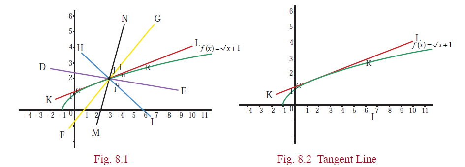
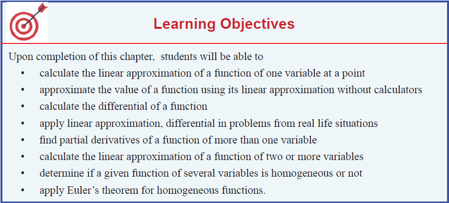



“He who hasn’t tasted bitter things hasn’t earned sweet things”

-- Gottfried Wilhelm Leibniz

# Differentials and Partial Derivatives
## Introduction

---
**Motivation**

In real life, we often deal with various functions. We need to estimate the change in a function due to a change in the independent variable.
- If a thin circular metal plate is uniformly heated, its radius increases, leading to an increase in its area. How can we estimate the area increase based on the radius change?
- Imagine a water tank in the shape of an inverted right circular cone. As water fills the tank, the height and radius of the water level change, affecting the volume of water. How can we estimate the volume change if we know the changes in height and radius?
- A satellite is launched into space, and a camera observes its ascent from a safe distance. The camera's angle of elevation changes as the satellite lifts. How can we estimate the satellite's distance traveled in a short interval of time, knowing consecutive angles of elevation?

&emsp;&emsp;To address these type of questions, we shall use the ideas of derivatives and partial derivatives to find linear approximations and differentials of the functions involved.
---

In the earlier chapters we have learnt the concept of derivative of a real-
valued function of a single real variable. 
We have also learnt its applications in finding extremum of a function on its domain, and sketching the graph of a
function. In this chapter, we shall see one more application of the derivative in
estimating values of a function at some point. We know that linear functions,
\\(y=mx+c\\), are easy to work with; whereas nonlinear functions are
computationally a bit tedious to work with.

For instance, if we have two functions, say \\( f(x) = \sqrt{x+1} \\), 
 \\(g(x) = -7 \\) and suppose that we
want to evaluate these functions at say \\(x = 3.25\\) . Which one will be easy to evaluate? Obviously,
\\(g(3.25)\\) will be easier to calculate than \\(f (3.25)\\) . If we are ready to accept some error in calculating
\\(f (3.25)\\), then we can find a linear function that approximates \\(f\\) near \\(x = 3\\) and use this linear
function to obtain an approximate value of \\(f(3.25)\\) .We know that the graph of a function is a
nonvertical line if and only if it is a linear function. Out of infinitely many straight lines passing
through any given point on the graph of the function, only tangent line gives a good approximation to
the function, because the graph of \\(f\\) looks approximately a straight line on the vicinity
of the point \\((3,2)\\).

From the figures above it is clear that among these straight lines, only the tangent line to the
graph of \\(f (x)\\) at \\(x = 3\\) gives a good approximation near the point \\(x = 3\\). Basically we are **“linearizing”** the given function at a selected point \\((3, 2)\\) . This idea helps us in estimating the change in the function value near the chosen point through the change in the input. We shall use **“derivative”** to introduce the concept of **“differential”** which approximates the change in the function and will also be useful in calculating approximate values of a function near a chosen point. The derivative measures the instantaneous rate of change where as the differential approximates the change in the function values.
Also, differentials are useful later in solving differential equations and evaluating definite integrals by the substitution method.

After learning differentials, we will focus on real valued functions of several variables. For
functions of several variables, we shall introduce **“partial derivatives”**, a generalization of the concept of **“derivative”** of real-valued function of one variable. Why should we consider functions of more than one variable? Let us consider a simple situation that will explain the need. Suppose that a company is producing say pens and notebooks. This company is interested in maximizing its profit; then it has to find out the production level that will give maximum profit. To determine this, it has to analyze its revenue, cost, and profit functions, which are, in this case, functions of two variables (pen, notebook).
Similarly, if we want to consider the volume of a box, then it will be a function of three variables namely length, width, and height. Also, the economy of a country depends on so many sectors and hence it depends on many variables. Thus it is necessary and important to consider functions involving more than one variable and develop the **“concept of derivative”** for functions of more than one variable. We shall also develop the concept of **“differential”** for functions of two and three variables and consider some of its applications. In this chapter, we shall consider only real-valued functions.

