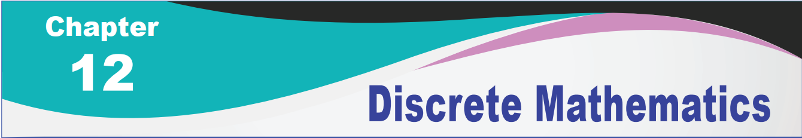
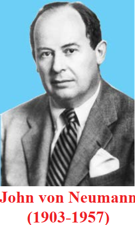

[comment]: <> (katex Header)


[Markdown]: <> (Markdown Refering Website https://www.markdownguide.org/cheat-sheet/)
[Katex]: <> (add the katex entension and header for including maths expression and refer https://katex.org/docs/supported.html)
[Table Creating Webiste]: <> (website for table creating https://www.tablesgenerator.com/markdown_tables)
[Ascii Flow Diagram]: <> (goat diagram website https://asciiflow.com/#/)

# Introduction
Mathematics can be broadly classified into two categories: Continuous
Mathematics − It is based upon the results concerning the set of real numbers
which is uncountably infinite. It is characterized by the fact that between any two
real numbers, there is always a set of uncountably infinite numbers. For example, a
function in continuous mathematics can be plotted in a smooth curve without break.
Discrete Mathematics − It involves distinct values which are either finite
or countably infinite; i.e. between any two points, there are finite or countably
infinite number of points. For example, if we have a finite set of objects, the
function can be defined as a list of ordered pairs having these objects, and can
be presented as a complete list of those pairs.

The mathematicians who lived in the latter part of the 19th and early in
the 20th centuries developed a new branch of mathematics called discrete mathematics consisting of
concepts based on either finite or countably infinite sets like the set of natural numbers. These sets are
called discrete sets and the beauty of such sets is that, one can find that a one-to-one correspondence
can be defined from these sets onto the set of natural numbers. So, the elements of a discrete set can be
arranged as a sequence. This special feature of discrete sets cannot be found in any uncountable set like
the set of real numbers where the elements are distributed continuously throughout without any gap.
Everyone is aware of the fact that the application of computers is playing an important role in
every walk of our lives. Consequently the computer science has become partially a science of clear
understanding and concise description of computable discrete sets. Also the modern programming
languages are to be designed in such a way that they are suitable for descriptions in a concise manner.
This compels the computer scientists to train themselves in learning to formulate algorithms based on
the discrete sets.

The main advantage of studying discrete mathematics is that its results serve as very good tools
for improving the reasoning and problems solving capabilities. Some of the branches of discrete
mathematics are combinatorics, mathematical logic, boolean algebra, graph theory, coding
theory etc. Some of the topics of discrete mathematics namely permutations, combinations, and
mathematical induction were already discussed in the previous year. In the present chapter, two
topics namely binary operations and mathematical logic of discrete mathematics are discussed.

Symbols

∈ - belongs to.

⋺ - such that.

∀ - for every.

⇒ - implies.

∃ - there exists

In general, the word ‘operation’ refers to the process of operating upon either a single or more
number of elements at a time. For instance, finding the negative of an element in  involves a single
element at a time. So it is called an unary operation. On the other hand the process of finding the sum
of any two elements in \\(\Z\\) involves two elements at a time. This kind of operation is called a binary
operation and in general an operation involving n elements is called an n-ary operation, n∈ \\(\N\\) . In
this section a detailed discussion of the binary operations is presented.

## Learning Objectives
  Upon completion of this chapter, students will be able to
- define binary operation and examine various properties
- define binary operation on Boolean matrices and verify various properties
- define binary operation on modular classes and examine various properties
- identify simple and compound statements
- define logical connectives and construct truth tables
- identify tautology, contradiction, and contingency
- establish logical equivalence and apply duality principle