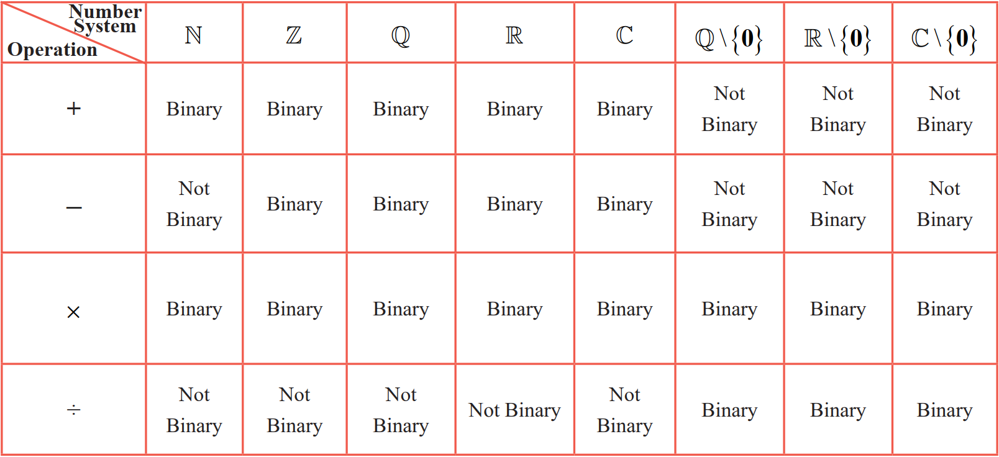
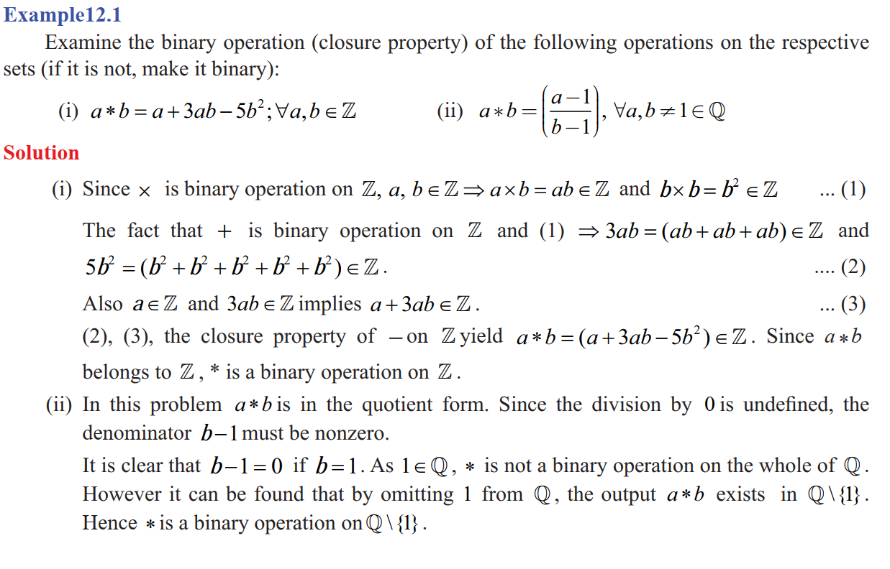
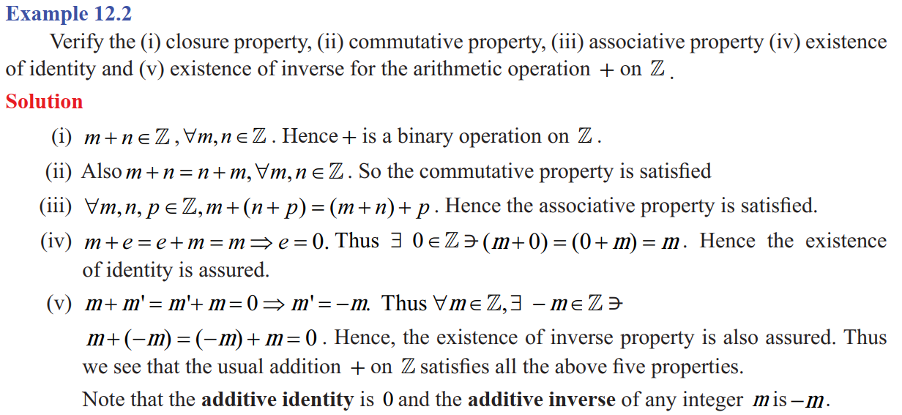
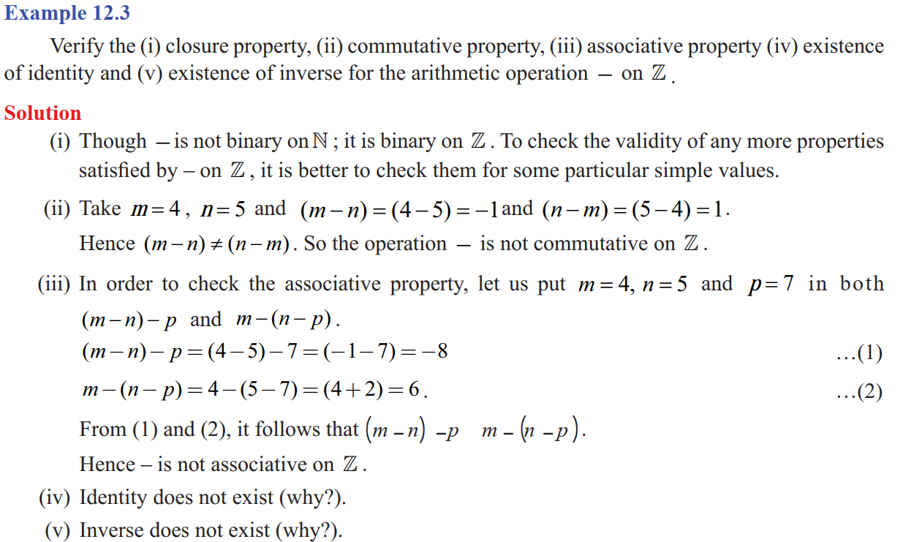
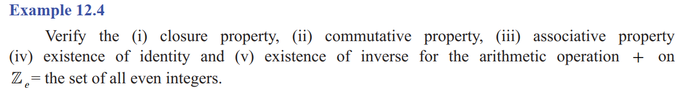
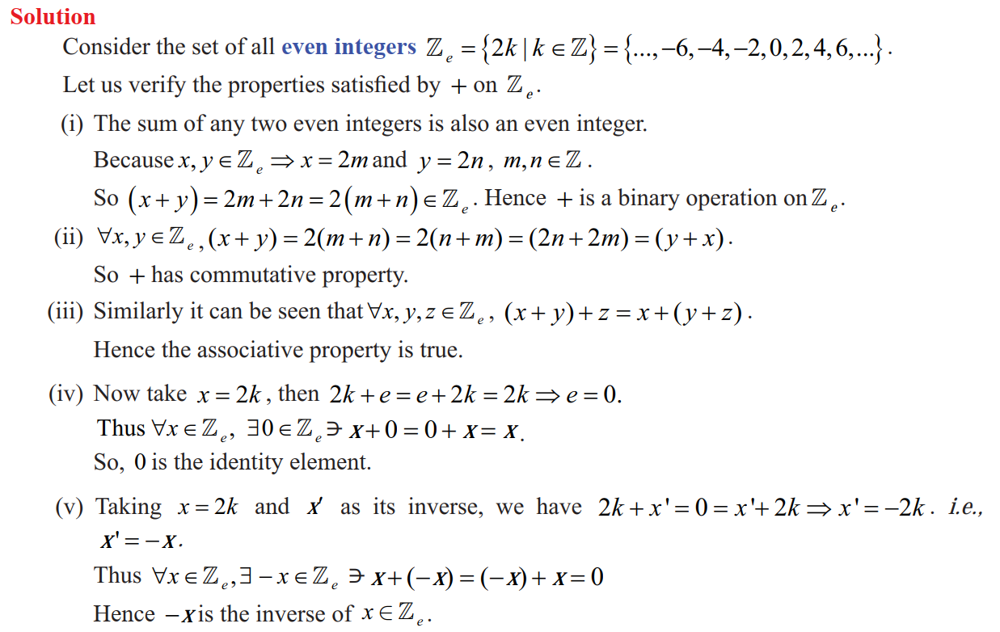

[comment]: <> (katex Header)


[Markdown]: <> (Markdown Refering Website https://www.markdownguide.org/cheat-sheet/)
[Katex]: <> (add the katex entension and header for including maths expression and refer https://katex.org/docs/supported.html)
[Table Creating Webiste]: <> (website for table creating https://www.tablesgenerator.com/markdown_tables)
[Ascii Flow Diagram]: <> (goat diagram website https://asciiflow.com/#/)

# Binary Operations

## Definitions
  The basic arithmetic operations on  are addition (+ ), subtraction (-), multiplication (×), and
division (÷). Eminent mathematicians of the latter part of 19thcentury and in 20thcentury like Abel, Cayley,
Cauchy, and others, tried to generalize the properties satisfied by these usual arithmetic operations. To this
end they developed new abstract algebraic structures through the axiomatic approach. This new branch
of algebra dealing with these abstract algebraic structures is known as abstract algebra.
  To begin with, consider a simple example involving the basic usual arithmetic operations addition
and multiplication of any two natural numbers.

    m + n ∈ \\(\N\\) ; m x n  ∈ \\(\N\\) , ∀ m,n ∈ \\(\N\\) = {1,2,3,...}

Each of the above two operations yields the following observations:
  1. At a time exactly two elements of \\(\N\\) are processed.
  1. The resulting element (outcome) is also an element of \\(\N\\) .

  Any such operation defined on a nonempty set is called a binary operation or a binary
composition on the set in abstract algebra.

### Definition 12.1
  Any operation * defined on a non-empty set S is called a binary operation on S if the following
conditions are satisfied:

  (i)  The operation * must be defined for each and every ordered pair (a,b)∈ SxS .

  (ii)  It assigns a unique element a b ∗ of S to every ordered pair (a,b)∈ SxS .

  In other words, any binary operation * on S is a rule that assigns to each ordered pair of
elements of S a unique element of S . Also * can be regarded as a function (mapping) with input in
the Cartesian product S S × and the output in S .

    ∗ × : S S → S ; ∗ = ( , a b) a b ∗ ∈ S , where a b * is an unique element.
  A binary operation defined by ∗ × : S S → S ; ∗ = ( , a b) a b ∗ ∈ S demands that the output a b ∗
must always lie the given set S and not in the complement of it. Then we say that ‘∗ is closed on S ’ or
‘ S is closed with respect to ∗ ’. This property is known as the closure property.

### Definition 12.2
Any non-empty set on which one or more binary operations are defined is
called an algebraic structure.

  Another way of defining a binary operation ∗ on S is as follows:
∀ ∈ a b , , S a∗b is unique and a b ∗ ∈S .

**Note**
It follows that every binary operation satisfies the closure property.

**Note**
The operation∗ is just a symbol which may be + × , ,−, ÷ matrix addition, matrix multiplication,
etc. depending on the set on which it is defined.
  For instance, though + and × are binary on \\(\N\\) , - is not binary operation on \\(\N\\) .

  To verify this, consider(3,4)∈ \\(\N\\) x \\(\N\\) .
    ∗(a,b)= -( 3 4)= 3 - 4 = − 1 ∉ \\(\N\\) .

Hence - is not binary operation on \\(\N\\) . So \\(\N\\) is to be extended to \\(\Z\\) in order that - becomes
binary operation on \\(\Z\\). Thus \\(\Z\\) is closed with respect to +,×, and − . Thus (\\(\Z\\),+,x,-) is an
algebraic structure.

Observations

  The binary operation depends on the set on which it is defined.

  (a)  The operation – which is not binary operation on \\(\N\\) but it is binary on \\(\Z\\) . The set \\(\N\\) is
extended to include negative numbers. We call the included set \\(\Z\\) .

  (b)  The operation ÷ on \\(\Z\\) is not binary operation on \\(\Z\\) . For instance, for(1,2)∈ \\(\Z\\)x\\(\Z\\) ,
÷ (1, 2)= 1/2 ∉ \\(\Z\\). Hence \\(\Z\\) has to be extended further into \\(\Q\\) .

  (c)  It is a known fact that the division by 0 is not defined in basic arithmetic. So ÷ is binary
operation on the set \\(\Q\\) \{0} . Thus +, ×, − are binary operation on \\(\Q\\) and ÷ is binary
operation on\\(\Q\\) \{0} .

  Now the question is regarding the reasons for extending further \\(\Q\\) to \\(\R\\) and then from \\(\R\\) to \\(\C\\).
Accordingly, a number system is needed where not only all the basic arithmetic operations +, −, ×, ÷ but also to include the roots of the equations of the form " \\( x^{2} − 2 = 0\\) " and “ \\( x^{2} + 1 = 0\\) ”.

So, in addition to the existing systems, the collection of irrational numbers and imaginary numbers
(See Chapter 3) are to be adjoined. Consequently \\(\R\\) and then \\(\cnums\\) are obtained. The biggest number
system \\(\cnums\\) properly includes all the other number systems \\(\N\\), \\(\Z\\), \\(\Q\\) , and \\(\R\\) as subsets.

**Table12.1**

### 12.2.2 Some more properties of a binary operation
**Commutative property**

Any binary operation ∗ defined on a nonempty set S is said to satisfy the commutative
property, if

    a * b = b * a  ∈ ∀a b , S .

**Associative property**

Any binary operation∗ defined on a nonempty set S is said to satisfy the associative property, if

    a * (b * c ) = (a * b ) * c  ∀a,b,c ∈ S .

**Existence of identity property**
An element e S ∈ is said to be the Identity Element of S under the binary operation∗ if for all
a S ∈ we have that a e ∗ = a and e a ∗ = a .

**Existence of inverse property**

If an identity element e exists and if for every a S ∈ , there exists b in S such that a b ∗ = e and
b a ∗ = e then b S ∈ is said to be the Inverse Element of a . In such instances, we write b a = −1.

**Note**

a–1 is an element of S. It should be read as the inverse of a and not as 1/a.

**Note**

(i) The **multiplicative identity** is 1 in Z and it is the one and only one element with the property
n n ⋅ = 1 1⋅ = n n , ∀ ∈ .

(ii) The **multiplicative inverse** of any element, say 2 in  is 1
2
and no other nonzero rational
number x has the property that 2.2 = x.x =1.

**Note**

Whenever a mathematical statement involves ‘for every’ or ‘ for all’ , it has to be proved for every
pair or three elements. It is not easy to prove for every pair or three elements. But these types of definitions
may be used to prove the negation of the statement. That is, negation of “for every” or “for all” is “there
exists not”. So, produce one such pair or three elements to establish the negation of the statement.

  The questions of existence and uniqueness of identity and inverse are to be examined. The
following theorems prove these results in the more general form.

**Theorem 12.1**: (Uniqueness of Identity)
In an algebraic structure the identity element (if exists) must be unique.

**Proof**

Let(S,∗) be an algebraic structure. Assume that the identity element of S exists in S .
  It is to be proved that the identity element is unique. Suppose that e1 and e2 be any two identity
elements of S .

  First treate
1as the identity and e2 as an arbitrary element of S .

  Then by the existence of identity property, e2*e1 = e1∗e2 = e2 .  ... (1)

  Interchanging the role of e1and e2 , e1 * e2 = e2*e1 = e1 . …(2)

  From (1) and (2), e e 1 2 = . Hence the identity element is unique which completes the proof.

**Theorem 12.2 (Uniqueness of Inverse)**

In an algebraic structure the inverse of an element (if exists) must be unique.

**Proof**

Let ( , S ∗) be an algebraic structure and a S ∈ . Assume that the inverse of a exists in S . It is to
be proved that the inverse of a is unique. The existence of inverse in S ensures the existence of the
identity element e in S .

Let a S ∈ . It is to be proved that the inverse a (if exists) is unique.
  Suppose that a has two inverses, say, a1 , a2 .

  Treating a1 as an inverse of a gives a*a1 = a1*a = e …(1)

  Next treating a2 as the inverse of a gives a* a2= a2*a = e …(2)

a1=a1*e=a1*(a*a2)=(a1*a)*a2=e*a2=a2 (by (1) and (2)).

  So, a1=a2. Hence the inverse of a is unique which completes the proof.

Example 12.5
  Verify the (i) closure property, (ii) commutative property, (iii) associative property
(iv) existence of identity and (v) existence of inverse for the arithmetic operation + on
\\(\Z\\)
o = the set of all odd integers.

**Solution**
  Consider the set \\(\Z\\)
o of all **odd integers** \\(\Z\\)
o = {2k + 1 : k ∈ \\(\Z\\)} ={-5, -3, −1, 1, 3, 5,...} . + **is
not a binary operation** on \\(\Z\\)
o because when x = 2m+1, y = 2n + 1, x + y = 2(m+n)+2 is even for
all m and n. For instance, consider the two odd numbers 3,7 ∈ \\(\Z\\)
o . Their sum 3+7 =10 is an even
number. In general, if x, y∈\\(\Z\\)
o , then (x + y) ∉ \\(\Z\\)
0 . Other properties need not be checked as it is not
a binary operation.

**Example 12.6**
  Verify (i) closure property (ii) commutative property, and (iii) associative property of the
following operation on the given set.
(a * b) = ab;  ∀ a, b∈ \\(\N\\) (exponentiation property)

**Solution**

(i)  It is true that a * b = \\(a^{b}\\) ∈ \\(\N\\) ∀ a,b \\(\N\\). So ∗ is a **binary operation** on \\(\N\\) .

(ii) a * b = \\(a^{b}\\) and b a ∗ = ba . Put, a = 2 and b = 3 . Then a b ∗ = 2 8 3 = but b a ∗ = 3 9 2 =
    So a b ∗ need not be equal tob a ∗ . Hence ∗ does not have commutative property.

(iii)  Next consider a * (b * c) = a * \\(b^{c}\\) = \\(a^{b^{c}}\\) . Take a = 2, b = 3 and c = 4 .
Then a * (b * c) = 2 * (3 * 4) =\\(2^{3^{4}}\\)= \\(2^{81}\\)
    But (a * b) * c = \\(a^{b}\\) * c = \\((a^{b})^{c}\\) = \\(a^{bc}\\)=\\(2^{12}\\)

Hence a * (b * c) ≠ (a * b) * c. So ∗ **does not have associative property** on \\(\N\\) .

**Note**: This binary operation has no identity and no inverse. (Justify).

**Example 12.7**

Verify (i) closure property, (ii) commutative property, (iii) associative property,
(iv) existence of identity, and (v) existence of inverse for following operation on the given set.

m ∗ n =m + n - mn; m,n ∈ \\(\Z\\)

**Solution**

(i)  The output m + n - mn is clearly an integer and hence∗ is a binary operation on  \\(\Z\\).

(ii) m ∗ n =m + n - mn = n + m - nm = n*m, ∀ m,n ∈  \\(\Z\\) . So ∗ has **commutative property**.

(iii)  Consider \\((m * n) * p \\)  = \\((m + n -mn) ∗ p\\) = \\((m+n-nm) + p - (m + n -mn) p \\)

= \\(m + n + p + -mn -mp -np +mnp) ... (1)

Similarly \\( m * (n * p ) \\) = \\(m * (n + p - np) \\) = \\(m +(n + p - np) -m(n + p - np) \\)

= \\(m + n +p - np - mn - mp + mnp \\) ... (2)

From (1) and (2), we see that \\((m * n) * p \\) =  \\( m * (n * p ) \\). Hence ∗ has **associative property**.

(iv)  An integer e is to be found such that

(m * e = e * m  = m, ∀ m ∈ \\(\Z\\) ⇒ m + e − me = m ⇒ e(1-m) = 0 ⇒ e = 0 or m =1 ). But m is an arbitrary integer and hence need not be
equal to 1. So the only possibility is e = 0 . Also m∗0 = 0∗m= m, ∀ m ∈ \\(\Z\\) . Hence 0 is the
identity element and hence the **existence of identity** is assured.

(v)  An element m′∈ \\(\Z\\) is to be found such that m * m′ = m′∗m = e = 0, ∀ m ∈ \\(\Z\\) .

m * m′ = 0 ⇒ m + m′− m m′ = 0 ⇒ m′ = \\(m / (m -1) \\)
. When m=1, m′ is not defined.

When m=2,m′ is an integer. But except m=2, m′ need not be an integer for all values of
m. Hence **inverse does not exist** in \\(\Z\\) .

### 12.2.3 Some binary operations on Boolean Matrices

**Definition 12.3**

A **Boolean Matrix** is a real matrix whose entries are either 0 or 1.

Note that the boolean entries 0 and 1 can be defined in several ways. In electrical switch to
describe “on and off”, in graph theory, the “adjacency matrix” etc , the boolean entries 0 and 1 are
used. We consider the same type of Boolean matrices in our discussion.

  The following two kinds of operations on the collection of all boolean matrices are defined.

Let A = [ aij ] and B = [ bij ] be any two boolean matrices of the same type. Then their **join** ∨ and
**meet** ∧ are defined as follows:

    Definition 12.4: Join of A and B
 A \lor B  = [ a_{ij} ] ∨ [ b_{ij} ] = [ a_{ij} ∨ b_{ij} ] = [ c_{ij} ] 
where   c=\left\{\begin{array}{ll}1, & if either aij =1 or bij =1 \\ 0, & if both aij=0 and bij=0  \end{array}\right.

**Definition 12.5: Meet of A and B**

2. A \\(\land\\) B = [aij] \\(\land\\) [bij] = [aij \\(\land\\) bij] where  cij=\left\{\begin{array}{ll}1, & if both aij =1 and bij =1 \\ 0, & if either aij=0 and bij=0  \end{array}\right.
  It is clear that (a ∨ b) = max {a , b}; (a ∧ b) = min{ a, b }, a,b ∈{0,1}.

**Example 12.8**

Let A = \begin{bmatrix}
   0 & 1 \\
   1 & 1
\end{bmatrix},B =  \begin{bmatrix}
   1 & 1 \\
   0 & 1
\end{bmatrix}  be any two boolean matrices of the same type. Find A ∨ B and
A ∧ B
.

**Solution**

Then  A ∨ B = \begin{bmatrix}
   0 & 1 \\
   1 & 1
\end{bmatrix} ∨ \begin{bmatrix}
   1 & 1 \\
   0 & 1
\end{bmatrix} = \begin{bmatrix}
   0∨1 & 1∨1 \\
   1∨0 & 1∨1
\end{bmatrix}=\begin{bmatrix}
   1 & 1 \\
   1 & 1
\end{bmatrix} 


 A \land B = \begin{bmatrix}
   0 & 1 \\
   1 & 1
\end{bmatrix} \land \begin{bmatrix}
   1 & 1 \\
   0 & 1
\end{bmatrix} = \begin{bmatrix}
   0\land1 & 1\land1 \\
   1\land0 & 1\land1
\end{bmatrix}=\begin{bmatrix}
   0 & 1 \\
   0 & 1
\end{bmatrix} 


**Properties satisfied by join and meet**

Let 𝔹  be the set of all boolean matrices of the same type. We only state the properties of meet
and join.

**Closure property**

A, B ∈𝔹 , A ∨ B= [a_{ij}] ∨ [b_{ij}] =[a_{ij} ∨ b_{ij}]∈𝔹 . (Because, (a_{ij} ∨ b_{ij}) is either 0 or 1 ∀i, j . ∨ is a
binary operation on 𝔹 ).

**Associative property**

A ∨ (B ∨ C) = (A ∨ B) ∨ C, ∀A,B,C  ∈ 𝔹 . ∨ is associative.

**Existence of identity property**

∀ A ∈ 𝔹 , ∃ the null matrix 0 ∈𝔹 ⋺ A ∨ 0 = 0 ∨ A= A . The identity element for ∨ is the null
matrix.

**Existence of inverse property**

   For any matrix A∈𝔹 , it is impossible to find a matrix
B∈ 𝔹  ⋺ A ∨ B = B ∨ A = 0. So the inverse does not exist.
  Similarly, it can be verified that the operation meet ∧ satisfies (i) closure property
(ii) commutative property (iii) associative property (iv) the matrix  U = \begin{bmatrix}
   1 & 1 \\
   1 & 1
\end{bmatrix}   exists as the identity in
𝔹  and (v) the existence of inverse is not assured.

### 12.2.4 Modular Arithmetic
  Having discussed the properties of operations like basic usual arithmetic operations, matrix
addition and multiplication, join and meet of boolean matrices, one more new operation called the
**Modular Arithmetic** is discussed in this section. The modular arithmetic refers to the process of
**dividing** some number a by a positive integer n ( > 1), called modulus, and then equating a with the
remainderb modulo n and it is written as a b ≡ (mod n) , read as ‘a is congruent to b modulo n ’.

Here a ≡ b(mod n ) means a-b = n.k ⋅ for some integer k and b is the **least
non-negative integer** when a is divided by n.

  For instance, 25 ≡ 4(mod7), -20 ≡ −2(mod3) ≡1(mod3) and 15 ≡ 0(mod5) , etc. Further the
set of integers when divided by n , leaves the remainder 0,1,2,...n -1 . In the case of \\(\Z_{5}\\),
[0] = {...,−15,-10,−5,0,5,10,15,...}

[1] = {...,−14,-9,−4,1,6,11,...}

[2] = {...,−13,-8,−3,2,7,12,...}

[3] = {...,−12,-7,−2,3,8,13,...}

[4] = {...,−11,-6,−1,4,9,14,...}

  We write this as \\(\Z_{5}\\)={[0],[1],[2],[3],[4]}. In each class, any two numbers are congruent
modulo 5.

**Before 2007**, modular arithmetic is used in 10-digit ISBN (International Standard Book Number)
numbering system. For instance, the last digit is for parity check. It is from the set
{0, 1,2, 3, 4, 5, 6, 7, 8,9,X } . In ISBN number, 81-7808-755-3, the last digit 3 is obtained as
1*8+2*1+3*7+4*8+5*0+6*8+7*7+8*5+9*5=8+2+21+32+0+48+49+40+45=245 ≡ 3(mod11) .
  Alternatively, the weighted sum is calculated in the reverse manner
  9*8+8*1+7*7+6*8+5*0+4*8+3*7+2*5+1*5=245 = 3 (mod 11).
  In both ways, we get the same check number 3.

**After 2007**, 13-digit ISBN numbering has been followed. The first 12 digits (from left to right) are
multiplied by the weights 3,1,3,1,…. starting from right to left. Then the weighted sum is calculated.
The higher multiple of 10 is taken. Then the difference is calculated. Then its additive inverse
modulo 10 is the thirteenth digit.
  For instance, consider the ISBN Number: 978-81-931995-6-5.Take 12 digits from left to right.

| | | | | | | | | | | | |
|---|---|---|---|---|---|---|---|---|---|---|---|
|9 |7 |8 |8 |1 |9 |3 |1 |9 |9 |5 |6|
|1 |3 |1 |3 |1 |3 |1 |3 |1 |3 |1 |3|
|9 |21 |8 |24 |1 |27 |3 |3 |9 |27 |5 |18|

The total of last row is 155. The nearest (higher) integer in multiples of 10 is 160. The difference
160-155=5. The additive inverse modulo 10 is 5 which is 13-th digit in the ISBN number.

Two new operations namely addition modulo n( +_{n}  ) and multiplication modulo n( ×_{n} )  are
defined on the set \\(\Z_{n}\\)
n of all non-negative integers less than n under modulo arithmetic.

**Definition 12.6**
(i) The addition modulo n is defined as follows.
Let a,b ∈ \\(\Z_{n}\\) . Then
a( +_{n}  )b= the remainder of a+b on division by n .
(ii)  The multiplication modulo n is defined as follows.
Let a,b ∈\\(\Z_{n}\\) . Then
a( ×_{n} ) b =the remainder of a x b on division by n

**Example 12.9**

Verify (i) closure property, (ii) commutative property, (iii) associative property,
(iv) existence of identity, and (v) existence of inverse for the operation ( +_{5}  )
on \\(\Z_{5}\\) using table
corresponding to addition modulo 5.

**Solution**
It is known that \\(\Z_{5}\\)={[0],[1],[2],[3],[4]} . The table corresponding to addition modulo 5 is as
follows: We take reminders {0, 1, 2, 3, 4 } to represent the classes {[0],[1],[2],[3],[4]}.
|||||||
|---|---|---|---|---|---|
|( +_{5}  ) |0 |1| 2| 3| 4|
|0 |0 |1 |2 |3 |4|
|1 |1 |2 |3 |4 |0|
|2 |2 |3 |4 |0 |1|
|3 |3 |4 |0 |1 |2|
|4 |4 |0 |1 |2 |3|

**Table12.2**

  (i)  Since each box in the table is filled by **exactly one element** of \\(\Z_{5}\\) , the output a( +_{5}  )b is
unique and hence ( +_{5}  ) is a **binary operation**.

(ii) The entries are **symmetrically** placed with respect to the **main diagonal**. So ( +_{5}  ) has
**commutative property**.

(iii)  The table cannot be used directly for the verification of the associative property. So it is to
be verified as usual.

For instance, (2( +_{5}  )3 )( +_{5}  )4 =0 ( +_{5}  )4 = (mod 5)

and 2( +_{5}  )(3( +_{5}  )4)=2( +_{5}  )2=4(mod5).

Hence (2( +_{5}  )3 )( +_{5}  )4=2( +_{5}  )(3( +_{5}  )4).

Proceeding like this one can verify this for all possible triples and ultimately it can be shown
that ( +_{5}  ) is associative.

(iv)  The row headed by 0 and the column headed by 0 are identical. Hence the identity element
is 0.

(v)  The existence of inverse is guaranteed provided the identity 0 exists in each row and each
column. From Table12.2, it is clear that this property is true in this case. The method of
finding the inverse of any one of the elements of \\(\Z_{5}\\) , say 2 is outlined below.

First find the position of the identity element 0 in the III row headed by 2. Move horizontally
along the III row and after reaching 0, move vertically above 0 in the IV column, because 0
is in the III row and IV column. The element reached at the topmost position of IV column
is 3. This element 3 is nothing but the inverse of 2, because, 2( +_{5}  ) 3 =0(mod5 ) . In this way,
the inverse of each and every element of \\(\Z_{5}\\) can be obtained. Note that the inverse of 0 is
0,that of 1 is 4, that of 2 is 3, that of 3 is 2 , and, that of 4 is 1.

**Example 12.10**
Verify (i) closure property, (ii) commutative property, (iii) associative property,
(iv) existence of identity, and (v) existence of inverse for the operation ×11 on a subset A = { , 1 3 4 5 , , , } 9
of the set of remainders {0, 1,2, 3, 4, 5, 6, 7, 8,9, 10 }.

**Solution**
The table for the operation ( ×_{11}  ) is as follows.
|||||||
|---|---|---|---|---|---|
|( ×_{11}  )| 1| 3| 4| 5| 9|
|1| 1| 3| 4| 5| 9|
|3 |3 |9 |1 |4 |5|
|4 |4 |1 |5 |9 |3|
|5 |5 |4 |9 |3 |1|
|9 |9 |5 |3 |1 |4|

***Table12.3***

Following the same kind of procedure as explained in the previous example, a brief outline of the
process of verification of the properties of ( ×_{11}  ) on A is given below.

(i)  Since each box has an unique element of A, ( ×_{11}  ) is a binary operation on A.

(ii)  The entries are symmetrical about the main diagonal. Hence ×11 has commutative property.

(iii)  As usual, the associative property can be seen to be true.

(iv)  The entries of both the row and column headed by the element 1 are identical. Hence 1 is the
identity element.

(v)  Since the identity 1 exists in each row and each column, the existence of inverse property
is assured for ( ×_{11}  ) . The inverse of 1 is 1, that of 3 is 4, that of 4 is 3, 5 is 9 , and, that of 9 is 5.

***EXERCISE 12.1***
1.  Determine whether ∗ is a binary operation on the sets given below.

(i) a * b = a. |b| on \\(\R\\).

(ii) a * b= min (a,b)on A = {1,2,3,4,5}

(iii) (a * b)  = a  \sqrt{\smash[b]{b}}  is binary on \\(\R\\) .

2. On \\(\Z\\) , define ∗ by (m *n) =( m^{n}+n^{m}  ): ∀ m,n ∈ \\(\Z\\) . Is ∗ binary on \\(\Z\\) ?

3. Let ∗ be defined on \\(\R\\) by (a *b) = a+b+ab − 7 . 

Is ∗ binary on \\(\R\\) ? If so, find 3*(-7/15).

4. Let A ={a +  \sqrt{\smash[b]{5}} b: a,b∈\\(\Z\\)} . Check whether the usual multiplication is a binary operation on
A .

5.(i)  Define an operation∗ on ℚ as follows: a∗b = (a + b)/2 ; a,b∈ℚ. Examine the closure,
commutative, and associative properties satisfied by ∗ on ℚ.

(ii)  Define an operation∗ on ℚ as follows: a∗b = (a + b)/2 ; a,b∈ℚ. Examine the existence
of identity and the existence of inverse for the operation ∗ on ℚ.

6.Fill in the following table so that the binary operation ∗ on A = {a, b, c} is commutative.
|||||
|---|---|---|---|
|∗ |a |b |c|
|a |b|
|b |c |b |a
|c |a ||c|
7.  Consider the binary operation ∗ defined on the set A = {a, b, c ,d} by the following table:

||||||
|---|---|---|---|---|
|∗ |a |b |c |d|
|a |a |c |b |d|
|b |d |a |b |c|
|c |c |d |a |a|
|d |d |b |a |c|

Is it commutative and associative?

8.Let A =
 
\begin{pmatrix}
1 & 0 & 1 & 0 \\
0 & 1 & 0 & 1 \\
1 & 0 & 0 & 1
\end{pmatrix}
 
, B =
 
\begin{pmatrix}
0 & 1 & 0 & 1 \\
1 & 0 & 1 & 0 \\
1 & 0 & 0 & 1
\end{pmatrix}
 
, C =
 
\begin{pmatrix}
1 & 1 & 0 & 1 \\
0 & 1 & 1 & 0 \\
1 & 1 & 1 & 1
\end{pmatrix}
 
be any three boolean matrices
of the same type. Find (i) A ∨ B (ii) A ∧ B (iii) ( A ∨ B) ∧ C (iv) (A ∧ B) ∨ C .

9. (i) Let M =  
\begin{cases}
\begin{pmatrix}
x & x \\
x & x
\end{pmatrix} : x ∈ R-{0}
\end{cases}
 
and let ∗ be the matrix multiplication. Determine
whether M is closed under ∗ . If so, examine the commutative and associative properties
satisfied by ∗ on M .

(ii) LetM =  
\begin{cases}
\begin{pmatrix}
x & x \\
x & x
\end{pmatrix} : x ∈ R-{0}
\end{cases}
 and let ∗ be the matrix multiplication. Determine
whether M is closed under ∗ . If so, examine the existence of identity, existence of
inverse properties for the operation ∗ on M .

10. (i) Let A be ℚ \ {1} . Define ∗ on A by x ∗ y = x + y − xy . Is ∗ binary on A ? If so,
examine the commutative and associative properties satisfied by ∗ on A .
(ii) Let A be ℚ \ {1} . Define ∗ on A by x ∗ y = x + y − xy . Is ∗ binary on A ?
If so, examine the existence of identity, existence of inverse properties for the operation
∗ on A.