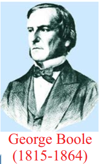

# Mathematical Logic

George Boole was a self-taught English Mathematician, Philosopher and
Logician. His results on Boolean Algebra involving the binary numbers play an
important role in various fields, particularly more in computer applications. He
introduced the idea of Symbolic Logic and contributed a lot of results to the fast
development of Mathematical Logic.

  The reputed Greek philosopher Aristotle (384-322BC(BCE)) wrote the first book
on logic. The famous German philosopher and mathematician Gottfried Leibnitz of
17thcentury framed the idea of using symbols in Logic. Later this idea was realized
by George Boole and Augustus de Morgan in 19th century. George Boole established
the fact that logic is very much related to mathematics by linking logic, symbols, and
algebra together. Mathematical Logic was developed in the late 19thand early 20thcenturies.
  In 1930 the researchers noticed (Neumann’s statement in his death bed: 0 and 1 are going to
rule the world) that the binary numbers 0 and 1 could be used to analyze electrical circuits and thus
used to design electronic computers. Today digital computers and electronic circuits are designed
to implement this binary arithmetic. We study Mathematical Logic as the language and deductive
system of Mathematics and Computer Science.

  Generally Logic is the study of valid reasoning. But mathematical logic allows us to represent
knowledge in a precise mathematical way and it also allows us to make valid inferences using a set of
precise rules. It is regarded as a powerful tool for computer science because it is mainly used to verify
the correctness of programs.

## Statement and its truth value
The simplest part of Mathematical Logic is the Propositional Logic and its building blocks
are statements or propositions. Mostly communication needs the use of language through which we
impart our ideas. They are in the form of sentences.
  There are various types of sentences like
  1. Declarative (Assertive type)
  2. Imperative (A command or a request type)
  3. Exclamatory (Emotions, excitement type)
  4. Interrogative (Question type)
  5. Open type

**Definition 12.7**

Any **declarative sentence** is called a **statement** or a **proposition** which is either **true** or **false**
but not both.

Any **imperative sentence** such as exclamatory, command and any **interrogative sentence**
cannot be a proposition.

The **truth value** of a statement refers to the truth or the falsity of that particular statement.
The truth value of a true statement is **true** and it is denoted by T or 1. The truth value of a false
statement is **false** and it is denoted by F or 0.

An **open sentence** is a sentence whose truth can vary according to some conditions, which are
not stated in the sentence. For instance, (i) x× = 7 35 is an open sentence whose truth value
depends on value of x . That is, if x = 5, it is true and if x  5, it is false. (ii) ***He is a bad person.***
This is an open sentence. Opinion varies from individual to individual.

**Example 12.11**
  Identify the valid statements from the following sentences.
Solution:
1. Mount Everest is the highest mountain of the world.
2. 3 + 4  = 8 .
3.  7 + 5  > 10 .
4. Give me that book.
5. ( 10 - x) = 7 .
6. How beautiful this flower is!
7. Where are you going?
8. Wish you all success.
9. This is the beginning of the end.

The truth value of the sentences (1) and (3) are T, while that of (2) is F. Hence they are statements.
The sentence (5) is true for x = 3 and false for x  3 and hence it may be true or false but not
both. So it is also a statement.
  The sentences (4), (6), (7), (8) are not statements, because (4) is a command, (6) is an exclamatory,
(7) is a question while (8) is a sentence expressing one’s wishes and (9) is a paradox.

### Compound Statements, Logical Connectives, and Truth Tables

**Definition 12.8: (Simple and Compound Statements)**
Any sentence which cannot be split further into two or more statements is called an atomic
statement or a simple statement. If a statement is the combination of two or more simple
statements, then it is called a compound statement or a molecular statement. Hence it is clear
that any statement can be either a simple statement or a compound statement.

**Example for simple statements**
  The sentences (1), (2), (3) given in example 12.11 are simple statements.

**Example for Compond statements**
  Consider the statement,  “1 is not a prime number and Ooty is in Kerala”.
Note that the above statement is actually a combination of the following two simple statements:

p : 1 is not a prime number.
q : Ooty is in Kerala.

Hence the given statement is not a simple statement. It is a compound statement.
From the above discussions, it follows that any simple statement takes the value either T or F .
So it can be treated as a variable and this variable is known as **statement variable** or **propositional
variable**. The propositional variables are usually denoted by p, q, r....

**Definition 12.9 : (Logical Connectives)**

To connect two or more simple sentences, we use the words or a group of words such as
“and”, “or”, “if-then”, “if and only if”, and “not”. These connecting words are known as **logical
connectives**.
  In order to construct a compound statement from simple statements, some connectives are
used. Some basic logical connectives are **negation (not), conjunction (and)** and **disjunction(or)**.

**Definition 12.10**

A statement formula is an expression involving one or more statements connected by some
logical connectives.

**Definition 12.11: (Truth Table)**

A table showing the relationship between truth values of simple statements and the truth values
of compound statements formed by using these simple statements is called truth table.

**Definition12.12**

(i) Let p be a simple statement. Then the negation of p is a statement whose truth value is
opposite to that of p . It is denoted by \\(¬\\)p, read as not p .The truth value of \\(¬\\)p is T , if p
is F , otherwise it is F .

(ii) Let p and q be any two simple statements. The conjunction of p and q is obtained by
connecting p and q by the word and. It is denoted by p ∧ q, read as ‘ p conjunction q ’
or ‘ p hat q ’. The truth value of p ∧ q is T , whenever both p and q are T and it is F
otherwise.

(iii) The disjunction of any two simple statements p and q is the compound statement obtained
by connecting p and q by the word ‘or’. It is denoted by p ∨ q , read as ‘ p disjunction q
’ or ‘ p cup q ’.The truth value of p ∨ q is F , whenever both p and q are F and it is T
otherwise.

**Logical Connectives and their Truth Tables**

**(1) Truth Table for NOT [\\(¬\\)] (Negation)**

|p|\\(¬\\)p|
|---|---|
|T|F|
|F|T|

Table 12.4

**(2) Truth table for AND [ ∧] (Conjunction)**

|p|q|p∧q|
|---|---|---|
|T|T|T|
|T|F|F|
|F|T|F|
|F|F|F|

Table 12.5

**(3) The truth tables for OR [∨] (Disjunction)**

|p|q|p∨q|
|---|---|---|
|T|T|T|
|T|F|T|
|F|T|T|
|F|F|F|

Table 12.6

**Example 12.12**

Write the statements in words corresponding to \\(¬\\)p, p q ∧ , p q ∨ and q ∨ \\(¬\\)p, where p is ‘It is
cold’ and q is ‘It is raining.’

**Solution**

1. \\(¬\\)p :  It is not cold.
2. p ∧ q   :  It is cold and raining.
3.  p ∨ q   :  It is cold or raining.
4. q ∨ \\(¬\\)p  :  It is raining or it is not cold
Observe that the statement formula  p has only 1 variable p and its truth table has 2 2 = ( ) 1
rows. Each of the statement formulae p q ∧ and p q ∨ has two variables p and q . The truth table
corresponding to each of them has 4= ( ) 22 rows. In general, it follows that if a statement formula
involves n variables, then its truth table will contain 2n rows.

**Example 12.13**

How many rows are needed for following statement formulae?
(i) p ∨ \\(¬\\)t  ∧ (p ∨ \\(¬\\)s)   (ii)((p ∧ q ) ∨ (\\(¬\\)r ∨ \\(¬\\)s)) ∧ \\(¬\\)t ∧ v)

**Solution**

(i) (p ∨ \\(¬\\)t)  ∧ (p ∨ \\(¬\\)s) contains 3 variables p,s,and t . Hence the corresponding truth table will
contain  2^{3} = 8 rows.

(ii) ((p ∧ q ) ∨ (\\(¬\\)r ∨ \\(¬\\)s)) ∧ (\\(¬\\)t ∧ v) contains 6 variables p, q, r, s, t , and v . Hence the
corresponding truth table will contain  2^{6}  = 64 rows.

**Conditional Statement**

**Definition 12.13**

The conditional statement of any two statements p and q is the statement, “If p , then q ” and
it is denoted by p\\(→\\)q. Here p is called the **hypothesis** or **antecedent** and q is called the
**conclusion** or **consequence**. p\\(→\\)q is false only if p is true and q is false. Otherwise it is true.

|p|q|p\\(→\\)q|
|---|---|---|
|T|T|T|
|T|F|F|
|F|T|T|
|F|F|T|

Table 12.7

**Example 12.14**

Consider p\\(→\\)q : If today is Monday, then 4 + 4 = 8.

Here the component statements p and q are given by,
p: Today is Monday; q: 4 + 4 = 8.

The truth value of p\\(→\\)q is T because the conclusion q is T.
An important point is that p\\(→\\)q should not be treated by actually considering the meanings of
p and q in English. Also it is not necessary that p should be related to q at all.

**Consequences**

From the conditional statement p \\(→\\) q, three more conditional statements are derived. They are listed below.

**(i) Converse statement** q \\(→\\) p

**(ii) Inverse statement** \\(¬\\)p \\(→\\) \\(¬\\)q.

**(iii) Contrapositive statement** \\(¬\\)q \\(→\\)\\(¬\\)p .

**Example 12.15**

Write down the (i) conditional statement (ii) converse statement (iii) inverse statement, and
(iv) contrapositive statement for the two statements p and q given below.

p : The number of primes is infinite. q: Ooty is in Kerala.

**Solution**

Then the four types of conditional statements corresponding to p and q are respectively listed
below.

(i) p\\(→\\)q : (conditional statement) “If the number of primes is infinite then Ooty is in Kerala”.

(ii) q \\(→\\) p : (converse statement) “If Ooty is in Kerala then the number of primes is infinite”

(iii) \\(¬\\)p \\(→\\) \\(¬\\)q (inverse statement) “If the number of primes is not infinite then Ooty is not in
Kerala”.

  (iv)  \\(¬\\)q \\(→\\) \\(¬\\)p (contrapositive statement) “If Ooty is not in Kerala then the number of primes is
not infinite”.

**Bi-conditional Statement**

**Definition 12.14**

The **bi-conditional statement** of any two statements p and q is the statement “ p if and only
if q ” and is denoted by p \\(↔\\) q . Its truth value is T , whenever both p and q have the same truth
values, otherwise it is false.

|p|q|p \\(↔\\) q|
|---|---|---|
|T|T|T|
|T|F|F|
|F|T|F|
|F|F|T|

Table 12.8

**Exclusive OR (EOR)[∨]**

**Definition 12.15**

Let p and q be any two statements. Then p EOR q is such a compound statement that its
truth value is decided by either p or q but not both. It is denoted by p ⊽ q . The truth value of
p ⊽ q is T whenever either p or q is T, otherwise it is F. The truth table of p ⊽ q is given below.

|p|q|p ⊽ q|
|---|---|---|
|T|T|F|
|T|F|T|
|F|T|T|
|F|F|F|

Table 12.9

**Example 12.16**

Construct the truth table for (p ⊽ q) ∧ (p ⊽ \\(¬\\)q).

|p|q|\\(¬\\)q|r:(p ⊽ q)|s:(p ⊽ \\(¬\\)q)|r∧s|
|---|---|---|---|---|---|
|T|T|F|F|T|F|
|T|F|T|T|F|F|
|F|T|F|T|F|F|
|F|F|T|F|T|F|

Table 12.10

Also the above result can be proved without using truth tables. This proof will be provided after
studying the logical equivalence.

### Tautology, Contradiction, and Contingency

**Definition 12.16**

A statement is said to be a **tautology** if its truth value is always T irrespective of the truth
values of its component statements. It is denoted by 𝕋.

**Definition 12.17**

A statement is said to be a **contradiction** if its truth value is always F irrespective of the truth
values of its component statements. It is denoted by 𝔽.

**Definition 12.18**

A statement which is neither a tautology nor a contradiction is called **contingency**

**Observations**
1. For a tautology, all the entries in the column corresponding to the statement formula will
contain T.
2. For a contradiction, all the entries in the column corresponding to the statement formula will
contain F.
3. The negation of a tautology is a contradiction and the negation of a contradiction is a tautology.
4. The disjunction of a statement with its negation is a tautology and the conjunction of a
statement with its negation is a contradiction. That is p ∨ \\(¬\\)p is a **tautology** and p ∧ \\(¬\\)p is a
**contradiction**. This can be easily seen by constructing their truth tables as given below. 

**Example for tautology**

|p|\\(¬\\)p|p ∨ \\(¬\\)p|
|---|---|---|
|T|F|T|
|F|T|T|

Table 12.11

Since the last column of p ∨ \\(¬\\)p  contains only T, p ∨ \\(¬\\)p  is a tautology.

**Example for contradiction**

|p|\\(¬\\)p|p ∧ \\(¬\\)p|
|---|---|---|
|T|F|F|
|F|T|F|

Table 12.12

Since the last column contains only F, p ∧ \\(¬\\)p is a contradiction.

**Note**

All the entries in the last column of Table 12.10 are F and hence (p ⊽ q) ∧ (p ⊽ \\(¬\\)q) is a
contradiction.

**Example for contingency**

|p|q|p \\(↔\\) q|\\(¬\\)q|p\\(→\\)\\(¬\\)q|\\(¬\\)( p \\(→\\) \\(¬\\)q )|(p \\(↔\\) q) ∧ \\(¬\\)( p \\(→\\) \\(¬\\)q )|
|---|---|---|---|---|---|---|
|T|T|T|F|F|T|T|
|T|F|F|T|T|F|F|
|F|T|F|F|T|F|F|
|F|F|T|T|T|F|F|

Table 12.13

In the above truth table, the entries in the last column are a combination of T and F. The given
statement is neither a tautology nor a contradiction. It is a contingency.

### Duality

**Definition 12.19**

The **dual** of a statement formula is obtained by replacing ∨ by ∧, ∧ by ∨ , T by F
F by T . A dual is obtained by replacing 𝕋 (**tautology**) by 𝔽 (**contradiction**), and, 𝔽 by 𝕋.

**Remarks**
1)  The symbol \\(¬\\) is not changed while finding the dual.
2)  Dual of a dual is the statement itself.
3)  The special statements 𝕋 (tautology) and 𝔽 (contradiction) are duals of each other.
4) T is changed to F and vice-versa.

**Principle of Duality**
If a compound statement S1 contains only \\(¬\\), ∧ , and ∨ and statement S2 arises from S1 by
replacing ∧ by ∨ , and, ∨ by ∧ then S1 is a tautology if and only if S2 is a contradiction.

**For example**

(i) The dual of ( p ∨ q ) ∧ ( r ∧ s ) ∨ 𝔽 is (p ∧ q) ∨ ( r ∨ s ) ∧ 𝕋.

(ii) The dual of p ∧ [\\(¬\\) q ∨ (p ∧ q) ∨ \\(¬\\)r ] is p ∨ [\\(¬\\) q ∧ (p ∨ q) ∧ \\(¬\\) r ].

### Logical Equivalence

**Definition 12.20**

 Any two compound statements A and B are said to be **logically equivalent** or simply **equivalent**
if the columns corresponding to A and B in the truth table have **identical truth values**. The logical
equivalence of the statements A and B is denoted by A ≡ B or A ⇔ B .

From the definition, it is clear that, if A and B are logically equivalent, then A ⇔ B must be
a **tautology**.

**Some Laws of Equivalence**

1. **Idempotent Laws**

(i) p ∨ p ≡ p (ii) p ∧ p ≡ p.

|p|q|p ∨ p|p ∧ p|
|---|---|---|---|
|T|T|T|T|
|F|F|F|F|

Table 12.14

In the above truth table for both p , p ∨ p and p ∧ p have the same truth values. Hence
p ∨ p ≡ p and p ∧ p ≡ p.

2. **Commutative Laws**

(i)p ∨ q ≡ q ∨ p (ii) p ∧ q ≡ q ∧ p .

**Proof (i)**

|p|q|p ∨ q|q ∨ p|
|---|---|---|---|
|T|T|T|T|
|T|F|T|T|
|F|T|T|T|
|F|F|F|F|

Table 12.15

The columns corresponding to p ∨ q and q ∨ p are identical. Hence p ∨ q ≡ q ∨ p .

Similarly (ii) p ∧ q ≡ q ∧ p can be proved.

3. **Associative Laws**
(i) p ∨ (q ∨ r) ≡ (p ∨ q) ∨ r (ii) p ∧ (q ∧ r) ≡ (p ∧ q) ∧ r .

**Proof**

The truth table required for proving the associative law is given below.

|p|q|r|p ∨ q|q ∨ r|p ∨ (q ∨ r) | (p ∨ q) ∨ r|
|---|---|---|---|---|---|---|
|T|T|T|T|T|T|T|
|T|T|F|T|T|T|T|
|T|F|T|T|T|T|T|
|T|F|F|T|F|T|T|
|F|T|T|T|T|T|T|
|F|T|F|T|T|T|T|
|F|F|T|F|T|T|T|
|F|F|F|F|F|F|F|

Table 12.16

The columns corresponding to p ∨ (q ∨ r) and (p ∨ q) ∨ r| are identical.

Hence p ∨ (q ∨ r) ≡ (p ∨ q) ∨ r .

Similarly, (ii) p ∧ (q ∧ r) ≡ (p ∧ q) ∧ r can be proved.

4. Distributive Laws

(i) p ∨ (q ∧ r) ≡ (p ∨ q) ∧ (p ∨ r)
(ii) p ∧ (q ∨ r) ≡ (p ∧ q) ∨ (p ∧ r)

**Proof (i)**

|p|q|r|q ∧ r|p ∨ (q ∧ r)|p ∨ q|p ∨ r|(p ∨ q) ∧ (p ∨ r)|
|---|---|---|---|---|---|---|---|
|T|T|T|T|T|T|T|T|
|T|T|F|F|T|T|T|T|
|T|F|T|F|T|T|T|T|
|T|F|F|F|T|T|T|T|
|F|T|T|T|T|T|T|T|
|F|T|F|F|F|T|F|F|
|F|F|T|F|F|F|T|F|
|F|F|F|F|F|F|F|F|

Table 12.17
  The columns corresponding to p ∨ (q ∧ r) and (p ∨ q) ∧ (p ∨ r) are identical. Hence
p ∨ (q ∧ r) ≡ (p ∨ q) ∧ (p ∨ r) .

Similarly (ii) p ∧ (q ∨ r) ≡ (p ∧ q) ∨ (p ∧ r) can be proved.

5.Identity Laws

(i) p ∨ 𝕋 ≡ 𝕋 and p ∨ 𝔽 ≡ p (ii) p ∧ 𝕋 ≡ p and p ∧ 𝔽 ≡ 𝔽

|p|𝕋|𝔽|p ∨ 𝕋|p ∨ 𝔽|
|---|---|---|---|---|
|T|T|F|T|T|
|F|T|F|T|F|

**Table12.18**

(i) The entries in the columns corresponding to p ∨ 𝕋 and 𝕋 are identical and hence they are
equivalent. The entries in the columns corresponding to p ∨ 𝔽 and p are identical and hence
they are equivalent.

Dually
(ii) p ∧ 𝕋 ≡ p and p ∧ 𝔽 ≡ 𝔽 can be proved.

6.**Complement Laws**
(i) p ∨ \\(¬\\)p ≡ 𝕋 and p ∧ \\(¬\\)p ≡ 𝔽 (ii) \\(¬\\)𝕋 ≡ 𝔽 and \\(¬\\)𝔽 ≡ 𝕋

**Proof**

|p|\\(¬\\)p|𝕋|\\(¬\\)𝕋|𝔽|\\(¬\\)𝔽|p ∨ \\(¬\\)p|p ∧ \\(¬\\)p|
|---|---|---|---|---|---|---|---|
|T|F|T|F|F|T|T|F|
|F|T|T|F|F|T|T|F|

**Table 12.19**

(i)  The entries in the columns corresponding to p ∨ \\(¬\\)p and 𝕋 are identical and hence they are
equivalent. The entries in the columns corresponding to p ∧ \\(¬\\)p and 𝔽 are identical and
hence they are equivalent.

(ii)  The entries in the columns corresponding to \\(¬\\)𝕋 and 𝔽 are identical and hence they are
equivalent. The entries in the columns corresponding to \\(¬\\)𝔽 and 𝕋 are identical and hence
they are equivalent.

7. **Involution Law or Double Negation Law**

\\(¬\\)(\\(¬\\) p) ≡ p

**Proof**

|p|\\(¬\\) p|\\(¬\\)(\\(¬\\) p)|
|---|---|---|
|T|F|T|
|F|T|F|

The entries in the columns corresponding to \\(¬\\) \\(¬\\) ( ) p and p are identical and hence they are
equivalent.

8. **de Morgan’s Laws**

(i) \\(¬\\)( p ∧ q ) ≡ \\(¬\\)p ∨ \\(¬\\)q (ii) \\(¬\\)(p ∨ q) ≡ \\(¬\\)p ∧ \\(¬\\)q

**Proof of (i)**

|p|q|\\(¬\\)p|\\(¬\\)q| p ∧ q|\\(¬\\)( p ∧ q )|\\(¬\\)p∧\\(¬\\)q|
|---|---|---|---|---|---|---|
|T|T|F|F|T|F|F|
|T|F|F|T|F|T|T|
|F|T|T|F|F|T|T|
|F|F|T|T|F|T|T|

**Table 12.21**

The entries in the columns corresponding to \\(¬\\)( p ∧ q )  and \\(¬\\)p ∨ \\(¬\\)q are identical and hence they
are equivalent. Therefore \\(¬\\)( p ∧ q ) ≡ \\(¬\\)p ∨ \\(¬\\)q . Dually (ii)\\(¬\\)(p ∨ q) ≡ \\(¬\\)p ∧ \\(¬\\)q can be proved.

**9.Absorption Laws**

(i) p ∨ (p ∧ q) ≡ p (ii) p ∧ (p ∨ q ) ≡ p

|p|q|p ∧ q|p ∨ q|p ∨ (p ∧ q)|p ∧ (p ∨ q )|
|---|---|---|---|---|---|
|T|T|T|T|T|T|
|T|F|F|T|T|T|
|F|T|F|T|F|F|
|F|F|F|F|F|F|

**Table 12.22**

(i) The entries in the columns corresponding to p ∨ (p ∧ q) and p are identical and hence they
are equivalent.

(ii) The entries in the columns corresponding to p ∧ (p ∨ q) and p are identical and hence they
are equivalent.

**Example 12.17**

Establish the equivalence property: p \\(→\\) q ≡ \\(¬\\)p ∨ q

|p|q|\\(¬\\)p|p \\(→\\) q|\\(¬\\)p ∨ q|
|---|---|---|---|---|
|T|T|F|T|T|
|T|F|F|F|F|
|F|T|T|T|T|
|F|F|T|T|T|

**Table 12.23**

The entries in the columns corresponding to p \\(→\\) q and \\(¬\\)p ∨ q are identical and hence they are
equivalent.

**Example 12.18**
Establish the equivalence property connecting the bi-conditional with conditional:
p \\(↔\\) q≡(p \\(→\\) q) ∧ (q \\(→\\) p)

**Solution**

|p|q|p \\(→\\) q|q \\(→\\) p|p \\(↔\\) q|(p \\(→\\) q) ∧ (q \\(→\\) p)|
|---|---|---|---|---|---|
|T|T|T|T|T|T|
|T|F|F|T|F|F|
|F|T|T|F|F|F|
|F|F|T|T|T|T|

**Table 12.24**

The entries in the columns corresponding to p \\(↔\\) q and (p \\(→\\) q) ∧ (q \\(→\\) p) are identical and
hence they are equivalent.

**Example 12.19**
Using the equivalence property, show that  p \\(↔\\) q ≡(p ∧ q) ∨ (\\(¬\\)p ∧ \\(¬\\)q ) .

**Solution**

It can be obtained by using examples 12.15 and 12.16 that

p \\(↔\\) q ≡ (\\(¬\\)p ∨ q) ∧ (\\(¬\\)q ∨ p) ... (1)

≡ (\\(¬\\)p ∨ q) ∧ (p ∨ \\(¬\\)q)   (by Commutative Law)  ... (2)

≡ (\\(¬\\)p ∧ (p ∨ \\(¬\\)q)) ∧ (q ∧ (p ∨ \\(¬\\)q)) (by Distributive Law)

≡ (\\(¬\\)p∧p) ∨(\\(¬\\)p∧\\(¬\\)q)∨(q∧p)∨(q∧\\(¬\\)q) (by Distributive Law)
≡ 𝔽∨(\\(¬\\)p∧\\(¬\\)q)∨(q∧p)∨𝔽; (by Complement Law)
≡ (\\(¬\\)p∧\\(¬\\)q)∨(q∧p); (by Identity Law)
≡ (q∧p)∨(\\(¬\\)p∧\\(¬\\)q); (by Commutative Law)
Finally (1) becomes p \\(↔\\) q ≡(p ∧ q) ∨ (\\(¬\\)p ∧ \\(¬\\)q ).

**EXERCISE 12.2**

1.Let p : Jupiter is a planet and q  : India is an island be any two simple statements. Give
verbal sentence describing each of the following statements.

(i) \\(¬\\)p (ii) p∧\\(¬\\)q (iii) \\(¬\\)p ∨q   (iv) p\\(→\\)\\(¬\\)q   (v) p\\(↔\\)q

2.Write each of the following sentences in symbolic form using statement variables p and q .

(i) 19 is not a prime number and all the angles of a triangle are equal.

(ii) 19 is a prime number or all the angles of a triangle are not equal

(iii) 19 is a prime number and all the angles of a triangle are equal

(iv) 19 is not a prime number

3.Determine the truth value of each of the following statements

(i) If 6 + 2 = 5 , then the milk is white.

(ii) China is in Europe or  \sqrt{\smash[b]{3}}   is an integer

(iii) It is not true that 5 + 5 = 9 or Earth is a planet

(iv) 11 is a prime number and all the sides of a rectangle are equal

4.Which one of the following sentences is a proposition?

(i) 4 + 7 =12   (ii) What are you doing?  (iii)  3^{n}  ≤ 81, n ∈ \\(\N\\)
(iv) Peacock is our national bird  (v) How tall this mountain is!

5.Write the converse, inverse, and contrapositive of each of the following implication.
(i) If x and y are numbers such that x = y, then   x^{2} = y^{2}  
(ii) If a quadrilateral is a square then it is a 
rectangle

6.Construct the truth table for the following statements.
(i) \\(¬\\)p ∧ \\(¬\\)q (ii) \\(¬\\)(p ∧ \\(¬\\)q) (iii) (p ∨ q)∨\\(¬\\)q   (iv)  (\\(¬\\)p \\(→\\) r) ∧ (p\\(↔\\)q)

7.Verify whether the following compound propositions are tautologies or contradictions or
contingency

(i) (p ∧ q) ∧ \\(¬\\)(p ∨ q) (ii) ((p ∨ q) ∧\\(¬\\)p) \\(→\\)q
(iii) (p \\(→\\) q) \\(↔\\) (\\(¬\\)p \\(→\\)q)   (iv)((p \\(→\\) q) ∧ (q \\(→\\) r))\\(→\\) (p\\(→\\)r)

8.Show that (i) \\(¬\\)(p∧q) ≡ \\(¬\\)p∨\\(¬\\)q (ii) \\(¬\\)(p\\(→\\)q) ≡ p∧\\(¬\\)q.

9.Prove that q \\(→\\) p ≡ \\(¬\\)p \\(→\\) \\(¬\\)q

10.Show that p\\(→\\)q and q\\(→\\)p are not equivalent

11.Show that \\(¬\\)(p\\(↔\\)q) ≡ p\\(↔\\)\\(¬\\)q

12.Check whether the statement p\\(→\\)(q\\(→\\)p) is a tautology or a contradiction without using
the truth table.

13.Using truth table check whether the statements\\(¬\\)(p∨q)∨(\\(¬\\)p∧q) and \\(¬\\)p are logically equivalent.

14.Prove p\\(→\\)(q\\(→\\)r)≡ (p∧q)\\(→\\)r without using truth table.

15.Prove that p\\(→\\)(\\(¬\\)q ∨ r) ≡\\(¬\\)p ∨(\\(¬\\)q∨r) ∨ using truth table.

**EXERCISE 12.3**

**Choose the correct or the most suitable answer from the given four alternatives.**

1.A binary operation on a set S is a function from
(1) S\\(→\\)S (2) (S×S)\\(→\\)S (3) S\\(→\\)(S×S) (4)( ) (S×S)\\(→\\)(S×S)

2.Subtraction is not a binary operation in
(1) \\(\R\\) (2) \\(\Z\\) (3) \\(\N\\) (4) \\(\Q\\)

