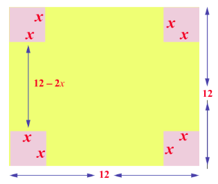
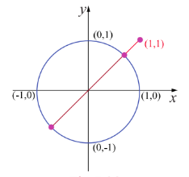

## 7.8 Applications in Optimization

Optimization is a process of finding an extreme value (either maximum or minimum) under certain conditions.

**A procedure for solving for an extremum or optimization problems.**

**Step 1:** Draw an appropriate figure and label the quantities relevant to the problem.

**Step 2:** Find an expression for the quantity to be maximized or minimized.

**Step 3:** Using the given conditions of the problem, express the quantity to be extremized in terms of a single variable.

**Step 4:** Determine the interval of possible values for this variable from the conditions given in the problem.

**Step 5:** Using the techniques of extremum (absolute extremum, first derivative test or second derivative test) obtain the maximum or minimum.

**Example 7.62**

We have a 12 unit square piece of thin material and want to make an open box by cutting small squares from the corners of our material and folding the sides up. The question is, which cut produces the box of maximum volume?

**Solution**

Let $x =$ length of the cut on each side of the little squares.

$V =$ the volume of the folded box.

The length of the base after two cuts along each edge of size $x$ is $12 - 2x$. The depth of the box after folding is $x$, so the volume is $V = x \times (12 - 2x)^{2}$. Note that, when $x = 0$ or $6$, the volume is zero and hence there cannot be a box. Therefore the problem is to maximize $V = x \times (12 - 2x)^{2}$, $x \in (0, 6)$.

Now,

$$
\frac{dV}{dx} = (12 - 2x)^{2} - 4x(12 - 2x) = (12 - 2x)(12 - 6x).
$$

$$
\frac{dV}{dx} = 0 \text{ gives the stationary numbers } x = 2, 6.
$$

Since $6 \notin (0, 6)$ the only stationary number is at $x = 2 \in (0, 6)$. Further, $\frac{dV}{dx}$ changes its sign from positive to negative when passing through $x = 2$. Therefore at $x = 2$ the volume $V$ is local maximum. The local maximum volume value is $V = 128$ units. Hence the maximum cut can only be $2$ units.

**Example 7.63**

Find the points on the unit circle $x^{2} + y^{2} = 1$ nearest and farthest from $(1, 1)$.

**Solution**

The distance from the point $(1, 1)$ to any point $(x, y)$ is $d = \sqrt{(x - 1)^2 + (y - 1)^2}$. Instead of extremising $d$, for convenience we extremise $D = d^{2} = (x - 1)^{2} + (y - 1)^{2}$, subject to the condition $x^{2} + y^{2} = 1$. Now, $\frac{dD}{dx} = 2(x - 1) + 2(y - 1) \times \frac{dy}{dx}$, where $\frac{dy}{dx}$ will be computed by differentiating $x^{2} + y^{2} = 1$ with respect to $x$. Therefore, we get $2x + 2y\frac{dy}{dx} = 0$ which gives us $\frac{dy}{dx} = -\frac{x}{y}$.

Substituting this, we get

$$
\frac{dD}{dx} = 2(x - 1) + 2(y - 1)\left(-\frac{x}{y}\right)
$$

$$
\frac{dD}{dx} = 2\left[\frac{x - y}{y}\right] = 0 \Rightarrow x = y
$$

Since $(x, y)$ lie on the circle $x^{2} + y^{2} = 1$, we get $2x^{2} = 1$ which gives $x = \pm \frac{1}{\sqrt{2}}$. Hence the points at which the extremum distance occur are $\left(\frac{1}{\sqrt{2}}, \frac{1}{\sqrt{2}}\right)$, $\left(-\frac{1}{\sqrt{2}}, -\frac{1}{\sqrt{2}}\right)$.

To find the extrema, we apply second derivative test. So,

$$
\frac{d^{2}D}{dx^{2}} = 2\frac{y^{2} + x^{2}}{y^{3}}.
$$

The value of $\left(\frac{d^{2}D}{dx^{2}}\right)_{(\frac{1}{\sqrt{2}}, \frac{1}{\sqrt{2}})} > 0$; $\left(\frac{d^{2}D}{dx^{2}}\right)_{(-\frac{1}{\sqrt{2}}, -\frac{1}{\sqrt{2}})} < 0$.

This implies the nearest and farthest points are $\left(\frac{1}{\sqrt{2}}, \frac{1}{\sqrt{2}}\right)$ and $\left(-\frac{1}{\sqrt{2}}, -\frac{1}{\sqrt{2}}\right)$ respectively.

Therefore, the nearest and the farthest distances are respectively $\sqrt{2} - 1$ and $\sqrt{2} + 1$.

**Example 7.64**

A steel plant is capable of producing $x$ tonnes per day of a low-grade steel and $y$ tonnes per day of a high-grade steel, where $y = \frac{40 - 5x}{10 - x}$. If the fixed market price of low-grade steel is half that of high-grade steel, then what should be optimal productions in low-grade steel and high-grade steel in order to have maximum receipts.

**Solution**

Let the price of low-grade steel be ₹ $p$ per tonne. Then the price of high-grade steel is ₹ $2p$ per tonne.

The total receipt per day is given by $R = px + 2py = px + 2p\left(\frac{40 - 5x}{10 - x}\right)$. Hence the problem is to maximise $R$. Now, simplifying and differentiating $R$ with respect to $x$, we get

$$
R = p\left(\frac{80 - x^{2}}{10 - x}\right)
$$

$$
\frac{dR}{dx} = p\left(\frac{x^{2} - 20x + 80}{(10 - x)^{2}}\right)
$$

$$
\frac{d^{2}R}{dx^{2}} = -\frac{40p}{(10 - x)^{3}}
$$

Now,

$$
\frac{dR}{dx} = 0 \Rightarrow x^{2} - 20x + 80 = 0 \quad \text{and hence} \quad x = 10 \pm 2\sqrt{5}
$$

At $x = 10 - 2\sqrt{5}$, $\frac{d^{2}R}{dx^{2}} < 0$ and hence $R$ will be maximum. If $x = 10 - 2\sqrt{5}$ then $y = 5 - \sqrt{5}$. Therefore the steel plant must produce low-grade and high-grade steels respectively in tonnes per day are

$$
10 - 2\sqrt{5} \quad \text{and} \quad 5 - \sqrt{5}.
$$

**Example 7.65**

Prove that among all the rectangles of the given area square has the least perimeter.

**Solution**

Let $x, y$ be the sides of the rectangle. Hence the area of the rectangle is $xy = k$ (given). The perimeter of the rectangle $P$ is $2(x + y)$. So the problem is to minimize $2(x + y)$ subject to the condition $xy = k$. Let $P(x) = 2\left(x + \frac{k}{x}\right)$.

$$
P^{\prime}(x) = 2\left(1 - \frac{k}{x^{2}}\right) = 0 \Rightarrow x = \sqrt{k}
$$

As $x, y$ are sides of the rectangle, $x = \sqrt{k}$ is a critical number.

Now, $P^{\prime \prime}(x) = \frac{4k}{x^{3}}$ and $P^{\prime \prime}(\sqrt{k}) > 0 \Rightarrow P(x)$ has its minimum value at $x = \sqrt{k}$.

Substituting $x = \sqrt{k}$ in $xy = k$ we get $y = \sqrt{k}$. Therefore the minimum perimeter rectangle of a given area is a square.

**EXERCISE 7.8**

1. Find two positive numbers whose sum is 12 and their product is maximum.

2. Find two positive numbers whose product is 20 and their sum is minimum.

3. Find the smallest possible value of $x^{2} + y^{2}$ given that $x + y = 10$.

4. A garden is to be laid out in a rectangular area and protected by wire fence. What is the largest possible area of the fenced garden with 40 metres of wire.

5. A rectangular page is to contain $24 \text{ cm}^2$ of print. The margins at the top and bottom of the page are $1.5 \text{ cm}$ and the margins at other sides of the page is $1 \text{ cm}$. What should be the dimensions of the page so that the area of the paper used is minimum.

6. A farmer plans to fence a rectangular pasture adjacent to a river. The pasture must contain $1,80,000 \text{ sq.m}$ in order to provide enough grass for herds. No fencing is needed along the river. What is the length of the minimum needed fencing material?

7. Find the dimensions of the rectangle with maximum area that can be inscribed in a circle of radius $10 \text{ cm}$.

8. Prove that among all the rectangles of the given perimeter, the square has the maximum area.

9. Find the dimensions of the largest rectangle that can be inscribed in a semi circle of radius $r$ cm.

10. A manufacturer wants to design an open box having a square base and a surface area of $108 \text{ sq.cm}$. Determine the dimensions of the box for the maximum volume.

11. The volume of a cylinder is given by the formula $V = \pi r^{2}h$. Find the greatest and least values of $V$ if $r + h = 6$.

12. A hollow cone with base radius $a$ cm and height $b$ cm is placed on a table. Show that the volume of the largest cylinder that can be hidden underneath is $\frac{4}{9}$ times volume of the cone.
