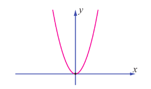
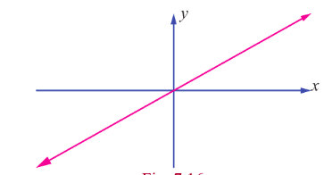
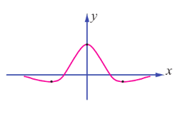
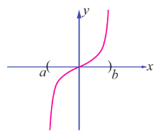
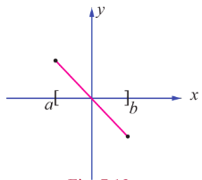
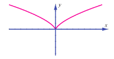
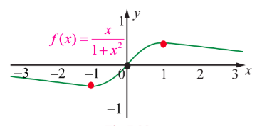

## 7.6 Applications of First Derivative

Using the first derivative we can test a function $f(x)$ for its monotonicity (increasing or decreasing), focusing on a particular point in its domain and the local extrema (maxima or minima) on a domain.

### 7.6.1 Monotonicity of functions

Monotonicity of functions are its behaviour of increasing or decreasing.

> **Definition 7.4**
>
> A function $f(x)$ is said to be an **increasing function** in an interval $I$ if $a < b \Rightarrow f(a) \leq f(b)$, $\forall a, b \in I$.

> **Definition 7.5**
>
> A function $f(x)$ is said to be a **decreasing function** in an interval $I$ if $a < b \Rightarrow f(a) \geq f(b)$, $\forall a, b \in I$.

The function $f(x) = x$ is an increasing function in the entire real line, whereas the function $f(x) = -x$ is a decreasing function in the entire real line. In general, a given function may be increasing in some interval and decreasing in some other interval, say for instance, the function $f(x) = |x|$ is decreasing in $(-\infty, 0]$ and is increasing in $[0, \infty)$. These functions are simple to observe for their monotonicity. But given an arbitrary function how we determine its monotonicity in an interval of a real line? That is where following theorem (stated without proof) will be useful.

> **Theorem 7.7**
>
> If the function $f(x)$ is differentiable in an open interval $(a,b)$ then we say,
> 
> (1) if
>
> $$
\frac{d}{dx} (f(x)) \geq 0, \quad \forall x \in (a,b), \quad (1)
$$
>
> then $f(x)$ is increasing in the interval $(a,b)$.
>
> (2) if
>
> $$
\frac{d}{dx} (f(x)) > 0, \quad \forall x \in (a,b), \quad (2)
$$
>
> then $f(x)$ is strictly increasing in the interval $(a,b)$.
>
> The proof of the above can be observed from Theorem 7.3.
> 
> (3) $f(x)$ is decreasing in the interval $(a,b)$ if
>
> $$
\frac{d}{dx} (f(x)) \leq 0, \quad \forall x \in (a,b). \quad (3)
$$
> 
> (4) $f(x)$ is strictly decreasing in the interval $(a,b)$ if
>
> $$
\frac{d}{dx} (f(x)) < 0, \quad \forall x \in (a,b). \quad (4)
> $$

> **Remark**
>
> It is very important to note the following fact. It is false to say that if a differentiable function $f(x)$ on $I$ is strictly increasing on $I$, then $f^{\prime}(x) > 0$ for all $x \in I$. For instance, consider $y = x^{3}$, $x \in (-\infty, \infty)$. It is strictly increasing on $(-\infty, \infty)$. To prove this, let $a > b$. Then we have to prove that $f(a) > f(b)$. For this purpose, we have to prove $a^{3} - b^{3} > 0$.
>
> Now,
>
> $$
> a^{3} - b^{3} = (a - b)(a^{2} + ab + b^{2}) = (a - b) \frac{1}{2} (2a^{2} + 2ab + 2b^{2}) = (a - b) \frac{1}{2} \big((a + b)^{2} + a^{2} + b^{2}\big) > 0
> $$
>
> since $a - b > 0$ and other terms inside the bracket are $> 0$.
>
> Hence it is clear that the quadratic expression is always positive (it is equal to zero only if $a = b = 0$, which contradicts the condition $a < b$). Therefore the function $y = x^{3}$ is strictly increasing in $(-\infty, \infty)$. But $f^{\prime}(x) = 3x^{2}$ which is equal to zero at $x = 0$.

> **Definition 7.6**
>
> A **stationary point** $(x_{0}, f(x_{0}))$ of a differentiable function $f(x)$ is where $f^{\prime}(x_{0}) = 0$.

> **Definition 7.7**
>
> A **critical point** $(x_{0}, f(x_{0}))$ of a function $f(x)$ is where $f^{\prime}(x_{0}) = 0$ or does not exist.

> **Note**
>
> We state that if $(x,y)$ is a stationary point or critical point of $f$, where $x$ from the domain of $f$ is called stationary number or critical number.
>
> Every stationary point is a critical point however all critical points need not be stationary points. As an example, the function $f(x) = |x - 17|$ has a critical point at $(17,0)$ but $(17,0)$ is not a stationary point as the function has no derivative at $x = 17$.

**Example 7.46**

Prove that the function $f(x) = x^{2} + 2$ is strictly increasing in the interval $(2,7)$ and strictly decreasing in the interval $(-2,0)$.

**Solution**

We have,

$$
f^{\prime}(x) = 2x > 0, \quad \forall x \in (2,7) \quad \text{and} \quad f^{\prime}(x) = 2x < 0, \quad \forall x \in (-2,0)
$$

and hence the proof is completed.

### 7.6.2 Absolute maxima and minima

The absolute maxima and absolute minima are referred to describing the largest and smallest values of a function on an interval.

> **Definition 7.8**
>
> Let $x_{0}$ be a number in the domain $D$ of a function $f(x)$. Then $f(x_{0})$ is the **absolute maximum value** of $f(x)$ on $D$, if $f(x_{0}) \geq f(x) \ \forall x \in D$, and $f(x_{0})$ is the **absolute minimum value** of $f(x)$ on $D$ if $f(x_{0}) \leq f(x) \ \forall x \in D$.

In general, there is no guarantee that a function will actually have an absolute maximum or absolute minimum on a given interval. The following figures show that a continuous function may or may not have absolute maxima or minima on an infinite interval or on a finite open interval.

 - $f(x)$ has an absolute minimum but no absolute maximum on $(-\infty, \infty)$

 - $f(x)$ has no absolute extrema on $(-\infty, \infty)$

 - $f(x)$ has an absolute maximum and an absolute minimum on $(-\infty, \infty)$

 - $f(x)$ has no absolute extrema on $(a,b)$

 - $f(x)$ has an absolute maximum and an absolute minimum on $[a,b]$

However, the following theorem shows that a continuous function must have both an absolute maximum and an absolute minimum on every closed interval.

> **Theorem 7.8 (Extreme Value Theorem)**
>
> If $f(x)$ is continuous on a closed interval $[a,b]$, then $f$ has both an absolute maximum and an absolute minimum on $[a,b]$.

The absolute extrema of $f(x)$ occur either at the endpoints of closed interval $[a,b]$ or inside the open interval $(a,b)$. If the absolute extrema occurs inside, then it must occur at critical numbers of $f(x)$. Thus, we can use the following procedure to find the absolute extrema of a continuous function on closed interval $[a,b]$.

**A procedure for finding the absolute extrema of a continuous function $f(x)$ on closed interval $[a,b]$.**

**Step 1:** Find the critical numbers of $f(x)$ in $(a,b)$.

**Step 2:** Evaluate $f(x)$ at all the critical numbers and at the endpoints $a$ and $b$.

**Step 3:** The largest and the smallest of the values in step 2 is the absolute maximum and absolute minimum of $f(x)$ respectively on the closed interval $[a,b]$.

**Example 7.48**

Find the absolute maximum and absolute minimum values of the function $f(x) = 2x^{3} + 3x^{2} - 12x$ on $[-3,2]$.

**Solution**

Differentiating the given function, we get

$$
f^{\prime}(x) = 6x^{2} + 6x - 12 = 6(x^{2} + x - 2) = 6(x + 2)(x - 1)
$$

Thus, $f^{\prime}(x) = 0 \Rightarrow x = -2, 1 \in (-3,2)$.

Therefore, the critical numbers are $x = -2, 1$. Evaluating $f(x)$ at the endpoints $x = -3, 2$ and at critical numbers $x = -2, 1$, we get $f(-3) = 9$, $f(2) = 4$, $f(-2) = 20$ and $f(1) = -7$.

From these values, the absolute maximum is 20 which occurs at $x = -2$, and the absolute minimum is $-7$ which occurs at $x = 1$.

**Example 7.49**

Find the absolute extrema of the function $f(x) = 3\cos x$ on the closed interval $[0, 2\pi]$.

**Solution**

Differentiating the given function, we get $f^{\prime}(x) = -3 \sin x$.

Thus, $f^{\prime}(x) = 0 \Rightarrow \sin x = 0 \Rightarrow x = \pi \in (0, 2\pi)$. Evaluating $f(x)$ at the endpoints $x = 0, 2\pi$ and at critical number $x = \pi$, we get $f(0) = 3$, $f(2\pi) = 3$, and $f(\pi) = -3$.

From these values, the absolute maximum is 3 which occurs at $x = 0, 2\pi$, and the absolute minimum is $-3$ which occurs at $x = \pi$.

### 7.6.3 Relative Extrema on an Interval

A function $f(x)$ is said to have a **relative maximum** at $x_{0}$, if there is an open interval containing $x_{0}$ on which $f(x_{0})$ is the largest value. Similarly, $f(x)$ is said to have a **relative minimum** at $x_{0}$, if there is an open interval containing $x_{0}$ on which $f(x_{0})$ is the smallest value.

A relative maximum need not be the largest value on the entire domain, while a relative minimum need not be the smallest value on the entire domain. Therefore, there may be more than one relative maximum or relative minimum on the entire domain.

A relative extrema of a function is the extreme values (maximum or minimum) of the functions among all the evaluated values of $f(x)$, $\forall x \in I \subset D$ where $I$ may be open or closed. Usually the local extreme value of a function is attained at a critical point. Note that, a function may have a critical point at $x = c$ without having a local extreme value there. For instance, both of the functions $y = x^{3}$ and $y = x^{\frac{1}{3}}$ have critical points at the origin, but neither function has a local extreme value at the origin.

> **Theorem 7.9 (Fermat)**
>
> If $f(x)$ has a relative extrema at $x = c$ then $c$ is a critical number. Invariably there will be critical numbers of the function obtained as solutions of the equation $f^{\prime}(x) = 0$ or as values of $x$ at which $f^{\prime}(x)$ does not exist.

### 7.6.4 Extrema using First Derivative Test

After we have determined the intervals on which a function is increasing or decreasing, it is not difficult to locate the relative extrema of the function. The location or points at which the relative extrema occurs for a given function $f(x)$ can be observed through the graph $y = f(x)$. However to find the exact point and the value of the extrema of functions we need to use certain test on functions. One such test is the first derivative test, which is stated in the following theorem.

> **Theorem 7.10 (First Derivative Test)**
>
> Let $(c, f(c))$ be a critical point of function $f(x)$ that is continuous on an open interval $I$ containing $c$. If $f(x)$ is differentiable on the interval, except possibly at $c$, then $f(c)$ can be classified as follows:
>
> (when moving across the interval $I$ from left to right)
>
> (i) If $f^{\prime}(x)$ changes from negative to positive at $c$, then $f(x)$ has a local minimum $f(c)$.
>
> (ii) If $f^{\prime}(x)$ changes from positive to negative at $c$, then $f(x)$ has a local maximum $f(c)$.
>
> (iii) If $f^{\prime}(x)$ is positive on both sides of $c$ or negative on both sides of $c$, then $f(c)$ is neither a local minimum nor a local maximum.

**Example 7.50**

Find the intervals of monotonicity and hence find the local extrema for the function $f(x) = x^{2} - 4x + 4$.

**Solution**

We have,

$$
f(x) = (x - 2)^2, \quad \text{then} \quad f'(x) = 2(x - 2) = 0 \text{ gives } x = 2.
$$

The intervals of monotonicity are $(-\infty, 2)$ and $(2, \infty)$. Since $f^{\prime}(x) < 0$, for $x \in (-\infty, 2)$ the function $f(x)$ is strictly decreasing on $(-\infty, 2)$. As $f^{\prime}(x) > 0$, for $x \in (2, \infty)$ the function $f(x)$ is strictly increasing on $(2, \infty)$. Because $f^{\prime}(x)$ changes its sign from negative to positive when passing through $x = 2$ for the function $f(x)$, it has a local minimum at $x = 2$. The local minimum value is $f(2) = 0$.

**Example 7.51**

Find the intervals of monotonicity and hence find the local extrema for the function $f(x) = x^{\frac{2}{3}}$.

**Solution**

We have, $f(x) = x^{\frac{2}{3}}$, then $f^{\prime}(x) = \frac{2}{3} x^{-\frac{1}{3}} = \frac{2}{3x^{\frac{1}{3}}}$. $f^{\prime}(x) \neq 0 \ \forall x \in \mathbb{R}$ and $f^{\prime}(x)$ does not exist at $x = 0$. Therefore, there are no stationary points but there is a critical point at $x = 0$.

| Interval | $(-\infty, 0)$ | $(0, \infty)$ |
| :--- | :--- | :--- |
| Sign of $f'(x)$ | $-$ | $+$ |
| Monotonicity | strictly decreasing | strictly increasing |

Because $f^{\prime}(x)$ changes its sign from negative to positive when passing through $x = 0$ for the function $f(x)$, it has a local minimum at $x = 0$. The local minimum value is $f(0) = 0$. Note that here the local minimum occurs at a critical point which is not a stationary point.

**Example 7.52**

Prove that the function $f(x) = x - \sin x$ is increasing on the real line. Also discuss for the existence of local extrema.

**Solution**

Since $f^{\prime}(x) = 1 - \cos x \geq 0$ and zero at the points $x = 2n\pi$, $n \in \mathbb{Z}$ and hence the function is increasing on the real line.

Since there is no sign change in $f^{\prime}(x)$ when passing through $x = 2n\pi$, $n \in \mathbb{Z}$ by the first derivative test there is no local extrema.

**Example 7.53**

Discuss the monotonicity and local extrema of the function

$$
f(x) = \log (1 + x) - \frac{x}{1 + x}, \quad x > -1.
$$

**Solution**

We have,

$$
f(x) = \log (1 + x) - \frac{x}{1 + x}
$$

$$
f^{\prime}(x) = \frac{1}{1 + x} - \frac{1}{(1 + x)^{2}} = \frac{x}{(1 + x)^{2}}.
$$

Hence,

$f^{\prime}(x) < 0$ for $-1 < x < 0$ and $f^{\prime}(x) > 0$ for $x > 0$.

Therefore $f(x)$ is strictly increasing for $x > 0$ and strictly decreasing for $x < 0$. Since $f^{\prime}(x)$ changes from negative to positive when passing through $x = 0$, the first derivative test tells us there is a local minimum at $x = 0$ which is $f(0) = 0$.

**Example 7.54**

Find the intervals of monotonicity and local extrema of the function $f(x) = x \log x + 3x$.

**Solution**

The given function is defined and is differentiable at all $x \in (0, \infty)$.

$$
f(x) = x \log x + 3x.
$$

$$
f^{\prime}(x) = \log x + 1 + 3 = \log x + 4.
$$

The stationary numbers are given by $\log x + 4 = 0$.

That is $x = e^{-4}$.

Hence the intervals of monotonicity are $(0, e^{-4})$ and $(e^{-4}, \infty)$.

At $x = e^{-5} \in (0, e^{-4})$, $f^{\prime}(e^{-5}) = -1 < 0$ and hence in the interval $(0, e^{-4})$ the function is strictly decreasing.

At $x = e^{-3} \in (e^{-4}, \infty)$, $f^{\prime}(e^{-3}) = 1 > 0$ and hence strictly increasing in the interval $(e^{-4}, \infty)$. Since $f^{\prime}(x)$ changes from negative to positive when passing through $x = e^{-4}$, the first derivative test tells us there is a local minimum at $x = e^{-4}$ and it is $f(e^{-4}) = -e^{-4}$.

**Example 7.55**

Find the intervals of monotonicity and local extrema of the function $f(x) = \frac{1}{1 + x^{2}}$.

**Solution**

The given function is defined and is differentiable at all $x \in (-\infty, \infty)$. As

$$
f(x) = \frac{1}{1 + x^{2}}, \quad \text{we have} \quad f^{\prime}(x) = -\frac{2x}{(1 + x^{2})^{2}}.
$$

The stationary numbers are given by $-\frac{2x}{(1 + x^{2})^{2}} = 0$ that is $x = 0$.

Hence the intervals of monotonicity are $(-\infty, 0)$ and $(0, \infty)$.

On the interval $(-\infty, 0)$ the function strictly increases because $f^{\prime}(x) > 0$ in that interval.

The function $f(x)$ strictly decreases in the interval $(0, \infty)$ because $f^{\prime}(x) < 0$ in that interval. Since $f^{\prime}(x)$ changes from positive to negative when passing through $x = 0$, the first derivative test tells us there is local maximum at $x = 0$ and the local maximum value is $f(0) = 1$.

**Example 7.56**

Find the intervals of monotonicity and local extrema of the function $f(x) = \frac{x}{1 + x^{2}}$.

**Solution**

The given function is defined and differentiable at all $x \in (-\infty, \infty)$. As

$$
f(x) = \frac{x}{1 + x^{2}}, \quad f^{\prime}(x) = \frac{1 - x^{2}}{(1 + x^{2})^{2}}.
$$

The stationary numbers are given by $1 - x^{2} = 0$ that is $x = \pm 1$.

Hence the intervals of monotonicity are $(-\infty, -1)$, $(-1, 1)$ and $(1, \infty)$.

| Interval | $(-\infty, -1)$ | $(-1, 1)$ | $(1, \infty)$ |
| :--- | :--- | :--- | :--- |
| Sign of $f'(x)$ | $-$ | $+$ | $-$ |
| Monotonicity | strictly decreasing | strictly increasing | strictly decreasing |

Therefore, $f(x)$ strictly decreasing on $(-\infty, -1)$, strictly increasing on $(-1, 1)$, strictly decreasing on $(1, \infty)$.

Since $f^{\prime}(x)$ changes from negative to positive when passing through $x = -1$, the first derivative test tells us there is a local minimum at $x = -1$ and the local minimum value is $f(-1) = -\frac{1}{2}$. As $f^{\prime}(x)$ changes from positive to negative when passing through $x = 1$, the first derivative test tells us there is a local maximum at $x = 1$ and the local maximum value is $f(1) = \frac{1}{2}$.

**EXERCISE 7.6**

1. Find the absolute extrema of the following functions on the given closed interval.

(i) $f(x) = x^2 - 12x + 10$ ; $[1, 7]$  
(ii) $f(x) = 3x^4 - 4x^3$ ; $[-1, 2]$  
(iii) $f(x) = 6x^{\frac{4}{3}} - 3x^{\frac{1}{3}}$ ; $[-1, 1]$  
(iv) $f(x) = 2\cos x + \sin 2x$ ; $\left[0, \frac{\pi}{2}\right]$

2. Find the intervals of monotonicities and hence find the local extremum for the following functions:

(i) $f(x) = 2x^3 + 3x^2 - 12x$  
(ii) $f(x) = \frac{x}{x - 5}$  
(iii) $f(x) = \frac{e^x}{1 - e^x}$  
(iv) $f(x) = \frac{x^3}{3} - \log x$  
(v) $f(x) = \sin x \cos x + 5$ , $x \in (0, 2\pi)$
