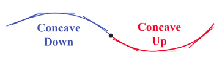
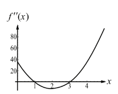
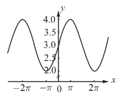
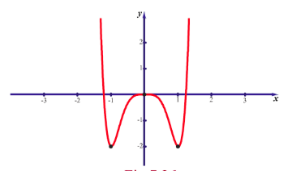

## 7.7 Applications of Second Derivative

Second derivative of a function is used to determine the concavity, convexity, the points of inflection, and local extrema of functions.

### 7.7.1 Concavity, Convexity, and Points of Inflection

A graph is said to be concave down (convex up) at a point if the tangent line lies above the graph in the vicinity of the point. It is said to be concave up (convex down) at a point if the tangent line to the graph at that point lies below the graph in the vicinity of the point. This may be easily observed from the adjoining graph.

> **Definition 7.8**
>
> Let $f(x)$ be a function whose second derivative exists in an open interval $I = (a,b)$. Then the function $f(x)$ is said to be
>
> (i) If $f^{\prime}(x)$ is strictly increasing on $I$, then the function is concave up on an open interval $I$.
> (ii) If $f^{\prime}(x)$ is strictly decreasing on $I$, then the function is concave down on an open interval $I$.

Analytically, given a differentiable function whose graph $y = f(x)$, then the concavity is given by the following result.

> **Theorem 7.11 (Test of Concavity)**
>
> (i) If $f^{\prime \prime}(x) > 0$ on an open interval $I$, then $f(x)$ is concave up on $I$.

> (ii) If $f^{\prime \prime}(x) < 0$ on an open interval $I$, then $f(x)$ is concave down on $I$.

> **Remark**
>
> (1) Any local maximum of a convex upward function defined on the interval $[a,b]$ is also its absolute maximum on this interval.
> (2) Any local minimum of a convex downward function defined on the interval $[a,b]$ is also its absolute minimum on this interval.
> (3) There is only one absolute maximum (and one absolute minimum) but there can be more than one local maximum or minimum.

### Points of Inflection

> **Definition 7.9**
>
>The points where the graph of the function changes from "concave up to concave down" or "concave down to concave up" are called the **points of inflection** of $f(x)$.

> **Theorem 7.12 (Test for Points of Inflection)**
>
> (i) If $f^{\prime \prime}(c)$ exists and $f^{\prime \prime}(c)$ changes sign when passing through $x = c$, then the point $(c, f(c))$ is a point of inflection of the graph of $f$.
>
> (ii) If $f^{\prime \prime}(c)$ exists at the point of inflection, then $f^{\prime \prime}(c) = 0$.

> **Remark**
>
> To determine the position of points of inflexion on the curve $y = f(x)$ it is necessary to find the points where $f^{\prime \prime}(x)$ changes sign. For 'smooth' curves (no sharp corners), this may happen when either
>
> (i) $f^{\prime \prime}(x) = 0$ or
> (ii) $f^{\prime \prime}(x)$ does not exist at the point.

> **Remark**
>
> (1) It is also possible that $f^{\prime \prime}(c)$ may not exist, but $(c, f(c))$ could be a point of inflection. For instance, $f(x) = x^{\frac{1}{3}}$ at $c = 0$.
>
> (2) It is possible that $f^{\prime \prime}(c) = 0$ at a point but $(c, f(c))$ need not be a point of inflection. For instance, $f(x) = x^{4}$ at $c = 0$.
>
> (3) A point of inflection need not be a stationary point. For instance, if $f(x) = \sin x$ then, $f^{\prime}(x) = \cos x$ and $f^{\prime \prime}(x) = -\sin x$ and hence $(\pi, 0)$ is a point of inflection but not a stationary point for $f(x)$.

**Example 7.57**

Determine the intervals of concavity of the curve $f(x) = (x - 1)^{3} \cdot (x - 5)$, $x \in \mathbb{R}$ and, points of inflection if any.

**Solution**

The given function is a polynomial of degree 4. Now,

$$
\begin{aligned}
f^{\prime}(x) &= (x - 1)^{3} + 3(x - 1)^{2} \cdot (x - 5) \\
&= 4(x - 1)^{2} \cdot (x - 4) \\
f^{\prime \prime}(x) &= 4 \left( (x - 1)^{2} + 2(x - 1) \cdot (x - 4) \right) \\
&= 12(x - 1) \cdot (x - 3)
\end{aligned}
$$

Now,

$$
f^{\prime \prime}(x) = 0 \Rightarrow x = 1, \quad x = 3.

| Interval | $(-\infty, 1)$ | $(1, 3)$ | $(3, \infty)$ |
| :--- | :--- | :--- | :--- |
| Sign of $f''(x)$ | $+$ | $-$ | $+$ |
| Concavity | concave up | concave down | concave up |

The curve is concave upwards on $(-\infty, 1)$ and $(3, \infty)$.

The curve is concave downwards on $(1, 3)$.

As $f^{\prime \prime}(x)$ changes its sign when it passes through $x = 1$ and $x = 3$, $(1, f(1)) = (1, 0)$ and $(3, f(3)) = (3, -16)$ are points of inflection for the graph $y = f(x)$. The sign change may be observed from the adjoining figure of the curve $f^{\prime \prime}(x)$.

**Example 7.58**

Determine the intervals of concavity of the curve $y = 3 + \sin x$.

**Solution**

The given function is a periodic function with period $2\pi$ and hence there will be stationary points and points of inflections in each period interval. We have,

$$
\frac{dy}{dx} = \cos x \quad \text{and} \quad \frac{d^{2}y}{dx^{2}} = -\sin x
$$

Now,

$$
\frac{d^{2}y}{dx^{2}} = -\sin x = 0 \Rightarrow x = n\pi.
$$

We now consider an interval $(-\pi, \pi)$ by splitting into two sub intervals $(-\pi, 0)$ and $(0, \pi)$.

In the interval $(-\pi, 0)$, $\frac{d^{2}y}{dx^{2}} > 0$ and hence the function is concave upward.

In the interval $(0, \pi)$, $\frac{d^{2}y}{dx^{2}} < 0$ and hence the function is concave downward. Therefore $(0, 3)$ is a point of inflection (see Fig. 7.25). The general intervals need to be considered to discuss the concavity of the curve are $(n\pi, (n+1)\pi)$, where $n$ is any integer which can be discussed as before to conclude that $(n\pi, 3)$ are also points of inflection.

### 7.7.2 Extrema using Second Derivative Test

The Second Derivative Test relates the concepts of critical points, extreme values, and concavity to give a very useful tool for determining whether a critical point on the graph of a function is a relative minimum or maximum.

> **Theorem 7.13 (The Second Derivative Test)**
>
> Suppose that $c$ is a critical point at which $f^{\prime}(c) = 0$, that $f^{\prime}(x)$ exists in a neighborhood of $c$, and that $f^{\prime \prime}(c)$ exists. Then $f$ has a relative maximum value at $c$ if $f^{\prime \prime}(c) < 0$ and a relative minimum value at $c$ if $f^{\prime \prime}(c) > 0$. If $f^{\prime \prime}(c) = 0$, the test is not informative.

**Example 7.59**

Find the local extremum of the function $f(x) = x^{4} + 32x$.

**Solution**

We have,

$$
f^{\prime}(x) = 4x^{3} + 32 = 0 \text{ gives } x^{3} = -8 \Rightarrow x = -2
$$

and

$$
f^{\prime \prime}(x) = 12x^{2}.
$$

As $f^{\prime \prime}(-2) > 0$, the function has local minimum at $x = -2$. The local minimum value is $f(-2) = -48$. Therefore, the extreme point is $(-2, -48)$.

**Example 7.60**

Find the local extrema of the function $f(x) = 4x^{6} - 6x^{4}$.

**Solution**

Differentiating with respect to $x$, we get

$$
\begin{aligned}
f^{\prime}(x) &= 24x^{5} - 24x^{3} \\
&= 24x^{3}(x^{2} - 1) \\
&= 24x^{3}(x + 1)(x - 1)
\end{aligned}
$$

$$
f^{\prime}(x) = 0 \Rightarrow x = -1, 0, 1.
$$

The critical numbers are $x = -1, 0, 1$.

Now,

$$
f^{\prime \prime}(x) = 120x^{4} - 72x^{2} = 24x^{2}(5x^{2} - 3).
$$

$$
\Rightarrow f^{\prime \prime}(-1) = 48, \quad f^{\prime \prime}(0) = 0, \quad f^{\prime \prime}(1) = 48.
$$

As $f^{\prime \prime}(-1)$ and $f^{\prime \prime}(1)$ are positive by the second derivative test, the function $f(x)$ has local minimum. But at $x = 0$, $f^{\prime \prime}(0) = 0$. That is the second derivative test does not give any information about local extrema at $x = 0$. Therefore, we need to go back to the first derivative test. The intervals of monotonicity is tabulated in Table 7.8.

| Interval | $(-\infty, -1)$ | $(-1, 0)$ | $(0, 1)$ | $(1, \infty)$ |
| :--- | :--- | :--- | :--- | :--- |
| Sign of $f'(x)$ | $-$ | $+$ | $-$ | $+$ |
| Monotonicity | strictly decreasing | strictly increasing | strictly decreasing | strictly increasing |

By the first derivative test $f(x)$ has local minimum at $x = -1$, its local minimum value is $-2$. At $x = 0$, the function $f(x)$ has local maximum at $x = 0$, and its local maximum value is $0$. At $x = 1$, the function $f(x)$ has local minimum at $x = 1$, and its local minimum value is $-2$.

> **Remark**
>
> When the second derivative vanishes, we have no information about extrema. We have used the first derivative test to find out the extrema of the function!

**Example 7.61**

Find the local maximum and minimum of the function $x^{2}y^{2}$ on the line $x + y = 10$.

**Solution**

Let the given function be written as $f(x) = x^{2}(10 - x)^{2}$. Now,

$$
f(x) = x^{2}(100 - 20x + x^{2}) = x^{4} - 20x^{3} + 100x^{2}
$$

$$
f^{\prime}(x) = 4x^{3} - 60x^{2} + 200x = 4x(x^{2} - 15x + 50)
$$

$$
f^{\prime}(x) = 4x(x^{2} - 15x + 50) = 0 \Rightarrow x = 0, 5, 10
$$

$$
f^{\prime \prime}(x) = 12x^{2} - 120x + 200
$$

The stationary numbers of $f(x)$ are $x = 0, 5, 10$; at these points the values of $f^{\prime \prime}(x)$ are respectively $200$, $-100$ and $200$. At $x = 0$, it has local minimum and its value is $f(0) = 0$. At $x = 5$, it has local maximum and its value is $f(5) = 625$. At $x = 10$, it has local minimum and its value is $f(10) = 0$.

**EXERCISE 7.7**

1. Find intervals of concavity and points of inflection for the following functions:
   (i) $f(x) = x(x - 4)^{3}$
   (ii) $f(x) = \sin x + \cos x$, $0 < x < 2\pi$
   (iii) $f(x) = \frac{1}{2}(e^{x} - e^{-x})$

2. Find the local extrema for the following functions using second derivative test:
   (i) $f(x) = -3x^{5} + 5x^{3}$
   (ii) $f(x) = x \log x$
   (iii) $f(x) = x^{2}e^{-2x}$

3. For the function $f(x) = 4x^{3} + 3x^{2} - 6x + 1$ find the intervals of monotonicity, local extrema, intervals of concavity and points of inflection.

