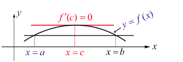
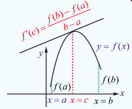
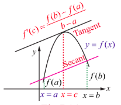

## 7.3 Mean Value Theorem

Mean value theorem establishes the existence of a point, in between two points, at which the tangent to the curve is parallel to the secant joining those two points of the curve. We start this section with the statement of the intermediate value theorem as follows:

> **Theorem 7.1 (Intermediate Value Theorem)**
>
> If $f$ is continuous on a closed interval $[a,b]$, and $c$ is any number between $f(a)$ and $f(b)$ inclusive, then there is at least one number $x$ in the closed interval $[a,b]$, such that $f(x) = c$.

### 7.3.1 Rolle's Theorem

> **Theorem 7.2 (Rolle's Theorem)**
>
> Let $f(x)$ be continuous on a closed interval $[a,b]$ and differentiable on the open interval $(a,b)$. If $f(a) = f(b)$, then there is at least one point $c \in (a,b)$ where $f^{\prime}(c) = 0$.

Geometrically this means that if the tangent is moving along the curve starting at $x = a$ towards $x = b$ then there exists a $c \in (a,b)$ at which the tangent is parallel to the $x$-axis.

**Example 7.19**

Compute the value of $c$ satisfied by the Rolle's theorem for the function $f(x) = x^{2}(1 - x)^{2}$, $x \in [0,1]$.

**Solution**

Observe that, $f(0) = 0 = f(1)$, $f(x)$ is continuous in the interval $[0,1]$ and is differentiable in $(0,1)$. Now,

$$
f^{\prime}(x) = 2x(1 - x)(1 - 2x).
$$

Therefore, $f^{\prime}(c) = 0$ gives $c = 0, 1$, and $\frac{1}{2}$ which $\Rightarrow c = \frac{1}{2} \in (0,1)$.

**Example 7.20**

Find the value in the interval $\left(\frac{1}{2}, 2\right)$ satisfied by the Rolle's theorem for the function $f(x) = x + \frac{1}{x}$, $x \in \left[\frac{1}{2}, 2\right]$.

**Solution**

We have, $f(x)$ is continuous in $\left[\frac{1}{2}, 2\right]$ and differentiable in $\left(\frac{1}{2}, 2\right)$ with $f\left(\frac{1}{2}\right) = \frac{5}{2} = f(2)$. By the Rolle's theorem there must exist a value $c \in \left(\frac{1}{2}, 2\right)$ such that,

$$
f^{\prime}(c) = 1 - \frac{1}{c^{2}} = 0 \Rightarrow c^{2} = 1 \text{ gives } c = \pm 1.
$$

As $1 \in \left(\frac{1}{2}, 2\right)$, we choose $c = 1$.

**Example 7.21**

Compute the value of $c$ satisfied by Rolle's theorem for the function $f(x) = \log \left(\frac{x^{2} + 6}{5x}\right)$ in the interval $[2,3]$.

**Solution**

Observe that, $f(2) = \log\left(\frac{4+6}{10}\right) = \log(1) = 0 = f(3) = \log\left(\frac{9+6}{15}\right) = \log(1) = 0$ and $f(x)$ is continuous in the interval $[2,3]$ and differentiable in $(2,3)$. Now,

$$
f^{\prime}(x) = \frac{x^{2} - 6}{x(x^{2} + 6)}.
$$

Therefore, $f^{\prime}(c) = 0$ gives

$$
\frac{c^{2} - 6}{c(c^{2} + 6)} = 0
$$

which implies $c = \pm \sqrt{6}$.

Now $c = +\sqrt{6} \in (2,3)$. Observe that $-\sqrt{6} \notin (2,3)$ and hence $c = +\sqrt{6}$ satisfies the Rolle's theorem.

Rolle's theorem can also be used to compute the number of roots of an algebraic equation in an interval without actually solving the equation.

**Example 7.22**

Without actually solving show that the equation $x^{4} + 2x^{3} - 2 = 0$ has only one real root in the interval $(0,1)$.

**Solution**

Let $f(x) = x^{4} + 2x^{3} - 2$. Then $f(x)$ is continuous in $[0,1]$ and differentiable in $(0,1)$. Now,

$$
f^{\prime}(x) = 4x^{3} + 6x^{2} = 2x^{2}(2x+3).
$$

$2x^2(2x+3) = 0$ .

Therefore, $x = 0, -\frac{3}{2}$ but $0, -\frac{3}{2} \notin (0,1)$ .

Thus, $f^{\prime}(x) > 0$, $\forall x \in (0,1)$.

Hence by the Rolle's theorem there do not exist $a, b \in (0,1)$ such that $f(a) = 0 = f(b)$. Therefore the equation $f(x) = 0$ cannot have two roots in the interval $(0,1)$. But, $f(0) = -2 < 0$ and $f(1) = 1 + 2 - 2 = 1 > 0$ tells us the curve $y = f(x)$ crosses the $x$-axis between 0 and 1 only once by the Intermediate value theorem. Therefore the equation $x^{4} + 2x^{3} - 2 = 0$ has only one real root in the interval $(0,1)$.

As an application of the Rolle's theorem we have the following:

**Example 7.23**

Prove that between any two distinct real zeros of the polynomial $a_{n}x^{n} + a_{n-1}x^{n-1} + \dots + a_{1}x + a_{0}$ there is a zero of the polynomial $n a_{n}x^{n-1} + (n-1)a_{n-1}x^{n-2} + \dots + a_{1}$ using the Rolle's theorem.

**Solution**

Let $P(x) = a_{n}x^{n} + a_{n-1}x^{n-1} + \dots + a_{1}x + a_{0}$. Let $\alpha < \beta$ be two real zeros of $P(x)$. Therefore, $P(\alpha) = P(\beta) = 0$. Since $P(x)$ is continuous in $[\alpha, \beta]$ and differentiable in $(\alpha, \beta)$ by an application of Rolle's theorem there exists $\gamma \in (\alpha, \beta)$ such that $P^{\prime}(\gamma) = 0$. Since,

$$
P^{\prime}(x) = n a_{n}x^{n-1} + (n-1)a_{n-1}x^{n-2} + \dots + a_{1}
$$

which completes the proof.

**Example 7.24**

Prove that there is a zero of the polynomial $2x^{3} - 9x^{2} - 11x + 12$ in the interval $(2, 7)$ given that 2 and 7 are the zeros of the polynomial $x^{4} - 6x^{3} - 11x^{2} + 24x + 28$.

**Solution**

Applying the above example 7.23 with

$$
P(x) = x^{4} - 6x^{3} - 11x^{2} + 24x + 28, \quad \alpha = 2, \beta = 7
$$

and observing

$$
\frac{P^{\prime}(x)}{2} = 2x^{3} - 9x^{2} - 11x + 12 = Q(x), \text{ (say)}.
$$

This implies that there is a zero of the polynomial $Q(x)$ in the interval $(2, 7)$.

For verification,
$Q(2) = 16 - 36 - 22 + 12 = 28 - 58 = -30 < 0$,
$Q(7) = 686 - 441 - 77 + 12 = 698 - 518 = 180 > 0$.
From this we may see that there is a zero of the polynomial $Q(x)$ in the interval $(2, 7)$.

There are functions for which Rolle's theorem may not be applicable.

(1) For the function $f(x) = |x|$, $x \in [-1,1]$ Rolle's theorem is not applicable, even though $f(-1) = 1 = f(1)$ because $f(x)$ is not differentiable at $x = 0$.

(2) For the function,
$$
f(x) = \begin{cases}
1, & x = 0 \\
x, & 0 < x \leq 1
\end{cases}
$$
even though $f(0) = f(1) = 1$, Rolle's theorem is not applicable because the function $f(x)$ is not continuous at $x = 0$.

(3) For the function $f(x) = \sin x$, $x \in \left[0, \frac{\pi}{2}\right]$ Rolle's theorem is not applicable, even though $f(x)$ is continuous in the closed interval $\left[0, \frac{\pi}{2}\right]$ and differentiable in the open interval $\left(0, \frac{\pi}{2}\right)$ because $0 = f(0) \neq f\left(\frac{\pi}{2}\right) = 1$.

If $f(x)$ is continuous in the closed interval $[a,b]$ and differentiable in the open interval $(a,b)$ and even if $f(a) \neq f(b)$ then the Rolle's theorem can be generalised as follows.

### 7.3.2 Lagrange's Mean Value Theorem

> **Theorem 7.3 (Lagrange's Mean Value Theorem)**

> Let $f(x)$ be continuous in a closed interval $[a,b]$ and differentiable in the open interval $(a,b)$ (where $f(a), f(b)$ are not necessarily equal). Then there exist at least one point $c \in (a,b)$ such that,

> $$
f^{\prime}(c) = \frac{f(b) - f(a)}{b - a} \qquad (6)
$$

> 

> **Remark**
>
> If $f(a) = f(b)$ then Lagrange's Mean Value Theorem gives the Rolle's theorem. It is also known as rotated Rolle's Theorem.

> **Remark**
>
> A physical meaning of the above theorem is the number $\frac{f(b) - f(a)}{b - a}$ can be thought of as the average rate of change in $f(x)$ over $(a,b)$ and $f^{\prime}(c)$ as an instantaneous change.
>
> A geometrical meaning of the Lagrange's mean value theorem is that the instantaneous rate of change at some interior point is equal to the average rate of change over the entire interval. This is illustrated as follows:

If a car accelerating from zero takes just 8 seconds to travel 200 m, its average velocity for the 8 second interval is

$\frac{200}{8} = 25 \, \text{m/s}$ .

The Mean Value Theorem says that at some point during the travel the speedometer must read exactly 90 km/h which is equal to 25 m/s.

> **Theorem 7.4**
>
> If $f(x)$ is continuous in closed interval $[a, b]$ and differentiable in open interval $(a, b)$ and if
>
> $f'(x) > 0$ , $\forall x \in (a, b)$ ,
>
> then for, $x_1, x_2 \in [a, b]$ , such that $x_1 < x_2$ we have,
>
> $f(x_1) < f(x_2)$ .

**Proof**

By the mean value theorem, there exists a $c \in (x_1, x_2) \subset (a, b)$ such that,

$\frac{f(x_2) - f(x_1)}{x_2 - x_1} = f'(c)$

Since $f'(c) > 0$ , and $x_2 - x_1 > 0$ we have

$f(x_2) - f(x_1) > 0$ .

We conclude that, whenever $x_1 < x_2$ , we have $f(x_1) < f(x_2)$ .

> **Remark**
>
> If $f'(x) < 0$ , $\forall x \in (a, b)$ , then for, $x_1, x_2 \in [a, b]$ , such that $x_1 < x_2$ we have, $f(x_1) > f(x_2)$ .

### 7.3.3 Applications
**Example 7.25**

Find the values in the interval $(1,2)$ of the mean value theorem satisfied by the function  
$f(x) = x - x^2$ for $1 \leq x \leq 2$ .

**Solution**

$f(1) = 0$ and $f(2) = -2$ . Clearly $f(x)$ is defined and differentiable in $1 < x < 2$ . Therefore, by the Mean Value Theorem, there exists a $c \in (1,2)$ such that

$f'(c) = \frac{f(2) - f(1)}{2 - 1} = 1 - 2c$

That is,

$1 - 2c = -2 \implies c = \frac{3}{2}$

Geometrical meaning

Geometrically, the mean value theorem says the secant to the curve  
$y = f(x)$ between $x = a$ and $x = b$ is parallel to a tangent line of the curve, at some point $c \in (a,b)$ .

Consequences of Lagrange's Mean Value Theorem

There are three important consequences of MVT for derivatives.

1. To determine the monotonicity of the given function (Theorem 7.4)  
2. If $f'(x) = 0$ for all $x$ in $(a,b)$ , then $f$ is constant on $(a,b)$ .  
3. If $f'(x) = g'(x)$ for all $x$ , then $f(x) = g(x) + C$ for some constant $C$ .

**Example 7.26**

A truck travels on a toll road with a speed limit of $80 \text{ km/hr}$. The truck completes a $164 \text{ km}$ journey in 2 hours. At the end of the toll road the trucker is issued with a speed violation notice. Justify this using the Mean Value Theorem.

**Solution**

Let $f(t)$ be the distance travelled by the trucker in $t$ hours. This is a continuous function in $[0,2]$ and differentiable in $(0,2)$. Now, $f(0) = 0$ and $f(2) = 164$. By an application of the Mean Value Theorem, there exists a time $c$ such that,

$$
f^{\prime}(c) = \frac{164 - 0}{2 - 0} = 82 > 80.
$$

Therefore at some point of time, during the travel in 2 hours the trucker must have travelled with a speed more than $80 \text{ km/hr}$ which justifies the issuance of a speed violation notice.

**Example 7.27**

Suppose $f(x)$ is a differentiable function for all $x$ with $f^{\prime}(x) \leq 29$ and $f(2) = 17$. What is the maximum value of $f(7)$?

**Solution**

By the mean value theorem we have, there exists $c \in (2,7)$ such that,

$$
\frac{f(7) - f(2)}{7 - 2} = f^{\prime}(c) \leq 29.
$$

Hence,

$$
f(7) \leq 5 \times 29 + 17 = 162.
$$

Therefore, the maximum value of $f(7)$ is 162.

**Example 7.28**

Prove that $|\sin \alpha - \sin \beta| \leq |\alpha - \beta|$, $\alpha, \beta \in \mathbb{R}$ using mean value theorem.

**Solution**

Let $f(x) = \sin x$ which is a differentiable function in any open interval. Consider an interval $[\alpha, \beta]$. Applying the mean value theorem there exists $c \in (\alpha, \beta)$ such that,

$$
\frac{\sin\beta - \sin\alpha}{\beta - \alpha} = f^{\prime}(c) = \cos c
$$

$$
\left|\frac{\sin\alpha - \sin\beta}{\alpha - \beta}\right| = |\cos c| \leq 1
$$

Hence, $|\sin \alpha - \sin \beta| \leq |\alpha - \beta|$.

> **Remark**
>
> If we take $\beta = 0$ in the above problem, we get $|\sin \alpha| \leq |\alpha|$.

**Example 7.29**

A thermometer was taken from a freezer and placed in a boiling water. It took 22 seconds for the thermometer to raise from $-10^{\circ}\mathrm{C}$ to $100^{\circ}\mathrm{C}$. Show that the rate of change of temperature at some time $t$ is $5^{\circ}\mathrm{C}$ per second.

**Solution**

Let $f(t)$ be the temperature at time $t$. By the mean value theorem, we have

$$
f^{\prime}(c) = \frac{f(b) - f(a)}{b - a} = \frac{100 - (-10)}{22} = \frac{110}{22} = 5^{\circ}\mathrm{C} \text{ per second}.
$$

Hence the instantaneous rate of change of temperature at some time $t$ is $5^{\circ}\mathrm{C}$ per second.

**EXERCISE 7.3**

1. Explain why Rolle's theorem is not applicable to the following functions in the respective intervals.
   (i) $f(x) = \left|\frac{1}{x}\right|$, $x \in [-1,1]$
   (ii) $f(x) = \tan x$, $x \in [0, \pi]$
   (iii) $f(x) = x - 2\log x$, $x \in [2,7]$

2. Using the Rolle's theorem, determine the values of $x$ at which the tangent is parallel to the $x$-axis for the following functions:
   (i) $f(x) = x^{2} - x$, $x \in [0,1]$
   (ii) $f(x) = \frac{x^{2} - 2x}{x + 2}$, $x \in [-1,6]$
   (iii) $f(x) = \sqrt{x} - \frac{x}{3}$, $x \in [0,9]$

3. Explain why Lagrange's mean value theorem is not applicable to the following functions in the respective intervals:
   (i) $f(x) = \frac{x + 1}{x}$, $x \in [-1,2]$
   (ii) $f(x) = |3x + 1|$, $x \in [-1,3]$

4. Using the Lagrange's mean value theorem determine the values of $x$ at which the tangent is parallel to the secant line at the end points of the given interval:
   (i) $f(x) = x^{3} - 3x + 2$, $x \in [-2,2]$
   (ii) $f(x) = (x - 2)(x - 7)$, $x \in [3,11]$

5. Show that the value in the conclusion of the mean value theorem for
   (i) $f(x) = \frac{1}{x}$ on a closed interval of positive numbers $[a,b]$ is $\sqrt{ab}$
   (ii) $f(x) = Ax^{2} + Bx + C$ on any interval $[a,b]$ is $\frac{a + b}{2}$.

6. A race car driver is in kilometer stone 20. If his speed never exceeds $150 \mathrm{km/hr}$, what is the maximum kilometer stone he can reach in the next two hours.

7. Suppose that for a function $f(x)$, $f'(x) \leq 1$ for all $1 \leq x \leq 4$. Show that $f(4) - f(1) \leq 3$.

8. Does there exist a differentiable function $f(x)$ such that $f(0) = -1$, $f(2) = 4$ and $f^{\prime}(x) \leq 2$ for all $x$. Justify your answer.

9. Show that there lies a point on the curve $f(x) = x(x + 3)e^{-\frac{x}{2}}$, $-3 \leq x \leq 0$ where tangent drawn is parallel to the $x$-axis.

10. Using mean value theorem prove that for $a > 0$, $b > 0$, $|e^{-a} - e^{-b}| < |a - b|$.
