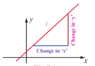
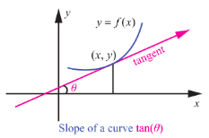
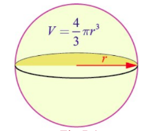
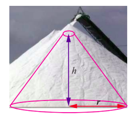
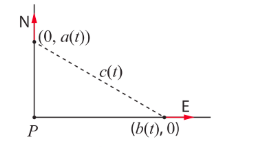
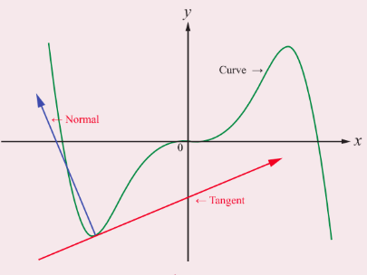
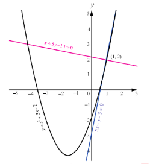
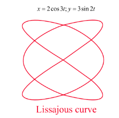
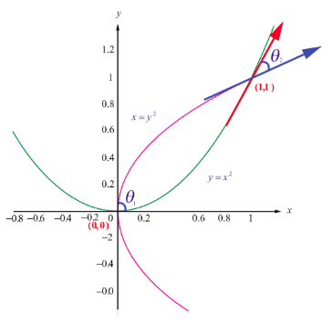

## 7.2 Meaning of Derivatives

### 7.2.1 Derivative as slope

Slope or Gradient of a line: Let $l$ be any given non vertical line as in the Fig. 7.1. Taking a finite horizontal line segment of any length with the starting point in the given line $l$ and the vertical line segment starting from the end of the horizontal line to touch the given line. It can be observed that the ratio of the vertical length to the horizontal length is always a constant. This ratio is called the slope of the line $l$ and it is denoted as $m$.

The slope can be used as a measure to determine the increasing or decreasing nature of a line. The line is said to be increasing or decreasing according as $m > 0$ or $m < 0$ respectively. When $m = 0$, the value of $y$ does not change. Recall that $y = mx + c$ represents a straight line in the $XY$ plane where $m$ denotes the slope of the line.

Slope or Gradient of a curve: Let $y = f(x)$ be a given curve. The slope of the line joining the two distinct points $(x,f(x))$ and the point $(x + h,f(x + h))$ is

$$
\frac{f(x + h) - f(x)}{h}. \quad \text{(Newton quotient).} \quad (1)
$$

Taking the limit as $h \rightarrow 0$, we get

$$
\lim_{h\to 0}\frac{f(x + h) - f(x)}{h} = f^{\prime}(x), \quad (\text{limit of Newton quotient}) \quad (2)
$$

which is the slope of the curve at the point $(x,y)$ or $(x,f(x))$.

> **Remark**
>
> If $\theta$ is the angle made by the tangent to the curve $y = f(x)$ at the point $(x,y)$, then the slope of the curve at $(x,y)$ is $f^{\prime}(x) = \tan \theta$, where $\theta$ is measured in the anti-clockwise direction from the $X$-axis. Note that, $f^{\prime}(x)$ is also denoted by $\frac{dy}{dx}$ and also called instantaneous rate of change. The average rate of change in an interval is calculated using Newton quotient.

**Example 7.1**

For the function $f(x) = x^{2}, x \in [0,2]$ compute the average rate of changes in the subintervals $[0,0.5]$, $[0.5,1]$, $[1,1.5]$, $[1.5,2]$ and the instantaneous rate of changes at the points $x = 0.5, 1, 1.5, 2$.

**Solution**

The average rate of change in an interval $[a,b]$ is $\frac{f(b) - f(a)}{b - a}$ whereas, the instantaneous rate of change at a point $x$ is $f^{\prime}(x)$ for the given function. They are respectively, $b + a$ and $2x$.

### 7.2.2 Derivative as rate of change

| $a$ | $b$ | Average rate is $\frac{f(b)-f(a)}{b-a}$ | Instantaneous rate is $f'(x)=2x$ |
| :--- | :--- | :--- | :--- |
| 0 | 0.5 | 0.5 | 1 |
| 0.5 | 1 | 1.5 | 2 |
| 1 | 1.5 | 2.5 | 3 |
| 1.5 | 2 | 3.5 | 4 |

**Table 7.1**

We have seen how the derivative is used to determine slope. The derivative can also be used to determine the rate of change of one variable with respect to another. A few examples are population growth rates, production rates, water flow rates, velocity, and acceleration.

A common use of rate of change is to describe the motion of an object moving in a straight line. In such problems, it is customary to use either a horizontal or a vertical line with a designated origin to represent the line of motion. On such lines, movements in the forward direction considered to be in the positive direction and movements in the backward direction is considered to be in the negative direction.

The function $s(t)$ that gives the position (relative to the origin) of an object as a function of time $t$ is called a position function. It is denoted by $s = f(t)$. The velocity and the acceleration at time $t$ is denoted as $v(t) = \frac{ds}{dt}$, and $a(t) = \frac{dv}{dt} = \frac{d^2s}{dt^2}$.

> **Remark**
>
> The following remarks are easy to observe:
> 
> (1) Speed is the absolute value of velocity regardless of direction and hence,
> 
> $$
> \text{Speed} = |v(t)| = \left|\frac{ds}{dt}\right|.
> $$
> 
> (2) When the particle is at rest then $v(t) = 0$.
> 
> When the particle is moving forward then $v(t) > 0$.
> 
> When the particle is moving backward then $v(t) < 0$.
> 
> When the particle changes direction, $v(t)$ then changes its sign.
> 
> (3) If $t_{c}$ is the time point between the time points $t_{1}$ and $t_{2}$ $(t_{1} < t_{c} < t_{2})$ where the particle changes direction then the total distance travelled from time $t_{1}$ to time $t_{2}$ is calculated as
> 
> $$
> \left|s(t_{1}) - s(t_{c})\right| + \left|s(t_{c}) - s(t_{2})\right|.
> $$
> 
> (4) Near the surface of the planet Earth, all bodies fall with the same constant acceleration. When air resistance is absent or insignificant and only force acting on a falling body is the force of gravity, we call the way the body falls is a free fall.

An object thrown at time $t = 0$ from initial height $s_0$ with initial velocity $v_0$ satisfies the equation.

$a = -g$ , $v = -gt + v_0$ , $s = -\frac{gt^2}{2} + v_0t + s_0$ .

where, $g = 9.8 \, \text{m/s}^2$ or $32 \, \text{ft/s}^2$ .

A few examples of **quantities** which are the **rates of change with respect to some other quantity** in our daily life are given below:

1.  Slope is the rate of change in vertical length with respect to horizontal length.
2.  Velocity is the rate of displacement with respect to time.
3.  Acceleration is the rate of change in velocity with respect to time.
4.  The steepness of a hillside is the rate of change in its elevation with respect to linear distance.

Consider the following two situations:

- A person is continuously driving a car from Chennai to Dharmapuri. The distance (measured in kilometre) travelled is expressed as a function of time (measured in hours) by $D(t)$. What is the meaning one can attribute to $D'(3) = 70$?
  - It means that, "the rate of distance when $t = 3$ is 70 kmph".

- A water source is draining with respect to the time $t$. The amount of water so drained after $t$ days is expressed as $V(t)$. What is the meaning of the slope of the tangent to the curve $y = V(t)$ at $t = 7$ is $-3$?
  - It means that, "the water is draining at the rate of 3 units per day on day 7".

Likewise the rate of change concept can be used in our daily life problems. Let us now illustrate this with more examples.

**Example 7.2**

The temperature $T$ in celsius in a long rod of length $10\mathrm{m}$, insulated at both ends, is a function of length $x$ given by $T = x(10 - x)$. Prove that the rate of change of temperature at the midpoint of the rod is zero.

**Solution**

We are given that, $T = 10x - x^2$. Hence, the rate of change at any distance from one end is given by $\frac{dT}{dx} = 10 - 2x$. The mid point of the rod is at $x = 5$. Substituting $x = 5$, we get $\frac{dT}{dx} = 0$.

**Example 7.3**

A person learnt 100 words for an English test. The number of words the person remembers in $t$ days after learning is given by $W(t) = 100 \times (1 - 0.1t)^2$ , $0 \leq t \leq 10$ . What is the rate at which the person forgets the words 2 days after learning?

**Solution**

We have,

$\frac{d}{dt} W(t) = -20 \times (1 - 0.1t)$ .

Therefore at $t = 2$ , $\frac{d}{dt} W(t) = -16$ .

That is, the person forgets at the rate of 16 words after 2 days of studying.

**Example 7.4**

The distance travelled by a moving particle in time $t$ is given by $s(t) = \frac{t^3}{3} - t^2 + 3$. Find the time when the velocity and acceleration are zero.

**Solution**

Distance moved in time $t$ is $s = \frac{t^{3}}{3} - t^{2} + 3$.

Velocity at time $t$ is $v(t) = \frac{ds}{dt} = t^{2} - 2t$.

Acceleration at time $t$ is $a(t) = \frac{dv}{dt} = 2t - 2$.

Therefore, the velocity is zero when $t^2 - 2t = 0$, that is $t = 0, 2$. The acceleration is zero when $2t - 2 = 0$. That is at time $t = 1$.

**Example 7.5**

A particle is fired straight up from the ground to reach a height of $s$ feet in $t$ seconds, where $s(t) = 128t - 16t^2$.

(i) Compute the maximum height of the particle reached.
(ii) What is the velocity when the particle hits the ground?

**Solution**

(i) At the maximum height, the velocity $v(t)$ of the particle is zero.

Now, we find the velocity of the particle at time $t$.

$$
v(t) = \frac{ds}{dt} = 128 - 32t
$$

$$
v(t) = 0 \Rightarrow 128 - 32t = 0 \Rightarrow t = 4.
$$

At $t = 4$ seconds, the particle reaches the maximum height.

The height at $t = 4$ is $s(4) = 128(4) - 16(4)^2 = 256$ ft.

(ii) When the particle hits the ground then $s = 0$.

$$
s = 0 \Rightarrow 128t - 16t^2 = 0
$$

$$
\Rightarrow t = 0, 8 \text{ seconds}.
$$

The particle hits the ground at $t = 8$ seconds. The velocity when it hits the ground is $v(8) = -128$ ft/s.

**Example 7.6**

A particle moves along a horizontal line such that its position at any time $t \geq 0$ is given by $s(t) = t^3 - 6t^2 + 9t + 1$, where $s$ is measured in metres and $t$ in seconds.

(i) At what time the particle is at rest?
(ii) At what time the particle changes its direction?
(iii) Find the total distance travelled by the particle in the first 2 seconds.

**Solution**

Given that $s(t) = t^3 - 6t^2 + 9t + 1$. On differentiating, we get $v(t) = 3t^2 - 12t + 9$ and $a(t) = 6t - 12$.

(i) The particle is at rest when $v(t) = 0$. Therefore, $v(t) = 3(t - 1)(t - 3) = 0$ gives $t = 1$ and $t = 3$.

(ii) The particle changes its direction when $v(t)$ changes its sign. Now,
- if $0 \leq t < 1$ then both $(t - 1)$ and $(t - 3) < 0$ and hence, $v(t) > 0$
- if $1 < t < 3$ then $(t - 1) > 0$ and $(t - 3) < 0$ and hence, $v(t) < 0$
- if $t > 3$ then both $(t - 1)$ and $(t - 3) > 0$ and hence, $v(t) > 0$

Therefore, the particle changes its direction when $t = 1$ and $t = 3$.

(iii) The total distance travelled by the particle from time $t = 0$ to $t = 2$ is given by,
$|s(0) - s(1)| + |s(1) - s(2)| = |1 - 5| + |5 - 3| = 6$ metres.

### 7.2.3 Related rates

A related rates problem is a problem which involves at least two changing quantities and asks you to figure out the rate at which one is changing given sufficient information on all of the others. For instance, when two vehicles drive in different directions we should be able to deduce the speed at which they are separating if we know their individual speeds and directions.

**Example 7.7**

If we blow air into a balloon of spherical shape at a rate of $1000\mathrm{cm}^3$ per second, at what rate the radius of the balloon changes when the radius is $7\mathrm{cm}$? Also compute the rate at which the surface area changes.

**Solution**

The volume of the balloon of radius $r$ is $V = \frac{4}{3}\pi r^3$.

We are given $\frac{dV}{dt} = 1000$ and we need to find $\frac{dr}{dt}$ when $r = 7$.

Now,

$$
\frac{dV}{dt} = 4\pi r^2 \frac{dr}{dt}.
$$

Substituting $r = 7$ and $\frac{dV}{dt} = 1000$, we get $1000 = 4\pi \times 49 \times \frac{dr}{dt}$.

Hence,

$$
\frac{dr}{dt} = \frac{1000}{4 \times 49 \times \pi} = \frac{250}{49\pi}.
$$

The surface area $S$ of the balloon is $S = 4\pi r^2$. Therefore,

$$
\frac{dS}{dt} = 8\pi r \frac{dr}{dt}.
$$

Substituting $\frac{dr}{dt} = \frac{250}{49\pi}$ and $r = 7$, we get

$$
\frac{dS}{dt} = 8\pi \times 7 \times \frac{250}{49\pi} = \frac{2000}{7}.
$$

Therefore, the rate of change of radius is $\frac{250}{49\pi}$ cm/sec and the rate of change of surface area is $\frac{2000}{7}$ cm²/sec.

**Example 7.8**

The price of a product is related to the number of units available (supply) by the equation $P x + 3P - 16x = 234$, where $P$ is the price of the product per unit in Rupees (₹) and $x$ is the number of units. Find the rate at which the price is changing with respect to time when 90 units are available and the supply is increasing at a rate of 15 units/week.

**Solution**

We have,

$$
P = \frac{234 + 16x}{x + 3}
$$

Therefore,

$$
\frac{dP}{dt} = -\frac{186}{(x + 3)^2} \frac{dx}{dt}.
$$

Substituting $x = 90$, $\frac{dx}{dt} = 15$, we get

$$
\frac{dP}{dt} = -\frac{186}{93^2} \times 15 = -\frac{10}{31} \approx -0.32 \text{ rupee/week}.
$$

That is the price is changing, in fact decreasing at the rate of 0.32 per week.

**Example 7.9**

Salt is poured from a conveyor belt at a rate of 30 cubic metre per minute forming a conical pile with a circular base whose height and diameter of base are always equal. How fast is the height of the pile increasing when the pile is 10 metre high?

**Solution**

Let $h$ and $r$ be the height and the base radius. Therefore $h = 2r$. Let $V$ be the volume of the salt cone.

$$
V = \frac{1}{3}\pi r^2 h = \frac{1}{12}\pi h^3; \quad \frac{dV}{dt} = 30 \text{ m}^3/\text{min}.
$$

Hence,

$$
\frac{dV}{dt} = \frac{1}{4}\pi h^2 \frac{dh}{dt}
$$

Therefore,

$$
\frac{dh}{dt} = \frac{4 \frac{dV}{dt}}{\pi h^2}
$$

That is,

$$
\frac{dh}{dt} = \frac{4 \times 30}{100\pi} = \frac{6}{5\pi} \text{ m/min}.
$$

**Example 7.10 (Two variable related rate problem)**

A road running north to south crosses a road going east to west at the point $P$. Car $A$ is driving north along the first road, and car $B$ is driving east along the second road. At a particular time car $A$ is 10 kilometres to the north of $P$ and traveling at $80 \text{ km/hr}$, while car $B$ is 15 kilometres to the east of $P$ and traveling at $100 \text{ km/hr}$. How fast is the distance between the two cars changing?

**Solution**

Let $a(t)$ be the distance of car $A$ north of $P$ at time $t$, and $b(t)$ the distance of car $B$ east of $P$ at time $t$, and let $c(t)$ be the distance from car $A$ to car $B$ at time $t$. By the Pythagorean Theorem, $c(t)^2 = a(t)^2 + b(t)^2$.

Taking derivatives, we get $2c(t)c'(t) = 2a(t)a'(t) + 2b(t)b'(t)$.

So,

$$
c' = \frac{aa' + bb'}{c} = \frac{aa' + bb'}{\sqrt{a^2 + b^2}}
$$

Substituting known values, we get

$$
c' = \frac{(10 \times 80) + (15 \times 100)}{\sqrt{10^2 + 15^2}} = \frac{2300}{\sqrt{325}} = \frac{460}{\sqrt{13}} \approx 127.6 \text{ km/hr}
$$

at the time of interest.

**EXERCISE 7.1**

1. A particle moves along a straight line in such a way that after $t$ seconds its distance from the origin is $s = 2t^2 + 3t$ metres.
   (i) Find the average velocity between $t = 3$ and $t = 6$ seconds.
   (ii) Find the instantaneous velocities at $t = 3$ and $t = 6$ seconds.

2. A camera is accidentally knocked off an edge of a cliff 400 ft high. The camera falls a distance of $s = 16t^2$ in $t$ seconds.
   (i) How long does the camera fall before it hits the ground?
   (ii) What is the average velocity with which the camera falls during the last 2 seconds?
   (iii) What is the instantaneous velocity of the camera when it hits the ground?

3. A particle moves along a line according to the law $s(t) = 2t^3 - 9t^2 + 12t - 4$, where $t \geq 0$.
   (i) At what times the particle changes direction?
   (ii) Find the total distance travelled by the particle in the first 4 seconds.
   (iii) Find the particle's acceleration each time the velocity is zero.

4. If the volume of a cube of side length $x$ is $v = x^3$. Find the rate of change of the volume with respect to $x$ when $x = 5$ units.

5. If the mass $m(x)$ (in kilograms) of a thin rod of length $x$ (in metres) is given by, $m(x) = \sqrt{3x}$ then what is the rate of change of mass with respect to the length when it is $x = 3$ and $x = 27$ metres.

6. A stone is dropped into a pond causing ripples in the form of concentric circles. The radius $r$ of the outer ripple is increasing at a constant rate at $2 \text{ cm}$ per second. When the radius is $5 \text{ cm}$ find the rate of changing of the total area of the disturbed water.

7. A beacon makes one revolution every 10 seconds. It is located on a ship which is anchored $5 \text{ km}$ from a straight shore line. How fast is the beam moving along the shore line when it makes an angle of $45^{\circ}$ with the shore?

8. A conical water tank with vertex down of 12 metres height has a radius of 5 metres at the top. If water flows into the tank at a rate 10 cubic m/min, how fast is the depth of the water increases when the water is 8 metres deep?

9. A ladder 17 metre long is leaning against the wall. The base of the ladder is pulled away from the wall at a rate of $5 \text{ m/s}$. When the base of the ladder is 8 metres from the wall,
    (i) how fast is the top of the ladder moving down the wall?
    (ii) at what rate, the area of the triangle formed by the ladder, wall, and the floor, is changing?

10. A police jeep, approaching an orthogonal intersection from the northern direction, is chasing a speeding car that has turned and moving straight east. When the jeep is $0.6 \text{ km}$ north of the intersection and the car is $0.8 \text{ km}$ to the east. The police determine with a radar that the distance between them and the car is increasing at $20 \text{ km/hr}$. If the jeep is moving at $60 \text{ km/hr}$ at the instant of measurement, what is the speed of the car?

### 7.2.4 Equations of Tangent and Normal

According to Leibniz, tangent is the line through a pair of very close points on the curve.

> **Definition 7.1**
>
> The tangent line (or simply tangent) to a plane curve at a given point is the straight line that just touches the curve at that point.

> **Definition 7.2**
>
> The normal at a point on the curve is the straight line which is perpendicular to the tangent at that point.
>
> The tangent and the normal of a curve at a point are illustrated in Fig. 7.7.

Consider the given curve $y = f(x)$.

The equation of the tangent to the curve at the point, say $(a,b)$, is given by

$$
y - b = (x - a) \left(\frac{dy}{dx}\right)_{(a,b)} \quad \text{or} \quad y - b = f^{\prime}(a) (x - a).
$$

In order to get the equation of the normal to the same curve at the same point, we observe that normal is perpendicular to the tangent at the point. Therefore, the slope of the normal at $(a,b)$ is the negative of the reciprocal of the slope of the tangent which is $-\left(\frac{1}{\frac{dy}{dx}}\right)_{(a,b)}$.

Hence, the equation of the normal is,

$$
(y - b) = -\left(\frac{1}{\frac{dy}{dx}}\right)_{(a,b)} (x - a) \quad \text{or} \quad (y - b) \left(\frac{dy}{dx}\right)_{(a,b)} = -(x - a).
$$

> **Remark**
>
> (i) If the tangent to a curve is horizontal at a point, then the derivative at that point is 0. Hence, at that point $(x_{1},y_{1})$ the equation of the tangent is $y = y_{1}$ and equation of the normal is $x = x_{1}$.
>
> (ii) If the tangent to a curve is vertical at a point, then the derivative exists and infinite $(\infty)$ at the point. Hence, at that point $(x_{1},y_{1})$ the equation of the tangent is $x = x_{1}$ and the equation of the normal is $y = y_{1}$.

**Example 7.11**

Find the equations of tangent and normal to the curve $y = x^{2} + 3x - 2$ at the point $(1,2)$.

**Solution**

We have, $\frac{dy}{dx} = 2x + 3$. Hence at $(1,2)$, $\frac{dy}{dx} = 5$.

Therefore, the required equation of tangent is

$$
(y - 2) = 5(x - 1) \Rightarrow 5x - y - 3 = 0.
$$

The slope of the normal at the point $(1,2)$ is $-\frac{1}{5}$.

Therefore, the required equation of normal is

$$
(y - 2) = -\frac{1}{5} (x - 1) \Rightarrow x + 5y - 11 = 0.
$$

**Example 7.12**

Find the points on the curve $y = x^{3} - 3x^{2} + x - 2$ at which the tangent is parallel to the line $y = x$.

**Solution**

The slope of the line $y = x$ is 1. The tangent to the given curve will be parallel to the line, if the slope of the tangent to the curve at a point is also 1. Hence,

$$
\frac{dy}{dx} = 3x^{2} - 6x + 1 = 1
$$

which gives $3x^{2} - 6x = 0$.

Hence, $x = 0$ and $x = 2$.

Therefore, at $(0, -2)$ and $(2, -4)$ the tangent is parallel to the line $y = x$.

**Example 7.13**

Find the equation of the tangent and normal at any point to the Lissajous curve given by $x = 2\cos 3t$ and $y = 3\sin 2t$, $t \in \mathbb{R}$.

**Solution**

Observe that the given curve is neither a circle nor an ellipse. For your reference the curve is shown in Fig. 7.9.

Now,

$$
\frac{dy}{dx} = \frac{\frac{dy}{dt}}{\frac{dx}{dt}} = \frac{6\cos 2t}{-6\sin 3t} = -\frac{\cos 2t}{\sin 3t}.
$$

Therefore, the tangent at any point is

$$
y - 3\sin 2t = -\frac{\cos 2t}{\sin 3t} (x - 2\cos 3t)
$$

That is,

$$
x \cos 2t + y \sin 3t = 3 \sin 2t \sin 3t + 2 \cos 2t \cos 3t.
$$

The slope of the normal is the negative of the reciprocal of the tangent which in this case is $\frac{\sin 3t}{\cos 2t}$. Hence, the equation of the normal is

$$
y - 3\sin 2t = \frac{\sin 3t}{\cos 2t} (x - 2\cos 3t)
$$

$$
x \sin 3t - y \cos 2t = 2 \sin 3t \cos 3t - 3 \sin 2t \cos 2t = \sin 6t - \frac{3}{2} \sin 4t.
$$

### 7.2.5 Angle between two curves

> **Definition 7.3**
> 
> Angle between two curves, if they intersect, is defined as the acute angle between the tangent lines to those two curves at the point of intersection.

For the given curves, at the point of intersection using the slopes of the tangents, we can measure the acute angle between the two curves. Suppose $y = m_{1}x + c_{1}$ and $y = m_{2}x + c_{2}$ are two lines, then the acute angle $\theta$ between these lines is given by,

$$
\tan \theta = \left|\frac{m_{1} - m_{2}}{1 + m_{1}m_{2}}\right| \quad (3)
$$

where $m_{1}$ and $m_{2}$ are finite.

> **Remark**
>
> (i) If the two curves are parallel at $(x_{1},y_{1})$, then $m_{1} = m_{2}$.
>
> (ii) If the two curves are perpendicular at $(x_{1},y_{1})$ and if $m_{1}$ and $m_{2}$ exists and finite then $m_{1}m_{2} = -1$.

**Example 7.14**

Find the angle between $y = x^{2}$ and $y = (x - 3)^{2}$.

**Solution**

Let us now find the point of intersection of the two given curves. Equating $x^{2} = (x - 3)^{2}$ we get, $x = \frac{3}{2}$. Therefore, the point of intersection is $\left(\frac{3}{2}, \frac{9}{4}\right)$. Let $\theta$ be the angle between the curves. The slopes of the curves are as follows:

For $y = x^{2}$,
$$
\frac{dy}{dx} = 2x.
$$
Let $m_{1} = \frac{dy}{dx}$ at $\left(\frac{3}{2}, \frac{9}{4}\right) = 3$.

For $y = (x - 3)^{2}$,
$$
\frac{dy}{dx} = 2(x - 3).
$$
Let $m_{2} = \frac{dy}{dx}$ at $\left(\frac{3}{2}, \frac{9}{4}\right) = -3$.

Using (3), we get

$$
\tan \theta = \left|\frac{3 - (-3)}{1 + (3)(-3)}\right| = \left|\frac{6}{1 - 9}\right| = \frac{3}{4}
$$

Hence,

$$
\theta = \tan^{-1}\left(\frac{3}{4}\right).
$$

**Example 7.15**

Find the angle between the curves $y = x^2$ and $x = y^2$ at their points of intersection $(0,0)$ and $(1,1)$ .

**Solution**

Let us now find the slopes of the curves.  
Let $m_1$ be the slope of the curve $y = x^2$ ,  
then $m_1 = \frac{dy}{dx} = 2x$ .

Let $m_2$ be the slope of the curve $x = y^2$ ,  
then $m_2 = \frac{dy}{dx} = \frac{1}{2y}$ .

Let $\theta_1$ and $\theta_2$ be the angles at $(0,0)$ and $(1,1)$ respectively.  
At $(0,0)$ , we come across the indeterminate form of $0 \times \infty$ in the denominator of

$\tan \theta_1 = \left| \frac{2x - \frac{1}{2y}}{1 + (2x)\left(\frac{1}{2y}\right)} \right|$ and so we follow the limiting process.

$\tan \theta_1 = \lim_{(x,y) \to (0,0)} \left| \frac{2x - \frac{1}{2y}}{1 + (2x)\left(\frac{1}{2y}\right)} \right| = \lim_{(x,y) \to (0,0)} \left| \frac{4xy - 1}{2(y + x)} \right| = \infty$

which gives

$\theta_1 = \tan^{-1}(\infty) = \frac{\pi}{2}$ .

At $(1,1)$ , $m_1 = 2$ , $m_2 = \frac{1}{2}$ ,

$\tan \theta_2 = \left| \frac{2 - \frac{1}{2}}{1 + (2)\left(\frac{1}{2}\right)} \right| = \frac{3}{4}$

which gives

$\theta_2 = \tan^{-1}\left(\frac{3}{4}\right)$ .

**Example 7.16**

Find the angle of intersection of the curve $y = \sin x$ with the positive $x$-axis.

**Solution**

When the curve $y = \sin x$ intersects the positive $x$-axis, $y = 0$ which gives $x = n\pi$, $n = 1, 2, 3, \ldots$.

Now, $\frac{dy}{dx} = \cos x$. The slope at $x = n\pi$ is $\cos (n\pi) = (-1)^n$. Hence, the required angle of intersection is

$$
\tan \theta = \left|\frac{(-1)^n - 0}{1 + (-1)^n (0)}\right| = 1 \quad \forall n
$$

**Example 7.17**

If the curves $ax^{2} + by^{2} = 1$ and $cx^{2} + dy^{2} = 1$ intersect each other orthogonally then prove that $\frac{1}{a} - \frac{1}{b} = \frac{1}{c} - \frac{1}{d}$.

**Solution**

Let the two curves intersect at a point $(x_{0}, y_{0})$. This leads to $(a - c)x_{0}^{2} + (b - d)y_{0}^{2} = 0$.

Let us now find the slope of the curves at the point of intersection $(x_{0}, y_{0})$. The slopes of the curves are as follows:

For the curve $ax^{2} + by^{2} = 1$,
$$
\frac{dy}{dx} = -\frac{ax}{by}.
$$

For the curve $cx^{2} + dy^{2} = 1$,
$$
\frac{dy}{dx} = -\frac{cx}{dy}.
$$

Now, if two curves cut orthogonally, then the product of their slopes, at the point of intersection $(x_{0}, y_{0})$, is $-1$. Hence, if the above two curves cut orthogonally at $(x_{0}, y_{0})$ then

$$
\left(-\frac{ax_{0}}{by_{0}}\right) \times \left(-\frac{cx_{0}}{dy_{0}}\right) = -1.
$$

That is,

$$
\frac{ac x_{0}^{2}}{bd y_{0}^{2}} = -1 \quad \Rightarrow \quad ac x_{0}^{2} + bd y_{0}^{2} = 0,
$$

together with $(a - c)x_{0}^{2} + (b - d)y_{0}^{2} = 0$

gives,

$$
\frac{a - c}{ac} = \frac{b - d}{bd}.
$$

That is,

$$
\frac{1}{c} - \frac{1}{a} = \frac{1}{d} - \frac{1}{b}.
$$

Hence,

$$
\frac{1}{a} - \frac{1}{b} = \frac{1}{c} - \frac{1}{d}.
$$

> **Remark**
>
> In the above example, the converse is also true. That is assuming the condition $\frac{1}{a} - \frac{1}{b} = \frac{1}{c} - \frac{1}{d}$ one can easily establish that the curves cut orthogonally.

**Example 7.18**

Prove that the ellipse $x^{2} + 4y^{2} = 8$ and the hyperbola $x^{2} - 2y^{2} = 4$ intersect orthogonally.

**Solution**

Let the point of intersection of the two curves be $(a,b)$. Hence,

$$
a^{2} + 4b^{2} = 8 \quad \text{and} \quad a^{2} - 2b^{2} = 4 \quad (4)
$$

It is enough to show that the product of the slopes of the two curves evaluated at $(a,b)$ is $-1$.

Differentiation of $x^{2} + 4y^{2} = 8$ with respect to $x$, gives

$$
2x + 8y \frac{dy}{dx} = 0 \quad \Rightarrow \quad \frac{dy}{dx} = -\frac{x}{4y}.
$$

Then $\frac{dy}{dx}$ at $(a,b)$ is $m_{1} = -\frac{a}{4b}$.

Differentiation of $x^{2} - 2y^{2} = 4$ with respect to $x$, gives

$$
2x - 4y \frac{dy}{dx} = 0 \quad \Rightarrow \quad \frac{dy}{dx} = \frac{x}{2y}.
$$

Then $\frac{dy}{dx}$ at $(a,b)$ is $m_{2} = \frac{a}{2b}$.

Therefore,

$$
m_{1} \times m_{2} = \left(-\frac{a}{4b}\right) \times \left(\frac{a}{2b}\right) = -\frac{a^{2}}{8b^{2}} \quad (5)
$$

Solving the equations in (4) for $a^2$ and $b^2$:
Adding the two equations: $2a^2 + 2b^2 = 12 \Rightarrow a^2 + b^2 = 6$.
Subtracting the second from the first: $(a^2+4b^2) - (a^2-2b^2) = 8-4 \Rightarrow 6b^2 = 4 \Rightarrow b^2 = \frac{2}{3}$.
Then $a^2 = 6 - b^2 = 6 - \frac{2}{3} = \frac{16}{3}$.

Substituting in (5), we get

$$
m_{1} m_{2} = -\frac{\frac{16}{3}}{8 \times \frac{2}{3}} = -\frac{\frac{16}{3}}{\frac{16}{3}} = -1.
$$

Hence, the curves cut orthogonally.

**EXERCISE 7.2**

1. Find the slope of the tangent to the following curves at the respective given points.
   (i) $y = x^{4} + 2x^{2} - x$ at $x = 1$
   (ii) $x = a\cos^{3}t, y = b\sin^{3}t$ at $t = \frac{\pi}{2}$.

2. Find the point on the curve $y = x^{2} - 5x + 4$ at which the tangent is parallel to the line $3x + y = 7$.

3. Find the points on the curve $y = x^{3} - 6x^{2} + x + 3$ where the normal is parallel to the line $x + y = 1729$.

4. Find the points on the curve $y^{2} - 4xy = x^{2} + 5$ for which the tangent is horizontal.

5. Find the tangent and normal to the following curves at the given points on the curve.
   (i) $y = x^{2} - x^{4}$ at $(1,0)$
   (ii) $y = x^{4} + 2e^{x}$ at $(0,2)$
   (iii) $y = x\sin x$ at $\left(\frac{\pi}{2}, \frac{\pi}{2}\right)$
   (iv) $x = \cos t, y = 2\sin^{2}t$ at $t = \frac{\pi}{3}$

6. Find the equations of the tangents to the curve $y = 1 + x^{3}$ for which the tangent is orthogonal with the line $x + 12y = 12$.

7. Find the equations of the tangents to the curve $y = \frac{x + 1}{x - 1}$ which are parallel to the line $x + 2y = 6$.

8. Find the equation of tangent and normal to the curve given by $x = 7\cos t$ and $y = 2\sin t$, $t \in \mathbb{R}$ at any point on the curve.

9. Find the angle between the rectangular hyperbola $xy = 2$ and the parabola $x^{2} + 4y = 0$.

10. Show that the two curves $x^{2} - y^{2} = r^{2}$ and $xy = c^{2}$ where $c, r$ are constants, cut orthogonally.
