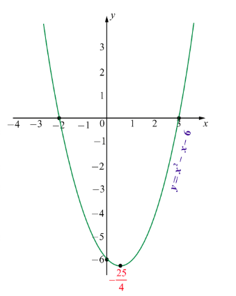
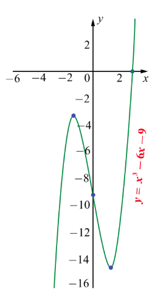
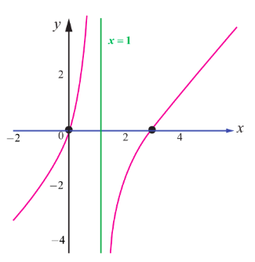
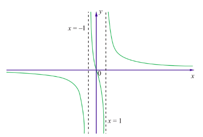

## 7.10 Sketching of Curves

When we are sketching the graph of functions either by hand or through any graphing software we cannot show the entire graph. Only a part of the graph can be sketched. Hence a crucial question is which part of the curve we need to show and how to decide that part. To decide on this we use the derivatives of functions. We enlist few guidelines for determining a good viewing rectangle for the graph of a function. They are:

(i) The domain and the range of the function.
(ii) The intercepts of the curve (if any).
(iii) Critical points of the function.
(iv) Local extrema of the function.
(v) Intervals of concavity.
(vi) Points of inflexions (if any).
(vii) Asymptotes of the curve (if exists)

**Example 7.69**

Sketch the curve $y = f(x) = x^{2} - x - 6$.

**Solution**

Factorising the given function, we have $y = f(x) = (x - 3)(x + 2)$.

(1) The domain of the given function $f(x)$ is the entire real line.

(2) Putting $y = 0$ we get $x = -2, 3$. Therefore the $x$-intercepts are $(-2, 0)$ and $(3, 0)$; putting $x = 0$ we get $y = -6$. Therefore the $y$-intercept is $(0, -6)$.

(3) $f^{\prime}(x) = 2x - 1$ and hence the critical point of the curve occurs at $x = \frac{1}{2}$.

(4) $f^{\prime \prime}(x) = 2 > 0$, $\forall x$. Therefore at $x = \frac{1}{2}$ the curve has a local minimum which is $f\left(\frac{1}{2}\right) = -\frac{25}{4}$.

(5) The range of the function is $y \geq -\frac{25}{4}$.

(6) Since $f^{\prime \prime}(x) = 2 > 0$, $\forall x$ the function is concave upward in the entire real line.

(7) Since $f^{\prime \prime}(x) \neq 0$, $\forall x$ the curve has no points of inflection.

(8) The curve has no asymptotes.

The rough sketch of the curve is shown on the right side.

**Example 7.70**

Sketch the curve $y = f(x) = x^{3} - 6x - 9$.

**Solution**

Factorising the given function, we have

$$
y = f(x) = (x - 3)(x^{2} + 3x + 3).
$$

(1) The domain and the range of the given function $f(x)$ are the entire real line.

(2) Putting $y = 0$, we get $x = 3$. The other two roots are imaginary. Therefore, the $x$-intercept is $(3, 0)$. Putting $x = 0$, we get $y = -9$. Therefore, the $y$-intercept is $(0, -9)$.

(3) $f^{\prime}(x) = 3(x^{2} - 2)$ and hence the critical points of the curve occur at $x = \pm \sqrt{2}$.

(4) $f^{\prime \prime}(x) = 6x$. Therefore at $x = \sqrt{2}$ the curve has a local minimum because $f^{\prime \prime}(\sqrt{2}) = 6\sqrt{2} > 0$. The local minimum is $f(\sqrt{2}) = -4\sqrt{2} - 9$. Similarly at $x = -\sqrt{2}$ the curve has a local maximum because $f^{\prime \prime}(-\sqrt{2}) = -6\sqrt{2} < 0$. The local maximum is $f(-\sqrt{2}) = 4\sqrt{2} - 9$.

(5) Since $f^{\prime \prime}(x) = 6x > 0$ $\forall x > 0$ the function is concave upward in the positive real line. As $f^{\prime \prime}(x) = 6x < 0$ $\forall x < 0$ the function is concave downward in the negative real line.

(6) Since $f^{\prime \prime}(x) = 0$ at $x = 0$ and $f^{\prime \prime}(x)$ changes its sign when passing through $x = 0$. Therefore the point of inflection is $(0, f(0)) = (0, -9)$.

(7) The curve has no asymptotes.

The rough sketch of the curve is shown on the right side.

**Example 7.71**

Sketch the curve $y = \frac{x^{2} - 3x}{(x - 1)}$.

**Solution**

Factorising the given function we have,

$$
y = f(x) = \frac{x(x - 3)}{(x - 1)}.
$$

(1) The domain and the range of $f(x)$ are respectively $\mathbb{R} \setminus \{1\}$ and the entire real line.

(2) Putting $y = 0$ we get $x = 0, 3$. Therefore the $x$-intercepts are $(0, 0)$ and $(3, 0)$. Putting $x = 0$, we get $y = 0$. Therefore the curve passes through the origin.

(3) $f^{\prime}(x) = \frac{x^{2} - 2x + 3}{(x - 1)^{2}}$ and hence the critical point of the curve occurs at $x = 1$ as $f^{\prime}(1)$ does not exist. But $x^{2} - 2x + 3 = 0$ has no real solution. Hence the only critical point occurs at $x = 1$.

(4) $x = 1$ is not in the domain of the function and $f^{\prime}(x) \neq 0$ $\forall x \in \mathbb{R} \setminus \{1\}$, there is no local maximum or local minimum.

(5) $f^{\prime \prime}(x) = -\frac{4}{(x - 1)^{3}}$ $\forall x \in \mathbb{R} \setminus \{1\}$. Therefore when $x < 1$, $f^{\prime \prime}(x) > 0$ the curve is concave upwards in $(-\infty, 1)$ and when $x > 1$, $f^{\prime \prime}(x) < 0$ the curve is concave downwards in $(1, \infty)$. Since $x = 1$ is not in the domain $f^{\prime \prime}(x) \neq 0$ $\forall x \in \mathbb{R} \setminus \{1\}$ there is no point of inflection for $f(x)$.

(6) Since $\lim_{x \to 1^{-}} \frac{x^{2} - 3x}{(x - 1)} = +\infty$ and $\lim_{x \to 1^{+}} \frac{x^{2} - 3x}{(x - 1)} = -\infty$, $x = 1$ is a vertical asymptote.

The rough sketch is shown on the right side.

**Example 7.72**

Sketch the graph of the function $y = \frac{3x}{x^{2} - 1}$.

**Solution**

(1) The domain of $f(x)$ is $\mathbb{R} \setminus \{-1, 1\}$.

(2) Since $f(-x, -y) = f(x, y)$, the curve is symmetric about the origin.

(3) Putting $y = 0$, we get $x = 0$. Hence the $x$-intercept is $(0, 0)$.

(4) Putting $x = 0$, we get $y = 0$. Hence the $y$-intercept is $(0, 0)$.

(5) To determine monotonicity, we find the first derivative as $f^{\prime}(x) = \frac{-3(x^{2} + 1)}{(x^{2} - 1)^{2}}$.

Hence, $f^{\prime}(x)$ does not exist at $x = -1, 1$. Therefore, critical numbers are $x = -1, 1$. The intervals of monotonicity is tabulated in Table 7.9.

| Interval | $(-\infty, -1)$ | $(-1, 1)$ | $(1, \infty)$ |
| :--- | :--- | :--- | :--- |
| Sign of $f'(x)$ | $-$ | $-$ | $-$ |
| Monotonicity | strictly decreasing | strictly decreasing | strictly decreasing |

(6) Since there is no sign change in $f^{\prime}(x)$ when passing through critical numbers, there is no local extrema.

(7) To determine the concavity, we find the second derivative as $f^{\prime \prime}(x) = \frac{6x(x^{2} + 3)}{(x^{2} - 1)^{3}}$.

$f^{\prime \prime}(x) = 0 \Rightarrow x = 0$ and $f^{\prime \prime}(x)$ does not exist at $x = -1, 1$.

The intervals of concavity is tabulated in Table 7.10.

| Interval | $(-\infty, -1)$ | $(-1, 0)$ | $(0, 1)$ | $(1, \infty)$ |
| :--- | :--- | :--- | :--- | :--- |
| Sign of $f''(x)$ | $-$ | $+$ | $-$ | $+$ |
| Concavity | concave down | concave up | concave down | concave up |

(8) As $x = -1$ and $1$ are not in the domain of $f(x)$ and at $x = 0$, the second derivative is zero and $f^{\prime \prime}(x)$ changes its sign from negative to positive when passing through $x = 0$. Therefore, the point of inflection is $(0, f(0)) = (0, 0)$.

(9) $\lim_{x \to \pm \infty} f(x) = \lim_{x \to \pm \infty} \frac{3x}{x^{2} - 1} = 0$. Therefore $y = 0$ is a horizontal asymptote.

Since the denominator is zero when $x = \pm 1$,

$$
\lim_{x \to -1^{-}} \frac{3x}{x^{2} - 1} = -\infty, \quad \lim_{x \to -1^{+}} \frac{3x}{x^{2} - 1} = +\infty,
$$

$$
\lim_{x \to 1^{-}} \frac{3x}{x^{2} - 1} = -\infty, \quad \lim_{x \to 1^{+}} \frac{3x}{x^{2} - 1} = +\infty.
$$

Therefore $x = -1$ and $x = 1$ are vertical asymptotes.

The rough sketch of the curve is shown on the right side.

**EXERCISE 7.9**

1. Find the asymptotes of the following curves:

   (i) $f(x) = \frac{x^2}{x^2 - 1}$  
   (ii) $f(x) = \frac{x^2}{x + 1}$  
   (iii) $f(x) = \frac{3x}{\sqrt{x^2 + 2}}$  
   (iv) $f(x) = \frac{x^2 - 6x - 1}{x + 3}$  
   (v) $f(x) = \frac{x^2 + 6x - 4}{3x - 6}$

2. Sketch the graphs of the following functions:

   (i) $y = -\frac{1}{3}(x^3 - 3x + 2)$  
   (ii) $y = x\sqrt{4 - x}$  
   (iii) $y = \frac{x^2 + 1}{x^2 - 4}$  
   (iv) $y = \frac{1}{1 + e^{-x}}$
   