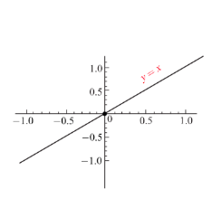
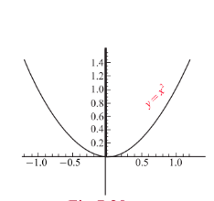
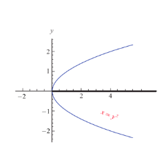
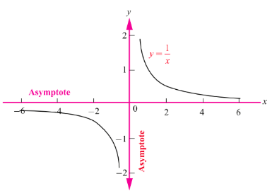
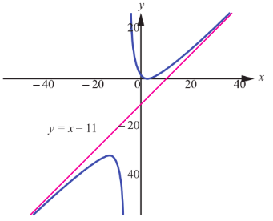
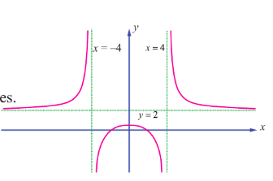

## 7.9 Symmetry and Asymptotes

### 7.9.1 Symmetry

Consider the following curves and observe that each of them is having some special properties, called symmetry with respect to a point, with respect to a line.

 |  | 

We now formally define the symmetry as follows:

If an image or a curve is a mirror reflection of another image with respect to a line, we say the image or the curve is symmetric with respect to that line. The line is called the line of symmetry.

A curve is said to have a $\theta$ angle rotational symmetry with respect to a point if the curve is unchanged by a rotation of an angle $\theta$ with respect to that point.

A curve may be symmetric with respect to many lines. Specifically, we consider the symmetry with respect to the coordinate axes and symmetric with respect to the origin. Mathematically, a curve $f(x, y) = 0$ is said to be

- **Symmetric with respect to the $y$-axis** if $f(x, y) = f(-x, y) \ \forall x, y$ or if $(x, y)$ is a point on the graph of the curve then so is $(-x, y)$. If we keep a mirror on the $y$-axis the portion of the curve on one side of the mirror is the same as the portion of the curve on the other side of the mirror.

- **Symmetric with respect to the $x$-axis** if $f(x, y) = f(x, -y) \ \forall x, y$ or if $(x, y)$ is a point on the graph of the curve then so is $(x, -y)$. If we keep a mirror on the $x$-axis the portion of the curve on one side of the mirror is the same as the portion of the curve on the other side of the mirror.

- **Symmetric with respect to the origin** if $f(x, y) = f(-x, -y) \ \forall x, y$ or if $(x, y)$ is a point on the graph of the curve then so is $(-x, -y)$. That is the curve is unchanged if we rotate it by $180^{\circ}$ about the origin.

For instance, the curves mentioned above $x = y^{2}$, $y = x^{2}$ and $y = x$ are symmetric with respect to $x$-axis, $y$-axis and origin respectively.

### 7.9.2 Asymptotes

An asymptote for the curve $y = f(x)$ is a straight line which is a tangent at $\infty$ to the curve. In other words the distance between the curve and the straight line tends to zero when the points on the curve approach infinity. There are three types of asymptotes. They are

1. **Horizontal asymptote**, which is parallel to the $x$-axis. The line $y = L$ is said to be a horizontal asymptote for the curve $y = f(x)$ if either $\lim_{x \to \infty} f(x) = L$ or $\lim_{x \to -\infty} f(x) = L$.

2. **Vertical asymptote**, which is parallel to the $y$-axis. The line $x = a$ is said to be vertical asymptote for the curve $y = f(x)$ if $\lim_{x \to a^{+}} f(x) = \pm \infty$ or $\lim_{x \to a^{-}} f(x) = \pm \infty$.

3. **Slant asymptote**: A slant (oblique) asymptote occurs when the polynomial in the numerator is a higher degree than the polynomial in the denominator.

To find the slant asymptote you must divide the numerator by the denominator using either long division or synthetic division.

**Example 7.66**

Find the asymptotes of the function $f(x) = \frac{1}{x}$.

**Solution**

We have, $\lim_{x \to 0^{-}} \frac{1}{x} = -\infty$ and $\lim_{x \to 0^{+}} \frac{1}{x} = \infty$. Hence, the required vertical asymptote is $x = 0$ or the $y$-axis.

As the curve is symmetric with respect to both the axes, $y = 0$ or the $x$-axis is also an asymptote. Hence this (rectangular hyperbola) curve has both the vertical and horizontal asymptotes.

**Example 7.67**

Find the slant (oblique) asymptote for the function $f(x) = \frac{x^{2} - 6x + 7}{x + 5}$.

**Solution**

Since the polynomial in the numerator is a higher degree $(2^{\text{nd}})$ than the denominator $(1^{\text{st}})$, we know we have a slant asymptote. To find it, we must divide the numerator by the denominator. We can use long division to do that:

$$
\begin{array}{r|l}
x + 5 & x^{2} - 6x + 7 \\
\hline
& x - 11 \\
x^{2} + 5x & \\
\hline
-11x + 7 & \\
-11x - 55 & \\
\hline
62 &
\end{array}
$$

Notice that we don't need to finish the long division problem to find the remainder. We only need the terms that will make up the equation of the line. The slant asymptote is $y = x - 11$.

As you can see in this graph of the function, the curve approaches the slant asymptote $y = x - 11$ but never crosses it.

**Example 7.68**

Find the asymptotes of the curve $f(x) = \frac{2x^{2} - 8}{x^{2} - 16}$.

**Solution**

As $\lim_{x \to -4^{+}} \frac{2x^{2} - 8}{x^{2} - 16} = -\infty$ and $\lim_{x \to 4^{+}} \frac{2x^{2} - 8}{x^{2} - 16} = \infty$.

Therefore $x = -4$ and $x = 4$ are vertical asymptotes.

As $\lim_{x \to \infty} \frac{2x^{2} - 8}{x^{2} - 16} = \lim_{x \to \infty} \frac{2 - \frac{8}{x^{2}}}{1 - \frac{16}{x^{2}}} = 2$ and $\lim_{x \to -\infty} \frac{2x^{2} - 8}{x^{2} - 16} = 2$

Therefore, $y = 2$ is a horizontal asymptote. This can also be obtained by synthetic division.

