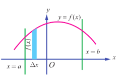
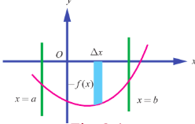

### 9.2 Definite Integral as the Limit of a Sum

#### 9.2.1 Riemann Integral

Consider a real-valued, bounded function $f(x)$ defined on the closed and bounded interval $[a, b]$ , $a < b$ . The function $f(x)$ need not have the same sign on $[a, b]$ ; that is, $f(x)$ may have positive as well as negative values on $[a, b]$ . See Fig 9.2. Partition the interval $[a, b]$ into $n$ subintervals $[x_0, x_1]$ , $[x_1, x_2]$ , $\dots$ , $[x_{n-2}, x_{n-1}]$ , $[x_{n-1}, x_n]$ such that
 
$a = x_0 < x_1 < x_2 < \dots < x_{n-1} < x_n = b$ .

In each subinterval $[x_{i-1}, x_i]$ , $i = 1, 2, \dots, n$ , choose a real number $\xi_i$ arbitrarily such that

$x_{i-1} \leq \xi_i \leq x_i$ .

Consider the sum

$\sum_{i=1}^n f(\xi_i)(x_i - x_{i-1}) = f(\xi_1)(x_1 - x_0) + f(\xi_2)(x_2 - x_1) + \dots + f(\xi_n)(x_n - x_{n-1})$ $\dots$ (1)

The sum in (1) is called a **Riemann sum** of $f(x)$ corresponding to the partition $[x_0, x_1]$ , $[x_1, x_2]$ , $\dots$ , $[x_{n-1}, x_n]$ of $[a, b]$ . Since there are infinitely many values $\xi_i$ satisfying the condition

$x_{i-1} \leq \xi_i \leq x_i$ ,

there are infinitely many Riemann sums of $f(x)$ corresponding to the same partition $[x_0, x_1]$ , $[x_1, x_2]$ , $\dots$ , $[x_{n-1}, x_n]$ of $[a, b]$ . If, under the limiting process $n \to \infty$ and

$\max \left( x_i - x_{i-1} \right) \to 0$ ,

the sum in (1) tends to a finite value, say $A$ , then the value $A$ is called the **definite integral** of $f(x)$ with respect to $x$ on $[a, b]$ . It is also called the **Riemann integral** of $f(x)$ on $[a, b]$ and is denoted by

$\int_a^b f(x) \, dx$

and is read as the integral of $f(x)$ with respect to $x$ from $a$ to $b$ . If $a = b$ , then we have

$\int_a^a f(x) \, dx = 0$ .

> **Note**
>
> In the present chapter, we consider bounded functions $f(x)$ that are continuous on $[a,b]$. However, the Riemann integral of $f(x)$ on $[a,b]$ also exists for bounded functions $f(x)$ that are piece-wise continuous on $[a,b]$. We have used the same symbol $\int$ both for definite integral and antiderivative (indefinite integral). The reason will be clear after we state the Fundamental Theorems of Integral Calculus. The variable $x$ is dummy in the sense that it is selected at our choice only. So we can write $\int_{a}^{b}f(x)dx$ as $\int_{a}^{b}f(u)du$. So, we have $\int_{a}^{b}f(x)dx = \int_{a}^{b}f(u)du$. As $\max \left(x_{i} - x_{i - 1}\right)\to 0$, all the three points $x_{i-1},\xi_{i}$, and $x_{i}$ of each subinterval $[x_{i-1},x_{i}]$ are dragged into a single point. We have already indicated that there are infinitely many ways of choosing the evaluation point $\xi_{i}$ in the subinterval $[x_{i-1},x_{i}]$, $i = 1,2,\dots ,n$. By choosing $\xi_{i} = x_{i-1}$, $i = 1,2,\dots ,n$, we have

$$
\int_{a}^{b}f(x)dx = \lim_{n\to \infty}\sum_{i = 1}^{n}f(x_{i-1})(x_{i} - x_{i-1}). \quad (2)
$$

Equation (2) is known as the left-end rule for evaluating the Riemann integral.

By choosing $\xi_{i} = x_{i}$, $i = 1,2,\dots ,n$, we have

$$
\int_{a}^{b}f(x)dx = \lim_{n\to \infty}\sum_{i = 1}^{n}f(x_{i})(x_{i} - x_{i-1}). \quad (3)
$$

Equation (3) is known as the right-end rule for evaluating the Riemann integral.

By choosing $\xi_{i} = \frac{x_{i-1} + x_{i}}{2}$, $i = 1,2,\dots ,n$, we have

$$
\int_{a}^{b}f(x)dx = \lim_{n\to \infty}\sum_{i = 1}^{n}f\left(\frac{x_{i-1} + x_{i}}{2}\right)(x_{i} - x_{i-1}). \quad (4)
$$

Equation (4) is known as the mid-point rule for evaluating the Riemann integral.

> **Remarks**
>
> (1) If the Riemann integral $\int_{a}^{b}f(x)dx$ exists, then the Riemann integral $\int_{a}^{b}f(u)du$ is a well-defined real number for every $x\in [a,b]$. So, we can define a function $F(x)$ on $[a,b]$ such that $F(x) = \int_{a}^{x}f(u)du, x\in [a,b]$.
>
> (2) If $f(x)\geq 0$ for all $x\in [a,b]$, then the Riemann integral $\int_{a}^{b}f(x)dx$ is equal to the geometric area of the region bounded by the graph of $y = f(x)$, the $x$-axis, the lines $x = a$ and $x = b$. See Fig.9.3.
>
> 
>
> (3) If $f(x) \leq 0$ for all $x \in [a, b]$, then the Riemann integral $\int_{a}^{b} f(x) dx$ is equal to the negative of the geometric area of the region bounded by the graph of $y = f(x)$, the $x$-axis, the lines $x = a$ and $x = b$. See Fig. 9.4. In this case, the geometric area of the region bounded by the graph of $y = f(x)$, the $x$-axis, the lines $x = a$ and $x = b$ is given by $\int_{a}^{b} f(x) dx$.
>
> 
>
> (4) If $f(x)$ takes positive as well as negative values on $[a,b]$, then the interval $[a,b]$ can be divided into subintervals $[a,c_{1}]$, $[c_{1},c_{2}]$,..., $[c_{k},b]$ such that $f(x)$ has the same sign throughout each of subintervals. So, the Riemann integral $\int_{a}^{b} f(x) dx$ is given by
>
> $ \int_{a}^{b} f(x) dx = \int_{a}^{c_{1}} f(x) dx + \int_{c_{1}}^{c_{2}} f(x) dx + \dots + \int_{c_{k}}^{b} f(x) dx. $
>
> In this case, the geometric area of the region bounded by the graph of $y = f(x)$, the $x$- axis, the lines $x = a$ and $x = b$ is given by
> $ \left|\int_{a}^{c_{1}} f(x) dx\right| + \left|\int_{c_{1}}^{c_{2}} f(x) dx\right| + \dots + \left|\int_{c_{k}}^{b} f(x) dx\right|. $

For instance, consider the following graph of a function $f(x), x \in [a, b]$. See Fig. 9.5. Here, $A_{1}, A_{2}$ and, $A_{3}$ denote geometric areas of the individual parts.

Then, the definite integral $\int_{a}^{b} f(x) dx$ is given by

$$
\int_{a}^{b} f(x) dx = \int_{a}^{c_{1}} f(x) dx + \int_{c_{1}}^{c_{2}} f(x) dx + \int_{c_{2}}^{b} f(x) dx = A_{1} - A_{2} + A_{3}.
$$

The geometric area of the region bounded by the graph of $y = f(x)$, the $x$- axis, the lines $x = a$ and $x = b$ is given by $A_{1} + A_{2} + A_{3}$. In view of the above discussion, it is clear that a Riemann integral need not represent geometrical area.

> **Note**
>
> Even if we do not mention explicitly, it is always understood that the areas are measured in square units and volumes are measured in cubic units.

**Example 9.1**

Estimate the value of $\int_{0}^{0.5} x^{2} dx$ using the Riemann sums corresponding to 5 subintervals of equal width and applying (i) left-end rule (ii) right-end rule (iii) the mid-point rule.

**Solution**

Here $a = 0,b = 0.5,n = 5,f(x) = x^{2}$

So, the width of each subinterval is

$$
h = \Delta x = \frac{b - a}{n} = \frac{0.5 - 0}{5} = 0.1.
$$

The partition of the interval is given by the points

$$
x_{0} = 0,
$$
$$
x_{1} = x_{0} + h = 0 + 0.1 = 0.1
$$
$$
x_{2} = x_{1} + h = 0.1 + 0.1 = 0.2
$$
$$
x_{3} = x_{2} + h = 0.2 + 0.1 = 0.3
$$
$$
x_{4} = x_{3} + h = 0.3 + 0.1 = 0.4
$$
$$
x_{5} = x_{4} + h = 0.4 + 0.1 = 0.5
$$

(i) The left-end rule for Riemann sum with equal width $\Delta x$ is

$$
S = \left[f\left(x_{0}\right) + f\left(x_{1}\right) + \dots +f\left(x_{n - 1}\right)\right]\Delta x.
$$
$$
\therefore S = \left[f\left(0\right) + f\left(0.1\right) + f\left(0.2\right) + f\left(0.3\right) + f\left(0.4\right)\right]\left(0.1\right)
$$
$$
= \left[0.00 + 0.01 + 0.04 + 0.09 + 0.16\right]\left(0.1\right) = 0.03
$$
$$
\therefore \int_{0}^{0.5}x^{2}dx \text{ is approximately } 0.03.
$$

(ii) The right-end rule for Riemann sum with equal width $\Delta x$ is

$$
S = \left[f\left(x_{1}\right) + f\left(x_{2}\right) + \dots +f\left(x_{n}\right)\right]\Delta x.
$$
$$
\therefore S = \left[f\left(0.1\right) + f\left(0.2\right) + f\left(0.3\right) + f\left(0.4\right) + f\left(0.5\right)\right]\left(0.1\right)
$$
$$
= \left[0.01 + 0.04 + 0.09 + 0.16 + 0.25\right]\left(0.1\right) = 0.055.
$$

$\therefore \int_{0}^{0.5}x^{2}dx$ is approximately $0.055$.

(iii) The mid-point rule for Riemann sum with equal width $\Delta x$ is

$$
S = \left[f\left(\frac{x_{0} + x_{1}}{2}\right) + f\left(\frac{x_{1} + x_{2}}{2}\right) + \dots +f\left(\frac{x_{n - 1} + x_{n}}{2}\right)\right]\Delta x
$$
$$
\therefore S = \left[f\left(0.05\right) + f\left(0.15\right) + f\left(0.25\right) + f\left(0.35\right) + f\left(0.45\right)\right]\left(0.1\right)
$$
$$
= \left[0.0025 + 0.0225 + 0.0625 + 0.1225 + 0.2025\right]\left(0.1\right)
$$
$$
= 0.04125.
$$
$$
\therefore \int_{0}^{0.5}x^{2}dx \text{ is approximately } 0.04125.
$$

**EXERCISE 9.1**

1. Find an approximate value of $\int_{1}^{1.5} x dx$ by applying the left-end rule with the partition  
   $\{1.1, 1.2, 1.3, 1.4, 1.5\}$ .

2. Find an approximate value of $\int_{1}^{1.5} x^2 dx$ by applying the right-end rule with the partition  
   $\{1.1, 1.2, 1.3, 1.4, 1.5\}$ .

3. Find an approximate value of $\int_{1}^{1.5} (2 - x) dx$ by applying the mid-point rule with the partition  
   $\{1.1, 1.2, 1.3, 1.4, 1.5\}$ .

### 9.2.2 Limit Formula to Evaluate $\int_a^b f(x) dx$

Divide the interval $[a, b]$ into $n$ equal subintervals $[x_0, x_1]$ , $[x_1, x_2]$ , $\dots$ , $[x_{n-2}, x_{n-1}]$ , $[x_{n-1}, x_n]$ such that $a = x_0 < x_1 < x_2 < \dots < x_{n-1} < x_n = b$ . Then, we have $x_1 - x_0 = x_2 - x_1 = \dots = x_{n-1} - x_{n-2} = \frac{b-a}{n}$ . Put $h = \frac{b-a}{n}$ . Then, we get $x_i = a + ih$ , $i = 1, 2, \dots, n$ .

So, by the definition of definite integral, we get

$\lim_{n \to \infty \text{ and } \max(x_i - x_{i-1}) \to 0} \sum_{j=1}^n f(x_i)(x_i - x_{i-1})$ (Right-end rule)

$= \lim_{n \to \infty} \frac{b-a}{n} \sum_{i=1}^n f\left(a + i \frac{b-a}{n}\right)$ .

$\therefore \int_a^b f(x) dx = \lim_{n \to \infty} \frac{b-a}{n} \sum_{i=1}^n f\left(a + (b-a) \frac{i}{n}\right)$ .

> **Note**
>
> $\lim_{n \to \infty} \frac{b-a}{n} \sum_{i=1}^n f\left(a + (b-a) \frac{i}{n}\right) = \lim_{n \to \infty} \left[ \frac{b-a}{n} f(a) + \frac{b-a}{n} \sum_{i=1}^n f\left(a + (b-a) \frac{i}{n}\right) \right]$ .

$= \lim_{n \to \infty} \frac{b-a}{n} \sum_{r=1}^{n} f\left(a + (b-a) \frac{r}{n}\right)$

$= \int_{a}^{b} f(x) dx$ .

$\therefore \int_{a}^{b} f(x) dx = \lim_{n \to \infty} \frac{b-a}{n} \sum_{r=1}^{n} f\left(a + (b-a) \frac{r}{n}\right)$

$= \lim_{n \to \infty} \frac{b-a}{n} \sum_{r=0}^{n} f\left(a + (b-a) \frac{r}{n}\right)$ .

If $a = 0$ and $b = 1$ , then we get

$\int_{0}^{1} f(x) dx = \lim_{n \to \infty} \frac{1}{n} \sum_{r=0}^{n} f\left(\frac{r}{n}\right) = \lim_{n \to \infty} \frac{1}{n} \sum_{r=1}^{n} f\left(\frac{r}{n}\right)$ .

**Example 9.2**

Evaluate $\int_{0}^{1}x dx$, as the limit of a sum.

**Solution**

Here $f(x) = x$, $a = 0$ and $b = 1$. Hence, we get

$$
\int_{a}^{b}f(x)dx = \lim_{n\to \infty}\frac{1}{n}\sum_{r = 1}^{n}f\left(\frac{r}{n}\right)\Rightarrow \int_{0}^{1}x dx = \lim_{n\to \infty}\frac{1}{n}\sum_{r = 1}^{n}\frac{r}{n}
$$
$$
= \lim_{n\to \infty}\frac{1}{n^{2}}\big[1 + 2 + \dots +n\big]
$$
$$
= \lim_{n\to \infty}\frac{1}{n^{2}}\frac{n(n + 1)}{2} = \lim_{n\to \infty}\frac{1}{2}\bigg(1 + \frac{1}{n}\bigg) = \frac{1}{2}.
$$

**Example 9.3**

Evaluate $\int_{0}^{1}x^{3}dx$, as the limit of a sum.

**Solution**

Here $f(x) = x^{3}$, $a = 0$ and $b = 1$. Hence, we get

$$
\int_{a}^{b}f(x)dx = \lim_{n\to \infty}\frac{1}{n}\sum_{r = 1}^{n}f\left(\frac{r}{n}\right)\Rightarrow \int_{0}^{1}x^{3}dx = \lim_{n\to \infty}\frac{1}{n}\sum_{r = 1}^{n}\frac{r^{3}}{n^{3}}
$$
$$
= \lim_{n\to \infty}\frac{1}{n^{4}}\big[1^{3} + 2^{3} + \dots +n^{3}\big] = \lim_{n\to \infty}\frac{1}{n^{4}}\frac{n^{2}(n + 1)^{2}}{4}
$$
$$
= \lim_{n\to \infty}\frac{1}{4}\bigg(1 + \frac{1}{n}\bigg)^{2} = \frac{1}{4}.
$$

**Example 9.4**

Evaluate $\int_{1}^{4}(2x^{2} + 3)dx$, as the limit of a sum.

**Solution**

We use the formula

$$
\int_{a}^{b}f(x)dx = \lim_{n\to \infty}\frac{b - a}{n}\sum_{r = 1}^{n}f\left(a + (b - a)\frac{r}{n}\right)
$$

Here $f(x) = 2x^{2} + 3$, $a = 1$ and $b = 4$.

So, we get

$$
f\left(a + (b - a)\frac{r}{n}\right) = f\left(1 + (4 - 1)\frac{r}{n}\right) = f\left(1 + \frac{3r}{n}\right) = 2\left(1 + \frac{3r}{n}\right)^{2} + 3 = 5 + \frac{18r^{2}}{n^{2}} +\frac{12r}{n}.
$$

Hence, we get

$$
\int_{1}^{4}(2x^{2} + 3)dx = \lim_{n\to \infty}\frac{3}{n}\sum_{r = 1}^{n}\left(5 + \frac{18r^{2}}{n^{2}} +\frac{12r}{n}\right) = \lim_{n\to \infty}\left[\frac{15}{n}\sum_{r = 1}^{n}1 + \frac{54}{n^{3}}\sum_{r = 1}^{n}r^{2} + \frac{36}{n^{2}}\sum_{r = 1}^{n}r\right]
$$
$$
= \lim_{n\to \infty}\left[\frac{15}{n} n + \frac{54}{n^{3}}\left(1^{2} + 2^{2} + \dots +n^{2}\right) + \frac{36}{n^{2}}\left(1 + 2 + \dots +n\right)\right]
$$

$= \lim_{n \to \infty} \left[ 15 + \frac{54}{n^3} \frac{n(n+1)(2n+1)}{6} + \frac{36}{n^2} \frac{n(n+1)}{2} \right]$

$= \lim_{n \to \infty} \left[ 15 + 9 \left( 1 + \frac{1}{n} \right) \left( 2 + \frac{1}{n} \right) + 18 \left( 1 + \frac{1}{n} \right) \right]$

$= 15 + 9 \left( 1 + 0 \right) \left( 2 + 0 \right) + 18 \left( 1 + 0 \right) = 51$ .

**Exercise 9.2**

1. Evaluate the following integrals as the limits of sums:

(i) $\int_{0}^{1}(5x + 4)dx$

(ii) $\int_{0}^{2}(4x^{2} - 1)dx$
