### 9.8 Evaluation of a Bounded Plane Area by Integration

In the beginning of this chapter, we have already introduced definite integral by a geometrical approach. In that approach, we have noted that, whenever the integrand of the definite integral is non-negative, the definite integral yields the geometrical area. In the present section, we apply the approach for finding areas of plane regions bounded by plane curves.

#### 9.8.1 Area of the region bounded by a curve, $x$-axis and the lines $x = a$ and $x = b$.

**Case (i)**

Let $y = f(x)$, $a \leq x \leq b$ be the equation of the portion of the continuous curve that lies above the $x$-axis (that is, the portion lies either in the first quadrant or in the second quadrant) between the lines $x = a$ and $x = b$. See Fig.9.8. Then, $y \geq 0$ for every point of the portion of the curve. Consider the region bounded by the curve, $x$-axis, the ordinates $x = a$ and $x = b$. It is important to note that $x$ does not change its sign in the region. Then, the area of the region is found as follows:

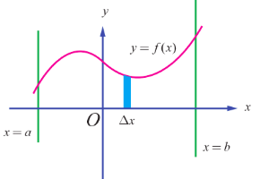

Viewing in the positive direction of the $y$-axis, divide the region into elementary vertical strips (thin rectangles) of height $y$ and width $\Delta x$. Then, $A$ is the limit sum of the areas of the vertical strips. Hence, we get $A = \lim \sum_{a\leq x\leq b} y\Delta x = \int_{a}^{b}y dx$.

**Case (ii)**

Let $y = f(x)$, $a\leq x\leq b$ be the equation of the portion of the continuous curve that lies below the $x$-axis (that is, the portion lies either in the third quadrant or in the fourth quadrant). Then, $y\leq 0$ for every point of the portion of the curve. It is important to note that $y$ does not change its sign in the region. Consider the region bounded by the curve, $x$-axis, the ordinates $x = a$ and $x = b$. See Fig.9.9. Then, the area $A$ of the region is found as follows:

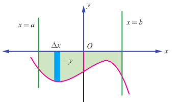

Viewing in the negative direction of the $y$-axis, divide the region into elementary vertical strips (thin rectangles) of height $|y| = -y$ and width $\Delta x$. Then, $A$ is the limit of the sum of the areas of the vertical strips. Hence, we get $A = \lim \sum_{a\leq x\leq b} (-y)\Delta x = -\int_{a}^{b}y dx = \left|\int_{a}^{b}y dx\right|$.

**Case (iii)**

Let $y = f(x)$, $a\leq x\leq b$ be the equation of the portion of the continuous curve that lies above as well as below the $x$-axis (that is, the portion may lie in all quadrants). Draw the graph of $y = f(x)$ in the $XY$-plane. The graph lies alternately above and below the $x$-axis and it is intercepted between the ordinates $x = a$ and $x = b$. Divide the interval $[a,b]$ into subintervals $[a,c_{1}]$, $[c_{1},c_{2}]$, $\dots$, $[c_{k},b]$ such that $f(x)$ has the same sign on each of subintervals. Applying cases (i) and (ii), we can obtain individually, the geometrical areas of the regions corresponding to the subintervals.

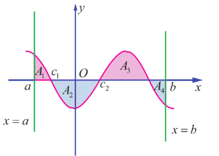

Hence the geometrical area of the region bounded by the graph of $y = f(x)$, the $x$-axis, the lines $x = a$ and $x = b$ is given by

$$
\left|\int_{a}^{c_{1}}f(x)dx\right| + \left|\int_{c_{1}}^{c_{2}}f(x)dx\right| + \dots + \left|\int_{c_{k}}^{b}f(x)dx\right|.
$$

For instance, consider the shaded region in Fig. 9.10. Here $A_{1},A_{2},A_{3}$, and $A_{4}$ denote geometric areas of the individual parts. Then, the total area is given by

$$
A = A_{1} + A_{2} + A_{3} + A_{4} = \int_{a}^{c_{1}}f(x)dx + \left|\int_{c_{1}}^{c_{2}}f(x)dx\right| + \int_{c_{2}}^{c_{3}}f(x)dx + \left|\int_{c_{3}}^{b}f(x)dx\right|.
$$

#### 9.8.2 Area of the region bounded by a curve, $y$-axis and the lines $y = c$ and $y = d$

**Case (iv)**

Let $x = f(y)$, $c\leq y\leq d$ be the equation of the portion of the continuous curve that lies to the right side of $y$-axis (that is, the portion lies either in the first quadrant or in the fourth quadrant). Then, $x\geq 0$ for every point of the portion of the curve. It is important to note that $x$ does not change its sign in the region.

Consider the region bounded by the curve, $y$-axis, the lines $y = c$ and $y = d$. The region is sketched as in Fig. 9.11. Then, the area $A$ of the region is found as follows:

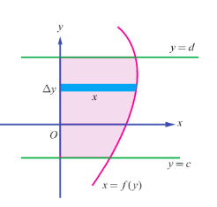

Viewing in the positive direction of the $x$-axis, divide the region into thin horizontal strips (thin rectangles) of length $x$ and width $\Delta y$. Then, $A$ is the limit of the sum of the areas of the horizontal strips. Hence, we get $A = \lim \sum_{c\leq y\leq d} x\Delta y = \int_{c}^{d}x dy$.

**Case (v)**

Let $x = f(y)$, $c\leq y\leq d$ be the equation of the portion of the continuous curve that lies to the left side of $y$-axis (that is, the portion lies either in the second quadrant or in the third quadrant). Then, $x\leq 0$ for every point of the portion of the curve. It is important to note that $x$ does not change its sign in the region. Consider the region bounded by the curve, $y$-axis, the lines $y = c$ and $y = d$. The region is sketched as in Fig. 9.12. Then, the area $A$ of the region is found as follows:

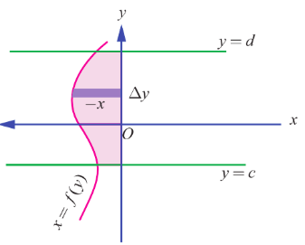

Viewing in the negative direction of the $x$-axis, divide the region into thin horizontal strips (thin rectangles) of length $|x| = -x$ and width $\Delta y$. Then, $A$ is the limit of the sum of the areas of the horizontal strips.

Hence, we get $A = \lim \sum_{c\leq y\leq d} (-x)\Delta y = -\int_{c}^{d}x dy = \left|\int_{c}^{d}x dy\right|$.

**Case (vi)**

Let $x = f(y)$, $c\leq y\leq d$ be the equation of the portion of the continuous curve that lies to the right as well as to the left of the $y$-axis (that is, the portion may lie in all quadrants). Draw the graph of $x = f(y)$ in the $XY$-plane. The graph lies alternately to the right and to the left of the $y$-axis and it is intercepted between the lines $y = c$ and $y = d$. Divide the interval $[c,d]$ into subintervals $[c,a_{1}],[a_{1},a_{2}],\dots,[a_{k},d]$ such that $f(y)$ has the same sign on each of subintervals. Applying cases (iv) and (v), we can obtain individually, the geometrical areas of the regions corresponding to the subintervals.

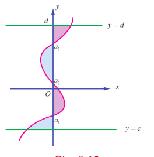

Hence the geometrical area $A$ of the region bounded by the graph of $x = f(y)$, the $y$-axis, the lines $y = c$ and $y = d$ is given by

$$
A = \left|\int_{c}^{a_{1}}f(y)dy\right| + \left|\int_{a_{1}}^{a_{2}}f(y)dy\right| + \dots + \left|\int_{a_{k}}^{d}f(y)dy\right|.
$$

For instance, consider the shaded region in Fig. 9.13. Here, $B_{1}, B_{2}, B_{3}$ and $B_{4}$ denote geometric areas of the individual parts. Then, the total area $B$ of the region bounded by the curve $x = f(y)$, $y$-axis and the lines $y = c$ and $y = d$ is given by

$$
B = B_{1} + B_{2} + B_{3} + B_{4} = \left|\int_{c}^{a_{1}}f(y)dy\right| + \int_{a_{1}}^{a_{2}}f(y)dy + \int_{a_{2}}^{a_{3}}f(y)dy + \int_{a_{3}}^{d}f(y)dy.
$$

**Example 9.47**

Find the area of the region bounded by the line $6x + 5y = 30$, $x$-axis and the lines $x = -1$ and $x = 3$.

**Solution**

The region is sketched in Fig. 9.14. It lies above the $x$-axis. Hence, the required area is given by

$$
A = \int_{-1}^{3} y dx = \int_{-1}^{3} \left(\frac{30 - 6x}{5}\right) dx = \left[\frac{30x - 3x^{2}}{5}\right]_{-1}^{3}
$$
$$
= \left(\frac{90 - 27}{5}\right) - \left(\frac{-30 - 3}{5}\right) = \frac{96}{5}.
$$

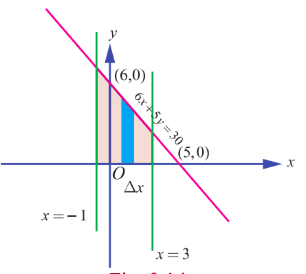

**Example 9.48**

Find the area of the region bounded by the line $7x - 5y = 35$, $x$-axis and the lines $x = -2$ and $x = 3$.

**Solution**

The region is sketched in Fig. 9.15. It lies below the $x$-axis. Hence, the required area is given by

$$
A = \left|\int_{-2}^{3} y dx\right| = \left|\int_{-2}^{3} \left(\frac{7x - 35}{5}\right) dx\right|
$$
$$
= \frac{1}{5} \left|\left[\frac{7x^{2}}{2} - 35x\right]_{-2}^{3}\right|
$$
$$
= \frac{1}{5} \left|\left(\frac{63}{2} - 105\right) - \left(14 + 70\right)\right| = \frac{1}{5} \left|-\frac{147}{2} - 84\right| = \frac{1}{5} \left|-\frac{315}{2}\right| = \frac{63}{2}.
$$

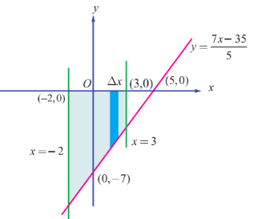

**Example 9.49**

Find the area of the region bounded by the ellipse $\frac{x^{2}}{a^{2}} + \frac{y^{2}}{b^{2}} = 1$.

**Solution**

The ellipse is symmetric about both major and minor axes. It is sketched as in Fig.9.16. So, viewing in the positive direction of $y$-axis, the required area $A$ is four times the area of the region bounded by the portion of the ellipse in the first quadrant $\left(y = \frac{b}{a}\sqrt{a^{2} - x^{2}}, 0 < x < a\right)$, $x$-axis, $x = 0$ and $x = a$.

Hence, by taking vertical strips, we get

$$
A = 4\int_{0}^{a} y dx = 4\int_{0}^{a} \frac{b}{a}\sqrt{a^{2} - x^{2}} dx
$$
$$
= \frac{4b}{a} \left[\frac{x\sqrt{a^{2} - x^{2}}}{2} + \frac{a^{2}}{2}\sin^{-1}\left(\frac{x}{a}\right)\right]_{0}^{a} = \frac{4b}{a} \times \frac{\pi a^{2}}{4} = \pi ab
$$

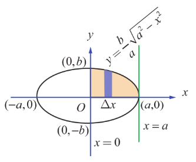

> **Note**
>
> Viewing in the positive direction of $x$-axis, the required area $A$ is four times the area of the region bounded by the portion of the ellipse in the first quadrant $\left(x = \frac{a}{b}\sqrt{b^{2} - y^{2}}, 0 < y < b\right)$, $y$-axis, $y = 0$ and $y = b$. Hence, by taking horizontal strips (see Fig.9.17), we get
>
>  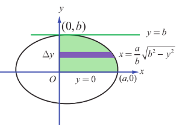
> $ A = 4\int_{0}^{b} x dy = 4\int_{0}^{b} \frac{a}{b}\sqrt{b^{2} - y^{2}} dy $
> $ = \frac{4a}{b} \left[\frac{y\sqrt{b^{2} - y^{2}}}{2} + \frac{b^{2}}{2}\sin^{-1}\left(\frac{y}{b}\right)\right]_{0}^{b} = \frac{4a}{b} \times \frac{\pi b^{2}}{4} = \pi ab. $
>

> **Note**
>
> Putting $b = a$ in the above result, we get that the area of the region enclosed by the circle $x^{2} + y^{2} = a^{2}$ is $\pi a^{2}$.

**Example 9.50**

Find the area of the region bounded between the parabola $y^{2} = 4ax$ and its latus rectum.

**Solution**

The equation of the latus-rectum is $x = a$. It intersects the parabola at the points $L(a,2a)$ and $L_{1}(a,-2a)$. The required area is sketched in Fig. 9.18. By symmetry, the required area $A$ is twice the area bounded by the portion of the parabola $y = 2\sqrt{a}\sqrt{x}$, $x$-axis, $x = 0$ and $x = a$.

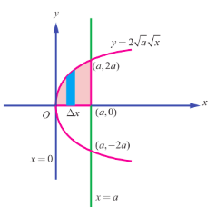

Hence, by taking vertical strips, we get

$$
A = 2\int_{0}^{a} y dx = 2\int_{0}^{a} 2\sqrt{a}\sqrt{x} dx = 4\sqrt{a} \left[\frac{2}{3} x^{\frac{3}{2}}\right]_{0}^{a}
$$
$$
= 4\sqrt{a} \times \frac{2}{3} a^{\frac{3}{2}} = \frac{8a^{2}}{3}.
$$

> **Note**
>
> Viewing in the positive direction of $x$-axis, and making horizontal strips (see Fig. 9.19), we get
>
>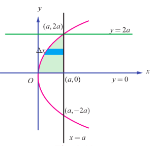
> $ A = 2\int_{0}^{2a} (a - x) dy = 2\int_{0}^{2a} \left(a - \frac{y^{2}}{4a}\right) dy $
> $ = 2\left[ay - \frac{y^{3}}{12a}\right]_{0}^{2a} = 2\left(2a^{2} - \frac{8a^{3}}{12a}\right) = \frac{8a^{2}}{3}. $
>

> **Note**
>
> It is quite interesting to note that the above area is equal to two-thirds the base (latus-rectum) times the height (the distance between the focus and the vertex). This verifies Archimedes' formula for areas of parabolic arches which states that the area under a parabolic arch is two-thirds the area of the rectangle having base of the arch as length and height of the arch as the breadth. It is also equal to four-thirds the area of the triangle with base (latus-rectum) and height (the distance between the focus and the vertex).

**Example 9.51**

Find the area of the region bounded by the $y$-axis and the parabola $x = 5 - 4y - y^{2}$.

**Solution**

The equation of the parabola is $(y + 2)^{2} = -(x - 9)$. The parabola crosses the $y$-axis at $(0,-5)$ and $(0,1)$. The vertex is at $(9,-2)$ and the axis of the parabola is $y = -2$. The required area is sketched as in Fig. 9.20.

Viewing in the positive direction of $x$-axis, and making horizontal strips, the required area $A$ is given by

$$
A = \int_{-5}^{1} x dy = \int_{-5}^{1} (5 - 4y - y^{2}) dy = \left[5y - 2y^{2} - \frac{y^{3}}{3}\right]_{-5}^{1} = \frac{8}{3} - \left(-\frac{100}{3}\right) = 36.
$$

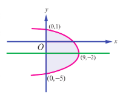

> **Note**
>
> As in the previous problem, we again verify Archimedes' formula that the area of the parabolic arch is equal to two-thirds the base times the height.

**Example 9.52**

Find the area of the region bounded by $x$-axis, the sine curve $y = \sin x$, the lines $x = 0$ and $x = 2\pi$.

**Solution**

The required area is sketched in Fig. 9.21. One portion of the region lies above the $x$-axis between $x = 0$ and $x = \pi$, and the other portion lies below the $x$-axis between $x = \pi$ and $x = 2\pi$. So, the required area is given by

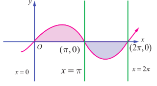

$$
A = \int_{0}^{\pi} \sin x dx + \left|\int_{\pi}^{2\pi} \sin x dx\right|
$$
$$
= \left[-\cos x\right]_{0}^{\pi} + \left|\left[-\cos x\right]_{\pi}^{2\pi}\right|
$$
$$
= (-\cos\pi + \cos 0) + |(-\cos 2\pi + \cos\pi)|
$$
$$
= (-(-1) + 1) + |(-1 + (-1))| = (1 + 1) + |-2| = 2 + 2 = 4.
$$

> **Note**
>
> If we compute the definite integral $\int_{0}^{2\pi} \sin x dx$ , we get
>
> $\int_{0}^{2\pi} \sin x dx = [-\cos x]_{0}^{2\pi} = [-\cos 2\pi] - [-\cos 0] = 0$ .
>
> So $\int_{0}^{2\pi} f(x) dx$ does not represent the area of the region bounded by the curve $y = \sin x$ , $x$ -axis, the lines $x = 0$ and $x = 2\pi$ .

**Example 9.53**

Find the area of the region bounded by $x$ –axis, the curve $y = |\cos x|$ , the lines $x = 0$ and $x = \pi$ .

**Solution**

The given curve is

$y = \begin{cases} \cos x , & 0 \leq x \leq \frac{\pi}{2} \\ -\cos x , & \frac{\pi}{2} \leq x \leq \pi \end{cases}$

It lies above the $x$ –axis. The required area is sketched in Fig. 9.22. So, the required area is given by

$A = \int_0^{\frac{\pi}{2}} y \, dx = \int_0^{\frac{\pi}{2}} \cos x \, dx + \int_{\frac{\pi}{2}}^{\pi} (-\cos x) \, dx = [\sin x]_{0}^{\frac{\pi}{2}} - [\sin x]_{\frac{\pi}{2}}^{\pi}$

$= [1 - 0] - [0 - 1] = 2$ .

### 9.8.3 Area of the region bounded between two curves

**Case (i)**

Let $y = f(x)$ and $y = g(x)$ be the equations of two curves in the $XOY$ -plane such that  
$f(x) \geq g(x)$ for all $x \in [a, b]$ . We want to find the area $A$ of the region bounded between the two curves, the ordinates $x = a$ and $x = b$ .

The required area is sketched in Fig. 9.23. To compute $A$ , we divide the region into thin vertical strips of width $\Delta x$ and height $f(x) - g(x)$ . It is important note that $f(x) - g(x) \geq 0$ for all $x \in [a, b]$ . As before, the required area is the limit of the sum of the areas of the vertical strips. Hence, we get

$A = \int_a^b [f(x) - g(x)] dx$ .

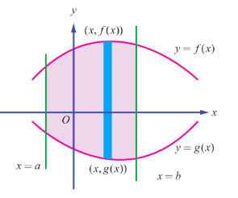

> **Note**
>
> Viewing in the positive direction of $y$ -axis, the curve $y = f(x)$ can be termed as the upper curve (U) and the curve $y = g(x)$ as the lower curve (L). Thus, we get
>
> $A = \int_a^b [y_U - y_L] dx$ .

**Case (ii)**

Let $x = f(y)$ and $x = g(y)$ be the equations of two curves in the $XOY$ -plane such that $f(y) \geq g(y)$ for all $y \in [c, d]$ . We want to find the area $A$ of the region bounded between the two curves, the lines $y = c$ and $y = d$ . The required area is sketched in Fig. 9.24. To compute $A$ , we view in the positive direction of the $x$ -axis and divide the region into thin horizontal strips of width $\Delta y$ and height $f(y) - g(y)$ . It is important note that $f(y) - g(y) \geq 0$ for all $y \in [c, d]$ . As before, the required area is the limit of the sum of the areas of the horizontal strips. Hence, we get

$A = \int_c^d [f(y) - g(y)] dy$ .

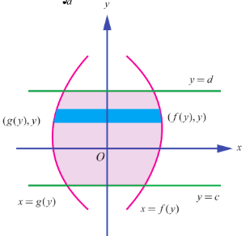

> **Note**
>
> Viewing in the positive direction of $x$ – axis, the curve $x = f(y)$ can be termed as the right curve (R) and the curve $x = g(y)$ as the left curve (L). Thus, we get $A = \int_c^d [x_R - x_L] dy$ .

**Example 9.54**

Find the area of the region bounded between the parabolas $y^2 = 4x$ and $x^2 = 4y$ .

**Solution**

First, we get the points of intersection of the parabolas. For this, we solve $y^2 = 4x$ and $x^2 = 4y$ simultaneously: Eliminating $y$ between them, we get $x^4 = 64x$ and so $x = 0$ and $x = 4$ . Then the points of intersection are $(0,0)$ and $(4,4)$ . The required region is sketched in Fig.9.25.

Viewing in the direction of $y$ – axis, the equation of the upper boundary is $y = 2\sqrt{x}$ for $0 \leq x \leq 4$ and the equation of the lower boundary is $y = \frac{x^2}{4}$ for $0 \leq x \leq 4$ . So, the required area $A$ is

$A = \int_0^4 (y_U - y_L) dx = \int_0^4 \left( 2\sqrt{x} - \frac{x^2}{4} \right) dx = \left[ 2\left( \frac{2x^{3/2}}{3} \right) - \frac{x^3}{12} \right]_0^4 = \left[ 2\left( \frac{2 \times 8}{3} \right) - \frac{64}{12} \right] - 0 = \frac{16}{3}$ .

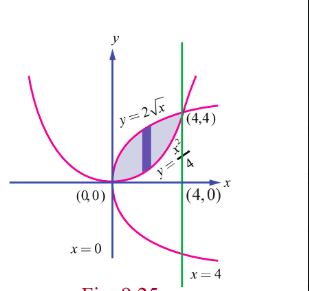

> **Note**
>
> Viewing in the positive direction of $x$ – axis, the right bounding curve is $x^2 = 4y$ and the left bounding curve is $y^2 = 4x$ . See Fig. 9.26. The equation of the right boundary is $x = 2\sqrt{y}$ for $0 \leq y \leq 4$ and the equation of the left boundary is $x = \frac{y^2}{4}$ for $0 \leq y \leq 4$ . So, the required area $A$ is
>
> $A = \int_0^4 (x_R - x_L) dy = \int_0^4 \left( 2\sqrt{y} - \frac{y^2}{4} \right) dy = \left[ 2\left( \frac{2y^{3/2}}{3} \right) - \frac{y^3}{12} \right]_0^4 = \left[ 2\left( \frac{2 \times 8}{3} \right) - \frac{64}{12} \right] - 0 = \frac{16}{3}$ .
>
> 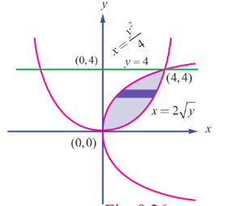

**Example 9.55**

Find the area of the region bounded between the parabola $x^2 = y$ and the curve $y = |x|$ .

**Solution**

Both the curves are symmetrical about $y$ -axis.

The curve $y = |x|$ is $y = \begin{cases} x & \text{if } x \geq 0 \\ -x & \text{if } x \leq 0 \end{cases}$ .

It intersects the parabola $x^2 = y$ at $(1,1)$ and $(-1,1)$ .

The area of the region bounded by the curves is sketched in Fig. 9.27. It lies in the first quadrant as well as in the second quadrant. By symmetry, the required area is twice the area in the first quadrant.

In the first quadrant, the upper curve is $y = x$ , $0 \leq x \leq 1$ and the lower curve is $y = x^2$ , $0 \leq x \leq 1$ . Hence, the required area is given by

$A = 2 \int_0^1 [y_U - y_L] dx = 2 \int_0^1 [x - x^2] dx$

$= 2 \left[ \frac{x^2}{2} - \frac{x^3}{3} \right]_0^1$

$= 2 \left( \frac{1}{2} - \frac{1}{3} \right) = \frac{1}{3}$ .

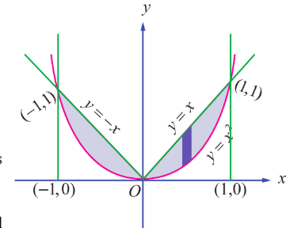

**Example 9.56**

Find the area of the region bounded by $y = \cos x$ , $y = \sin x$ , the lines $x = \frac{\pi}{4}$ and $x = \frac{5\pi}{4}$ .

**Solution**

The region is sketched in Fig. 9.28. The upper boundary of the region is $y = \sin x$ for $\frac{\pi}{4} \leq x \leq \frac{5\pi}{4}$ and the lower boundary of the region is $y = \cos x$ for $\frac{\pi}{4} \leq x \leq \frac{5\pi}{4}$ . So the required area $A$ is given by

$A = \int_{\frac{\pi}{4}}^{\frac{5\pi}{4}} (y_U - y_L) dx = \int_{\frac{\pi}{4}}^{\frac{5\pi}{4}} (\sin x - \cos x) dx = [-\cos x - \sin x]_{\frac{\pi}{4}}^{\frac{5\pi}{4}}$

$= \left[ -\cos \frac{5\pi}{4} - \sin \frac{5\pi}{4} \right] - \left[ -\cos \frac{\pi}{4} - \sin \frac{\pi}{4} \right]$

$= \left( -\left( -\frac{1}{\sqrt{2}} \right) - \left( -\frac{1}{\sqrt{2}} \right) \right) - \left( -\frac{1}{\sqrt{2}} - \frac{1}{\sqrt{2}} \right)$

$= \frac{2}{\sqrt{2}} + \frac{2}{\sqrt{2}} = 2\sqrt{2}$ .

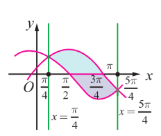

**Example 9.57**

The region enclosed by the circle $x^2 + y^2 = a^2$ is divided into two segments by the line $x = h$ .  
Find the area of the smaller segment.

**Solution**

The smaller segment is sketched in Fig. 9.29. Here $0 < h < a$ . By symmetry about the $x$ -axis,  
the area of the smaller segment is given by

$A = 2 \int_h^a \sqrt{a^2 - x^2} dx = 2 \left[ \frac{x \sqrt{a^2 - x^2}}{2} + \frac{a^2}{2} \sin^{-1} \left( \frac{x}{a} \right) \right]_h^a$

$= 2 \left[ 0 + \frac{a^2}{2} \sin^{-1}(1) - \left( \frac{h \sqrt{a^2 - h^2}}{2} + \frac{a^2}{2} \sin^{-1} \left( \frac{h}{a} \right) \right) \right]$

$= a^2 \left( \frac{\pi}{2} \right) - h \sqrt{a^2 - h^2} - a^2 \sin^{-1} \left( \frac{h}{a} \right)$

$= a^2 \left[ \frac{\pi}{2} - \sin^{-1} \left( \frac{h}{a} \right) \right] - h \sqrt{a^2 - h^2}$

$= a^2 \cos^{-1} \left( \frac{h}{a} \right) - h \sqrt{a^2 - h^2}$ .

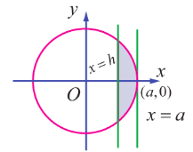

**Example 9.58**

Find the area of the region in the first quadrant bounded by the parabola $y^2 = 4x$ , the line $x + y = 3$ and $y$ -axis.

**Solution**

First, we find the points of intersection of $x + y = 3$ and $y^2 = 4x$ :

$x + y = 3 \implies y = 3 - x$ .

$\therefore y^2 = 4x \implies (3 - x)^2 = 4x$

$\implies x^2 - 10x + 9 = 0$

$\implies x = 1$ , $x = 9$ .

$x = 1$ in $x + y = 3 \implies y = 2$ , and $x = 9$ in $x + y = 3 \implies y = -6$ .

$(1, 2)$ and $(9, -6)$ are the points of intersection.

The line $x + y = 3$ meets the $y$ -axis at $(0, 3)$ .

The required area is sketched in Fig. 9.30.

Viewing in the direction of $y$ -axis, on the right bounding curve is given by

$x = \begin{cases} \frac{y^2}{4} , & 0 \leq y \leq 2 \\ 3 - y , & 2 \leq y \leq 3 \end{cases}$

$\therefore A = \int_0^2 x_R \, dy + \int_2^3 x_R \, dy = \int_0^2 \frac{y^2}{4} dy + \int_2^3 (3 - y) dy$

$= \left[ \frac{y^3}{12} \right]_0^2 + \left[ 3y - \frac{y^2}{2} \right]_2^3 = \left( \frac{8}{12} - 0 \right) + \left( 9 - \frac{9}{2} - 6 + \frac{4}{2} \right)$

$= \frac{2}{3} + \left( 3 - \frac{9}{2} + 2 \right) = \frac{2}{3} + \left( 5 - \frac{9}{2} \right) = \frac{2}{3} + \frac{1}{2} = \frac{7}{6}$ .

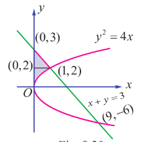

**Example 9.59**

Find, by integration, the area of the region bounded by the lines $5x - 2y = 15$ , $x + y + 4 = 0$ and the $x$ -axis.

**Solution**

The lines $5x - 2y = 15$ , $x + y + 4 = 0$ intersect at $(1, -5)$ . The line $5x - 2y = 15$ meets the $x$ -axis at $(3, 0)$ . The line $x + y + 4 = 0$ meets the $x$ -axis at $(-4, 0)$ . The required area is shaded in Fig. 9.31. It lies below the $x$ -axis. It can be computed either by considering vertical strips or horizontal strips.

When we do by vertical strips, the region has to be divided into two sub-regions by the line $x = 1$ . Then, we get

$A = \int_{-4}^{1} y_L \, dx + \int_{1}^{3} y_R \, dx$

$= \int_{-4}^{1} (-x - 4) \, dx + \int_{1}^{3} \left( \frac{5x - 15}{2} \right) \, dx$

$= \left[ -\frac{x^2}{2} - 4x \right]_{-4}^{1} + \left[ \frac{5x^2}{4} - \frac{15x}{2} \right]_{1}^{3}$

$= \left( -\frac{1}{2} - 4 \right) - \left( -8 + 16 \right) + \left( \frac{45}{4} - \frac{45}{2} \right) - \left( \frac{5}{4} - \frac{15}{2} \right)$

$= \left( -\frac{9}{2} - 8 \right) + \left( -\frac{45}{4} + \frac{25}{4} \right)$

$= -\frac{25}{2} - \frac{20}{4} = -\frac{25}{2} - 5 = -\frac{35}{2}$

Area $= \frac{35}{2}$ sq. units.

When we do by horizontal strips, there is no need to subdivide the region. In this case, the area is bounded on the right by the line $5x - 2y = 15$ and on the left by $x + y + 4 = 0$ . So, we get

$A = \int_{-5}^{0} [x_R - x_L] \, dy = \int_{-5}^{0} \left[ \frac{15 + 2y}{5} - (-4 - y) \right] \, dy$

$= \int_{-5}^{0} \left[ 7 + \frac{7y}{5} \right] \, dy = \left[ 7y + \frac{7y^2}{10} \right]_{-5}^{0}$

$= 0 - \left[ -35 + \frac{35}{2} \right] = \frac{35}{2}$ .

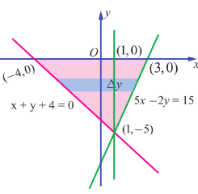

> **Note**
>
> The region is triangular with base 7 units and height 5 units. Hence its area is $\frac{35}{2}$ without using integration.

**Example 9.60**

Using integration find the area of the region bounded by triangle $ABC$ , whose vertices $A$ , $B$ , and $C$ are $(-1, 1)$ , $(3, 2)$ , and $(0, 5)$ respectively.

**Solution**

See Fig. 9.32.

Equation of $AB$ is  
$\frac{y-1}{2-1} = \frac{x+1}{3+1}$ or $y = \frac{1}{4}(x+5)$

Equation of $BC$ is  
$\frac{y-5}{2-5} = \frac{x-0}{3-0}$ or $y = -x+5$

Equation of $AC$ is  
$\frac{y-1}{5-1} = \frac{x+1}{0+1}$ or $y = 4x+5$

Area of $\triangle ABC =$ Area $DACO +$ Area of $OCBE -$ Area of $DABE$

$= \int_{-1}^{0}(4x+5)dx + \int_{0}^{3}(-x+5)dx - \frac{1}{4}\int_{-1}^{3}(x+5)dx$

$= \left[\frac{4x^2}{2} + 5x\right]_{-1}^{0} + \left[-\frac{x^2}{2} + 5x\right]_{0}^{3} - \frac{1}{4}\left[\frac{x^2}{2} + 5x\right]_{-1}^{3}$

$= 0 - (2 - 5) + \left(-\frac{9}{2} + 15\right) - 0 - \frac{1}{4}\left[\frac{9}{2} + 15\right] + \frac{1}{4}\left[\frac{1}{2} - 5\right]$

$= 3 + \frac{21}{2} - \frac{1}{4}\left(\frac{39}{2}\right) + \frac{1}{4}\left(-\frac{9}{2}\right)$

$= 3 + \frac{21}{2} - \frac{39}{8} - \frac{9}{8}$

$= 3 + \frac{21}{2} - \frac{48}{8}$

$= 3 + \frac{21}{2} - 6$

$= \frac{15}{2}$ sq. units.

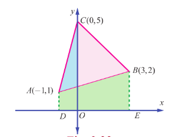

**Example 9.61**

Using integration, find the area of the region which is bounded by $x$ -axis, the tangent and normal to the circle $x^2 + y^2 = 4$ drawn at $(1, \sqrt{3})$ .

**Solution**

We recall that the equation of the tangent to the circle  
$x^2 + y^2 = a^2$  
at $(x_1, y_1)$ is  
$x x_1 + y y_1 = a^2$  
So, the equation of the tangent to the circle  
$x^2 + y^2 = 4$  
at $(1, \sqrt{3})$ is  
$x + y \sqrt{3} = 4$  
that is,  
$y = -\frac{1}{\sqrt{3}}(x - 4)$ .  
The tangent meets the $x$ -axis at the point $(4, 0)$ .

The slope of the tangent is  
$-\frac{1}{\sqrt{3}}$ .  
So the slope of the normal is  
$\sqrt{3}$  
and hence equation of the normal is  
$y - \sqrt{3} = \sqrt{3}(x - 1)$ ;  
that is  
$y = \sqrt{3}x$  
and it passes through the origin. The area to be found is shaded in the adjoining figure. It can be found by two methods.

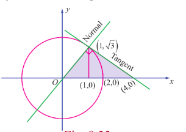

**Method 1**

Viewing in the positive direction of $y$ -axis, the required area is the area of the region bounded by $x$ -axis, $y = \sqrt{3}x$ and $x + y\sqrt{3} = 4$ . So it can be obtained by applying the formula $\int_a^b y \, dx$ . For this, we have to split the region into sub-regions, one sub-region bounded by $x$ -axis, the normal $y = \sqrt{3}x$ and the line $x = 1$ ; the other sub-region bounded by $x$ -axis, the tangent $x + y\sqrt{3} = 4$ and the line $x = 1$ axis.

$\therefore$ Area required $= \int_0^1 y \, dx + \int_1^4 y \, dx = \int_0^1 \sqrt{3}x \, dx + \int_1^4 \left[ -\frac{1}{\sqrt{3}}(x - 4) \right] \, dx$

$= \left[ \sqrt{3} \frac{x^2}{2} \right]_0^1 + \left[ -\frac{1}{\sqrt{3}} \left( \frac{x^2}{2} - 4x \right) \right]_1^4$

$= \frac{\sqrt{3}}{2} + \left[ -\frac{1}{\sqrt{3}} \left( 8 - 16 \right) + \frac{1}{\sqrt{3}} \left( \frac{1}{2} - 4 \right) \right]$

$= \frac{\sqrt{3}}{2} + \frac{8}{\sqrt{3}} - \frac{7}{2\sqrt{3}}$

$= \frac{\sqrt{3}}{2} + \frac{16}{2\sqrt{3}} - \frac{7}{2\sqrt{3}}$

$= \frac{\sqrt{3}}{2} + \frac{9}{2\sqrt{3}}$

$= \frac{3}{2\sqrt{3}} + \frac{9}{2\sqrt{3}} = \frac{12}{2\sqrt{3}} = \frac{6}{\sqrt{3}} = 2\sqrt{3}$ .

**Method 2**

Viewing in the direction of $x$ -axis, the required area is the area of the region bounded between  
$y = \sqrt{3}x$ and $x + y\sqrt{3} = 4$ , $y = 0$ and $y = \sqrt{3}$ .  
So, it can be obtained by applying the formula  
$\int_c^d (x_R - x_L) \, dy$

Here,  
$c = 0$ , $d = \sqrt{3}$ , $x_R$ is the $x$ -value on the tangent $x + y\sqrt{3} = 4$ and $x_L$ is the $x$ -value on the normal $y = \sqrt{3}x$ .

$\therefore$ Area required $= \int_c^d (x_R - x_L) \, dy = \int_0^{\sqrt{3}} \left( 4 - y\sqrt{3} - \frac{y}{\sqrt{3}} \right) \, dy$

$= \left[ 4y - \frac{\sqrt{3}}{2} y^2 - \frac{y^2}{2\sqrt{3}} \right]_0^{\sqrt{3}}$

$= 4\sqrt{3} - \frac{3\sqrt{3}}{2} - \frac{3}{2\sqrt{3}}$

$= 4\sqrt{3} - \frac{3\sqrt{3}}{2} - \frac{\sqrt{3}}{2}$

$= 4\sqrt{3} - 2\sqrt{3} = 2\sqrt{3}$ .

**Working rule for finding area of the region bounded by $y = f_1(x)$ , $y = f_2(x)$ , the lines $x = a$ and $x = b$ , where $a < b$ :**

Draw an arbitrary line parallel to $y$ -axis cutting the plane region. First, find the $y$ -coordinate of the point where the line enters the region. Call it $y_{ENTRY}$ . Next, find the $y$ -coordinate of the point where the line exits the region. Call it $y_{EXIT}$ . Both $y_{ENTRY}$ and $y_{EXIT}$ can be found from the equations of the bounding curves. Then, the required area is given by  
$\int_a^b \left[ y_{EXIT} - y_{ENTRY} \right] dx$ .

**Working rule for finding area of the region bounded by $x = g_1(y)$ , $x = g_2(y)$ , the lines $y = c$ and $y = d$ , where $c < d$ :**

Draw an arbitrary line parallel to $x$ -axis cutting the plane region.  
First, find the $x$ -coordinate of the point where the line enters the region. Call it $x_{ENTRY}$ .  
Next, find the $x$ -coordinate of the point where the line exits the region. Call it $x_{EXIT}$ . Both $x_{ENTRY}$ and $x_{EXIT}$ can be found from the equations of the bounding curves. Then, the required area is given by  
$\int_c^d \left[ x_{EXIT} - x_{ENTRY} \right] dy$ .

**EXERCISE 9.8**

1. Find the area of the region bounded by $3x - 2y + 6 = 0$ , $x = -3$ , $x = 1$ and $x$ -axis.

2. Find the area of the region bounded by $2x - y + 1 = 0$ , $y = -1$ , $y = 3$ and $y$ -axis.

3. Find the area of the region bounded by the curve $2 + x - x^2 + y = 0$ , $x$ -axis, $x = -3$ and $x = 3$ .

4. Find the area of the region bounded by the line $y = 2x + 5$ and the parabola $y = x^2 - 2x$ .

5. Find the area of the region bounded between the curves $y = \sin x$ and $y = \cos x$ and the lines $x = 0$ and $x = \pi$ .

6. Find the area of the region bounded by $y = \tan x$ , $y = \cot x$ and the lines $x = 0$ , $x = \frac{\pi}{2}$ , $y = 0$ .

7. Find the area of the region bounded by the parabola $y^2 = x$ and the line $y = x - 2$ .

8. Father of a family wishes to divide his square field bounded by $x = 0$ , $x = 4$ , $y = 4$ and $y = 0$ along the curve $y^2 = 4x$ and $x^2 = 4y$ into three equal parts for his wife, daughter and son. Is it possible to divide? If so, find the area to be divided among them.

9. The curve $y = (x - 2)^2 + 1$ has a minimum point at $P$ . A point $Q$ on the curve is such that the slope of $PQ$ is 2. Find the area bounded by the curve and the chord $PQ$ .

10. Find the area of the region common to the circle $x^2 + y^2 = 16$ and the parabola $y^2 = 6x$ .