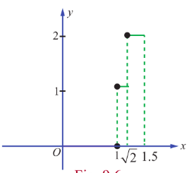
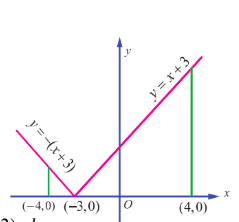

### 9.3 Fundamental Theorems of Integral Calculus and their Applications

We observe in the above examples that evaluation of $\int_{a}^{b}f(x)dx$ as a limit of the sum is quite tedious, even if $f(x)$ is a very simple function. Both Newton and Leibnitz, more or less at the same time, devised an easy method for evaluating definite integrals. Their method is based upon two celebrated theorems known as First Fundamental Theorem and Second Fundamental Theorem of Integral Calculus. These theorems establish the connection between a function and its anti-derivative (if it exists). In fact, the two theorems provide a link between differential calculus and integral calculus. We state below the above important theorems without proofs.

**Theorem 9.1 (First Fundamental Theorem of Integral Calculus)**

If $f(x)$ be a continuous function defined on a closed interval $[a,b]$ and $F(x) = \int_{a}^{x}f(u)du$, $a< x< b$ then, $\frac{d}{dx} F(x) = f(x)$. In other words, $F(x)$ is an anti-derivative of $f(x)$.

**Theorem 9.2 (Second Fundamental Theorem of Integral Calculus)**

If $f(x)$ be a continuous function defined on a closed interval $[a,b]$ and $F(x)$ is an anti-derivative of $f(x)$, then,

$$
\int_{a}^{b}f(x)dx = F(b) - F(a).
$$

> **Note**
>
> Since $F(b) - F(a)$ is the value of the definite integral (Riemann integral) $\int_{a}^{b}f(x)dx$, any arbitrary constant added to the anti-derivative $F(x)$ cancels out and hence it is not necessary to add an arbitrary constant to the anti-derivative, when we are evaluating definite integrals. As a short-hand form, we write $F(b) - F(a) = \left[F(x)\right]_{a}^{b}$. The value of a definite integral is unique.

By the second fundamental theorem of integral calculus, the following properties of definite integrals hold. They are stated here without proof.

**Property 1** : $\int_a^b f(x) \, dx = \int_a^b f(u) \, du$ , $a < b$

i.e., definite integral is independent of the change of variable.

**Property 2** : $\int_a^b f(x) \, dx = -\int_b^a f(x) \, dx$

i.e., the value of the definite integral changes by minus sign if the limits are interchanged.

**Property 3** : $\int_a^b f(x) \, dx = \int_a^c f(x) \, dx + \int_c^b f(x) \, dx$ , $a < c < b$

**Property 4** : $\int_a^b [\alpha f(x) + \beta g(x)] \, dx = \alpha \int_a^b f(x) \, dx + \beta \int_a^b g(x) \, dx$ , where $\alpha$ and $\beta$ are constants.

**Property 5** : If $x = g(u)$ , then $\int_a^b f(x) \, dx = \int_c^d f(g(u)) \frac{dg(u)}{du} \, du$ where $g(c) = a$ and $g(d) = b$ .

This property is used for evaluating definite integrals by making substitution.  
We illustrate the use of the above properties by the following examples.

**Example 9.5**

Evaluate: $\int_{0}^{3} (3x^2 - 4x + 5) dx$ .

**Solution**

$\int_{0}^{3} (3x^2 - 4x + 5) \, dx = \int_{0}^{3} 3x^2 \, dx - \int_{0}^{3} 4x \, dx + \int_{0}^{3} 5 \, dx$

$= 3 \int_{0}^{3} x^2 \, dx - 4 \int_{0}^{3} x \, dx + 5 \int_{0}^{3} \, dx$

$= 3 \left[ \frac{x^3}{3} \right]_{0}^{3} - 4 \left[ \frac{x^2}{2} \right]_{0}^{3} + 5 \left[ x \right]_{0}^{3}$

$= (27 - 0) - 2(9 - 0) + 5(3 - 0)$

$= 27 - 18 + 15 = 24$ .

**Example 9.6**

Evaluate:  
$\int_{0}^{1} \frac{2x + 7}{5x^2 + 9} \, dx$ .

**Solution**

$\int_{0}^{1} \frac{2x + 7}{5x^2 + 9} \, dx = \int_{0}^{1} \frac{2x}{5x^2 + 9} \, dx + 7 \int_{0}^{1} \frac{dx}{5x^2 + 9}$

$= \frac{1}{5} \log(5x^2 + 9) \bigg|_{0}^{1} + \frac{7}{5} \int_{0}^{1} \frac{dx}{x^2 + \left(\frac{3}{\sqrt{5}}\right)^2}$

$= \frac{1}{5} \left[ \log 14 - \log 9 \right] + \frac{7}{5} \times \frac{\sqrt{5}}{3} \left[ \tan^{-1} \left( \frac{\sqrt{5}x}{3} \right) \right]_{0}^{1}$

$= \frac{1}{5} \log \frac{14}{9} + \frac{7}{3\sqrt{5}} \tan^{-1} \frac{\sqrt{5}}{3}$ .

**Example 9.7**

Evaluate: $\int_{0}^{1} [2x] dx$ where $[-]$ is the greatest integer function.

**Solution**

$\int_{0}^{1} [2x] dx = \int_{0}^{\frac{1}{2}} [2x] dx + \int_{\frac{1}{2}}^{1} [2x] dx = \int_{0}^{\frac{1}{2}} 0 dx + \int_{\frac{1}{2}}^{1} 1 dx = 0 + \left[ x \right]_{\frac{1}{2}}^{1} = 1 - \frac{1}{2} = \frac{1}{2}$ .

**Example 9.8**

Evaluate: $\int_{0}^{\frac{\pi}{3}} \frac{\sec x \tan x}{1 + \sec^{2} x} dx$ .

**Solution**

Let $I = \int_{0}^{\frac{\pi}{3}} \frac{\sec x \tan x}{1 + \sec^{2} x} dx$ .  
Put $\sec x = u$ . Then, $\sec x \tan x dx = du$ .

When $x = 0$ , $u = \sec 0 = 1$ . When $x = \frac{\pi}{3}$ , $u = \sec \frac{\pi}{3} = 2$ .

$\therefore I = \int_{1}^{2} \frac{du}{1 + u^{2}} = \left[ \tan^{-1} u \right]_{1}^{2} = \tan^{-1} 2 - \tan^{-1} 1 = \tan^{-1} 2 - \frac{\pi}{4}$ .

**Example 9.9**

Evaluate:  
$\int_{0}^{9} \frac{1}{x + \sqrt{x}} \, dx$ .

**Solution**

Let $\sqrt{x} = u$ . Then $x = u^2$ , and so $dx = 2u \, du$ .

When $x = 0$ , $u = 0$ . When $x = 9$ , $u = 3$ .

$\int_{0}^{9} \frac{1}{x + \sqrt{x}} \, dx = \int_{0}^{3} \frac{1}{u^2 + u} \, (2u) \, du = 2 \int_{0}^{3} \frac{1}{1 + u} \, du = 2 \left[ \log|1 + u| \right]_{0}^{3} = 2[\log 4 - 0] = \log 16$ .

**Example 9.10**

Evaluate:  
$\int_{1}^{2} \frac{x}{(x + 1)(x + 2)} \, dx$ .

**Solution**

Let $I = \int_{1}^{2} \frac{x}{(x + 1)(x + 2)}\, dx$ .

$I = \int_{1}^{2} \left[ \frac{-1}{(x + 1)} + \frac{2}{x + 2} \right] \, dx$

$= \left[ -\log(x + 1) + 2 \log(x + 2) \right]_{1}^{2}$

$= \log \left[ \frac{(x + 2)^2}{x + 1} \right]_{1}^{2}$

$= \log \frac{16}{3} - \log \frac{9}{2}$

$= \log \frac{32}{27}$ .

**Example 9.11**

Evaluate :  
$\int_{0}^{\frac{\pi}{2}} \frac{\cos \theta}{(1 + \sin \theta)(2 + \sin \theta)} d\theta$ .

**Solution**  
Let $I = \int_{0}^{\frac{\pi}{2}} \frac{\cos \theta}{(1 + \sin \theta)(2 + \sin \theta)} d\theta$ .  
Put $u = 1 + \sin \theta$ . Then, $du = \cos \theta d\theta$ .  
When $\theta = 0$ , $u = 1$ . When $\theta = \frac{\pi}{2}$ , $u = 2$ .  
$\therefore I = \int_{1}^{2} \frac{du}{u(1 + u)} = \int_{1}^{2} \left( \frac{1}{u} - \frac{1}{1 + u} \right) du = \left[ \log u - \log (1 + u) \right]_{1}^{2} = (\log 2 - \log 3) - (\log 1 - \log 2) = 2 \log 2 - \log 3 = \log \frac{4}{3}$ .

**Example 9.12**

Evaluate :  
$\int_{0}^{\frac{1}{\sqrt{2}}} \frac{\sin^{-1} x}{(1 - x^2)^{\frac{3}{2}}} dx$ .

**Solution**  
Let $I = \int_{0}^{\frac{1}{\sqrt{2}}} \frac{\sin^{-1} x}{(1 - x^2)^{\frac{3}{2}}} dx$ .  
Put $u = \sin^{-1} x$ . Then, $x = \sin u$ and so, $du = \frac{1}{\sqrt{1 - x^2}} dx$ .  
When $x = 0$ , $u = 0$ . When $x = \frac{1}{\sqrt{2}}$ , $u = \frac{\pi}{4}$ .  
$\therefore I = \int_{0}^{\frac{\pi}{4}} \frac{u}{\cos^2 u} du = \int_{0}^{\frac{\pi}{4}} u \sec^2 u du = \left[ u \tan u \right]_{0}^{\frac{\pi}{4}} - \int_{0}^{\frac{\pi}{4}} \tan u du = \left[ u \tan u \right]_{0}^{\frac{\pi}{4}} + \left[ \log \cos u \right]_{0}^{\frac{\pi}{4}} = \frac{\pi}{4} + \log \frac{1}{\sqrt{2}} = \frac{\pi}{4} - \frac{1}{2} \log 2$ .

**Example 9.13**

Evaluate: $\int_{0}^{\frac{\pi}{2}}(\sqrt{\tan x} +\sqrt{\cot x})dx$.

**Solution**

Let $I=\int_{0}^{\frac{\pi}{2}}(\sqrt{\tan x}+\sqrt{\cot x})dx$.

$$
I=\int_{0}^{\frac{\pi}{2}}\left(\sqrt{\frac{\sin x}{\cos x}}+\sqrt{\frac{\cos x}{\sin x}}\right)dx=\int_{0}^{\frac{\pi}{2}}\frac{\sin x+\cos x}{\sqrt{\sin x\cos x}}dx=\sqrt{2}\int_{0}^{\frac{\pi}{2}}\frac{\sin x+\cos x}{\sqrt{2\sin x\cos x}}dx
$$
$$
=\sqrt{2}\int_{0}^{\frac{\pi}{2}}\frac{(\sin x+\cos x)dx}{\sqrt{1-(\sin x-\cos x)^{2}}}.
$$

Put $u = \sin x - \cos x$. Then, $du = (\cos x + \sin x)dx$.

When $x = 0,u = -1$. When $x = \frac{\pi}{2},u = 1$.

$$
\therefore I = \sqrt{2}\int_{-1}^{1}\frac{du}{\sqrt{1 - u^{2}}} = \sqrt{2} [\sin^{-1}u]_{-1}^{1} = \sqrt{2}\left[\sin^{-1}(1) - \sin^{-1}(-1)\right] = \pi \sqrt{2}.
$$

**Example 9.14**

Evaluate: $\int_{0}^{1.5} \left[ x^{2} \right] dx$, where $[x]$ is the greatest integer function.

**Solution**

We know that the greatest integer function $[x]$ is the largest integer less than or equal to $x$. In other words, it is defined by $[x] = n$, if $n \leq x < (n + 1)$, where $n$ is an integer.

We note that the above function is not continuous on $[0,1.5]$.

But, it is continuous in each of the sub-intervals $[0,1)$, $[1,\sqrt{2})$ and $[\sqrt{2},1.5]$; that is, it is piece-wise continuous on $[0,1.5]$. See Fig. 9.6. Hence, we get

$$
\int_{0}^{1.5}\left[x^{2}\right]dx = \int_{0}^{1}\left[x^{2}\right]dx + \int_{1}^{\sqrt{2}}\left[x^{2}\right]dx + \int_{\sqrt{2}}^{1.5}\left[x^{2}\right]dx = \int_{0}^{1}0dx + \int_{1}^{\sqrt{2}}1dx + \int_{\sqrt{2}}^{1.5}2dx
$$
$$
= 0 + \left(x\right)_{1}^{\sqrt{2}} + \left(2x\right)_{\sqrt{2}}^{1.5} = \left(\sqrt{2} -1\right) + \left(3 - 2\sqrt{2}\right) = 2 - \sqrt{2}.
$$

**Example 9.15**

Evaluate: $\int_{-4}^{4}|x + 3|dx$.

**Solution**

By definition, we have $|x + 3| = \begin{cases} x + 3 & \text{if } x\geq -3\\ -x - 3 & \text{if } x< -3 \end{cases}$

See Fig. 9.7 for the graph of $y = |x + 3|$ in $-4\leq x\leq 4$

$$
\begin{aligned}
\therefore \int_{-4}^{4}|x + 3| dx &= \int_{-4}^{-3}|x + 3| dx + \int_{-3}^{4}|x + 3| dx \\
&= \int_{-4}^{-3}(-x - 3) dx + \int_{-3}^{4}(x + 3) dx \\
&= \left[-\frac{x^{2}}{2} -3x\right]_{-4}^{-3} + \left[\frac{x^{2}}{2} +3x\right]_{-3}^{4} \\
&= \left(-\frac{9}{2} +9\right) - \left(-\frac{16}{2} +12\right) + \left(\frac{16}{2} +12\right) - \left(\frac{9}{2} -9\right) \\
&= \left(\frac{9}{2}\right) - 4 + 20 + \left(\frac{9}{2}\right) = 25.
\end{aligned}
$$

Next, we give examples to illustrate the application of Property 5.

**Example 9.16**

Show that $\int_{0}^{\frac{\pi}{2}}\frac{dx}{4 + 5\sin x} = \frac{1}{3}\log_{e}2$.

**Solution**

Put $u = \tan {\frac{x}{2}}$. Then, $\sin x = \frac{2\tan{\frac{x}{2}}}{1 + \tan^{2}{\frac{x}{2}}} = \frac{2u}{1 + u^{2}}$, $du = \frac{1}{2}\sec^{2}{\frac{x}{2}}dx \Rightarrow dx = \frac{2du}{1 + u^{2}}$.

When $x = 0$, $u = \tan 0 = 0$. When $x = \frac{\pi}{2}$, $u = \tan {\frac{\pi}{4}} = 1$

$$
I = \int_{0}^{\frac{\pi}{2}}\frac{dx}{4 + 5\sin x} = \int_{0}^{1}\frac{\frac{2du}{1 + u^{2}}}{4 + 5\left(\frac{2u}{1 + u^{2}}\right)} = \int_{0}^{1}\frac{du}{2u^{2} + 5u + 2} = \frac{1}{2}\int_{0}^{1}\frac{du}{u^{2} + \frac{5}{2}u + 1}
$$

$$
= \frac{1}{2}\int_{0}^{1}\frac{du}{\left(u + \frac{5}{4}\right)^{2} - \left(\frac{3}{4}\right)^{2}} = \left[\frac{1}{2}\times \frac{1}{2\times\left(\frac{3}{4}\right)}\log \left(\frac{\left(u + \frac{5}{4}\right) - \frac{3}{4}}{\left(u + \frac{5}{4}\right) + \frac{3}{4}}\right)\right]_{0}^{1} = \frac{1}{3}\log \left(\frac{u + \frac{1}{2}}{u + 2}\right) = \frac{1}{3}\log 2.
$$

> **Note**
>
> To evaluate anti-derivatives of the type $\int \frac{dx}{a\cos x + b\sin x + c}$, we use the substitution method by putting $u = \tan {\frac{x}{2}}$ so that $\cos x = \frac{1 - u^{2}}{1 + u^{2}}$, $\sin x = \frac{2u}{1 + u^{2}}$, $dx = \frac{2du}{1 + u^{2}}$.

**Example 9.17**

Prove that $\int_{0}^{\frac{\pi}{4}}\frac{\sin 2x}{4} dx = \frac{\pi}{4}$.

**Solution**

$I = \int_{0}^{\frac{\pi}{4}} \frac{\sin 2x \, dx}{\sin^4 x + \cos^4 x} = \int_{0}^{\frac{\pi}{4}} \frac{\sin 2x \, dx}{\left( \sin^2 x + \cos^2 x \right)^2 - 2 \sin^2 x \cos^2 x}$

$= \int_{0}^{\frac{\pi}{4}} \frac{\sin 2x \, dx}{1 - \frac{1}{2} \left( 2 \sin x \cos x \right)^2} = \int_{0}^{\frac{\pi}{4}} \frac{\sin 2x \, dx}{1 - \frac{1}{2} \sin^2 2x} = \int_{0}^{\frac{\pi}{4}} \frac{2 \sin 2x \, dx}{2 - \sin^2 2x}$ .

Put $u = \cos 2x$ , Then, $du = -2 \sin 2x \, dx$ .

When $x = 0$ , we have $u = \cos 0 = 1$ . When $x = \frac{\pi}{4}$ , we have $u = \cos \frac{\pi}{2} = 0$ .

$\therefore I = \int_{1}^{0} \frac{-du}{1 + u^2} = \int_{0}^{1} \frac{du}{1 + u^2} = \left[ \tan^{-1} u \right]_{0}^{1} = \frac{\pi}{4}$ .

**Example 9.18**

Prove that  
$\int_{0}^{\frac{\pi}{4}} \frac{dx}{a^2 \sin^2 x + b^2 \cos^2 x} = \frac{1}{ab} \tan^{-1} \left( \frac{a}{b} \right)$ , where $a, b > 0$ .

**Solution**

Put  
$I = \int_{0}^{\frac{\pi}{4}} \frac{dx}{a^2 \sin^2 x + b^2 \cos^2 x} = \int_{0}^{\frac{\pi}{4}} \frac{\sec^2 x \, dx}{a^2 \tan^2 x + b^2}$ .

Put $u = \tan x$ . Then $du = \sec^2 x \, dx$ .

When $x = 0$ , we have $u = \tan 0 = 0$ . When $x = \frac{\pi}{4}$ , we have $u = \tan \frac{\pi}{4} = 1$ .

$\therefore I = \int_{0}^{1} \frac{du}{a^2 u^2 + b^2} = \frac{1}{a^2} \int_{0}^{1} \frac{du}{u^2 + \left( \frac{b}{a} \right)^2} = \frac{1}{a^2} \left[ \frac{a}{b} \tan^{-1} \left( \frac{au}{b} \right) \right]_{0}^{1} = \frac{1}{ab} \tan^{-1} \left( \frac{a}{b} \right)$ .

We derive some more properties of definite integrals.

**Property 6**

$\int_a^b f(x) dx = \int_a^b f(a + b - x) dx$

**Proof**

Let $u = a + b - x$ . Then, we get $dx = -du$ .

When $x = a$ , $u = a + b - a = b$ . When $x = b$ , we get $u = a + b - b = a$ .

$\therefore \int_a^b f(x) dx = \int_b^a f(a + b - u)(-du) = \int_a^b f(a + b - u) du$

$= \int_a^b f(a + b - x) dx$ .

> **Note**
>
> Replace $a$ by $0$ and $b$ by $a$ in the above property we get the following property
>
> $\int_0^a f(x) dx = \int_0^a f(a - x) dx$ .

**Example 9.19**

Evaluate $\int_{0}^{\frac{\pi}{4}}\frac{1}{\sin x + \cos x} dx$

**Solution**

$$
I=\int_{0}^{\frac{\pi}{4}}\frac{1}{\sin x+\cos x}dx=\int_{0}^{\frac{\pi}{4}}\frac{1}{\sqrt{2}\left(\frac{1}{\sqrt{2}}\sin x+\frac{1}{\sqrt{2}}\cos x\right)}dx
$$
$$
=\frac{1}{\sqrt{2}}\int_{0}^{\frac{\pi}{4}}\frac{1}{\left(\cos\frac{\pi}{4}\cos x+\sin\frac{\pi}{4}\sin x\right)}dx=\frac{1}{\sqrt{2}}\int_{0}^{\frac{\pi}{4}}\frac{1}{\cos\left(\frac{\pi}{4}-x\right)}dx
$$
$$
=\frac{1}{\sqrt{2}}\int_{0}^{\frac{\pi}{4}}\frac{1}{\cos x}dx \quad \text{(using } \int_{0}^{a}f(x)dx=\int_{0}^{a}f(a-x)dx\text{)}
$$
$$
=\frac{1}{\sqrt{2}}\int_{0}^{\frac{\pi}{4}}\sec x dx=\frac{1}{\sqrt{2}}\left[\log(\sec x+\tan x)\right]_{0}^{\frac{\pi}{4}}
$$
$$
=\frac{1}{\sqrt{2}}\left[\log(\sqrt{2}+1)-\log(1+0)\right]
$$
$$
=\frac{1}{\sqrt{2}}\log(\sqrt{2}+1).
$$

**Property 7**

$$
\int_{0}^{2a}f(x)dx = \int_{0}^{a}[f(x) + f(2a - x)]dx.
$$

**Proof**

By property 3, we have $\int_{0}^{2a}f(x)dx = \int_{0}^{a}f(x)dx + \int_{a}^{2a}f(x)dx$. (1)

Let us make the substitution $x = 2a - u$ in $\int_{a}^{2a}f(x)dx$. Then, $dx = -du$.

When $x = a$, we have $u = 2a - a = a$. When $x = 2a$, we have $u = 2a - 2a = 0$. So, we get

$$
\int_{a}^{2a}f(x)dx = \int_{a}^{0}f(2a - u)(-du) = \int_{0}^{a}f(2a - u)du = \int_{0}^{a}f(2a - x)dx. \quad (2)
$$

Substituting equation (2) in equation (1), we get

$$
\int_{0}^{2a}f(x)dx = \int_{0}^{a}f(x)dx + \int_{0}^{a}f(2a - x)dx = \int_{0}^{a}[f(x) + f(2a - x)]dx.
$$

**Property 8**

If $f(x)$ is an even function, then $\int_{-a}^{a}f(x)dx = 2\int_{0}^{a}f(x)dx$.

(Recall that a function $f(x)$ is an even function if and only if $f(-x) = f(x)$.)

**Proof**

By property 3, we have

$$
\int_{-a}^{a}f(x)dx = \int_{-a}^{0}f(x)dx + \int_{0}^{a}f(x)dx.
$$

In the integral $\int_{-a}^{0}f(x)dx$, let us make the substitution, $x = -u$. Then, $dx = -du$.

When $x = -a$, we get $u = a$, when $x = 0$, we get $u = 0$, So, we get

$$
\int_{-a}^{0}f(x)dx = \int_{a}^{0}f(-u)(-du) = \int_{0}^{a}f(-u)du = \int_{0}^{a}f(-x)dx = \int_{0}^{a}f(x)dx. \quad (2)
$$

Substituting equation (2) in equation (1), we get

$$
\int_{-a}^{a}f(x)dx = \int_{0}^{a}f(x)dx + \int_{0}^{a}f(x)dx = 2\int_{0}^{a}f(x)dx.
$$

**Property 9**

If $f(x)$ is an odd function, then $\int_{-a}^{a}f(x)dx = 0$.

(Recall that a function $f(x)$ is an odd function if and only if $f(-x) = -f(x)$.)

**Proof**

By property 3, we have

$$
\int_{-a}^{a}f(x)dx = \int_{-a}^{0}f(x)dx + \int_{0}^{a}f(x)dx. \quad (1)
$$

Consider $\int_{-a}^{0}f(x)dx$. In this integral, let us make the substitution, $x = -u$. Then, $dx = -du$.

When $x = -a$, we get $u = a$; when $x = 0$, we get $u = 0$. So, we get

$$
\int_{-a}^{0}f(x)dx = \int_{a}^{0}f(-u)(-du) = \int_{0}^{a}f(-u)du = \int_{0}^{a}f(-x)dx = -\int_{0}^{a}f(x)dx. \quad (2)
$$

Substituting equation (2) in equation (1), we get

$$
\int_{-a}^{a}f(x)dx = \int_{0}^{a}f(x)dx - \int_{0}^{a}f(x)dx = 0
$$

**Property 10**

If $f(2a - x) = f(x)$, then $\int_{0}^{2a}f(x)dx = 2\int_{0}^{a}f(x)dx$.

**Proof**

By property 7, we have

$$
\int_{0}^{2a}f(x)dx = \int_{0}^{a}\big[f(x) + f(2a - x)\big]dx. \quad (1)
$$

Setting the condition $f(2a - x) = f(x)$ in equation (1), we get

$$
\int_{0}^{2a}f(x)dx = \int_{0}^{a}\big[f(x) + f(x)\big]dx = 2\int_{0}^{a}f(x)dx.
$$

**Property 11**

If $f(2a - x) = -f(x)$, then $\int_{0}^{2a}f(x)dx = 0$.

**Proof**

By property 7, we have

$$
\int_{0}^{2a}f(x)dx = \int_{0}^{a}[f(x) + f(2a - x)]dx. \quad (1)
$$

Setting the condition $f(2a - x) = -f(x)$ in equation (1), we get

$$
\int_{0}^{2a}f(x)dx = \int_{0}^{a}[f(x) - f(x)]dx = 0.
$$

**Property 12**

$$
\int_{0}^{a}x f(x)dx = \frac{a}{2}\int_{0}^{a}f(x)dx \quad \text{if } f(a - x) = f(x).
$$

**Proof**

Let $I = \int_{0}^{a}x f(x)dx$.

Then $I = \int_{0}^{a}(a - x)f(a - x)dx$, since $\int_{0}^{a}g(x)dx = \int_{0}^{a}g(a - x)dx$

$= \int_{0}^{a}(a - x)f(x)dx$, since $f(a - x) = f(x)$. (2)

Adding (1) and (2), we get

$$
2I = \int_{0}^{a}(x + a - x)f(x)dx
$$
$$
= a\int_{0}^{a}f(x)dx.
$$
$$
\therefore I = \frac{a}{2}\int_{0}^{a}f(x)dx.
$$

> **Note**
>
> This property helps us to remove the factor $x$ present in the integrand of the LHS.

**Example 9.20**

Show that $\int_{0}^{\pi}g(\sin x)dx = 2\int_{0}^{\frac{\pi}{2}}g(\sin x)dx$, where $g(\sin x)$ is a function of $\sin x$.

**Solution**

We know that

$$
\int_{0}^{2a}f(x)dx = 2\int_{0}^{a}f(x)dx \quad \text{if } f(2a - x) = f(x).
$$

Take $2a = \pi$ and $f(x) = g(\sin x)$.

Then, $f(2a - x) = f(\pi - x) = g(\sin(\pi - x)) = g(\sin x) = f(x)$.

$\therefore \int_{0}^{2\omega} f(x) dx = 2 \int_{0}^{\omega} f(x) dx$ ,

$\int_{0}^{\pi} g(\sin x) dx = 2 \int_{0}^{\frac{\pi}{2}} g(\sin x) dx$ .

**Result**

$$
\int_{0}^{\pi}g(\sin x)dx = 2\int_{0}^{\frac{\pi}{2}}g(\sin x)dx.
$$

> **Note**
>
> The above result is useful in evaluating definite integrals of the type $\int_{0}^{\pi} g(\sin x) dx$.

**Example 9.21**

Evaluate $\int_{0}^{\pi}\frac{x}{1 + \sin x} dx$.

**Solution**

Let $I = \int_{0}^{\pi}\frac{x}{1 + \sin x} dx$.

Let $f(x) = \frac{1}{1 + \sin x}$. Then $f(\pi -x) = \frac{1}{1 + \sin(\pi -x)} = \frac{1}{1 + \sin x} = f(x)$.

$$
\therefore \int_{0}^{\pi}\frac{x}{1 + \sin x} dx = \frac{\pi}{2}\int_{0}^{\pi}\frac{1}{1 + \sin x} dx, \quad (\because \int_{0}^{a}x f(x)dx = \frac{a}{2}\int_{0}^{a}f(x)dx \text{ if } f(a - x) = f(x))
$$

$$
= \pi \int_{0}^{\frac{\pi}{2}}\frac{1}{1 + \sin x} dx, \quad \text{since } \int_{0}^{\pi}g(\sin x)dx = 2\int_{0}^{\frac{\pi}{2}}g(\sin x)dx
$$

$$
= \pi \int_{0}^{\frac{\pi}{2}}\frac{1}{1 + \sin\left(\frac{\pi}{2} - x\right)} dx \quad \text{since } \int_{0}^{a}f(x)dx = \int_{0}^{a}f(a - x)dx$$

$$
= \pi \int_{0}^{\frac{\pi}{2}}\frac{1}{1 + \cos x} dx = \pi \int_{0}^{\frac{\pi}{2}}\frac{1}{2\cos^{2}\frac{x}{2}} dx = \frac{\pi}{2}\int_{0}^{\frac{\pi}{2}}\sec^{2}\frac{x}{2} dx
$$

$$
= \pi \left[\tan \frac{x}{2}\right]_{0}^{\frac{\pi}{2}} = \pi \left[\tan \frac{\pi}{4} - \tan 0\right] = \pi.
$$

**Example 9.22**

Show that $\int_{0}^{2\pi} g(\cos x) dx = 2 \int_{0}^{\pi} g(\cos x) dx$, where $g(\cos x)$ is a function of $\cos x$.

**Solution**

Take $2a = 2\pi$ and $f(x) = g(\cos x)$.

Then, $f(2a - x) = f(2\pi - x) = g(\cos(2\pi - x)) = g(\cos x) = f(x)$.

$$
\therefore \int_{0}^{2a}f(x)dx = 2\int_{0}^{a}f(x)dx.
$$

$$
\therefore \int_{0}^{2\pi}g(\cos x)dx = 2\int_{0}^{\pi}g(\cos x)dx.
$$

**Result**

$$
\int_{0}^{2\pi}g(\cos x)dx = 2\int_{0}^{\pi}g(\cos x)dx.
$$

> **Note**
>
> The above result is useful in evaluating definite integrals of the type $\int_{0}^{2\pi}g(\cos x)dx$.

**Example 9.23**

If $f(x) = f(a + x)$, then $\int_{0}^{2a}f(x)dx = 2\int_{0}^{a}f(x)dx$.

**Solution**

We write $\int_{0}^{2a}f(x)dx = \int_{0}^{a}f(x)dx + \int_{a}^{2a}f(x)dx$. (1)

Consider $\int_{a}^{2a}f(x)dx$.

Substituting $x = a + u$, we have $dx = du$; when $x = a, u = 0$ and when $x = 2a, u = a$.

$$
\therefore \int_{a}^{2a}f(x)dx = \int_{0}^{a}f(a + u)du = \int_{0}^{a}f(u)du, \quad \text{since } f(x) = f(a + x)
$$
$$
= \int_{0}^{a}f(x)dx.
$$

Substituting (2) in (1), we get

$$
\int_{0}^{2a}f(x)dx = 2\int_{0}^{a}f(x)dx.
$$

**Example 9.24**

Evaluate: $\int_{-\frac{\pi}{2}}^{\frac{\pi}{2}}x\cos x dx$.

**Solution**

Let $f(x) = x\cos x$. Then $f(-x) = (-x)\cos(-x) = -x\cos x = -f(x)$.

So $f(x) = x\cos x$ is an odd function.

Hence, applying the property, for odd function $f(x)$, $\int_{-a}^{a}f(x)dx = 0$, $\therefore$ we get $\int_{-\frac{\pi}{2}}^{\frac{\pi}{2}}x\cos x dx = 0$.

**Example 9.25**

Evaluate: $\int_{-\log 2}^{\log 2}e^{-|x|}dx$.

**Solution**

Let $f(x) = e^{-|x|}$. Then $f(-x) = e^{-|x|} = e^{-|x|} = f(x)$.

So $f(x)$ is an even function.

Hence

$\int_{-\log 2}^{\log 2} e^{-|x|} \, dx = 2 \int_0^{\log 2} e^{-|x|} \, dx = 2 \int_0^{\log 2} e^{-x} \, dx = 2 \left[ -e^{-x} \right]_0^{\log 2} = 2 \left( -e^{-\log 2} + e^0 \right) = 2 \left( -\frac{1}{2} + 1 \right) = 2 \left( \frac{1}{2} \right) = 1$ .

**Example 9.26**

Evaluate : $\int_{0}^{a} \frac{f(x)}{f(x) + f(a-x)} \, dx$ .

**Solution**

Let $I = \int_{0}^{a} \frac{f(x)}{f(x) + f(a-x)}\, dx$ . $\dots$ (1)

Applying the formula $\int_{0}^{a} f(x) \, dx = \int_{0}^{a} f(a-x) \, dx$ in equation (1), we get

$I = \int_{0}^{a} \frac{f(a-x)}{f(a-x) + f(a-(a-x))} \, dx$

$= \int_{0}^{a} \frac{f(a-x)}{f(a-x) + f(x)} \, dx$ . $\dots$ (2)

Adding equations (1) and (2), we get

$2I = \int_{0}^{a} \frac{f(x)}{f(x) + f(a-x)} \, dx + \int_{0}^{a} \frac{f(a-x)}{f(x) + f(a-x)} \, dx$

$= \int_{0}^{a} \frac{f(x) + f(a-x)}{f(x) + f(a-x)} \, dx$

$= \int_{0}^{a} \, dx = a$ .

Hence, we get $I = \frac{a}{2}$ .

**Example 9.27**

Prove that $\int_{0}^{\frac{\pi}{4}} \log(1 + \tan x) dx = \frac{\pi}{8} \log 2$ .

**Solution**

Let us put $I = \int_{0}^{\frac{\pi}{4}} \log(1 + \tan x) dx$ . $\dots$ (1)

Applying the property $\int_{0}^{a} f(x) dx = \int_{0}^{a} f(a - x) dx$ in equation (1), we get

$I = \int_{0}^{\frac{\pi}{4}} \log \left[ 1 + \tan \left( \frac{\pi}{4} - x \right) \right] dx = \int_{0}^{\frac{\pi}{4}} \log \left[ 1 + \frac{\tan \frac{\pi}{4} - \tan x}{1 + \tan \frac{\pi}{4} \tan x} \right] dx$

$= \int_{0}^{\frac{\pi}{4}} \log \left[ 1 + \frac{1 - \tan x}{1 + \tan x} \right] dx = \int_{0}^{\frac{\pi}{4}} \log \left[ \frac{1 + \tan x + 1 - \tan x}{1 + \tan x} \right] dx$

$= \int_{0}^{\frac{\pi}{4}} \log \left[ \frac{2}{1 + \tan x} \right] dx = \int_{0}^{\frac{\pi}{4}} \left[ \log 2 - \log (1 + \tan x) \right] dx$

$= \log 2 \int_{0}^{\frac{\pi}{4}} dx - \int_{0}^{\frac{\pi}{4}} \log (1 + \tan x) dx$

$= \frac{\pi}{4} \log 2 - I$

So, we get $2I = \frac{\pi}{4} \log 2$ . Hence, we get $I = \frac{\pi}{8} \log 2$ .

**Example 9.28**

Show that $\int_0^1 (\tan^{-1} x + \tan^{-1} (1-x)) \, dx = \frac{\pi}{2} - \log_e 2$ .

**Solution**

$I = \int_0^1 (\tan^{-1} x + \tan^{-1} (1-x)) \, dx$

$= \int_0^1 \tan^{-1} x \, dx + \int_0^1 \tan^{-1} (1-x) \, dx$

$= \int_0^1 \tan^{-1} x \, dx + \int_0^1 \tan^{-1} x \, dx$ , since $\int_0^a f(x) \, dx = \int_0^a f(a-x) \, dx$

$= 2 \int_0^1 \tan^{-1} x \, dx$

$= 2 \left[ x \tan^{-1} x - \int \frac{x}{1+x^2} \, dx \right]_0^1$ , applying integration by parts

$= 2 \left[ x \tan^{-1} x - \frac{1}{2} \log (1+x^2) \right]_0^1$

$= 2 \left[ \left( 1 \cdot \tan^{-1} 1 - \frac{1}{2} \log 2 \right) - \left( 0 - \frac{1}{2} \log 1 \right) \right]$

$= 2 \left[ \frac{\pi}{4} - \frac{1}{2} \log 2 \right] = \frac{\pi}{2} - \log 2$

**Example 9.29**

Evaluate $\int_2^3 \frac{\sqrt{x}}{\sqrt{5-x} + \sqrt{x}} \, dx$ .

**Solution**

Let us put $I = \int_2^3 \frac{\sqrt{x}}{\sqrt{5-x} + \sqrt{x}} \, dx$ . $\dots$ (1)

Applying the formula $\int_a^b f(x) \, dx = \int_a^b f(a+b-x) \, dx$ , we get

$I = \int_2^3 \frac{\sqrt{2+3-x}}{\sqrt{5-(2+3-x)} + \sqrt{2+3-x}} \, dx = \int_2^3 \frac{\sqrt{5-x}}{\sqrt{x} + \sqrt{5-x}} \, dx$ . $\dots$ (2)

Adding (1) and (2), we get

$2I = \int_2^3 \frac{\sqrt{x} + \sqrt{5-x}}{\sqrt{x} + \sqrt{5-x}} \, dx = \int_2^3 dx = [x]_2^3 = 3-2 = 1$ .

Hence, we get $I = \frac{1}{2}$ .

**Example 9.30**

Evaluate $\int_{-\pi}^{\pi}\frac{\cos^{2}x}{1 + a^{x}} dx$.

**Solution**

Let $I = \int_{-\pi}^{\pi}\frac{\cos^{2}x}{1 + a^{x}} dx$. (1)

Using $\int_{a}^{b}f(x)dx = \int_{a}^{b}f(a + b - x)dx$, we get,

$$
I = \int_{-\pi}^{\pi}\frac{\cos^{2}(-\pi + \pi - x)}{1 + a^{-\pi + \pi - x}}dx = \int_{-\pi}^{\pi}\frac{\cos^{2}(-x)}{1 + a^{-x}}dx
$$
$$
= \int_{-\pi}^{\pi}\frac{\cos^{2}x}{1 + a^{-x}}dx = \int_{-\pi}^{\pi}\frac{a^{x}\cos^{2}x}{a^{x} + 1}dx.
$$

Adding (1) and (2) we get

$$
2I = \int_{-\pi}^{\pi}\frac{\cos^{2}x}{a^{x} + 1}\left(a^{x} + 1\right)dx = \int_{-\pi}^{\pi}\cos^{2}x dx
$$
$$
= 2\int_{0}^{\pi}\cos^{2}x dx \quad (\text{since } \cos^{2}x \text{ is an even function})
$$

Hence $I = \int_{0}^{\pi}\frac{(1 + \cos 2x)}{2} dx = \frac{1}{2}\left[x + \frac{\sin 2x}{2}\right]_{0}^{\pi} = \frac{1}{2}[\pi] = \frac{\pi}{2}$.

**EXERCISE 9.3**

1. Evaluate the following definite integrals:

(i) $\int_{3}^{\frac{1}{2}}\frac{dx}{x^{2} - 4}$

(ii) $\int_{-1}^{\frac{1}{2}}\frac{dx}{x^{2} + 2x + 5}$

(iii) $\int_{0}^{1}\frac{\sqrt{1 - x}}{\sqrt{1 + x}} dx$

(iv) $\int_{0}^{\frac{\pi}{2}}e^{x}\left(\frac{1 + \sin x}{1 + \cos x}\right)dx$

(v) $\int_{0}^{\frac{\pi}{2}}\sqrt{\cos\theta}\sin^{3}\theta d\theta$

2. Evaluate the following integrals using properties of integration:

(i) $\int_{0}^{\frac{\pi}{2}}x\cos \left(\frac{e^{x} - 1}{e^{x} + 1}\right)dx$

(ii) $\int_{-\frac{\pi}{2}}^{\frac{\pi}{2}}(x^{5} + x\cos x + \tan^{3}x + 1)dx$

(iii) $\int_{0}^{\frac{\pi}{2}}\sin^{2}xdx$

(iv) $\int_{0}^{2\pi}x\log \left(\frac{3 + \cos x}{3 - \cos x}\right)dx$

(v) $\int_{0}^{\frac{\pi}{2}}\sin^{4}x\cos^{3}xdx$

(vi) $\int_{0}^{1}|5x - 3|dx$

(vii) $\int_{0}^{\sin^{2}x}\sin^{-1}\sqrt{t}dt + \int_{0}^{\cos^{2}x}\cos^{-1}\sqrt{t}dt, \quad x\in \left[0,\frac{\pi}{2}\right]$
 
(viii) $\int_{0}^{1}\frac{\log(1 + x)}{1 + x^{2}}dx$

(ix) $\int_{0}^{\frac{\pi}{2}}\frac{x\sin x}{1 + \sin x}dx$

(x) $\int_{\frac{\pi}{8}}^{\frac{3\pi}{8}}\frac{1}{1 + \sqrt{\tan x}}dx$

(xi) $\int_{0}^{\frac{\pi}{2}}x\left[\sin^{2}(\sin x) + \cos^{2}(\cos x)\right]dx$
