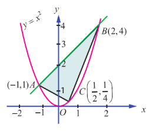
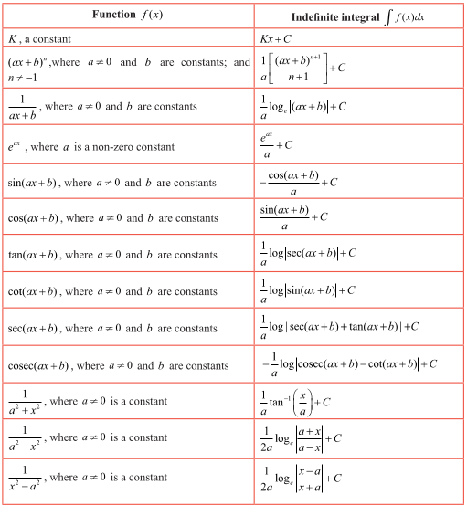
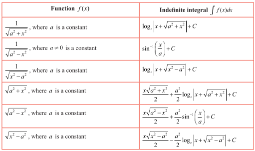

## 9.1. Introduction

One of the earliest mathematicians who made wonderful discoveries to compute the areas and volumes of geometrical objects was Archimedes. Archimedes proved that the area enclosed by a parabola and a straight line is $\frac{4}{3}$ times the area of an inscribed triangle (see Fig. 9.1).

He obtained the area by segmenting it into infinitely many elementary areas and then finding their sum. This limiting concept is inbuilt in the definition of definite integral which we are going to develop here and apply the same in finding areas and volumes of certain geometrical shapes.

## Learning Objectives

Upon completion of this Chapter, students will be able to

- define a definite integral as the limit of a sum
- demonstrate a definite integral geometrically
- use the fundamental theorem of integral calculus
- evaluate definite integrals by evaluating anti-derivatives
- establish some properties of definite integrals
- identify improper integrals and use the gamma integral
- use reduction formulae
- apply definite integral to evaluate area of a plane region
- apply definite integral to evaluate the volume of a solid of revolution

We briefly recall what we have already studied about anti-derivative of a given function $f(x)$. If a function $F(x)$ can be found such that $\frac{d}{dx} F(x) = f(x)$, then the function $F(x)$ is called an anti-derivative of $f(x)$.

It is not unique, because, for any arbitrary constant $C$ , we get

$\frac{d}{dx} [F(x) + C] = \frac{d}{dx} [F(x)] = f(x)$ .

That is, if $F(x)$ is an anti-derivative of $f(x)$ , then the function $F(x) + C$ is also an anti-derivative of the same function $f(x)$ . Note that all anti-derivatives of $f(x)$ differ by a constant only. The anti-derivative of $f(x)$ is usually called the **indefinite integral** of $f(x)$ with respect to $x$ and is denoted by

$\int f(x) dx$ .

A well-known property of indefinite integral is its **linear property**:

$\int [\alpha f(x) + \beta g(x)] dx = \alpha \int f(x) dx + \beta \int g(x) dx$ ,

where $\alpha$ and $\beta$ are constants.

We list below some functions and their anti-derivatives (indefinite integrals):

