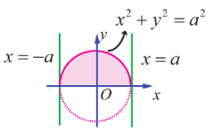
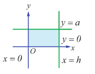
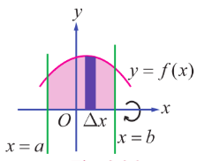
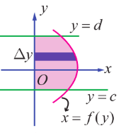

### 9.9 Volume of a solid obtained by revolving area about an axis

Definite integrals have applications in finding volumes of solids of revolution about a fixed axis. By a solid of revolution about a fixed axis, we mean that a solid is generated when a plane region in a given plane undergoes one full revolution about a fixed axis in the plane. For instance, consider the semi circular plane region inside the circle $x^{2} + y^{2} = a^{2}$ and above the $x$-axis. See Fig.9.34.

If this region is given one complete rotation (revolution for $360^{\circ} = 2\pi$ radians) about $x$-axis, then a solid called a sphere is generated.

In the same manner, if you want to generate a right-circular cylinder with radius $a$ and height $h$, you can consider the rectangular plane region bounded between the straight lines $y = 0$, $y = a$, $x = 0$ and $x = h$ in the $xy$-plane. See Fig.9.35. If this region is given one complete rotation (revolution for $360^{\circ} = 2\pi$ radians) about $x$-axis, then a solid called a cylinder is generated.

We restrict ourselves to obtain volume of solid of revolution about $x$-axis or $y$-axis. Whenever solid of revolution about $x$-axis is considered, the plane region that is revolved about $x$-axis lies above the $x$-axis. So, in this region $y \geq 0$. Whenever solid of revolution about $y$-axis is considered, the plane region that is revolved about $y$-axis lies to the right of $y$-axis. So, in this region $x \geq 0$. We shall find the formula for finding the volume of the solid of revolution of the plane region in the first quadrant bounded by the curve $y = f(x)$, $x$-axis and the lines $x = a$ and $x = b > a$ about $x$-axis. The derivation of the formula is based upon the formula that the volume of a cylinder of radius $r$ and the height $h$ is $\pi r^{2}h$.

Assume that every line parallel to $y$-axis lying between the lines $x = a$ and $x = b > a$ cuts the curve $y = f(x)$ in the first quadrant exactly at one point. Divide $[a,b]$ into $n$ segments by $x_{1},x_{2},\ldots,x_{n-1}$ such that

$$
a = x_{0} < x_{1} < x_{2} < \ldots < x_{n-1} < x_{n} = b, \quad x_{i} - x_{i-1} = \Delta x = \frac{b - a}{n}, \quad i = 1,2,\ldots,n.
$$

For each $i = 0,1,2,\ldots,n-1$, the region in the $xy$-plane between the ordinates at $x_{i}$ and $x_{i} + \Delta x$ which lies between the $x$-axis and the curve $y = f(x)$ can be approximated to an infinitesimal rectangle having area $y_{i}\Delta x$, where $y_{i} = f(x_{i})$. When the plane region bounded by the curve $y = f(x)$, $x$-axis, and lines $x = a$ and $x = b$ is rotated by $360^{\circ}$ about $x$-axis, each of the infinitesimal rectangles at $x = x_{i}$ also revolves and generates an elementary solid which is approximately a thin cylindrical disc with radius $y_{i}$ and height $\Delta x$. See Fig.9.36. The volume of the cylindrical disc at $x = x_{i}$ is given by $\pi y_{i}^{2}\Delta x$, $i = 0,1,2,\dots,n-1$. Summing all these elementary volumes, we get the approximate volume of the solid of revolution as $\sum_{i=0}^{n-1}\pi y_{i}^{2}\Delta x$. Let $n$ become larger and larger $(n \rightarrow \infty)$ such that $\Delta x$ becomes smaller and smaller $(\Delta x \rightarrow 0)$. Then $\sum_{i=0}^{n-1}\pi y_{i}^{2}\Delta x$ tends to the volume of the solid of revolution. Hence the volume of the solid of revolution is $\pi \int_{a}^{b}y^{2}dx$.

Similarly, we can find the formula for finding the volume of the solid of revolution of the region bounded by the curve $x = f(y)$, $y$-axis, and the lines $y = c$ and $y = d$ about $y$-axis. The curve $x = f(y)$ lies to the right of $y$-axis between the lines $y = c$ and $y = d > c$. Assume that every line parallel to $x$-axis between $y = c$ and $y = d > c$ cuts the curve $x = f(y)$ in the first quadrant exactly at one point. See Fig.9.37. Then, the volume of the solid of revolution is given by $\pi \int_{c}^{d}x^{2}dy$.

**Example 9.62**

Find the volume of a sphere of radius $a$.

**Solution**

By revolving the upper semicircular region enclosed between the circle $x^{2} + y^{2} = a^{2}$ and the $x$-axis, we get a sphere of radius $a$. See Fig. 9.38.

The boundaries of the region are $y = \sqrt{a^{2} - x^{2}}$, $x$-axis, the lines $x = -a$ and $x = a$. Hence, the volume of the sphere is given by

$$
V = \pi \int_{-a}^{a} y^{2} dx = \pi \int_{-a}^{a} (a^{2} - x^{2}) dx
$$
$$
= 2\pi \int_{0}^{a} (a^{2} - x^{2}) dx, \quad \text{since the integrand } (a^{2} - x^{2}) \text{ is an even function.}
$$
$$
= 2\pi \left[a^{2}x - \frac{x^{3}}{3}\right]_{0}^{a} = 2\pi \left(a^{3} - \frac{a^{3}}{3}\right) = \frac{4}{3}\pi a^{3}.
$$

**Example 9.63**

Find the volume of a right-circular cone of base radius $r$ and height $h$.

**Solution**

Consider the triangular region in the first quadrant which is bounded by the line $y = \frac{r}{h}x$, $x$-axis, the lines $x = 0$ and $x = h$. See Fig.9.39. By revolving the region about the $x$-axis, we get a cone of base radius $r$ and height $h$.

Hence, the volume of the cone is given by

$$
V = \pi \int_{0}^{h} y^{2} dx = \pi \int_{0}^{h} \left(\frac{r}{h}x\right)^{2} dx = \pi \left(\frac{r}{h}\right)^{2} \int_{0}^{h} x^{2} dx = \pi \left(\frac{r}{h}\right)^{2} \left[\frac{x^{3}}{3}\right]_{0}^{h} = \frac{\pi r^{2}h}{3}.
$$

**Example 9.64**

Find the volume of the spherical cap of height $h$ cut off from a sphere of radius $r$.

**Solution**

If the region in the first quadrant bounded by the circle $x^{2} + y^{2} = r^{2}$, the $x$-axis, the lines $x = r - h$ and $x = r$ is revolved about the $x$-axis, then the solid generated is a spherical cap of height $h$ cut off from a sphere of radius $r$. See Fig. 9.40. Hence, the required volume is given by

$$
V = \pi \int_{r-h}^{r} y^{2} dx = \pi \int_{r-h}^{r} (r^{2} - x^{2}) dx = \pi \left[r^{2}x - \frac{x^{3}}{3}\right]_{r-h}^{r}
$$

$$
= \pi \left[r^{2}(r - (r-h)) - \frac{r^{3} - (r-h)^{3}}{3}\right] = \pi \left[r^{2}h - \frac{r^{3} - (r^{3} - 3r^{2}h + 3rh^{2} - h^{3})}{3}\right]
$$
$$
= \pi \left[r^{2}h - \frac{3r^{2}h - 3rh^{2} + h^{3}}{3}\right] = \pi \left(\frac{3r^{2}h - 3r^{2}h + 3rh^{2} - h^{3}}{3}\right) = \frac{1}{3}\pi h^{2}(3r - h).
$$

> **Note**
>
> We can rewrite the above volume in terms of the radius of the cap.
>
> If $\rho$ is the radius of the cap, then $\rho^{2} + (r - h)^{2} = r^{2}$.
>
> Then, we have $r = \frac{\rho^{2} + h^{2}}{2h}$. Eliminating $r$, we get
>
> $ V = \frac{1}{3}\pi h^{2}\left[3\left(\frac{\rho^{2} + h^{2}}{2h}\right) - h\right] = \frac{1}{3}\pi h^{2}\left(\frac{3\rho^{2} + 3h^{2} - 2h^{2}}{2h}\right) = \frac{1}{3}\pi h\left(\frac{3\rho^{2} + h^{2}}{2}\right) = \frac{1}{6}\pi h(3\rho^{2} + h^{2}). $

**Example 9.65**

Find the volume of the solid formed by revolving the region bounded by the parabola $y = x^{2}$, $x$-axis, ordinates $x = 0$ and $x = 1$ about the $x$-axis.

**Solution**

The region to be revolved about the $x$-axis is sketched as in Fig.9.41. Hence, the required volume is given by

$$
V = \pi \int_{0}^{1} y^{2} dx = \pi \int_{0}^{1} (x^{2})^{2} dx = \pi \left[\frac{x^{5}}{5}\right]_{0}^{1} = \frac{\pi}{5}.
$$

**Example 9.66**

Find the volume of the solid formed by revolving the region bounded by the ellipse $\frac{x^{2}}{a^{2}} + \frac{y^{2}}{b^{2}} = 1$, $a > b$ about the major axis.

**Solution**

The ellipse is symmetric about both the axes. The major axis lies along $x$-axis. The region to be revolved is sketched as in Fig.9.42.

Hence, the required volume is given by

$$
V = \pi \int_{-a}^{a} y^{2} dx = \pi \int_{-a}^{a} \frac{b^{2}}{a^{2}}(a^{2} - x^{2}) dx
$$
$$
= \frac{2\pi b^{2}}{a^{2}} \int_{0}^{a} (a^{2} - x^{2}) dx, \quad \text{since the integrand is an even function.}
$$
$$
= \frac{2\pi b^{2}}{a^{2}} \left[a^{2}x - \frac{x^{3}}{3}\right]_{0}^{a} = \frac{2\pi b^{2}}{a^{2}} \left(a^{3} - \frac{a^{3}}{3}\right) = \frac{2\pi b^{2}}{a^{2}} \cdot \frac{2a^{3}}{3} = \frac{4\pi a b^{2}}{3}.
$$

> **Note**
>
> If the region bounded by ellipse $\frac{x^{2}}{a^{2}} + \frac{y^{2}}{b^{2}} = 1$ is revolved about the $y$-axis, then the volume of the solid of revolution is $\frac{4\pi a^{2}b}{3}$. The solid is called an ellipsoid.

**Example 9.67**

Find, by integration, the volume of the solid generated by revolving about $y$-axis the region bounded between the parabola $x = y^{2} + 1$, the $y$-axis, and the lines $y = 1$ and $y = -1$.

**Solution**

The parabola $x = y^{2} + 1$ is $y^{2} = x - 1$. It is symmetrical about $x$-axis and has the vertex at $(1,0)$ and focus at $\left(\frac{5}{4},0\right)$. The region for revolution is shaded in Fig.9.43. Hence, the required volume is given by

$$
V = \pi \int_{-1}^{1} x^{2} dy = \pi \int_{-1}^{1} (y^{2} + 1)^{2} dy
$$
$$
= 2\pi \int_{0}^{1} (y^{4} + 2y^{2} + 1) dy, \quad \text{since the integrand is an even function.}
$$
$$
= 2\pi \left[\frac{y^{5}}{5} + 2\frac{y^{3}}{3} + y\right]_{0}^{1} = 2\pi \left(\frac{1}{5} + \frac{2}{3} + 1\right) = 2\pi \left(\frac{3 + 10 + 15}{15}\right) = \frac{56}{15}\pi.
$$

**Example 9.68**

Find, by integration, the volume of the solid generated by revolving about $y$-axis the region bounded between the curve $y = \frac{3}{4}\sqrt{x^{2} - 16}$, $x \geq 4$, the $y$-axis, and the lines $y = 1$ and $y = 6$.

**Solution**

We note that $y = \frac{3}{4}\sqrt{x^{2} - 16} \Rightarrow \frac{x^{2}}{16} - \frac{y^{2}}{9} = 1$. So, the given curve is a portion of the hyperbola $\frac{x^{2}}{16} - \frac{y^{2}}{9} = 1$ between the lines $y = 1$ and $y = 6$ and it lies above the $x$-axis.

The region to be revolved is sketched in Fig.9.44.

Since revolution is made about $y$-axis, we write the equation of the curve as $x = \frac{4}{3}\sqrt{y^{2} + 9}$.

Hence, the required volume is given by

$$
V = \pi \int_{1}^{6} x^{2} dy = \pi \int_{1}^{6} \frac{16}{9}(y^{2} + 9) dy = \frac{16\pi}{9} \left[\frac{y^{3}}{3} + 9y\right]_{1}^{6}
$$
$$
= \frac{16\pi}{9} \left[\left(\frac{216}{3} + 54\right) - \left(\frac{1}{3} + 9\right)\right] = \frac{16\pi}{9} \left[(72 + 54) - \left(\frac{1}{3} + 9\right)\right] = \frac{16\pi}{9} \left[126 - \frac{28}{3}\right] = \frac{16\pi}{9} \cdot \frac{350}{3} = \frac{5600\pi}{27}.
$$

**EXERCISE 9.9**

1. Find the volume of the solid generated by revolving the region bounded by the parabola $y^{2} = 4ax$ and its latus rectum about the $x$-axis.

2. Find the volume of the solid generated by revolving the region bounded by the parabola $y^{2} = 4ax$ and its latus rectum about the $y$-axis.

3. The region bounded by the curve $y = \sqrt{x}$, the $x$-axis and the line $x = 4$ is revolved about the $x$-axis. Find the volume of the solid generated.

4. Find the volume of the solid generated by revolving the region bounded by the curve $y = \sec x$, the $x$-axis, the lines $x = 0$ and $x = \frac{\pi}{4}$ about the $x$-axis.

5. Find the volume of the solid generated by revolving the region bounded by the curve $y = \log x$, the $x$-axis, the lines $x = 1$ and $x = e$ about the $x$-axis.

6. Find the volume of the solid generated by revolving the region bounded by the curve $y = \sin x$, the $x$-axis, the lines $x = 0$ and $x = \pi$ about the $x$-axis.

7. Find the volume of the solid generated by revolving the region bounded by the curve $y = \cosh x$, the $x$-axis, the lines $x = 0$ and $x = \log 2$ about the $x$-axis.

8. Find the volume of the solid generated by revolving the region bounded by the curve $y = e^{x}$, the $x$-axis, the lines $x = 0$ and $x = 1$ about the $x$-axis.

9. Find the volume of the solid generated by revolving the region bounded by the curve $y = \frac{1}{x}$, the $x$-axis, the lines $x = 1$ and $x = 2$ about the $x$-axis.
 
10. Find the volume of the solid generated by revolving the region bounded by the curve $y = \sqrt{1 - x^{2}}$, the $x$-axis, the lines $x = 0$ and $x = 1$ about the $x$-axis.