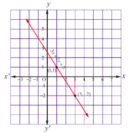

## 1.4 Applications of Matrices: Solving System of Linear Equations

One of the important applications of matrices and determinants is solving of system of linear equations. Systems of linear equations arise as mathematical models of several phenomena occurring in biology, chemistry, commerce, economics, physics and engineering. For instance, analysis of circuit theory, analysis of input- output models, and analysis of chemical reactions require solutions of systems of linear equations.

### 1.4.1 Formation of a System of Linear Equations

The meaning of a system of linear equations can be understood by formulating a mathematical model of a simple practical problem.

Three persons A, B and C go to a supermarket to purchase same brands of rice and sugar. Person A buys 5 Kilograms of rice and 3 Kilograms of sugar and pays 440. Person B purchases 6 Kilograms of rice and 2 Kilograms of sugar and pays 400. Person C purchases 8 Kilograms of rice and 5 Kilograms of sugar and pays 720. Let us formulate a mathematical model to compute the price per Kilogram of rice and the price per Kilogram of sugar. Let \(x\) be the price in rupees per Kilogram of rice and \(y\) be the price in rupees per Kilogram of sugar. Person A buys 5 Kilograms of rice and 3 Kilograms sugar and pays 440. So, \(5x + 3y = 440\) . Similarly, by considering Person B and Person C, we get \(6x + 2y = 400\) and \(8x + 5y = 720\) . Hence the mathematical model is to obtain \(x\) and \(y\) such that

$$
5x + 3y = 440, \quad 6x + 2y = 400, \quad 8x + 5y = 720.
$$

### 1.4.2 System of Linear Equations in Matrix Form

A system of \(m\) linear equations in \(n\) unknowns is of the following form:

$$
\begin{array}{r l}
& a_{11}x_{1} + a_{12}x_{2} + a_{13}x_{3} + \dots + a_{1n}x_{n} = b_{1},\\
& a_{21}x_{1} + a_{22}x_{2} + a_{23}x_{3} + \dots + a_{2n}x_{n} = b_{2},\\
& \dots \dots \dots \dots \dots \dots \dots \dots \dots \dots \dots\\
& a_{m1}x_{1} + a_{m2}x_{2} + a_{m3}x_{3} + \dots + a_{mn}x_{n} = b_{m},
\end{array} \quad (1)
$$

where the coefficients \(a_{ij}, i = 1,2,\dots,m; j = 1,2,\dots,n\) and \(b_{k}, k = 1,2,\dots,m\) are constants. If all the \(b_{k}\)'s are zeros, then the above system is called a homogeneous system of linear equations. On the other hand, if at least one of the \(b_{k}\)'s is non- zero, then the above system is called a non- homogeneous system of linear equations. If there exist values \(\alpha_{1}, \alpha_{2}, \dots, \alpha_{n}\) for \(x_{1}, x_{2}, \dots, x_{n}\) respectively which satisfy every equation of (1), then the ordered \(n\)-tuple \((\alpha_{1}, \alpha_{2}, \dots, \alpha_{n})\) is called a solution of (1).

The above system (1) can be put in a matrix form as follows:

$$
\left[ \begin{array}{cccc}a_{11} & a_{12} & \dots & a_{1n}\\ a_{21} & a_{22} & \dots & a_{2n}\\ \vdots & \vdots & \ddots & \vdots\\ a_{m1} & a_{m2} & \dots & a_{mn} \end{array} \right] \left[ \begin{array}{c}x_{1}\\ x_{2}\\ \vdots\\ x_{n} \end{array} \right] = \left[ \begin{array}{c}b_{1}\\ b_{2}\\ \vdots\\ b_{m} \end{array} \right]
$$

$x_{1},x_{2},x_{3},\dots ,x_{n}$ . The first row of $A$ is formed by the coefficients of $x_{1},x_{2},x_{3},\dots ,x_{n}$ in the same order in which they occur in the first equation. Likewise, the other rows of $A$ are formed. The first column is formed by the coefficients of $x_{i}$ in the $m$ equations in the same order. The other columns are formed in a similar way.

$$
A = \left[ \begin{array}{ccccc}a_{11} & a_{12} & a_{13} & \dots & a_{1n}\\ a_{21} & a_{22} & a_{23} & \dots & a_{2n}\\ \vdots & \vdots & \vdots & \ddots & \vdots\\ a_{m1} & a_{m2} & a_{m3} & \dots & a_{mn} \end{array} \right], X = \left[ \begin{array}{c}x_{1}\\ x_{2}\\ \vdots\\ x_{n} \end{array} \right], B = \left[ \begin{array}{c}b_{1}\\ b_{2}\\ \vdots\\ b_{m} \end{array} \right]
$$

$b_{1},b_{2},b_{3},\dots ,b_{m}.$

1

Then we get

$$
A X = B
$$

Then $A X = B$ is a matrix equation involving matrices and it is called the matrix form of the system of linear equations (1). The matrix $A$ is called the coefficient matrix of the system and the matrix

$$
\left[ \begin{array}{cccc|c}a_{11} & a_{12} & \dots & a_{1n} & b_{1}\\ a_{21} & a_{22} & \dots & a_{2n} & b_{2}\\ \vdots & \vdots & \ddots & \vdots & \vdots\\ a_{m1} & a_{m2} & \dots & a_{mn} & b_{m} \end{array} \right]
$$

augmented matrix by $[A|B]$

As an example, the matrix form of the system of linear equations

$$
3x + 4y - z = 2, 2x - 3y + 4z = 5, x - y + z = 3 \text{ is } \left[ \begin{array}{ccc}3 & 4 & -1\\ 2 & -3 & 4\\ 1 & -1 & 1 \end{array} \right] \left[ \begin{array}{c}x\\ y\\ z \end{array} \right] = \left[ \begin{array}{c}2\\ 5\\ 3 \end{array} \right]
$$

### 1.4.3 Solution to a System of Linear equations

The meaning of solution to a system of linear equations can be understood by considering the following cases:

**Case (i)**

Consider the system of linear equations

$$
2x - y = 5, \quad (1)
$$

$$
x + 3y = 6. \quad (2)
$$

These two equations represent a pair of straight lines in two dimensional analytical geometry (see the Fig. 1.2). Using (1), we get

$$
x = \frac{5 + y}{2}. \quad (3)
$$

Substituting (3) in (2) and simplifying, we get \(y = 1\).

Substituting \(y = 1\) in (1) and simplifying, we get \(x = 3\).

Fig.1.2

Both equations (1) and (2) are satisfied by \(x = 3\) and \(y = 1\).

That is, a solution of (1) is also a solution of (2).

So, we say that the system is consistent and has unique solution \((3,1)\).

The point \((3,1)\) is the point of intersection of the two lines \(2x - y = 5\) and \(x + 3y = 6\).

**Case (ii)**

Consider the system of linear equations

$$
3x + 2y = 5, \quad (1)
$$

$$
6x + 4y = 10. \quad (2)
$$

Using equation (1), we get

$$
x = \frac{5 - 2y}{3}. \quad (3)
$$

Substituting (3) in (2) and simplifying, we get \(0 = 0\).

This informs us that equation (2) is an elementary transformation of equation (1). In fact, by dividing equation (2) by 2, we get equation (1). It is not possible to find uniquely \(x\) and \(y\) with just a single equation (1).

Fig.1.3

So we are forced to assume the value of one unknown, say \(y = t\), where \(t\) is any real number. Then, \(x = \frac{5 - 2t}{3}\). The two equations (1) and (2) represent one and only one straight line (coincident lines) in two dimensional analytical geometry (see Fig. 1.3). In other words, the system is consistent (a solution of (1) is also a solution of (2)) and has infinitely many solutions, as \(t\) can assume any real value.

**Case (iii)**

Consider the system of linear equations

$$
4x + y = 6, \quad (1)
$$

$$
8x + 2y = 18. \quad (2)
$$

Using equation (1), we get

$$
x = \frac{6 - y}{4}. \quad (3)
$$

Substituting (3) in (2) and simplifying, we get \(12 = 18\).

Fig.1.4

This is a contradicting result, which informs us that equation (2) is inconsistent with equation (1). So, a solution of (1) is not a solution of (2).

In other words, the system is inconsistent and has no solution. We note that the two equations represent two parallel straight lines (non- coincident) in two dimensional analytical geometry (see Fig. 1.4). We know that two non- coincident parallel lines never meet in real points.

> **Note**
>
> (1) Interchanging any two equations of a system of linear equations does not alter the solution of the system.
>
> (2) Replacing an equation of a system of linear equations by a non-zero constant multiple of itself does not alter the solution of the system.
>
> (3) Replacing an equation of a system of linear equations by addition of itself with a non-zero multiple of any other equation of the system does not alter the solution of the system.

### 1.4.3 (i) Matrix Inversion Method

This method can be applied only when the coefficient matrix is a square matrix and non- singular.

Consider the matrix equation

$$
AX = B, \quad (1)
$$

where \(A\) is a square matrix and non- singular. Since \(A\) is non- singular, \(A^{-1}\) exists and \(A^{-1}A = AA^{-1} = I\).

Pre- multiplying both sides of (1) by \(A^{-1}\), we get \(A^{-1}(AX) = A^{-1}B\). That is, \((A^{-1}A)X = A^{-1}B\).

Hence, we get \(X = A^{-1}B\).

**Example 1.22**

Solve the following system of linear equations, using matrix inversion method:

$$
5x + 2y = 3, \quad 3x + 2y = 5.
$$

**Solution**

The matrix form of the system is \(AX = B\), where

$$
A = \left[ \begin{array}{ll}
5 & 2 \\
3 & 2
\end{array} \right], \quad
X = \left[ \begin{array}{l}
x \\
y
\end{array} \right], \quad
B = \left[ \begin{array}{l}
3 \\
5
\end{array} \right].
$$

We find

$$
|A| = \left| \begin{array}{ll}
5 & 2 \\
3 & 2
\end{array} \right| = 10 - 6 = 4 \neq 0.
$$

So, \(A^{-1}\) exists and

$$
A^{-1} = \frac{1}{4} \left[ \begin{array}{ll}
2 & -2 \\
-3 & 5
\end{array} \right].
$$

Then, applying the formula \(X = A^{-1}B\), we get

$$
\left[ \begin{array}{l}
x \\
y
\end{array} \right] = \frac{1}{4} \left[ \begin{array}{ll}
2 & -2 \\
-3 & 5
\end{array} \right] \left[ \begin{array}{l}
3 \\
5
\end{array} \right] = \frac{1}{4} \left[ \begin{array}{l}
6 - 10 \\
-9 + 25
\end{array} \right] = \frac{1}{4} \left[ \begin{array}{l}
-4 \\
16
\end{array} \right] = \left[ \begin{array}{l}
-1 \\
4
\end{array} \right].
$$

So the solution is \((x = -1, y = 4)\).

**Example 1.23**

Solve the following system of equations, using matrix inversion method:

$$
2x_{1} + 3x_{2} + 3x_{3} = 5, \quad x_{1} - 2x_{2} + x_{3} = -4, \quad 3x_{1} - x_{2} - 2x_{3} = 3.
$$

**Solution**

The matrix form of the system is \(AX = B\), where

$$
A = \left[ \begin{array}{ccc}
2 & 3 & 3 \\
1 & -2 & 1 \\
3 & -1 & -2
\end{array} \right], \quad
X = \left[ \begin{array}{c}
x_{1} \\
x_{2} \\
x_{3}
\end{array} \right], \quad
B = \left[ \begin{array}{c}
5 \\
-4 \\
3
\end{array} \right].
$$

We find

$$
|A| = \left| \begin{array}{ccc}
2 & 3 & 3 \\
1 & -2 & 1 \\
3 & -1 & -2
\end{array} \right| = 2(4 + 1) - 3(-2 - 3) + 3(-1 + 6) = 10 + 15 + 15 = 40 \neq 0.
$$

So, \(A^{-1}\) exists and

$$
A^{-1} = \frac{1}{|A|}(\text{adj } A) = \frac{1}{40} \left[ \begin{array}{ccc}
+(4+1) & -(-2-3) & +(-1+6) \\
-(-6+3) & +(-4-9) & -(-2-9) \\
+(3+6) & -(2-3) & +(-4-3)
\end{array} \right] = \frac{1}{40} \left[ \begin{array}{ccc}
5 & 3 & 9 \\
5 & -13 & 1 \\
5 & 11 & -7
\end{array} \right].
$$

Then, applying \(X = A^{-1}B\), we get

$$
\left[ \begin{array}{c}
x_{1} \\
x_{2} \\
x_{3}
\end{array} \right] = \frac{1}{40} \left[ \begin{array}{ccc}
5 & 3 & 9 \\
5 & -13 & 1 \\
5 & 11 & -7
\end{array} \right] \left[ \begin{array}{c}
5 \\
-4 \\
3
\end{array} \right] = \frac{1}{40} \left[ \begin{array}{c}
25 - 12 + 27 \\
25 + 52 + 3 \\
25 - 44 - 21
\end{array} \right] = \frac{1}{40} \left[ \begin{array}{c}
40 \\
80 \\
-40
\end{array} \right] = \left[ \begin{array}{c}
1 \\
2 \\
-1
\end{array} \right].
$$

So, the solution is \((x_{1} = 1, x_{2} = 2, x_{3} = -1)\).

**Example 1.24**

If

$$
A = \left[ \begin{array}{ccc}
-4 & 4 & 4 \\
-7 & 1 & 3 \\
5 & -3 & -1
\end{array} \right]
$$

and

$$
B = \left[ \begin{array}{ccc}
1 & -1 & 1 \\
1 & -2 & -2 \\
2 & 1 & 3
\end{array} \right],
$$

find the products \(AB\) and \(BA\) and hence solve the system of equations

$$
x - y + z = 4, \quad x - 2y - 2z = 9, \quad 2x + y + 3z = 1.
$$

**Solution**

$$
AB = \left[ \begin{array}{ccc}
-4 & 4 & 4 \\
-7 & 1 & 3 \\
5 & -3 & -1
\end{array} \right] \left[ \begin{array}{ccc}
1 & -1 & 1 \\
1 & -2 & -2 \\
2 & 1 & 3
\end{array} \right] = \left[ \begin{array}{ccc}
-4 + 4 + 8 & 4 - 8 + 4 & -4 - 8 + 12 \\
-7 + 1 + 6 & 7 - 2 + 3 & -7 - 2 + 9 \\
5 - 3 - 2 & -5 + 6 - 1 & 5 + 6 - 3
\end{array} \right] = \left[ \begin{array}{ccc}
8 & 0 & 0 \\
0 & 8 & 0 \\
0 & 0 & 8
\end{array} \right] = 8I_{3}.
$$

and

$$
BA = \left[ \begin{array}{ccc}
1 & -1 & 1 \\
1 & -2 & -2 \\
2 & 1 & 3
\end{array} \right] \left[ \begin{array}{ccc}
-4 & 4 & 4 \\
-7 & 1 & 3 \\
5 & -3 & -1
\end{array} \right] = \left[ \begin{array}{ccc}
-4 + 7 + 5 & 4 - 1 - 3 & 4 - 3 - 1 \\
-4 + 14 - 10 & 4 - 2 + 6 & 4 - 6 + 2 \\
-8 - 7 + 15 & 8 + 1 - 9 & 8 + 3 - 3
\end{array} \right] = \left[ \begin{array}{ccc}
8 & 0 & 0 \\
0 & 8 & 0 \\
0 & 0 & 8
\end{array} \right] = 8I_{3}.
$$

So, we get \(AB = BA = 8I_{3}\). That is,

$$
\left( \frac{1}{8} A \right) B = B \left( \frac{1}{8} A \right) = I_{3}.
$$

Hence, \(B^{-1} = \frac{1}{8} A\).

Writing the given system of equations in matrix form, we get

$$
\left[ \begin{array}{ccc}
1 & -1 & 1 \\
1 & -2 & -2 \\
2 & 1 & 3
\end{array} \right] \left[ \begin{array}{c}
x \\
y \\
z
\end{array} \right] = \left[ \begin{array}{c}
4 \\
9 \\
1
\end{array} \right].
$$

That is,

$$
B \left[ \begin{array}{c}
x \\
y \\
z
\end{array} \right] = \left[ \begin{array}{c}
4 \\
9 \\
1
\end{array} \right].
$$

So,

$$
\left[ \begin{array}{c}
x \\
y \\
z
\end{array} \right] = B^{-1} \left[ \begin{array}{c}
4 \\
9 \\
1
\end{array} \right] = \left( \frac{1}{8} A \right) \left[ \begin{array}{c}
4 \\
9 \\
1
\end{array} \right] = \frac{1}{8} \left[ \begin{array}{ccc}
-4 & 4 & 4 \\
-7 & 1 & 3 \\
5 & -3 & -1
\end{array} \right] \left[ \begin{array}{c}
4 \\
9 \\
1
\end{array} \right] = \frac{1}{8} \left[ \begin{array}{c}
-16 + 36 + 4 \\
-28 + 9 + 3 \\
20 - 27 - 1
\end{array} \right] = \frac{1}{8} \left[ \begin{array}{c}
24 \\
-16 \\
-8
\end{array} \right] = \left[ \begin{array}{c}
3 \\
-2 \\
-1
\end{array} \right].
$$

Hence, the solution is \((x = 3, y = -2, z = -1)\).

**Exercise 1.3**

1. Solve the following system of linear equations by matrix inversion method:

(i) \(2x + 5y = -2, \quad x + 2y = -3\)

(ii) \(2x - y = 8, \quad 3x + 2y = -2\)

(iii) \(2x + 3y - z = 9, \quad x + y + z = 9, \quad 3x - y - z = -1\)

(iv) \(x + y + z - 2 = 0, \quad 6x - 4y + 5z - 31 = 0, \quad 5x + 2y + 2z = 13\)

2. If

$$
A = \left[ \begin{array}{ccc}
-2 & 1 & 3 \\
0 & 1 & -2 \\
1 & 2 & -1
\end{array} \right],
$$

find \(A^{-1}\) and hence solve the system of equations

$$
x + y + 2z = 1, \quad 3x + 2y + z = 7, \quad 2x + y + 3z = 2.
$$

3. A man is appointed in a job with a monthly salary of certain amount and a fixed amount of annual increment. If his salary was ₹ 19,800 per month at the end of the first month after 3 years of service and ₹ 23,400 per month at the end of the first month after 9 years of service, find his starting salary and his annual increment. (Use matrix inversion method to solve the problem.)

4. Four men and 4 women can finish a piece of work jointly in 3 days while 2 men and 5 women can finish the same work jointly in 4 days. Find the time taken by one man alone and that of one woman alone to finish the same work by using matrix inversion method.

5. The prices of three commodities \(A, B\) and \(C\) are ₹ \(x, y\) and \(z\) per units respectively. A person \(P\) purchases 4 units of \(B\) and sells two units of \(A\) and 5 units of \(C\). Person \(Q\) purchases 2 units of \(C\) and sells 3 units of \(A\) and one unit of \(B\). Person \(R\) purchases one unit of \(A\) and sells 3 unit of \(B\) and one unit of \(C\). In the process, \(P, Q\) and \(R\) earn ₹ 15,000, ₹ 1,000 and ₹ 4,000 respectively. Find the prices per unit of \(A, B\) and \(C\). (Use matrix inversion method to solve the problem.)

### 1.4.3 (ii) Cramer's Rule

This rule can be applied only when the coefficient matrix is a square matrix and non- singular. It is explained by considering the following system of equations:

$$
a_{11}x_{1} + a_{12}x_{2} + a_{13}x_{3} = b_{1},
$$

$$
a_{21}x_{1} + a_{22}x_{2} + a_{23}x_{3} = b_{2},
$$

$$
a_{31}x_{1} + a_{32}x_{2} + a_{33}x_{3} = b_{3},
$$

where the coefficient matrix

$$
\left[ \begin{array}{lll}
a_{11} & a_{12} & a_{13} \\
a_{21} & a_{22} & a_{23} \\
a_{31} & a_{32} & a_{33}
\end{array} \right]
$$

is non- singular. Then

$$
\left[ \begin{array}{lll}
a_{11} & a_{12} & a_{13} \\
a_{21} & a_{22} & a_{23} \\
a_{31} & a_{32} & a_{33}
\end{array} \right] \neq 0.
$$

Let us put

$$
\Delta = \left| \begin{array}{lll}
a_{11} & a_{12} & a_{13} \\
a_{21} & a_{22} & a_{23} \\
a_{31} & a_{32} & a_{33}
\end{array} \right|.
$$

Then, we have

$$
x_{1}\Delta = x_{1} \left| \begin{array}{lll}
a_{11} & a_{12} & a_{13} \\
a_{21} & a_{22} & a_{23} \\
a_{31} & a_{32} & a_{33}
\end{array} \right| = \left| \begin{array}{lll}
a_{11}x_{1} & a_{12} & a_{13} \\
a_{21}x_{1} & a_{22} & a_{23} \\
a_{31}x_{1} & a_{32} & a_{33}
\end{array} \right| = \left| \begin{array}{lll}
a_{11}x_{1} + a_{12}x_{2} + a_{13}x_{3} & a_{12} & a_{13} \\
a_{21}x_{1} + a_{22}x_{2} + a_{23}x_{3} & a_{22} & a_{23} \\
a_{31}x_{1} + a_{32}x_{2} + a_{33}x_{3} & a_{32} & a_{33}
\end{array} \right| = \left| \begin{array}{lll}
b_{1} & a_{12} & a_{13} \\
b_{2} & a_{22} & a_{23} \\
b_{3} & a_{32} & a_{33}
\end{array} \right| = \Delta_{1}.
$$

Similarly,

$$
x_{2}\Delta = \left| \begin{array}{lll}
a_{11} & b_{1} & a_{13} \\
a_{21} & b_{2} & a_{23} \\
a_{31} & b_{3} & a_{33}
\end{array} \right| = \Delta_{2},
$$

$$
x_{3}\Delta = \left| \begin{array}{lll}
a_{11} & a_{12} & b_{1} \\
a_{21} & a_{22} & b_{2} \\
a_{31} & a_{32} & b_{3}
\end{array} \right| = \Delta_{3}.
$$

Thus, we have the Cramer's rule

$$
x_{1} = \frac{\Delta_{1}}{\Delta}, \quad x_{2} = \frac{\Delta_{2}}{\Delta}, \quad x_{3} = \frac{\Delta_{3}}{\Delta},
$$

where

$$
\Delta_{1} = \left| \begin{array}{lll}
b_{1} & a_{12} & a_{13} \\
b_{2} & a_{22} & a_{23} \\
b_{3} & a_{32} & a_{33}
\end{array} \right|, \quad
\Delta_{2} = \left| \begin{array}{lll}
a_{11} & b_{1} & a_{13} \\
a_{21} & b_{2} & a_{23} \\
a_{31} & b_{3} & a_{33}
\end{array} \right|, \quad
\Delta_{3} = \left| \begin{array}{lll}
a_{11} & a_{12} & b_{1} \\
a_{21} & a_{22} & b_{2} \\
a_{31} & a_{32} & b_{3}
\end{array} \right|.
$$

> **Note**
>
> Replacing the first column elements \(a_{11}, a_{21}, a_{31}\) of \(\Delta\) with \(b_{1}, b_{2}, b_{3}\) respectively, we get \(\Delta_{1}\).
>
> Replacing the second column elements \(a_{12}, a_{22}, a_{32}\) of \(\Delta\) with \(b_{1}, b_{2}, b_{3}\) respectively, we get \(\Delta_{2}\).
>
> Replacing the third column elements \(a_{13}, a_{23}, a_{33}\) of \(\Delta\) with \(b_{1}, b_{2}, b_{3}\) respectively, we get \(\Delta_{3}\).
>
> If \(\Delta = 0\), Cramer's rule cannot be applied.

**Example 1.25**

Solve, by Cramer's rule, the system of equations

$$
x_{1} - x_{2} = 3, \quad 2x_{1} + 3x_{2} + 4x_{3} = 17, \quad x_{2} + 2x_{3} = 7.
$$

**Solution**

First we evaluate the determinants

$$
\Delta = \left| \begin{array}{ccc}
1 & -1 & 0 \\
2 & 3 & 4 \\
0 & 1 & 2
\end{array} \right| = 1(6-4) + 1(4-0) + 0 = 2 + 4 = 6,
$$

$$
\Delta_{1} = \left| \begin{array}{ccc}
3 & -1 & 0 \\
17 & 3 & 4 \\
7 & 1 & 2
\end{array} \right| = 3(6-4) + 1(34-28) + 0 = 6 + 6 = 12,
$$

$$
\Delta_{2} = \left| \begin{array}{ccc}
1 & 3 & 0 \\
2 & 17 & 4 \\
0 & 7 & 2
\end{array} \right| = 1(34-28) - 3(4-0) + 0 = 6 - 12 = -6,
$$

$$
\Delta_{3} = \left| \begin{array}{ccc}
1 & -1 & 3 \\
2 & 3 & 17 \\
0 & 1 & 7
\end{array} \right| = 1(21-17) + 1(14-0) + 3(2-0) = 4 + 14 + 6 = 24.
$$

By Cramer's rule, we get

$$
x_{1} = \frac{\Delta_{1}}{\Delta} = \frac{12}{6} = 2, \quad x_{2} = \frac{\Delta_{2}}{\Delta} = \frac{-6}{6} = -1, \quad x_{3} = \frac{\Delta_{3}}{\Delta} = \frac{24}{6} = 4.
$$

So, the solution is \((x_{1} = 2, x_{2} = -1, x_{3} = 4)\).

**Example 1.26**

In a T20 match, a team needed just 6 runs to win with 1 ball left to go in the last over. The last ball was bowled and the batsman at the crease hit it high up. The ball traversed along a path in a vertical plane and the equation of the path is \(y = ax^{2} + bx + c\) with respect to a \(xy\)-coordinate system in the vertical plane and the ball traversed through the points \((10,8), (20,16), (40,22)\), can you conclude that the team won the match? Justify your answer. (All distances are measured in metres and the meeting point of the plane of the path with the farthest boundary line is \((70,0)\).)

**Solution**

The path \(y = ax^{2} + bx + c\) passes through the points \((10,8), (20,16), (40,22)\). So, we get the system of equations

$$
100a + 10b + c = 8, \quad 400a + 20b + c = 16, \quad 1600a + 40b + c = 22.
$$

To apply Cramer's rule, we find

$$
\Delta = \left| \begin{array}{ccc}
100 & 10 & 1 \\
400 & 20 & 1 \\
1600 & 40 & 1
\end{array} \right| = 1000 \left| \begin{array}{ccc}
1 & 1 & 1 \\
4 & 2 & 1 \\
16 & 4 & 1
\end{array} \right| = 1000[-2 + 12 - 16] = -6000,
$$

$$
\Delta_{1} = \left| \begin{array}{ccc}
8 & 10 & 1 \\
16 & 20 & 1 \\
22 & 40 & 1
\end{array} \right| = 20 \left| \begin{array}{ccc}
4 & 1 & 1 \\
8 & 2 & 1 \\
11 & 4 & 1
\end{array} \right| = 20[-8 + 3 + 10] = 100,
$$

$$
\Delta_{2} = \left| \begin{array}{ccc}
100 & 8 & 1 \\
400 & 16 & 1 \\
1600 & 22 & 1
\end{array} \right| = 200 \left| \begin{array}{ccc}
1 & 4 & 1 \\
4 & 8 & 1 \\
16 & 11 & 1
\end{array} \right| = 200[-3 + 48 - 84] = -7800,
$$

$$
\Delta_{3} = \left| \begin{array}{ccc}
100 & 10 & 8 \\
400 & 20 & 16 \\
1600 & 40 & 22
\end{array} \right| = 2000 \left| \begin{array}{ccc}
1 & 1 & 4 \\
4 & 2 & 8 \\
16 & 4 & 11
\end{array} \right| = 2000[-10 + 84 - 64] = 20000.
$$

By Cramer's rule, we get

$$
a = \frac{\Delta_{1}}{\Delta} = \frac{100}{-6000} = -\frac{1}{60},
$$

$$
b = \frac{\Delta_{2}}{\Delta} = \frac{-7800}{-6000} = \frac{78}{60} = \frac{13}{10},
$$

$$
c = \frac{\Delta_{3}}{\Delta} = \frac{20000}{-6000} = -\frac{20}{6} = -\frac{10}{3}.
$$

So, the equation of the path is

$$
y = -\frac{1}{60}x^{2} + \frac{13}{10}x - \frac{10}{3}.
$$

When \(x = 70\), we get

$$
y = -\frac{1}{60}(70)^{2} + \frac{13}{10}(70) - \frac{10}{3} = -\frac{4900}{60} + \frac{910}{10} - \frac{10}{3} = -\frac{245}{3} + 91 - \frac{10}{3} = -\frac{255}{3} + 91 = -85 + 91 = 6.
$$

So, the ball went by 6 metres high over the boundary line and it is impossible for a fielder standing even just before the boundary line to jump and catch the ball. Hence the ball went for a super six and the team won the match.

**Exercise 1.4**

1. Solve the following systems of linear equations by Cramer's rule:

(i) \(5x - 2y + 16 = 0, \quad x + 3y - 7 = 0\)

(ii) \(\frac{3}{x} + 2y = 12, \quad \frac{2}{x} + 3y = 13\)

(iii) \(3x + 3y - z = 11, \quad 2x - y + 2z = 9, \quad 4x + 3y + 2z = 25\)

(iv) \(\frac{3}{x} - \frac{4}{y} - \frac{2}{z} - 1 = 0, \quad \frac{1}{x} + \frac{2}{y} + \frac{1}{z} - 2 = 0, \quad \frac{2}{x} - \frac{5}{y} - \frac{4}{z} + 1 = 0\)

2. In a competitive examination, one mark is awarded for every correct answer while \(\frac{1}{4}\) mark is deducted for every wrong answer. A student answered 100 questions and got 80 marks. How many questions did he answer correctly? (Use Cramer's rule to solve the problem).

3. A chemist has one solution which is \(50\%\) acid and another solution which is \(25\%\) acid. How much each should be mixed to make 10 litres of a \(40\%\) acid solution? (Use Cramer's rule to solve the problem).

4. A fish tank can be filled in 10 minutes using both pumps A and B simultaneously. However, pump B can pump water in or out at the same rate. If pump B is inadvertently run in reverse, then the tank will be filled in 30 minutes. How long would it take each pump to fill the tank by itself? (Use Cramer's rule to solve the problem).

5. A family of 3 people went out for dinner in a restaurant. The cost of two dosai, three idlies and two vadais is ₹ 150. The cost of the two dosai, two idlies and four vadais is ₹ 200. The cost of five dosai, four idlies and two vadais is ₹ 250. The family has ₹ 350 in hand and they ate 3 dosai and six idlies and six vadais. Will they be able to manage to pay the bill within the amount they had?

### 1.4.3 (iii) Gaussian Elimination Method

This method can be applied even if the coefficient matrix is singular matrix and rectangular matrix. It is essentially the method of substitution which we have already seen. In this method, we transform the augmented matrix of the system of linear equations into row- echelon form and then by back- substitution, we get the solution.

**Example 1.27**

Solve the following system of linear equations, by Gaussian elimination method:

$$
4x + 3y + 6z = 25, \quad x + 5y + 7z = 13, \quad 2x + 9y + z = 1.
$$

**Solution**

Transforming the augmented matrix to echelon form, we get

$$
[A|B] = \left[ \begin{array}{ccc|c}
4 & 3 & 6 & 25 \\
1 & 5 & 7 & 13 \\
2 & 9 & 1 & 1
\end{array} \right] \xrightarrow{R_{1} \leftrightarrow R_{2}} \left[ \begin{array}{ccc|c}
1 & 5 & 7 & 13 \\
4 & 3 & 6 & 25 \\
2 & 9 & 1 & 1
\end{array} \right]
$$

$$
\xrightarrow{R_{2} \to R_{2} - 4R_{1}} \left[ \begin{array}{ccc|c}
1 & 5 & 7 & 13 \\
0 & -17 & -22 & -27 \\
2 & 9 & 1 & 1
\end{array} \right] \xrightarrow{R_{3} \to R_{3} - 2R_{1}} \left[ \begin{array}{ccc|c}
1 & 5 & 7 & 13 \\
0 & -17 & -22 & -27 \\
0 & -1 & -13 & -25
\end{array} \right]
$$

$$
\xrightarrow{R_{2} \leftrightarrow R_{3}} \left[ \begin{array}{ccc|c}
1 & 5 & 7 & 13 \\
0 & -1 & -13 & -25 \\
0 & -17 & -22 & -27
\end{array} \right] \xrightarrow{R_{2} \to -R_{2}} \left[ \begin{array}{ccc|c}
1 & 5 & 7 & 13 \\
0 & 1 & 13 & 25 \\
0 & -17 & -22 & -27
\end{array} \right]
$$

$$
\xrightarrow{R_{3} \to R_{3} + 17R_{2}} \left[ \begin{array}{ccc|c}
1 & 5 & 7 & 13 \\
0 & 1 & 13 & 25 \\
0 & 0 & 199 & 398
\end{array} \right].
$$

The equivalent system is written by using the echelon form:

$$
x + 5y + 7z = 13, \quad (1)
$$

$$
y + 13z = 25, \quad (2)
$$

$$
199z = 398. \quad (3)
$$

From (3), we get

$$
z = \frac{398}{199} = 2.
$$

Substituting \(z = 2\) in (2), we get

$$
y = 25 - 13 \times 2 = -1.
$$

Substituting \(z = 2, y = -1\) in (1), we get

$$
x = 13 - 5 \times (-1) - 7 \times 2 = 4.
$$

So, the solution is \((x = 4, y = -1, z = 2)\).

> **Note**
>
> The above method of going from the last equation to the first equation is called the method of back substitution.

**Example 1.28**

The upward speed \(v(t)\) of a rocket at time \(t\) is approximated by \(v(t) = at^{2} + bt + c\), \(0 \leq t \leq 100\) where \(a, b\), and \(c\) are constants. It has been found that the speed at times \(t = 3, t = 6\), and \(t = 9\) seconds are respectively, 64, 133, and 208 miles per second respectively. Find the speed at time \(t = 15\) seconds. (Use Gaussian elimination method.)

**Solution**

Since \(v(3) = 64\), \(v(6) = 133\), and \(v(9) = 208\), we get the following system of linear equations

$$
9a + 3b + c = 64,
$$

$$
36a + 6b + c = 133,
$$

$$
81a + 9b + c = 208.
$$

We solve the above system of linear equations by Gaussian elimination method.

Reducing the augmented matrix to an equivalent row- echelon form by using elementary row operations, we get

$$
[A|B] = \left[ \begin{array}{ccc|c}
9 & 3 & 1 & 64 \\
36 & 6 & 1 & 133 \\
81 & 9 & 1 & 208
\end{array} \right] \xrightarrow{R_{2} \to R_{2} - 4R_{1}} \left[ \begin{array}{ccc|c}
9 & 3 & 1 & 64 \\
0 & -6 & -3 & -123 \\
81 & 9 & 1 & 208
\end{array} \right]
$$

$$
\xrightarrow{R_{3} \to R_{3} - 9R_{1}} \left[ \begin{array}{ccc|c}
9 & 3 & 1 & 64 \\
0 & -6 & -3 & -123 \\
0 & -18 & -8 & -368
\end{array} \right] \xrightarrow{R_{2} \to -\frac{1}{6}R_{2}} \left[ \begin{array}{ccc|c}
9 & 3 & 1 & 64 \\
0 & 1 & \frac{1}{2} & \frac{41}{2} \\
0 & -18 & -8 & -368
\end{array} \right]
$$

$$
\xrightarrow{R_{3} \to R_{3} + 18R_{2}} \left[ \begin{array}{ccc|c}
9 & 3 & 1 & 64 \\
0 & 1 & \frac{1}{2} & \frac{41}{2} \\
0 & 0 & 1 & 1
\end{array} \right].
$$

Writing the equivalent equations from the row- echelon matrix, we get

$$
9a + 3b + c = 64, \quad b + \frac{1}{2}c = \frac{41}{2}, \quad c = 1.
$$

By back substitution, we get \(c = 1\),

$$
b = \frac{41 - c}{2} = \frac{41 - 1}{2} = 20,
$$

$$
a = \frac{64 - 3b - c}{9} = \frac{64 - 60 - 1}{9} = \frac{1}{3}.
$$

So, we get

$$
v(t) = \frac{1}{3}t^{2} + 20t + 1.
$$

Hence,

$$
v(15) = \frac{1}{3}(225) + 20(15) + 1 = 75 + 300 + 1 = 376.
$$

**Exercise 1.5**

1. Solve the following systems of linear equations by Gaussian elimination method:

(i) \(2x - 2y + 3z = 2, \quad x + 2y - z = 3, \quad 3x - y + 2z = 1\)

(ii) \(2x + 4y + 6z = 22, \quad 3x + 8y + 5z = 27, \quad -x + y + 2z = 2\)

2. If \(ax^{2} + bx + c\) is divided by \(x + 3, x - 5\), and \(x - 1\), the remainders are 21, 61 and 9 respectively. Find \(a, b\) and \(c\). (Use Gaussian elimination method.)

3. An amount of ₹ 65,000 is invested in three bonds at the rates of \(6\%\), \(8\%\) and \(9\%\) per annum respectively. The total annual income is ₹ 4,800. The income from the third bond is ₹ 600 more than that from the second bond. Determine the price of each bond. (Use Gaussian elimination method.)

4. A boy is walking along the path \(y = ax^{2} + bx + c\) through the points \((-6,8), (-2, -12)\), and \((3,8)\). He wants to meet his friend at \(P(7,60)\). Will he meet his friend? (Use Gaussian elimination method.)

