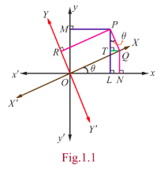

## 1.2 Inverse of a Non- Singular Square Matrix

We recall that a square matrix is called a non- singular matrix if its determinant is not equal to zero and a square matrix is called singular if its determinant is zero. We have already learnt about multiplication of a matrix by a scalar, addition of two matrices, and multiplication of two matrices. But a rule could not be formulated to perform division of a matrix by another matrix since a matrix is just an arrangement of numbers and has no numerical value. When we say that, a matrix $A$ is of order $n$ , we mean that $A$ is a square matrix having $n$ rows and $n$ columns.

In the case of a real number $x\neq 0$ , there exists a real number $\frac{1}{x}$ , say $y$ , called the inverse (or reciprocal) of $x$ such that $xy = yx = 1$ . In the same line of thinking, when a matrix $A$ is given, we search for a matrix $B$ such that the products $AB$ and $BA$ can be found and $AB = BA = I$ , where $I$ is a unit matrix.

In this section, we define the inverse of a non- singular square matrix and prove that a non- singular square matrix has a unique inverse. We will also study some of the properties of inverse matrix. For all these activities, we need a matrix called the adjoint of a square matrix.

### 1.2.1 Adjoint of a Square Matrix

We recall the properties of the cofactors of the elements of a square matrix. Let $A$ be a square matrix of by order $n$ whose determinant is denoted $|A|$ or $\operatorname{det}(A)$ . Let $a_{ij}$ be the element sitting at the intersection of the $i^{\mathrm{th}}$ row and $j^{\mathrm{th}}$ column of $A$ . Deleting the $i^{\mathrm{th}}$ row and $j^{\mathrm{th}}$ column of $A$ , we obtain a sub- matrix of order $(n - 1)$ . The determinant of this sub- matrix is called minor of the element $a_{ij}$ . It is denoted by $M_{ij}$ . The product of $M_{ij}$ and $(- 1)^{i + j}$ is called cofactor of the element $a_{ij}$ . It is denoted by $A_{ij}$ . Thus the cofactor of $a_{ij}$ is $A_{ij} = (- 1)^{i + j}M_{ij}$ .

An important property connecting the elements of a square matrix and their cofactors is that the sum of the products of the entries (elements) of a row and the corresponding cofactors of the elements of the same row is equal to the determinant of the matrix; and the sum of the products of the entries (elements) of a row and the corresponding cofactors of the elements of any other row is equal to 0. That is,

$$
\begin{array}{lll}
a_{i1}A_{j1} + a_{i2}A_{j2} + \dots + a_{in}A_{jn} = |A| & \text{if} & i = j, \\
a_{i1}A_{j1} + a_{i2}A_{j2} + \dots + a_{in}A_{jn} = 0 & \text{if} & i \neq j,
\end{array}
$$

where $|A|$ denotes the determinant of the square matrix $A$ . Here $|A|$ is read as "determinant of $A$ " and not as "modulus of $A$ ". Note that $|A|$ is just a real number and it can also be negative. For instance, we have

$$
\left| \begin{array}{lll}2 & 1 & 1 \\ 1 & 1 & 1 \\ 2 & 2 & 1 \end{array} \right| = 2(1 - 2) - 1(1 - 2) + 1(2 - 2) = - 2 + 1 + 0 = - 1.
$$

**Definition 1.1**

Let $A$ be a square matrix of order $n$ . Then the matrix of cofactors of $A$ is defined as the matrix obtained by replacing each element $a_{ij}$ of $A$ with the corresponding cofactor $A_{ij}$ . The adjoint matrix of $A$ is defined as the transpose of the matrix of cofactors of $A$ . It is denoted by adj $A$ .

> **Note**
>
> adj $A$ is a square matrix of order $n$ and
>
> $$
> \text{adj } A = [A_{ij}]^T = [(-1)^{i+j}M_{ij}]^T.
> $$

In particular, adj $A$ of a square matrix of order 3 is given below:

$$
\text{adj } A = \left[ \begin{array}{lll}
A_{11} & A_{21} & A_{31} \\
A_{12} & A_{22} & A_{32} \\
A_{13} & A_{23} & A_{33}
\end{array} \right].
$$

**Theorem 1.1**

For every square matrix $A$ of order $n$, $A(\text{adj } A) = (\text{adj } A)A = |A|I_n$.

**Proof**

For simplicity, we prove the theorem for $n = 3$ only.

Consider

$$
A = \left[ \begin{array}{lll}
a_{11} & a_{12} & a_{13}\\
a_{21} & a_{22} & a_{23}\\
a_{31} & a_{32} & a_{33}
\end{array} \right].
$$

Then, we get

$$
\begin{array}{r l}
& a_{11}A_{11} + a_{12}A_{12} + a_{13}A_{13} = |A|, \quad a_{11}A_{21} + a_{12}A_{22} + a_{13}A_{23} = 0, \quad a_{11}A_{31} + a_{12}A_{32} + a_{13}A_{33} = 0;\\
& a_{21}A_{11} + a_{22}A_{12} + a_{23}A_{13} = 0, \quad a_{21}A_{21} + a_{22}A_{22} + a_{23}A_{23} = |A|, \quad a_{21}A_{31} + a_{22}A_{32} + a_{23}A_{33} = 0;\\
& a_{31}A_{11} + a_{32}A_{12} + a_{33}A_{13} = 0, \quad a_{31}A_{21} + a_{32}A_{22} + a_{33}A_{23} = 0, \quad a_{31}A_{31} + a_{32}A_{32} + a_{33}A_{33} = |A|.
\end{array} \quad (1)
$$

By using the above equations, we get

$$
A(\text{adj } A) = \left[ \begin{array}{lll}
a_{11} & a_{12} & a_{13} \\
a_{21} & a_{22} & a_{23} \\
a_{31} & a_{32} & a_{33}
\end{array} \right]
\left[ \begin{array}{lll}
A_{11} & A_{21} & A_{31} \\
A_{12} & A_{22} & A_{32} \\
A_{13} & A_{23} & A_{33}
\end{array} \right]
= \left[ \begin{array}{lll}
|A| & 0 & 0 \\
0 & |A| & 0 \\
0 & 0 & |A|
\end{array} \right]
= |A| I_3,
$$

and

$$
(\text{adj } A)A = \left[ \begin{array}{lll}
A_{11} & A_{21} & A_{31} \\
A_{12} & A_{22} & A_{32} \\
A_{13} & A_{23} & A_{33}
\end{array} \right]
\left[ \begin{array}{lll}
a_{11} & a_{12} & a_{13} \\
a_{21} & a_{22} & a_{23} \\
a_{31} & a_{32} & a_{33}
\end{array} \right]
= \left[ \begin{array}{lll}
|A| & 0 & 0 \\
0 & |A| & 0 \\
0 & 0 & |A|
\end{array} \right]
= |A| I_3,
$$

where $I_3$ is the identity matrix of order 3.

So, by equations (1) and (2), we get $A(\text{adj } A) = (\text{adj } A)A = |A|I_3$.

^^
> **Note**
>
> If $A$ is a singular matrix of order $n$, then $|A| = 0$ and so $A(\text{adj } A) = (\text{adj } A)A = O_n$, where $O_n$ denotes zero matrix of order $n$.

**Example 1.1**

If

$$
A = \left[ \begin{array}{ccc}
6 & 7 & -4 \\
-3 & 2 & 1 \\
2 & -4 & 3
\end{array} \right],
$$

verify that $A(\text{adj } A) = (\text{adj } A)A = |A|I_3$.

**Solution**

By the definition of adjoint, we get

$$
\text{adj } A = \left[ \begin{array}{lll}
(6-(-4)) & -(9-(-8)) & ((-12)-(-8)) \\
-(3-(-4)) & (18-(-8)) & -((-12)-(-6)) \\
(3-(-4)) & -(6-(-6)) & (12-(-6))
\end{array} \right]^T
= \left[ \begin{array}{lll}
10 & -17 & -4 \\
-7 & 26 & 6 \\
7 & -12 & 18
\end{array} \right]^T
= \left[ \begin{array}{lll}
10 & -7 & 7 \\
-17 & 26 & -12 \\
-4 & 6 & 18
\end{array} \right].
$$

So, we get

$$
A(\text{adj } A) = \left[ \begin{array}{ccc}
6 & 7 & -4 \\
-3 & 2 & 1 \\
2 & -4 & 3
\end{array} \right]
\left[ \begin{array}{ccc}
10 & -7 & 7 \\
-17 & 26 & -12 \\
-4 & 6 & 18
\end{array} \right]
= \left[ \begin{array}{ccc}
60 - 119 + 16 & -42 + 182 - 24 & 42 - 84 - 72 \\
-30 - 34 - 4 & 21 + 52 + 6 & -21 - 24 + 18 \\
20 + 68 - 12 & -14 - 104 + 18 & 14 + 48 + 54
\end{array} \right]
= \left[ \begin{array}{ccc}
-43 & 116 & -114 \\
-68 & 79 & -27 \\
76 & -100 & 116
\end{array} \right].
$$

Similarly, we get

$$
(\text{adj } A)A = \left[ \begin{array}{ccc}
10 & -7 & 7 \\
-17 & 26 & -12 \\
-4 & 6 & 18
\end{array} \right]
\left[ \begin{array}{ccc}
6 & 7 & -4 \\
-3 & 2 & 1 \\
2 & -4 & 3
\end{array} \right]
= \left[ \begin{array}{ccc}
60 + 21 + 14 & 70 - 14 - 28 & -40 - 7 + 21 \\
-102 - 78 - 24 & -119 + 52 + 48 & 68 + 26 - 36 \\
-24 - 18 + 36 & -28 + 12 - 72 & 16 + 6 + 54
\end{array} \right]
= \left[ \begin{array}{ccc}
95 & 28 & -26 \\
-204 & -19 & 58 \\
-6 & -88 & 76
\end{array} \right].
$$

Also,

$$
|A| = \left| \begin{array}{ccc}
6 & 7 & -4 \\
-3 & 2 & 1 \\
2 & -4 & 3
\end{array} \right| = 6(6+4) - 7(-9-2) - 4(12-4) = 60 + 77 - 32 = 105.
$$

Hence,

$$
|A| I_3 = 105 \left[ \begin{array}{ccc}
1 & 0 & 0 \\
0 & 1 & 0 \\
0 & 0 & 1
\end{array} \right] = \left[ \begin{array}{ccc}
105 & 0 & 0 \\
0 & 105 & 0 \\
0 & 0 & 105
\end{array} \right].
$$

Therefore, $A(\text{adj } A) = (\text{adj } A)A = |A|I_3$.

### 1.2.2 Definition of inverse matrix of a square matrix

Now, we define the inverse of a square matrix.

**Definition 1.2**

Let $A$ be a square matrix of order $n$ . If there exists a square matrix $B$ of order $n$ such that $AB = BA = I_n$ , then the matrix $B$ is called an inverse of $A$ .

**Theorem 1.2**

If a square matrix has an inverse, then it is unique.

**Proof**

Let $A$ be a square matrix order $n$ such that an inverse of $A$ exists. If possible, let there be two inverses $B$ and $C$ of $A$ . Then, by definition, we have $AB = BA = I_n$ and $AC = CA = I_n$ .

Using these equations, we get

$$
C = CI_n = C(AB) = (CA)B = I_nB = B.
$$

Hence the uniqueness follows.

**Notation** The inverse of a matrix $A$ is denoted by $A^{-1}$.

> **Note**
>
> $$AA^{-1} = A^{-1}A = I_n.$$

**Theorem 1.3**

Let $A$ be square matrix of order $n$ . Then, $A^{-1}$ exists if and only if $A$ is non- singular.

**Proof**

Suppose that $A^{-1}$ exists. Then $AA^{-1} = A^{-1}A = I_n$ .

By the product rule for determinants, we get

$$
\operatorname{det}(AA^{-1}) = \operatorname{det}(A)\operatorname{det}(A^{-1}) = \operatorname{det}(A^{-1})\operatorname{det}(A) = \operatorname{det}(I_n) = 1.
$$

So, $|A| = \operatorname{det}(A) \neq 0$ .

Hence $A$ is non- singular.

Conversely, suppose that $A$ is non- singular.

Then $|A| \neq 0$ . By Theorem 1.1, we get

$$
A(\text{adj } A) = (\text{adj } A)A = |A|I_n.
$$

So, dividing by $|A|$ , we get

$$
A\left(\frac{1}{|A|}\text{adj } A\right) = \left(\frac{1}{|A|}\text{adj } A\right)A = I_n.
$$

Thus, we are able to find a matrix $B = \frac{1}{|A|}\text{adj } A$ such that $AB = BA = I_n$ .

Hence, the inverse of $A$ exists and it is given by

$$
A^{-1} = \frac{1}{|A|}\text{adj } A.
$$

> **Remark**
>
> The determinant of a singular matrix is 0 and so a singular matrix has no inverse.

**Example 1.2**

If

$$
A = \left[ \begin{array}{cc}
a & b\\
c & d
\end{array} \right]
$$

is non- singular, find $A^{-1}$.

**Solution**

We first find adj $A$ . By definition, we get

$$
\text{adj } A = \left[ \begin{array}{cc}
+M_{11} & -M_{12} \\
-M_{21} & +M_{22}
\end{array} \right]^T
= \left[ \begin{array}{cc}
d & -c \\
-b & a
\end{array} \right]^T
= \left[ \begin{array}{cc}
d & -b \\
-c & a
\end{array} \right].
$$

Since $A$ is non- singular, $|A| = ad - bc \neq 0$ .

As $A^{-1} = \frac{1}{|A|}\text{adj } A$ , we get

$$
A^{-1} = \frac{1}{ad - bc} \left[ \begin{array}{cc}
d & -b \\
-c & a
\end{array} \right].
$$

**Example 1.3**

Find the inverse of the matrix

$$
\left[ \begin{array}{ccc}
2 & -1 & 3 \\
-5 & 3 & 1 \\
-3 & 2 & 3
\end{array} \right].
$$

**Solution**

Let

$$
A = \left[ \begin{array}{ccc}
2 & -1 & 3 \\
-5 & 3 & 1 \\
-3 & 2 & 3
\end{array} \right].
$$

Then,

$$
|A| = \left| \begin{array}{ccc}
2 & -1 & 3 \\
-5 & 3 & 1 \\
-3 & 2 & 3
\end{array} \right| = 2(9-2) + 1(-15+3) + 3(-10+9) = 14 - 12 - 3 = -1 \neq 0.
$$

Therefore, $A^{-1}$ exists. Now, we get

$$
\text{adj } A = \left[ \begin{array}{lll}
(9-2) & -(-15+3) & (-10+9) \\
-(-3-6) & (6+9) & -(4-3) \\
(-1-9) & -(2+15) & (6-5)
\end{array} \right]^T
= \left[ \begin{array}{lll}
7 & 12 & -1 \\
9 & 15 & -1 \\
-10 & -17 & 1
\end{array} \right]^T
= \left[ \begin{array}{lll}
7 & 9 & -10 \\
12 & 15 & -17 \\
-1 & -1 & 1
\end{array} \right].
$$

Hence,

$$
A^{-1} = \frac{1}{|A|}\text{adj } A = \frac{1}{-1} \left[ \begin{array}{lll}
7 & 9 & -10 \\
12 & 15 & -17 \\
-1 & -1 & 1
\end{array} \right] = \left[ \begin{array}{lll}
-7 & -9 & 10 \\
-12 & -15 & 17 \\
1 & 1 & -1
\end{array} \right].
$$

**Theorem 1.6 (Right Cancellation Law)**

Let $A, B$, and $C$ be square matrices of order $n$ . If $A$ is non- singular and $BA = CA$ , then $B = C$ .

**Proof**

Since $A$ is non- singular, $A^{-1}$ exists and $AA^{-1} = A^{-1}A = I_n$ . Taking $BA = CA$ and post- multiplying both sides by $A^{-1}$ , we get $(BA)A^{-1} = (CA)A^{-1}$ . By using the associative property of matrix multiplication and property of inverse matrix, we get $B = C$ .

> **Note**
>
> If $A$ is singular and $AB = AC$ or $BA = CA$ , then $B$ and $C$ need not be equal. For instance, consider the following matrices:
>
> $$
A = \left[ \begin{array}{cc} 1 & 1 \\ 2 & 2 \end{array} \right], \quad B = \left[ \begin{array}{cc} 1 & 2 \\ 3 & 4 \end{array} \right], \quad C = \left[ \begin{array}{cc} 2 & 1 \\ 4 & 3 \end{array} \right].
> $$
>
> We note that $|A| = 0$ and $AB = AC$ ; but $B \neq C$ .

**Theorem 1.7 (Reversal Law for Inverses)**

If $A$ and $B$ are non- singular matrices of the same order, then the product $AB$ is also non- singular and $(AB)^{-1} = B^{-1}A^{-1}$ .

**Proof**

Assume that $A$ and $B$ are non- singular matrices of same order $n$ . Then, $|A| \neq 0$, $|B| \neq 0$ , both $A^{-1}$ and $B^{-1}$ exist and they are of order $n$ . The products $AB$ and $B^{-1}A^{-1}$ can be found and they are also of order $n$ . Using the product rule for determinants, we get $|AB| = |A||B| \neq 0$ . So, $AB$ is non- singular and

$$
(AB)(B^{-1}A^{-1}) = (AB(B^{-1}))A^{-1} = (AI_n)A^{-1} = AA^{-1} = I_n;
$$

$$
(B^{-1}A^{-1})(AB) = (B^{-1}(A^{-1}A))B = (B^{-1}I_n)B = B^{-1}B = I_n.
$$

Hence $(AB)^{-1} = B^{-1}A^{-1}$ .

**Theorem 1.8 (Law of Double Inverse)**

If $A$ is non- singular, then $A^{-1}$ is also non- singular and $(A^{-1})^{-1} = A$ .

**Proof**

Assume that $A$ is non- singular. Then $|A| \neq 0$ , and $A^{-1}$ exists.

Now $|A^{-1}| = \frac{1}{|A|} \neq 0 \Rightarrow A^{-1}$ is also non- singular, and $AA^{-1} = A^{-1}A = I$ .

Now,

$$
AA^{-1} = I \Rightarrow (AA^{-1})^{-1} = I \Rightarrow (A^{-1})^{-1}A^{-1} = I. \quad (1)
$$

Post- multiplying by $A$ on both sides of equation (1), we get $(A^{-1})^{-1} = A$ .

**Theorem 1.9**

If $A$ is a non- singular square matrix of order $n$ , then

$$
\begin{array}{ll}
\text{(i) } (\text{adj } A)^{-1} = \text{adj}(A^{-1}) = \frac{1}{|A|}A & \text{(ii) } |\text{adj } A| = |A|^{n-1} \\
\text{(iii) } \text{adj}(\text{adj } A) = |A|^{n-2}A & \text{(iv) } \text{adj}(\lambda A) = \lambda^{n-1} \text{adj } A, \lambda \neq 0 \\
\text{(v) } |\text{adj}(\text{adj } A)| = |A|^{(n-1)^2} & \text{(vi) } \text{adj}(A^T) = (\text{adj } A)^T
\end{array}
$$

**Proof**

Since $A$ is a non- singular square matrix, we have $|A| \neq 0$ and so, we get

$$
A^{-1} = \frac{1}{|A|}(\text{adj } A) \Rightarrow \text{adj } A = |A|A^{-1} \Rightarrow (\text{adj } A)^{-1} = (|A|A^{-1})^{-1} = \frac{1}{|A|}(A^{-1})^{-1} = \frac{1}{|A|}A. \quad (A)
$$

Replacing $A$ by $A^{-1}$ in adj $A = |A|A^{-1}$ , we get

$$
\text{adj}(A^{-1}) = |A^{-1}|(A^{-1})^{-1} = \frac{1}{|A|}A.
$$

Hence, we get

$$
(\text{adj } A)^{-1} = \text{adj}(A^{-1}) = \frac{1}{|A|}A.
$$

$$
A(\text{adj } A) = (\text{adj } A)A = |A|I_n \Rightarrow \operatorname{det}(A(\text{adj } A)) = \operatorname{det}((\text{adj } A)A) = \operatorname{det}(|A|I_n)
$$

$$
\Rightarrow |A||\text{adj } A| = |A|^n \Rightarrow |\text{adj } A| = |A|^{n-1}.
$$

(iii) For any non- singular matrix $B$ of order $n$ , we have $B(\text{adj } B) = (\text{adj } B)B = |B|I_n$ .

Put $B = \text{adj } A$ . Then, we get $(\text{adj } A)(\text{adj}(\text{adj } A)) = |\text{adj } A|I_n$ .

So, since $|\text{adj } A| = |A|^{n-1}$ , we get $(\text{adj } A)(\text{adj}(\text{adj } A)) = |A|^{n-1}I_n$ .

Pre- multiplying both sides by $A$ , we get $A((\text{adj } A)(\text{adj}(\text{adj } A))) = A(|A|^{n-1}I_n)$ .

Using the associative property of matrix multiplication, we get

$$
(A(\text{adj } A))\text{adj}(\text{adj } A) = A(|A|^{n-1}I_n).
$$

Hence, we get $(|A|I_n)(\text{adj}(\text{adj } A)) = |A|^{n-1}A$ . That is, $\text{adj}(\text{adj } A) = |A|^{n-2}A$ .

(iv) Replacing $A$ by $\lambda A$ in $\text{adj}(A) = |A|A^{-1}$ where $\lambda$ is a non- zero scalar, we get

$$
\text{adj}(\lambda A) = |\lambda A|(\lambda A)^{-1} = \lambda^n|A|\frac{1}{\lambda}A^{-1} = \lambda^{n-1}|A|A^{-1} = \lambda^{n-1}\text{adj}(A).
$$

(v) By (iii), we have $\text{adj}(\text{adj } A) = |A|^{n-2}A$ . So, by taking determinant on both sides, we get

$$
|\text{adj}(\text{adj } A)| = ||A|^{n-2}A| = (|A|^{n-2})^n|A| = |A|^{n^2-2n+1} = |A|^{(n-1)^2}.
$$

(vi) Replacing $A$ by $A^T$ in $A^{-1} = \frac{1}{|A|}\text{adj } A$ , we get $(A^T)^{-1} = \frac{1}{|A^T|}\text{adj}(A^T)$ and hence, we get

$$
\text{adj}(A^T) = |A^T|(A^T)^{-1} = |A|(A^{-1})^T = (|A|A^{-1})^T = \left(|A|\frac{1}{|A|}\text{adj } A\right)^T = (\text{adj } A)^T.
$$

> **Note**
>
> If $A$ is a non- singular matrix of order 3, then, $|A| \neq 0$ . By theorem 1.9 (ii), we get $|\text{adj } A| = |A|^2$ and so, $|\text{adj } A|$ is positive. Then, we get $|A| = \pm \sqrt{|\text{adj } A|}$ .
>
> So, we get
>
> $$
> A^{-1} = \pm \frac{1}{\sqrt{|\text{adj } A|}}\text{adj } A.
> $$
>
> Further, by property (iii), we get $A = \frac{1}{|A|}\text{adj}(\text{adj } A)$ .
>
> Hence, if $A$ is a non- singular matrix of order 3, then we get
>
> $$
> A = \pm \frac{1}{\sqrt{|\text{adj } A|}}\text{adj}(\text{adj } A).
> $$

**Example 1.2**

If $A$ is a non- singular matrix of odd order, prove that $|\text{adj } A|$ is positive.

**Solution**

Let $A$ be a non- singular matrix of order $2m + 1$ , where $m = 0,1,2,\dots$ . Then, we get $|A| \neq 0$ and, by theorem 1.9 (ii), we have

$$
|\text{adj } A| = |A|^{(2m+1)-1} = |A|^{2m}.
$$

Since $|A|^{2m}$ is always positive, we get that $|\text{adj } A|$ is positive.

**Example 1.5**

Find a matrix $A$ if

$$
\text{adj}(A) = \left[ \begin{array}{ccc}
7 & 7 & -7 \\
-1 & 11 & 7 \\
11 & 5 & 7
\end{array} \right].
$$

**Solution**

First, we find

$$
|\text{adj}(A)| = \left| \begin{array}{ccc}
7 & 7 & -7 \\
-1 & 11 & 7 \\
11 & 5 & 7
\end{array} \right| = 7(77 - 35) - 7(-7 - 77) - 7(-5 - 121) = 1764 > 0.
$$

So, we get

$$
|A| = \pm \sqrt{|\text{adj } A|} = \pm \sqrt{1764} = \pm 42.
$$

Also, from $\text{adj}(\text{adj } A) = |A|^{n-2}A$ with $n=3$, we have

$$
A = \frac{1}{|A|}\text{adj}(\text{adj } A).
$$

Now,

$$
\text{adj}(\text{adj } A) = \left[ \begin{array}{ccc}
(77-35) & -( -7-77) & (-5-121) \\
-(77+7) & (49+77) & -(35-77) \\
(-7-11) & -(49+7) & (77+7)
\end{array} \right]^T
= \left[ \begin{array}{ccc}
42 & 84 & -126 \\
-84 & 126 & 42 \\
-18 & -56 & 84
\end{array} \right]^T
= \left[ \begin{array}{ccc}
42 & -84 & -18 \\
84 & 126 & -56 \\
-126 & 42 & 84
\end{array} \right].
$$

Therefore,

$$
A = \frac{1}{\pm 42} \left[ \begin{array}{ccc}
42 & -84 & -18 \\
84 & 126 & -56 \\
-126 & 42 & 84
\end{array} \right]
= \pm \frac{1}{42} \left[ \begin{array}{ccc}
42 & -84 & -18 \\
84 & 126 & -56 \\
-126 & 42 & 84
\end{array} \right].
$$

**Example 1.6**

If

$$
\text{adj } A = \left[ \begin{array}{ccc}
-1 & 2 & 2 \\
1 & 1 & 2 \\
2 & 2 & 1
\end{array} \right],
$$

find $A^{-1}$.

**Solution**

We have

$$
|\text{adj } A| = \left| \begin{array}{ccc}
-1 & 2 & 2 \\
1 & 1 & 2 \\
2 & 2 & 1
\end{array} \right| = -1(1-4) - 2(1-4) + 2(2-2) = 3 + 6 + 0 = 9.
$$

Since $A$ is a non-singular matrix of order 3, we have $|\text{adj } A| = |A|^2$. So, $|A|^2 = 9 \Rightarrow |A| = \pm 3$.

Also, $A^{-1} = \frac{1}{|A|}\text{adj } A$. Therefore,

$$
A^{-1} = \pm \frac{1}{3} \left[ \begin{array}{ccc}
-1 & 2 & 2 \\
1 & 1 & 2 \\
2 & 2 & 1
\end{array} \right].
$$

### 1.2.4 Application of matrices to Geometry

There is a special type of non- singular matrices which are widely used in applications of matrices to geometry. For simplicity, we consider two- dimensional analytical geometry.

Let $O$ be the origin, and $x^{\prime}Ox$ and $y^{\prime}Oy$ be the $x$ - axis and $y$ - axis. Let $P$ be a point in the plane whose coordinates are $(x,y)$ with respect to the coordinate system. Suppose that we rotate the $x$ - axis and $y$ - axis about the origin, through an angle $\theta$ as shown in the figure. Let $X^{\prime}OX$ and $Y^{\prime}OY$ be the new $X$ - axis and new $Y$ - axis. Let $(X,Y)$ be the new set of coordinates of $P$ with respect to the new coordinate system. Referring to Fig.1.1, we get

$$
x = OL = ON - LN = X\cos\theta - QT = X\cos\theta - Y\sin\theta,
$$

$$
y = PL = PT + TL = QN + PT = X\sin\theta + Y\cos\theta.
$$

Fig.1.1

These equations provide transformation of one coordinate system into another coordinate system. The above two equations can be written in the matrix form

$$
\left[ \begin{array}{c} x \\ y \end{array} \right] = \left[ \begin{array}{cc} \cos\theta & -\sin\theta \\ \sin\theta & \cos\theta \end{array} \right] \left[ \begin{array}{c} X \\ Y \end{array} \right].
$$

Let

$$
W = \left[ \begin{array}{cc} \cos\theta & -\sin\theta \\ \sin\theta & \cos\theta \end{array} \right].
$$

Then, $|W| = \cos^2\theta + \sin^2\theta = 1 \neq 0$.

So, $W$ has inverse and

$$
W^{-1} = \left[ \begin{array}{cc} \cos\theta & \sin\theta \\ -\sin\theta & \cos\theta \end{array} \right].
$$

We note that $W^{-1} = W^T$ . Then, we get the inverse transformation by the equation

$$
\left[ \begin{array}{c} X \\ Y \end{array} \right] = W^{-1} \left[ \begin{array}{c} x \\ y \end{array} \right] = \left[ \begin{array}{cc} \cos\theta & \sin\theta \\ -\sin\theta & \cos\theta \end{array} \right] \left[ \begin{array}{c} x \\ y \end{array} \right].
$$

Hence, we get the transformation

$$
X = x\cos\theta + y\sin\theta,
$$

$$
Y = -x\sin\theta + y\cos\theta.
$$

This transformation is used in Computer Graphics and determined by the matrix

$$
W = \left[ \begin{array}{cc} \cos\theta & -\sin\theta \\ \sin\theta & \cos\theta \end{array} \right].
$$

We note that the matrix $W$ satisfies a special property $W^{-1} = W^T$; that is, $WW^T = W^TW = I$.

**Definition 1.3**

A square matrix $A$ is called orthogonal if $AA^T = A^TA = I$.

> **Note**
>
> $A$ is orthogonal if and only if $A$ is non- singular and $A^{-1} = A^T$.

**Example 1.11**

Prove that

$$
\left[ \begin{array}{cc} \cos\theta & -\sin\theta \\ \sin\theta & \cos\theta \end{array} \right]
$$

is orthogonal.

**Solution**

Let

$$
A = \left[ \begin{array}{cc} \cos\theta & -\sin\theta \\ \sin\theta & \cos\theta \end{array} \right].
$$

Then,

$$
A^T = \left[ \begin{array}{cc} \cos\theta & \sin\theta \\ -\sin\theta & \cos\theta \end{array} \right].
$$

So, we get

$$
AA^T = \left[ \begin{array}{cc} \cos\theta & -\sin\theta \\ \sin\theta & \cos\theta \end{array} \right] \left[ \begin{array}{cc} \cos\theta & \sin\theta \\ -\sin\theta & \cos\theta \end{array} \right]
= \left[ \begin{array}{cc} \cos^2\theta + \sin^2\theta & \cos\theta\sin\theta - \sin\theta\cos\theta \\ \sin\theta\cos\theta - \cos\theta\sin\theta & \sin^2\theta + \cos^2\theta \end{array} \right]
= \left[ \begin{array}{cc} 1 & 0 \\ 0 & 1 \end{array} \right] = I_2.
$$

Similarly, we get $A^TA = I_2$ . Hence $AA^T = A^TA = I_2 \Rightarrow A$ is orthogonal.

**Example 1.12**

If

$$
A = \frac{1}{7} \left[ \begin{array}{ccc}
6 & -3 & a \\
b & -2 & 6 \\
2 & c & 3
\end{array} \right]
$$

is orthogonal, find $a,b$ and $c$ , and hence $A^{-1}$.

**Solution**

If $A$ is orthogonal, then $AA^T = A^TA = I_3$ . So, we have

$$
\frac{1}{49} \left[ \begin{array}{ccc}
6 & -3 & a \\
b & -2 & 6 \\
2 & c & 3
\end{array} \right] \left[ \begin{array}{ccc}
6 & b & 2 \\
-3 & -2 & c \\
a & 6 & 3
\end{array} \right] = I_3.
$$

That is,

$$
\frac{1}{49} \left[ \begin{array}{ccc}
36 + 9 + a^2 & 6b + 6 + 6a & 12 - 3c + 3a \\
6b + 6 + 6a & b^2 + 4 + 36 & 2b - 2c + 18 \\
12 - 3c + 3a & 2b - 2c + 18 & 4 + c^2 + 9
\end{array} \right] = I_3.
$$

Equating the corresponding entries, we get

$$
36 + 9 + a^2 = 49 \Rightarrow a^2 = 4 \Rightarrow a = \pm 2,
$$

$$
b^2 + 40 = 49 \Rightarrow b^2 = 9 \Rightarrow b = \pm 3,
$$

$$
c^2 + 13 = 49 \Rightarrow c^2 = 36 \Rightarrow c = \pm 6,
$$

$$
6b + 6 + 6a = 0 \Rightarrow a + b = -1,
$$

$$
12 - 3c + 3a = 0 \Rightarrow a - c = -4,
$$

$$
2b - 2c + 18 = 0 \Rightarrow b - c = -9.
$$

Solving $a + b = -1$ and $a - c = -4$ and $b - c = -9$, we get $a = 2, b = -3, c = 6$.

So, we get

$$
A = \frac{1}{7} \left[ \begin{array}{ccc}
6 & -3 & 2 \\
-3 & -2 & 6 \\
2 & 6 & 3
\end{array} \right]
$$

and hence,

$$
A^{-1} = A^T = \frac{1}{7} \left[ \begin{array}{ccc}
6 & -3 & 2 \\
-3 & -2 & 6 \\
2 & 6 & 3
\end{array} \right].
$$

### 1.2.5 Application of matrices to Cryptography

One of the important applications of inverse of a non- singular square matrix is in cryptography. Cryptography is an art of communication between two people by keeping the information not known to others. It is based upon two factors, namely encryption and decryption. Encryption means the process of transformation of an information (plain form) into an unreadable form (coded form). On the other hand, Decryption means the transformation of the coded message back into original form. Encryption and decryption require a secret technique which is known only to the sender and the receiver.

This secret is called a key. One way of generating a key is by using a non- singular matrix to encrypt a message by the sender. The receiver decodes (decrypts) the message to retrieve the original message by using the inverse of the matrix. The matrix used for encryption is called encryption matrix (encoding matrix) and that used for decoding is called decryption matrix (decoding matrix).

We explain the process of encryption and decryption by means of an example.

Suppose that the sender and receiver consider messages in alphabets $A - Z$ only, both assign the numbers 1-26 to the letters $A - Z$ respectively, and the number 0 to a blank space. For simplicity, the sender employs a key as post- multiplication by a non- singular matrix of order 3 of his own choice. The receiver uses post- multiplication by the inverse of the matrix which has been chosen by the sender.

Let the encoding matrix be

$$
E = \left[ \begin{array}{ccc}
1 & 1 & 2 \\
2 & 1 & 0 \\
1 & 2 & 1
\end{array} \right].
$$

Let the message to be sent by the sender be "WELCOME".

Since the key is taken as the operation of post- multiplication by a square matrix of order 3, the message is cut into pieces (WEL), (COM), (E), each of length 3, and converted into a sequence of row matrices of numbers:

$$
[23 \quad 5 \quad 12], \quad [3 \quad 15 \quad 13], \quad [5 \quad 0 \quad 0].
$$

Note that, we have included two zeros in the last row matrix. The reason is to get a row matrix with 5 as the first entry.

Next, we encode the message by post- multiplying each row matrix as given below:

$$
[23 \quad 5 \quad 12] \left[ \begin{array}{ccc}
1 & 1 & 2 \\
2 & 1 & 0 \\
1 & 2 & 1
\end{array} \right] = [23+10+12 \quad 23+5+24 \quad 46+0+12] = [45 \quad 52 \quad 58],
$$

$$
[3 \quad 15 \quad 13] \left[ \begin{array}{ccc}
1 & 1 & 2 \\
2 & 1 & 0 \\
1 & 2 & 1
\end{array} \right] = [3+30+13 \quad 3+15+26 \quad 6+0+13] = [46 \quad 44 \quad 19],
$$

$$
[5 \quad 0 \quad 0] \left[ \begin{array}{ccc}
1 & 1 & 2 \\
2 & 1 & 0 \\
1 & 2 & 1
\end{array} \right] = [5 \quad 5 \quad 10].
$$

So, the encoded message is sent as the sequence of row matrices:

$$
[45 \quad 52 \quad 58], \quad [46 \quad 44 \quad 19], \quad [5 \quad 5 \quad 10].
$$

The receiver gets the encoded message and decodes it by post- multiplying with the inverse of the encoding matrix. First, he finds the inverse of $E$ as

$$
E^{-1} = \left[ \begin{array}{ccc}
1 & 3 & -2 \\
-2 & -1 & 4 \\
3 & 1 & -1
\end{array} \right].
$$

Then, he computes

$$
[45 \quad 52 \quad 58]E^{-1} = [45-104+174 \quad 135-52+58 \quad -90+208-58] = [115 \quad 141 \quad 60],
$$

$$
[46 \quad 44 \quad 19]E^{-1} = [46-88+57 \quad 138-44+19 \quad -92+176-19] = [15 \quad 113 \quad 65],
$$

$$
[5 \quad 5 \quad 10]E^{-1} = [5-10+30 \quad 15-5+10 \quad -10+5-10] = [25 \quad 20 \quad -15].
$$

The receiver thus gets the message as the sequence of row matrices:

$$
[115 \quad 141 \quad 60], \quad [15 \quad 113 \quad 65], \quad [25 \quad 20 \quad -15].
$$

**Exercise 1.1**

1. Find the adjoint of the following:

   (i) 
   $$
   \left[ \begin{array}{cc}
   -3 & 4 \\
   6 & 2
   \end{array} \right]
   $$

   (ii) 
   $$
   \left[ \begin{array}{ccc}
   2 & 3 & 1 \\
   3 & 4 & 1 \\
   3 & 7 & 2
   \end{array} \right]
   $$

   (iii) 
   $$
   \frac{1}{3}
   \left[ \begin{array}{ccc}
   2 & 2 & 1 \\
   -2 & 1 & 2 \\
   1 & -2 & 2
   \end{array} \right]
   $$

2. Find the inverse (if it exists) of the following:

   (i) 
   $$
   \left[ \begin{array}{cc}
   -2 & 4 \\
   1 & -3
   \end{array} \right]
   $$

   (ii) 
   $$
   \left[ \begin{array}{ccc}
   5 & 1 & 1 \\
   1 & 5 & 1 \\
   1 & 1 & 5
   \end{array} \right]
   $$

   (iii) 
   $$
   \left[ \begin{array}{ccc}
   2 & 3 & 1 \\
   3 & 4 & 1 \\
   3 & 7 & 2
   \end{array} \right]
   $$

3. If 
   $$
   F(\alpha) = \left[ \begin{array}{ccc}
   \cos \alpha & 0 & \sin \alpha \\
   0 & 1 & 0 \\
   -\sin \alpha & 0 & \cos \alpha
   \end{array} \right],
   $$
   show that \([F(\alpha)]^{-1} = F(-\alpha)\).

4. If 
   $$
   A = \left[ \begin{array}{cc}
   5 & 3 \\
   -1 & -2
   \end{array} \right],
   $$
   show that \(A^2 - 3A - 7I_2 = O_2\). Hence find \(A^{-1}\).

5. If 
   $$
   A = \frac{1}{9}
   \left[ \begin{array}{ccc}
   -8 & 1 & 4 \\
   4 & 4 & 7 \\
   1 & -8 & 4
   \end{array} \right],
   $$
   prove that \(A^{-1} = A^T\).

6. If

$$
A = \left[ \begin{array}{cc} 8 & -4 \\ -5 & 3 \end{array} \right],
$$

verify that $A(\text{adj } A) = (\text{adj } A)A = |A|I_2$.

7. Find the inverse of each of the following matrices:

(i)

$$
\left[ \begin{array}{cc} 2 & 5 \\ 1 & 3 \end{array} \right]
$$

(ii)

$$
\left[ \begin{array}{cc} 4 & 5 \\ 2 & 3 \end{array} \right]
$$

(iii)

$$
\left[ \begin{array}{ccc} 1 & 2 & 3 \\ 0 & 1 & 4 \\ 5 & 6 & 0 \end{array} \right]
$$

(iv)

$$
\left[ \begin{array}{ccc} 2 & -1 & 3 \\ 1 & 0 & 2 \\ -2 & 1 & 0 \end{array} \right]
$$

8. If $A = \left[ \begin{array}{cc} 3 & 1 \\ 7 & 5 \end{array} \right]$, find $x$ and $y$ such that $A^2 + xI = yA$.

9. If $A = \left[ \begin{array}{cc} 3 & -2 \\ 4 & -2 \end{array} \right]$, find $k$ so that $A^2 = kA - 2I$.

10. If $A = \left[ \begin{array}{cc} 8 & -6 \\ 3 & -2 \end{array} \right]$, verify that $A(\text{adj } A) = (\text{adj } A)A = |A|I_2$.

11. If $A = \left[ \begin{array}{cc} 4 & 2 \\ -1 & 1 \end{array} \right]$, find $(A^2 + 2A + 5I)^{-1}$.

12. If $A = \left[ \begin{array}{cc} 1 & 1 \\ 0 & 1 \end{array} \right]$, prove that $A^n = \left[ \begin{array}{cc} 1 & n \\ 0 & 1 \end{array} \right]$ for all positive integers $n$.

13. If $A = \left[ \begin{array}{ccc} 3 & 1 & -1 \\ 2 & -2 & 0 \\ 1 & 2 & -1 \end{array} \right]$, find $A^{-1}$.

14. If $A = \left[ \begin{array}{ccc} 1 & 2 & 2 \\ 2 & 1 & 2 \\ 2 & 2 & 1 \end{array} \right]$, prove that $A^{-1} = A^2 - 5A + 4I$.

15. Decrypt the received encoded message $[2 \quad -3]$ and $[20 \quad -4]$ with the encryption matrix

$$
\left[ \begin{array}{cc} -1 & -1 \\ 2 & 1 \end{array} \right]
$$

and the decryption matrix as its inverse, where the system of codes are described by the numbers 1-26 to the letters $A - Z$ respectively, and the number 0 to a blank space.

