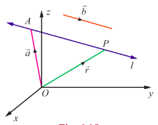
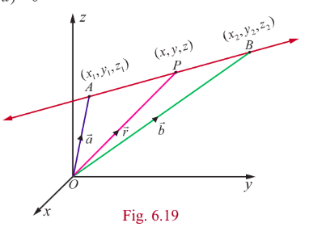
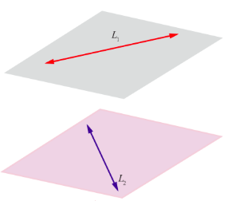
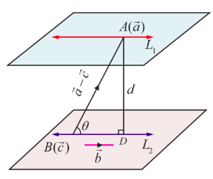
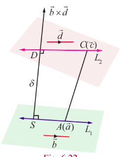

## 6.7 Application of Vectors to 3-Dimensional Geometry

Vectors provide an elegant approach to study straight lines and planes in three dimension. All straight lines and planes are subsets of $\mathbb{R}^{3}$. For brevity, we shall call a straight line simply as line. A plane is a surface which is understood as a set $P$ of points in $\mathbb{R}^{3}$ such that, if $A,B$, and $C$ are any three non-collinear points of $P$, then the line passing through any two of them is a subset of $P$. Two planes are said to be intersecting if they have at least one point in common and at least one point which lies on one plane but not on the other. Two planes are said to be coincident if they have exactly the same points. Two planes are said to be parallel but not coincident if they have no point in common. Similarly, a straight line can be understood as the set of points common to two intersecting planes. In this section, we obtain vector and Cartesian equations of straight line and plane by applying vector methods. By a vector form of equation of a geometrical object, we mean an equation which is satisfied by the position vector of every point of the object. The equation may be a vector equation or a scalar equation.

### 6.7.1 Different forms of equation of a straight line

A straight line can be uniquely fixed if

- a point on the straight line and the direction of the straight line are given
- two points on the straight line are given

We find equations of a straight line in vector and Cartesian form. To find the equation of a straight line in vector form, an arbitrary point $P$ with position vector $\vec{r}$ on the straight line is taken and a relation satisfied by $\vec{r}$ is obtained by using the given conditions. This relation is called the vector equation of the straight line. A vector equation of a straight line may or may not involve parameters. If a vector equation involves parameters, then it is called a vector equation in parametric form. If no parameter is involved, then the equation is called a vector equation in non-parametric form.

### 6.7.2 A point on the straight line and the direction of the straight line are given

**(a) Parametric form of vector equation**

> **Theorem 6.11**
>
> The vector equation of a straight line passing through a fixed point with position vector $\vec{a}$ and parallel to a given vector $\vec{b}$ is $\vec{r} = \vec{a} + t\vec{b}$, where $t\in \mathbb{R}$.

**Proof**

If $\vec{a}$ is the position vector of a given point $A$ and $\vec{r}$ is the position vector of an arbitrary point $P$ on the straight line, then $\overrightarrow{AP} = \vec{r} - \vec{a}$.

Since $\overrightarrow{AP}$ is parallel to $\vec{b}$, we have

$$
\vec{r} -\vec{a} = t\vec{b}, \quad t\in \mathbb{R}
$$

$$
\vec{r} = \vec{a} + t\vec{b}, \quad t\in \mathbb{R}
$$

This is the vector equation of the straight line in parametric form.

> **Remark**
>
> The position vector of any point on the line is taken as $\vec{a} + t\vec{b}$.

**(b) Non-parametric form of vector equation**

Since $\overrightarrow{AP}$ is parallel to $\vec{b}$, we have $\overrightarrow{AP}\times \vec{b} = \vec{0}$.

That is, $(\vec{r} - \vec{a})\times \vec{b} = \vec{0}$.

This is known as the vector equation of the straight line in non-parametric form.

**(c) Cartesian equation**

Suppose $P$ is $(x,y,z)$, $A$ is $(x_{1},y_{1},z_{1})$ and $\vec{b} = b_{1}\hat{i} + b_{2}\hat{j} + b_{3}\hat{k}$. Then, substituting $\vec{r} = x\hat{i} + y\hat{j} + z\hat{k}$, $\vec{a} = x_{1}\hat{i} + y_{1}\hat{j} + z_{1}\hat{k}$ in (1) and comparing the coefficients of $\hat{i},\hat{j},\hat{k}$, we get

$$
x - x_{1} = tb_{1},\quad y - y_{1} = tb_{2},\quad z - z_{1} = tb_{3} \quad (4)
$$

Conventionally (4) can be written as

$$
\frac{x - x_{1}}{b_{1}} = \frac{y - y_{1}}{b_{2}} = \frac{z - z_{1}}{b_{3}} \quad (5)
$$

which are called the Cartesian equations or symmetric equations of a straight line passing through the point $(x_{1},y_{1},z_{1})$ and parallel to a vector with direction ratios $b_{1},b_{2},b_{3}$.

> **Remark**
>
> (i) Every point on the line (5) is of the form $(x_{1} + t b_{1}, y_{1} + t b_{2}, z_{1} + t b_{3})$, where $t\in \mathbb{R}$.
>
> (ii) Since the direction cosines of a line are proportional to direction ratios of the line, if $l,m,n$ are the direction cosines of the line, then the Cartesian equations of the line are
>
> $$
> \frac{x - x_{1}}{l} = \frac{y - y_{1}}{m} = \frac{z - z_{1}}{n}.
> $$
>
> (iii) In (5), if any one or two of $b_{1},b_{2},b_{3}$ are zero, it does not mean that we are dividing by zero. But it means that the corresponding numerator is zero. For instance, If $b_{1}\neq 0$, $b_{2}\neq 0$ and $b_{3} = 0$, then
>
> $$
> \frac{x - x_{1}}{b_{1}} = \frac{y - y_{1}}{b_{2}} = \frac{z - z_{1}}{0}
> $$
>
> (iv) We know that the direction cosines of $x$-axis are $1,0,0$. Therefore, the equations of $x$-axis are
>
> $$
> \frac{x - 0}{1} = \frac{y - 0}{0} = \frac{z - 0}{0} \quad \text{or} \quad x = t,\ y = 0,\ z = 0, \text{ where } t\in \mathbb{R}.
> $$
>
> Similarly the equations of $y$-axis and $z$-axis are given by $\frac{x - 0}{0} = \frac{y - 0}{1} = \frac{z - 0}{0}$ and $\frac{x - 0}{0} = \frac{y - 0}{0} = \frac{z - 0}{1}$ respectively.

### 6.7.3 Straight Line passing through two given points

**(a) Parametric form of vector equation**

> **Theorem 6.12**
>
>The parametric form of vector equation of a line passing through two given points whose position vectors are $\vec{a}$ and $\vec{b}$ respectively is $\vec{r} = \vec{a} + t(\vec{b} -\vec{a}),\ t\in \mathbb{R}$.

**(b) Non-parametric form of vector equation**

The above equation can be written equivalently in non-parametric form of vector equation as

$$
(\vec{r} -\vec{a})\times (\vec{b} -\vec{a}) = \vec{0}
$$

**(c) Cartesian form of equation**

Suppose $P$ is $(x,y,z)$, $A$ is $(x_{1},y_{1},z_{1})$ and $B$ is $(x_{2},y_{2},z_{2})$. Then substituting $\vec{r} = x\hat{i} + y\hat{j} + z\hat{k}$, $\vec{a} = x_{1}\hat{i} + y_{1}\hat{j} + z_{1}\hat{k}$ and $\vec{b} = x_{2}\hat{i} + y_{2}\hat{j} + z_{2}\hat{k}$ in theorem 6.12 and comparing the coefficients of $\hat{i},\hat{j},\hat{k}$, we get $x - x_{1} = t(x_{2} - x_{1}), y - y_{1} = t(y_{2} - y_{1}), z - z_{1} = t(z_{2} - z_{1})$ and so the Cartesian equations of a line passing through two given points $(x_{1},y_{1},z_{1})$ and $(x_{2},y_{2},z_{2})$ are given by

$$
\frac{x - x_{1}}{x_{2} - x_{1}} = \frac{y - y_{1}}{y_{2} - y_{1}} = \frac{z - z_{1}}{z_{2} - z_{1}}.
$$

From the above equation, we observe that the direction ratios of a line passing through two given points $(x_1, y_1, z_1)$ and $(x_2, y_2, z_2)$ are given by $x_2 - x_1, y_2 - y_1, z_2 - z_1$ , which are also given by any three numbers proportional to them and in particular $x_1 - x_2, y_1 - y_2, z_1 - z_2$ .

**Example 6.24**

A straight line passes through the point $(1, 2, -3)$ and parallel to $4\hat{i} + 5\hat{j} - 7\hat{k}$ . Find (i) vector equation in parametric form (ii) vector equation in non-parametric form (iii) Cartesian equations of the straight line.

**Solution**

The required line passes through $(1, 2, -3)$ . So, the position vector of the point is $\hat{i} + 2\hat{j} - 3\hat{k}$ .

Let $\vec{a} = \hat{i} + 2\hat{j} - 3\hat{k}$ and $\vec{b} = 4\hat{i} + 5\hat{j} - 7\hat{k}$ . Then, we have

(i) vector equation of the required straight line in parametric form is $\vec{r} = \vec{a} + t\vec{b}$ , $t \in \mathbb{R}$ .

Therefore, $\vec{r} = (\hat{i} + 2\hat{j} - 3\hat{k}) + t(4\hat{i} + 5\hat{j} - 7\hat{k})$ , $t \in \mathbb{R}$ .

(ii) vector equation of the required straight line in non-parametric form is $(\vec{r} - \vec{a}) \times \vec{b} = \vec{0}$ .

Therefore, $(\vec{r} - (\hat{i} + 2\hat{j} - 3\hat{k})) \times (4\hat{i} + 5\hat{j} - 7\hat{k}) = \vec{0}$ .

(iii) Cartesian equations of the required line are

$\frac{x - x_1}{b_1} = \frac{y - y_1}{b_2} = \frac{z - z_1}{b_3}$ .

Here, $(x_1, y_1, z_1) = (1, 2, -3)$ and direction ratios of the required line are proportional to $4, 5, -7$ . Therefore, Cartesian equations of the straight line are

$\frac{x - 1}{4} = \frac{y - 2}{5} = \frac{z + 3}{-7}$ .

**Example 6.25**

The vector equation in parametric form of a line is $\vec{r} = (3\hat{i} - 2\hat{j} + 6\hat{k}) + t(2\hat{i} - \hat{j} + 3\hat{k})$ . Find (i) the direction cosines of the straight line (ii) vector equation in non-parametric form of the line (iii) Cartesian equations of the line.

**Solution**

Comparing the given equation with equation of a straight line $\vec{r} = \vec{a} + t\vec{b}$ , we have $\vec{a} = 3\vec{i} - 2\vec{j} + 6\vec{k}$ and $\vec{b} = 2\vec{i} - \vec{j} + 3\vec{k}$ . Therefore,

1. If $\vec{b} = b_1\vec{i} + b_2\vec{j} + b_3\vec{k}$ , then direction ratios of the straight line are $b_1, b_2, b_3$ . Therefore, direction ratios of the given straight line are proportional to $2, -1, 3$ , and hence the direction cosines of the given straight line are

   $\frac{2}{\sqrt{14}} , \frac{-1}{\sqrt{14}} , \frac{3}{\sqrt{14}}$ .

2. vector equation of the straight line in non-parametric form is given by $(\vec{r} - \vec{a}) \times \vec{b} = \vec{0}$ . Therefore, $(\vec{r} - (3\vec{i} - 2\vec{j} + 6\vec{k})) \times (2\vec{i} - \vec{j} + 3\vec{k}) = \vec{0}$ .

3. Here $(x_1, y_1, z_1) = (3, -2, 6)$ and the direction ratios are proportional to $2, -1, 3$ .

   Therefore, Cartesian equations of the straight line are

   $\frac{x - 3}{2} = \frac{y + 2}{-1} = \frac{z - 6}{3}$ .

**Example 6.26**

Find the vector equation in parametric form and Cartesian equations of the line passing through $(-4,2,-3)$ and is parallel to the line $\frac{-x - 2}{4} = \frac{y + 3}{-2} = \frac{2z - 6}{3}$.

**Solution**

Rewriting the given equations as $\frac{x + 2}{-4} = \frac{y + 3}{-2} = \frac{z - 3}{3/2}$ and comparing with $\frac{x - x_{1}}{b_{1}} = \frac{y - y_{1}}{b_{2}} = \frac{z - z_{1}}{b_{3}}$, we have $\vec{b} = b_{1}\hat{i} + b_{2}\hat{j} + b_{3}\hat{k} = -4\hat{i} - 2\hat{j} + \frac{3}{2}\hat{k} = -\frac{1}{2}(8\hat{i} + 4\hat{j} - 3\hat{k})$. Clearly, $\vec{b}$ is parallel to the vector $8\hat{i} + 4\hat{j} - 3\hat{k}$. Therefore, a vector equation of the required straight line passing through the given point $(-4,2,-3)$ and parallel to the vector $8\hat{i} + 4\hat{j} - 3\hat{k}$ in parametric form is

$$
\vec{r} = (-4\hat{i} + 2\hat{j} - 3\hat{k}) + t(8\hat{i} + 4\hat{j} - 3\hat{k}), \quad t\in \mathbb{R}.
$$

Therefore, Cartesian equations of the required straight line are given by

$$
\frac{x + 4}{8} = \frac{y - 2}{4} = \frac{z + 3}{-3}.
$$

**Example 6.27**

Find the vector equation in parametric form and Cartesian equations of a straight line passing through the points $(-5,7,-4)$ and $(13,-5,2)$. Find the point where the straight line crosses the $xy$-plane.

**Solution**

The straight line passes through the points $(-5,7,-4)$ and $(13,-5,2)$, and therefore, direction ratios of the straight line joining these two points are $18, -12, 6$. That is, $3, -2, 1$.

So, the straight line is parallel to $3\hat{i} - 2\hat{j} + \hat{k}$. Therefore,

Required vector equation of the straight line in parametric form is $\vec{r} = (-5\hat{i} + 7\hat{j} - 4\hat{k}) + t(3\hat{i} - 2\hat{j} + \hat{k})$ or $\vec{r} = (13\hat{i} - 5\hat{j} + 2\hat{k}) + s(3\hat{i} - 2\hat{j} + \hat{k})$ where $s,t\in \mathbb{R}$.

Required Cartesian equations of the straight line are $\frac{x + 5}{3} = \frac{y - 7}{-2} = \frac{z + 4}{1}$ or $\frac{x - 13}{3} = \frac{y + 5}{-2} = \frac{z - 2}{1}$.

An arbitrary point on the straight line is of the form

$$
(3t - 5, -2t + 7, t - 4) \quad \text{or} \quad (3s + 13, -2s - 5, s + 2)
$$

Since the straight line crosses the $xy$-plane, the $z$-coordinate of the point of intersection is zero. Therefore, we have $t - 4 = 0$, that is, $t = 4$, and hence the straight line crosses the $xy$-plane at $(7, -1, 0)$.

**Example 6.28**

Find the angle made by the straight line $\frac{x + 3}{2} = \frac{y - 1}{2} = -z$ with coordinate axes.

**Solution**

If $\hat{b}$ is a unit vector parallel to the given line, then

$\hat{b} = \frac{2\hat{i} + 2\hat{j} - \hat{k}}{|2\hat{i} + 2\hat{j} - \hat{k}|} = \frac{1}{3}(2\hat{i} + 2\hat{j} - \hat{k})$ .

Therefore, from the definition of direction cosines of $\hat{b}$ , we have

$\cos \alpha = \frac{2}{3}$ , $\cos \beta = \frac{2}{3}$ , $\cos \gamma = -\frac{1}{3}$ ,

where $\alpha, \beta, \gamma$ are the angles made by $\hat{b}$ with the positive $x$ -axis, positive $y$ -axis, and positive $z$ -axis, respectively. As the angle between the given straight line with the coordinate axes are same as the angles made by $\hat{b}$ with the coordinate axes, we have

$\alpha = \cos^{-1}\left(\frac{2}{3}\right)$ , $\beta = \cos^{-1}\left(\frac{2}{3}\right)$ , $\gamma = \cos^{-1}\left(-\frac{1}{3}\right)$ ,

respectively.

### 6.7.4 Angle between two straight lines

**(a) Vector form**

The acute angle between two given straight lines $\vec{r} = \vec{a} + s\vec{b}$ and $\vec{r} = \vec{c} + t\vec{d}$ is same as that of the angle between $\vec{b}$ and $\vec{d}$. So,
$$
\cos \theta = \frac{|\vec{b}\cdot \vec{d}|}{|\vec{b}| |\vec{d}|} \quad \text{or} \quad \theta = \cos^{-1}\left(\frac{|\vec{b}\cdot \vec{d}|}{|\vec{b}| |\vec{d}|}\right).
$$

> **Remark**
>
> (i) The two given lines $\vec{r} = \vec{a} + s\vec{b}$ and $\vec{r} = \vec{c} + t\vec{d}$ are parallel
>
> $\Leftrightarrow \theta = 0 \Leftrightarrow \cos \theta = 1 \Leftrightarrow |\vec{b}\cdot \vec{d}| = |\vec{b}| |\vec{d}|$.
>
> (ii) The two given lines $\vec{r} = \vec{a} + s\vec{b}$ and $\vec{r} = \vec{c} + t\vec{d}$ are parallel if, and only if $\vec{b} = \lambda \vec{d}$, for some scalar $\lambda$.
>
> (iii) The two given lines $\vec{r} = \vec{a} + s\vec{b}$ and $\vec{r} = \vec{c} + t\vec{d}$ are perpendicular if, and only if $\vec{b}\cdot \vec{d} = 0$.

**(b) Cartesian form**

If two lines are given in Cartesian form as $\frac{x - x_{1}}{b_{1}} = \frac{y - y_{1}}{b_{2}} = \frac{z - z_{1}}{b_{3}}$ and $\frac{x - x_{2}}{d_{1}} = \frac{y - y_{2}}{d_{2}} = \frac{z - z_{2}}{d_{3}}$, then the acute angle $\theta$ between the two given lines is given by

$$
\theta = \cos^{-1}\left(\frac{|b_{1}d_{1} + b_{2}d_{2} + b_{3}d_{3}|}{\sqrt{b_{1}^{2} + b_{2}^{2} + b_{3}^{2}}\sqrt{d_{1}^{2} + d_{2}^{2} + d_{3}^{2}}}\right)
$$

> **Remark**
>
> (i) The two given lines with direction ratios $b_{1},b_{2},b_{3}$ and $d_{1},d_{2},d_{3}$ are parallel if, and only if
>
> $$
> \frac{b_{1}}{d_{1}} = \frac{b_{2}}{d_{2}} = \frac{b_{3}}{d_{3}}.
> $$
>
> (ii) The two given lines with direction ratios $b_{1},b_{2},b_{3}$ and $d_{1},d_{2},d_{3}$ are perpendicular if and only if $b_{1}d_{1} + b_{2}d_{2} + b_{3}d_{3} = 0$.
>
> (iii) If the direction cosines of two given straight lines are $l_{1},m_{1},n_{1}$ and $l_{2},m_{2},n_{2}$, then the angle between the two given straight lines is $\cos \theta = |l_{1}l_{2} + m_{1}m_{2} + n_{1}n_{2}|$.

**Example 6.29**

Find the acute angle between the lines $\vec{r} = (\hat{i} + 2\hat{j} + 4\hat{k}) + t(2\hat{i} + 2\hat{j} + \hat{k})$ and the straight line passing through the points $(5,1,4)$ and $(9,2,12)$.

**Solution**

We know that the line $\vec{r} = (\hat{i} + 2\hat{j} + 4\hat{k}) + t(2\hat{i} + 2\hat{j} + \hat{k})$ is parallel to the vector $2\hat{i} + 2\hat{j} + \hat{k}$.

Direction ratios of the straight line joining the two given points $(5,1,4)$ and $(9,2,12)$ are $4,1,8$ and hence this line is parallel to the vector $4\hat{i} + \hat{j} + 8\hat{k}$.

Therefore, the acute angle between the given two straight lines is

$$
\theta = \cos^{-1}\left(\frac{|\vec{b}\cdot \vec{d}|}{|\vec{b}| |\vec{d}|}\right), \text{ where } \vec{b} = 2\hat{i} + 2\hat{j} + \hat{k} \text{ and } \vec{d} = 4\hat{i} + \hat{j} + 8\hat{k}.
$$

$$
\vec{b}\cdot \vec{d} = (2)(4) + (2)(1) + (1)(8) = 8 + 2 + 8 = 18.
$$

$$
|\vec{b}| = \sqrt{2^{2} + 2^{2} + 1^{2}} = \sqrt{9} = 3,\quad |\vec{d}| = \sqrt{4^{2} + 1^{2} + 8^{2}} = \sqrt{16 + 1 + 64} = \sqrt{81} = 9.
$$

Thus, $\theta = \cos^{-1}\left(\frac{18}{3 \times 9}\right) = \cos^{-1}\left(\frac{2}{3}\right)$.

**Example 6.30**

Find the acute angle between the straight lines $\frac{x - 4}{2} = \frac{y}{1} = \frac{z + 1}{-2}$ and $\frac{x - 1}{4} = \frac{y + 1}{-4} = \frac{z - 2}{2}$ and state whether they are parallel or perpendicular.

**Solution**

Comparing the given lines with the general Cartesian equations of straight lines,

$$
\frac{x - x_{1}}{b_{1}} = \frac{y - y_{1}}{b_{2}} = \frac{z - z_{1}}{b_{3}} \quad \text{and} \quad \frac{x - x_{2}}{d_{1}} = \frac{y - y_{2}}{d_{2}} = \frac{z - z_{2}}{d_{3}}
$$

we find $(b_{1},b_{2},b_{3}) = (2,1,-2)$ and $(d_{1},d_{2},d_{3}) = (4,-4,2)$. Therefore, the acute angle between the two straight lines is

$$
\theta = \cos^{-1}\left(\frac{|(2)(4) + (1)(-4) + (-2)(2)|}{\sqrt{2^{2} + 1^{2} + (-2)^{2}}\sqrt{4^{2} + (-4)^{2} + 2^{2}}}\right) = \cos^{-1}\left(\frac{|8 - 4 - 4|}{\sqrt{9}\sqrt{36}}\right) = \cos^{-1}(0) = \frac{\pi}{2}.
$$

Thus the two straight lines are perpendicular.

**Example 6.31**

Show that the straight line passing through the points $A(6,7,5)$ and $B(8,10,6)$ is perpendicular to the straight line passing through the points $C(10,2,-5)$ and $D(8,3,-4)$.

**Solution**

The straight line passing through the points $A(6,7,5)$ and $B(8,10,6)$ is parallel to the vector $\vec{b} = \overrightarrow{AB} = \overrightarrow{OB} - \overrightarrow{OA} = 2\hat{i} + 3\hat{j} + \hat{k}$ and the straight line passing through the points $C(10,2,-5)$ and $D(8,3,-4)$ is parallel to the vector $\vec{d} = \overrightarrow{CD} = -2\hat{i} + \hat{j} + \hat{k}$. Therefore, the angle between the two straight lines is the angle between the two vectors $\vec{b}$ and $\vec{d}$. Since

$$
\vec{b}\cdot \vec{d} = (2\hat{i} + 3\hat{j} + \hat{k})\cdot (-2\hat{i} + \hat{j} + \hat{k}) = -4 + 3 + 1 = 0,
$$

the two vectors are perpendicular, and hence the two straight lines are perpendicular.

**Aliter**

We find that direction ratios of the straight line joining the points $A(6,7,5)$ and $B(8,10,6)$ are $(b_{1},b_{2},b_{3}) = (2,3,1)$ and direction ratios of the line joining the points $C(10,2,-5)$ and $D(8,3,-4)$ are $(d_{1},d_{2},d_{3}) = (-2,1,1)$. Since $b_{1}d_{1} + b_{2}d_{2} + b_{3}d_{3} = (2)(-2) + (3)(1) + (1)(1) = -4 + 3 + 1 = 0$, the two straight lines are perpendicular.

**Example 6.32**

Show that the lines $\frac{x - 1}{4} = \frac{2 - y}{6} = \frac{z - 4}{12}$ and $\frac{x - 3}{-2} = \frac{y - 3}{3} = \frac{5 - z}{6}$ are parallel.

**Solution**

We observe that the straight line $\frac{x - 1}{4} = \frac{2 - y}{6} = \frac{z - 4}{12}$ is parallel to the vector $4\hat{i} - 6\hat{j} + 12\hat{k}$ and the straight line $\frac{x - 3}{-2} = \frac{y - 3}{3} = \frac{5 - z}{6}$ is parallel to the vector $-2\hat{i} + 3\hat{j} - 6\hat{k}$.

Since $4\hat{i} - 6\hat{j} + 12\hat{k} = -2(-2\hat{i} + 3\hat{j} - 6\hat{k})$, the two vectors are parallel, and hence the two straight lines are parallel.

## Exercise 6.4

1. Find the non-parametric form of vector equation and Cartesian equations of the straight line passing through the point with position vector $4\hat{i} + 3\hat{j} - 7\hat{k}$ and parallel to the vector $2\hat{i} - 6\hat{j} + 7\hat{k}$.
2. Find the parametric form of vector equation and Cartesian equations of the straight line passing through the point $(-2,3,4)$ and parallel to the straight line $\frac{x - 1}{-4} = \frac{y + 3}{5} = \frac{8 - z}{6}$.
3. Find the points where the straight line passes through $(6,7,4)$ and $(8,4,9)$ cuts the $xz$ and $yz$ planes.
4. Find the direction cosines of the straight line passing through the points $(5,6,7)$ and $(7,9,13)$. Also, find the parametric form of vector equation and Cartesian equations of the straight line passing through two given points.
5. Find the acute angle between the following lines.
   (i) $\vec{r}=(4\hat{i}-\hat{j})+t(\hat{i}+2\hat{j}-2\hat{k}),\ \vec{r}=(\hat{i}-2\hat{j}+4\hat{k})+s(-\hat{i}-2\hat{j}+2\hat{k})$
   (ii) $\frac{x+4}{3}=\frac{y-7}{4}=\frac{z+5}{5},\ \vec{r}=4\hat{k}+t(2\hat{i}+\hat{j}+\hat{k})$
6. The vertices of $\Delta ABC$ are $A(7,2,1), B(6,0,3)$, and $C(4,2,4)$. Find $\angle ABC$.
7. If the straight line joining the points $(2,1,4)$ and $(a-1,4,-1)$ is parallel to the line joining the points $(0,2,b-1)$ and $(5,3,-2)$, find the values of $a$ and $b$.
8. If the straight lines $\frac{x-5}{5m+2} = \frac{2-y}{5} = \frac{1-z}{-1}$ and $x = \frac{2y+1}{4m} = \frac{1-z}{-3}$ are perpendicular to each other, find the value of $m$.
9. Show that the points $(2,3,4), (-1,4,5)$ and $(8,1,2)$ are collinear.

### 6.7.5 Point of intersection of two straight lines

If $\frac{x - x_{1}}{a_{1}} = \frac{y - y_{1}}{a_{2}} = \frac{z - z_{1}}{a_{3}}$ and $\frac{x - x_{2}}{b_{1}} = \frac{y - y_{2}}{b_{2}} = \frac{z - z_{2}}{b_{3}}$ are two lines, then every point on the line is of the form $(x_{1} + sa_{1}, y_{1} + sa_{2}, z_{1} + sa_{3})$ and $(x_{2} + tb_{1}, y_{2} + tb_{2}, z_{2} + tb_{3})$ respectively. If the lines are intersecting, then there must be a common point. So, at the point of intersection, for some values of $s$ and $t$, we have

$$
(x_{1} + sa_{1}, y_{1} + sa_{2}, z_{1} + sa_{3}) = (x_{2} + tb_{1}, y_{2} + tb_{2}, z_{2} + tb_{3})
$$

Therefore, $x_{1} + sa_{1} = x_{2} + tb_{1},\ y_{1} + sa_{2} = y_{2} + tb_{2},\ z_{1} + sa_{3} = z_{2} + tb_{3}$.

By solving any two of the above three equations, we obtain the values of $s$ and $t$. If $s$ and $t$ satisfy the remaining equation, the lines are intersecting lines. Otherwise the lines are non-intersecting. Substituting the value of $s$, (or by substituting the value of $t$), we get the point of intersection of two lines.

If the equations of straight lines are given in vector form, write them in cartesian form and proceed as above to find the point of intersection.

**Example 6.33**

Find the point of intersection of the lines $\frac{x - 1}{2} = \frac{y - 2}{3} = \frac{z - 3}{4}$ and $\frac{x - 4}{5} = \frac{y - 1}{2} = z$.

**Solution**

Every point on the line $\frac{x - 1}{2} = \frac{y - 2}{3} = \frac{z - 3}{4} = s$ (say) is of the form $(2s+1, 3s+2, 4s+3)$ and every point on the line $\frac{x - 4}{5} = \frac{y - 1}{2} = z = t$ (say) is of the form $(5t+4, 2t+1, t)$. So, at the point of intersection, for some values of $s$ and $t$, we have

$$
(2s+1, 3s+2, 4s+3) = (5t+4, 2t+1, t)
$$

Therefore, $2s - 5t = 3$, $3s - 2t = -1$ and $4s - t = -3$. Solving the first two equations we get $t = -1$, $s = -1$. These values of $s$ and $t$ satisfy the third equation. Therefore, the given lines intersect. Substituting these values of $t$ or $s$ in the respective points, the point of intersection is $(-1, -1, -1)$.

### 6.7.6 Shortest distance between two straight lines

We have just explained how the point of intersection of two lines are found and we have also studied how to determine whether the given two lines are parallel or not.

> **Definition 6.6**
>
> Two lines are said to be coplanar if they lie in the same plane.

> **Note**
>
> If two lines are either parallel or intersecting, then they are coplanar.

> **Definition 6.7**
>
> Two lines in space are called skew lines if they are not parallel and do not intersect.

> **Note**
>
> If two lines are skew lines, then they are non coplanar.
>
> If the lines are not parallel and intersect, the distance between them is zero. If they are parallel and non-intersecting, the distance is determined by the length of the line segment perpendicular to both the parallel lines. In the same way, the shortest distance between two skew lines is defined as the length of the line segment perpendicular to both the skew lines. Two lines will either be parallel or skew.

> **Theorem 6.13**
>
> The shortest distance between the two parallel lines $\vec{r} = \vec{a} + s\vec{b}$ and $\vec{r} = \vec{c} + t\vec{b}$ is given by $d = \frac{|(\vec{c} - \vec{a})\times \vec{b}|}{|\vec{b}|}$, where $|\vec{b}| \neq 0$.

**Proof**

The given two parallel lines $\vec{r} = \vec{a} + s\vec{b}$ and $\vec{r} = \vec{c} + t\vec{b}$ are denoted by $L_{1}$ and $L_{2}$ respectively. Let $A$ and $B$ be the points on $L_{1}$ and $L_{2}$ whose position vectors are $\vec{a}$ and $\vec{c}$ respectively. The two given lines are parallel to $\vec{b}$.

Let $AD$ be a perpendicular to the two given lines. If $\theta$ is the acute angle between $\overline{AB}$ and $\vec{b}$, then

$$
\sin \theta = \frac{|\overline{AB}\times \vec{b}|}{|\overline{AB}| |\vec{b}|} = \frac{|(\vec{c} - \vec{a})\times \vec{b}|}{|\vec{c} - \vec{a}| |\vec{b}|} \quad (1)
$$

But, from the right angle triangle $ABD$

$$
\sin \theta = \frac{d}{AB} = \frac{d}{|\vec{c} - \vec{a}|} \quad (2)
$$

From (1) and (2), we have $d = \frac{|(\vec{c} - \vec{a})\times \vec{b}|}{|\vec{b}|}$, where $|\vec{b}| \neq 0$.

> **Theorem 6.14**
>
> The shortest distance between the two skew lines $\vec{r} = \vec{a} + s\vec{b}$ and $\vec{r} = \vec{c} + t\vec{d}$ is given by

$$
\delta = \frac{|(\vec{c} - \vec{a})\cdot(\vec{b}\times \vec{d})|}{|\vec{b}\times \vec{d}|}, \quad \text{where } |\vec{b}\times \vec{d}| \neq 0.
$$

**Proof**

The two skew lines $\vec{r} = \vec{a} + s\vec{b}$ and $\vec{r} = \vec{c} + t\vec{d}$ are denoted by $L_{1}$ and $L_{2}$ respectively.

Let $A$ and $C$ be the points on $L_{1}$ and $L_{2}$ with position vectors $\vec{a}$ and $\vec{c}$ respectively.

From the given equations of skew lines, we observe that $L_{1}$ is parallel to the vector $\vec{b}$ and $L_{2}$ is parallel to the vector $\vec{d}$. So, $\vec{b} \times \vec{d}$ is perpendicular to the lines $L_{1}$ and $L_{2}$.

Let $SD$ be the line segment perpendicular to both the lines $L_{1}$ and $L_{2}$. Then the vector $\overline{SD}$ is perpendicular to the vectors $\vec{b}$ and $\vec{d}$ and therefore it is parallel to the vector $\vec{b} \times \vec{d}$.

So, $\frac{\vec{b} \times \vec{d}}{|\vec{b} \times \vec{d}|}$ is a unit vector in the direction of $\overline{SD}$. Then, the shortest distance $|\overline{SD}|$ is the absolute value of the projection of $\overline{AC}$ on $\overline{SD}$. That is,

$$
\delta = |\overline{SD}| = \left| \overline{AC} \cdot \left( \text{Unit vector in the direction of } \overline{SD} \right) \right| = \left| (\vec{c} - \vec{a}) \cdot \frac{\vec{b}\times \vec{d}}{|\vec{b}\times \vec{d}|} \right| = \frac{|(\vec{c} - \vec{a})\cdot(\vec{b}\times \vec{d})|}{|\vec{b}\times \vec{d}|}, \quad \text{where } |\vec{b}\times \vec{d}| \neq 0. \quad (1)
$$

> **Remark**
>
> (i) It follows from theorem (6.14) that two straight lines $\vec{r} = \vec{a} + s\vec{b}$ and $\vec{r} = \vec{c} + t\vec{d}$ intersect each other (that is, coplanar) if $(\vec{c} - \vec{a})\cdot (\vec{b}\times \vec{d}) = 0$.
>
> (ii) If two lines $\frac{x - x_{1}}{b_{1}} = \frac{y - y_{1}}{b_{2}} = \frac{z - z_{1}}{b_{3}}$ and $\frac{x - x_{2}}{d_{1}} = \frac{y - y_{2}}{d_{2}} = \frac{z - z_{2}}{d_{3}}$ intersect each other (that is, coplanar), then we have
>
> $$
> \begin{vmatrix}
> x_{2} - x_{1} & y_{2} - y_{1} & z_{2} - z_{1} \\
> b_{1} & b_{2} & b_{3} \\
> d_{1} & d_{2} & d_{3}
> \end{vmatrix} = 0.
> $$

**Example 6.34**

Find the parametric form of vector equation of a straight line passing through the point of intersection of the straight lines $\vec{r} = (\hat{i} + 3\hat{j} - \hat{k}) + t(2\hat{i} + 3\hat{j} + 2\hat{k})$ and $\frac{x - 2}{1} = \frac{y - 4}{2} = \frac{z + 3}{4}$, and perpendicular to both straight lines.

**Solution**

The Cartesian equations of the straight line $\vec{r} = (\hat{i} + 3\hat{j} - \hat{k}) + t(2\hat{i} + 3\hat{j} + 2\hat{k})$ is

$$
\frac{x - 1}{2} = \frac{y - 3}{3} = \frac{z + 1}{2} = s \quad \text{(say)}.
$$

Then any point on this line is of the form $(2s + 1, 3s + 3, 2s - 1)$ ... (1)

The Cartesian equation of the second line is $\frac{x - 2}{1} = \frac{y - 4}{2} = \frac{z + 3}{4} = t$ (say)

Then any point on this line is of the form $(t + 2, 2t + 4, 4t - 3)$ ... (2)

If the given lines intersect, then there must be a common point. Therefore, for some $s, t \in \mathbb{R}$ we have $(2s + 1, 3s + 3, 2s - 1) = (t + 2, 2t + 4, 4t - 3)$.

Equating the coordinates of $x, y$ and $z$ we get

$$
2s - t = 1, \quad 3s - 2t = 1 \quad \text{and} \quad s - 2t = -1.
$$

Solving the first two of the above three equations, we get $s = 1$ and $t = 1$. These values of $s$ and $t$ satisfy the third equation. So, the lines are intersecting.

Now, using the value of $s$ in (1) or the value of $t$ in (2), the point of intersection $(3, 6, 1)$ of these two straight lines is obtained.

If we take $\vec{b} = 2\hat{i} + 3\hat{j} + 2\hat{k}$ and $\vec{d} = \hat{i} + 2\hat{j} + 4\hat{k}$, then $\vec{b}\times \vec{d} = \begin{vmatrix} \hat{i} & \hat{j} & \hat{k} \\ 2 & 3 & 2 \\ 1 & 2 & 4 \end{vmatrix} = 8\hat{i} - 6\hat{j} + \hat{k}$ is a vector perpendicular to both the given straight lines. Therefore, the required straight line passing through $(3, 6, 1)$ and perpendicular to both the given straight lines is the same as the straight line passing through $(3, 6, 1)$ and parallel to $8\hat{i} - 6\hat{j} + \hat{k}$. Thus, the equation of the required straight line is

$$
\vec{r} = (3\hat{i} + 6\hat{j} + \hat{k}) + m(8\hat{i} - 6\hat{j} + \hat{k}), \quad m \in \mathbb{R}.
$$

**Example 6.35**

Determine whether the pair of straight lines $\vec{r} = (2\hat{i} + 6\hat{j} + 3\hat{k}) + t(2\hat{i} + 3\hat{j} + 4\hat{k})$ and $\vec{r} = (2\hat{j} - 3\hat{k}) + s(\hat{i} + 2\hat{j} + 3\hat{k})$ are parallel. Find the shortest distance between them.

**Solution**

Comparing the given two equations with

$$
\vec{r} = \vec{a} + s\vec{b} \quad \text{and} \quad \vec{r} = \vec{c} + s\vec{d},
$$

$\vec{a} = 2\hat{i} + 6\hat{j} + 3\hat{k}$, $\vec{b} = 2\hat{i} + 3\hat{j} + 4\hat{k}$, $\vec{c} = 2\hat{j} - 3\hat{k}$, $\vec{d} = \hat{i} + 2\hat{j} + 3\hat{k}$.

Clearly, $\vec{b}$ is not a scalar multiple of $\vec{d}$. So, the two vectors are not parallel and hence the two lines are not parallel.

The shortest distance between the two straight lines is given by

$$
\delta = \frac{|(\vec{c} - \vec{a})\cdot (\vec{b}\times \vec{d})|}{|\vec{b}\times \vec{d}|}.
$$

Now, $\vec{c} - \vec{a} = (2\hat{j} - 3\hat{k}) - (2\hat{i} + 6\hat{j} + 3\hat{k}) = -2\hat{i} - 4\hat{j} - 6\hat{k}$.

$$
\vec{b}\times \vec{d} = \begin{vmatrix}
\hat{i} & \hat{j} & \hat{k} \\
2 & 3 & 4 \\
1 & 2 & 3
\end{vmatrix} = (9 - 8)\hat{i} - (6 - 4)\hat{j} + (4 - 3)\hat{k} = \hat{i} - 2\hat{j} + \hat{k}.
$$

So, $(\vec{c} - \vec{a})\cdot (\vec{b}\times \vec{d}) = (-2\hat{i} - 4\hat{j} - 6\hat{k})\cdot (\hat{i} - 2\hat{j} + \hat{k}) = -2 + 8 - 6 = 0$.

Therefore, the distance between the two given straight lines is zero. Thus, the given lines intersect each other.

**Example 6.36**

Find the shortest distance between the two given straight lines $\vec{r} = (2\vec{i} + 3\vec{j} + 4\vec{k}) + t(-2\vec{i} + \vec{j} - 2\vec{k})$ and $\frac{x - 3}{2} = \frac{y}{-1} = \frac{z + 2}{2}$.

**Solution**

The parametric form of vector equations of the given straight lines are

$$
\vec{r} = (2\vec{i} + 3\vec{j} + 4\vec{k}) + t(-2\vec{i} + \vec{j} - 2\vec{k})
$$

and

$$
\vec{r} = (3\vec{i} - 2\vec{k}) + s(2\vec{i} - \vec{j} + 2\vec{k}).
$$

Comparing the given two equations with $\vec{r} = \vec{a} + t\vec{b}$ and $\vec{r} = \vec{c} + s\vec{d}$,

we have $\vec{a} = 2\vec{i} + 3\vec{j} + 4\vec{k}$, $\vec{b} = -2\vec{i} + \vec{j} - 2\vec{k}$, $\vec{c} = 3\vec{i} - 2\vec{k}$, $\vec{d} = 2\vec{i} - \vec{j} + 2\vec{k}$.

Clearly, $\vec{b}$ is a scalar multiple of $\vec{d}$, and hence the two straight lines are parallel. We know that the shortest distance between two parallel straight lines is given by $d = \frac{|(\vec{c} - \vec{a})\times \vec{b}|}{|\vec{b}|}$.

Now, $\vec{c} - \vec{a} = (3\vec{i} - 2\vec{k}) - (2\vec{i} + 3\vec{j} + 4\vec{k}) = \vec{i} - 3\vec{j} - 6\vec{k}$.

$$
(\vec{c} - \vec{a})\times \vec{b} = \begin{vmatrix}
\hat{i} & \hat{j} & \hat{k} \\
1 & -3 & -6 \\
-2 & 1 & -2
\end{vmatrix} = \hat{i}(6 + 6) - \hat{j}(-2 - 12) + \hat{k}(1 - 6) = 12\hat{i} + 14\hat{j} - 5\hat{k}.
$$

Thus, $|(\vec{c} - \vec{a})\times \vec{b}| = \sqrt{12^{2} + 14^{2} + (-5)^{2}} = \sqrt{144 + 196 + 25} = \sqrt{365}$.

Also, $|\vec{b}| = \sqrt{(-2)^{2} + 1^{2} + (-2)^{2}} = \sqrt{4 + 1 + 4} = 3$.

Hence, $d = \frac{\sqrt{365}}{3}$ units.

**Example 6.37**

Find the coordinate of the foot of the perpendicular drawn from the point $(-1, 2, 3)$ to the straight line $\vec{r} = (\vec{i} - 4\vec{j} + 3\vec{k}) + t(2\vec{i} + 3\vec{j} + \vec{k})$. Also, find the shortest distance from the given point to the straight line.

**Solution**

**Figure 6.23**

Comparing the given equation $\vec{r} = (\vec{i} - 4\vec{j} + 3\vec{k}) + t(2\vec{i} + 3\vec{j} + \vec{k})$ with $\vec{r} = \vec{a} + t\vec{b}$, we get $\vec{a} = \vec{i} - 4\vec{j} + 3\vec{k}$, and $\vec{b} = 2\vec{i} + 3\vec{j} + \vec{k}$. We denote the given point $(-1, 2, 3)$ by $D$, and the point $(1, -4, 3)$ on the straight line by $A$. If $F$ is the foot of the perpendicular from $D$ to the straight line, then $F$ is of the form $(2t + 1, 3t - 4, t + 3)$ and $\overline{DF} = \overline{OF} - \overline{OD} = (2t + 2)\hat{i} + (3t - 6)\hat{j} + t\hat{k}$.

Since $\vec{b}$ is perpendicular to $\overline{DF}$, we have

$$
\vec{b}\cdot \overline{DF} = 0 \Rightarrow 2(2t + 2) + 3(3t - 6) + 1(t) = 0 \Rightarrow 4t + 4 + 9t - 18 + t = 0 \Rightarrow 14t - 14 = 0 \Rightarrow t = 1.
$$

Therefore, the coordinate of $F$ is $(3, -1, 4)$.

Now, the perpendicular distance from the given point to the given line is

$$
DF = |\overline{DF}| = \sqrt{4^{2} + (-3)^{2} + 1^{2}} = \sqrt{16 + 9 + 1} = \sqrt{26} \text{ units}.
$$

**Exercise 6.5**

1. Find the parametric form of vector equation and Cartesian equations of a straight line passing through $(5, 2, 8)$ and is perpendicular to the straight lines $\vec{r} = (\hat{i} + \hat{j} - \hat{k}) + s(2\hat{i} - 2\hat{j} + \hat{k})$ and $\vec{r} = (2\hat{i} - \hat{j} - 3\hat{k}) + t(\hat{i} + 2\hat{j} + 2\hat{k})$.

2. Show that the lines $\vec{r} = (6\hat{i} + \hat{j} + 2\hat{k}) + s(\hat{i} + 2\hat{j} - 3\hat{k})$ and $\vec{r} = (3\hat{i} + 2\hat{j} - 2\hat{k}) + t(2\hat{i} + 4\hat{j} - 5\hat{k})$ are skew lines and hence find the shortest distance between them.

3. If the two lines $\frac{x - 1}{2} = \frac{y + 1}{3} = \frac{z - 1}{4}$ and $\frac{x - 3}{1} = \frac{y - m}{2} = z$ intersect at a point, find the value of $m$.

4. Show that the lines $\frac{x - 3}{3} = \frac{y - 3}{-1}, z - 1 = 0$ and $\frac{x - 6}{2} = \frac{z - 1}{3}, y - 2 = 0$ intersect. Also find the point of intersection.

5. Show that the straight lines $x + 1 = 2y = -12z$ and $x = y + 2 = 6z - 6$ are skew and hence find the shortest distance between them.

6. Find the parametric form of vector equation of the straight line passing through $(-1, 2, 1)$ and parallel to the straight line $\vec{r} = (2\hat{i} + 3\hat{j} - \hat{k}) + t(\hat{i} - 2\hat{j} + \hat{k})$ and hence find the shortest distance between the lines.

7. Find the foot of the perpendicular drawn from the point $(5, 4, 2)$ to the line $\frac{x + 1}{2} = \frac{y - 3}{3} = \frac{z - 1}{-1}$. Also, find the equation of the perpendicular.
