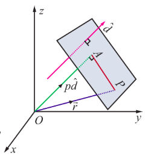
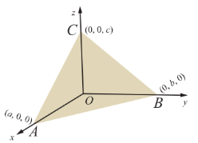
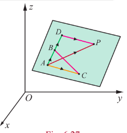
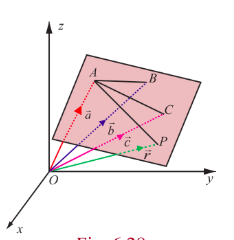
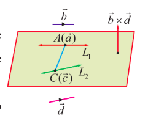
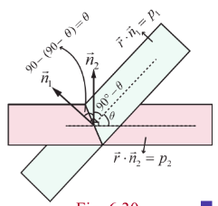
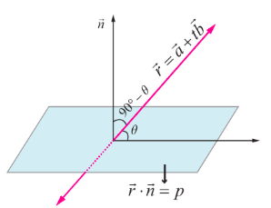
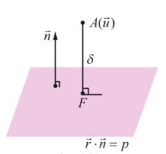
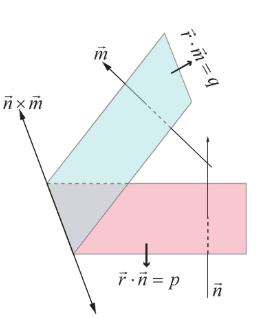
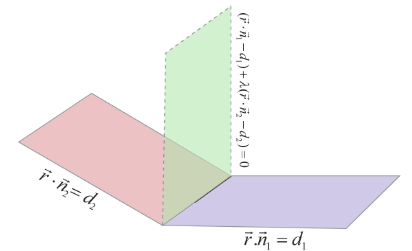

## 6.8 Different forms of Equation of a plane

We have already seen the notion of a plane.

> **Definition 6.8**
>
> A vector which is perpendicular to a plane is called a normal to the plane.

> **Note**
>
> Every normal to a plane is perpendicular to every straight line lying on the plane.
>
> A plane is uniquely fixed if any one of the following is given:
>
> - a unit normal to the plane and the distance of the plane from the origin
> - a point of the plane and a normal to the plane
> - three non-collinear points of the plane
> - a point of the plane and two non-parallel lines or non-parallel vectors which are parallel to the plane
> - two distinct points of the plane and a straight line or non-zero vector parallel to the plane but not parallel to the line joining the two points.
>
> Let us find the vector and Cartesian equations of planes using the above situations.

### 6.8.1 Equation of a plane when a normal to the plane and the distance of the plane from the origin are given

**(a) Vector equation of a plane in normal form**

> **Theorem 6.15**
>
> The equation of the plane at a distance $p$ from the origin and perpendicular to the unit normal vector $\hat{d}$ is $\vec{r}\cdot \hat{d} = p$.

Consider a plane whose perpendicular distance from the origin is $p$.

Let $A$ be the foot of the perpendicular from $O$ to the plane.

Let $\hat{d}$ be the unit normal vector in the direction of $\overline{OA}$.

Then $\overline{OA} = p\hat{d}$.

If $\vec{r}$ is the position vector of an arbitrary point $P$ on the plane,

then $\overline{AP}$ is perpendicular to $\overline{OA}$.

Therefore, $\overline{AP} \cdot \overline{OA} = 0 \Rightarrow (\vec{r} - p\hat{d}) \cdot p\hat{d} = 0$

$$
\Rightarrow (\vec{r} - p\hat{d})\cdot \hat{d} = 0
$$

which gives $\vec{r} \cdot \hat{d} = p$.

The above equation is called the vector equation of the plane in normal form.

**(b) Cartesian equation of a plane in normal form**

Let $l, m, n$ be the direction cosines of $\hat{d}$. Then we have $\hat{d} = l\hat{i} + m\hat{j} + n\hat{k}$.

Thus, equation (1) becomes

$$
\vec{r}\cdot (l\hat{i} + m\hat{j} + n\hat{k}) = p.
$$

If $P$ is $(x, y, z)$, then $\vec{r} = x\hat{i} + y\hat{j} + z\hat{k}$.

Therefore, $(x\hat{i} + y\hat{j} + z\hat{k})\cdot (l\hat{i} + m\hat{j} + n\hat{k}) = p$ or $lx + my + nz = p$.

Equation (2) is called the Cartesian equation of the plane in normal form.

> **Remark**
>
> (i) If the plane passes through the origin, then $p = 0$. So, the equation of the plane is
>
> $$
> lx + my + nz = 0.
> $$
>
> (ii) If $\vec{d}$ is normal vector to the plane, then $\hat{d} = \frac{\vec{d}}{|\vec{d}|}$ is a unit normal to the plane. So, the vector equation of the plane is $\vec{r} \cdot \frac{\vec{d}}{|\vec{d}|} = p$ or $\vec{r} \cdot \vec{d} = q$, where $q = p |\vec{d}|$. The equation $\vec{r} \cdot \vec{d} = q$ is the vector equation of a plane in standard form.
>
> **Note**
>
> In the standard form $\vec{r} \cdot \vec{d} = q$, $\vec{d}$ need not be a unit normal and $q$ need not be the perpendicular distance.

### 6.8.2 Equation of a plane perpendicular to a vector and passing through a given point

**(a) Vector form of equation**

Consider a plane passing through a point $A$ with position vector $\vec{a}$ and $\vec{n}$ is a normal vector to the given plane.

Let $\vec{r}$ be the position vector of an arbitrary point $P$ on the plane.

{AP}$ is perpendicular to $\vec{n}$.

$$
\overline{AP}\cdot \vec{n} = 0 \quad (1)
$$

which is the vector form of the equation of a plane passing through a point with position vector $\vec{a}$ and perpendicular to $\vec{n}$.

> **Note**
>
> $$
> (\vec{r} - \vec{a})\cdot \vec{n} = 0 \Rightarrow \vec{r}\cdot \vec{n} = \vec{a}\cdot \vec{n} \Rightarrow \vec{r}\cdot \vec{n} = q, \quad \text{where } q = \vec{a}\cdot \vec{n}.
> $$

**(b) Cartesian form of equation**

If $a, b, c$ are the direction ratios of $\vec{n}$, then we have $\vec{n} = a\hat{i} + b\hat{j} + c\hat{k}$. Suppose $A$ is $(x_{1}, y_{1}, z_{1})$, then equation (1) becomes $\left((x - x_{1})\hat{i} + (y - y_{1})\hat{j} + (z - z_{1})\hat{k}\right) \cdot (a\hat{i} + b\hat{j} + c\hat{k}) = 0$. That is,

$$
a(x - x_{1}) + b(y - y_{1}) + c(z - z_{1}) = 0
$$

which is the Cartesian equation of a plane, normal to a vector with direction ratios $a, b, c$ and passing through a given point $(x_{1}, y_{1}, z_{1})$.

### 6.8.3 Intercept form of the equation of a plane

Let the plane $\vec{r}\cdot \vec{n} = q$ meets the coordinate axes at $A, B, C$ respectively such that the intercepts on the axes are $OA = a$, $OB = b$, $OC = c$. Now position vector of the point $A$ is $a\hat{i}$. Since $A$ lies on the given plane, we have $a\hat{i}\cdot \vec{n} = q$ which gives $\hat{i}\cdot \vec{n} = \frac{q}{a}$. Similarly, since the vectors $b\hat{j}$ and $c\hat{k}$ lie on the given plane, we have $\hat{j}\cdot \vec{n} = \frac{q}{b}$ and $\hat{k}\cdot \vec{n} = \frac{q}{c}$. Substituting $\vec{r} = x\hat{i} + y\hat{j} + z\hat{k}$ in $\vec{r}\cdot \vec{n} = q$, we get $x\hat{i}\cdot \vec{n} + y\hat{j}\cdot \vec{n} + z\hat{k}\cdot \vec{n} = q$. So $x\left(\frac{q}{a}\right) + y\left(\frac{q}{b}\right) + z\left(\frac{q}{c}\right) = q$.

Dividing by $q$, we get $\frac{x}{a} + \frac{y}{b} + \frac{z}{c} = 1$. This is called the intercept form of equation of the plane having intercepts $a, b, c$ on the $x, y, z$ axes respectively.

> **Theorem 6.16**
>
> The general equation $ax + by + cz + d = 0$ of first degree in $x, y, z$ represents a plane.

**Proof**

The equation $ax + by + cz + d = 0$ can be written in the vector form as follows

$$
(x\hat{i} + y\hat{j} + z\hat{k})\cdot (a\hat{i} + b\hat{j} + c\hat{k}) = -d \quad \text{or} \quad \vec{r}\cdot \vec{n} = -d.
$$

Since this is the vector form of the equation of a plane in standard form, the given equation $ax + by + cz + d = 0$ represents a plane. Here $\vec{n} = a\hat{i} + b\hat{j} + c\hat{k}$ is a vector normal to the plane.

> **Note**
>
> In the general equation $ax + by + cz + d = 0$ of a plane, $a, b, c$ are direction ratios of the normal to the plane.

**Example 6.38**

Find the vector and Cartesian form of the equations of a plane which is at a distance of 12 units from the origin and perpendicular to $6\hat{i} + 2\hat{j} - 3\hat{k}$.

**Solution**

Let $\vec{d} = 6\hat{i} + 2\hat{j} - 3\hat{k}$ and $p = 12$.

If $\hat{d}$ is the unit normal vector in the direction of the vector $6\hat{i} + 2\hat{j} - 3\hat{k}$,

then $\hat{d} = \frac{\vec{d}}{|\vec{d}|} = \frac{1}{7} (6\hat{i} + 2\hat{j} - 3\hat{k})$.

If $\vec{r}$ is the position vector of an arbitrary point $(x, y, z)$ on the plane, then using $\vec{r}\cdot \hat{d} = p$, the vector equation of the plane in normal form is $\vec{r}\cdot \frac{1}{7} (6\hat{i} + 2\hat{j} - 3\hat{k}) = 12$.

Substituting $\vec{r} = x\hat{i} + y\hat{j} + z\hat{k}$ in the above equation, we get $(x\hat{i} + y\hat{j} + z\hat{k})\cdot \frac{1}{7} (6\hat{i} + 2\hat{j} - 3\hat{k}) = 12$. Applying dot product in the above equation and simplifying, we get $6x + 2y - 3z = 84$, which is the Cartesian equation of the required plane.

**Example 6.39**

If the Cartesian equation of a plane is $3x - 4y + 3z = -8$, find the vector equation of the plane in the standard form.

**Solution**

If $\vec{r} = x\hat{i} + y\hat{j} + z\hat{k}$ is the position vector of an arbitrary point $(x, y, z)$ on the plane, then the given equation can be written as $(x\hat{i} + y\hat{j} + z\hat{k})\cdot (3\hat{i} - 4\hat{j} + 3\hat{k}) = -8$ or $(x\hat{i} + y\hat{j} + z\hat{k})\cdot (-3\hat{i} + 4\hat{j} - 3\hat{k}) = 8$. That is, $\vec{r}\cdot (-3\hat{i} + 4\hat{j} - 3\hat{k}) = 8$, which is the vector equation of the given plane in standard form.

**Example 6.40**

Find the direction cosines of the normal to the plane and length of the perpendicular from the origin to the plane $\vec{r}\cdot (3\hat{i} - 4\hat{j} + 12\hat{k}) = 5$.

**Solution**

Let $\vec{d} = 3\hat{i} - 4\hat{j} + 12\hat{k}$ and $q = 5$.

If $\hat{d}$ is the unit vector in the direction of the vector $3\hat{i} - 4\hat{j} + 12\hat{k}$, then $\hat{d} = \frac{1}{13} (3\hat{i} - 4\hat{j} + 12\hat{k})$.

Now, dividing the given equation by 13, we get

$$
\vec{r}\cdot \left(\frac{3}{13}\hat{i} - \frac{4}{13}\hat{j} + \frac{12}{13}\hat{k}\right) = \frac{5}{13}
$$

which is the equation of the plane in the normal form $\vec{r}\cdot \hat{d} = p$.

From this equation, we infer that $\hat{d} = \frac{1}{13} (3\hat{i} - 4\hat{j} + 12\hat{k})$ is a unit vector normal to the plane from the origin. Therefore, the direction cosines of $\hat{d}$ are $\frac{3}{13}, \frac{-4}{13}, \frac{12}{13}$ and the length of the perpendicular from the origin to the plane is $\frac{5}{13}$.

**Example 6.41**

Find the vector and Cartesian equations of the plane passing through the point with position vector $4\hat{i} + 2\hat{j} - 3\hat{k}$ and normal to vector $2\hat{i} - \hat{j} + \hat{k}$.

**Solution**

If the position vector of the given point is $\vec{a} = 4\hat{i} + 2\hat{j} - 3\hat{k}$ and $\vec{n} = 2\hat{i} - \hat{j} + \hat{k}$, then the equation of the plane passing through a point and normal to a vector is given by $(\vec{r} - \vec{a})\cdot \vec{n} = 0$ or $\vec{r}\cdot \vec{n} = \vec{a}\cdot \vec{n}$.

Substituting $\vec{a} = 4\hat{i} + 2\hat{j} - 3\hat{k}$ and $\vec{n} = 2\hat{i} - \hat{j} + \hat{k}$ in the above equation, we get

$$
\vec{r}\cdot (2\hat{i} - \hat{j} + \hat{k}) = (4\hat{i} + 2\hat{j} - 3\hat{k})\cdot (2\hat{i} - \hat{j} + \hat{k}) = 8 - 2 - 3 = 3.
$$

Thus, the required vector equation of the plane is $\vec{r}\cdot (2\hat{i} - \hat{j} + \hat{k}) = 3$. If $\vec{r} = x\hat{i} + y\hat{j} + z\hat{k}$, then we get the Cartesian equation of the plane $2x - y + z = 3$.

**Example 6.42**

A variable plane moves in such a way that the sum of the reciprocals of its intercepts on the coordinate axes is a constant. Show that the plane passes through a fixed point.

**Solution**

The equation of the plane having intercepts $a, b, c$ on the $x, y, z$ axes respectively is $\frac{x}{a} + \frac{y}{b} + \frac{z}{c} = 1$. Since the sum of the reciprocals of the intercepts on the coordinate axes is a constant, we have $\frac{1}{a} + \frac{1}{b} + \frac{1}{c} = k$, where $k$ is a constant, and which can be written as $\frac{1}{a}\left(\frac{1}{k}\right) + \frac{1}{b}\left(\frac{1}{k}\right) + \frac{1}{c}\left(\frac{1}{k}\right) = 1$. This shows that the plane $\frac{x}{a} + \frac{y}{b} + \frac{z}{c} = 1$ passes through the fixed point $\left(\frac{1}{k}, \frac{1}{k}, \frac{1}{k}\right)$.

**Exercise 6.6**

1. Find the vector equation of a plane which is at a distance of 7 units from the origin having $3, -4, 5$ as direction ratios of a normal to it.

2. Find the direction cosines of the normal to the plane $12x + 3y - 4z = 65$. Also, find the non-parametric form of vector equation of a plane and the length of the perpendicular to the plane from the origin.

3. Find the vector and Cartesian equations of the plane passing through the point with position vector $2\hat{i} + 6\hat{j} + 3\hat{k}$ and normal to the vector $\hat{i} + 3\hat{j} + 5\hat{k}$.

4. A plane passes through the point $(-1, 1, 2)$ and the normal to the plane of magnitude $3\sqrt{3}$ makes equal acute angles with the coordinate axes. Find the equation of the plane.

5. Find the intercepts cut off by the plane $\vec{r}\cdot (6\hat{i} + 4\hat{j} - 3\hat{k}) = 12$ on the coordinate axes.

6. If a plane meets the coordinate axes at $A, B, C$ such that the centroid of the triangle $ABC$ is the point $(u, v, w)$, find the equation of the plane.

### 6.8.4 Equation of a plane passing through three given non-collinear points

**(a) Parametric form of vector equation**

> **Theorem 6.17**
> 
> If three non-collinear points with position vectors $\vec{a}, \vec{b}, \vec{c}$ are given, then the vector equation of the plane passing through the given points in parametric form is
>
> $$
\vec{r} = \vec{a} + s(\vec{b} - \vec{a}) + t(\vec{c} - \vec{a}), \quad \text{where } \vec{b} \neq \vec{0}, \vec{c} \neq \vec{0} \text{ and } s, t \in \mathbb{R}.
> $$

**Proof**

Consider a plane passing through three non-collinear points $A, B, C$ with position vectors $\vec{a}, \vec{b}, \vec{c}$ respectively. Then at least two of them are non-zero vectors. Let us take $\vec{b} \neq \vec{0}$ and $\vec{c} \neq \vec{0}$. Let $\vec{r}$ be the position vector of an arbitrary point $P$ on the plane. Take a point $D$ on $AB$ (produced) such that $\overline{AD}$ is parallel to $\overline{AB}$ and $\overline{DP}$ is parallel to $\overline{AC}$. Therefore,

$$
\overline{AD} = s(\vec{b} - \vec{a}), \quad \overline{DP} = t(\vec{c} - \vec{a}).
$$

Now, in triangle $ADP$, we have

$$
\overline{AP} = \overline{AD} + \overline{DP} \quad \text{or} \quad \vec{r} - \vec{a} = s(\vec{b} - \vec{a}) + t(\vec{c} - \vec{a}), \quad \text{where } \vec{b} \neq \vec{0}, \vec{c} \neq \vec{0} \text{ and } s, t \in \mathbb{R}.
$$

That is, $\vec{r} = \vec{a} + s(\vec{b} - \vec{a}) + t(\vec{c} - \vec{a})$.

This is the parametric form of vector equation of the plane passing through the given three non-collinear points.

**(b) Non-parametric form of vector equation**

Let $A, B$, and $C$ be the three non collinear points on the plane with position vectors $\vec{a}, \vec{b}, \vec{c}$ respectively. Then at least two of them are non-zero vectors. Let us take $\vec{b} \neq \vec{0}$ and $\vec{c} \neq \vec{0}$. Now $\overline{AB} = \vec{b} - \vec{a}$ and $\overline{AC} = \vec{c} - \vec{a}$. The vectors $(\vec{b} - \vec{a})$ and $(\vec{c} - \vec{a})$ lie on the plane. Since $\vec{a}, \vec{b}, \vec{c}$ are non-collinear, $\overline{AB}$ is not parallel to $\overline{AC}$. Therefore, $(\vec{b} - \vec{a})\times (\vec{c} - \vec{a})$ is perpendicular to the plane.

If $\vec{r}$ is the position vector of an arbitrary point $P(x, y, z)$ on the plane, then the equation of the plane passing through the point $A$ with position vector $\vec{a}$ and perpendicular to the vector $(\vec{b} - \vec{a})\times (\vec{c} - \vec{a})$ is given by

$$
(\vec{r} - \vec{a})\cdot ((\vec{b} - \vec{a})\times (\vec{c} - \vec{a})) = 0 \quad \text{or} \quad [\vec{r} - \vec{a}, \vec{b} - \vec{a}, \vec{c} - \vec{a}] = 0.
$$

This is the non-parametric form of vector equation of the plane passing through three non-collinear points.

**(c) Cartesian form of equation**

If $(x_{1}, y_{1}, z_{1}), (x_{2}, y_{2}, z_{2})$ and $(x_{3}, y_{3}, z_{3})$ are the coordinates of three non-collinear points $A, B, C$ with position vectors $\vec{a}, \vec{b}, \vec{c}$ respectively and $(x, y, z)$ is the coordinates of the point $P$ with position vector $\vec{r}$, then we have $\vec{a} = x_{1}\hat{i} + y_{1}\hat{j} + z_{1}\hat{k}$, $\vec{b} = x_{2}\hat{i} + y_{2}\hat{j} + z_{2}\hat{k}$, $\vec{c} = x_{3}\hat{i} + y_{3}\hat{j} + z_{3}\hat{k}$ and $\vec{r} = x\hat{i} + y\hat{j} + z\hat{k}$.

Using these vectors, the non-parametric form of vector equation of the plane passing through the given three non-collinear points can be equivalently written as

$$
\begin{vmatrix}
x - x_{1} & y - y_{1} & z - z_{1} \\
x_{2} - x_{1} & y_{2} - y_{1} & z_{2} - z_{1} \\
x_{3} - x_{1} & y_{3} - y_{1} & z_{3} - z_{1}
\end{vmatrix} = 0,
$$

which is the Cartesian equation of the plane passing through three non-collinear points.

### 6.8.5 Equation of a plane passing through a given point and parallel to two given non-parallel vectors.

**(a) Parametric form of vector equation**

Consider a plane passing through a given point $A$ with position vector $\vec{a}$ and parallel to two given non-parallel vectors $\vec{b}$ and $\vec{c}$. If $\vec{r}$ is the position vector of an arbitrary point $P$ on the plane, then the vectors $(\vec{r} - \vec{a}), \vec{b}$ and $\vec{c}$ are coplanar. So, $(\vec{r} - \vec{a})$ lies in the plane containing $\vec{b}$ and $\vec{c}$. Then, there exists scalars $s, t \in \mathbb{R}$ such that $\vec{r} - \vec{a} = s\vec{b} + t\vec{c}$ which implies

$$
\vec{r} = \vec{a} + s\vec{b} + t\vec{c}, \quad \text{where } s, t \in \mathbb{R}. \quad (1)
$$

This is the parametric form of vector equation of the plane passing through a given point and parallel to two given non-parallel vectors.

**(b) Non-parametric form of vector equation**

Equation (1) can be equivalently written as

$$
(\vec{r} - \vec{a})\cdot (\vec{b}\times \vec{c}) = 0 \quad (2)
$$

which is the non-parametric form of vector equation of the plane passing through a given point and parallel to two given non-parallel vectors.

**(c) Cartesian form of equation**

If $\vec{a} = x_{1}\hat{i} + y_{1}\hat{j} + z_{1}\hat{k}$, $\vec{b} = b_{1}\hat{i} + b_{2}\hat{j} + b_{3}\hat{k}$, $\vec{c} = c_{1}\hat{i} + c_{2}\hat{j} + c_{3}\hat{k}$ and $\vec{r} = x\hat{i} + y\hat{j} + z\hat{k}$, then the equation (2) is equivalent to

$$
\begin{vmatrix}
x - x_{1} & y - y_{1} & z - z_{1} \\
b_{1} & b_{2} & b_{3} \\
c_{1} & c_{2} & c_{3}
\end{vmatrix} = 0.
$$

This is the Cartesian equation of the plane passing through a given point and parallel to two given non-parallel vectors.

### 6.8.6 Equation of a plane passing through two given distinct points and is parallel to a non-zero vector

**(a) Parametric form of vector equation**

The parametric form of vector equation of the plane passing through two given distinct points $A$ and $B$ with position vectors $\vec{a}$ and $\vec{b}$, and parallel to a non-zero vector $\vec{c}$ is

$$
\vec{r} = \vec{a} + s(\vec{b} - \vec{a}) + t\vec{c} \quad \text{or} \quad \vec{r} = (1 - s)\vec{a} + s\vec{b} + t\vec{c}, \quad (1)
$$

where $s, t \in \mathbb{R}$, $(\vec{b} - \vec{a})$ and $\vec{c}$ are not parallel vectors.

**(b) Non-parametric form of vector equation**

Equation (1) can be written equivalently in non-parametric vector form as

$$
(\vec{r} - \vec{a})\cdot ((\vec{b} - \vec{a})\times \vec{c}) = 0 \quad (2)
$$

where $(\vec{b} - \vec{a})$ and $\vec{c}$ are not parallel vectors.

**(c) Cartesian form of equation**

If $\vec{a} = x_{1}\hat{i} + y_{1}\hat{j} + z_{1}\hat{k}$, $\vec{b} = x_{2}\hat{i} + y_{2}\hat{j} + z_{2}\hat{k}$, $\vec{c} = c_{1}\hat{i} + c_{2}\hat{j} + c_{3}\hat{k} \neq \vec{0}$ and $\vec{r} = x\hat{i} + y\hat{j} + z\hat{k}$, then equation (2) is equivalent to

$$
\begin{vmatrix}
x - x_{1} & y - y_{1} & z - z_{1} \\
x_{2} - x_{1} & y_{2} - y_{1} & z_{2} - z_{1} \\
c_{1} & c_{2} & c_{3}
\end{vmatrix} = 0.
$$

This is the required Cartesian equation of the plane.

**Example 6.43**

Find the non-parametric form of vector equation, and Cartesian equation of the plane passing through the point $(0, 1, -5)$ and parallel to the straight lines $\vec{r} = (\hat{i} + 2\hat{j} - 4\hat{k}) + s(2\hat{i} + 3\hat{j} + 6\hat{k})$ and $\vec{r} = (\hat{i} - 3\hat{j} + 5\hat{k}) + t(\hat{i} + \hat{j} - \hat{k})$.

**Solution**

We observe that the required plane is parallel to the vectors $\vec{b} = 2\hat{i} + 3\hat{j} + 6\hat{k}$, $\vec{c} = \hat{i} + \hat{j} - \hat{k}$ and passing through the point $(0, 1, -5)$ with position vector $\vec{a} = \hat{j} - 5\hat{k}$. We observe that $\vec{b}$ is not parallel to $\vec{c}$. Then the vector equation of the plane in non-parametric form is given by $(\vec{r} - \vec{a})\cdot (\vec{b}\times \vec{c}) = 0$.

Now, $\vec{b}\times \vec{c} = \begin{vmatrix} \hat{i} & \hat{j} & \hat{k} \\ 2 & 3 & 6 \\ 1 & 1 & -1 \end{vmatrix} = \hat{i}(-3 - 6) - \hat{j}(-2 - 6) + \hat{k}(2 - 3) = -9\hat{i} + 8\hat{j} - \hat{k}$.

Thus, $(\vec{r} - (\hat{j} - 5\hat{k}))\cdot (-9\hat{i} + 8\hat{j} - \hat{k}) = 0$, which implies that

$$
\vec{r}\cdot (-9\hat{i} + 8\hat{j} - \hat{k}) = (\hat{j} - 5\hat{k})\cdot (-9\hat{i} + 8\hat{j} - \hat{k}) = 0 + 8 + 5 = 13.
$$

If $\vec{r} = x\hat{i} + y\hat{j} + z\hat{k}$ is the position vector of an arbitrary point on the plane, then from the above equation, we get the Cartesian equation of the plane as $-9x + 8y - z = 13$ or $9x - 8y + z + 13 = 0$.

**Example 6.44**

Find the vector parametric, vector non-parametric and Cartesian form of the equation of the plane passing through the points $(-1, 2, 0)$, $(2, 2, -1)$ and parallel to the straight line $\frac{x - 1}{1} = \frac{2y + 1}{2} = \frac{z + 1}{-1}$.

**Solution**

The required plane is parallel to the given line and so it is parallel to the vector $\vec{c} = \hat{i} + \hat{j} - \hat{k}$ and the plane passes through the points $\vec{a} = -\hat{i} + 2\hat{j}$, $\vec{b} = 2\hat{i} + 2\hat{j} - \hat{k}$.

Vector equation of the plane in parametric form is $\vec{r} = \vec{a} + s(\vec{b} - \vec{a}) + t\vec{c}$, where $s, t \in \mathbb{R}$ which implies that $\vec{r} = (-\hat{i} + 2\hat{j}) + s(3\hat{i} - \hat{k}) + t(\hat{i} + \hat{j} - \hat{k})$, where $s, t \in \mathbb{R}$.

Vector equation of the plane in non-parametric form is $(\vec{r} - \vec{a})\cdot ((\vec{b} - \vec{a})\times \vec{c}) = 0$.

Now, $(\vec{b} - \vec{a})\times \vec{c} = \begin{vmatrix} \hat{i} & \hat{j} & \hat{k} \\ 3 & 0 & -1 \\ 1 & 1 & -1 \end{vmatrix} = \hat{i}(0 + 1) - \hat{j}(-3 + 1) + \hat{k}(3 - 0) = \hat{i} + 2\hat{j} + 3\hat{k}$.

We have $(\vec{r} - (-\hat{i} + 2\hat{j}))\cdot (\hat{i} + 2\hat{j} + 3\hat{k}) = 0 \Rightarrow \vec{r}\cdot (\hat{i} + 2\hat{j} + 3\hat{k}) = (-\hat{i} + 2\hat{j})\cdot (\hat{i} + 2\hat{j} + 3\hat{k}) = -1 + 4 + 0 = 3$.

If $\vec{r} = x\hat{i} + y\hat{j} + z\hat{k}$ is the position vector of an arbitrary point on the plane, then from the above equation, we get the Cartesian equation of the plane as $x + 2y + 3z = 3$.

**Exercise 6.7**

1. Find the non-parametric form of vector equation, and Cartesian equation of the plane passing through the point $(2, 3, 6)$ and parallel to the straight lines $\frac{x - 1}{2} = \frac{y + 1}{3} = \frac{z - 3}{1}$ and $\frac{x + 3}{2} = \frac{y - 3}{-5} = \frac{z + 1}{-3}$.

2. Find the non-parametric form of vector equation, and Cartesian equations of the plane passing through the points $(2, 2, 1)$, $(9, 3, 6)$ and perpendicular to the plane $2x + 6y + 6z = 9$.

3. Find parametric form of vector equation and Cartesian equations of the plane passing through the points $(2, 2, 1)$, $(1, -2, 3)$ and parallel to the straight line passing through the points $(2, 1, -3)$ and $(-1, 5, -8)$.

4. Find the non-parametric form of vector equation and cartesian equation of the plane passing through the point $(1, -2, 4)$ and perpendicular to the plane $x + 2y - 3z = 11$ and parallel to the line $\frac{x + 7}{3} = \frac{y + 3}{-1} = \frac{z}{1}$.

5. Find the parametric form of vector equation, and Cartesian equations of the plane containing the line $\vec{r} = (\hat{i} - \hat{j} + 3\hat{k}) + t(2\hat{i} - \hat{j} + 4\hat{k})$ and perpendicular to plane $\vec{r}\cdot (\hat{i} + 2\hat{j} + \hat{k}) = 8$.

6. Find the parametric vector, non-parametric vector and Cartesian form of the equations of the plane passing through the three non-collinear points $(3, 6, -2)$, $(-1, -2, 6)$, and $(6, 4, -2)$.

7. Find the non-parametric form of vector equation, and Cartesian equations of the plane $\vec{r} = (6\hat{i} - \hat{j} + \hat{k}) + s(-\hat{i} + 2\hat{j} + \hat{k}) + t(-5\hat{i} - 4\hat{j} - 5\hat{k})$.

### 6.8.7 Condition for a line to lie in a plane

We observe that a straight line will lie in a plane if every point on the line lies in the plane and the normal to the plane is perpendicular to the line.

(i) If the line $\vec{r} = \vec{a} + t\vec{b}$ lies in the plane $\vec{r}\cdot \vec{n} = d$, then $\vec{a}\cdot \vec{n} = d$ and $\vec{b}\cdot \vec{n} = 0$.

(ii) If the line $\frac{x - x_{1}}{a} = \frac{y - y_{1}}{b} = \frac{z - z_{1}}{c}$ lies in the plane $Ax + By + Cz + D = 0$, then

$$
Ax_{1} + By_{1} + Cz_{1} + D = 0 \quad \text{and} \quad aA + bB + cC = 0.
$$

**Example 6.45**

Verify whether the line $\frac{x - 3}{-4} = \frac{y - 4}{-7} = \frac{z + 3}{12}$ lies in the plane $5x - y + z = 8$.

**Solution**

Here, $(x_{1}, y_{1}, z_{1}) = (3, 4, -3)$ and direction ratios of the given straight line are $(a, b, c) = (-4, -7, 12)$. Direction ratios of the normal to the given plane are $(A, B, C) = (5, -1, 1)$.

We observe that the given point $(x_{1}, y_{1}, z_{1}) = (3, 4, -3)$ satisfies the given plane $5x - y + z = 8$ because $5(3) - 4 + (-3) = 15 - 4 - 3 = 8$.

Next, $aA + bB + cC = (-4)(5) + (-7)(-1) + (12)(1) = -20 + 7 + 12 = -1 \neq 0$. So, the normal to the plane is not perpendicular to the line. Hence, the given line does not lie in the plane.

### 6.8.8 Condition for coplanarity of two lines

**(a) Condition in vector form**

The two given non-parallel lines $\vec{r} = \vec{a} + s\vec{b}$ and $\vec{r} = \vec{c} + t\vec{d}$ are coplanar. So they lie in a single plane. Let $A$ and $C$ be the points whose position vectors are $\vec{a}$ and $\vec{c}$. Then $A$ and $C$ lie on the plane. Since $\vec{b}$ and $\vec{d}$ are parallel to the plane, $\vec{b}\times \vec{d}$ is perpendicular to the plane. So $\overrightarrow{AC}$ is perpendicular to $\vec{b}\times \vec{d}$. That is,

$$
(\vec{c} - \vec{a})\cdot (\vec{b}\times \vec{d}) = 0.
$$

This is the required condition for coplanarity of two lines in vector form.

**(b) Condition in Cartesian form**

Two lines $\frac{x - x_{1}}{b_{1}} = \frac{y - y_{1}}{b_{2}} = \frac{z - z_{1}}{b_{3}}$ and $\frac{x - x_{2}}{d_{1}} = \frac{y - y_{2}}{d_{2}} = \frac{z - z_{2}}{d_{3}}$ are coplanar if

$$
\begin{vmatrix}
x_{2} - x_{1} & y_{2} - y_{1} & z_{2} - z_{1} \\
b_{1} & b_{2} & b_{3} \\
d_{1} & d_{2} & d_{3}
\end{vmatrix} = 0.
$$

This is the required condition for coplanarity of two lines in Cartesian form.

### 6.8.9 Equation of plane containing two non-parallel coplanar lines

**(a) Parametric form of vector equation**

Let $\vec{r} = \vec{a} + s\vec{b}$ and $\vec{r} = \vec{c} + t\vec{d}$ be two non-parallel coplanar lines. Then $\vec{b}\times \vec{d} \neq \vec{0}$. Let $P$ be any point on the plane and let $\vec{r}_{0}$ be its position vector. Then, the vectors $\vec{r}_{0} - \vec{a}, \vec{b}, \vec{d}$ as well as $\vec{r}_{0} - \vec{c}, \vec{b}, \vec{d}$ are also coplanar. So, we get $\vec{r}_{0} - \vec{a} = t\vec{b} + s\vec{d}$ or $\vec{r}_{0} - \vec{c} = t\vec{b} + s\vec{d}$. Hence, the vector equation in parametric form is $\vec{r} = \vec{a} + t\vec{b} + s\vec{d}$ or $\vec{r} = \vec{c} + t\vec{b} + s\vec{d}$.

**(b) Non-parametric form of vector equation**

Let $\vec{r} = \vec{a} + s\vec{b}$ and $\vec{r} = \vec{c} + t\vec{d}$ be two non-parallel coplanar lines. Then $\vec{b}\times \vec{d} \neq \vec{0}$. Let $P$ be any point on the plane and let $\vec{r}_{0}$ be its position vector. Then, the vectors $\vec{r}_{0} - \vec{a}, \vec{b}, \vec{d}$ as well as $\vec{r}_{0} - \vec{c}, \vec{b}, \vec{d}$ are also coplanar. So, we get $(\vec{r}_{0} - \vec{a})\cdot (\vec{b}\times \vec{d}) = 0$ or $(\vec{r}_{0} - \vec{c})\cdot (\vec{b}\times \vec{d}) = 0$. Hence, the vector equation in non-parametric form is $(\vec{r} - \vec{a})\cdot (\vec{b}\times \vec{d}) = 0$ or $(\vec{r} - \vec{c})\cdot (\vec{b}\times \vec{d}) = 0$.

**(c) Cartesian form of equation of plane**

In Cartesian form the equation of the plane containing the two given coplanar lines

$\frac{x - x_{1}}{b_{1}} = \frac{y - y_{1}}{b_{2}} = \frac{z - z_{1}}{b_{3}}$ and $\frac{x - x_{2}}{d_{1}} = \frac{y - y_{2}}{d_{2}} = \frac{z - z_{2}}{d_{3}}$ is given by

$$
\begin{vmatrix}
x - x_{1} & y - y_{1} & z - z_{1} \\
b_{1} & b_{2} & b_{3} \\
d_{1} & d_{2} & d_{3}
\end{vmatrix} = 0
$$

or equivalently

$$
\begin{vmatrix}
x - x_{2} & y - y_{2} & z - z_{2} \\
b_{1} & b_{2} & b_{3} \\
d_{1} & d_{2} & d_{3}
\end{vmatrix} = 0.
$$

**Example 6.46**

Show that the lines $\vec{r} = (-\hat{i} - 3\hat{j} - 5\hat{k}) + s(3\hat{i} + 5\hat{j} + 7\hat{k})$ and $\vec{r} = (2\hat{i} + 4\hat{j} + 6\hat{k}) + t(\hat{i} + 4\hat{j} + 7\hat{k})$ are coplanar. Also, find the non-parametric form of vector equation of the plane containing these lines.

**Solution**

Comparing the two given lines with

$$
\vec{r} = \vec{a} + t\vec{b}, \quad \vec{r} = \vec{c} + s\vec{d},
$$

$\vec{a} = -\hat{i} - 3\hat{j} - 5\hat{k}$, $\vec{b} = 3\hat{i} + 5\hat{j} + 7\hat{k}$, $\vec{c} = 2\hat{i} + 4\hat{j} + 6\hat{k}$ and $\vec{d} = \hat{i} + 4\hat{j} + 7\hat{k}$.

We know that the two given lines are coplanar, if $(\vec{c} - \vec{a})\cdot (\vec{b}\times \vec{d}) = 0$.

Now, $\vec{c} - \vec{a} = (2\hat{i} + 4\hat{j} + 6\hat{k}) - (-\hat{i} - 3\hat{j} - 5\hat{k}) = 3\hat{i} + 7\hat{j} + 11\hat{k}$.

$$
\vec{b}\times \vec{d} = \begin{vmatrix}
\hat{i} & \hat{j} & \hat{k} \\
3 & 5 & 7 \\
1 & 4 & 7
\end{vmatrix} = \hat{i}(35 - 28) - \hat{j}(21 - 7) + \hat{k}(12 - 5) = 7\hat{i} - 14\hat{j} + 7\hat{k}.
$$

Then, $(\vec{c} - \vec{a})\cdot (\vec{b}\times \vec{d}) = (3\hat{i} + 7\hat{j} + 11\hat{k})\cdot (7\hat{i} - 14\hat{j} + 7\hat{k}) = 21 - 98 + 77 = 0$.

Therefore the two given lines are coplanar. Then we find the non-parametric form of vector equation of the plane containing the two given coplanar lines. We know that the plane containing the two given coplanar lines is

$$
(\vec{r} - \vec{a})\cdot (\vec{b}\times \vec{d}) = 0
$$

which implies that $(\vec{r} - (-\hat{i} - 3\hat{j} - 5\hat{k}))\cdot (7\hat{i} - 14\hat{j} + 7\hat{k}) = 0$. Thus, the required non-parametric vector equation of the plane containing the two given coplanar lines is $\vec{r}\cdot (\hat{i} - 2\hat{j} + \hat{k}) = 0$.

**Exercise 6.8**

1. Show that the straight lines $\vec{r} = (5\hat{i} + 7\hat{j} - 3\hat{k}) + s(4\hat{i} + 4\hat{j} - 5\hat{k})$ and $\vec{r} = (8\hat{i} + 4\hat{j} + 5\hat{k}) + t(7\hat{i} + \hat{j} + 3\hat{k})$ are coplanar. Find the vector equation of the plane in which they lie.

2. Show that the lines $\frac{x - 2}{1} = \frac{y - 3}{1} = \frac{z - 4}{3}$ and $\frac{x - 1}{-3} = \frac{y - 4}{2} = \frac{z - 5}{1}$ are coplanar. Also, find the plane containing these lines.

3. If the straight lines $\frac{x - 1}{1} = \frac{y - 2}{2} = \frac{z - 3}{m^{2}}$ and $\frac{x - 3}{1} = \frac{y - 2}{m^{2}} = \frac{z - 1}{2}$ are coplanar, find the distinct real values of $m$.

4. If the straight lines $\frac{x - 1}{2} = \frac{y + 1}{\lambda} = \frac{z}{2}$ and $\frac{x + 1}{5} = \frac{y + 1}{2} = \frac{z}{\lambda}$ are coplanar, find $\lambda$ and equations of the planes containing these two lines.

### 6.8.10 Angle between two planes

The angle between two given planes is same as the angle between their normals.

> **Theorem 6.18**
>
> The acute angle $\theta$ between the two planes $\vec{r}\cdot \vec{n}_{1} = p_{1}$ and $\vec{r}\cdot \vec{n}_{2} = p_{2}$ is given by
>
> $$
\theta = \cos^{-1}\left(\frac{|\vec{n}_{1}\cdot \vec{n}_{2}|}{|\vec{n}_{1}| |\vec{n}_{2}|}\right).
> $$

**Proof**

If $\theta$ is the acute angle between two planes $\vec{r}\cdot \vec{n}_{1} = p_{1}$ and $\vec{r}\cdot \vec{n}_{2} = p_{2}$, then $\theta$ is the acute angle between their normal vectors $\vec{n}_{1}$ and $\vec{n}_{2}$.

Therefore, $\cos \theta = \frac{|\vec{n}_{1}\cdot \vec{n}_{2}|}{|\vec{n}_{1}| |\vec{n}_{2}|} \Rightarrow \theta = \cos^{-1}\left(\frac{|\vec{n}_{1}\cdot \vec{n}_{2}|}{|\vec{n}_{1}| |\vec{n}_{2}|}\right)$.

> **Remark**
>
> (i) If two planes $\vec{r}\cdot \vec{n}_{1} = p_{1}$ and $\vec{r}\cdot \vec{n}_{2} = p_{2}$ are perpendicular, then $\vec{n}_{1}\cdot \vec{n}_{2} = 0$.
>
> (ii) If the planes $\vec{r}\cdot \vec{n}_{1} = p_{1}$ and $\vec{r}\cdot \vec{n}_{2} = p_{2}$ are parallel, then $\vec{n}_{1} = \lambda \vec{n}_{2}$, where $\lambda$ is a scalar.
>
> (iii) Equation of a plane parallel to the plane $\vec{r}\cdot \vec{n} = p$ is $\vec{r}\cdot \vec{n} = k$, $k \in \mathbb{R}$.

> **Theorem 6.19**
>
> The acute angle $\theta$ between the planes $a_{1}x + b_{1}y + c_{1}z + d_{1} = 0$ and $a_{2}x + b_{2}y + c_{2}z + d_{2} = 0$ is given by
>
> $$
\theta = \cos^{-1}\left(\frac{|a_{1}a_{2} + b_{1}b_{2} + c_{1}c_{2}|}{\sqrt{a_{1}^{2} + b_{1}^{2} + c_{1}^{2}}\sqrt{a_{2}^{2} + b_{2}^{2} + c_{2}^{2}}}\right).
> $$

**Proof**

If $\vec{n}_{1}$ and $\vec{n}_{2}$ are the vectors normal to the two given planes $a_{1}x + b_{1}y + c_{1}z + d_{1} = 0$ and $a_{2}x + b_{2}y + c_{2}z + d_{2} = 0$ respectively. Then, $\vec{n}_{1} = a_{1}\hat{i} + b_{1}\hat{j} + c_{1}\hat{k}$ and $\vec{n}_{2} = a_{2}\hat{i} + b_{2}\hat{j} + c_{2}\hat{k}$.

Therefore, using equation (1) in theorem 6.18 the acute angle $\theta$ between the planes is given by

$$
\theta = \cos^{-1}\left(\frac{|a_{1}a_{2} + b_{1}b_{2} + c_{1}c_{2}|}{\sqrt{a_{1}^{2} + b_{1}^{2} + c_{1}^{2}}\sqrt{a_{2}^{2} + b_{2}^{2} + c_{2}^{2}}}\right).
$$

> **Remark**
>
> (i) The planes $a_{1}x + b_{1}y + c_{1}z + d_{1} = 0$ and $a_{2}x + b_{2}y + c_{2}z + d_{2} = 0$ are perpendicular if
>
> $$
> a_{1}a_{2} + b_{1}b_{2} + c_{1}c_{2} = 0.
> $$
>
> (ii) The planes $a_{1}x + b_{1}y + c_{1}z + d_{1} = 0$ and $a_{2}x + b_{2}y + c_{2}z + d_{2} = 0$ are parallel if $\frac{a_{1}}{a_{2}} = \frac{b_{1}}{b_{2}} = \frac{c_{1}}{c_{2}}$.
>
> (iii) Equation of a plane parallel to the plane $ax + by + cz = p$ is $ax + by + cz = k$, $k \in \mathbb{R}$.

**Example 6.47**

Find the acute angle between the planes $\vec{r}\cdot (2\hat{i} + 2\hat{j} + 2\hat{k}) = 11$ and $4x - 2y + 2z = 15$.

**Solution**

The normal vectors of the two given planes $\vec{r}\cdot (2\hat{i} + 2\hat{j} + 2\hat{k}) = 11$ and $4x - 2y + 2z = 15$ are $\vec{n}_{1} = 2\hat{i} + 2\hat{j} + 2\hat{k}$ and $\vec{n}_{2} = 4\hat{i} - 2\hat{j} + 2\hat{k}$ respectively.

If $\theta$ is the acute angle between the planes, then we have

$$
\cos \theta = \frac{|\vec{n}_{1}\cdot \vec{n}_{2}|}{|\vec{n}_{1}| |\vec{n}_{2}|} = \frac{|(2)(4) + (2)(-2) + (2)(2)|}{\sqrt{4 + 4 + 4} \sqrt{16 + 4 + 4}} = \frac{|8 - 4 + 4|}{\sqrt{12} \sqrt{24}} = \frac{8}{\sqrt{288}} = \frac{8}{12\sqrt{2}} = \frac{2}{3\sqrt{2}} = \frac{\sqrt{2}}{3}.
$$

Thus, $\theta = \cos^{-1}\left(\frac{\sqrt{2}}{3}\right)$.

### 6.8.11 Angle between a line and a plane

We know that the angle between a line and a plane is the complement of the angle between the normal to the plane and the line.

Let $\vec{r} = \vec{a} + t\vec{b}$ be the equation of the line and $\vec{r}\cdot \vec{n} = p$ be the equation of the plane. We know that $\vec{b}$ is parallel to the given line and $\vec{n}$ is normal to the given plane. If $\theta$ is the acute angle between the line and the plane, then the acute angle between $\vec{n}$ and $\vec{b}$ is $\left(\frac{\pi}{2} - \theta\right)$. Therefore,

$$
\cos \left(\frac{\pi}{2} - \theta\right) = \sin \theta = \frac{|\vec{b}\cdot \vec{n}|}{|\vec{b}| |\vec{n}|}.
$$

So, the acute angle between the line and the plane is given by

$$
\theta = \sin^{-1}\left(\frac{|\vec{b}\cdot \vec{n}|}{|\vec{b}| |\vec{n}|}\right). \quad (1)
$$

In Cartesian form if $\frac{x - x_{1}}{a_{1}} = \frac{y - y_{1}}{b_{1}} = \frac{z - z_{1}}{c_{1}}$ and $ax + by + cz = p$ are the equations of the line and the plane, then $\vec{b} = a_{1}\hat{i} + b_{1}\hat{j} + c_{1}\hat{k}$ and $\vec{n} = a\hat{i} + b\hat{j} + c\hat{k}$. Therefore, using (1), the acute angle $\theta$ between the line and plane is given by

$$
\theta = \sin^{-1}\left(\frac{|aa_{1} + bb_{1} + cc_{1}|}{\sqrt{a^{2} + b^{2} + c^{2}}\sqrt{a_{1}^{2} + b_{1}^{2} + c_{1}^{2}}}\right).
$$

> **Remark**
>
> (i) If the line is perpendicular to the plane, then the line is parallel to the normal to the plane.
> So, $\vec{b}$ is parallel to $\vec{n}$. Then we have $\vec{b} = \lambda \vec{n}$ where $\lambda \in \mathbb{R}$, which gives $\frac{a_{1}}{a} = \frac{b_{1}}{b} = \frac{c_{1}}{c}$.
>
> (ii) If the line is parallel to the plane, then the line is perpendicular to the normal to the plane.
>
> $$
> \vec{b}\cdot \vec{n} = 0 \Rightarrow a a_{1} + b b_{1} + c c_{1} = 0.
> $$

**Example 6.48**

Find the angle between the straight line $\vec{r} = (2\hat{i} + 3\hat{j} + \hat{k}) + t(\hat{i} - \hat{j} + \hat{k})$ and the plane $2x - y + z = 5$.

**Solution**

The angle between a line $\vec{r} = \vec{a} + t\vec{b}$ and a plane $\vec{r}\cdot \vec{n} = p$ with normal $\vec{n}$ is $\theta = \sin^{-1}\left(\frac{|\vec{b}\cdot \vec{n}|}{|\vec{b}| |\vec{n}|}\right)$.

Here, $\vec{b} = \hat{i} - \hat{j} + \hat{k}$ and $\vec{n} = 2\hat{i} - \hat{j} + \hat{k}$.

$$
|\vec{b}| = \sqrt{1 + 1 + 1} = \sqrt{3}, \quad |\vec{n}| = \sqrt{4 + 1 + 1} = \sqrt{6}.
$$

$$
\vec{b}\cdot \vec{n} = (1)(2) + (-1)(-1) + (1)(1) = 2 + 1 + 1 = 4.
$$

Thus, $\sin \theta = \frac{4}{\sqrt{3} \sqrt{6}} = \frac{4}{\sqrt{18}} = \frac{4}{3\sqrt{2}} = \frac{2\sqrt{2}}{3}$.

Therefore, $\theta = \sin^{-1}\left(\frac{2\sqrt{2}}{3}\right)$.

### 6.8.12 Distance of a point from a plane

**(a) Equation of a plane in vector form**

> **Theorem 6.20**
>
> The perpendicular distance from a point with position vector $\vec{u}$ to the plane $\vec{r}\cdot \vec{n} = p$ is given by
>
> $$
\delta = \frac{|\vec{u}\cdot \vec{n} - p|}{|\vec{n}|}.
> $$

**Proof**

Let $A$ be the point whose position vector is $\vec{u}$.

Let $F$ be the foot of the perpendicular from the point $A$ to the plane $\vec{r}\cdot \vec{n} = p$. The line joining $F$ and $A$ is parallel to the normal vector $\vec{n}$ and hence its equation is $\vec{r} = \vec{u} + t\vec{n}$.

But $F$ is the point of intersection of the line $\vec{r} = \vec{u} + t\vec{n}$ and the given plane $\vec{r}\cdot \vec{n} = p$. If $\vec{r}_{1}$ is the position vector of $F$, then $\vec{r}_{1} = \vec{u} + t_{1}\vec{n}$ for some $t_{1} \in \mathbb{R}$, and $\vec{r}_{1}\cdot \vec{n} = p$. Eliminating $\vec{r}_{1}$ we get

$$
(\vec{u} + t_{1}\vec{n})\cdot \vec{n} = p \Rightarrow \vec{u}\cdot \vec{n} + t_{1}(\vec{n}\cdot \vec{n}) = p \Rightarrow t_{1} = \frac{p - \vec{u}\cdot \vec{n}}{|\vec{n}|^{2}}.
$$

Then, $\overline{FA} = \vec{u} - (\vec{u} + t_{1}\vec{n}) = -t_{1}\vec{n} = \left(\frac{(\vec{u}\cdot \vec{n}) - p}{|\vec{n}|^{2}}\right)\vec{n}$.

Therefore, the length of the perpendicular from the point $A$ to the given plane is

$$
\delta = |\overline{FA}| = \left|\left(\frac{(\vec{u}\cdot \vec{n}) - p}{|\vec{n}|^{2}}\right)\vec{n}\right| = \left|\frac{(\vec{u}\cdot \vec{n}) - p}{|\vec{n}|}\right|.
$$

The position vector of the foot $F$ of the perpendicular $AF$ is given by

$$
\vec{r}_{1} = \vec{u} + t_{1}\vec{n} \quad \text{or} \quad \vec{r}_{1} = \vec{u} + \left(\frac{p - \vec{u}\cdot \vec{n}}{|\vec{n}|^{2}}\right)\vec{n}.
$$

**(b) Equation of a plane in Cartesian form**

In Cartesian form if $A(x_{1}, y_{1}, z_{1})$ is the given point with position vector $\vec{u}$ and $ax + by + cz = p$ is the Cartesian equation of the given plane, then $\vec{u} = x_{1}\hat{i} + y_{1}\hat{j} + z_{1}\hat{k}$ and $\vec{n} = a\hat{i} + b\hat{j} + c\hat{k}$. Therefore, using these vectors in $\delta = \frac{|\vec{u}\cdot \vec{n} - p|}{|\vec{n}|}$, we get the perpendicular distance from a point to the plane in Cartesian form as

$$
\delta = \frac{|a x_{1} + b y_{1} + c z_{1} - p|}{\sqrt{a^{2} + b^{2} + c^{2}}}.
$$

> **Remark**
>
> The perpendicular distance from the origin to the plane $ax + by + cz + d = 0$ is given by
>
> $$
> \delta = \frac{|d|}{\sqrt{a^{2} + b^{2} + c^{2}}}.
> $$

**Example 6.49**

Find the distance of a point $(2, 5, -3)$ from the plane $\vec{r}\cdot (6\hat{i} - 3\hat{j} + 2\hat{k}) = 5$.

**Solution**

Comparing the given equation of the plane with $\vec{r}\cdot \vec{n} = p$, we have $\vec{n} = 6\hat{i} - 3\hat{j} + 2\hat{k}$.

We know that the perpendicular distance from the given point with position vector $\vec{u}$ to the plane $\vec{r}\cdot \vec{n} = p$ is given by $\delta = \frac{|\vec{u}\cdot \vec{n} - p|}{|\vec{n}|}$. Therefore, substituting $\vec{u} = (2, 5, -3) = 2\hat{i} + 5\hat{j} - 3\hat{k}$ and $\vec{n} = 6\hat{i} - 3\hat{j} + 2\hat{k}$ in the formula, we get

$$
\delta = \frac{|\vec{u}\cdot \vec{n} - p|}{|\vec{n}|} = \frac{|(2\hat{i} + 5\hat{j} - 3\hat{k})\cdot(6\hat{i} - 3\hat{j} + 2\hat{k}) - 5|}{|6\hat{i} - 3\hat{j} + 2\hat{k}|} = \frac{|12 - 15 - 6 - 5|}{\sqrt{36 + 9 + 4}} = \frac{|-14|}{7} = 2 \text{ units}.
$$

**Example 6.50**

Find the distance of the point $(5, -5, -10)$ from the point of intersection of a straight line passing through the points $A(4, 1, 2)$ and $B(7, 5, 4)$ with the plane $x - y + z = 5$.

**Solution**

The Cartesian equation of the straight line joining $A$ and $B$ is

$$
\frac{x - 4}{3} = \frac{y - 1}{4} = \frac{z - 2}{2} = t \quad \text{(say)}.
$$

Therefore, an arbitrary point on the straight line is of the form $(3t + 4, 4t + 1, 2t + 2)$. To find the point of intersection of the straight line and the plane, we substitute $x = 3t + 4$, $y = 4t + 1$, $z = 2t + 2$ in $x - y + z = 5$, and we get $t = 0$. Therefore, the point of intersection of the straight line is $(4, 1, 2)$. Now, the distance between the two points $(4, 1, 2)$ and $(5, -5, -10)$ is

$$
\sqrt{(4 - 5)^{2} + (1 + 5)^{2} + (2 + 10)^{2}} = \sqrt{1 + 36 + 144} = \sqrt{181} \text{ units}.
$$

### 6.8.13 Distance between two parallel planes

> **Theorem 6.21**
>
> The distance between two parallel planes $ax + by + cz + d_{1} = 0$ and $ax + by + cz + d_{2} = 0$ is given by $\frac{|d_{1} - d_{2}|}{\sqrt{a^{2} + b^{2} + c^{2}}}$.

**Proof**

Let $A(x_{1}, y_{1}, z_{1})$ be any point on the plane $ax + by + cz + d_{2} = 0$, then we have

$$
ax_{1} + by_{1} + cz_{1} + d_{2} = 0 \Rightarrow ax_{1} + by_{1} + cz_{1} = -d_{2}.
$$

The distance of the plane $ax + by + cz + d_{1} = 0$ from the point $A(x_{1}, y_{1}, z_{1})$ is given by

$$
\delta = \frac{|ax_{1} + by_{1} + cz_{1} + d_{1}|}{\sqrt{a^{2} + b^{2} + c^{2}}} = \frac{|-d_{2} + d_{1}|}{\sqrt{a^{2} + b^{2} + c^{2}}} = \frac{|d_{1} - d_{2}|}{\sqrt{a^{2} + b^{2} + c^{2}}}.
$$

Hence, the distance between two parallel planes $ax + by + cz + d_{1} = 0$ and $ax + by + cz + d_{2} = 0$ is given by $\delta = \frac{|d_{1} - d_{2}|}{\sqrt{a^{2} + b^{2} + c^{2}}}$.

**Example 6.51**

Find the distance between the parallel planes $x + 2y - 2z + 1 = 0$ and $2x + 4y - 4z + 5 = 0$.

**Solution**

We know that the formula for the distance between two parallel planes $ax + by + cz + d_{1} = 0$ and $ax + by + cz + d_{2} = 0$ is $\delta = \frac{|d_{1} - d_{2}|}{\sqrt{a^{2} + b^{2} + c^{2}}}$. Rewrite the second equation as $x + 2y - 2z + \frac{5}{2} = 0$.

Comparing the given equations with the general equations, we get $a = 1$, $b = 2$, $c = -2$, $d_{1} = 1$, $d_{2} = \frac{5}{2}$.

Substituting these values in the formula, we get the distance

$$
\delta = \frac{|d_{1} - d_{2}|}{\sqrt{a^{2} + b^{2} + c^{2}}} = \frac{\left|1 - \frac{5}{2}\right|}{\sqrt{1^{2} + 2^{2} + (-2)^{2}}} = \frac{3/2}{3} = \frac{1}{2} \text{ units}.
$$

**Example 6.52**

Find the distance between the planes $\vec{r}\cdot (2\hat{i} - \hat{j} - 2\hat{k}) = 6$ and $\vec{r}\cdot (6\hat{i} - 3\hat{j} - 6\hat{k}) = 27$.

**Solution**

Let $\vec{u}$ be the position vector of an arbitrary point on the plane $\vec{r}\cdot (2\hat{i} - \hat{j} - 2\hat{k}) = 6$. Then, we have

$$
\vec{u}\cdot (2\hat{i} - \hat{j} - 2\hat{k}) = 6. \quad (1)
$$

If $\delta$ is the distance between the given planes, then $\delta$ is the perpendicular distance from $\vec{u}$ to the plane $\vec{r}\cdot (6\hat{i} - 3\hat{j} - 6\hat{k}) = 27$.

Therefore, $\delta = \frac{|\vec{u}\cdot \vec{n} - p|}{|\vec{n}|} = \frac{\left|\vec{u}\cdot(6\hat{i} - 3\hat{j} - 6\hat{k}) - 27\right|}{\sqrt{6^{2} + (-3)^{2} + (-6)^{2}}} = \frac{\left|3(\vec{u}\cdot(2\hat{i} - \hat{j} - 2\hat{k})) - 27\right|}{9} = \frac{|3(6) - 27|}{9} = \frac{|-9|}{9} = 1 \text{ unit}$.

### 6.8.14 Equation of line of intersection of two planes

Let $\vec{r}\cdot \vec{n} = p$ and $\vec{r}\cdot \vec{m} = q$ be two non-parallel planes. We know that $\vec{n}$ and $\vec{m}$ are perpendicular to the given planes respectively. So, the line of intersection of these planes is perpendicular to both $\vec{n}$ and $\vec{m}$. Therefore, it is parallel to the vector $\vec{n}\times \vec{m}$.

Consider the equations of two planes $a_{1}x + b_{1}y + c_{1}z = p$ and $a_{2}x + b_{2}y + c_{2}z = q$. The line of intersection of the two given planes intersects at least one of the coordinate planes. For simplicity, we assume that the line meets the coordinate plane $z = 0$. Substitute $z = 0$ and obtain the two equations $a_{1}x + b_{1}y - p = 0$ and $a_{2}x + b_{2}y - q = 0$. Then by solving these equations, we get the values of $x$ and $y$ as $x_{1}$ and $y_{1}$ respectively.

### 6.8.15 Equation of a plane passing through the line of intersection of two given planes

> **Theorem 6.22**
>
> The vector equation of a plane which passes through the line of intersection of the planes $\vec{r}\cdot \vec{n}_{1} = d_{1}$ and $\vec{r}\cdot \vec{n}_{2} = d_{2}$ is given by $(\vec{r}\cdot \vec{n}_{1} - d_{1}) + \lambda (\vec{r}\cdot \vec{n}_{2} - d_{2}) = 0$, where $\lambda \in \mathbb{R}$.

**Proof**

Consider the equation

$$
(\vec{r}\cdot \vec{n}_{1} - d_{1}) + \lambda (\vec{r}\cdot \vec{n}_{2} - d_{2}) = 0. \quad (1)
$$

The above equation can be simplified as

$$
\vec{r}\cdot (\vec{n}_{1} + \lambda \vec{n}_{2}) - (d_{1} + \lambda d_{2}) = 0. \quad (2)
$$

Put $\vec{n} = \vec{n}_{1} + \lambda \vec{n}_{2}$, $d = d_{1} + \lambda d_{2}$.

Then the equation (2) becomes

$$
\vec{r}\cdot \vec{n} = d. \quad (3)
$$

The equation (3) represents a plane. Hence (1) represents a plane.

Let $\vec{r}_{1}$ be the position vector of any point on the line of intersection of the planes. Then $\vec{r}_{1}$ satisfies both the equations $\vec{r}\cdot \vec{n}_{1} = d_{1}$ and $\vec{r}\cdot \vec{n}_{2} = d_{2}$. So, we have

$$
\vec{r}_{1}\cdot \vec{n}_{1} = d_{1} \quad \text{and} \quad \vec{r}_{1}\cdot \vec{n}_{2} = d_{2}. \quad (4)
$$

By (4), $\vec{r}_{1}$ satisfies (1). So, any point on the line of intersection lies on the plane (1). This proves that the plane (1) passes through the line of intersection.

The Cartesian equation of a plane which passes through the line of intersection of the planes $a_{1}x + b_{1}y + c_{1}z = d_{1}$ and $a_{2}x + b_{2}y + c_{2}z = d_{2}$ is given by

$$
(a_{1}x + b_{1}y + c_{1}z - d_{1}) + \lambda (a_{2}x + b_{2}y + c_{2}z - d_{2}) = 0.
$$

**Example 6.53**

Find the equation of the plane passing through the intersection of the planes $\vec{r}\cdot (\vec{i} + \vec{j} + \vec{k}) + 1 = 0$ and $\vec{r}\cdot (2\vec{i} - 3\vec{j} + 5\vec{k}) = 2$ and the point $(-1, 2, 1)$.

**Solution**

We know that the vector equation of a plane passing through the line of intersection of the planes $\vec{r}\cdot \vec{n}_{1} = d_{1}$ and $\vec{r}\cdot \vec{n}_{2} = d_{2}$ is given by $(\vec{r}\cdot \vec{n}_{1} - d_{1}) + \lambda (\vec{r}\cdot \vec{n}_{2} - d_{2}) = 0$.

Substituting $\vec{r} = x\vec{i} + y\vec{j} + z\vec{k}$, $\vec{n}_{1} = \vec{i} + \vec{j} + \vec{k}$, $\vec{n}_{2} = 2\vec{i} - 3\vec{j} + 5\vec{k}$, $d_{1} = -1$, $d_{2} = 2$ in the above equation, we get

$$
(x + y + z + 1) + \lambda (2x - 3y + 5z - 2) = 0.
$$

Since this plane passes through the point $(-1, 2, 1)$, we get $(-1 + 2 + 1 + 1) + \lambda (-2 - 6 + 5 - 2) = 0 \Rightarrow 3 + \lambda (-5) = 0 \Rightarrow \lambda = \frac{3}{5}$, and hence the required equation of the plane is $(x + y + z + 1) + \frac{3}{5}(2x - 3y + 5z - 2) = 0 \Rightarrow 5(x + y + z + 1) + 3(2x - 3y + 5z - 2) = 0 \Rightarrow 5x + 5y + 5z + 5 + 6x - 9y + 15z - 6 = 0 \Rightarrow 11x - 4y + 20z - 1 = 0$, or $11x - 4y + 20z = 1$.

**Example 6.54**

Find the equation of the plane passing through the intersection of the planes $2x + 3y - z + 7 = 0$ and $x + y - 2z + 5 = 0$ and is perpendicular to the plane $x + y - 3z - 5 = 0$.

**Solution**

The equation of the plane passing through the intersection of the planes $2x + 3y - z + 7 = 0$ and $x + y - 2z + 5 = 0$ is $(2x + 3y - z + 7) + \lambda (x + y - 2z + 5) = 0$ or

$$
(2 + \lambda)x + (3 + \lambda)y + (-1 - 2\lambda)z + (7 + 5\lambda) = 0.
$$

Since this plane is perpendicular to the given plane $x + y - 3z - 5 = 0$, the normals of these two planes are perpendicular to each other. Therefore, we have

$$
(1)(2 + \lambda) + (1)(3 + \lambda) + (-3)(-1 - 2\lambda) = 0.
$$

which implies that $2 + \lambda + 3 + \lambda + 3 + 6\lambda = 0 \Rightarrow 8 + 8\lambda = 0 \Rightarrow \lambda = -1$. Thus the required equation of the plane is

$$
(2x + 3y - z + 7) - (x + y - 2z + 5) = 0 \Rightarrow x + 2y + z + 2 = 0.

**Example 6.54**

Find the equation of the plane passing through the intersection of the planes $2x + 3y - z + 7 = 0$ and $x + y - 2z + 5 = 0$ and is perpendicular to the plane $x + y - 3z - 5 = 0$.

**Solution**

The equation of the plane passing through the intersection of the planes $2x + 3y - z + 7 = 0$ and $x + y - 2z + 5 = 0$ is $(2x + 3y - z + 7) + \lambda (x + y - 2z + 5) = 0$ or

$$
(2 + \lambda)x + (3 + \lambda)y + (-1 - 2\lambda)z + (7 + 5\lambda) = 0.
$$

Since this plane is perpendicular to the given plane $x + y - 3z - 5 = 0$, the normals of these two planes are perpendicular to each other. Therefore, we have

$$
(1)(2 + \lambda) + (1)(3 + \lambda) + (-3)(-1 - 2\lambda) = 0.
$$

which implies that $2 + \lambda + 3 + \lambda + 3 + 6\lambda = 0 \Rightarrow 8 + 8\lambda = 0 \Rightarrow \lambda = -1$. Thus the required equation of the plane is

$$
(2x + 3y - z + 7) - (x + y - 2z + 5) = 0 \Rightarrow x + 2y + z + 2 = 0.
$$

