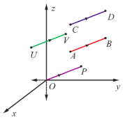
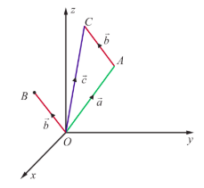
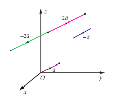

## 6.2 Geometric introduction to vectors

A vector $\bar{\nu}$ is represented as a directed straight line segment in a 3-dimensional space $\mathbb{R}^3$, with an initial point $A = (a_{1},a_{2},a_{3})\in \mathbb{R}^{3}$ and an end point $B = (b_{1},b_{2},b_{3})\in \mathbb{R}^{3}$, and it is denoted by $\overline{AB}$. The length of the line segment $AB$ is the magnitude of the vector $\bar{\nu}$ and the direction from $A$ to $B$ is the direction of the vector $\bar{\nu}$. Hereafter, a vector will be interchangeably denoted by $\bar{\nu}$ or $\overline{AB}$. Two vectors $\overline{AB}$ and $\overline{CD}$ in $\mathbb{R}^3$ are said to be equal if and only if the length $AB$ is equal to the length $CD$ and the direction from $A$ to $B$ is parallel to the direction from $C$ to $D$. If $\overline{AB}$ and $\overline{CD}$ are equal, we write $\overline{AB} = \overline{CD}$, and $\overline{CD}$ is called a translate of $\overline{AB}$.

It is easy to observe that every vector $\overline{AB}$ can be translated to anywhere in $\mathbb{R}^3$, equal to a vector with initial point $U\in \mathbb{R}^3$ and end point $V\in \mathbb{R}^3$ such that $\overline{AB} = \overline{UV}$. In particular, if $O$ is the origin of $\mathbb{R}^3$, then a point $P\in \mathbb{R}^3$ can be found such that $\overline{AB} = \overline{OP}$. The vector $\overline{OP}$ is called the position vector of the point $P$. Moreover, we observe that given any vector $\bar{\nu}$, there exists a unique point $P\in \mathbb{R}^3$ such that the position vector $\overline{OP}$ of $P$ is equal to $\bar{\nu}$. A vector $\overline{AB}$ is said to be the zero vector if the initial point $A$ is the same as the end point $B$. We use the standard notations $\hat{i},\hat{j},\hat{k}$ and $\bar{0}$ to denote the position vectors of the points $(1,0,0),(0,1,0),(0,0,1)$, and $(0,0,0)$, respectively. For a given point $(a_{1},a_{2},a_{3})\in \mathbb{R}^{3}$, $a_{1}\hat{i} + a_{2}\hat{j} + a_{3}\hat{k}$ is called the position vector of the point $(a_{1},a_{2},a_{3})$, which is the directed straight line segment with initial point $(0,0,0)$ and end point $(a_{1},a_{2},a_{3})$. All real numbers are called scalars.

Given a vector $\overline{AB}$, the length of the vector is calculated by

$$
\sqrt{(b_{1} - a_{1})^{2} + (b_{2} - a_{2})^{2} + (b_{3} - a_{3})^{2}},
$$

where $A$ is $(a_{1},a_{2},a_{3})$ and $B$ is $(b_{1},b_{2},b_{3})$. In particular, if a vector is the position vector $\vec{b}$ of $(b_{1},b_{2},b_{3})$, then its length is $\sqrt{b_{1}^{2} + b_{2}^{2} + b_{3}^{2}}$. A vector having length 1 is called a unit vector. We use the notation $\hat{u}$, for a unit vector. Note that $\hat{i},\hat{j}$, and $\hat{k}$ are unit vectors and $\vec{0}$ is the unique vector with length 0. The direction of $\vec{0}$ is specified according to the context.

The addition and scalar multiplication on vectors in 3-dimensional space are defined by

$$
\vec{a} +\vec{b} = (a_{1} + b_{1})\hat{i} + (a_{2} + b_{2})\hat{j} + (a_{3} + b_{3})\hat{k}.
$$

$$
\alpha \vec{a} = (\alpha a_{1})\hat{i} + (\alpha a_{2})\hat{j} + (\alpha a_{3})\hat{k};
$$

where

$$
\vec{a} = a_{1}\hat{i} + a_{2}\hat{j} + a_{3}\hat{k},\quad \vec{b} = b_{1}\hat{i} + b_{2}\hat{j} + b_{3}\hat{k}\in \mathbb{R}^{3}\quad \text{and}\quad \alpha \in \mathbb{R}.
$$

To see the geometric interpretation of $\vec{a} +\vec{b}$, let $\vec{a}$ and $\vec{b}$, denote the position vectors of $A = (a_{1},a_{2},a_{3})$ and $B = (b_{1},b_{2},b_{3})$, respectively. Translate the position vector $\vec{b}$ to the vector with initial point as $A$ and end point as $C = (c_{1},c_{2},c_{3})$, for a suitable $(c_{1},c_{2},c_{3})\in \mathbb{R}^{3}$. See the Fig (6.2). Then, the position vector $\vec{c}$ of the point $(c_{1},c_{2},c_{3})$ is equal to $\vec{a} +\vec{b}$.

The vector $\alpha \vec{a}$ is another vector parallel to $\vec{a}$ and its length is magnified (if $\alpha >1$) or contracted (if $0< \alpha < 1$). If $\alpha < 0$, then $\alpha \vec{a}$ is a vector whose magnitude is $|\alpha|$ times that of $\vec{a}$ and direction opposite to that of $\vec{a}$. In particular, if $\alpha = -1$, then $\alpha \vec{a} = -\vec{a}$ is the vector with same length and direction opposite to that of $\vec{a}$. See Fig. 6.3

