## 6.3 Scalar Product and Vector Product

Next we recall the scalar product and vector product of two vectors as follows.

> **Definition 6.1**
>
> Given two vectors $\vec{a} = a_{1}\hat{i} + a_{2}\hat{j} + a_{3}\hat{k}$ and $\vec{b} = b_{1}\hat{i} + b_{2}\hat{j} + b_{3}\hat{k}$ the scalar product (or dot product) is denoted by $\vec{a}\cdot \vec{b}$ and is calculated by
>
> $$
\vec{a}\cdot \vec{b} = a_{1}b_{1} + a_{2}b_{2} + a_{3}b_{3},
$$
>
>and the vector product (or cross product) is denoted by $\vec{a}\times \vec{b}$, and is calculated by
>
> $$
\vec{a}\times \vec{b} =
\begin{vmatrix}
\hat{i} & \hat{j} & \hat{k} \\
a_{1} & a_{2} & a_{3} \\
b_{1} & b_{2} & b_{3}
\end{vmatrix}.
$$

> **Note**
>
> $\vec{a}\cdot \vec{b}$ is a scalar, and $\vec{a}\times \vec{b}$ is a vector.

### 6.3.1 Geometrical interpretation

Geometrically, if $\vec{a}$ is an arbitrary vector and $\hat{n}$ is a unit vector, then $\vec{a}\cdot \hat{n}$ is the projection of the vector $\vec{a}$ on the straight line on which $\hat{n}$ lies. The quantity $\vec{a}\cdot \hat{n}$ is positive if the angle between $\vec{a}$ and $\hat{n}$ is acute, see Fig. 6.4 and negative if the angle between $\vec{a}$ and $\hat{n}$ is obtuse see Fig. 6.5.

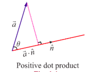

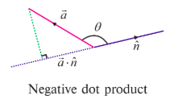

If $\vec{a}$ and $\vec{b}$ are arbitrary non-zero vectors, then $|\vec{a}\cdot \vec{b}| = |\vec{b}| \left|\vec{a}\cdot \left(\frac{\vec{b}}{|\vec{b}|}\right)\right| = |\vec{a}| \left|\vec{b}\cdot \left(\frac{\vec{a}}{|\vec{a}|}\right)\right|$ and so $|\vec{a}\cdot \vec{b}|$ means either the length of the straight line segment obtained by projecting the vector $|\vec{b}| \vec{a}$ along the direction of $\vec{b}$ or the length of the line segment obtained by projecting the vector $|\vec{a}| \vec{b}$ along the direction of $\vec{a}$. We recall that $\vec{a}\cdot \vec{b} = |\vec{a}| |\vec{b}| \cos \theta$, where $\theta$ is the angle between the two vectors $\vec{a}$ and $\vec{b}$. We recall that the angle between $\vec{a}$ and $\vec{b}$ is defined as the measure from $\vec{a}$ to $\vec{b}$ in the counter clockwise direction.

The vector $\vec{a}\times \vec{b}$ is either $\vec{0}$ or a vector perpendicular to the plane parallel to both $\vec{a}$ and $\vec{b}$ having magnitude as the area of the parallelogram formed by coterminus vectors parallel to $\vec{a}$ and $\vec{b}$. If $\vec{a}$ and $\vec{b}$ are non-zero vectors, then the magnitude of $\vec{a}\times \vec{b}$ can be calculated by the formula

$$
|\vec{a}\times \vec{b}| = |\vec{a}| |\vec{b}| |\sin \theta|, \text{where } \theta \text{ is the angle between } \vec{a} \text{ and } \vec{b}.
$$

Two vectors are said to be coterminus if they have same initial point.

> **Remark**
>
>(1) An angle between two non-zero vectors $\vec{a}$ and $\vec{b}$ is found by the following formula
>
>$$
\theta = \cos^{-1} \left( \frac{\vec{a}\cdot \vec{b}}{|\vec{a}| |\vec{b}|} \right).
$$
>
>(2) $\vec{a}$ and $\vec{b}$ are said to be parallel if the angle between them is $0$ or $\pi$.
>
>(3) $\vec{a}$ and $\vec{b}$ are said to be perpendicular if the angle between them is $\frac{\pi}{2}$ or $\frac{3\pi}{2}$.

**Property**

(1) Let $\vec{a}$ and $\vec{b}$ be any two nonzero vectors. Then

- $\vec{a}\cdot \vec{b} = 0$ if and only if $\vec{a}$ and $\vec{b}$ are perpendicular to each other.
- $\vec{a}\times \vec{b} = \vec{0}$ if and only if $\vec{a}$ and $\vec{b}$ are parallel to each other.

(2) If $\vec{a},\vec{b}$, and $\vec{c}$ are any three vectors and $\alpha$ is a scalar, then

$$
\vec{a}\cdot \vec{b} = \vec{b}\cdot \vec{a},\quad (\vec{a} +\vec{b})\cdot \vec{c} = \vec{a}\cdot \vec{b} +\vec{b}\cdot \vec{c},\quad (\alpha \vec{a})\cdot \vec{b} = \alpha (\vec{a}\cdot \vec{b}) = \vec{a}\cdot (\alpha \vec{b});
$$

$$
\vec{a}\times \vec{b} = -(\vec{b}\times \vec{a}),\quad (\vec{a} +\vec{b})\times \vec{c} = \vec{a}\times \vec{c} +\vec{b}\times \vec{c},\quad (\alpha \vec{a})\times \vec{b} = \alpha (\vec{a}\times \vec{b}) = \vec{a}\times (\alpha \vec{b}).
$$

### 6.3.2 Application of dot and cross products in plane Trigonometry

We apply the concepts of dot and cross products of two vectors to derive a few formulae in plane trigonometry.

**Example 6.1 (Cosine formulae)**

With usual notations, in any triangle $ABC$, prove the following by vector method.

$$
a^{2} = b^{2} + c^{2} - 2bc\cos A
$$

$$
c^{2} = a^{2} + b^{2} - 2ab\cos C
$$

**Solution**

With usual notations in triangle $ABC$, we have $\overline{BC} = \vec{a},\overline{CA} = \vec{b}$ and $\overline{AB} = \vec{c}$. Then $|\overline{BC}| = a,|\overline{CA}| = b$, $|\overline{AB}| = c$ and $\overline{BC} +\overline{CA} +\overline{AB} = \vec{0}$.

So, $\overline{BC} = -\overline{CA} -\overline{AB}$.

Then applying dot product, we get

$$
\overline{BC}\cdot \overline{BC} = (-\overline{CA} -\overline{AB})\cdot (-\overline{CA} -\overline{AB})
$$

$$
\Rightarrow |\overline{BC}|^{2} = |\overline{CA}|^{2} + |\overline{AB}|^{2} + 2\overline{CA}\cdot \overline{AB}
$$

$$
\Rightarrow a^{2} = b^{2} + c^{2} + 2bc\cos (\pi -A)
$$

$$
\Rightarrow a^{2} = b^{2} + c^{2} - 2bc\cos A.
$$

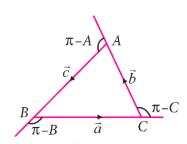

The results in (ii) and (iii) are proved in a similar way.

**Example 6.2**

With usual notations, in any triangle $ABC$, prove the following by vector method.

$$
a = b\cos C + c\cos B
$$

$$
c = a\cos B + b\cos A
$$

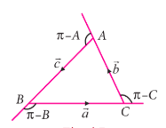

**Solution**

With usual notations in triangle $ABC$, we have $\overrightarrow{BC} = \vec{a}$, $\overrightarrow{CA} = \vec{b}$, and $\overrightarrow{AB} = \vec{c}$. Then

$$
|\overrightarrow{BC}| = a, |\overrightarrow{CA}| = b, |\overrightarrow{AB}| = c \text{ and } \overrightarrow{BC} +\overrightarrow{CA} +\overrightarrow{AB} = \vec{0}
$$

So, $\overrightarrow{BC} = -\overrightarrow{CA} -\overrightarrow{AB}$

Applying dot product, we get

$$
\overrightarrow{BC}\cdot \overrightarrow{BC} = -\overrightarrow{BC}\cdot \overrightarrow{CA} -\overrightarrow{BC}\cdot \overrightarrow{AB}
$$

$$
\Rightarrow |\overrightarrow{BC}|^{2} = -|\overrightarrow{BC}| |\overrightarrow{CA}| \cos (\pi -C) - |\overrightarrow{BC}| |\overrightarrow{AB}| \cos (\pi -B)
$$

$$
\Rightarrow a^{2} = ab\cos C + ac\cos B
$$

Therefore $a = b\cos C + c\cos B$. The results in (ii) and (iii) are proved in a similar way.

**Example 6.3**

By vector method, prove that $\cos (\alpha +\beta) = \cos \alpha \cos \beta - \sin \alpha \sin \beta$.

**Solution**

Let $\hat{a} = \overrightarrow{OA}$ and $\hat{b} = \overrightarrow{OB}$ be the unit vectors and which make angles $\alpha$ and $\beta$, respectively, with positive $x$-axis, where $A$ and $B$ are as in the Fig. 6.8. Draw $AL$ and $BM$ perpendicular to the $x$-axis. Then $|\overrightarrow{OL}| = |\overrightarrow{OA}| \cos \alpha = \cos \alpha$, $|\overrightarrow{LA}| = |\overrightarrow{OA}| \sin \alpha = \sin \alpha$.

$$
\overrightarrow{OL} = |\overrightarrow{OL}| \hat{i} = \cos \alpha \hat{i},\quad \overrightarrow{LA} = \sin \alpha (-\hat{j}).
$$

Therefore, $\hat{a} = \overrightarrow{OA} = \overrightarrow{OL} +\overrightarrow{LA} = \cos \alpha \hat{i} - \sin \alpha \hat{j}$ ... (1)

Similarly, $\hat{b} = \cos \beta \hat{i} + \sin \beta \hat{j}$ ... (2)

The angle between $\hat{a}$ and $\hat{b}$ is $\alpha +\beta$ and so,

$$
\hat{a}\cdot \hat{b} = |\hat{a}| |\hat{b}| \cos (\alpha +\beta) = \cos (\alpha +\beta) \quad \dots (3)
$$

On the other hand, from (1) and (2)

$$
\hat{a}\cdot \hat{b} = (\cos \alpha \hat{i} - \sin \alpha \hat{j})\cdot (\cos \beta \hat{i} + \sin \beta \hat{j}) = \cos \alpha \cos \beta - \sin \alpha \sin \beta \dots (4)
$$

From (3) and (4), we get $\cos (\alpha +\beta) = \cos \alpha \cos \beta - \sin \alpha \sin \beta$.

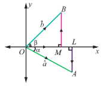

**Example 6.4**

With usual notations, in any triangle $ABC$, prove by vector method that $\frac{a}{\sin A} = \frac{b}{\sin B} = \frac{c}{\sin C}$.

**Solution**

With usual notations in triangle $ABC$, we have $\overrightarrow{BC} = \vec{a},\overrightarrow{CA} = \vec{b}$, and $\overrightarrow{AB} = \vec{c}$. Then $|\overrightarrow{BC}| = a$, $|\overrightarrow{CA}| = b$ and $|\overrightarrow{AB}| = c$.

Since in $\Delta ABC$, $\overrightarrow{BC} +\overrightarrow{CA} +\overrightarrow{AB} = 0$, we have $\overrightarrow{BC}\times (\overrightarrow{BC} +\overrightarrow{CA} +\overrightarrow{AB}) = \vec{0}$.

Simplification gives,

$$
\overrightarrow{BC}\times \overrightarrow{CA} = \overrightarrow{AB}\times \overrightarrow{BC}.
$$

Similarly, since $\overrightarrow{BC} +\overrightarrow{CA} +\overrightarrow{AB} = \vec{0}$, we have

$$
\overrightarrow{CA}\times (\overrightarrow{BC} +\overrightarrow{CA} +\overrightarrow{AB}) = \vec{0}.
$$

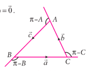

On Simplification, we obtain $\overrightarrow{BC}\times \overrightarrow{CA} = \overrightarrow{CA}\times \overrightarrow{AB}$ ... (2)

Equations (1) and (2), we get

$$
\overrightarrow{AB}\times \overrightarrow{BC} = \overrightarrow{CA}\times \overrightarrow{AB} = \overrightarrow{BC}\times \overrightarrow{CA}.
$$

So, $|\overrightarrow{AB}\times \overrightarrow{BC}| = |\overrightarrow{CA}\times \overrightarrow{AB}| = |\overrightarrow{BC}\times \overrightarrow{CA}|$.

$$
ca\sin (\pi -B) = bc\sin (\pi -A) = ab\sin (\pi -C).
$$

That is, $ca\sin B = bc\sin A = ab\sin C$. Dividing by $abc$, leads to

$$
\frac{\sin A}{a} = \frac{\sin B}{b} = \frac{\sin C}{c} \quad \text{or} \quad \frac{a}{\sin A} = \frac{b}{\sin B} = \frac{c}{\sin C}.
$$

**Example 6.5**

Prove by vector method that $\sin (\alpha - \beta) = \sin \alpha \cos \beta - \cos \alpha \sin \beta$.

**Solution**

Let $\hat{a} = \overline{OA}$ and $\vec{b} = \overline{OB}$ be the unit vectors making angles $\alpha$ and $\beta$ respectively, with positive $x$-axis, where $A$ and $B$ are as shown in the Fig. 6.10. Then, we get $\hat{a} = \cos \alpha \hat{i} + \sin \alpha \hat{j}$ and $\hat{b} = \cos \beta \hat{i} + \sin \beta \hat{j}$.

The angle between $\hat{a}$ and $\hat{b}$ is $\alpha - \beta$ and, the vectors $\hat{b},\hat{a},\hat{k}$ form a right-handed system.

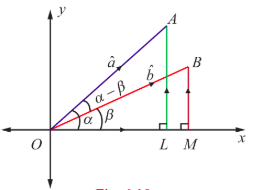

Hence, we get

$$
\hat{b}\times \hat{a} = |\hat{b}| |\hat{a}| \sin (\alpha -\beta)\hat{k} = \sin (\alpha -\beta)\hat{k}. \quad (1)
$$

On the other hand,

$$
\hat{b}\times \hat{a} =
\begin{vmatrix}
\hat{i} & \hat{j} & \hat{k} \\
\cos \beta & \sin \beta & 0 \\
\cos \alpha & \sin \alpha & 0
\end{vmatrix} = (\sin \alpha \cos \beta - \cos \alpha \sin \beta)\hat{k} \quad (2)
$$

Hence, equations (1) and (2), leads to

$$
\sin (\alpha -\beta) = \sin \alpha \cos \beta - \cos \alpha \sin \beta.
$$

### 6.3.3 Application of dot and cross products in Geometry

**Example 6.6 (Apollonius's theorem)**

If $D$ is the midpoint of the side $BC$ of a triangle $ABC$, show by vector method that $|\overline{AB}|^{2} + |\overline{AC}|^{2} = 2(|\overline{AD}|^{2} + |\overline{BD}|^{2})$.

**Solution**

Let $A$ be the origin, $\vec{b}$ be the position vector of $B$ and $\vec{c}$ be the position vector of $C$. Now $D$ is the midpoint of $BC$, and so the, position vector of $D$ is $\frac{\vec{b} + \vec{c}}{2}$. Therefore, we have

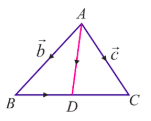

$$
|\overline{AD}|^{2} = \overline{AD}\cdot \overline{AD} = \left(\frac{\bar{b} + \bar{c}}{2}\right)\cdot \left(\frac{\bar{b} + \bar{c}}{2}\right) = \frac{1}{4} (|\bar{b}|^{2} + |\bar{c}|^{2} + 2\bar{b}\cdot \bar{c}). \quad (1)
$$

Now, $\overline{BD} = \overline{AD} - \overline{AB} = \frac{\bar{b} + \bar{c}}{2} - \bar{b} = \frac{\bar{c} - \bar{b}}{2}$.

Then, this gives,

$$
|\overline{BD}|^{2} = \overline{BD}\cdot \overline{BD} = \left(\frac{\bar{c} - \bar{b}}{2}\right)\cdot \left(\frac{\bar{c} - \bar{b}}{2}\right) = \frac{1}{4} (|\bar{b}|^{2} + |\bar{c}|^{2} - 2\bar{b}\cdot \bar{c}) \quad (2)
$$

Now, adding (1) and (2), we get

$$
|\overline{AD}|^{2} + |\overline{BD}|^{2} = \frac{1}{4} (|\bar{b}|^{2} + |\bar{c}|^{2} + 2\bar{b}\cdot \bar{c}) + \frac{1}{4} (|\bar{b}|^{2} + |\bar{c}|^{2} - 2\bar{b}\cdot \bar{c}) = \frac{1}{2} (|\bar{b}|^{2} + |\bar{c}|^{2})
$$

$$
\Rightarrow |\overline{AD}|^{2} + |\overline{BD}|^{2} = \frac{1}{2} (|\overline{AB}|^{2} + |\overline{AC}|^{2}).
$$

Hence, $|\overline{AB}|^{2} + |\overline{AC}|^{2} = 2(|\overline{AD}|^{2} + |\overline{BD}|^{2})$.

**Example 6.7**

Prove by vector method that the perpendiculars (altitudes) from the vertices to the opposite sides of a triangle are concurrent.

**Solution**

Consider a triangle ABC in which the two altitudes AD and BE intersect at O. Let CO be produced to meet AB at F. We take O as the origin and let $\overline{OA} = \overline{a},\overline{OB} = \overline{b}$ and $\overline{OC} = \overline{c}$.

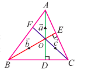

Since $\overline{AD}$ is perpendicular to $\overline{BC}$, we have $\overline{OA}$ is perpendicular to $\overline{BC}$, and hence we get $\overline{OA}\cdot \overline{BC} = 0$. That is, $\overline{a}\cdot (\overline{c} - \overline{b}) = 0$, which means

$$
\overline{a}\cdot \overline{c} - \overline{a}\cdot \overline{b} = 0. \quad (1)
$$

Similarly, since $\overline{BE}$ is perpendicular to $\overline{CA}$, we have $\overline{OB}$ is perpendicular to $\overline{CA}$, and hence we get $\overline{OB}\cdot \overline{CA} = 0$. That is, $\overline{b}\cdot (\overline{a} - \overline{c}) = 0$, which means,

$$
\overline{a}\cdot \overline{b} - \overline{b}\cdot \overline{c} = 0. \quad (2)
$$

Adding equations (1) and (2), gives $\overline{a}\cdot \overline{c} - \overline{b}\cdot \overline{c} = 0$. That is, $\overline{c}\cdot (\overline{a} - \overline{b}) = 0$.

That is, $\overline{OC}\cdot \overline{BA} = 0$. Therefore, $\overline{BA}$ is perpendicular to $\overline{OC}$ which implies that $\overline{CF}$ is perpendicular to $\overline{AB}$. Hence, the perpendicular drawn from C to the side AB passes through O. Thus, the altitudes are concurrent.

**Example 6.8**

In triangle ABC, the points D, E, F are the midpoints of the sides BC, CA, and AB respectively. Using vector method, show that the area of $\Delta DEF$ is equal to $\frac{1}{4}$ (area of $\Delta ABC$).

**Solution**

In triangle $ABC$, consider $A$ as the origin. Then the position vectors of $D,E,F$ are given by $\frac{\overline{AB} + \overline{AC}}{2}, \frac{\overline{AC}}{2}, \frac{\overline{AB}}{2}$ respectively. Since $|\overline{AB}\times \overline{AC}|$ is the area of the parallelogram formed by the two vectors $\overline{AB}$ and $\overline{AC}$ as adjacent sides, the area of $\Delta ABC$ is $\frac{1}{2} |\overline{AB}\times \overline{AC}|$.

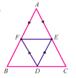

Similarly, considering $\Delta DEF$, we have the area of $\Delta DEF = \frac{1}{2} |\overline{DE}\times \overline{DF}|$.

Now, $\overline{DE} = \frac{\overline{AC}}{2} - \frac{\overline{AB} + \overline{AC}}{2} = -\frac{\overline{AB}}{2}$ and $\overline{DF} = \frac{\overline{AB}}{2} - \frac{\overline{AB} + \overline{AC}}{2} = -\frac{\overline{AC}}{2}$.

Hence, $\overline{DE}\times \overline{DF} = \left(-\frac{\overline{AB}}{2}\right) \times \left(-\frac{\overline{AC}}{2}\right) = \frac{1}{4} (\overline{AB}\times \overline{AC})$.

Therefore, area of $\Delta DEF = \frac{1}{2} |\overline{DE}\times \overline{DF}| = \frac{1}{2} \cdot \frac{1}{4} |\overline{AB}\times \overline{AC}| = \frac{1}{4} \left( \frac{1}{2} |\overline{AB}\times \overline{AC}| \right) = \frac{1}{4} (\text{area of } \Delta ABC)$.

### 6.3.4 Application of dot and cross product in Physics

> **Definition 6.2**
> 
> If $\vec{d}$ is the displacement vector of a particle moved from a point to another point after applying a constant force $\vec{F}$ on the particle, then the work done by the force on the particle is $w = \vec{F}\cdot \vec{d}$.

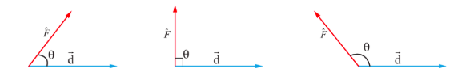

If the force has an acute angle, perpendicular angle, and an obtuse angle, the work done by the force is positive, zero, and negative respectively.

**Example 6.9**

A particle acted upon by constant forces $2\hat{i} +5\hat{j} +6\hat{k}$ and $-\hat{i} - 2\hat{j} - \hat{k}$ is displaced from the point $(4, -3, -2)$ to the point $(6,1, -3)$. Find the total work done by the forces.

**Solution**

Resultant of the given forces is $\vec{F} = (2\hat{i} +5\hat{j} +6\hat{k}) + (-\hat{i} - 2\hat{j} - \hat{k}) = \hat{i} +3\hat{j} +5\hat{k}$.

Let $A$ and $B$ be the points $(4, -3, -2)$ and $(6,1, -3)$ respectively. Then the displacement vector of the particle is $\vec{d} = \overline{AB} = \overline{OB} -\overline{OA} = (6\hat{i} +\hat{j} - 3\hat{k}) - (4\hat{i} - 3\hat{j} - 2\hat{k}) = 2\hat{i} +4\hat{j} - \hat{k}$.

Therefore the work done $w = \vec{F}\cdot \vec{d} = (\hat{i} +3\hat{j} +5\hat{k})\cdot (2\hat{i} +4\hat{j} - \hat{k}) = 9$ units.

**Example 6.10**

A particle is acted upon by the forces $3\hat{i} - 2\hat{j} +2\hat{k}$ and $2\hat{i} +\hat{j} -\hat{k}$ is displaced from the point $(1,3, -1)$ to the point $(4, -1,\lambda)$. If the work done by the forces is 16 units, find the value of $\lambda$.

**Solution**

Resultant of the given forces is $\vec{F} = (3\hat{i} - 2\hat{j} +2\hat{k}) + (2\hat{i} +\hat{j} -\hat{k}) = 5\hat{i} -\hat{j} +\hat{k}$.

The displacement of the particle is given by

$$
\vec{d} = (4\hat{i} -\hat{j} +\lambda \hat{k}) - (\hat{i} +3\hat{j} -\hat{k}) = (3\hat{i} -4\hat{j} +(\lambda +1)\hat{k}).
$$

As the work done by the forces is 16 units, we have

$$
\vec{F}\cdot \vec{d} = 16.
$$

That is, $(5\hat{i} -\hat{j} +\hat{k})\cdot (3\hat{i} -4\hat{j} +(\lambda +1)\hat{k}) = 16 \Rightarrow \lambda + 20 = 16$.

So, $\lambda = -4$.

> **Definition 6.3**
>
> If a force $\vec{F}$ is applied on a particle at a point with position vector $\vec{r}$, then the torque or moment on the particle is given by $\vec{t} = \vec{r}\times \vec{F}$. The torque is also called the rotational force.

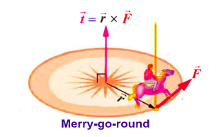

**Example 6.11**

Find the magnitude and the direction cosines of the torque about the point $(2,0, -1)$ of a force $2\hat{i} +\hat{j} -\hat{k}$, whose line of action passes through the origin.

**Solution**

Let $A$ be the point $(2,0, -1)$. Then the position vector of $A$ is $\overrightarrow{OA} = 2\hat{i} -\hat{k}$ and therefore $\vec{r} = \overrightarrow{AO} = -2\hat{i} +\hat{k}$.

Then the given force is $\vec{F} = 2\hat{i} +\hat{j} -\hat{k}$. So, the torque is

$$
\vec{t} = \vec{r}\times \vec{F} =
\begin{vmatrix}
\hat{i} & \hat{j} & \hat{k} \\
-2 & 0 & 1 \\
2 & 1 & -1
\end{vmatrix} = \hat{i}(0 \cdot (-1) - 1 \cdot 1) - \hat{j}((-2)(-1) - 1 \cdot 2) + \hat{k}((-2) \cdot 1 - 0 \cdot 2) = -\hat{i} - 0\hat{j} - 2\hat{k}.
$$

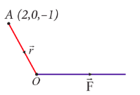

The magnitude of the torque $= |-\hat{i} - 2\hat{k}| = \sqrt{1 + 4} = \sqrt{5}$ and the direction cosines of the torque are $-\frac{1}{\sqrt{5}}, 0, -\frac{2}{\sqrt{5}}$.

**Exercise 6.1**

1. Prove by vector method that if a line is drawn from the centre of a circle to the midpoint of a chord, then the line is perpendicular to the chord.
2. Prove by vector method that the median to the base of an isosceles triangle is perpendicular to the base.
3. Prove by vector method that an angle in a semi-circle is a right angle.
4. Prove by vector method that the diagonals of a rhombus bisect each other at right angles.
5. Using vector method, prove that if the diagonals of a parallelogram are equal, then it is a rectangle.
6. Prove by vector method that the area of the quadrilateral ABCD having diagonals AC and BD is $\frac{1}{2} |\overrightarrow{AC} \times \overrightarrow{BD}|$.
7. Prove by vector method that the parallelograms on the same base and between the same parallels are equal in area.
8. If $G$ is the centroid of a $\Delta ABC$, prove that (area of $\Delta GAB$) = (area of $\Delta GBC$) = (area of $\Delta GCA$) = $\frac{1}{3}$ (area of $\Delta ABC$).
9. Using vector method, prove that $\cos (\alpha - \beta) = \cos \alpha \cos \beta + \sin \alpha \sin \beta$.
10. Prove by vector method that $\sin (\alpha + \beta) = \sin \alpha \cos \beta + \cos \alpha \sin \beta$.
11. A particle acted on by constant forces $8\vec{i} + 2\vec{j} - 6\vec{k}$ and $6\vec{i} + 2\vec{j} - 2\vec{k}$ is displaced from the point $(1,2,3)$ to the point $(5,4,1)$. Find the total work done by the forces.
12. Forces of magnitudes $5\sqrt{2}$ and $10\sqrt{2}$ units acting in the directions $3\vec{i} + 4\vec{j} + 5\vec{k}$ and $10\vec{i} + 6\vec{j} - 8\vec{k}$, respectively, act on a particle which is displaced from the point with position vector $4\vec{i} - 3\vec{j} - 2\vec{k}$ to the point with position vector $6\vec{i} + \vec{j} - 3\vec{k}$. Find the work done by the forces.
13. Find the magnitude and direction cosines of the torque of a force represented by $3\vec{i} + 4\vec{j} - 5\vec{k}$ about the point with position vector $2\vec{i} - 3\vec{j} + 4\vec{k}$ acting through a point whose position vector is $4\vec{i} + 2\vec{j} - 3\vec{k}$.
14. Find the torque of the resultant of the three forces represented by $-3\vec{i} + 6\vec{j} - 3\vec{k}$, $4\vec{i} - 10\vec{j} + 12\vec{k}$ and $4\vec{i} + 7\vec{j}$ acting at the point with position vector $8\vec{i} - 6\vec{j} - 4\vec{k}$, about the point with position vector $18\vec{i} + 3\vec{j} - 9\vec{k}$.
