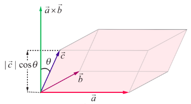

## 6.4 Scalar triple product

> **Definition 6.4**
>
> For a given set of three vectors $\vec{a}, \vec{b}$, and $\vec{c}$, the scalar $(\vec{a} \times \vec{b}) \cdot \vec{c}$ is called a scalar triple product of $\vec{a}, \vec{b}, \vec{c}$.

> **Remark**
>
> $\vec{a} \cdot \vec{b}$ is a scalar and so $(\vec{a} \cdot \vec{b}) \times \vec{c}$ has no meaning.

> **Note**
>
> Given any three vectors $\vec{a}$, $\vec{b}$ and $\vec{c}$, the following are scalar triple products:
>
> $(\vec{a} \times \vec{b}) \cdot \vec{c}$, $(\vec{b} \times \vec{c}) \cdot \vec{a}$, $(\vec{c} \times \vec{a}) \cdot \vec{b}$, $\vec{a} \cdot (\vec{b} \times \vec{c})$, $\vec{b} \cdot (\vec{c} \times \vec{a})$, $\vec{c} \cdot (\vec{a} \times \vec{b})$,
>
> $(\vec{b} \times \vec{a}) \cdot \vec{c}$, $(\vec{c} \times \vec{b}) \cdot \vec{a}$, $(\vec{a} \times \vec{c}) \cdot \vec{b}$, $\vec{a} \cdot (\vec{c} \times \vec{b})$, $\vec{b} \cdot (\vec{a} \times \vec{c})$, $\vec{c} \cdot (\vec{b} \times \vec{a})$

**Geometrical interpretation of scalar triple product**

Geometrically, the absolute value of the scalar triple product $(\vec{a} \times \vec{b}) \cdot \vec{c}$ is the volume of the parallelepiped formed by using the three vectors $\vec{a}, \vec{b}$ , and $\vec{c}$ as co-terminus edges. Indeed, the magnitude of the vector $(\vec{a} \times \vec{b})$ is the area of the parallelogram formed by using $\vec{a}$ and $\vec{b}$ ; and the direction of the vector $(\vec{a} \times \vec{b})$ is perpendicular to the plane parallel to both $\vec{a}$ and $\vec{b}$ .

Therefore, $|\vec{a} \times \vec{b}| \cdot |\vec{c}| \cdot |\cos \theta|$ , where $\theta$ is the angle between $\vec{a} \times \vec{b}$ and $\vec{c}$ . From Fig. 6.17, we observe that $|\vec{c}| \cdot |\cos \theta|$ is the height of the parallelepiped formed by using the three vectors as adjacent vectors. Thus, $|\vec{a} \times \vec{b}| \cdot |\vec{c}| \cdot |\cos \theta|$ is the volume of the parallelepiped.

The following theorem is useful for computing scalar triple products.

> **Theorem 6.1**
>
> If $\vec{a} = a_1 \hat{i} + a_2 \hat{j} + a_3 \hat{k}, \, \vec{b} = b_1 \hat{i} + b_2 \hat{j} + b_3 \hat{k}$ and $\vec{c} = c_1 \hat{i} + c_2 \hat{j} + c_3 \hat{k}$ , then

$$
(\vec{a} \times \vec{b}) \cdot \vec{c} =
\left|
\begin{array}{ccc}
a_1 & a_2 & a_3 \\
b_1 & b_2 & b_3 \\
c_1 & c_2 & c_3
\end{array}
\right|.
$$

**Proof**

By definition, we have

$$
\begin{aligned}
(\vec{a} \times \vec{b}) \cdot \vec{c}
&=
\begin{vmatrix}
\hat{i} & \hat{j} & \hat{k}\\
a_1 & a_2 & a_3\\
b_1 & b_2 & b_3
\end{vmatrix}
\cdot \vec{c}
\\[1ex]
&=
\left[
(a_2b_3-a_3b_2)\hat{i}
-(a_1b_3-a_3b_1)\hat{j}
+(a_1b_2-a_2b_1)\hat{k}
\right]
\cdot
(c_1\hat{i}+c_2\hat{j}+c_3\hat{k})
\\[1ex]
&=
(a_2b_3-a_3b_2)c_1
+(a_3b_1-a_1b_3)c_2
+(a_1b_2-a_2b_1)c_3
\\[1ex]
&=
\begin{vmatrix}
a_1&a_2&a_3\\
b_1&b_2&b_3\\
c_1&c_2&c_3
\end{vmatrix}
\end{aligned}
$$

which completes the proof of the theorem.

### 6.4.1 Properties of the scalar triple product

> **Theorem 6.2**
>
> For any three vectors $\vec{a}, \vec{b},$ and $\vec{c}, \, (\vec{a} \times \vec{b}) \cdot \vec{c} = \vec{a} \cdot (\vec{b} \times \vec{c})$ .

**Proof**

Let $\vec{a} = a_1\hat{i} + a_2\hat{j} + a_3\hat{k}$ , $\vec{b} = b_1\hat{i} + b_2\hat{j} + b_3\hat{k}$ and $\vec{c} = c_1\hat{i} + c_2\hat{j} + c_3\hat{k}$ .

Then, $\vec{a} \cdot (\vec{b} \times \vec{c}) = (\vec{b} \times \vec{c}) \cdot \vec{a} = \left| \begin{array}{ccc} b_1 & b_2 & b_3 \\ c_1 & c_2 & c_3 \\ a_1 & a_2 & a_3 \end{array} \right| = \left| \begin{array}{ccc} a_1 & a_2 & a_3 \\ b_1 & b_2 & b_3 \\ c_1 & c_2 & c_3 \end{array} \right|$ , by $R_1 \leftrightarrow R_3$

$= \left| \begin{array}{ccc} a_1 & a_2 & a_3 \\ b_1 & b_2 & b_3 \\ c_1 & c_2 & c_3 \end{array} \right|$ , by $R_2 \leftrightarrow R_3$

$= (\vec{a} \times \vec{b}) \cdot \vec{c}$ .

Hence the theorem is proved.

> **Note**
>
> By Theorem 6.2, it follows that, in a scalar triple product, dot and cross can be interchanged without altering the order of occurrences of the vectors, by placing the parentheses in such a way that dot lies outside the parentheses, and cross lies between the vectors inside the parentheses. For instance, we have
>
> $$
(\vec{a}\times \vec{b})\cdot \vec{c} = \vec{a}\cdot (\vec{b}\times \vec{c}), \text{ since dot and cross can be interchanged.}
$$
>
> $$
= (\vec{b}\times \vec{c})\cdot \vec{a}, \text{ since dot product is commutative.}
$$
>
> $$
= \vec{b}\cdot (\vec{c}\times \vec{a}), \text{ since dot and cross can be interchanged}
$$
>
> $$
= (\vec{c}\times \vec{a})\cdot \vec{b}, \text{ since dot product is commutative}
$$
>
> $$
= \vec{c}\cdot (\vec{a}\times \vec{b}), \text{ since dot and cross can be interchanged}
$$

**Notation**

For any three vectors $\vec{a},\vec{b}$ and $\vec{c}$, the scalar triple product $(\vec{a}\times \vec{b})\cdot \vec{c}$ is denoted by $[\vec{a},\vec{b},\vec{c}]$.

$[\vec{a},\vec{b},\vec{c}]$ is read as box $\vec{a},\vec{b},\vec{c}$. For this reason and also because the absolute value of a scalar triple product represents the volume of a box (rectangular parallelepiped), a scalar triple product is also called a box product.

> **Note**
>
> $$
[\vec{a},\vec{b},\vec{c}] = (\vec{a}\times \vec{b})\cdot \vec{c} = \vec{a}\cdot (\vec{b}\times \vec{c}) = (\vec{b}\times \vec{c})\cdot \vec{a} = \vec{b}\cdot (\vec{c}\times \vec{a}) = [\vec{b},\vec{c},\vec{a}]
$$
>
> $$
[\vec{b},\vec{c},\vec{a}] = (\vec{b}\times \vec{c})\cdot \vec{a} = \vec{b}\cdot (\vec{c}\times \vec{a}) = (\vec{c}\times \vec{a})\cdot \vec{b} = \vec{c}\cdot (\vec{a}\times \vec{b}) = [\vec{c},\vec{a},\vec{b}].
$$
>
> In other words, $[\vec{a},\vec{b},\vec{c}] = [\vec{b},\vec{c},\vec{a}] = [\vec{c},\vec{a},\vec{b}]$; that is, if the three vectors are permuted in the same cyclic order, the value of the scalar triple product remains the same.
>
> (2) If any two vectors are interchanged in their position in a scalar triple product, then the value of the scalar triple product is $(-1)$ times the original value. More explicitly,
>
> $$
[\vec{a},\vec{b},\vec{c}] = [\vec{b},\vec{c},\vec{a}] = [\vec{c},\vec{a},\vec{b}] = -[\vec{a},\vec{c},\vec{b}] = -[\vec{c},\vec{b},\vec{a}] = -[\vec{b},\vec{a},\vec{c}]
$$

> **Theorem 6.3**
>
> The scalar triple product preserves addition and scalar multiplication. That is,
>
> $[(\vec{a} + \vec{b}), \vec{c}, \vec{d}] = [\vec{a}, \vec{c}, \vec{d}] + [\vec{b}, \vec{c}, \vec{d}]$ ;
>
> $[\lambda \vec{a}, \vec{b}, \vec{c}] = \lambda [\vec{a}, \vec{b}, \vec{c}]$ , $\forall \lambda \in \mathbb{R}$
>
> $[\vec{a}, (\vec{b} + \vec{c}), \vec{d}] = [\vec{a}, \vec{b}, \vec{d}] + [\vec{a}, \vec{c}, \vec{d}]$ ;
>
> $[\vec{a}, \lambda \vec{b}, \vec{c}] = \lambda [\vec{a}, \vec{b}, \vec{c}]$ , $\forall \lambda \in \mathbb{R}$
>
> $[\vec{a}, \vec{b}, (\vec{c} + \vec{d})] = [\vec{a}, \vec{b}, \vec{c}] + [\vec{a}, \vec{b}, \vec{d}]$ ;
>
> $[\vec{a}, \vec{b}, \lambda \vec{c}] = \lambda [\vec{a}, \vec{b}, \vec{c}]$ , $\forall \lambda \in \mathbb{R}$ .

**Proof**

Using the properties of scalar product and vector product, we get

$[(\vec{a} + \vec{b}), \vec{c}, \vec{d}] = ((\vec{a} + \vec{b}) \times \vec{c}) \cdot \vec{d}$

$= (\vec{a} \times \vec{c} + \vec{b} \times \vec{c}) \cdot \vec{d}$

$= (\vec{a} \times \vec{c}) \cdot \vec{d} + (\vec{b} \times \vec{c}) \cdot \vec{d}$

$= [\vec{a}, \vec{c}, \vec{d}] + [\vec{b}, \vec{c}, \vec{d}]$

$[\lambda \vec{a}, \vec{b}, \vec{c}] = ((\lambda \vec{a}) \times \vec{b}) \cdot \vec{c} = (\lambda (\vec{a} \times \vec{b})) \cdot \vec{c} = \lambda ((\vec{a} \times \vec{b}) \cdot \vec{c}) = \lambda [\vec{a}, \vec{b}, \vec{c}]$ .

Using the first statement of this result, we get the following.

$[\vec{a}, (\vec{b} + \vec{c}), \vec{d}] = [(\vec{b} + \vec{c}), \vec{d}, \vec{a}] = [\vec{b}, \vec{d}, \vec{a}] + [\vec{c}, \vec{d}, \vec{a}]$

$= [\vec{a}, \vec{b}, \vec{d}] + [\vec{a}, \vec{c}, \vec{d}]$

$[\vec{a}, \lambda \vec{b}, \vec{c}] = [\lambda \vec{b}, \vec{c}, \vec{a}] = \lambda [\vec{b}, \vec{c}, \vec{a}] = \lambda [\vec{a}, \vec{b}, \vec{c}]$ .

Similarly, the remaining equalities are proved.

We have studied about coplanar vectors in XI standard as three nonzero vectors of which, one can be expressed as a linear combination of the other two. Now we use scalar triple product for the characterisation of coplanar vectors.

> **Theorem 6.4**
>
> The scalar triple product of three non-zero vectors is zero if, and only if, the three vectors are coplanar.

**Proof**

Let $\vec{a}, \vec{b}, \vec{c}$ be any three non-zero vectors. Then,

$(\vec{a} \times \vec{b}) \cdot \vec{c} = 0 \iff \vec{c}$ is perpendicular to $\vec{a} \times \vec{b}$

$\iff \vec{c}$ lies in the plane which is parallel to both $\vec{a}$ and $\vec{b}$

$\iff \vec{a}, \vec{b}, \vec{c}$ are coplanar.

> **Theorem 6.5**
>
> Three vectors $\vec{a}, \vec{b}, \vec{c}$ are coplanar if, and only if, there exist scalars $r, s, t \in \mathbb{R}$ such that atleast one of them is non-zero and $r\vec{a} + s\vec{b} + t\vec{c} = \vec{0}$ .

**Proof**

Let $\vec{a} = a_{1}\hat{i} + a_{2}\hat{j} + a_{3}\hat{k}$, $\vec{b} = b_{1}\hat{i} + b_{2}\hat{j} + b_{3}\hat{k}$, $\vec{c} = c_{1}\hat{i} + c_{2}\hat{j} + c_{3}\hat{k}$. Then, we have

$$
[\vec{a}, \vec{b}, \vec{c}] =
\begin{vmatrix}
a_{1} & a_{2} & a_{3} \\
b_{1} & b_{2} & b_{3} \\
c_{1} & c_{2} & c_{3}
\end{vmatrix}.
$$

The vectors $\vec{a}, \vec{b}, \vec{c}$ are coplanar if and only if the above determinant is zero.

$\Leftrightarrow$ there exist scalars $r,s,t\in \mathbb{R}$ at least one of them non-zero such that

$$
a_{1}r + a_{2}s + a_{3}t = 0,\quad b_{1}r + b_{2}s + b_{3}t = 0,\quad c_{1}r + c_{2}s + c_{3}t = 0
$$

$\Leftrightarrow$ there exist scalars $r,s,t\in \mathbb{R}$ at least one of them non-zero such that $r\vec{a} + s\vec{b} + t\vec{c} = \vec{0}$.

> **Theorem 6.6**
>
> If $\vec{a}, \vec{b}, \vec{c}$ and $\vec{p}, \vec{q}, \vec{r}$ are any two systems of three vectors, and if $\vec{p} = x_1 \vec{a} + y_1 \vec{b} + z_1 \vec{c}$ ,  
> $\vec{q} = x_2 \vec{a} + y_2 \vec{b} + z_2 \vec{c}$ , and, $\vec{r} = x_3 \vec{a} + y_3 \vec{b} + z_3 \vec{c}$ , then
>
> $$\begin{bmatrix} \vec{p}, \vec{q}, \vec{r} \end{bmatrix} = \left| \begin{array}{ccc} x_1 & y_1 & z_1 \\ x_2 & y_2 & z_2 \\ x_3 & y_3 & z_3 \end{array} \right| \begin{bmatrix} \vec{a}, \vec{b}, \vec{c} \end{bmatrix} .$$

> **Note**
>
> By theorem 6.6, if $\vec{a},\vec{b},\vec{c}$ are non-coplanar and
>
> $$
\begin{vmatrix}
x_{1} & y_{1} & z_{1} \\
x_{2} & y_{2} & z_{2} \\
x_{3} & y_{3} & z_{3}
\end{vmatrix} \neq 0,
$$
>
> then the three vectors $\overrightarrow{p} = x_{1}\vec{a} + y_{1}\vec{b} + z_{1}\vec{c}$, $\vec{q} = x_{2}\vec{a} + y_{2}\vec{b} + z_{2}\vec{c}$, and $\vec{r} = x_{3}\vec{a} + y_{3}\vec{b} + z_{3}\vec{c}$ are also non-coplanar.

**Example 6.12**

If $\vec{a} = -3\hat{i} - \hat{j} + 5\hat{k}$ , $\vec{b} = \hat{i} - 2\hat{j} + \hat{k}$ , $\vec{c} = 4\hat{j} - 5\hat{k}$ , find $\vec{a} \cdot (\vec{b} \times \vec{c})$ .

**Solution:** By the definition of scalar triple product of three vectors,

$\vec{a} \cdot (\vec{b} \times \vec{c}) = \left| \begin{array}{ccc} -3 & -1 & 5 \\ 1 & -2 & 1 \\ 0 & 4 & -5 \end{array} \right| = -3$ .

**Example 6.13**

Find the volume of the parallelepiped whose coterminus edges are given by the vectors  
$2\hat{i} - 3\hat{j} + 4\hat{k}$ , $\hat{i} + 2\hat{j} - \hat{k}$ and $3\hat{i} - \hat{j} + 2\hat{k}$ .

**Solution**

We know that the volume of the parallelepiped whose coterminus edges are $\vec{a}, \vec{b}, \vec{c}$ is given by $|[\vec{a}, \vec{b}, \vec{c}]|$ .  
Here, $\vec{a} = 2\hat{i} - 3\hat{j} + 4\hat{k}$ , $\vec{b} = \hat{i} + 2\hat{j} - \hat{k}$ , $\vec{c} = 3\hat{i} - \hat{j} + 2\hat{k}$ .

Since

$[\vec{a}, \vec{b}, \vec{c}] = \left| \begin{array}{ccc} 2 & -3 & 4 \\ 1 & 2 & -1 \\ 3 & -1 & 2 \end{array} \right| = -7$ ,

the volume of the parallelepiped is $|-7| = 7$ cubic units.

**Example 6.14**

Show that the vectors $\hat{i} + 2\hat{j} - 3\hat{k}$ , $\hat{i} - \hat{j} + 2\hat{k}$ and $3\hat{i} + \hat{j} - \hat{k}$ are coplanar.

**Solution**

Here, $\vec{a} = \hat{i} + 2\hat{j} - 3\hat{k}$ , $\vec{b} = \hat{i} - \hat{j} + 2\hat{k}$ , $\vec{c} = 3\hat{i} + \hat{j} - \hat{k}$ .

We know that $\vec{a}, \vec{b}, \vec{c}$ are coplanar if and only if $[\vec{a}, \vec{b}, \vec{c}] = 0$ .  
Now,

$[\vec{a}, \vec{b}, \vec{c}] = \left| \begin{array}{ccc} 1 & 2 & -3 \\ 2 & -1 & 2 \\ 3 & 1 & -1 \end{array} \right| = 0$ .

Therefore, the three given vectors are coplanar.

**Example 6.15**

If $2\hat{i} - \hat{j} + 3\hat{k}$ , $3\hat{i} + 2\hat{j} + \hat{k}$ , $\hat{i} + m\hat{j} + 4\hat{k}$ are coplanar, find the value of $m$ .

**Solution**

Since the given three vectors are coplanar, we have

$\left| \begin{array}{ccc} 2 & -1 & 3 \\ 3 & 2 & 1 \\ 1 & m & 4 \end{array} \right| = 0 \implies m = -3$ .

**Example 6.16**

Show that the four points $(6, -7, 0)$ , $(16, -19, -4)$ , $(0, 3, -6)$ , $(2, -5, 10)$ lie on a same plane.

**Solution**

Let $A = (6, -7, 0)$ , $B = (16, -19, -4)$ , $C = (0, 3, -6)$ , $D = (2, -5, 10)$ . To show that the four points $A, B, C, D$ lie on a plane, we have to prove that the three vectors $\overrightarrow{AB}$ , $\overrightarrow{AC}$ , $\overrightarrow{AD}$ are coplanar.

Now,

$\overrightarrow{AB} = \overrightarrow{OB} - \overrightarrow{OA} = (16\hat{i} - 19\hat{j} - 4\hat{k}) - (6\hat{i} - 7\hat{j}) = 10\hat{i} - 12\hat{j} - 4\hat{k}$ .

$\overrightarrow{AC} = \overrightarrow{OC} - \overrightarrow{OA} = -6\hat{i} + 10\hat{j} - 6\hat{k}$ and $\overrightarrow{AD} = \overrightarrow{OD} - \overrightarrow{OA} = -4\hat{i} + 2\hat{j} + 10\hat{k}$ .

We have

$[\overrightarrow{AB}, \overrightarrow{AC}, \overrightarrow{AD}] = \left| \begin{array}{ccc} 10 & -12 & -4 \\ -6 & 10 & -6 \\ -4 & 2 & 10 \end{array} \right| = 0$ .

Therefore, the three vectors $\overrightarrow{AB}$ , $\overrightarrow{AC}$ , $\overrightarrow{AD}$ are coplanar and hence the four points $A, B, C,$ and $D$ lie on a plane.

**EXERCISE 6.2**

1. If $\vec{a} = \hat{i} - 2\hat{j} + 3\hat{k}$ , $\vec{b} = 2\hat{i} + \hat{j} - 2\hat{k}$ , $\vec{c} = 3\hat{i} + 2\hat{j} + \hat{k}$ , find $\vec{a} \cdot (\vec{b} \times \vec{c})$ .

2. Find the volume of the parallelepiped whose coterminous edges are represented by the vectors  
   $-6\hat{i} + 14\hat{j} + 10\hat{k}$ , $14\hat{i} - 10\hat{j} - 6\hat{k}$ and $2\hat{i} + 4\hat{j} - 2\hat{k}$ .

3. The volume of the parallelepiped whose coterminous edges are $7\hat{i} + \lambda \hat{j} - 3\hat{k}$ , $\hat{i} + 2\hat{j} - \hat{k}$ , $-3\hat{i} + 7\hat{j} + 5\hat{k}$ is 90 cubic units. Find the value of $\lambda$ .

4. If $\vec{a}, \vec{b}, \vec{c}$ are three non-coplanar vectors represented by concurrent edges of a parallelepiped of volume 4 cubic units, find the value of $(\vec{a} + \vec{b}) \cdot (\vec{b} \times \vec{c}) + (\vec{b} + \vec{c}) \cdot (\vec{c} \times \vec{a}) + (\vec{c} + \vec{a}) \cdot (\vec{a} \times \vec{b})$ .

5. Find the altitude of a parallelepiped determined by the vectors $\vec{a} = -2\hat{i} + 5\hat{j} + 3\hat{k}$ , $\vec{b} = \hat{i} + 3\hat{j} - 2\hat{k}$ and $\vec{c} = -3\hat{i} + \hat{j} + 4\hat{k}$ if the base is taken as the parallelogram determined by $\vec{b}$ and $\vec{c}$ .

6. Determine whether the three vectors $2\hat{i} + 3\hat{j} + \hat{k}$ , $\hat{i} - 2\hat{j} + 2\hat{k}$ and $3\hat{i} + \hat{j} + 3\hat{k}$ are coplanar.

7. Let $\vec{a} = \hat{i} + \hat{j} + \hat{k}$ , $\vec{b} = \hat{i}$ and $\vec{c} = c_1\hat{i} + c_2\hat{j} + c_3\hat{k}$ . If $c_1 = 1$ and $c_2 = 2$ , find $c_3$ such that $\vec{a}, \vec{b}$ and $\vec{c}$ are coplanar.

8. If $\vec{a} = \hat{i} - \hat{k}$ , $\vec{b} = x\hat{i} + \hat{j} + (1-x)\hat{k}$ , $\vec{c} = y\hat{i} + x\hat{j} + (1+x-y)\hat{k}$ , show that $[\vec{a}, \vec{b}, \vec{c}]$ depends on neither $x$ nor $y$ .

9. If the vectors $a\hat{i} + a\hat{j} + c\hat{k}$ , $\hat{i} + \hat{k}$ and $c\hat{i} + c\hat{j} + b\hat{k}$ are coplanar, prove that $c$ is the geometric mean of $a$ and $b$ .

10. Let $\vec{a}, \vec{b}, \vec{c}$ be three non-zero vectors such that $\vec{c}$ is a unit vector perpendicular to both $\vec{a}$ and $\vec{b}$ . If the angle between $\vec{a}$ and $\vec{b}$ is $\frac{\pi}{6}$ , show that $[\vec{a}, \vec{b}, \vec{c}]^2 = \frac{1}{4} |\vec{a}|^2 |\vec{b}|^2$ .
