## 2.2 Complex Numbers

We have seen that the equation $x^2 + 1 = 0$ does not have a solution in real number system.

In general there are polynomial equations with real coefficient which have no real solution.

We enlarge the real number system so as to accommodate solutions of such polynomial equations.

This has triggered the mathematicians to define complex number system.

In this section, we define

(i) Complex numbers in rectangular form  
(ii) Argand plane  
(iii) Algebraic operations on complex numbers  

The complex number system is an extension of real number system with imaginary unit $i$.

The imaginary unit $i$ with the property $i^2 = -1$, is combined with two real numbers $x$ and $y$ by the process of addition and multiplication, we obtain a complex number $x + iy$. The symbol '$+$' is treated as vector addition. It was introduced by Carl Friedrich Gauss (1777-1855).

### 2.2.1 Rectangular form

**Definition 2.1 (Rectangular form of a complex number)**

A complex number is of the form $x + iy$ (or $x + yi$), where $x$ and $y$ are real numbers. $x$ is called the real part and $y$ is called the imaginary part of the complex number.

If $x = 0$, the complex number is said to be purely imaginary. If $y = 0$, the complex number is said to be real. Zero is the only number which is at once real and purely imaginary. It is customary to denote the standard rectangular form of a complex number $x + iy$ as $z$ and we write $x = \operatorname{Re}(z)$ and $y = \operatorname{Im}(z)$. For instance, $\operatorname{Re}(5 - i7) = 5$ and $\operatorname{Im}(5 - i7) = -7$.

The numbers of the form $\alpha + i\beta$ $\beta \neq 0$ are called imaginary (non real complex) numbers. The equality of complex numbers is defined as follows.

**Definition 2.2**

Two complex numbers $z_{1} = x_{1} + iy_{1}$ and $z_{2} = x_{2} + iy_{2}$ are said to be equal if and only if $\operatorname{Re}(z_{1}) = \operatorname{Re}(z_{2})$ and $\operatorname{Im}(z_{1}) = \operatorname{Im}(z_{2})$. That is $x_{1} = x_{2}$ and $y_{1} = y_{2}$.

For instance, if $\alpha + i\beta = -7 + 3i$, then $\alpha = -7$ and $\beta = 3$.

#### 2.2.2 Argand plane

A complex number $z = x + iy$ is uniquely determined by an ordered pair of real numbers $(x,y)$. The numbers $3 - 8i$, $6$ and $-4i$ are equivalent to $(3, -8)$, $(6,0)$, and $(0, -4)$ respectively. In this way we are able to associate a complex number $z = x + iy$ with a point $(x,y)$ in a coordinate plane. If we consider $x$ axis as real axis and $y$ axis as imaginary axis to represent a complex number, then the $xy$-plane is called complex plane or Argand plane. It is named after the Swiss mathematician Jean Argand $(1768 - 1822)$.

A complex number is represented not only by a point, but also by a position vector pointing from the origin to the point. The number, the point, and the vector will all be denoted by the same letter $z$. As usual we identify all vectors which can be obtained from each other by parallel displacements. In this chapter, $\mathbb{C}$ denotes the set of all complex numbers. Geometrically, a complex number can be viewed as either a point in $\mathbb{R}^{2}$ or a vector in the Argand plane.
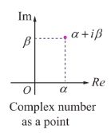
**Figure 2.3: Complex number as a point**  
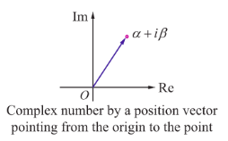
**Figure 2.4: Complex number by a position vector pointing from the origin to the point**  
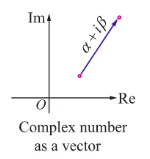
**Figure 2.5: Complex number as a vector**

**Illustration 2.1**

Here are some complex numbers: $2 + i, -1 + 2i, 3 - 2i, 0 - 2i, 3 + \sqrt{-2}, -2 - 3i, \cos \frac{\pi}{6} + i \sin \frac{\pi}{6}$, and $3 + 0i$. Some of them are plotted in Argand plane.

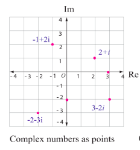
**Figure 2.6**
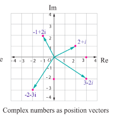
**Figure 2.7**

# 2.2.3 Algebraic operations on complex numbers

In this section, we study the algebraic and geometric structure of the complex number system.  
We assume various corresponding properties of real numbers to be known.

## (i) Scalar multiplication of complex numbers:

If $z = x + iy$ and $k \in \mathbb{R}$, then we define  
$$kz = (kx) + (ky)i.$$

In particular, $0z = 0$, $1z = z$ and $(-1)z = -z$.

The diagram below shows $kz$ for $k = 2, \frac{1}{2}, -1$.

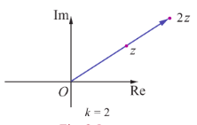
**Figure 2.8**
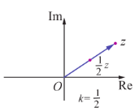
**Figure 2.9**
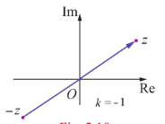
**Figure 2.10**

### (ii) Addition of complex numbers:

If $z_1 = x_1 + iy_1$ and $z_2 = x_2 + iy_2$, where $x_1, x_2, y_1, y_2$ and $y_2 \in \mathbb{R}$, then we define  
$$z_1 + z_2 = (x_1 + iy_1) + (x_2 + iy_2) = (x_1 + x_2) + i(y_1 + y_2).$$

We have already seen that vectors are characterized by length and direction, and that a given vector remains unchanged under translation. When $z_1 = x_1 + iy_1$ and $z_2 = x_2 + iy_2$, then by the parallelogram law of addition, the sum $z_1 + z_2 = (x_1 + x_2) + i(y_1 + y_2)$ corresponds to the point $(x_1 + x_2, y_1 + y_2)$. It also corresponds to a vector with those coordinates as its components. Hence the points $z_1, z_2,$ and $z_1 + z_2$ in complex plane may be obtained vectorially as shown in the adjacent 

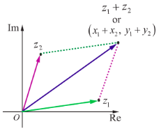
**Figure 2.11**

### (iii) Subtraction of complex numbers

Similarly the difference $z_{1} - z_{2}$ can also be drawn as a position vector whose initial point is the origin and terminal point is $(x_{1} - x_{2}, y_{1} - y_{2})$. We define

$$
z_{1} - z_{2} = z_{1} + (-z_{2})
$$

$$
= (x_{1} + i y_{1}) + (-x_{2} - i y_{2})
$$

$$
= (x_{1} - x_{2}) + i(y_{1} - y_{2})
$$

$$
z_{1} - z_{2} = (x_{1} - x_{2}) + i(y_{1} - y_{2}).
$$

It is important to note here that the vector representing the difference of the vector $z_{1} - z_{2}$ may also be drawn joining the end point of $z_{2}$ to the tip of $z_{1}$ instead of the origin. This kind of representation does not alter the meaning or interpretation of the difference operator. The difference vector joining the tips of $z_{1}$ and $z_{2}$ is shown in (green) dotted line.

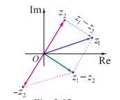
**Figure 2.12**

### (iv) Multiplication of complex numbers

The multiplication of complex numbers $z_{1}$ and $z_{2}$ is defined as

$$
z_{1}z_{2} = (x_{1} + i y_{1})(x_{2} + i y_{2})
$$

$$
= (x_{1}x_{2} - y_{1}y_{2}) + i(x_{1}y_{2} + x_{2}y_{1})
$$

$$
z_{1}z_{2} = (x_{1}x_{2} - y_{1}y_{2}) + i(x_{1}y_{2} + x_{2}y_{1}).
$$

Although the product of two complex numbers $z_{1}$ and $z_{2}$ is itself a complex number represented by a vector, that vector lies in the same plane as the vectors $z_{1}$ and $z_{2}$. Evidently, then, this product is neither the scalar product nor the vector product used in vector algebra.
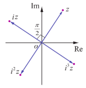
**Figure 2.13**

**Remark**

Multiplication of complex number $z$ by $i$

$$
\text{if } z = x + i y, \text{ then }
$$

$$
i z = i(x + i y)
$$

$$
= -y + i x.
$$

The complex number $i z$ is a rotation of $z$ by $90^{\circ}$ or $\frac{\pi}{2}$ radians in the counter clockwise direction about the origin. In general, multiplication of a complex number $z$ by $i$ successively gives a $90^{\circ}$ counter clockwise rotation successively about the origin.

**Illustration 2.2**

Let $z_{1} = 6 + 7i$ and $z_{2} = 3 - 5i$. Then $z_{1} + z_{2}$ and $z_{1} - z_{2}$ are

$$
(3 - 5i) + (6 + 7i) = (3 + 6) + (-5 + 7)i = 9 + 2i
$$

$$
(6 + 7i) - (3 - 5i) = (6 - 3) + (7 - (-5))i = 3 + 12i.
$$

Let $z_{1} = 2 + 3i$ and $z_{2} = 4 + 7i$. Then $z_{1}z_{2}$ is

$$
(2 + 3i)(4 + 7i) = (2 \times 4 - 3 \times 7) + i(2 \times 7 + 3 \times 4)
$$

$$
= (8 - 21) + (14 + 12)i = -13 + 26i.
$$

**Example 2.2**

Find the value of the real numbers $x$ and $y$, if the complex number $(2 + i)x + (1 - i)y + 2i - 3$ and $x + (-1 + 2i)y + 1 + i$ are equal.

**Solution**

Let $z_{1} = (2 + i)x + (1 - i)y + 2i - 3 = (2x + y - 3) + i(x - y + 2)$ and $z_{2} = x + (-1 + 2i)y + 1 + i = (x - y + 1) + i(2y + 1)$.

Given that $z_{1} = z_{2}$

$$
(2x + y - 3) + i(x - y + 2) = (x - y + 1) + i(2y + 1).
$$

Equating real and imaginary parts separately, gives

$$
2x + y - 3 = x - y + 1
$$

$$
x - y + 2 = 2y + 1
$$

Solving the above equations, gives

$$
x = 2 \text{ and } y = 1.
$$

## EXERCISE 2.2

1. Evaluate the following if $z = 5 - 2i$ and $w = -1 + 3i$

   (i) $z + w$  
   (ii) $z - iw$  
   (iii) $2z + 3w$  
   (iv) $zw$  
   (v) $z^{2} + 2zw + w^{2}$  
   (vi) $(z + w)^{2}$

2. Given the complex number $z = 2 + 3i$, represent the complex numbers in Argand diagram.

   (i) $z, iz$, and $z + iz$  
   (ii) $z, -iz$, and $z - iz$

3. Find the values of the real numbers $x$ and $y$, if the complex numbers

   $$
   (3 - i)x - (2 - i)y + 2i + 5 \text{ and } 2x + (-1 + 2i)y + 3 + 2i \text{ are equal}.
   $$