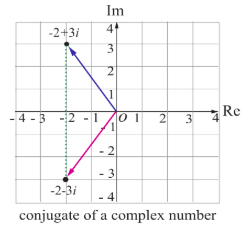
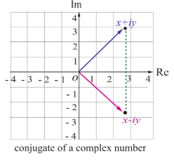

### 2.4 Conjugate of a Complex Number

In this section, we study about conjugate of a complex number, its geometric representation, and properties with suitable examples.

**Definition 2.3**

The conjugate of the complex number $x + iy$ is defined as the complex number $x - iy$.

The complex conjugate of $z$ is denoted by $\overline{z}$. To get the conjugate of the complex number $z$, simply change $i$ by $-i$ in $z$. For instance $2 - 5i$ is the conjugate of $2 + 5i$. The product of a complex number with its conjugate is a real number.

For instance,  
(i) $(x + i y)(x - i y) = x^{2} - (i y)^{2} = x^{2} + y^{2}$  
(ii) $(1 + 3i)(1 - 3i) = (1)^{2} - (3i)^{2} = 1 + 9 = 10$.

Geometrically, the conjugate of $z$ is obtained by reflecting $z$ on the real axis.

#### 2.4.1 Geometrical representation of conjugate of a complex number

**Figure 2.14** 
 
**Figure 2.15**

**Note**

Two complex numbers $x + i y$ and $x - i y$ are conjugates to each other. The conjugate is useful in division of complex numbers. The complex number can be replaced with a real number in the denominator by multiplying the numerator and denominator by the conjugate of the denominator. This process is similar to rationalising the denominator to remove surds.

## 2.4.2 Properties of Complex Conjugates

1. $ \overline{z_1 + z_2} = \overline{z_1} + \overline{z_2} $
2. $ \overline{z_1 - z_2} = \overline{z_1} - \overline{z_2} $
3. $ \overline{z_1 z_2} = \overline{z_1} \overline{z_2} $
4. $ \left( \frac{z_1}{z_2} \right) = \frac{\overline{z_1}}{\overline{z_2}}, \quad z_2 \neq 0 $
5. $ \text{Re}(z) = \frac{z + \overline{z}}{2} $
6. $ \text{Im}(z) = \frac{z - \overline{z}}{2i} $
7. $ \left( \overline{z}^n \right) = \left( \overline{z} \right)^n $, where $ n $ is an integer
8. $ z $ is real if and only if $ z = \overline{z} $
9. $ z $ is purely imaginary if and only if $ z = -\overline{z} $
10. $ \overline{z} = z $

Let us verify some of the properties.

### Property
For any two complex numbers $ z_1 $ and $ z_2 $, we have $ \overline{z_1 + z_2} = \overline{z_1} + \overline{z_2} $.

**Proof**
Let $ z_1 = x_1 + iy_1, \quad z_2 = x_2 + iy_2 $, and $ x_1, x_2, y_1, $ and $ y_2 \in \mathbb{R} $

$$ \overline{z_1 + z_2} = (x_1 + iy_1) + (x_2 + iy_2) $$

$$= (x_1 + x_2) + i(y_1 + y_2) = (x_1 + x_2) - i(y_1 + y_2)$$

$$= (x_1 - iy_1) + (x_2 - iy_2)$$

$$= z_1 + z_2$$

It can be generalized by means of mathematical induction to sums involving any finite number of terms:  
$$z_1 + z_2 + z_3 + \cdots + z_n = z_1 + z_2 + z_3 + \cdots + z_n.$$

### Property

$$z_1 z_2 = z_1 \overline{z_2} \quad \text{where } x_1, x_2, y_1, \text{ and } y_2 \in \mathbb{R}$$

**Proof**

Let  
$$z_1 = x_1 + iy_1 \quad \text{and} \quad z_2 = x_2 + iy_2.$$

Then,  
$$z_1 z_2 = (x_1 + iy_1)(x_2 + iy_2) = (x_1 x_2 - y_1 y_2) + i(x_1 y_2 + x_2 y_1).$$

Therefore,  
$$\overline{z_1 z_2} = \overline{(x_1 x_2 - y_1 y_2)} + i\overline{(x_1 y_2 + x_2 y_1)} = (x_1 x_2 - y_1 y_2) - i(x_1 y_2 + x_2 y_1),$$

and  
$$\overline{z_1 z_2} = (x_1 - iy_1)(x_2 - iy_2) = (x_1 x_2 - y_1 y_2) - i(x_1 y_2 + x_2 y_1).$$

Therefore,  
$$\overline{z_1 z_2} = \overline{z_1} \overline{z_2}.$$

### Property

A complex number $z$ is purely imaginary if and only if $z = -\overline{z}$.

**Proof**

Let  
$$z = x + iy.$$  
Then by definition  
$$\overline{z} = x - iy$$

Therefore,  
$$z = -\overline{z}$$

$$\Leftrightarrow x + iy = -(x - iy)$$

$$\Leftrightarrow 2x = 0 \Leftrightarrow x = 0$$

$$\Leftrightarrow z \text{ is purely imaginary.}$$

Similarly, we can verify the other properties of conjugate of complex numbers.

**Example 2.3**

Write  
$$\frac{3 + 4i}{5 - 12i}$$
in the $x + iy$ form, hence find its real and imaginary parts.

**Solution**

To find the real and imaginary parts of  
$$\frac{3 + 4i}{5 - 12i},$$

first it should be expressed in the rectangular form $x + iy$. To simplify the quotient of two complex numbers, multiply the numerator and denominator by the conjugate of the denominator to eliminate $i$ in the denominator.

$$\frac{3 + 4i}{5 - 12i} = \frac{(3 + 4i)(5 + 12i)}{(5 - 12i)(5 + 12i)}$$

$$= \frac{(15 + 48i) + (20 + 36i)}{5^2 + 12^2}$$

$$= \frac{-33 + 56i}{169} = \frac{33}{169} + i \frac{56}{169}.$$

Therefore,  
$$\frac{3 + 4i}{5 - 12i} = -\frac{33}{169} + i \frac{56}{169}.$$  
This is in the $x + iy$ form.  

Hence real part is  
$$-\frac{33}{169}$$  
and imaginary part is  
$$\frac{56}{169}.$$

**Example 2.4**

Simplify $\left(\frac{1 + i}{1 - i}\right)^{3} - \left(\frac{1 - i}{1 + i}\right)^{3}$ into rectangular form

**Solution**

We consider $\frac{1 + i}{1 - i} = \frac{(1 + i)(1 + i)}{(1 - i)(1 + i)} = \frac{1 + 2i - 1}{1 + 1} = \frac{2i}{2} = i$,

and $\frac{1 - i}{1 + i} = \left(\frac{1 + i}{1 - i}\right)^{-1} = \frac{1}{i} = -i$.

Therefore, $\left(\frac{1 + i}{1 - i}\right)^{3} - \left(\frac{1 - i}{1 + i}\right)^{3} = i^{3} - (-i)^{3} = -i - (-(-i))?$ Let's compute carefully:

$i^{3} = -i$, $(-i)^{3} = (-1)^{3} i^{3} = -1 \cdot (-i) = i$

So $i^{3} - (-i)^{3} = -i - i = -2i$.

**Example 2.5**

If $\frac{z + 3}{z - 5i} = \frac{1 + 4i}{2}$, find the complex number $z$ in the rectangular form

**Solution**

We have $\frac{z + 3}{z - 5i} = \frac{1 + 4i}{2}$

$$
\Rightarrow 2(z + 3) = (1 + 4i)(z - 5i)
$$

$$
\Rightarrow 2z + 6 = (1 + 4i)z -5i(1+4i) = (1+4i)z -5i -20i^2 = (1+4i)z -5i +20
$$

$$
\Rightarrow 2z + 6 = (1+4i)z + 20 -5i
$$

$$
\Rightarrow (2 - 1 - 4i)z = 20 -5i -6
$$

$$
\Rightarrow (1-4i)z = 14 -5i
$$

$$
\Rightarrow z = \frac{14 - 5i}{1 - 4i} = \frac{(14 - 5i)(1 + 4i)}{(1 - 4i)(1 + 4i)} = \frac{14 +56i -5i -20i^2}{1+16} = \frac{14 +51i +20}{17} = \frac{34 + 51i}{17} = 2 + 3i.
$$

**Example 2.6**

If $z_{1} = 3 - 2i$ and $z_{2} = 6 + 4i$, find $\frac{z_{1}}{z_{2}}$ in the rectangular form

**Solution**

Using the given value for $z_{1}$ and $z_{2}$ the value of $\frac{z_{1}}{z_{2}} = \frac{3 - 2i}{6 + 4i} = \frac{3 - 2i}{6 + 4i} \times \frac{6 - 4i}{6 - 4i}$

$$
= \frac{(18 - 8) + i(-12 - 12)}{6^{2} + 4^{2}} = \frac{10 - 24i}{52} = \frac{10}{52} - \frac{24i}{52}
$$

$$
= \frac{5}{26} - \frac{6}{13} i.
$$

**Example 2.7**
Find $ z^{-1} $, if $ z = (2 + 3i)(1 - i) $.

**Solution**
We have  
$$z = (2 + 3i)(1 - i) = (2 + 3) + (3 - 2)i = 5 + i$$

$$\Rightarrow z^{-1} = \frac{1}{z} = \frac{1}{5 + i}$$

Multiplying the numerator and denominator by the conjugate of the denominator, we get  
$$z^{-1} = \frac{(5 - i)}{(5 + i)(5 - i)} = \frac{5 - i}{5^2 + 1^2} = \frac{5}{26} - i \frac{1}{26}$$

$$\Rightarrow z^{-1} = \frac{5}{26} - i \frac{1}{26}$$

**Example 2.8**
Show that (i)  
$$(2 + i\sqrt{3})^{10} + (2 - i\sqrt{3})^{10}$$  
is real and (ii)  
$$\left( \frac{19 + 9i}{5 - 3i} \right)^{15} - \left( \frac{8 + i}{1 + 2i} \right)^{15}$$  
is purely imaginary.

**Solution**
(i)  
Let  
$$z = (2 + i\sqrt{3})^{10} + (2 - i\sqrt{3})^{10}$$

$$\overline{z} = \overline{(2 + i\sqrt{3})^{10} + (2 - i\sqrt{3})^{10}}$$

$$= (2 + i\sqrt{3})^{10} + (2 - i\sqrt{3})^{10}$$

$$= (2 + i\sqrt{3})^{10} + (2 - i\sqrt{2})^{10}$$

$$= (2 + i\sqrt{3})^{10} + (2 - 2i\sqrt{3})^{10}$$

$$= (2 + i\sqrt{3})^{10} + (2 - i\sqrt{3})^{10} = z$$

$$\overline{z} = z \Rightarrow z \text{ is real.}$$

(ii)  
Let  
$$z = \left( \frac{19 + 9i}{5 - 3i} \right)^{15} - \left( \frac{8 + i}{1 + 2i} \right)^{15}$$

Here,  
$$\frac{19 + 9i}{5 - 3i} = \frac{(19 + 9i)(5 + 3i)}{(5 - 3i)(5 + 3i)}$$

$$= \frac{(95 - 27) + i(45 + 57)}{5^2 + 3^2} = \frac{68 + 102i}{34}$$

$$= 2 + 3i$$

and  
$$\frac{8 + i}{1 + 2i} = \frac{(8 + i)(1 - 2i)}{(1 + 2i)(1 - 2i)}$$

$$= \frac{(8 + 2) + i(1 - 16)}{1^2 + 2^2} = \frac{10 - 15i}{5}$$

$$= 2 - 3i$$

Now  
$$z = \left( \frac{19 + 9i}{5 - 3i} \right)^{15} - \left( \frac{8 + i}{1 + 2i} \right)^{15}$$

$$\Rightarrow \quad z = (2 + 3i)^{15} - (2 - 3i)^{15}.$$

Then by definition,  
$$\bar{z} = \left( \overline{(2 + 3i)^{15}} - \overline{(2 - 3i)^{15}} \right)$$

$$= \left( \overline{2 + 3i} \right)^{15} - \left( \overline{2 - 3i} \right)^{15}$$

$$= (2 - 3i)^{15} - (2 + 3i)^{15} = - \left( (2 + 3i)^{15} - (2 - 3i)^{15} \right)$$

$$\Rightarrow \quad \bar{z} = -z.$$

Therefore,  
$$z = \left( \frac{19 + 9i}{5 - 3i} \right)^{15} - \left( \frac{8 + i}{1 + 2i} \right)^{15}$$  
is purely imaginary.

# EXERCISE 2.4

1. Write the following in the rectangular form:  
   (i) $\overline{(5 + 9i)} + (2 - 4i)$  
   (ii) $\frac{10 - 5i}{6 + 2i}$  
   (iii) $\frac{1}{3i} + \frac{1}{2 - i}$  

2. If $z = x + iy$, find the following in rectangular form.  
   (i) $\text{Re}\left( \frac{1}{z} \right)$  
   (ii) $\text{Re}\left( i \bar{z} \right)$  
   (iii) $\text{Im}(3z + 4\bar{z} - 4i)$  

3. If $z_1 = 2 - i$ and $z_2 = -4 + 3i$, find the inverse of $z_1z_2$ and $\frac{z_1}{z_2}$  

4. The complex numbers $u, v, w$ are related by  
   $$   \frac{1}{u} = \frac{1}{v} + \frac{1}{w}.$$  
   If $v = 3 - 4i$ and $w = 4 + 3i$, find $u$ in rectangular form.  

5. Prove the following properties:  
   (i) $z$ is real if and only if $z = \bar{z}$  
   (ii) $\text{Re}(z) = \frac{z + \bar{z}}{2}$  
   (iii) $\text{Im}(z) = \frac{z - \bar{z}}{2i}$  

6. Find the least value of the positive integer $n$ for which  
   $$   \left( \sqrt{3} + i \right)^n$$  
   (i) real  
   (ii) purely imaginary.  

7. Show that  
   $$   \left( 2 + i\sqrt{3} \right)^{10} - \left( 2 - i\sqrt{3} \right)^{10}$$  
   is purely imaginary.  
   (i)  
   $$   \left( \frac{19 - 7i}{9 + i} \right)^{12} + \left( \frac{20 - 5i}{7 - 6i} \right)^{12}$$  
   is real.
