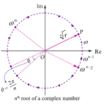
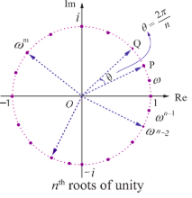
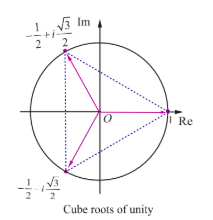
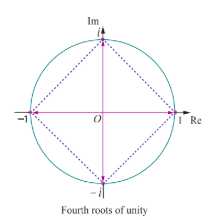

## 2.8 De Moivre's Theorem and it's Applications

**Abraham De Moivre (1667-1754)** was one of the mathematicians to use complex numbers in trigonometry.

The formula $(\cos \theta + i\sin \theta)^{n} = (\cos n\theta + i\sin n\theta)$ known by his name, was instrumental in bringing trigonometry out of the realm of geometry and into that of analysis.

**Figure: Abraham De Moivre 1667-1754**

#### 2.8.1 De Moivre's Theorem

**De Moivre's Theorem**

Given any complex number $\cos \theta + i\sin \theta$ and any integer $n$

$$
(\cos \theta + i\sin \theta)^{n} = \cos n\theta + i\sin n\theta.
$$

**Corollary**

(1) $(\cos \theta - i\sin \theta)^{n} = \cos n\theta - i\sin n\theta$  
(2) $(\cos \theta + i\sin \theta)^{-n} = \cos n\theta - i\sin n\theta$  
(3) $(\cos \theta - i\sin \theta)^{-n} = \cos n\theta + i\sin n\theta$  
(4) $\sin \theta + i\cos \theta = i(\cos \theta - i\sin \theta)$

Now let us apply De Moivre's theorem to simplify complex numbers and to find solution of equations.

**Example 2.28**

If $z = (\cos \theta + i\sin \theta)$, show that $z^{n} + \frac{1}{z^{n}} = 2\cos n\theta$ and $z^{n} - \frac{1}{z^{n}} = 2i\sin n\theta$.

**Solution**

Let $z = (\cos \theta + i\sin \theta)$.

By De Moivre's theorem,

$$
z^{n} = (\cos \theta + i\sin \theta)^{n} = \cos n\theta + i\sin n\theta
$$

$$
\frac{1}{z^{n}} = z^{-n} = \cos n\theta - i\sin n\theta
$$

$$
z^{n} + \frac{1}{z^{n}} = (\cos n\theta + i\sin n\theta) + (\cos n\theta - i\sin n\theta)
$$

$$
z^{n} + \frac{1}{z^{n}} = 2\cos n\theta.
$$

Similarly,

$$
z^{n} - \frac{1}{z^{n}} = (\cos n\theta + i\sin n\theta) - (\cos n\theta - i\sin n\theta)
$$

$$
z^{n} - \frac{1}{z^{n}} = 2i\sin n\theta.
$$

**Example 2.29**

Simplify $\left(\sin \frac{\pi}{6} + i\cos \frac{\pi}{6}\right)^{18}$.

**Solution**

We have, $\sin \frac{\pi}{6} + i\cos \frac{\pi}{6} = i\left(\cos \frac{\pi}{6} - i\sin \frac{\pi}{6}\right)$.

Raising to the power 18 on both sides gives,

$$
\left(\sin \frac{\pi}{6} + i\cos \frac{\pi}{6}\right)^{18} = (i)^{18}\left(\cos \frac{\pi}{6} - i\sin \frac{\pi}{6}\right)^{18}
$$

$$
= (-1)\left(\cos \frac{18\pi}{6} - i\sin \frac{18\pi}{6}\right)
$$

$$
= -(\cos 3\pi - i\sin 3\pi) = -(-1 - i \cdot 0) = 1
$$

Therefore, $\left(\sin \frac{\pi}{6} + i\cos \frac{\pi}{6}\right)^{18} = 1$.

**Example 2.30**

Simplify $\left(\frac{1 + \cos 2\theta + i\sin 2\theta}{1 + \cos 2\theta - i\sin 2\theta}\right)^{30}$.

**Solution**

Let $z = \cos 2\theta + i\sin 2\theta$.

As $|z| = 1$, we get $\overline{z} = \frac{1}{z} = \cos 2\theta - i\sin 2\theta$.

Now,

$$
\frac{1 + \cos 2\theta + i\sin 2\theta}{1 + \cos 2\theta - i\sin 2\theta} = \frac{1 + z}{1 + \frac{1}{z}} = \frac{1 + z}{\frac{z + 1}{z}} = z
$$

Therefore,

$$
\left(\frac{1 + \cos 2\theta + i\sin 2\theta}{1 + \cos 2\theta - i\sin 2\theta}\right)^{30} = z^{30} = (\cos 2\theta + i\sin 2\theta)^{30} = \cos 60\theta + i\sin 60\theta
$$

**Example 2.31**

Simplify (i) $(1 + i)^{18}$ (ii) $(-\sqrt{3} + 3i)^{31}$.

**Solution**

(i) $(1 + i)^{18}$

Let $1 + i = r(\cos \theta + i\sin \theta)$. Then, we get

$$
r = \sqrt{1^{2} + 1^{2}} = \sqrt{2}, \quad \alpha = \tan^{-1}\left(\frac{1}{1}\right) = \frac{\pi}{4},
$$

$$
\theta = \alpha = \frac{\pi}{4} \quad (\because 1 + i \text{ lies in the first quadrant})
$$

Raising to power 18 on both sides,

$$
(1 + i)^{18} = \left[\sqrt{2}\left(\cos \frac{\pi}{4} + i\sin \frac{\pi}{4}\right)\right]^{18} = (\sqrt{2})^{18}\left(\cos \frac{\pi}{4} + i\sin \frac{\pi}{4}\right)^{18}.
$$

By De Moivre's theorem,

$$
(1 + i)^{18} = 2^{9}\left(\cos \frac{18\pi}{4} + i\sin \frac{18\pi}{4}\right)
$$

$$
= 2^{9}\left(\cos \left(4\pi + \frac{\pi}{2}\right) + i\sin \left(4\pi + \frac{\pi}{2}\right)\right) = 2^{9}\left(\cos \frac{\pi}{2} + i\sin \frac{\pi}{2}\right)
$$

$$
(1 + i)^{18} = 2^{9}(i) = 512i.
$$

(ii) $(-\sqrt{3} + 3i)^{31}$

Let $-\sqrt{3} + 3i = r(\cos \theta + i\sin \theta)$. Then, we get

$$
r = \sqrt{(-\sqrt{3})^{2} + 3^{2}} = \sqrt{12} = 2\sqrt{3},
$$

$$
\alpha = \tan^{-1}\left|\frac{3}{-\sqrt{3}}\right| = \tan^{-1}\sqrt{3} = \frac{\pi}{3},
$$

$$
\theta = \pi - \alpha = \pi - \frac{\pi}{3} = \frac{2\pi}{3} \quad (\because -\sqrt{3} + 3i \text{ lies in II Quadrant})
$$

Therefore,

$$
(-\sqrt{3} + 3i)^{31} = \left[2\sqrt{3}\left(\cos \frac{2\pi}{3} + i\sin \frac{2\pi}{3}\right)\right]^{31}
$$

$$
= (2\sqrt{3})^{31}\left(\cos \frac{62\pi}{3} + i\sin \frac{62\pi}{3}\right)
$$

$$
= 2^{31} \cdot 3^{\frac{31}{2}} \left(\cos \left(20\pi + \frac{2\pi}{3}\right) + i\sin \left(20\pi + \frac{2\pi}{3}\right)\right)
$$

$$
= 2^{31} \cdot 3^{\frac{31}{2}} \left(\cos \frac{2\pi}{3} + i\sin \frac{2\pi}{3}\right)
$$

#### 2.8.2 The $n^{\text{th}}$ roots of a complex number

De Moivre's formula can be used to obtain roots of complex numbers. Suppose $ n $ is a positive integer and a complex number $ \omega $ is $ n^{th} $ root of $ z $ denoted by $ z^{1/n} $, then we have

$$\omega^n = z.$$

Let $ \omega = \rho (\cos \phi + i \sin \phi) $ and

$$z = r (\cos \theta + i \sin \theta) = r (\cos (\theta + 2k\pi) + i \sin (\theta + 2k\pi)), \quad k \in \mathbb{Z}$$

Since $ \omega $ is the $ n^{th} $ root of $ z $, then

$$\omega^n = z$$

$$\Rightarrow \rho^n (\cos \phi + i \sin \phi)^n = r (\cos (\theta + 2k\pi) + i \sin (\theta + 2k\pi)), \quad k \in \mathbb{Z}$$

By De Moivre's theorem,

$$\rho^n (\cos n\phi + i \sin n\phi) = r (\cos (\theta + 2k\pi) + i \sin (\theta + 2k\pi)), \quad k \in \mathbb{Z}$$

Comparing the moduli and arguments, we get

$$\rho^n = r \quad \text{and} \quad n\phi = \theta + 2k\pi, \quad k \in \mathbb{Z}$$

$$\rho = r^{1/n} \quad \text{and} \quad \phi = \frac{\theta + 2k\pi}{n}, \quad k \in \mathbb{Z}.$$

Therefore, the values of $ \omega $ are $ r^{1/n} (\cos (\frac{\theta + 2k\pi}{n}) + i \sin (\frac{\theta + 2k\pi}{n})), \quad k \in \mathbb{Z} $.

Although there are infinitely many values of $ k $, the distinct values of $ \omega $ are obtained when $ k = 0, 1, 2, 3, \ldots, n-1 $. When $ k = n, n+1, n+2, \ldots $ we get the same roots at regular intervals (cyclically). Therefore the $ n^{th} $ roots of complex number $ z = r (\cos \theta + i \sin \theta) $ are

$$z^{1/n} = r^{1/n} (\cos (\frac{\theta + 2k\pi}{n}) + i \sin (\frac{\theta + 2k\pi}{n})), \quad k = 0, 1, 2, 3, \ldots, n-1.$$

If we set $\omega = \sqrt[n]{r e^{\frac{i(\theta + 2k\pi)}{n}}}$, the formula for the $n^{\text{th}}$ roots of a complex number has a nice geometric interpretation, as shown in Figure. Note that because $|\omega| = \sqrt[n]{r}$ the $n$ roots all have the same modulus $\sqrt[n]{r}$; they all lie on a circle of radius $\sqrt[n]{r}$ with centre at the origin. Furthermore, the $n$ roots are equally spaced along the circle, because successive $n$ roots have arguments that differ by $\frac{2\pi}{n}$.

**Figure 2.44**

**Remark**

(1) **General form of De Moivre's Theorem**

If $x$ is rational, then $\cos x\theta + i\sin x\theta$ is one of the values of $(\cos \theta + i\sin \theta)^x$.

(2) **Polar form of unit circle**

Let $z = e^{i\theta} = \cos \theta + i\sin \theta$. Then, we get

$$
|z|^{2} = |\cos \theta + i\sin \theta|^{2}
$$

$$
\Rightarrow |x + iy|^{2} = \cos^{2}\theta + \sin^{2}\theta = 1
$$

$$
\Rightarrow x^{2} + y^{2} = 1.
$$

Therefore, $|z| = 1$ represents a unit circle (radius one) centre at the origin.

#### 2.8.3 The $n^{\text{th}}$ roots of unity

The solutions of the equation $z^{n} = 1$, for positive values of integer $n$, are the $n$ roots of the unity. In polar form the equation $z^{n} = 1$ can be written as

$$
z^{n} = \cos(0 + 2k\pi) + i\sin(0 + 2k\pi) = e^{i2k\pi}, \quad k = 0,1,2,\ldots
$$

Using De Moivre's theorem, we find the $n^{\text{th}}$ roots of unity from the equation given below:

$$
z = \left(\cos \left(\frac{2k\pi}{n}\right) + i\sin \left(\frac{2k\pi}{n}\right)\right) = e^{\frac{i2k\pi}{n}}, \quad k = 0,1,2,3,\ldots, n-1. \tag{1}
$$

Given a positive integer $n$, a complex number $z$ is called an $n^{\text{th}}$ root of unity if and only if $z^{n} = 1$.

If we denote the complex number by $\omega$, then

$$
\omega = e^{\frac{2\pi i}{n}} = \cos \frac{2\pi}{n} + i\sin \frac{2\pi}{n}
$$

$$
\Rightarrow \omega^{n} = \left(e^{\frac{2\pi i}{n}}\right)^{n} = e^{2\pi i} = 1.
$$

Therefore $\omega$ is an $n^{\text{th}}$ root of unity. From equation (1), the complex numbers $1, \omega, \omega^{2}, \dots, \omega^{n-1}$ are $n^{\text{th}}$ roots of unity. The complex numbers $1, \omega, \omega^{2}, \dots, \omega^{n-1}$ are the points in the complex plane and are the vertices of a regular polygon of $n$ sides inscribed in a unit circle as shown in Fig 2.45. Note that because the $n^{\text{th}}$ roots all have the same modulus 1, they will lie on a circle of radius 1 with centre at the origin. Furthermore, the $n$ roots are equally spaced along the circle, because successive $n^{\text{th}}$ roots have arguments that differ by $\frac{2\pi}{n}$.

**Figure 2.45**

The $n^{\text{th}}$ roots of unity $1, \omega, \omega^{2}, \dots, \omega^{n-1}$ are in geometric progression with common ratio $\omega$.

Therefore $1 + \omega + \omega^{2} + \dots + \omega^{n-1} = \frac{1 - \omega^{n}}{1 - \omega} = 0$ since $\omega^{n} = 1$ and $\omega \neq 1$.

The sum of all the $n^{\text{th}}$ roots of unity is $1 + \omega + \omega^{2} + \dots + \omega^{n-1} = 0$.

The product of $n$, $n^{\text{th}}$ roots of unit is

$$
1 \cdot \omega \cdot \omega^{2} \cdots \omega^{n-1} = \omega^{0 + 1 + 2 + 3 + \dots + (n-1)} = \omega^{\frac{(n-1)n}{2}}
$$

$$
= \left(\omega^{n}\right)^{\frac{(n-1)}{2}} = \left(e^{i2\pi}\right)^{\frac{(n-1)}{2}} = \left(e^{i\pi}\right)^{n-1} = (-1)^{n-1}
$$

The product of all the $n^{\text{th}}$ roots of unity is $1 \cdot \omega \cdot \omega^{2} \cdots \omega^{n-1} = (-1)^{n-1}$.

Since $|\omega| = 1$, we have $\omega \overline{\omega} = |\omega|^{2} = 1$; hence $\overline{\omega} = \omega^{-1} \Rightarrow (\overline{\omega})^{k} = \omega^{-k}, \quad 0 \leq k \leq n-1$

$$
\omega^{n-k} = \omega^{n}\omega^{-k} = \omega^{-k} = (\overline{\omega})^{k}, \quad 0 \leq k \leq n-1
$$

Therefore, $\boxed{\omega^{n-k} = \omega^{-k} = (\overline{\omega})^{k}}$, $0 \leq k \leq n-1$.

**Note**

(1) All the $n$ roots of $n^{\text{th}}$ roots unity are in Geometrical Progression

(2) Sum of the $n$ roots of $n^{\text{th}}$ roots unity is always equal to zero.

(3) Product of the $n$ roots of $n^{\text{th}}$ roots unity is equal to $(-1)^{n-1}$.

(4) All the $n$ roots of $n^{\text{th}}$ roots unity lie on the circumference of a circle whose centre is at the origin and radius equal to 1 and these roots divide the circle into $n$ equal parts and form a polygon of $n$ sides.

**Example 2.32**

Find the cube roots of unity.

**Solution**

We have to find $1^{\frac{1}{3}}$. Let $z = 1^{\frac{1}{3}}$ then $z^{3} = 1$.

In polar form, the equation $z^{3} = 1$ can be written as

$$
z^{3} = \cos(0 + 2k\pi) + i\sin(0 + 2k\pi) = e^{i2k\pi}, \quad k = 0,1,2,\ldots
$$

Therefore, $z = \cos\left(\frac{2k\pi}{3}\right) + i\sin\left(\frac{2k\pi}{3}\right) = e^{i\frac{2k\pi}{3}}, \quad k = 0,1,2$.

Taking $k = 0,1,2$, we get,

$k = 0$: $z = \cos 0 + i\sin 0 = 1$

$k = 1$: $z = \cos \frac{2\pi}{3} + i\sin \frac{2\pi}{3} = \cos\left(\pi - \frac{\pi}{3}\right) + i\sin\left(\pi - \frac{\pi}{3}\right) = -\cos\frac{\pi}{3} + i\sin\frac{\pi}{3} = -\frac{1}{2} + i\frac{\sqrt{3}}{2}$

$k = 2$: $z = \cos \frac{4\pi}{3} + i\sin \frac{4\pi}{3} = \cos\left(\pi + \frac{\pi}{3}\right) + i\sin\left(\pi + \frac{\pi}{3}\right) = -\cos\frac{\pi}{3} - i\sin\frac{\pi}{3} = -\frac{1}{2} - i\frac{\sqrt{3}}{2}$

Therefore, the cube roots of unity are

$$
1, \frac{-1 + i\sqrt{3}}{2}, \frac{-1 - i\sqrt{3}}{2} \Rightarrow 1, \omega, \text{ and } \omega^{2}, \text{ where } \omega = e^{\frac{i2\pi}{3}} = \frac{-1 + i\sqrt{3}}{2}.
$$

**Figure 2.46**

**Example 2.33**

Find the fourth roots of unity.

**Solution**

We have to find $1^{\frac{1}{4}}$. Let $z = 1^{\frac{1}{4}}$. Then $z^{4} = 1$.

In polar form, the equation $z^{4} = 1$ can be written as

$$
z^{4} = \cos(0 + 2k\pi) + i\sin(0 + 2k\pi) = e^{i2k\pi}, \quad k = 0,1,2,\ldots
$$

Therefore, $z = \cos\left(\frac{2k\pi}{4}\right) + i\sin\left(\frac{2k\pi}{4}\right) = e^{i\frac{2k\pi}{4}}, \quad k = 0,1,2,3$.

Taking $k = 0,1,2,3$, we get

$k = 0$: $z = \cos 0 + i\sin 0 = 1$

$k = 1$: $z = \cos\left(\frac{\pi}{2}\right) + i\sin\left(\frac{\pi}{2}\right) = i$

$k = 2$: $z = \cos \pi + i\sin \pi = -1$

$k = 3$: $z = \cos\left(\frac{3\pi}{2}\right) + i\sin\left(\frac{3\pi}{2}\right) = -i$

Therefore, the fourth roots of unity are $1, i, -1, -i$.

**Figure 2.47**

### Note

(i) In this chapter the letter $\omega$ is used for $n^\text{th}$ roots of unity. Therefore the value of $\omega$ is depending on $n$ as shown in following table.

| value of $n$ | 2    | 3    | 4    | 5    | ...    | $k$    |
|---|---|---|---|---|---|---|
| value of $\omega$ | $e^{\frac{2\pi}{2}}$ | $e^{\frac{2\pi}{3}}$ | $e^{\frac{2\pi}{4}}$ | $e^{\frac{2\pi}{5}}$ | ...    | $e^{\frac{2\pi}{k}}$ |

(ii) The complex number $z e^{i\theta}$ is a rotation of $z$ by $\theta$ radians in the counter clockwise direction about the origin.

### Example 2.34

Solve the equation $z^3 + 8i = 0$, where $z \in \mathbb{C}$.

### Solution

Let

$$z^3 + 8i = 0.$$

Then, we get

$$z^3 = -8i$$

$$= 8(-i) = 8 \left( \cos \left( -\frac{\pi}{2} + 2k\pi \right) + i \sin \left( -\frac{\pi}{2} + 2k\pi \right) \right), \quad k \in \mathbb{Z}.$$

Therefore,

$$z = \sqrt[3]{8} \left( \cos \left( -\frac{\pi}{6} + 4k\pi \right) + i \sin \left( -\frac{\pi}{6} + 4k\pi \right) \right), \quad k = 0, 1, 2.$$

Taking $k = 0, 1, 2$, we get,

$$k = 0, \quad z = 2 \left( \cos \left( -\frac{\pi}{6} \right) + i \sin \left( -\frac{\pi}{6} \right) \right) = 2 \left( \frac{\sqrt{3}}{2} - i \frac{1}{2} \right) = \sqrt{3} - i$$

$$k = 1, \quad z = 2 \left( \cos \left( \frac{\pi}{2} \right) + i \sin \left( \frac{\pi}{2} \right) \right) = 2 = 2 \left( 0 + i \right) = 0 + 2i = 2i$$

$$k = 2, \quad z = 2 \left( \cos \left( \frac{7\pi}{6} \right) + i \sin \left( \frac{7\pi}{6} \right) \right) = 2 \left( \cos \left( \pi + \frac{\pi}{6} \right) + i \sin \left( \pi + \frac{\pi}{6} \right) \right)$$

$$= 2 \left( -\cos \left( \frac{\pi}{6} \right) - i \sin \left( \frac{\pi}{6} \right) \right) = 2 \left( -\frac{\sqrt{3}}{2} - i \frac{1}{2} \right) = -\sqrt{3} - i$$

The values of $z$ are $\sqrt{3} - i, 2i$, and $-\sqrt{3} - i$.

### Example 2.35

Find all cube roots of $\sqrt{3} + i$.

### Solution

We have to find $(\sqrt{3} + i)^i$. Let $z = (\sqrt{3} + i)^i$. Then, $z^3 = \sqrt{3} + i = r(\cos \theta + i \sin \theta)$.

Then, $r = \sqrt{3} + 1 = 2$, and $\alpha = 0 = \frac{\pi}{6}$  
$$\therefore \sqrt{3} + i \text{ lies in the first quadrant}$$

Therefore, $z^3 = \sqrt{3} + i = 2 \left( \cos \frac{\pi}{6} + i \sin \frac{\pi}{6} \right)$

$$\Rightarrow z = \sqrt[3]{2} \left( \cos \left( \frac{\pi + 12k\pi}{18} \right) + i \sin \left( \frac{\pi + 12k\pi}{18} \right) \right), \quad k = 0, 1, 2.$$

Taking $k = 0, 1, 2$, we get

$$k = 0, \quad z = 2^{\frac{1}{3}} \left( \cos \frac{\pi}{18} + i \sin \frac{\pi}{18} \right);$$

$$k = 1, \quad z = 2^{\frac{1}{3}} \left( \cos \frac{13\pi}{18} + i \sin \frac{13\pi}{18} \right);$$

$$k = 2, \quad z = 2^{\frac{1}{3}} \left( \cos \frac{25\pi}{18} + i \sin \frac{25\pi}{18} \right) = 2^{\frac{1}{3}} \left( -\cos \frac{7\pi}{18} - i \sin \frac{7\pi}{18} \right).$$

### Example 2.36

Suppose $z_1, z_2, \text{ and } z_3$ are the vertices of an equilateral triangle inscribed in the circle $|z| = 2$. If $z_1 = 1 + i\sqrt{3}$, then find $z_2$ and $z_3$.

### Solution

$|z| = 2$ represents the circle with centre $(0, 0)$ and radius 2.

Let $A, B, \text{ and } C$ be the vertices of the given triangle. Since the vertices $z_1, z_2, \text{ and } z_3$ form an equilateral triangle inscribed in the circle $|z| = 2$, the sides of this triangle $AB, BC, \text{ and } CA$ subtend $\frac{2\pi}{3}$ radians (120 degree) at the origin (circumcenter of the triangle).

(The complex number $z e^{i\theta}$ is a rotation of $z$ by $\theta$ radians in the counter clockwise direction about the origin.)

Therefore, we can obtain $z_2$ and $z_3$ by the rotation of $z_1$ by $\frac{2\pi}{3}$ and $\frac{4\pi}{3}$ respectively.

Given that

$$\overline{OA} = z_1 = 1 + i\sqrt{3};$$

$$\overline{OB} = z_1 e^{\frac{2\pi}{3}} = (1 + i\sqrt{3}) e^{\frac{2\pi}{3}}$$

$$= (1 + i\sqrt{3}) \left( \cos \frac{2\pi}{3} + i \sin \frac{2\pi}{3} \right)$$

$$= (1 + i\sqrt{3}) \left( \frac{1}{2} - i \frac{\sqrt{3}}{2} \right) = -2;$$

**EXERCISE 2.8**

1. If $\omega \neq 1$ is a cube root of unity, show that $\frac{a + b\omega + c\omega^{2}}{b + c\omega + a\omega^{2}} + \frac{a + b\omega + c\omega^{2}}{c + a\omega + b\omega^{2}} = -1$.

2. Show that $\left(\frac{\sqrt{3}}{2} + \frac{i}{2}\right)^{5} + \left(\frac{\sqrt{3}}{2} - \frac{i}{2}\right)^{5} = -\sqrt{3}$.

3. Find the value of $\left(\frac{1 + \sin\frac{\pi}{10} + i\cos\frac{\pi}{10}}{1 + \sin\frac{\pi}{10} - i\cos\frac{\pi}{10}}\right)^{10}$.

4. If $2\cos \alpha = x + \frac{1}{x}$ and $2\cos \beta = y + \frac{1}{y}$, show that

   (i) $\frac{x}{y} + \frac{y}{x} = 2\cos(\alpha - \beta)$  
   (ii) $xy - \frac{1}{xy} = 2i\sin(\alpha + \beta)$  
   (iii) $\frac{x^{m}}{y^{m}} - \frac{y^{n}}{x^{m}} = 2i\sin(m\alpha - n\beta)$  
   (iv) $x^{m}y^{n} + \frac{1}{x^{m}y^{n}} = 2\cos(m\alpha + n\beta)$.

5. Solve the equation $z^{3} + 27 = 0$.

6. If $\omega \neq 1$ is a cube root of unity, show that the roots of the equation $(z - 1)^{3} + 8 = 0$ are $-1, 1 - 2\omega, 1 - 2\omega^{2}$.

7. Find the value of $\sum_{k=1}^{8} \left(\cos \frac{2k\pi}{9} + i\sin \frac{2k\pi}{9}\right)$.

8. If $\omega \neq 1$ is a cube root of unity, show that

   (i) $(1 - \omega + \omega^{2})^{6} + (1 + \omega - \omega^{2})^{6} = 128$  
   (ii) $(1 + \omega)(1 + \omega^{2})(1 + \omega^{4})(1 + \omega^{8})\cdots(1 + \omega^{2^{11}}) = 1$.

9. If $z = 2 - 2i$, find the rotation of $z$ by $\theta$ radians in the counter clockwise direction about the origin when

   (i) $\theta = \frac{2\pi}{3}$  
   (ii) $\theta = \frac{2\pi}{3}$  
   (iii) $\theta = \frac{3\pi}{2}$.
