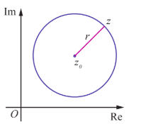
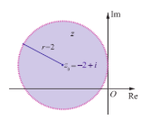

### 2.6 Geometry and Locus of Complex Numbers

In this section let us study the geometrical interpretation of complex number $z$ in complex plane and the locus of $z$ in Cartesian form.

**Example 2.18**

Given the complex number $z = 3 + 2i$, represent the complex numbers $z$, $iz$, and $z + iz$ in one Argand plane. Show that these complex numbers form the vertices of an isosceles right triangle.

**Solution**

Given that $z = 3 + 2i$

Therefore, $iz = i(3 + 2i) = -2 + 3i$

$$
z + iz = (3 + 2i) + i(3 + 2i) = 1 + 5i
$$

Let $A, B$, and $C$ be $z$, $z + iz$, and $iz$ respectively.

$$
AB^{2} = |(z + i z) - z|^{2} = |-2 + 3i|^{2} = 13
$$

$$
BC^{2} = |i z - (z + i z)|^{2} = |-3 - 2i|^{2} = 13
$$

$$
CA^{2} = |z - i z|^{2} = |5 - i|^{2} = 26
$$

**Figure 2.22**

Since $AB^{2} + BC^{2} = CA^{2}$ and $AB = BC$, $\triangle ABC$ is an isosceles right triangle.

**Definition 2.5 (circle)**

A circle is defined as the locus of a point which moves in a plane such that its distance from a fixed point in that plane is always a constant. The fixed point is the centre and the constant distant is the radius of the circle.

## Equation of Complex Form of a Circle

The locus of $z$ that satisfies the equation $|z - z_{0}| = r$ where $z_{0}$ is a fixed complex number and $r$ is a fixed positive real number consists of all points $z$ whose distance from $z_{0}$ is $r$.

Therefore $|z - z_{0}| = r$ is the complex form of the equation of a circle. (see Fig. 2.23)

(i) $|z - z_{0}| < r$ represents the points interior of the circle.

(ii) $|z - z_{0}| > r$ represents the points exterior of the circle.

**Figure 2.23**

**Illustration 2.3**

$$
|z| = r \Rightarrow \sqrt{x^{2} + y^{2}} = r
$$

$$
\Rightarrow x^{2} + y^{2} = r^{2}, \text{ represents a circle centre at the origin with radius } r \text{ units}.
$$

**Example 2.19**

Show that $|3z - 5 + i| = 4$ represents a circle, and, find its centre and radius.

**Solution**

The given equation $|3z - 5 + i| = 4$ can be written as

$$
3\left|z - \frac{5}{3} + \frac{i}{3}\right| = 4
$$

$$
\left|z - \left(\frac{5}{3} - \frac{1}{3}i\right)\right| = \frac{4}{3}
$$

It is of the form $|z - z_{0}| = r$ and so it represents a circle, whose centre and radius are $\left(\frac{5}{3}, -\frac{1}{3}\right)$ and $\frac{4}{3}$ respectively.

**Figure 2.24**

**Example 2.20**

Show that $|z + 2 - i| < 2$ represents interior points of a circle. Find its centre and radius.

**Solution**

Consider the equation $|z + 2 - i| = 2$.

This can be written as $|z - (-2 + i)| = 2$.

The above equation represents the circle with centre $z_{0} = -2 + i$ and radius $r = 2$. Therefore $|z + 2 - i| < 2$ represents all points inside the circle with centre at $-2 + i$ and radius 2 as shown in figure.

**Figure 2.25**

**Example 2.21**

Obtain the Cartesian form of the locus of $z$ in each of the following cases.

(i) $|z| = |z - i|$  
(ii) $|2z - 3 - i| = 3$

**Solution**

(i) Let $z = x + iy$

$$
|x + iy| = |x + iy - i|
$$

$$
\sqrt{x^{2} + y^{2}} = \sqrt{x^{2} + (y-1)^{2}}
$$

Squaring both sides:

$$
x^{2} + y^{2} = x^{2} + (y-1)^{2}
$$

$$
y^{2} = y^{2} - 2y + 1
$$

$$
2y = 1 \Rightarrow y = \frac{1}{2}
$$

(ii) we have $|2z - 3 - i| = 3$

$$
|2(x + iy) - 3 - i| = 3.
$$

$$
|(2x - 3) + i(2y - 1)| = 3
$$

Squaring on both sides, we get

$$
|(2x - 3) + (2y - 1)i|^{2} = 9
$$

$$
\Rightarrow (2x - 3)^{2} + (2y - 1)^{2} = 9
$$

$$
\Rightarrow 4x^{2} + 4y^{2} - 12x - 4y + 1 = 0
$$

the locus of $z$ in Cartesian form.

# EXERCISE 2.6

1. If $ z = x + iy $ is a complex number such that  
   $$   \left| \frac{z - 4i}{z + 4i} \right| = 1$$
   show that the locus of $ z $ is real axis.

2. If $ z = x + iy $ is a complex number such that  
   $$   \text{Im} \left( \frac{2z + 1}{iz + 1} \right) = 0,$$
   show that the locus of $ z $ is  
   $$   2x^2 + 2y^2 + x - 2y = 0.$$

3. Obtain the Cartesian form of the locus of $ z = x + iy $ in each of the following cases:

   (i) $$   \text{Re}(iz) = 3$$
   (ii) $$   \text{Im}((1 - i)z + 1) = 0$$
   (iii) $$   |z + i| = |z - 1|$$
   (iv) $$   \overline{z} = z^{-1}.$$

4. Show that the following equations represent a circle, and, find its centre and radius.

   (i) $$   |z - 2 - i| = 3$$
   (ii) $$   |2z + 2 - 4i| = 2$$
   (iii) $$   |3z - 6 + 12i| = 8.$$

5. Obtain the Cartesian equation for the locus of $ z = x + iy $ in each of the following cases:

   (i) $$   |z - 4| = 16$$
   (ii) $$   |z - 4|^2 - |z - 1|^2 = 16.$$# EXERCISE 2.6
