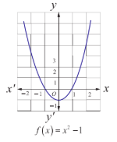
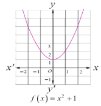

### 2.1 Introduction to Complex Numbers

Before introducing complex numbers, let us try to answer the question "Whether there exists a real number whose square is negative?" Let's look at simple examples to get the answer for it. Consider the equations 1 and 2.

Equation 1: $x^{2}-1=0$  

$x=\pm \sqrt{1}$  

$x=\pm 1$  

Equation 2: $x^{2}+1=0$

$x=\pm \sqrt{-1}$

$x=\pm ?$

**Figure 2.1**  

Equation 1 has two real solutions, $x = -1$ and $x = 1$. We know that solving an equation in $x$ is equivalent to finding the $x$-intercepts of a graph of $f(x) = x^{2} - 1$ crosses the $x$-axis at $(-1,0)$ and $(1,0)$.

**Figure 2.2**

By the same logic, equation 2 has no real solutions since the graph of $f(x) = x^{2} + 1$ does not cross the $x$-axis; we can see this by looking at the graph of $f(x) = x^{2} + 1$.

This is because, when we square a real number it is impossible to get a negative real number. If equation 2 has solutions, then we must create an imaginary number as a square root of $-1$. This imaginary unit $\sqrt{-1}$ is denoted by $i$. The imaginary number $i$ tells us that $i^{2} = -1$. We can use this fact to find other powers of $i$.

#### 2.1.1 Powers of imaginary unit $i$
| $i^0 = 1$, $i^1 = i$ | $i^2 = -1$ | $i^3 = i^2 i = -i$ | $i^4 = i^2 i^2 = 1$ |
|---|---|---|---|
| $(i)^{-1} = \frac{1}{i} = \frac{i}{i^2} = -i$ | $(i)^{-2} = -1$ | $(i)^{-3} = i$ | $(i)^{-4} = 1 = i^4$ |

We note that, for any integer $n$, $i^{n}$ has only four possible values: they correspond to values of $n$ when divided by 4 leave the remainders 0, 1, 2, and 3. That is when the integer $n \leq -4$ or $n \geq 4$, using division algorithm, $n$ can be written as $n = 4q + k$, $0 \leq k < 4$, $k$ and $q$ are integers and we write

$$
(i)^{n} = (i)^{4q + k} = (i)^{4q}(i)^{k} = ((i)^{4})^{q}(i)^{k} = (1)^{q}(i)^{k} = (i)^{k}
$$

**Example 2.1**

Simplify the following

(i) $i^{7}$  
(ii) $i^{1729}$  
(iii) $i^{-1924} + i^{2018}$  
(iv) $\sum_{n=1}^{102} i^{n}$  
(v) $i i^{2} i^{3} \dots i^{40}$

**Solution**

(i) $i^{7} = i^{4+3} = i^{3} = -i$  
(ii) $i^{1729} = i^{1728} i^{1} = i$  
(iii) $i^{-1924} + i^{2018} = i^{-1924+0} + i^{2016+2} = i^{0} + i^{2} = 1 - 1 = 0$

(iv) $$ \sum_{n=1}^{102} i^n = (i^1 + i^2 + i^3 + i^4) + (i^5 + i^6 + i^7 + i^8) + \cdots + (i^{97} + i^{98} + i^{99} + i^{100}) + i^{101} + i^{102} $$
$$ = (i^1 + i^2 + i^3 + i^4) + (i^1 + i^2 + i^3 + i^4) + \cdots + (i^1 + i^2 + i^3 + i^4) + i^1 + i^2 $$
$$ = \{i + (-1) + (-i) + 1\} + \{i + (-1) + (-i) + 1\} + \cdots + \{i + (-1) + (-i) + 1\} + i + (-1) $$
$$ = 0 + 0 + \cdots + 0 + i - 1 $$
$$ = -1 + i \quad (\text{What is this number?}) $$

(v) $$ i^2 i^3 \cdots i^{40} = i^{1+2+3+\cdots+40} = i^{\frac{40 \times 41}{2}} = i^{80} = i^0 = 1. $$

**Result:** Sum of four consecutive powers of $i$ is zero. That is $i^n + i^{n+1} + i^{n+2} + i^{n+3} = 0 \quad \forall n \in \mathbb{Z}$

**Note**

(i) $$ \sqrt{ab} = \sqrt{a} \sqrt{b} $$ valid only if at least one of $a, b$ is non-negative.

For example, $$ 6 = \sqrt{36} = \sqrt{(-4)(-9)} = \sqrt{(-4)} \sqrt{(-9)} = (2i)(3i) = 6i^2 = -6 $$, a contradiction.

Since we have taken $$ \sqrt{(-4)(-9)} = \sqrt{(-4)} \sqrt{(-9)} $$, we arrived at a contradiction.

Therefore $$ \sqrt{ab} = \sqrt{a} \sqrt{b} $$ valid only if at least one of $a, b$ is non-negative.

(ii) For $y \in \mathbb{R}$, $y^2 \geq 0$

Therefore, $$ \sqrt{(-1)(y^2)} = \sqrt{(y^2)(-1)} $$
$$ \sqrt{(-1)} \sqrt{(y^2)} = \sqrt{(y^2)} \sqrt{(-1)} $$
$$ iy = yi. $$

**EXERCISE 2.1**

Simplify the following:

1. $$ i^{1947} + i^{1950} $$
2. $$ i^{1948} - i^{-1869} $$
3. $$ \sum_{n=1}^{12} i^n $$
4. $$ i^{59} + \frac{1}{i^{59}} $$
5. $$ i^2 i^3 \cdots i^{2000} $$
6. $$ \sum_{n=1}^{10} i^{n+50} $$
