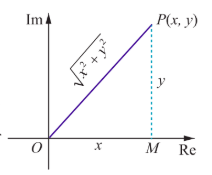
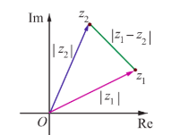
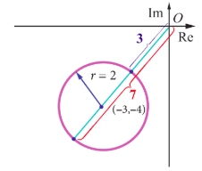
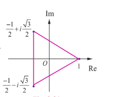

## 2.5 Modulus of a Complex Number

Just as the absolute value of a real number measures the distance of that number from origin along the real number line, the modulus of a complex number measures the distance of that number from the origin in the complex plane. Observe that the length of the line from the origin along the radial line to $z = x + iy$ is simply the hypotenuse of a right triangle, with one side of length $x$ and the other side of length $y$.

### Definition 2.4

If $z = x + iy$, then the modulus of $z$, denoted by $|z|$, is defined by $|z| = \sqrt{x^2 + y^2}$.

For instance  
(i) $|i| = \sqrt{0^2 + 1^2} = 1$  
(ii) $|-12i| = \sqrt{0^2 + (-12)^2} = 12$  
(iii) $|12 - 5i| = \sqrt{12^2 + (-5)^2} = \sqrt{169} = 13$  

### Note

If $z = x + iy$, then $\overline{z} = x - iy$, then $z \overline{z} = (x + iy)(x - iy) = (x^2 - iy^2) = x^2 + y^2 = |z|^2$.

## 2.5.1 Properties of Modulus of a complex number

1. $|z| = |\overline{z}|$  
2. $|z_1 + z_2| \leq |z_1| + |z_2|$ (Triangle inequality)  
3. $|z_1 z_2| = |z_1| |z_2|$  
4. $|z_1 - z_2| \geq |z_1| - |z_2|$  
5. $\frac{|z_1|}{|z_2|} = \frac{|z_1|}{|z_2|}, \quad z_2 \neq 0$  
6. $|z^n| = |z|^n$, where $n$ is an integer  
7. $\text{Re}(z) \leq |z|$  
8. $\text{Im}(z) \leq |z|$  

Let us prove some of the properties.

### Property Triangle inequality

For any two complex numbers $z_1$ and $z_2$, we have $|z_1 + z_2| \leq |z_1| + |z_2|$.

### Proof

Using  
$$|z_1 + z_2|^2 = (z_1 + z_2)(\overline{z_1} + \overline{z_2})$$  
$$= (z_1 + z_2)(\overline{z_1} + \overline{z}_2)$$  
$$= z_1 \overline{z_1} + z_1 \overline{z_2} + z_2 \overline{z_1} + z_2 \overline{z_2}$$  
$$= z_1 \overline{z_1} + (z_1 \overline{z_2} + z_2 \overline{z_1}) + z_2 \overline{z_2}$$  
$$= z_1 \overline{z_1} + z_2 \overline{z_2}$$  
$$= |z_1|^2 + |z_2|^2$$  
$$= |z|^2 + |z|^2$$  
$$= |z|^2 + |z|^2$$

$$= |z_1|^2 + 2 \text{Re}(z_1 \overline{z_2}) + |z_2|^2 \tag{2} \quad \text{Re}(z) = z + \overline{z}$$
$$= |z_1|^2 + 2|z_1|^2 + |z_2|^2 \tag{3} \quad \text{Re}(z) \leq |z|$$
$$= |z_1|^2 + 2|z_1| |z_2| + |z_2|^2 \tag{4} \quad |z_1| \leq |z_1| \leq |z_2| \text{ and } |z| = |z|$$
$$\Rightarrow |z_1 + z_2|^2 \leq (|z_1| + |z_2|)^2$$
$$\Rightarrow |z_1 + z_2| \leq |z_1| + |z_2|.$$

### Geometrical interpretation

Now consider the triangle shown in figure with vertices $O, z_1$ or $z_2$, and $z_1 + z_2$. We know from geometry that the length of the side of the triangle corresponding to the vector $z_1 + z_2$ cannot be greater than the sum of the lengths of the remaining two sides. This is the reason for calling the property as "Triangle Inequality".

It can be generalized by means of mathematical induction to finite number of terms:

$$|z_1 + z_2 + z_3 + \cdots + z_n| \leq |z_1| + |z_2| + |z_3| + \cdots + |z_n| \quad \text{for } n = 2, 3, \cdots.$$

**Figure 2.17**

### Property The distance between the two points $z_1$ and $z_2$ in complex plane is $|z_1 - z_2|$

If $z_1 = x_1 + iy_1$ and $z_2 = x_2 + iy_2$, then

$$|z_1 - z_2| = \sqrt{(x_1 - x_2)^2 + (y_1 - y_2)^2}$$

### Remark

The distance between the two points $z_1$ and $z_2$ in complex plane is $|z_1 - z_2|$.

If we consider origin, $z_1$ and $z_2$ as vertices of a triangle, by the similar argument we have

$$|z_1 - z_2| \leq |z_1| + |z_2|$$
$$|z_1| - |z_2| \leq |z_1 + z_2| \leq |z_1| + |z_2|$$
$$|z_1| - |z_2| \leq |z_1 - z_2| \leq |z_1| + |z_2|.$$

**Figure 2.18**

### Property Modulus of the product is equal to product of the moduli.

For any two complex numbers $z_1$ and $z_2$, we have $|z_1 z_2| = |z_1| |z_2|$.

### Proof

We have

$$|z_1 z_2|^2 = (z_1 z_2)(\overline{z_1} z_2) \tag{1} \quad |z|^2 = z \overline{z}$$
$$= (z_1)(z_2)(\overline{z_1})(\overline{z_2}) \tag{2} \quad (\overline{z_1} z_2 = \overline{z_1} \overline{z_2})$$

$$= (z_1 \overline{z_1})(z_2 \overline{z_2}) = |z_1|^2 |z_2|^2 \quad \text{(by commutativity } z_1 \overline{z_1} = \overline{z_1} z_1 \overline{z_1} \text{)}$$

Therefore, $$|z_1 z_2| = |z_1| |z_2|.$$

### Note

It can be generalized by means of mathematical induction to any finite number of terms:

$$|z_1 z_2 z_3 \cdots z_n| = |z_1| |z_2| |z_3| \cdots |z_n|$$

That is the modulus value of a product of complex numbers is equal to the product of the moduli of complex numbers.

Similarly we can prove the other properties of modulus of a complex number.

### Example 2.9

If $ z_1 = 3 + 4i $, $ z_2 = 5 - 12i $, and $ z_3 = 6 + 8i $, find $|z_1|$, $|z_2|$, $|z_3|$, $|z_1 + z_2|$, $|z_2 - z_3|$, and $|z_1 + z_3|$.

### Solution

Using the given values for $ z_1, z_2, $ and $ z_3 $, we get

$$|z_1| = |3 + 4i| = \sqrt{3^2 + 4^2} = 5$$

$$|z_2| = |5 - 12i| = \sqrt{5^2 + (-12)^2} = 13$$

$$|z_3| = |6 + 8i| = \sqrt{6^2 + 8^2} = 10$$

$$|z_1 + z_2| = |(3 + 4i) + (5 - 12i)| = |8 - 8i| = \sqrt{128} = 8\sqrt{2}$$

$$|z_2 - z_3| = |(5 - 12i) - (6 + 8i)| = |-1 - 20i| = \sqrt{401}$$

$$|z_1 + z_3| = |(3 + 4i) + (6 + 8i)| = |9 + 12i| = \sqrt{225} = 15$$

Note that the triangle inequality is satisfied in all the cases.

$$|z_1 + z_3| = |z_1| + |z_3| = 15 \quad \text{(why?)}$$

### Example 2.10

Find the following

(i) $$ \frac{2 + i}{-1 + 2i} $$

(ii) $$ \frac{(1 + i)(2 + 3i)(4i - 3)}{(1 + i)^2} $$

(iii) $$ \frac{i(2 + i)^3}{(1 + i)^2} $$

### Solution

(i) $$ \frac{2 + i}{-1 + 2i} = \frac{|2 + i|}{|-1 + 2i|} = \frac{\sqrt{2^2 + 1^2}}{\sqrt{(-1)^2 + 2^2}} = 1. \quad \left( \cdots \left| \frac{z_1}{z_2} \right| = \left| \frac{z_1}{z_2} \right|, \quad z_2 \neq 0 \right) $$

(ii) $$ \frac{(1 + i)(2 + 3i)(4i - 3)}{(1 + i)^2} = \frac{|(1 + i)(2 + 3i)| |(4i - 3)|}{(1 + i)^2} = \frac{|1 + i| |2 + 3i| |4i - 3|}{(1 + i)^2} = \frac{|1 + i| |2 + 3| |4 - 3|}{(1 + i)^2} = \frac{\sqrt{2^2 + 1^2}}{\sqrt{(-1)^2 + 2^2}} \left( \cdots \left| \frac{z_1}{z_2} \right| = \left| \frac{z_1}{z_2} \right|, \quad z_2 \neq 0 \right) $$

(iii) $$ \frac{i(2 + i)^3}{(1 + i)^2} = \frac{|i| |(2 + i)^3|}{|(1 + i)^2|} = \frac{|1 + i|^3}{|1 + i|^2} = \frac{\sqrt{4 + 1}}{\sqrt{2}} \left( \cdots \left| \frac{z_1}{z_2} \right| = \left| \frac{z_1}{z_2} \right|, \quad z_2 \neq 0 \right) $$

$$= \frac{\sqrt{5}}{2} = \frac{5\sqrt{5}}{2}.$$

### Example 2.11
Which one of the points $i, -2+i$, and 3 is farthest from the origin?

#### Solution
The distance between origin to $z = i, -2+i$, and 3 are

$$|z| = |i| = 1$$

$$|z| = |-2+i| = \sqrt{(-2)^2 + 1^2} = \sqrt{5}$$

$$|z| = |3| = 3$$

Since $1 < \sqrt{5} < 3$, the farthest point from the origin is 3.

**Figure 2.19**

### Example 2.12
If $z_1, z_2$, and $z_3$ are complex numbers such that $|z_1| = |z_2| = |z_3| = |z_1 + z_2 + z_3| = 1$,

find the value of $\frac{1}{z_1} + \frac{1}{z_2} + \frac{1}{z_3}$.

#### Solution
Since, $|z_1| = |z_2| = |z_3| = 1$,

$$|z_1|^2 = 1 \implies z_1 \overline{z_1} = 1, |z_2|^2 = 1 \implies z_2 \overline{z_2} = 1, \text{ and } |z_3|^2 = 1 \implies z_3 \overline{z_3} = 1$$

Therefore, $\overline{z_1} = \frac{1}{z_1}, \overline{z_2} = \frac{1}{z_2}, \text{ and } \overline{z_3} = \frac{1}{z_3}$ and hence

$$\left| \frac{1}{z_1} + \frac{1}{z_2} + \frac{1}{z_3} \right| = \left| \overline{z_1} + \overline{z_2} + \overline{z_3} \right| = |z_1 + z_2 + z_3| = 1.$$

---

### Example 2.13
If $|z| = 2$ show that $3 \leq |z + 3 + 4i| \leq 7$

#### Solution
$$|z + 3 + 4i| \leq |z| + |3 + 4i| = 2 + 5 = 7$$

$$|z + 3 + 4i| \leq 7 \tag{1}$$

$$|z + 3 + 4i| \geq |z| - |3 + 4i| = |2 - 5| = 3$$

$$|z + 3 + 4i| \geq 3 \tag{2}$$

From (1) and (2), we get $3 \leq |z + 3 + 4i| \leq 7$.

**Figure 2.20**

### Note
To find the lower bound and upper bound use $\|z_1| - |z_2|\| \leq |z_1 + z_2| \leq |z_1| + |z_2|$.

**Example 2.14**

Show that the points $1$, $\frac{-1}{2} + i \frac{\sqrt{3}}{2}$, and $\frac{-1}{2} - i \frac{\sqrt{3}}{2}$ are the vertices of an equilateral triangle.

**Solution**

It is enough to prove that the sides of the triangle are equal.

Let $z_{1} = 1$, $z_{2} = \frac{-1}{2} + i \frac{\sqrt{3}}{2}$, and $z_{3} = \frac{-1}{2} - i \frac{\sqrt{3}}{2}$.

The length of the sides of the triangles are

$$
|z_{1} - z_{2}| = \left|1 - \left(\frac{-1}{2} + i \frac{\sqrt{3}}{2}\right)\right| = \left|\frac{3}{2} - \frac{\sqrt{3}}{2} i\right| = \sqrt{\frac{9}{4} + \frac{3}{4}} = \sqrt{3}
$$

$$
|z_{2} - z_{3}| = \left|\left(\frac{-1}{2} + i \frac{\sqrt{3}}{2}\right) - \left(\frac{-1}{2} - i \frac{\sqrt{3}}{2}\right)\right| = \sqrt{(\sqrt{3})^{2}} = \sqrt{3}
$$

$$
|z_{3} - z_{1}| = \left|\left(\frac{-1}{2} - i \frac{\sqrt{3}}{2}\right) - 1\right| = \left|\frac{-3}{2} - \frac{\sqrt{3}}{2} i\right| = \sqrt{\frac{9}{4} + \frac{3}{4}} = \sqrt{3}
$$

**Figure 2.21**

Since the sides are equal, the given points form an equilateral triangle.

**Example 2.15**

Let $z_{1},z_{2}$, and $z_{3}$ be complex numbers such that $|z_{1}| = |z_{2}| = |z_{3}| = r > 0$ and $z_{1} + z_{2} + z_{3} \neq 0$

Prove that $\left|\frac{z_{1}z_{2} + z_{2}z_{3} + z_{3}z_{1}}{z_{1} + z_{2} + z_{3}}\right| = r$.

**Solution**

Given that

$$
|z_{1}| = |z_{2}| = |z_{3}| = r \Rightarrow z_{1}\overline{z_{1}} = z_{2}\overline{z_{2}} = z_{3}\overline{z_{3}} = r^{2}
$$

$$
\Rightarrow \overline{z_{1}} = \frac{r^{2}}{z_{1}}, \overline{z_{2}} = \frac{r^{2}}{z_{2}}, \overline{z_{3}} = \frac{r^{2}}{z_{3}}
$$

Now consider

$$
\left|\frac{z_{1}z_{2} + z_{2}z_{3} + z_{3}z_{1}}{z_{1} + z_{2} + z_{3}}\right| = \frac{|z_{1}z_{2} + z_{2}z_{3} + z_{3}z_{1}|}{|z_{1} + z_{2} + z_{3}|}
$$

We can also note that

$$
|z_{1} + z_{2} + z_{3}| = \left|\overline{z_{1} + z_{2} + z_{3}}\right| = |\overline{z_{1}} + \overline{z_{2}} + \overline{z_{3}}| = \left|\frac{r^{2}}{z_{1}} + \frac{r^{2}}{z_{2}} + \frac{r^{2}}{z_{3}}\right| = r^{2} \left|\frac{z_{2}z_{3} + z_{1}z_{3} + z_{1}z_{2}}{z_{1}z_{2}z_{3}}\right|
$$

Thus

$$
|z_{1} + z_{2} + z_{3}| = r^{2} \frac{|z_{2}z_{3} + z_{1}z_{3} + z_{1}z_{2}|}{|z_{1}z_{2}z_{3}|} = r^{2} \frac{|z_{2}z_{3} + z_{1}z_{3} + z_{1}z_{2}|}{r^{3}} = \frac{|z_{2}z_{3} + z_{1}z_{3} + z_{1}z_{2}|}{r}
$$

Therefore

$$
\frac{|z_{2}z_{3} + z_{1}z_{3} + z_{1}z_{2}|}{|z_{1} + z_{2} + z_{3}|} = r
$$

as required.

$$\Rightarrow \frac{z_2 z_3 + z_1 z_3 + z_1 z_2}{|z_1 + z_2 + z_3|} = r.$$
(given that $ z_1 + z_2 + z_3 \neq 0 $)

Thus,
$$\frac{z_2 z_3 + z_1 z_3 + z_1 z_2}{|z_1 + z_2 + z_3|} = r.$$

Example 2.16  
Show that the equation $ z^2 = \bar{z} $ has four solutions.

Solution  
We have,
$$z^2 = \bar{z}.$$
$$\Rightarrow |z|^2 = |z|$$
$$\Rightarrow |z|(|z| - 1) = 0,$$
$$\Rightarrow |z| = 0, \text{ or } |z| = 1.$$
$$|z| = 0 \Rightarrow z = 0 \text{ is a solution, } |z| = 1 \Rightarrow \bar{z} = 1 \Rightarrow \bar{z} = \frac{1}{z}.$$

Given $ z^2 = \bar{z} \Rightarrow z^2 = \frac{1}{z} \Rightarrow z^3 = 1.$

It has 3 non-zero solutions. Hence including zero solution, there are four solutions.

### 2.5.2 Square roots of a complex number

Let the square root of $ a + ib $ be $ x + iy $

That is $ \sqrt{a + ib} = x + iy $ where $ x, y \in \mathbb{R} $
$$a + ib = (x + iy)^2 = x^2 - y^2 + i2xy$$
Equating real and imaginary parts, we get
$$x^2 - y^2 = a \text{ and } 2xy = b$$
$$\left( x^2 + y^2 \right)^2 = \left( x^2 - y^2 \right)^2 + 4x^2y^2 = a^2 + b^2$$
$$x^2 + y^2 = \sqrt{a^2 + b^2}, \text{ since } x^2 + y^2 \text{ is positive}$$
Solving $ x^2 - y^2 = a $ and $ x^2 + y^2 = \sqrt{a^2 + b^2} $, we get
$$x = \pm \sqrt{\frac{\sqrt{a^2 + b^2} + a}{2}}; \quad y = \pm \sqrt{\frac{\sqrt{a^2 + b^2} - a}{2}}.$$

Since $ 2xy = b $ it is clear that both $ x $ and $ y $ will have the same sign when $ b $ is positive, and $ x $ and $ y $ have different signs when $ b $ is negative.

Therefore $ \sqrt{a + ib} = \pm \left( \sqrt{\frac{|z| + a}{2}} + i \frac{b}{|b|} \sqrt{\frac{|z| - a}{2}} \right), \text{ where } b \neq 0. \quad (\because \text{Re}(z) \leq |z|)$

Formula for finding square root of a complex number
$$\sqrt{a + ib} = \pm \left( \sqrt{\frac{|z| + a}{2}} + i \frac{b}{|b|} \sqrt{\frac{|z| - a}{2}} \right), \text{ where } z = a + ib \text{ and } b \neq 0.$$

**Example 2.17**

Find the square root of $6 - 8i$.

**Solution**

We compute $|6 - 8i| = \sqrt{6^{2} + (-8)^{2}} = 10$

and applying the formula for square root, we get

$$
\sqrt{6-8i} = \pm \left( \sqrt{\frac{10+6}{2}} - i \sqrt{\frac{10-6}{2}} \right) \quad (\because b \text{ is negative})
$$

$$
= \pm \left( \sqrt{8} - i \sqrt{2} \right)
$$

$$
= \pm \left( 2\sqrt{2} - i \sqrt{2} \right).
$$

## EXERCISE 2.5

1. Find the modulus of the following complex numbers

   (i) $\frac{2i}{3 + 4i}$  
   (ii) $\frac{2 - i}{1 + i} + \frac{1 - 2i}{1 - i}$  
   (iii) $(1 - i)^{10}$  
   (iv) $2i(3 - 4i)(4 - 3i)$.

2. For any two complex numbers $z_{1}$ and $z_{2}$, such that $|z_{1}| = |z_{2}| = 1$ and $z_{1}z_{2} \neq -1$, then show that $\frac{z_{1} + z_{2}}{1 + z_{1}z_{2}}$ is a real number.

3. Which one of the points $10 - 8i$, $11 + 6i$ is closest to $1 + i$.

4. If $|z| = 3$, show that $7 \leq |z + 6 - 8i| \leq 13$.

5. If $|z| = 1$, show that $2 \leq |z^{2} - 3| \leq 4$.

6. If $|z| = 2$, show that $8 \leq |z + 6 + 8i| \leq 12$.

7. If $z_{1},z_{2}$, and $z_{3}$ are three complex numbers such that $|z_{1}| = 1, |z_{2}| = 2, |z_{3}| = 3$ and $|z_{1} + z_{2} + z_{3}| = 1$, show that $|9z_{1}z_{2} + 4z_{1}z_{3} + z_{2}z_{3}| = 6$.

8. If the area of the triangle formed by the vertices $z$, $iz$, and $z + iz$ is 50 square units, find the value of $|z|$.

9. Show that the equation $z^{3} + 2\overline{z} = 0$ has five solutions.

10. Find the square roots of (i) $4 + 3i$ (ii) $-6 + 8i$ (iii) $-5 - 12i$.
