### 2.7 Polar and Euler form of a Complex Number

When performing addition and subtraction of complex numbers, we use rectangular form. This is because we just add real parts and add imaginary parts; or subtract real parts, and subtract imaginary parts. When performing multiplication or finding powers or roots of complex numbers, use an alternate form namely, polar form, because it is easier to compute in polar form than in rectangular form.

#### 2.7.1 Polar form of a complex number

Polar coordinates form another set of parameters that characterize the vector from the origin to the point $z = x + iy$, with magnitude and direction. The polar coordinate system consists of a fixed point $O$ called the pole and the horizontal half line emerging from the pole called the initial line (polar axis). If $r$ is the distance from the pole to a point $P$ and $\theta$ is an angle of inclination measured from the initial line in the counter clockwise direction to the line $OP$, then $r$ and $\theta$ of the ordered pair $(r,\theta)$ are called the polar coordinates of $P$. Superimposing this polar coordinate system on the rectangular coordinate system, as shown in diagram, leads to

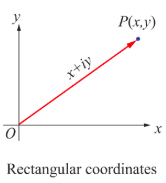
**Figure 2.26**  
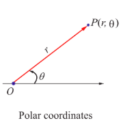
**Figure 2.27**
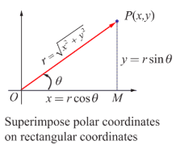  
**Figure 2.28**

$$
\begin{array}{r}
x = r\cos \theta \\
y = r\sin \theta
\end{array}
$$

Any non-zero complex number $z = x + iy$ can be expressed as $z = r\cos \theta + i r\sin \theta$

Let $r$ and $\theta$ be polar coordinates of the point $P(x,y)$ that corresponds to a non-zero complex number $z = x + iy$. The polar form or trigonometric form of a complex number $P$ is

$$
z = r(\cos \theta + i\sin \theta).
$$

For convenience, we can write polar form as

$$
z = x + iy = r(\cos \theta + i\sin \theta) = r \operatorname{cis} \theta.
$$

The value $r$ represents the absolute value or modulus of the complex number $z$. The angle $\theta$ is called the argument or amplitude of the complex number $z$ denoted by $\theta = \arg(z)$.

(i) If $z = 0$, the argument $\theta$ is undefined; and so it is understood that $z = 0$ whenever polar coordinates are used.

(ii) If the complex number $z = x + iy$ has polar coordinates $(r,\theta)$, its conjugate $\overline{z} = x - iy$ has polar coordinates $(r, -\theta)$.

Squaring and adding the equations and taking square root, the value of $r$ is given by $r = |z| = \sqrt{x^2 + y^2}$.

Dividing the equations, $\frac{r\sin\theta}{r\cos\theta} = \frac{y}{x} \Rightarrow \tan \theta = \frac{y}{x}$.

**Case (i)** The real number $\theta$ represents the angle, measured in radians, that $z$ makes with the positive real axis when $z$ is interpreted as a radius vector. The angle $\theta$ has an infinitely many possible values, including negative ones that differ by integral multiples of $2\pi$. Those values can be determined from the equation $\tan \theta = \frac{y}{x}$ where the quadrant containing the point corresponding to $z$ must be specified. Each value of $\theta$ is called an argument of $z$, and the set of all such values is obtained by adding multiple of $2\pi$ to $\theta$, and it is denoted by $\arg z$.

**Figure 2.29**

**Case (ii)** There is a unique value of $\theta$ which satisfies the condition $-\pi < \theta \leq \pi$.

This value is called a principal value of $\theta$ or principal argument of $z$ and is denoted by $\operatorname{Arg} z$.

Note that,

$$
-\pi < \operatorname{Arg}(z) \leq \pi \quad \text{or} \quad -\pi < \theta \leq \pi
$$

**Principal Argument of a complex number**
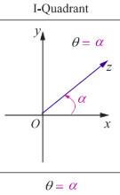
**Figure 2.30** 
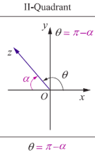
**Figure 2.31**
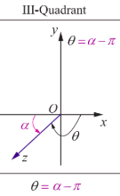  
**Figure 2.32**
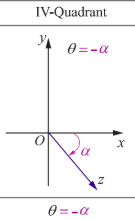
**Figure 2.33** 

The capital A is important here to distinguish the principal value from the general value.

Evidently, in practice to find the principal angle $\theta$, we usually compute $\alpha = \tan^{-1}\left|\frac{y}{x}\right|$ and adjust for the quadrant problem by adding or subtracting $\alpha$ with $\pi$ appropriately.

$$
\arg z = \operatorname{Arg} z + 2n\pi, \quad n \in \mathbb{Z}.
$$

Some of the properties of arguments are

$$
\begin{array}{l}
\arg(z_1 z_2) = \arg z_1 + \arg z_2 \\
\arg\left(\frac{z_1}{z_2}\right) = \arg z_1 - \arg z_2 \\
\arg(z^n) = n \arg z
\end{array}
$$

(4) The alternate forms of $\cos \theta + i\sin \theta$ are $\cos (2k\pi + \theta) + i\sin (2k\pi + \theta), \quad k \in \mathbb{Z}$

For instance the principal argument and argument of $1, i, -1$, and $-i$ are shown below:

| $z$ | 1 | $i$ | $-1$ | $-i$ |
|-----|---|---|------|------|
| $\operatorname{Arg}(z)$ | $0$ | $\pi/2$ | $\pi$ | $-\pi/2$ |
| $\arg z$ | $2n\pi$ | $2n\pi + \pi/2$ | $2n\pi + \pi$ | $2n\pi - \pi/2$ |

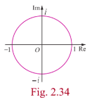
**Figure 2.34**

**Illustration**

Plot the following complex numbers in complex plane

(i) $5\left(\cos \frac{\pi}{4} + i\sin \frac{\pi}{4}\right)$  
(ii) $4\left(\cos \frac{2\pi}{3} + i\sin \frac{2\pi}{3}\right)$  
(iii) $3\left(\cos \frac{-5\pi}{6} + i\sin \frac{-5\pi}{6}\right)$  
(iv) $2\left(\cos \frac{\pi}{6} - i\sin \frac{\pi}{6}\right)$
 
**Figure 2.35**

#### 2.7.2 Euler's Form of the complex number

The following identity is known as Euler's formula

$$
e^{i\theta} = \cos \theta + i\sin \theta
$$

Euler formula gives the polar form $z = r e^{i\theta}$

**Note**

When performing multiplication or finding powers or roots of complex numbers, Euler form can also be used.

**Example 2.22**

Find the modulus and principal argument of the following complex numbers.

(i) $\sqrt{3} + i$  
(ii) $-\sqrt{3} + i$  
(iii) $-\sqrt{3} - i$  
(iv) $\sqrt{3} - i$

**Solution**

(i) $\sqrt{3} + i$

Modulus $= \sqrt{x^2 + y^2} = \sqrt{(\sqrt{3})^2 + 1^2} = \sqrt{3 + 1} = 2$

$$
\alpha = \tan^{-1}\left|\frac{y}{x}\right| = \tan^{-1}\frac{1}{\sqrt{3}} = \frac{\pi}{6}
$$

Since the complex number $\sqrt{3} + i$ lies in the first quadrant, the principal value is

$$
\theta = \alpha = \frac{\pi}{6}.
$$
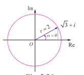
**Figure 2.36**

Therefore, the modulus and principal argument of $\sqrt{3} + i$ are $2$ and $\frac{\pi}{6}$ respectively.

(ii) $-\sqrt{3} + i$

Modulus $= 2$ and

$$
\alpha = \tan^{-1}\left|\frac{y}{x}\right| = \tan^{-1}\frac{1}{\sqrt{3}} = \frac{\pi}{6}
$$
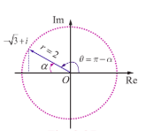

**Figure 2.37**

Since the complex number $-\sqrt{3} + i$ lies in the second quadrant, the principal value is

$$
\theta = \pi - \alpha = \pi - \frac{\pi}{6} = \frac{5\pi}{6}.
$$

Therefore the modulus and principal argument of $-\sqrt{3} + i$ are $2$ and $\frac{5\pi}{6}$ respectively.

(iii) $-\sqrt{3} - i$

$r = 2$ and $\alpha = \frac{\pi}{6}$.

Since the complex number $-\sqrt{3} - i$ lies in the third quadrant, the principal value is

$$
\theta = \alpha - \pi = \frac{\pi}{6} - \pi = -\frac{5\pi}{6}.
$$

**Figure 2.38**

Therefore, the modulus and principal argument of $-\sqrt{3} - i$ are $2$ and $-\frac{5\pi}{6}$ respectively.

(iv) $\sqrt{3} - i$

$r = 2$ and $\alpha = \frac{\pi}{6}$.

Since the complex number lies in the fourth quadrant, the principal value is

$$
\theta = -\alpha = -\frac{\pi}{6}
$$

**Figure 2.39**

Therefore, the modulus and principal argument of $\sqrt{3} - i$ are $2$ and $-\frac{\pi}{6}$.

In all the four cases, modulus are equal, but the arguments are depending on the quadrant in which the complex number lies.

**Example 2.23**

Represent the complex number (i) $-1 - i$ (ii) $1 + i\sqrt{3}$ in polar form.

**Solution**

(i) Let $-1 - i = r(\cos \theta + i\sin \theta)$

We have $r = \sqrt{x^2 + y^2} = \sqrt{1^2 + 1^2} = \sqrt{2}$

$$
\alpha = \tan^{-1}\left|\frac{y}{x}\right| = \tan^{-1}1 = \frac{\pi}{4}.
$$

Since the complex number $-1 - i$ lies in the third quadrant, it has the principal value

$$
\theta = \alpha - \pi = \frac{\pi}{4} - \pi = -\frac{3\pi}{4}
$$

Therefore,

$$
-1 - i = \sqrt{2}\left(\cos \left(-\frac{3\pi}{4}\right) + i\sin \left(-\frac{3\pi}{4}\right)\right)
$$

$$
= \sqrt{2}\left(\cos \frac{3\pi}{4} - i\sin \frac{3\pi}{4}\right).
$$

$$
-1 - i = \sqrt{2}\left(\cos \left(\frac{3\pi}{4} + 2k\pi\right) - i\sin \left(\frac{3\pi}{4} + 2k\pi\right)\right), \quad k \in \mathbb{Z}.
$$

**Note**

Depending upon the various values of $k$, we get various alternative polar forms.

(ii) $1 + i\sqrt{3}$

$$
r = |z| = \sqrt{1^2 + (\sqrt{3})^2} = 2
$$

$$
\theta = \tan^{-1}\left(\frac{\sqrt{3}}{1}\right) = \tan^{-1}(\sqrt{3}) = \frac{\pi}{3}
$$

Hence $\arg(z) = \frac{\pi}{3}$.

Therefore, the polar form of $1 + i\sqrt{3}$ can be written as

$$
1 + i\sqrt{3} = 2\left(\cos \frac{\pi}{3} + i\sin \frac{\pi}{3}\right)
$$

$$
= 2\left(\cos \left(\frac{\pi}{3} + 2k\pi\right) + i\sin \left(\frac{\pi}{3} + 2k\pi\right)\right), \quad k \in \mathbb{Z}.
$$

**Example 2.24**

Find the principal argument $\operatorname{Arg} z$, when $z = \frac{-2}{1 + i\sqrt{3}}$.

**Solution**

$$
\arg z = \arg \frac{-2}{1 + i\sqrt{3}}
$$

$$
= \arg(-2) - \arg\left(1 + i\sqrt{3}\right) \quad (\because \arg\left[\frac{z_1}{z_2}\right] = \arg z_1 - \arg z_2)
$$

$$
= \left(\pi - \tan^{-1}\left(\frac{0}{2}\right)\right) - \tan^{-1}\left(\frac{\sqrt{3}}{1}\right)
$$

$$
= \pi - \frac{\pi}{3} = \frac{2\pi}{3}
$$
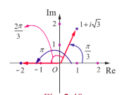

**Figure 2.40**

This implies that one of the values of $\arg z$ is $\frac{2\pi}{3}$.

Since $\frac{2\pi}{3}$ lies between $-\pi$ and $\pi$, the principal argument $\operatorname{Arg} z$ is $\frac{2\pi}{3}$.

**Properties of polar form**

**Property 1** If $z = r(\cos \theta + i\sin \theta)$, then $z^{-1} = \frac{1}{r}(\cos \theta - i\sin \theta)$.

**Proof**

$$
z^{-1} = \frac{1}{z} = \frac{1}{r(\cos\theta + i\sin\theta)}
$$

$$
= \frac{(\cos\theta - i\sin\theta)}{r(\cos\theta + i\sin\theta)(\cos\theta - i\sin\theta)}
$$

$$
= \frac{(\cos\theta - i\sin\theta)}{r(\cos^{2}\theta + \sin^{2}\theta)}
$$

$$
z^{-1} = \frac{1}{r}(\cos \theta - i\sin \theta).
$$
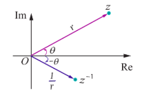

**Figure 2.41**

**Property 2** If $z_{1} = r_{1}(\cos \theta_{1} + i\sin \theta_{1})$ and $z_{2} = r_{2}(\cos \theta_{2} + i\sin \theta_{2})$, then $z_{1}z_{2} = r_{1}r_{2}(\cos(\theta_{1} + \theta_{2}) + i\sin(\theta_{1} + \theta_{2}))$.

**Figure 2.42**

**Proof**

$$
z_{1}z_{2} = r_{1}(\cos \theta_{1} + i\sin \theta_{1}) \cdot r_{2}(\cos \theta_{2} + i\sin \theta_{2})
$$

$$
= r_{1}r_{2}[(\cos \theta_{1}\cos \theta_{2} - \sin \theta_{1}\sin \theta_{2}) + i(\sin \theta_{1}\cos \theta_{2} + \cos \theta_{1}\sin \theta_{2})]
$$

$$
= r_{1}r_{2}[\cos(\theta_{1} + \theta_{2}) + i\sin(\theta_{1} + \theta_{2})]
$$

**Note**  
$$\arg(z_1 z_2) = \theta_1 + \theta_2 = \arg(z_1) + \arg(z_2).$$

### Property 3  
If $ z_1 = r_1 (\cos \theta_1 + i \sin \theta_1) $ and $ z_2 = r_2 (\cos \theta_2 + i \sin \theta_2) $, then  
$$\frac{z_1}{z_2} = \frac{r_1}{r_2} \left[ \cos(\theta_1 - \theta_2) + i \sin(\theta_1 - \theta_2) \right].$$

### Proof:  
Using the polar form of $ z_1 $ and $ z_2 $, we have  
$$\frac{z_1}{z_2} = \frac{r_1 (\cos \theta_1 + i \sin \theta_1)}{r_2 (\cos \theta_2 + i \sin \theta_2)}$$
$$= \frac{r_1 (\cos \theta_1 + i \sin \theta_1)(\cos \theta_2 - i \sin \theta_2)}{r_2 (\cos \theta_2 + i \sin \theta_2)(\cos \theta_1 - i \sin \theta_1)}$$
$$= \frac{r_1 (\cos \theta_1 \cos \theta_2 + \sin \theta_1 \sin \theta_2) + i (\sin \theta_1 \cos \theta_2 - \sin \theta_1 \cos \theta_2)}{\cos^2 \theta_1 + \sin^2 \theta_1}$$
$$= \frac{r_1}{r_2} (\cos(\theta_1 - \theta_2) + i \sin(\theta_1 - \theta_2)).$$

### Note  
$$\arg\left(\frac{z_1}{z_2}\right) = \theta_1 - \theta_2 = \arg(z_1) - \arg(z_2).$$

### Example 2.25  
Find the product  
$$\frac{3}{2} \left( \cos \frac{\pi}{3} + i \sin \frac{\pi}{3} \right) \cdot 6 \left( \cos \frac{5\pi}{6} + i \sin \frac{5\pi}{6} \right)$$  
in rectangular form.

### Solution:  
The Product  
$$\frac{3}{2} \left( \cos \frac{\pi}{3} + i \sin \frac{\pi}{3} \right) \cdot 6 \left( \cos \frac{5\pi}{6} + i \sin \frac{5\pi}{6} \right)$$
$$= \left( \frac{3}{2} \right) (6) \left( \cos \left( \frac{\pi}{3} + \frac{5\pi}{6} \right) + i \sin \left( \frac{\pi}{3} + \frac{5\pi}{6} \right) \right)$$
$$= 9 \left( \cos \left( \frac{7\pi}{6} \right) + i \sin \left( \frac{7\pi}{6} \right) \right)$$
$$= 9 \left( \cos \left( \pi + \frac{\pi}{6} \right) + i \sin \left( \pi + \frac{\pi}{6} \right) \right)$$

**EXERCISE 2.7**

1. Write in polar form of the following complex numbers  
   (i) $2 + i2\sqrt{3}$  
   (ii) $3 - i\sqrt{3}$  
   (iii) $-2 - i2$  
   (iv) $\frac{i - 1}{\cos\frac{\pi}{3} + i\sin\frac{\pi}{3}}$

2. Find the rectangular form of the complex numbers  
   (i) $\left(\cos \frac{\pi}{6} + i\sin \frac{\pi}{6}\right) \left(\cos \frac{\pi}{12} + i\sin \frac{\pi}{12}\right)$  
   (ii) $\frac{\cos \frac{\pi}{6} - i\sin \frac{\pi}{6}}{2\left(\cos \frac{\pi}{3} + i\sin \frac{\pi}{3}\right)}$

3. If $(x_{1} + i y_{1})(x_{2} + i y_{2})(x_{3} + i y_{3})\dots(x_{n} + i y_{n}) = a + i b$, show that

   (i) $(x_{1}^{2} + y_{1}^{2})(x_{2}^{2} + y_{2}^{2})(x_{3}^{2} + y_{3}^{2})\dots(x_{n}^{2} + y_{n}^{2}) = a^{2} + b^{2}$

   (ii) $\sum_{r=1}^{n} \tan^{-1}\left(\frac{y_{r}}{x_{r}}\right) = \tan^{-1}\left(\frac{b}{a}\right) + 2k\pi, \quad k \in \mathbb{Z}$.

4. If $\frac{1 + z}{1 - z} = \cos 2\theta + i\sin 2\theta$, show that $z = i\tan \theta$

5. If $\cos \alpha + \cos \beta + \cos \gamma = \sin \alpha + \sin \beta + \sin \gamma = 0$, show that

   (i) $\cos 3\alpha + \cos 3\beta + \cos 3\gamma = 3\cos(\alpha + \beta + \gamma)$ and  
   (ii) $\sin 3\alpha + \sin 3\beta + \sin 3\gamma = 3\sin(\alpha + \beta + \gamma)$.

6. If $z = x + i y$ and $\arg\left(\frac{z - i}{z + 2}\right) = \frac{\pi}{4}$, show that $x^{2} + y^{2} + 3x - 3y + 2 = 0$.
