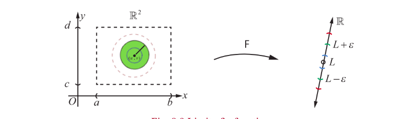
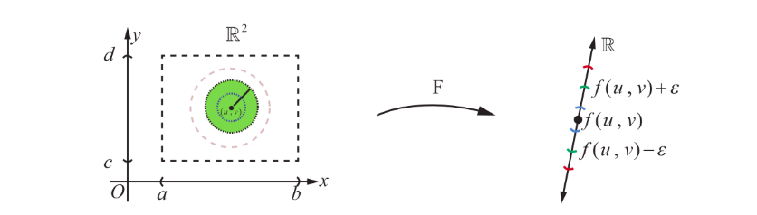

## 8.4 Limit and Continuity of Functions of Two Variables

> **Definition 8.6 (Limit of a Function)**
>
> Suppose that $A = \{(x, y) \mid a < x < b, c < y < d\} \subset \mathbb{R}^{2}, F: A \to \mathbb{R}$. We say that $F$ has a limit $L$ at $(u, v)$ if the following hold:
>
> For every neighbourhood $(L - \epsilon, L + \epsilon), \epsilon > 0$ of $L$ there exists a $\delta$-neighbourhood $B_{\delta}((u, v)) \subset A$ of $(u, v)$ such that $(x, y) \in B_{\delta}((u, v)) \setminus \{(u, v)\}, \delta > 0 \Rightarrow F(x, y) \in (L - \epsilon, L + \epsilon)$.
>
> We denote this by $\lim_{(x, y) \to (u, v)} F(x, y) = L$ if such a limit exists.

When compared to the case of a function of single variable, for a function of two variables, there is a subtle depth in the limiting process. Here the values of $F(x, y)$ should approach the same value $L$ as $(x, y)$ approaches $(u, v)$ along every possible path to $(u, v)$ (including paths that are not straight lines). Fig. 8.9 explains the limiting process.

All the rules for limits (limit theorems) for functions of one variable also hold true for functions of several variables.

Now, following the idea of continuity for functions of one variable, we define continuity of a function of two variables.

> **Definition 8.7 (Continuity)**
>
> Suppose that $A = \{(x, y) \mid a < x < b, c < y < d\} \subset \mathbb{R}^{2}, F: A \to \mathbb{R}$. We say that $F$ is continuous at $(u, v)$ if the following hold:
>
> (1) $F$ is defined at $(u, v)$
>
> (2) $\lim_{(x, y) \to (u, v)} F(x, y) = L$ exists
>
> (3) $L = F(u, v)$.

> **Remark**
>
> (1) In Fig. 8.10 taking $L = F(u, v)$ will illustrate continuity at $(u, v)$.
>
> (2) Continuity for $f(x_{1}, x_{2}, \ldots, x_{n})$ is also defined similarly as defined above.

Let us consider few examples as illustrations to understand continuity of functions of two variables.

**Example 8.8**

Let $f(x, y) = \frac{3x - 5y + 8}{x^{2} + y^{2} + 1}$ for all $(x, y) \in \mathbb{R}^{2}$. Show that $f$ is continuous on $\mathbb{R}^{2}$.

**Solution**

Let $(a, b) \in \mathbb{R}^{2}$ be an arbitrary point. We shall investigate continuity of $f$ at $(a, b)$. That is, we shall check if all the three conditions for continuity hold for $f$ at $(a, b)$.

To check first condition, note that $f(a, b) = \frac{3a - 5b + 8}{a^{2} + b^{2} + 1}$ is defined.

Next we want to find if $\lim_{(x, y) \to (a, b)} f(x, y)$ exists or not.

So we calculate $\lim_{(x, y) \to (a, b)} (3x - 5y + 8) = 3a - 5b + 8$ and $\lim_{(x, y) \to (a, b)} (x^{2} + y^{2} + 1) = a^{2} + b^{2} + 1 \neq 0$.

Thus, by the properties of limits, we see that

$$
\lim_{(x, y) \to (a, b)} f(x, y) = \frac{\lim_{(x, y) \to (a, b)} (3x - 5y + 8)}{\lim_{(x, y) \to (a, b)} (x^{2} + y^{2} + 1)} = \frac{3a - 5b + 8}{a^{2} + b^{2} + 1} = f(a, b) \text{ exists}.
$$

Now we note that $\lim_{(x, y) \to (a, b)} f(x, y) = L = f(a, b)$. Hence $f$ satisfies all the three conditions for continuity of $f$ at $(a, b)$. Since $(a, b)$ is an arbitrary point in $\mathbb{R}^{2}$, we conclude that $f$ is continuous at every point of $\mathbb{R}^{2}$.

**Example 8.9**

Consider $f(x, y) = \frac{xy}{x^{2} + y^{2}}$ if $(x, y) \neq (0, 0)$ and $f(0, 0) = 0$. Show that $f$ is not continuous at $(0, 0)$ and continuous at all other points of $\mathbb{R}^{2}$.

**Solution**

Note that $f$ is defined for every $(x, y) \in \mathbb{R}^{2}$. First let us check the continuity at $(a, b) \neq (0, 0)$. Let us say, just for instance, $(a, b) = (2, 5)$. Then $f(2, 5) = \frac{10}{29}$. Then, as in the above example, we calculate $\lim_{(x, y) \to (2, 5)} xy = 2 \cdot 5 = 10$ and $\lim_{(x, y) \to (2, 5)} (x^{2} + y^{2}) = 2^{2} + 5^{2} = 29 \neq 0$. Hence

$$
\lim_{(x, y) \to (2, 5)} \frac{xy}{x^{2} + y^{2}} = \frac{10}{29}.
$$

Since $f(2, 5) = \frac{10}{29} = \lim_{(x, y) \to (2, 5)} \frac{xy}{x^{2} + y^{2}}$, it follows that $f$ is continuous at $(2, 5)$.

Exactly by similar arguments we can show that $f$ is continuous at every point $(a, b) \neq (0, 0)$. Now let us check the continuity at $(0, 0)$. Note that $f(0, 0) = 0$ by definition. Next we want to find if $\lim_{(x, y) \to (0, 0)} \frac{xy}{x^{2} + y^{2}}$ exists or not.

First let us check the limit along the straight lines $y = mx$, passing through $(0, 0)$.

$$
\lim_{(x, y) \to (0, 0)} \frac{xy}{x^{2} + y^{2}} = \lim_{x \to 0} \frac{m x^{2}}{(1 + m^{2}) x^{2}} = \frac{m}{1 + m^{2}} \neq f(0, 0), \text{ if } m \neq 0.
$$

So for different values of $m$, we get different values $\frac{m}{1 + m^{2}}$ and hence we conclude that $\lim_{(x, y) \to (0, 0)} \frac{xy}{x^{2} + y^{2}}$ does not exist. Hence $f$ cannot be continuous at $(0, 0)$.

**Example 8.10**

Consider $g(x, y) = \frac{2x^{2}y}{x^{2} + y^{2}}$ if $(x, y) \neq (0, 0)$ and $g(0, 0) = 0$. Show that $g$ is continuous on $\mathbb{R}^{2}$.

**Solution**

Observe that the function $g$ is defined for all $(x, y) \in \mathbb{R}^{2}$. It is easy to check, as in the above examples, that $g$ is continuous at all points $(x, y) \neq (0, 0)$. Next we shall check the continuity of $g$ at $(0, 0)$. For that we see if $g$ has a limit $L$ at $(0, 0)$ and if $L = g(0, 0) = 0$. So we consider

$$
|g(x, y) - g(0, 0)| = \left| \frac{2x^{2}y}{x^{2} + y^{2}} - 0 \right| = \frac{2|x^{2}y|}{|x^{2} + y^{2}|} = \frac{2|xy||x|}{x^{2} + y^{2}} \leq \frac{(x^{2} + y^{2})|x|}{x^{2} + y^{2}} = |x|
$$

Note that in the final step above we have used $2|xy| \leq x^{2} + y^{2}$ (which follows by considering $0 \leq (x - y)^{2}$) for all $x, y \in \mathbb{R}$. Note that $(x, y) \to (0, 0)$ implies $|x| \to 0$. Then from (9) it follows that $\lim_{(x, y) \to (0, 0)} \frac{2x^{2}y}{x^{2} + y^{2}} = 0 = g(0, 0)$; which proves that $g$ is continuous at $(0, 0)$. So $g$ is continuous at every point of $\mathbb{R}^{2}$.

**EXERCISE 8.3**

1. Evaluate $\lim_{(x, y) \to (1, 2)} g(x, y)$, if the limit exists, where $g(x, y) = \frac{3x^{2} - xy}{x^{2} + y^{2} + 3}$.

2. Evaluate $\lim_{(x, y) \to (0, 0)} \cos\left(\frac{x^{3} + y^{2}}{x + y + 2}\right)$. If the limit exists.

3. Let $f(x, y) = \frac{y^{2} - xy}{\sqrt{x} - \sqrt{y}}$ for $(x, y) \neq (0, 0)$. Show that $\lim_{(x, y) \to (0, 0)} f(x, y) = 0$.

4. Evaluate $\lim_{(x, y) \to (0, 0)} \cos\left(\frac{e^{x} \sin y}{y}\right)$, if the limit exists.

5. Let $g(x, y) = \frac{x^{2}y}{x^{4} + y^{2}}$ for $(x, y) \neq (0, 0)$ and $g(0, 0) = 0$.
   (i) Show that $\lim_{(x, y) \to (0, 0)} g(x, y) = 0$ along every line $y = mx, m \in \mathbb{R}$.
   (ii) Show that $\lim_{(x, y) \to (0, 0)} g(x, y) = \frac{k}{1 + k^{2}}$ along every parabola $y = kx^{2}, k \in \mathbb{R} \setminus \{0\}$.

6. Show that $f(x, y) = \frac{x^{2} - y^{2}}{y^{2} + 1}$ is continuous at every $(x, y) \in \mathbb{R}^{2}$.

7. Let $g(x, y) = \frac{e^{y} \sin x}{x}$, for $x \neq 0$ and $g(0, 0) = 1$. Show that $g$ is continuous at $(0, 0)$.
