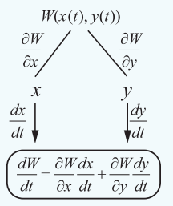
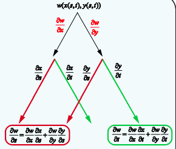

### 8.6 Linear Approximation and Differential of a function of several variables

Earlier in this chapter, we have seen that linear approximation and differential of a function of one variable. Here we introduce similar ideas for functions of two variables and three variables. In general for functions of several variables these concepts can be defined similarly.

> **Definition 8.10**
>
> Let $A = \{(x, y) \mid a < x < b, c < y < d\} \subset \mathbb{R}^2$ , $F : A \to \mathbb{R}$ , and $(x_0, y_0) \in A$ .
>
> (i) The linear approximation of $F$ at $(x_0, y_0) \in A$ is defined to be
>
> $$L(x, y) = F(x_0, y_0) + \frac{\partial F}{\partial x} \bigg|_{(x_0, y_0)} (x - x_0) + \frac{\partial F}{\partial y} \bigg|_{(x_0, y_0)} (y - y_0) \tag{12}$$
>
> (ii) The differential of $F$ is defined to be
>
> $$dF = \frac{\partial F}{\partial x} (x, y) dx + \frac{\partial F}{\partial y} (x, y) dy , \tag{13}$$
>
> where $dx = \Delta x$ and $dy = \Delta y$ .

Here we shall outline the linear approximations and differential for the functions of three variables. Actually, we can define linear approximations and differential for real valued function having more variables, but we restrict ourselves to only three variables.

> **Definition 8.11**
>
> Let $A = \{(x, y, z) \mid a < x < b, c < y < d, e < z < f\} \subset \mathbb{R}^3$ , $F : A \to \mathbb{R}$ and $(x_0, y_0, z_0) \in A$ .
>
> (i) The linear approximation of $F$ at $(x_0, y_0, z_0) \in A$ is defined to be
>
> $$L(x, y, z) = F(x_0, y_0, z_0) + \frac{\partial F}{\partial x} \bigg|_{(x_0, y_0, z_0)} (x - x_0) + \frac{\partial F}{\partial y} \bigg|_{(x_0, y_0, z_0)} (y - y_0) + \frac{\partial F}{\partial z} \bigg|_{(x_0, y_0, z_0)} (z - z_0) ; \tag{14}$$
>
> (ii) The differential of $F$ is defined by
>
> $$dF = \frac{\partial F}{\partial x} (x, y, z) dx + \frac{\partial F}{\partial y} (x, y, z) dy + \frac{\partial F}{\partial z} (x, y, z) dz , \tag{15}$$
>
> where $dx = \Delta x$ , $dy = \Delta y$ and $dz = \Delta z$ .

Geometrically, in the case of function $f$ of one variable, the linear approximation at a point $x_0$ represents the tangent line to the graph of $y = f(x)$ at $x_0$ . Similarly, in the case of a function $F$ of two variables, the linear approximation at a point $(x_0, y_0)$ represents the tangent plane to the graph of $z = F(x, y)$ at $(x_0, y_0)$ .

**Example 8.16**

If $w(x, y, z) = x^2 y + y^2 z + z^2 x$ , $x, y, z \in \mathbb{R}$ , find the differential $dw$ .

**Solution**

First let us find $w_x$ , $w_y$ , and $w_z$ .

Now $w_x = 2xy + z^2$ , $w_y = 2yz + x^2$ and $w_z = 2zx + y^2$ .

Thus, by (15), the differential is

$dw = (2xy + z^2) dx + (2yz + x^2) dy + (2zx + y^2) dz$ .

**Example 8.17**

Let $U(x, y, z) = x^2 - xy + 3 \sin z$ , $x, y, z \in \mathbb{R}$ . Find the linear approximation for $U$ at $(2, -1, 0)$ .

**Solution**

By (14), linear approximation is given by

$L(x, y, z) = U(x_0, y_0, z_0) + \frac{\partial U}{\partial x} \bigg|_{(x_0, y_0, z_0)} (x - x_0) + \frac{\partial U}{\partial y} \bigg|_{(x_0, y_0, z_0)} (y - y_0) + \frac{\partial U}{\partial z} \bigg|_{(x_0, y_0, z_0)} (z - z_0)$ .

Now $U_x = 2x - y$ , $U_y = -x$ and $U_z = 3 \cos z$ .

Here $(x_0, y_0, z_0) = (2, -1, 0)$ , hence $U_x(2, -1, 0) = 5$ , $U_y(2, -1, 0) = -2$ and $U_z(2, -1, 0) = 3$ .

Thus

$L(x, y, z) = 6 + 5(x - 2) - 2(y + 1) + 3(z - 0) = 5x - 2y + 3z - 6$

is the required linear approximation for $U$ at $(2, -1, 0)$ .

**EXERCISE 8.5**

1. If $w(x, y) = x^3 - 3xy + 2y^2$ , $x, y \in \mathbb{R}$ , find the linear approximation for $w$ at $(1, -1)$ .

2. Let $z(x, y) = x^2y + 3xy^4$ , $x, y \in \mathbb{R}$ . Find the linear approximation for $z$ at $(2, -1)$ .

3. If $v(x, y) = x^2 - xy + \frac{1}{4}y^2 + 7$ , $x, y \in \mathbb{R}$ , find the differential $dv$ .

4. Let $V(x, y, z) = xy + yz + zx$ , $x, y, z \in \mathbb{R}$ . Find the differential $dV$ .

### 8.6.1 Function of Function Rule

Let $F$ be a function of two variables $x, y$ . Sometimes these variables may be functions of a single variable having same domain. In this case, the function $F$ ultimately depends only on one variable. So we should be able to treat this $F$ as a function of single variable and study about $\frac{dF}{dt}$ . In fact, this is not a coincidence, it can be proved that

> **Theorem 8.2**
>
> Suppose that $W(x, y)$ is a function of two variables $x, y$ having partial derivatives  
> $\frac{\partial W}{\partial x}$ , $\frac{\partial W}{\partial y}$ .  
> If both the variables $x, y$ are differentiable functions of a single variable $t$ , then $W$ is a differentiable function of $t$ and
>
> 
>
> $$\frac{dW}{dt} = \frac{\partial W}{\partial x} \frac{dx}{dt} + \frac{\partial W}{\partial y} \frac{dy}{dt} . \tag{16}$$

Let us consider an example illustrating the above theorem.

**Example 8.18**

Verify the above theorem for $F(x, y) = x^2 - 2y^2 + 2xy$ and  
$x(t) = \cos t$ , $y(t) = \sin t$ , $t \in [0, 2\pi]$ .

**Solution**

Let $F(x, y) = x^2 - 2y^2 + 2xy$ and $x(t) = \cos t$ , $y(t) = \sin t$ .

Then $F(x, y) = \cos^2 t - 2\sin^2 t + 2\cos t \sin t$ and thus $F$ has becomes a function of one variable $t$ . So by using chain rule, we see that

$\frac{dF}{dt} = 2\cos t(-\sin t) - 4\sin t \cos t + 2(-\sin^2 t + \cos^2 t) = -6\cos t \sin t + 2(-\sin^2 t + \cos^2 t)$ .

On the other hand if we calculate

$\frac{\partial F}{\partial x} \frac{dx}{dt} + \frac{\partial F}{\partial y} \frac{dy}{dt} = (2x + 2y) \frac{dx}{dt} + (2x - 4y) \frac{dy}{dt} = 2(\cos t + \sin t)(-\sin t) + 2(\cos t - 2\sin t)(\cos t) = -6\cos t \sin t + 2(-\sin^2 t + \cos^2 t) = \frac{dF}{dt}$ .

**Example 8.19**

Let $g(x, y) = x^2 - yx + \sin(x + y)$ , $x(t) = e^t$ , $y(t) = t^2$ , $t \in \mathbb{R}$ . Find $\frac{dg}{dt}$ .

**Solution**

We shall follow the tree diagram to calculate $\frac{dg}{dt}$ .

So first we need to find $\frac{\partial g}{\partial x}$ , $\frac{\partial g}{\partial y}$ , $\frac{dx}{dt}$ and $\frac{dy}{dt}$ .

Now $\frac{\partial g}{\partial x} = 2x - y + \cos(x + y)$ , $\frac{\partial g}{\partial y} = -x + \cos(x + y)$ , $\frac{dx}{dt} = e^t$ and $\frac{dy}{dt} = 2t$ .

Thus

$\frac{dg}{dt} = \frac{\partial g}{\partial x} \frac{dx}{dt} + \frac{\partial g}{\partial y} \frac{dy}{dt}$

$= (2x - y + \cos(x + y))e^t + (-x + \cos(x + y))(2t)$

$= (2e^t - t^2 + \cos(e^t + t^2))e^t + (-e^t + \cos(e^t + t^2))(2t)$

$= 2e^{2t} - t^2 e^t + e^t \cos(e^t + t^2) - 2te^t + 2t \cos(e^t + t^2)$ .

Also, some times our $W(x, y)$ will be such that $x = x(s, t)$ , and $y = y(s, t)$ where $s, t \in \mathbb{R}$ . Then $W$ can be considered as a function that depends on $s$ and $t$ . If $x, y$ both have partial derivatives with respect to $s, t$ and $W$ has partial derivatives with respect to $x$ and $y$ , then we can calculate the partial derivatives of $W$ with respect to $s$ and $t$ using the following theorem.

> **Theorem 8.3**
>
> Suppose that $W(x, y)$ is a function of two variables $x, y$ having partial derivatives $\frac{\partial W}{\partial x}$ , $\frac{\partial W}{\partial y}$ . If both variables $x = x(s, t)$ and $y = y(s, t)$ , where $s, t \in \mathbb{R}$ , have partial derivatives with respect to both $s$ and $t$ , then
>
> $$\frac{\partial W}{\partial s} = \frac{\partial W}{\partial x} \frac{\partial x}{\partial s} + \frac{\partial W}{\partial y} \frac{\partial y}{\partial s} , \tag{17}$$
>
> $$\frac{\partial W}{\partial t} = \frac{\partial W}{\partial x} \frac{\partial x}{\partial t} + \frac{\partial W}{\partial y} \frac{\partial y}{\partial t} . \tag{18}$$
>
> 

We omit the proof. The above theorem is very useful. For instance, consider the situation in which $x = r \cos \theta$ , and $y = r \sin \theta$ , $r \geq 0$ and $\theta \in \mathbb{R}$ , (change from cartesian co-ordinate to polar co-ordinate system). The above theorem can be generalized for functions having $n$ number of variables.

Let us consider an example.

**Example 8.20**

Let $g(x, y) = 2y + x^2$ , $x = 2r - s$ , $y = r^2 + 2s$ , $r, s \in \mathbb{R}$ . Find $\frac{\partial g}{\partial r}$ , $\frac{\partial g}{\partial s}$ .

**Solution**

Here again we shall use the tree diagram to calculate $\frac{\partial g}{\partial r}$ , $\frac{\partial g}{\partial s}$ .

Hence we find

$\frac{\partial g}{\partial x} = 2x$ , $\frac{\partial g}{\partial y} = 2$ , $\frac{\partial x}{\partial r} = 2$ , $\frac{\partial x}{\partial s} = -1$ , $\frac{\partial y}{\partial r} = 2r$ , and $\frac{\partial y}{\partial s} = 2$ .

Now

$\frac{\partial g}{\partial r} = \frac{\partial g}{\partial x} \frac{\partial x}{\partial r} + \frac{\partial g}{\partial y} \frac{\partial y}{\partial r} = 2x(2) + 2(2r) = 12r - 4s$ .

Also,

$\frac{\partial g}{\partial s} = \frac{\partial g}{\partial x} \frac{\partial x}{\partial s} + \frac{\partial g}{\partial y} \frac{\partial y}{\partial s} = 2x(-1) + (2)2 = -2(2r - s) + 4 = -4r + 2s + 4$ .

**EXERCISE 8.6**

1. If $u(x,y) = x^{2}y + 3xy^{4}$, $x = e^{t}$ and $y = \sin t$, find $\frac{du}{dt}$ and evaluate it at $t = 0$.

2. If $u(x,y,z) = xy^{2}z^{3}$, $x = \sin t$, $y = \cos t$, $z = 1 + e^{2t}$, find $\frac{du}{dt}$.

3. If $w(x,y,z) = x^{2} + y^{2} + z^{2}$, $x = e^{t}$, $y = e^{t}\sin t$ and $z = e^{t}\cos t$, find $\frac{dw}{dt}$.

4. Let $U(x,y,z) = xyz$, $x = e^{-t}$, $y = e^{-t}\cos t$, $z = \sin t$, $t\in \mathbb{R}$. Find $\frac{dU}{dt}$.

5. If $w(x,y) = 6x^{3} - 3xy + 2y^{2}$, $x = e^{t}$, $y = \cos s$, $s\in \mathbb{R}$, find $\frac{dw}{ds}$, and evaluate at $s = 0$.

6. If $z(x,y) = x\tan^{-1}(xy)$, $x = t^{2}$, $y = se^{t}$, $s,t\in \mathbb{R}$. Find $\frac{\partial z}{\partial s}$ and $\frac{\partial z}{\partial t}$ at $s = t = 1$.

7. Let $U(x,y) = e^{x}\sin y$, where $x = st^{2}$, $y = s^{2}t$, $s,t\in \mathbb{R}$. Find $\frac{\partial U}{\partial s}, \frac{\partial U}{\partial t}$ and evaluate them at $s = t = 1$.

8. Let $z(x,y) = x^{3} - 3x^{2}y^{3}$, where $x = se^{t}$, $y = se^{-t}$, $s,t\in \mathbb{R}$. Find $\frac{\partial z}{\partial s}$ and $\frac{\partial z}{\partial t}$.

9. $W(x,y,z) = xy + yz + zx$, $x = u - v$, $y = uv$, $z = u + v$, $u,v\in \mathbb{R}$. Find $\frac{\partial W}{\partial u}, \frac{\partial W}{\partial v}$, and evaluate them at $\left(\frac{1}{2},1\right)$.

### 8.6.2 Homogeneous Functions and Euler's Theorem

> **Definition 8.12**
>
> (a) Let $A = \{(x,y) \mid a < x < b, c < y < d\} \subset \mathbb{R}^{2}$, $F: A \to \mathbb{R}$. We say that $F$ is a **homogeneous function** on $A$, if there exists a constant $p$ such that $F(\lambda x, \lambda y) = \lambda^{p} F(x,y)$ for all $\lambda \in \mathbb{R}$ and suitably restricted $\lambda, x, y$ such that $(\lambda x, \lambda y) \in A$. This constant $p$ is called **degree** of $F$.
>
> (b) Let $B = \{(x,y,z) \mid a < x < b, c < y < d, u < z < v\} \subset \mathbb{R}^{3}$, $G: B \to \mathbb{R}$. We say that $G$ is a **homogeneous function** on $B$, if there exists a constant $p$ such that $G(\lambda x, \lambda y, \lambda z) = \lambda^{p} G(x,y,z)$ for all $\lambda \in \mathbb{R}$ and suitably restricted $\lambda, x, y, z$ such that $(\lambda x, \lambda y, \lambda z) \in B$. This constant $p$ is called **degree** of $G$.

> **Note**
>
> Division by any variable may occur, to avoid division by zero, we say that $\lambda, x, y, z$ are suitably restricted real numbers.

These types of functions are important in Ordinary differential equations (Chapter 10). Let us consider some examples.

Consider $F(x,y) = x^{3} - 2y^{3} + 5xy^{2}, (x,y) \in \mathbb{R}^{2}$. Then

$$
F(\lambda x, \lambda y) = (\lambda x)^{3} - 2(\lambda y)^{3} + 5(\lambda x)(\lambda y)^{2} = \lambda^{3}(x^{3} - 2y^{3} + 5xy^{2})
$$

and hence $F$ is a homogeneous function of degree 3.

On the other hand,

$G(x,y) = e^{x^{2}} + 3y^{2}$ is not a homogeneous function because,
$G(\lambda x, \lambda y) = e^{(\lambda x)^{2}} + 3(\lambda y)^{2} \neq \lambda^{p} G(x,y)$ for any $\lambda \neq 1$ and any $p$.

**Example 8.21**

Show that $F(x,y) = \frac{x^{2} + 5xy - 10y^{2}}{3x + 7y}$ is a homogeneous function of degree 1.

**Solution**

We compute

$$
F(\lambda x, \lambda y) = \frac{(\lambda x)^{2} + 5(\lambda x)(\lambda y) - 10(\lambda y)^{2}}{3\lambda x + 7\lambda y} = \frac{\lambda^{2}}{\lambda}\left(\frac{x^{2} + 5xy - 10y^{2}}{3x + 7y}\right) = \lambda F(x,y)
$$

for all $\lambda \in \mathbb{R}$. So $F$ is a homogeneous function of degree 1.

We state the following theorem of Leonard Euler on homogeneous functions.

> **Theorem 8.4 (Euler's Theorem - without proof)**
>
> Suppose that $A = \{(x,y) \mid a < x < b, c < y < d\} \subset \mathbb{R}^{2}$, $F: A \to \mathbb{R}$. If $F$ is having continuous partial derivatives and homogeneous on $A$, with degree $p$, then
>
> $ x\frac{\partial F}{\partial x}(x,y) + y\frac{\partial F}{\partial y}(x,y) = pF(x,y) \quad \forall (x,y) \in A. $
>
> Suppose that $B = \{(x,y,z) \mid a < x < b, c < y < d, u < z < v\} \subset \mathbb{R}^{3}$, $F: B \to \mathbb{R}$. If $F$ is having continuous partial derivatives and homogeneous on $B$, with degree $p$, then
>
> $ x\frac{\partial F}{\partial x}(x,y,z) + y\frac{\partial F}{\partial y}(x,y,z) + z\frac{\partial F}{\partial z}(x,y,z) = pF(x,y,z) \quad \forall (x,y,z) \in B. $

The above theorem is also true for any homogeneous function of $n$ variables; and is useful in certain calculations involving first order partial derivatives.

**Example 8.22**

If $u = \sin^{-1}\left(\frac{x + y}{\sqrt{x} + \sqrt{y}}\right)$, show that $x\frac{\partial u}{\partial x} + y\frac{\partial u}{\partial y} = \frac{1}{2}\tan u$.

**Solution**

Note that the function $u$ is not homogeneous. So we cannot apply Euler's Theorem for $u$. However, note that $f(x,y) = \frac{x + y}{\sqrt{x} + \sqrt{y}} = \sin u$ is homogeneous; because

$$
f(\lambda x, \lambda y) = \frac{\lambda x + \lambda y}{\sqrt{\lambda x} + \sqrt{\lambda y}} = \lambda^{1/2} f(x,y), \quad \forall x,y,\lambda \geq 0.
$$

Thus $f$ is homogeneous with degree $\frac{1}{2}$, and so by Euler's Theorem we have

$$
x\frac{\partial f}{\partial x} + y\frac{\partial f}{\partial y} = \frac{1}{2} f(x,y).
$$

Now substituting $f = \sin u$ in the above equation, we obtain

$$
x\frac{\partial (\sin u)}{\partial x} + y\frac{\partial (\sin u)}{\partial y} = \frac{1}{2} \sin u
$$
$$
x \cos u \frac{\partial u}{\partial x} + y \cos u \frac{\partial u}{\partial y} = \frac{1}{2} \sin u \quad (19)
$$

Dividing both sides by $\cos u$ we obtain

$$
x\frac{\partial u}{\partial x} + y\frac{\partial u}{\partial y} = \frac{1}{2} \tan u.
$$

> **Note**
>
> Solving this problem by direct calculation will be possible; but will involve lengthy calculations.

**EXERCISE 8.7**

1. In each of the following cases, determine whether the following function is homogeneous or not. If it is so, find the degree.
   (i) $f(x,y) = x^{2}y + 6x^{3} + 7$
   (ii) $h(x,y) = \frac{6x^{2}y^{3} - \pi y^{5} + 9x^{4}y}{2020x^{2} + 2019y^{2}}$
   (iii) $g(x,y,z) = \frac{\sqrt{3x^{2} + 5y^{2} + z^{2}}}{4x + 7y}$
   (iv) $U(x,y,z) = xy + \sin\left(\frac{y^{2} - 2z^{2}}{xy}\right)$

2. Prove that $f(x,y) = x^{3} - 2x^{2}y + 3xy^{2} + y^{3}$ is homogeneous; what is the degree? Verify Euler's Theorem for $f$.

3. Prove that $g(x,y) = x \log\left(\frac{y}{x}\right)$ is homogeneous; what is the degree? Verify Euler's Theorem for $g$.

4. If $u(x,y) = \frac{x^{2} + y^{2}}{\sqrt{x + y}}$, prove that $x\frac{\partial u}{\partial x} + y\frac{\partial u}{\partial y} = \frac{3}{2}u$.

5. If $v(x,y) = \log\left(\frac{x^{2} + y^{2}}{x + y}\right)$, prove that $x\frac{\partial v}{\partial x} + y\frac{\partial v}{\partial y} = 1$.

6. If $w(x,y,z) = \log\left(\frac{5x^{3}y^{4} + 7y^{2}xz^{4} - 75y^{3}z^{4}}{x^{2} + y^{2}}\right)$, find $x\frac{\partial w}{\partial x} + y\frac{\partial w}{\partial y} + z\frac{\partial w}{\partial z}$.