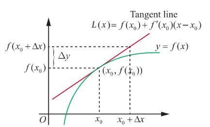
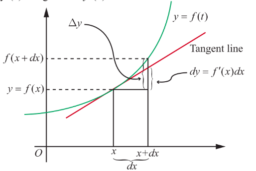

## 8.2 Linear Approximation and Differentials

### 8.2.1 Linear Approximation

In this section, we introduce linear approximation of a function at a point. Using the linear approximation, we shall estimate the function value near a chosen point. Then we shall introduce differential of a real-valued function of one variable, which is also useful in applications.

Let $f:(a,b)\to \mathbb{R}$ be a differentiable function and $x\in (a,b)$. Since $f$ is differentiable at $x$, we have

$$
\lim_{\Delta x\to 0}\frac{f(x + \Delta x) - f(x)}{\Delta x} = f^{\prime}(x) \quad (1)
$$

If $\Delta x$ is small, then by (1) we have

$$
f(x + \Delta x) - f(x)\approx f^{\prime}(x)\Delta x; \quad (2)
$$

which is equivalent to

$$
f(x + \Delta x)\approx f(x) + f^{\prime}(x)\Delta x, \quad (3)
$$

where $\approx$ means "approximately" equal. Also, observe that as the independent variable changes from $x$ to $x + \Delta x$, the function value changes from $f(x)$ to $f(x + \Delta x)$. Hence if $\Delta x$ is small and the change in the output is denoted by $\Delta f$ or $\Delta y$, then (2) can be rewritten as

$$
\text{change in the output} = \Delta y = \Delta f = f(x + \Delta x) - f(x)\approx f^{\prime}(x)\Delta x.
$$

Note that (3) helps in approximating the value of $f(x + \Delta x)$ using $f(x)$ and $f^{\prime}(x)\Delta x$. Also, for a fixed $x_{0}, y(x) = f(x_{0}) + f^{\prime}(x_{0})(x - x_{0}), x\in \mathbb{R}$, gives the tangent line for the graph of $f$ at $(x_{0}, f(x_{0}))$ which gives a good approximation to the function $f$ near $x_{0}$. This leads us to define

> **Definition 8.1 (Linear Approximation)**
>
> Let $f:(a,b)\to \mathbb{R}$ be a differentiable function and $x_{0}\in (a,b)$. We define the linear approximation $L$ of $f$ at $x_{0}$ by

$$
L(x) = f(x_{0}) + f^{\prime}(x_{0})(x - x_{0}),\quad \forall x\in (a,b) \quad (4)
$$

Note that by (3) and (4) we see that

$$
f(x + \Delta x)\approx f(x) + f^{\prime}(x)\Delta x,
$$

which is useful in approximating the value of $f(x + \Delta x)$.

Note that linear approximation for $f$ at $x_{0}$ gives a good approximation to $f(x)$ if $x$ is close to $x_{0}$. Because as $x$ approaches to $x_{0}$, by continuity of $f$ at $x_{0}$,

$$
\text{Error} = f(x) - L(x) = f(x) - f(x_{0}) - f^{\prime}(x_{0})(x - x_{0}) \quad (5)
$$

Also, if $f(x) = mx + c$, then its linear approximation is $L(x) = (mx_{0} + c) + m(x - x_{0}) = mx + c = f(x)$, for any point $x \in (a, b)$. That is, the linear approximation, in this case, is the original function itself (is it not surprising?).

**Example 8.1**

Find the linear approximation for $f(x) = \sqrt{1 + x}, x \geq -1$, at $x_{0} = 3$. Use the linear approximation to estimate $f(3.2)$.

**Solution**

We know from (4), that $L(x) = f(x_{0}) + f^{\prime}(x_{0})(x - x_{0})$. We have $x_{0} = 3, \Delta x = 0.2$ and hence $f(3) = \sqrt{1 + 3} = 2$. Also,

$$
f^{\prime}(x) = \frac{1}{2\sqrt{1 + x}} \text{ and hence } f^{\prime}(3) = \frac{1}{2\sqrt{1 + 3}} = \frac{1}{4}.
$$

Thus, $L(x) = 2 + \frac{1}{4}(x - 3) = \frac{x}{4} + \frac{5}{4}$ gives the required linear approximation.

$$
\text{Now}, f(3.2) = \sqrt{4.2} \approx L(3.2) = \frac{3.2}{4} + \frac{5}{4} = 2.050.
$$

Actually, if we use a calculator to calculate we get $\sqrt{4.2} = 2.04939$.

### 8.2.2 Errors: Absolute Error, Relative Error, and Percentage Error

When we are approximating a value, there occurs an error. In this section, we consider the error, which occurs by linear approximation, given by (4). We shall consider different types of errors. Taking $h = x - x_{0}$, we get $x = x_{0} + h$, then (5) becomes

$$
E(h) = f(x_{0} + h) - f(x_{0}) - f^{\prime}(x_{0})h. \quad (6)
$$

Note that $E(0) = 0$ and as we have already observed $\lim_{h \to 0} E(h) = 0$ follows from the continuity of $f$ at $x$. In addition, if $f$ is differentiable, then from (1), it follows that

$$
\lim_{h\to 0}\frac{E(h)}{h} = \lim_{h\to 0}\frac{f(x + h) - f(x)}{h} - f^{\prime}(x) = 0.
$$

Thus when $f$ is differentiable at $x_{0}$, then the above equation shows that $E(h)$ actually approaches zero faster than $h$ approaching zero. Now, we define

> **Definition 8.2**
>
> Suppose that certain quantity is to be determined. It's exact value is called the actual value. Some times we obtain its approximate value through some approximation process. In this case, we define
>
> Absolute error $=$ Actual value $-$ Approximate value.

So (6) gives the absolute error that occurs by a linear approximation. Let us look at an example illustrating the use of linear approximation.

**Example 8.2**

Use linear approximation to find an approximate value of $\sqrt{9.2}$ without using a calculator.

**Solution**

We need to find an approximate value of $\sqrt{9.2}$ using linear approximation. Now by (3), we have $f(x_{0} + \Delta x) \approx f(x_{0}) + f^{\prime}(x_{0})\Delta x$. To do this, we have to identify an appropriate function $f$, a point $x_{0}$ and $\Delta x$. Our choice should be such that the right side of the above approximate equality, should be computable without the help of a calculator. So, we choose $f(x) = \sqrt{x}, x_{0} = 9$ and $\Delta x = 0.2$. Then, $f^{\prime}(x_{0}) = \frac{1}{2\sqrt{9}}$ and hence

$$
\sqrt{9.2} \approx f(9) + f^{\prime}(9)(0.2) = 3 + \frac{0.2}{6} = 3.03333.
$$

Now if we use a calculator, just to compare, we find $\sqrt{9.2} = 3.03315$. We see that our approximation is accurate to three decimal places and the error is $3.03315 - 3.03333 = -0.00018$. [Also note that one could choose $f(x) = \sqrt{1 + x}, x_{0} = 8$ and $\Delta x = 0.2$. So the choice of $f$ and $x_{0}$ are not necessarily unique].

So in the above example, the absolute error is $3.03315 - 3.03333 = -0.00018$. Note that the absolute error says how much the error; but it does not say how good the approximation is. For instance, let us consider two simple cases.

Case 1: Suppose that the actual value of something is 5 and its approximated value is 4, then the absolute error is $5 - 4 = 1$.

Case 2: Suppose that the actual value of something is 100 and its approximated value is 95. In this case, the absolute error is $100 - 95 = 5$. So the absolute error in the first case is smaller when compared to the second case.

Among these two approximations, which is a better approximation; and why? The absolute error does not give a clear picture about whether an approximation is a good one or not. On the other hand, if we calculate relative error or percentage of error (defined below), it will be easy to see how good an approximation is. If the actual value is zero, then we do know how close our approximate answer is to the actual value. So if the actual value is not zero, then we define.

> **Deifinitoin 8.3**
>
> If the actual value is not zero, then
>
>$ \text{Relative error} = \frac{|\text{Actual value} - \text{Approximate value}|}{\text{Actual value}} $
>
> Percentage error $=$ Relative error $\times 100$

> **Note**
>
> Absolute error has unit of measurement where as relative error and percentage error are units free.

Note that, in the case of the above examples,

In the first case

The relative error $= \frac{1}{5} = 0.2$; and the percentage error $= \frac{1}{5} \times 100 = 20\%$.

In the second case

The relative error $= \frac{5}{100} = 0.05$; and the percentage error $= \frac{5}{100} \times 100 = 5\%$.

So the second approximation is a better approximation than the first one. Note that, in order to calculate the relative error or the percentage error one should know the actual value of what we are approximating.

Let us consider some examples.

**Example 8.3**

Let us assume that the shape of a soap bubble is a sphere. Use linear approximation to approximate the increase in the surface area of a soap bubble as its radius increases from $5\text{ cm}$ to $5.2\text{ cm}$. Also, calculate the percentage error.

**Solution**

Recall that surface area of a sphere with radius $r$ is given by $S(r) = 4\pi r^{2}$. Note that even though we can calculate the exact change using this formula, we shall try to approximate the change using the linear approximation. So, using (4), we have

Change in the surface area

$$
S(5.2) - S(5) \approx S^{\prime}(5)(0.2)
$$
$$
= 8\pi(5)(0.2) = 8\pi \text{ cm}^{2}
$$

Exact calculation of the change in the surface gives

$$
S(5.2) - S(5) = 108.16\pi - 100\pi = 8.16\pi \text{ cm}^{2}
$$
$$
\text{Percentage error} = \text{relative error} \times 100 = \frac{8.16\pi - 8\pi}{8.16\pi} \times 100 = 1.9607\%
$$

**Example 8.4**

A right circular cylinder has radius $r = 10\text{ cm}$ and height $h = 20\text{ cm}$. Suppose that the radius of the cylinder is increased from $10\text{ cm}$ to $10.1\text{ cm}$ and the height does not change. Estimate the change in the volume of the cylinder. Also, calculate the relative error and percentage error.

**Solution**

Recall that volume of a right circular cylinder is given by $V = \pi r^{2} h$, where $r$ is the radius and $h$ is the height. So we have $V(r) = \pi r^{2} h = 20\pi r^{2}$.

$$
V(10.1) - V(10) \approx \left.\frac{dV}{dr}\right|_{r=10} (10.1 - 10) = 20\pi \cdot 2 \cdot 10 \cdot (0.1) = 40\pi \text{ cm}^{3}
$$

Thus the estimate for the change in the volume is $40\pi \, \text{cm}^3$ .

Exact calculation of the volume change gives

$V(10.1) - V(10) = 2040.2\pi - 2000\pi = 40.2\pi \, \text{cm}^3$ .

So relative error =

$\frac{|40.2\pi - 40\pi|}{40.2\pi} = \frac{1}{201} = 0.00497$ ;

and hence the percentage error =

$\text{relative error} \times 100 = \frac{1}{201} \times 100 = 0.497\%$ .

**EXERCISE 8.1**

1. Let $f(x) = \sqrt[3]{x}$. Find the linear approximation at $x = 27$. Use the linear approximation to approximate $\sqrt[3]{27.2}$.

2. Use the linear approximation to find approximate values of
   (i) $(123)^{\frac{2}{3}} \qquad$ (ii) $\sqrt[3]{15} \qquad$ (iii) $\sqrt[3]{26}$

3. Find a linear approximation for the following functions at the indicated points.
   (i) $f(x) = x^{3} - 5x + 12, x_{0} = 2 \qquad$ (ii) $g(x) = \sqrt{x^{2} + 9}, x_{0} = -4 \qquad$ (iii) $h(x) = \frac{x}{x+1}, x_{0} = 1$

4. The radius of a circular plate is measured as 12.65 cm instead of the actual length 12.5 cm. Find the following in calculating change in the area of the circular plate:
   (i) Absolute error
   (ii) Relative error
   (iii) Percentage error

5. A sphere is made of ice having radius 10 cm. Its radius decreases from 10 cm to 9.8 cm. Find approximations for the following:
   (i) change in the volume
   (ii) change in the surface area

6. The time $T$, taken for a complete oscillation of a simple pendulum with length $l$, is given by the equation $T = 2\pi \sqrt{\frac{l}{g}}$, where $g$ is a constant. Find the approximate percentage error in the calculated value of $T$ corresponding to an error of 2 percent in the value of $l$.

7. Show that the percentage error in the $n^{\text{th}}$ root of a number is approximately $\frac{1}{n}$ times the percentage error in the number.

### 8.2.3 Differentials

Here again, we use the derivative concept to introduce "Differential". Let us take another look at (1),

$$
\frac{df}{dx} = \lim_{\Delta x\to 0}\frac{f(x + \Delta x) - f(x)}{\Delta x} = f^{\prime}(x) = \lim_{\Delta x\to 0}\frac{\Delta f}{\Delta x}. \quad (7)
$$

Here $\frac{df}{dx}$ is a notation, used by Leibniz, for the limit of the difference quotient, which is called the differential coefficient of $y$ with respect to $x$. Will it be meaningful to treat $\frac{df}{dx}$ as a quotient of $df$ and $dx$? In other words, it is possible to assign meaning to $df$ and $dx$ so that derivative is equal to the quotient of $df$ and $dx$. Well, in some cases yes. For instance, if $f(x) = mx + c$, $m, c$ are constants, then, $y = f(x)$

$$
\Delta y = f(x + \Delta x) - f(x) = m\Delta x = f^{\prime}(x)\Delta x \text{ for all } x\in \mathbb{R} \text{ and } \Delta x
$$

and hence equality in both (2), and (3). In this case changes in $x$ and $y(=f)$ are taking place along straight lines, in which case we have,

$$
\frac{\text{change in } f}{\text{change in } x} = \frac{\Delta y}{\Delta x} = f^{\prime}(x) = \frac{df}{dx} = \frac{dy}{dx}.
$$

Thus in this case the derivative $\frac{df}{dx}$ is truly a quotient of $df$ and $dx$, if we take $df = \Delta f = dy$ and $dx = \Delta x$. This leads us to define the differential of $f$ as follows:

> **Definition 8.4**
>
> Let $f:(a,b)\to \mathbb{R}$ be a differentiable function, for $x\in (a,b)$ and $\Delta x$ the increment given to $x$ we define the differential of $f$ by

> $ df = f^{\prime}(x)\Delta x. \quad (8) $

First we note that if $f(x) = x$, then by (8) we get $dx = f^{\prime}(x)\Delta x = 1 \cdot \Delta x$ which means that the differential $dx = \Delta x$, which is the change in $x$-axis. So the differential given by (8) is same as $df = f^{\prime}(x)dx$.

Next we explore the differential for an arbitrary differentiable function $y = f(x)$. Then $\Delta f = f(x + dx) - f(x)$ gives the change in output along the graph of $y = f(x)$ and $f^{\prime}(x)$ gives the slope of the tangent line at $(x, f(x))$. Let $dy$ or $df$ denote the increment in $f$ along the tangent line. Then by the above observation, we have $dy = f^{\prime}(x)dx$.

From the figure it is clear that $\Delta f \approx dy = df = f^{\prime}(x)dx$ and hence $f^{\prime}(x)$ can be viewed approximately as the quotient of $\Delta f$ and $\Delta x$. So we may interpret $\frac{df}{dx}$ as the quotient of $df$ and $dx$.

> **Remark**
>
> We know that derivative of a function is again a function. On the other hand, differential $df$ of a function $f$ is not only a function of the independent variable but also depends on the change in the input namely $dx = \Delta x$. So $df$ is a function of two changing quantities namely $x$ and $dx$. Observe that $\Delta f \approx df$, which can be observed from the Fig. 8.4.

In the table below we give some functions, their derivatives and their differentials side by side for comparative purpose.

| S. No. | Function | Derivative | Differential |
| :--- | :--- | :--- | :--- |
| 1 | $f(x) = x^n$ | $f'(x) = nx^{n-1}$ | $df = nx^{n-1} dx$ |
| 2 | $f(x) = \cos(x^2 + 7x)$ | $f'(x) = -\sin(x^2 + 7x)(2x + 7)$ | $df = -\sin(x^2 + 7x)(2x + 7) dx$ |
| 3 | $f(x) = \cot(x^2)$ | $f'(x) = -\cosec^2(x^2) 2x$ | $df = -\cosec^2(x^2) 2x dx$ |
| 4 | $f(x) = \sin^{-1}(x)$ | $f'(x) = \frac{1}{\sqrt{1-x^2}}$ | $df = \frac{1}{\sqrt{1-x^2}} dx$ |
| 5 | $f(x) = \tan^{-1}x$ | $f'(x) = \frac{1}{1+x^2}$ | $df = \frac{1}{1+x^2} dx$ |
| 6 | $f(x) = e^{x^3 - 5x + 7}$ | $f'(x) = e^{x^3 - 5x + 7}(3x^2 - 5)$ | $df = e^{x^3 - 5x + 7}(3x^2 -5) dx$ |
| 7 | $f(x) = \log(x^2 + 1)$ | $f'(x) = \frac{2x}{x^2 + 1}$ | $df = \frac{2x}{x^2 + 1} dx$ |

Next we look at the properties of differentials. These results easily follow from the definition of derivatives and the rules for differentiation. We give a proof for (5) below and the other proofs are left as exercises.

**Properties of Differentials**

Here we consider real-valued functions of real variable.

1. If $f$ is a constant function, then $df = 0$ .

2. If $f(x) = x$ identity function, then $df = 1dx$ .

3. If $f$ is differentiable and $c \in \mathbb{R}$ , then $d(cf) = cf'(x)dx$ .

4. If $f, g$ are differentiable, then $d(f + g) = df + dg = f'(x)dx + g'(x)dx$ .

5. If $f, g$ are differentiable, then $d(fg) = fdg + gdf = (f(x)g'(x) + f'(x)g(x))dx$ .

6. If $f, g$ are differentiable, then $d(f/g) = \frac{gdf - fdg}{g^2} = \frac{g(x)f'(x) - f(x)g'(x)}{g^2(x)}dx$ , where $g(x) \neq 0$ .

7. If $f, g$ are differentiable and $h = f \circ g$ is defined, then $dh = f'(g(x))g'(x)dx$ .

8. If $h(x) = e^{f(x)}$ , then $dh = e^{f(x)}f'(x)dx$ .

9. If $f(x) > 0$ for all $x$ and $g(x) = \log(f(x))$ , then $dg = \frac{f'(x)}{f(x)}dx$ .

**Example 8.5**

Let $f, g:(a,b)\to \mathbb{R}$ be differentiable functions. Show that $d(fg) = fdg + gdf$.

**Solution**

Let $f, g:(a,b)\to \mathbb{R}$ be differentiable functions and $h(x) = f(x)g(x)$. Then $h$, being a product of differentiable functions, is differentiable on $(a,b)$. So by definition $dh = h^{\prime}(x)dx$. Now by using product rule we have $h^{\prime}(x) = f(x)g^{\prime}(x) + f^{\prime}(x)g(x)$.

$$
dh = h^{\prime}(x)dx = (f(x)g^{\prime}(x) + f^{\prime}(x)g(x))dx = f(x)g^{\prime}(x)dx + f^{\prime}(x)g(x)dx
$$
$$
= f(x)dg + g(x)df = fdg + gdf
$$

**Example 8.6**

Let $g(x) = x^{2} + \sin x$. Calculate the differential $dg$.

**Solution**

Note that $g$ is differentiable and $g^{\prime}(x) = 2x + \cos x$.

Thus $dg = (2x + \cos x)dx$.

**Example 8.7**

If the radius of a sphere, with radius $10\text{ cm}$, has to decrease by $0.1\text{ cm}$, approximately how much will its volume decrease?

**Solution**

We know that volume of a sphere is given by $V = \frac{4}{3}\pi r^{3}$, where $r > 0$ is the radius. So the differential $dV = 4\pi r^{2}dr$ and hence

$$
\Delta V \approx dV = 4\pi (10)^{2}(9.9 - 10)\text{ cm}^{3}
$$
$$
= 4\pi \cdot 100 \cdot (-0.1)\text{ cm}^{3}
$$
$$
= -40\pi \text{ cm}^{3}.
$$

Note that we have used $dr = (9.9 - 10)\text{ cm}$, because radius decreases from 10 to 9.9. Again the negative sign in the answer indicates that the volume of the sphere decreases about $40\pi \text{ cm}^{3}$.

**EXERCISE 8.2**

1. Find differential $dy$ for each of the following functions:
   (i) $y = \frac{(1 - 2x)^{3}}{3 - 4x} \qquad$ (ii) $y = (3 + \sin(2x))^{2/3} \qquad$ (iii) $y = e^{x^{2} - 5x + 7} \cos(x^{2} - 1)$

2. Find $df$ for $f(x) = x^{2} + 3x$ and evaluate it for
   (i) $x = 2$ and $dx = 0.1 \qquad$ (ii) $x = 3$ and $dx = 0.02$

3. Find $\Delta f$ and $df$ for the function $f$ for the indicated values of $x, \Delta x$ and compare
   (i) $f(x) = x^{3} - 2x^{2}; x = 2, \Delta x = dx = 0.5$
   (ii) $f(x) = x^{2} + 2x + 3; x = -0.5, \Delta x = dx = 0.1$

4. Assuming $\log_{10}e = 0.4343$, find an approximate value of $\log_{10}1003$.

5. The trunk of a tree has diameter $30\text{ cm}$. During the following year, the circumference grew $6\text{ cm}$.
   (i) Approximately, how much did the tree's diameter grow?
   (ii) What is the percentage increase in area of the tree's cross-section?

6. An egg of a particular bird is very nearly spherical. If the radius to the inside of the shell is 5 mm and radius to the outside of the shell is $5.3\text{ mm}$, find the volume of the shell approximately.

7. Assume that the cross section of the artery of human is circular. A drug is given to a patient to dilate his arteries. If the radius of an artery is increased from $2\text{ mm}$ to $2.1\text{ mm}$, how much is cross-sectional area increased approximately?

8. In a newly developed city, it is estimated that the voting population (in thousands) will increase according to $V(t) = 30 + 12t^{2} - t^{3}$, $0 \leq t \leq 8$ where $t$ is the time in years. Find the approximate change in voters for the time change from 4 to $4\frac{1}{6}$ year.

9. The relation between the number of words $y$ a person learns in $x$ hours is given by $y = 52\sqrt{x}$, $0 \leq x \leq 9$. What is the approximate number of words learned when $x$ changes from
   (i) 1 to 1.1 hour?
   (ii) 4 to 4.1 hour?

10. A circular plate expands uniformly under the influence of heat. If its radius increases from $10.5\text{ cm}$ to $10.75\text{ cm}$, then find an approximate change in the area and the approximate percentage change in the area.

11. A coat of paint of thickness $0.2\text{ cm}$ is applied to the faces of a cube whose edge is $10\text{ cm}$. Use the differentials to find approximately how many cubic centimeters of paint is used to paint this cube. Also calculate the exact amount of paint used to paint this cube.
