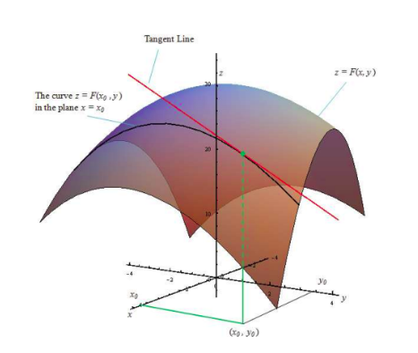
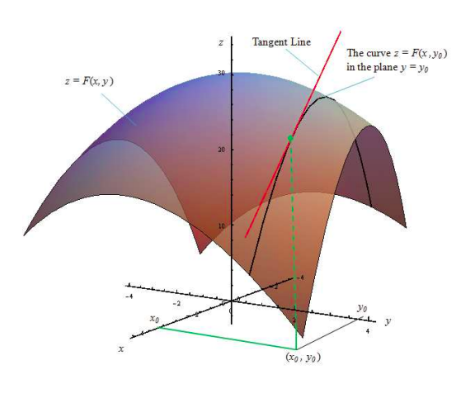

### 8.5 Partial Derivatives

In this section, we shall see how the concept of derivative for functions of one variable may be generalized to real-valued function of several variables. First we consider functions of two variables. Let $A = \{(x, y) \mid a < x < b, c < y < d\} \subset \mathbb{R}^2$ , and $F : A \to \mathbb{R}$ be a real-valued function. Suppose that $(x_0, y_0) \in A$ ; and we are interested in finding the rate of change of $F$ at $(x_0, y_0)$ with respect to the change **only** in the variable $x$ . As we have seen above $F(x, y_0)$ is a function of $x$ alone and it will represent a curve obtained by intersecting the surface $z = F(x, y)$ with $y = y_0$ plane. So we can discuss the slope of the tangent to the curve $z = F(x, y_0)$ at $x = x_0$ by finding derivative of $F(x, y_0)$ with respect to $x$ and evaluating it at $x = x_0$ . Similarly, we can find the slope of the curve $z = F(x_0, y)$ at $y = y_0$ by finding derivative of $F(x_0, y)$ with respect to $y$ and evaluating it at $y = y_0$ . These are the key ideas that motivate us to define partial derivatives below.

> **Definition 8.8**
>
> Let $A = \{(x, y) \mid a < x < b, c < y < d\} \subset \mathbb{R}^2$ , $F : A \to \mathbb{R}$ and $(x_0, y_0) \in A$ .
>
> 1. We say that $F$ has a partial derivative with respect to $x$ at $(x_0, y_0) \in A$ if  
>    $\lim_{h \to 0} \frac{F(x_0 + h, y_0) - F(x_0, y_0)}{h}$ $\tag{10}$  
>    exists. In this case, the limit value is denoted by $\frac{\partial F}{\partial x}(x_0, y_0)$ .
>
> 2. We say $F$ has a partial derivative with respect to $y$ at $(x_0, y_0) \in A$ if  
>    $\lim_{k \to 0} \frac{F(x_0, y_0 + k) - F(x_0, y_0)}{k}$ $\tag{11}$  
>    exists. In this case, the limit value is denoted by $\frac{\partial F}{\partial y}(x_0, y_0)$ .

> **Remarks**
>
> 1. Partial derivatives for functions of three or more variables are defined exactly in a similar manner.
>
> 2. We read $\partial F$ as **"partial $F$"** and $\partial x$ as **"partial $x$"** . And we read $\frac{\partial F}{\partial x}$ as **"partial $F$ by partial $x$"** . It is also read as **"dho $F$ by dho $x$"** .
>
> 3. Similarly, we read $\frac{\partial F}{\partial y}$ as **"partial $F$ by partial $y$"** or as **"dho $F$ by dho $y$"** .
>
> 4. Sometimes $\frac{\partial F}{\partial x}(x_0, y_0)$ is also denoted by $F_x(x_0, y_0)$ or $\frac{\partial F}{\partial x}(x, y)$ .
>
>    Similarly $\frac{\partial F}{\partial y}(x_0, y_0)$ is denoted by $F_y(x_0, y_0)$ , or $\frac{\partial F}{\partial y}(x, y)$ .
>
> 5. An important thing to notice is that while finding partial derivative of $F$ with respect to $x$ , we treat the $y$ variable as a constant and find derivative with respect to $x$ . That is, except for the variable with respect to which we find partial derivative, all other variables are treated as constants. That is why we call it as **"partial derivative"** .
>
> 6. If $F$ has a partial derivative with respect to $x$ at every point of $A$ , then we say that $\frac{\partial F}{\partial x}(x, y)$ exists on $A$ . Note that in this case $\frac{\partial F}{\partial x}(x, y)$ is again a real-valued function defined on $A$ .
>
> 7. In the light of (4), it is easy to see that all the rules (**Sum, Product, Quotient, and Chain rules**) of differentiation and formulae that we have learnt earlier hold true for the partial differentiation also.
>
> Recall that for a function of one variable, differentiability at a point always implies continuity at that point. For a function $F$ of two variables $x, y$ we have defined $\frac{\partial F}{\partial x}(u, v)$ and $\frac{\partial F}{\partial y}(u, v)$ . Do the existence of partial derivatives of $F$ at a point $(u, v)$ implies continuity of $F$ at $(u, v)$ ? Following example illustrates that this may not necessarily happen always.

**Example 8.11**

Let $f(x, y) = 0$ if $xy \neq 0$ and $f(x, y) = 1$ if $xy = 0$ .

(i) Calculate:  
$\frac{\partial f}{\partial x}(0, 0)$ , $\frac{\partial f}{\partial y}(0, 0)$ .

(ii) Show that $f$ is not continuous at $(0, 0)$ .

**Solution**

Note that the function $f$ takes value 1 on the $x, y$ -axes and 0 everywhere else on $\mathbb{R}^2$ . So let us calculate

$\frac{\partial f}{\partial x}(0, 0) = \lim_{h \to 0} \frac{f(0 + h, 0) - f(0, 0)}{h} = \lim_{h \to 0} \frac{1 - 1}{h} = 0$ ;

$\frac{\partial f}{\partial y}(0, 0) = \lim_{k \to 0} \frac{f(0, 0 + k) - f(0, 0)}{k} = \lim_{k \to 0} \frac{1 - 1}{k} = 0$ .

This completes (i).

Now for (ii) let us calculate the limit of $f$ as $(x, y) \to (0, 0)$ along the line $y = x$ . Then

$\lim_{(x, y) \to (0, 0)} f(x, y) = 0$ ;

because along the line $y = x$ when $x \neq 0$ , $f(x, y) = 0$ , But $f(0, 0) = 1 \neq 0$ ; hence $f$ cannot be continuous at $(0, 0)$ .

**Example 8.12**

Let $F(x, y) = x^3 y + y^2 x + 7$ for all $(x, y) \in \mathbb{R}^2$ . Calculate $\frac{\partial F}{\partial x} (-1, 3)$ and $\frac{\partial F}{\partial y} (-2, 1)$ .

**Solution**

First we shall calculate $\frac{\partial F}{\partial x} (x, y)$ , then we evaluate it at $(-1, 3)$ . As we have already observed, we find the derivative with respect to $x$ holding $y$ as a constant. That is,

$\frac{\partial F}{\partial x} (x, y) = \frac{\partial (x^3 y + y^2 x + 7)}{\partial x} = \frac{\partial (x^3 y)}{\partial x} + \frac{\partial (y^2 x)}{\partial x} + \frac{\partial (7)}{\partial x}$

$= 3x^2 y + y^2 + 0$

$= 3x^2 y + y^2$ .

So $\frac{\partial F}{\partial x} (-1, 3) = 3(-1)^2 3 + 3^2 = 18$ .

Next similarly we find partial derivative with respect to $y$ .

$\frac{\partial F}{\partial y} (x, y) = \frac{\partial (x^3 y + y^2 x + 7)}{\partial y} = \frac{\partial (x^3 y)}{\partial y} + \frac{\partial (y^2 x)}{\partial y} + \frac{\partial (7)}{\partial y}$

$= x^3 + 2yx + 0$

$= x^3 + 2yx$ .

Hence we have $\frac{\partial F}{\partial y} (-2, 1) = (-2)^3 + 2(1)(-2) = -12$ .

Note that in the above example $\frac{\partial F}{\partial x}(x, y) = 3x^2y + y^2$ , which is again a function of two variables. So we can take the partial derivative of this function with respect to $x$ or $y$ . For instance, if we take

$G(x, y) = 3x^2y + y^2$ , then we find $\frac{\partial G}{\partial x} = 6xy$ . Since $G(x, y) = \frac{\partial F}{\partial x}$ , we have $\frac{\partial G}{\partial x} = \frac{\partial}{\partial x} \left( \frac{\partial F}{\partial x} \right) = 6xy$ .

We denote this as $\frac{\partial^2 F}{\partial x^2}$ ; which is called the second order partial derivative of $F$ with respect to $x$ .

Also, $\frac{\partial G}{\partial y} = 3x^2 + 2y$ . Since $G(x, y) = \frac{\partial F}{\partial x}$ , we have $\frac{\partial G}{\partial y} = \frac{\partial}{\partial y} \left( \frac{\partial F}{\partial x} \right) = 3x^2 + 2y$ . We denote this as $\frac{\partial^2 F}{\partial y \partial x}$ ; which is called the mixed partial derivative of $F$ with respect to $x, y$ . Similarly we can also calculate $\frac{\partial}{\partial x} \left( \frac{\partial F}{\partial y} \right) = 3x^2 + 2y$ .

Also, if we differentiate $\frac{\partial F}{\partial y}$ partially with respect to $y$ we obtain $\frac{\partial^2 F}{\partial y^2}$ ; which is called the second order partial derivatives of $F$ with respect to $y$ . So for any function $F$ defined on any subset $\{(x, y) \mid a < x < b, c < y < d\} \subset \mathbb{R}^2$ we have the following notation:

$\frac{\partial^2 F}{\partial x^2} = \frac{\partial}{\partial x} \left( \frac{\partial F}{\partial x} \right) = F_{xx}$ , $\frac{\partial^2 F}{\partial x \partial y} = \frac{\partial}{\partial x} \left( \frac{\partial F}{\partial y} \right) = F_{xy}$

$\frac{\partial^2 F}{\partial y \partial x} = \frac{\partial}{\partial y} \left( \frac{\partial F}{\partial x} \right) = F_{yx}$ , $\frac{\partial^2 F}{\partial y^2} = \frac{\partial}{\partial y} \left( \frac{\partial F}{\partial y} \right) = F_{yy}$

All the above are called second order partial derivatives of $F$ . Similarly we can define higher order partial derivatives. For example, $\frac{\partial^3 F}{\partial y^2 \partial x} = \frac{\partial}{\partial y} \left( \frac{\partial}{\partial y} \left( \frac{\partial F}{\partial x} \right) \right)$ , and $\frac{\partial^3 F}{\partial x \partial y \partial x} = \frac{\partial}{\partial x} \left( \frac{\partial}{\partial y} \left( \frac{\partial F}{\partial x} \right) \right)$ .

Next we shall see more examples on partial differentiation.

**Example 8.13**

Let $f(x, y) = \sin(xy^2) + e^{x^3 + 5y}$ for all $(x, y) \in \mathbb{R}^2$ . Calculate  
$\frac{\partial f}{\partial x}$ , $\frac{\partial f}{\partial y}$ , $\frac{\partial^2 f}{\partial y \partial x}$ and $\frac{\partial^2 f}{\partial x \partial y}$ .

**Solution**

First we shall calculate  
$\frac{\partial f}{\partial x}(x, y)$ .  
Note that $f$ is a sum of two functions and so

$\frac{\partial f}{\partial x} = \frac{\partial}{\partial x} \sin(xy^2) + \frac{\partial}{\partial x} \left( e^{x^3 + 5y} \right) = \cos(xy^2) \frac{\partial}{\partial x}(xy^2) + e^{x^3 + 5y} \frac{\partial}{\partial x}(x^3 + 5y) = \cos(xy^2)y^2 + e^{x^3 + 5y} 3x^2$ .

Similarly,

$\frac{\partial f}{\partial y} = \frac{\partial}{\partial y} \sin(xy^2) + \frac{\partial}{\partial y} \left( e^{x^3 + 5y} \right) = \cos(xy^2) \frac{\partial}{\partial y}(xy^2) + e^{x^3 + 5y} \frac{\partial}{\partial y}(x^3 + 5y) = \cos(xy^2) 2xy + 5e^{x^3 + 5y}$ .

Next we consider,

$\frac{\partial^2 f}{\partial y \partial x} = \frac{\partial}{\partial y} \left( \frac{\partial f}{\partial x} \right) = \frac{\partial}{\partial y} \left( y^2 \cos(xy^2) + 3x^2 e^{x^3 + 5y} \right)$

$= \frac{\partial}{\partial y} \left( y^2 \cos(xy^2) \right) + \frac{\partial}{\partial y} \left( 3x^2 e^{x^3 + 5y} \right)$

$= 2y \cos(xy^2) + y^2 \left( -\sin(xy^2) 2xy \right) + 3x^2 e^{x^3 + 5y} 5$

$= 2y \cos(xy^2) - 2xy^3 \sin(xy^2) + 15x^2 e^{x^3 + 5y}$ .

Finally,

$\frac{\partial^2 f}{\partial x \partial y} = \frac{\partial}{\partial x} \left( \frac{\partial f}{\partial y} \right) = \frac{\partial}{\partial x} \left( \cos(xy^2) 2xy + 5e^{x^3+5y} \right)$

$= -\sin(xy^2)y^2 2xy + \cos(xy^2)2y + 5e^{x^3+5y} 3x^2$

$= 2y \cos(xy^2) - 2xy^3 \sin(xy^2) + 15x^2 e^{x^3+5y}$ .

Note that we have first used sum rule, then in the next step we have used chain rule. In the third step, product rule is used. Also, we see that $f_{xy} = f_{yx}$ . Is it a coincidence? or is it always true? Actually, there are functions for which $f_{xy} \neq f_{yx}$ at some points. The following theorem gives conditions under which $f_{xy} = f_{yx}$ .

> **Theorem 8.1 (Clairaut's Theorem)**
>
> Suppose that $A = \{(x, y) \mid a < x < b, c < y < d\} \subset \mathbb{R}^2$ , $f: A \to \mathbb{R}$ . If $f_{xy}$ and $f_{yx}$ exist and continuous in $A$ , then $f_{xy} = f_{yx}$ in $A$ .

We omit the discussion on the proof at this stage.

**Example 8.14**

Let $w(x, y) = xy + \frac{e^y}{y^2 + 1}$ for all $(x, y) \in \mathbb{R}^2$ . Calculate $\frac{\partial^2 w}{\partial y \partial x}$ and $\frac{\partial^2 w}{\partial x \partial y}$ .

**Solution**

First we calculate

$\frac{\partial w}{\partial x}(x, y) = \frac{\partial (xy)}{\partial x} + \frac{\partial \left( \frac{e^y}{y^2 + 1} \right)}{\partial x}$ .

This gives

$\frac{\partial w}{\partial x}(x, y) = y + 0$ and hence $\frac{\partial^2 w}{\partial y \partial x}(x, y) = 1$ . On the other hand,

$\frac{\partial w}{\partial y}(x, y) = \frac{\partial (xy)}{\partial y} + \frac{\partial \left( \frac{e^y}{y^2 + 1} \right)}{\partial y}$

$= x + \frac{(y^2 + 1)e^y - e^y 2y}{(y^2 + 1)^2}$ .

Hence

$\frac{\partial^2 w}{\partial x \partial y}(x, y) = 1$ .

> **Definition 8.9**
>
> Let $A = \{(x, y) \mid a < x < b, c < y < d\} \subset \mathbb{R}^2$ . A function $u : A \to \mathbb{R}^2$ is said to be **harmonic** in $A$ if it satisfies
>
> $\frac{\partial^2 u}{\partial x^2} + \frac{\partial^2 u}{\partial y^2} = 0$ , $\forall (x, y) \in A$ .
>
> This equation is called **Laplace's equation.**

Laplace's equation occurs in the study of many natural phenomena like heat conduction, electrostatic field, fluid flows etc.

**Example 8.15**

Let $u(x, y) = e^{-2y} \cos(2x)$ for all $(x, y) \in \mathbb{R}^2$ . Prove that $u$ is a harmonic function in $\mathbb{R}^2$ .

**Solution**

We need to show that $u$ satisfies the Laplace's equation in $\mathbb{R}^2$ . Observe that

$u_x(x, y) = e^{-2y}(-2)\sin(2x)$ and $u_{xx}(x, y) = e^{-2y}(-4)\cos(2x)$ .

Similarly,

$u_y(x, y) = e^{-2y}(-2)\cos(2x)$ and $u_{yy}(x, y) = e^{-2y}(4)\cos(2x)$ .

Thus,

$u_{xx} + u_{yy} = -4e^{-2y}\cos(2x) + 4e^{-2y}\cos(2x) = 0$ .

Hence, $u$ is a harmonic function in $\mathbb{R}^2$ .

**EXERCISE 8.4**

1. Find the partial derivatives of the following functions at the indicated points.  
   (i) $f(x, y) = 3x^2 - 2xy + y^2 + 5x + 2$ , $(2, -5)$  
   (ii) $g(x, y) = 3x^2 + y^2 + 5x + 2$ , $(1, -2)$  
   (iii) $h(x, y, z) = x\sin(xy) + z^2$ , $\left( 2, \frac{\pi}{4}, 1 \right)$  
   (iv) $G(x, y) = e^{x^3y} \log(x^2 + y^2)$ , $(-1, 1)$

2. For each of the following functions find the $f_x$ , $f_y$ , and show that $f_{xy} = f_{yx}$ .  
   (i) $f(x, y) = \frac{3x}{y + \sin x}$  
   (ii) $f(x, y) = \tan^{-1}\left( \frac{x}{y} \right)$  
   (iii) $f(x, y) = \cos(x^2 - 3xy)$

3. If $U(x, y, z) = \frac{x^2 + y^2}{xy} + 3z^2y$ , find  
   $\frac{\partial U}{\partial x}$ , $\frac{\partial U}{\partial y}$ , $\frac{\partial U}{\partial z}$ .

4. If $U(x, y, z) = \log(x^3 + y^3 + z^3)$ , find  
   $\frac{\partial U}{\partial x} + \frac{\partial U}{\partial y} + \frac{\partial U}{\partial z}$ .

5. For each of the following functions find the $g_{xy}$ , $g_{yx}$ , $g_{xz}$ and $g_{zx}$ .  
   (i) $g(x, y) = xe^y + 3x^2y$  
   (ii) $g(x, y) = \log(5x + 3y)$  
   (iii) $g(x, y) = x^2 + 3xy - 7y + \cos(5x)$

6. Let $w(x, y, z) = \frac{1}{\sqrt{x^2 + y^2 + z^2}}$ , $(x, y, z) \neq (0, 0, 0)$ . Show that  
   $\frac{\partial^2 w}{\partial x^2} + \frac{\partial^2 w}{\partial y^2} + \frac{\partial^2 w}{\partial z^2} = 0$ .

7. If $V(x, y) = e^x(x\cos y - y\sin y)$ , then prove that  
   $\frac{\partial^2 V}{\partial x^2} + \frac{\partial^2 V}{\partial y^2} = 0$ .

8. If $w(x, y) = xy + \sin(xy)$ , then prove that  
   $\frac{\partial^2 w}{\partial x \partial y} = \frac{\partial^2 w}{\partial y \partial x}$ .

9. If $v(x, y, z) = x^3 + y^3 + z^3 + 3xyz$ , show that  
   $\frac{\partial^2 v}{\partial y \partial z} = \frac{\partial^2 v}{\partial z \partial y}$ .

10. A firm produces two types of calculators each week, $x$ number of type $A$ and $y$ number of type $B$ . The weekly revenue and cost functions (in rupees) are  
    $R(x, y) = 80x + 90y + 0.04xy - 0.05x^2 - 0.05y^2$ and $C(x, y) = 8x + 6y + 2000$ respectively.

    (i) Find the profit function $P(x, y)$ ,

    (ii) Find  
    $\frac{\partial P}{\partial x} (1200, 1800)$ and $\frac{\partial P}{\partial y} (1200, 1800)$ and interpret these results.
   