# Chapter 12: Discrete Mathematics

**Young man, in mathematics you don't understand things. You just get used to them".**

**John von Neumann**

## 12.1 Introduction

Mathematics can be broadly classified into two categories: Continuous Mathematics - It is based upon the results concerning the set of real numbers which is uncountably infinite. It is characterized by the fact that between any two real numbers, there is always a set of uncountably infinite numbers. For example, a function in continuous mathematics can be plotted in a smooth curve without break.

Discrete Mathematics - It involves distinct values which are either finite or countably infinite; i.e. between any two points, there are finite or countably infinite number of points. For example, if we have a finite set of objects, the function can be defined as a list of ordered pairs having these objects, and can be presented as a complete list of those pairs.

The mathematicians who lived in the latter part of the $19^{\mathrm{th}}$ and early in

the $20^{\mathrm{th}}$ centuries developed a new branch of mathematics called discrete mathematics consisting of concepts based on either finite or countably infinite sets like the set of natural numbers. These sets are called discrete sets and the beauty of such sets is that, one can find that a one- to- one correspondence can be defined from these sets onto the set of natural numbers. So, the elements of a discrete set can be arranged as a sequence. This special feature of discrete sets cannot be found in any uncountable set like the set of real numbers where the elements are distributed continuously throughout without any gap.

Everyone is aware of the fact that the application of computers is playing an important role in every walk of our lives. Consequently the computer science has become partially a science of clear understanding and concise description of computable discrete sets. Also the modern programming languages are to be designed in such a way that they are suitable for descriptions in a concise manner. This compels the computer scientists to train themselves in learning to formulate algorithms based on the discrete sets.

The main advantage of studying discrete mathematics is that its results serve as very good tools for improving the reasoning and problems solving capabilities. Some of the branches of discrete mathematics are combinatorics, mathematical logic, boolean algebra, graph theory, coding theory etc. Some of the topics of discrete mathematics namely permutations, combinations, and mathematical induction were already discussed in the previous year. In the present chapter, two topics namely binary operations and mathematical logic of discrete mathematics are discussed.

# Symbols

| Symbol | Meaning |
| :--- | :--- |
| $\in$ | belongs to |
| $\ni$ | such that |
| $\forall$ | for every |
| $\Rightarrow$ | implies |
| $\exists$ | there exists |

In general, the word 'operation' refers to the process of operating upon either a single or more number of elements at a time. For instance, finding the negative of an element in $\mathbb{Z}$ involves a single element at a time. So it is called an unary operation. On the other hand the process of finding the sum of any two elements in $\mathbb{Z}$ involves two elements at a time. This kind of operation is called a binary operation. In general an operation involving $n$ elements is called an n- ary operation, $n\in \mathbb{N}$ . In this section a detailed discussion of the binary operations is presented.

## Learning Objectives

Upon completion of this chapter, students will be able to

- define binary operation and examine various properties
- define binary operation on Boolean matrices and verify various properties
- define binary operation on modular classes and examine various properties
- identify simple and compound statements
- define logical connectives and construct truth tables
- identify tautology, contradiction, and contingency
- establish logical equivalence and apply duality principle

### 12.2 Binary Operations

#### 12.2.1 Definitions

The basic arithmetic operations on $\mathbb{R}$ are **addition ($+$)** , **subtraction ($-$)** , **multiplication ($\times$)** , and **division ($\div$)** . Eminent mathematicians of the latter part of 19th century and in 20th century like Abel, Cayley, Cauchy, and others, tried to generalize the properties satisfied by these usual arithmetic operations. To this end they developed new abstract algebraic structures through the **axiomatic approach**. This new branch of algebra dealing with these abstract algebraic structures is known as **abstract algebra**.

To begin with, consider a simple example involving the basic usual arithmetic operations addition and multiplication of any two natural numbers.

$m + n \in \mathbb{N}$ ; $m \times n \in \mathbb{N}$ , $\forall m, n \in \mathbb{N} = \{1, 2, 3, \dots\}$

Each of the above two operations yields the following observations:

1. At a time exactly two elements of $\mathbb{N}$ are processed.
2. The resulting element (outcome) is also an element of $\mathbb{N}$ .

Any such operation defined on a nonempty set is called a **binary operation** or a **binary composition** on the set in abstract algebra.

> **Definition 12.1**
>
> Any operation $*$ defined on a non-empty set $S$ is called a **binary operation** on $S$ if the following conditions are satisfied:
>
> 1. The operation $*$ must be defined for each and every ordered pair $(a, b) \in S \times S$ .
> 2. It assigns a **unique** element $a * b$ of $S$ to every ordered pair $(a, b) \in S \times S$ .
>
> In other words, any binary operation $*$ on $S$ is a rule that assigns to **each ordered pair** of elements of $S$ a **unique** element of $S$ . Also $*$ can be regarded as a **function** (**mapping**) with input in the Cartesian product $S \times S$ and the output in $S$ .
>
> $* : S \times S \to S$ ; $*(a, b) = a * b \in S$ ,
>
> where $a * b$ is an unique element.
>
> A binary operation defined by
>
> $* : S \times S \to S$ ; $*(a, b) = a * b \in S$
>
> demands that the output $a * b$ must always lie the given set $S$ and not in the complement of it. Then we say that $*$ is closed on $S$ or $S$ is **closed** with respect to $*$ . This property is known as the **closure property**.

> **Definition 12.2**
>
> Any non-empty set on which one or more binary operations are defined is called an **algebraic structure**.

Another way of defining a binary operation $*$ on $S$ is as follows:

$\forall a, b \in S$ , $a * b$ is unique and $a * b \in S$ .

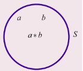

> **Note**
>
> It follows that every binary operation satisfies the closure property.

> **Note**
>
> The operation $*$ is just a symbol which may be $+, \times, -, \div$ , matrix addition, matrix multiplication, etc. depending on the set on which it is defined.
>
> For instance, though $+$ and $\times$ are binary on $\mathbb{N}$ , $-$ is not binary operation on $\mathbb{N}$ .
>
> To verify this, consider $(3, 4) \in \mathbb{N} \times \mathbb{N}$ .
>
> $-(3, 4) = 3 - 4 = -1 \notin \mathbb{N}$ .
>
> Hence $-$ is not binary operation on $\mathbb{N}$ . So $\mathbb{N}$ is to be extended to $\mathbb{Z}$ in order that $-$ becomes binary operation on $\mathbb{Z}$ . Thus $\mathbb{Z}$ is closed with respect to $+, \times$ , and $-$ . Thus $(\mathbb{Z}, +, \times, -)$ is an algebraic structure.

**Observations**

The binary operation depends on the set on which it is defined.

(a) The operation $-$ which is not binary operation on $\mathbb{N}$ but it is binary on $\mathbb{Z}$ . The set $\mathbb{N}$ is extended to include zero and negative integers. We call the included set $\mathbb{Z}$ .

(b) The operation $\div$ on $\mathbb{Z}$ is not binary operation on $\mathbb{Z}$ . For instance, for $(1, 2) \in \mathbb{Z} \times \mathbb{Z}$ ,

$\div(1, 2) = \frac{1}{2} \notin \mathbb{Z}$ .

Hence $\mathbb{Z}$ has to be extended further into $\mathbb{Q}$ .

(c) It is a known fact that the division by 0 is not defined in basic arithmetic. So $\div$ is binary operation on the set $\mathbb{Q} \setminus \{0\}$ . Thus $+, \times, -$ are binary operation on $\mathbb{Q}$ and $\div$ is binary operation on $\mathbb{Q} \setminus \{0\}$ .

Now the question is regarding the reasons for extending further $\mathbb{Q}$ to $\mathbb{R}$ and then from $\mathbb{R}$ to $\mathbb{C}$ . Accordingly, a number system is needed where not only all the basic arithmetic operations $+, -, \times, \div$ but also to include the roots of the equations of the form "$x^2 - 2 = 0$" and "$x^2 + 1 = 0$" .

So, in addition to the existing systems, the collection of irrational numbers and imaginary numbers (See Chapter 3) are to be adjoined. Consequently $\mathbb{R}$ and then $\mathbb{C}$ are obtained. The biggest number system $\mathbb{C}$ properly includes all the other number systems $\mathbb{N}, \mathbb{Z}, \mathbb{Q}, \mathbb{R}$ as subsets.

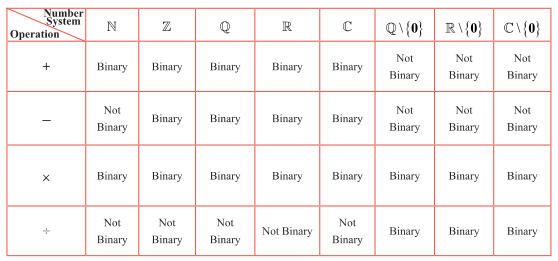

**Example 12.1**

Examine the binary operation (closure property) of the following operations on the respective sets (if it is not, make it binary):

$a * b = a + 3ab - 5b^2$ ; $\forall a, b \in \mathbb{Z}$

**Solution**

Since $\times$ is binary operation on $\mathbb{Z}$ , $a, b \in \mathbb{Z} \Rightarrow a \times b = ab \in \mathbb{Z}$ and $b \times b = b^2 \in \mathbb{Z}$ $\dots$ (1)

The fact that $+$ is binary operation on $\mathbb{Z}$ and (1) $\Rightarrow 3ab = (ab + ab + ab) \in \mathbb{Z}$ and

$5b^2 = (b^2 + b^2 + b^2 + b^2 + b^2) \in \mathbb{Z}$ .

Also $a \in \mathbb{Z}$ and $3ab \in \mathbb{Z}$ implies $a + 3ab \in \mathbb{Z}$ . $\dots$ (2)

(2), (3), the closure property of $-$ on $\mathbb{Z}$ yield $a * b = (a + 3ab - 5b^2) \in \mathbb{Z}$ . Since $a * b$ belongs to $\mathbb{Z}$ , $*$ is a binary operation on $\mathbb{Z}$ .

### 12.2.2 Some more properties of a binary operation

#### Commutative property

Any binary operation $*$ defined on a nonempty set $S$ is said to satisfy the commutative property, if

$a * b = b * a$ $\forall a, b \in S$ .

#### Associative property

Any binary operation $*$ defined on a nonempty set $S$ is said to satisfy the associative property, if

$a * (b * c) = (a * b) * c$ $\forall a, b, c \in S$ .

#### Existence of identity property

An element $e \in S$ is said to be the **Identity Element** of $S$ under the binary operation $*$ if for all $a \in S$ we have that $a * e = a$ and $e * a = a$ .

#### Existence of inverse property

If an identity element $e$ exists and if for every $a \in S$ , there exists $b$ in $S$ such that $a * b = e$ and $b * a = e$ then $b \in S$ is said to be the **Inverse Element** of $a$ . In such instances, we write $b = a^{-1}$ .

> **Note**
>
> $a^{-1}$ is an element of $S$ . It should be read as the inverse of $a$ and not as $\frac{1}{a}$ .

> **Note**
>
> 1. The **multiplicative identity** is $1$ in $\mathbb{Z}$ and it is the one and only one element with the property
>
>    $n \cdot 1 = 1 \cdot n = n$ , $\forall n \in \mathbb{Z}$ .
>
> 2. The **multiplicative inverse** of any element, say $2$ in $\mathbb{Q}$ is $\frac{1}{2}$ and no other nonzero rational number $x$ has the property that $2 \cdot x = x \cdot 2 = 1$ .

> **Note**
>
> Whenever a mathematical statement involves 'for every' or 'for all', it has to be proved for every pair or three elements. It is not easy to prove for every pair or three elements. But these types of definitions may be used to prove the negation of the statement. That is, negation of "for every" or "for all" is "there exists not". So, produce one such pair or three elements to establish the negation of the statement.

The questions of existence and uniqueness of identity and inverse are to be examined. The following theorems prove these results in the more general form.

> **Theorem 12.1: (Uniqueness of Identity)**
>
> In an algebraic structure the identity element (if exists) must be unique.

**Proof**

Let $(S, *)$ be an algebraic structure. Assume that the identity element of $S$ exists in $S$ .  
It is to be proved that the identity element is unique. Suppose that $e_1$ and $e_2$ be any two identity elements of $S$ .  
First treat $e_1$ as the identity and $e_2$ as an arbitrary element of $S$ .  
Then by the existence of identity property, $e_2 * e_1 = e_1 * e_2 = e_2$ . $\dots$ (1)  
Interchanging the role of $e_1$ and $e_2$ , $e_1 * e_2 = e_2 * e_1 = e_1$ . $\dots$ (2)  
From (1) and (2), $e_1 = e_2$ . Hence the identity element is unique which completes the proof.

> **Theorem 12.2 (Uniqueness of Inverse)**
>
> In an algebraic structure the inverse of an element (if exists) must be unique.

**Proof**

Let $(S, *)$ be an algebraic structure and $a \in S$ . Assume that the inverse of $a$ exists in $S$ . It is to be proved that the inverse of $a$ is unique. The existence of inverse in $S$ ensures the existence of the identity element $e$ in $S$ .

Let $a \in S$ . It is to be proved that the inverse $a$ (if exists) is unique.  
Suppose that $a$ has two inverses, say, $a_1, a_2$ .  
Treating $a_1$ as an inverse of $a$ gives $a * a_1 = a_1 * a = e$ $\dots$ (1)  
Next treating $a_2$ as the inverse of $a$ gives $a * a_2 = a_2 * a = e$ $\dots$ (2)

$a_1 = a_1 * e = a_1 * (a * a_2) = (a_1 * a) * a_2 = e * a_2 = a_2$ (by (1) and (2)).

So, $a_1 = a_2$ . Hence the inverse of $a$ is unique which completes the proof.

**Example 12.2**

Verify the (i) closure property, (ii) commutative property, (iii) associative property (iv) existence of identity and (v) existence of inverse for the arithmetic operation $+$ on $\mathbb{Z}$ .

**Solution**

(i) $m + n \in \mathbb{Z}$ , $\forall m, n \in \mathbb{Z}$ . Hence $+$ is a binary operation on $\mathbb{Z}$ .

(ii) Also $m + n = n + m$ , $\forall m, n \in \mathbb{Z}$ . So the commutative property is satisfied.

(iii) $\forall m, n, p \in \mathbb{Z}$ , $m + (n + p) = (m + n) + p$ . Hence the associative property is satisfied.

(iv) $m + e = e + m = m \Rightarrow e = 0$ . Thus $\exists 0 \in \mathbb{Z} \Rightarrow (m + 0) = (0 + m) = m$ . Hence the existence of identity is assured.

(v) $m + m' = m' + m = 0 \Rightarrow m' = -m$ . Thus $\forall m \in \mathbb{Z}$ , $\exists -m \in \mathbb{Z} \Rightarrow m + (-m) = (-m) + m = 0$ . Hence, the existence of inverse property is also assured. Thus we see that the usual addition $+$ on $\mathbb{Z}$ satisfies all the above five properties.

Note that the **additive identity** is 0 and the **additive inverse** of any integer $m$ is $-m$ .

**Example 12.3**

Verify the (i) closure property, (ii) commutative property, (iii) associative property (iv) existence of identity and (v) existence of inverse for the arithmetic operation $-$ on $\mathbb{Z}$ .

**Solution**

(i) Though $-$ is not binary on $\mathbb{N}$ ; it is binary on $\mathbb{Z}$ . To check the validity of any more properties satisfied by $-$ on $\mathbb{Z}$ , it is better to check them for some particular simple values.

(ii) Take $m = 4$ , $n = 5$ and $(m - n) = (4 - 5) = -1$ and $(n - m) = (5 - 4) = 1$ . Hence $(m - n) \neq (n - m)$ . So the operation $-$ is not commutative on $\mathbb{Z}$ .

(iii) In order to check the associative property, let us put $m = 4$ , $n = 5$ and $p = 7$ in both $(m - n) - p$ and $m - (n - p)$ .

$(m - n) - p = (4 - 5) - 7 = (-1 - 7) = -8$ $\dots$ (1)

$m - (n - p) = 4 - (5 - 7) = 4 + 2 = 6$ $\dots$ (2)

From (1) and (2), it follows that $(m - n) - p \neq m - (n - p)$ . Hence $-$ is not associative on $\mathbb{Z}$ .

(iv) Identity does not exist (why?).

(v) Inverse does not exist (why?).

**Example 12.4**

Verify the (i) closure property, (ii) commutative property, (iii) associative property  
(iv) existence of identity and (v) existence of inverse for the arithmetic operation $+$ on  
$\mathbb{Z}_e$ = the set of all even integers.

**Solution**

Consider the set of all even integers $\mathbb{Z}_e = \{2k \mid k \in \mathbb{Z}\} = \{\ldots, -6, -4, -2, 0, 2, 4, 6, \ldots\}$ .

Let us verify the properties satisfied by $+$ on $\mathbb{Z}_e$ .

(i) The sum of any two even integers is also an even integer.  
Because $x, y \in \mathbb{Z}_e \implies x = 2m$ and $y = 2n$ , $m, n \in \mathbb{Z}$ .  
So $(x + y) = 2m + 2n = 2(m + n) \in \mathbb{Z}_e$ . Hence $+$ is a binary operation on $\mathbb{Z}_e$ .

(ii) $\forall x, y \in \mathbb{Z}_e$ , $(x + y) = 2(m + n) = 2(n + m) = (2n + 2m) = (y + x)$ .  
So $+$ has commutative property.

(iii) Similarly it can be seen that $\forall x, y, z \in \mathbb{Z}_e$ , $(x + y) + z = x + (y + z)$ .  
Hence the associative property is true.

(iv) Now take $x = 2k$ , then $2k + e = e + 2k = 2k \implies e = 0$ .  
Thus $\forall x \in \mathbb{Z}_e$ , $\exists 0 \in \mathbb{Z}_e \implies x + 0 = 0 + x = x$ .  
So, 0 is the identity element.

(v) Taking $x = 2k$ and $x'$ as its inverse, we have $2k + x' = 0 = x' + 2k \implies x' = -2k$ .  
i.e., $x' = -x$ .  
Thus $\forall x \in \mathbb{Z}_e$ , $\exists -x \in \mathbb{Z}_e \implies x + (-x) = (-x) + x = 0$ .  
Hence $-x$ is the inverse of $x \in \mathbb{Z}_e$ .

**Example 12.5**

Verify the (i) closure property, (ii) commutative property, (iii) associative property (iv) existence of identity and (v) existence of inverse for the arithmetic operation $+$ on $\mathbb{Z}_o$ = the set of all odd integers.

**Solution**

Consider the set $\mathbb{Z}_o$ of all odd integers $\mathbb{Z}_o = \{2k + 1 : k \in \mathbb{Z}\} = \{-5, -3, -1, 1, 3, 5, \dots\}$ . $+$ is not a binary operation on $\mathbb{Z}_o$ because when $x = 2m + 1$ , $y = 2n + 1$ , $x + y = 2(m + n) + 2$ is even for all $m$ and $n$ . For instance, consider the two odd numbers $3, 7 \in \mathbb{Z}_o$ . Their sum $3 + 7 = 10$ is an even number. In general, if $x, y \in \mathbb{Z}_o$ , then $(x + y) \notin \mathbb{Z}_o$ . Other properties need not be checked as it is not a binary operation.

**Example 12.6**

Verify (i) closure property (ii) commutative property, and (iii) associative property of the following operation on the given set.

$(a * b) = a^b$ ; $\forall a, b \in \mathbb{N}$ (exponentiation property)

**Solution**

(i) It is true that $a * b = a^b \in \mathbb{N}$ ; $\forall a, b \in \mathbb{N}$ . So $*$ is a binary operation on $\mathbb{N}$ .

(ii) $a * b = a^b$ and $b * a = b^a$ . Put, $a = 2$ and $b = 3$ . Then $a * b = 2^3 = 8$ but $b * a = 3^2 = 9$ . So $a * b$ need not be equal to $b * a$ . Hence $*$ does not have commutative property.

(iii) Next consider $a * (b * c) = a * (b^c) = a^{(b^c)} = a^{b^c}$ . Take $a = 2$ , $b = 3$ and $c = 4$ . Then $a * (b * c) = 2 * (3 * 4) = 2^{3^4} = 2^{81}$ . But $(a * b) * c = (a^b)^c = a^{bc} = 2^{12}$ . Hence $a * (b * c) \neq (a * b) * c$ . So $*$ does not have associative property on $\mathbb{N}$ .

> **Note:** This binary operation has no identity and no inverse. (Justify).

**Example 12.7**

Verify (i) closure property, (ii) commutative property, (iii) associative property,  
(iv) existence of identity, and (v) existence of inverse for following operation on the given set.

$m * n = m + n - mn$ ; $m, n \in \mathbb{Z}$

**Solution**

(i) The output $m + n - mn$ is clearly an integer and hence $*$ is a **binary operation** on $\mathbb{Z}$ .

(ii)  
$m * n = m + n - mn = n + m - nm = n * m$ , $\forall m, n \in \mathbb{Z}$ .  
So $*$ has **commutative property**.

(iii) Consider  
$(m * n) * p = (m + n - mn) * p = (m + n - mn) + p - (m + n - mn)p$  
$= m + n + p - mn - mp - np + mnp$ $\dots$ (1)

Similarly  
$m * (n * p) = m * (n + p - np) = m + (n + p - np) - m(n + p - np)$  
$= m + n + p - np - mn - mp + mnp$ $\dots$ (2)

From (1) and (2), we see that  
$m * (n * p) = (m * n) * p$ .  
Hence $*$ has **associative property**.

(iv) An integer $e$ is to be found such that  
$m * e = e * m = m$ , $\forall m \in \mathbb{Z} \implies m + e - me = m$  
$\implies e(1 - m) = 0 \implies e = 0$ or $m = 1$ .  
But $m$ is an arbitrary integer and hence need not be equal to 1. So the only possibility is $e = 0$ . Also  
$m * 0 = 0 * m = m$ , $\forall m \in \mathbb{Z}$ .  
Hence 0 is the identity element and hence the **existence of identity** is assured.

(v) An element $m' \in \mathbb{Z}$ is to be found such that  
$m * m' = m' * m = e = 0$ , $\forall m \in \mathbb{Z}$ .  
$m * m' = 0 \implies m + m' - mm' = 0 \implies m' = \frac{m}{m - 1}$ .  
When $m = 1$ , $m'$ is not defined.  
When $m = 2$ , $m'$ is an integer. But except $m = 2$ , $m'$ need not be an integer for all values of $m$ . Hence **inverse does not exist in $\mathbb{Z}$** .

### 12.2.3 Some binary operations on Boolean Matrices

**Definition 12.3**

A Boolean Matrix is a real matrix whose entries are either 0 or 1.

Note that the boolean entries 0 and 1 can be defined in several ways. In electrical switch to describe "on and off", in graph theory, the "adjacency matrix" etc, the boolean entries 0 and 1 are used. We consider the same type of Boolean matrices in our discussion.

The following two kinds of operations on the collection of all boolean matrices are defined.  
Let $A = \begin{bmatrix} a_{ij} \end{bmatrix}$ and $B = \begin{bmatrix} b_{ij} \end{bmatrix}$ be any two boolean matrices of the same type. Then their **join** $\lor$ and **meet** $\land$ are defined as follows:

> **Definition 12.4: Join of A and B**
>
> $A \lor B = \begin{bmatrix} a_{ij} \end{bmatrix} \lor \begin{bmatrix} b_{ij} \end{bmatrix} = \begin{bmatrix} a_{ij} \lor b_{ij} \end{bmatrix} = \begin{bmatrix} c_{ij} \end{bmatrix}$
>
> where $c_{ij} = \begin{cases} 1, & \text{if either } a_{ij} = 1 \text{ or } b_{ij} = 1 \\ 0, & \text{if both } a_{ij} = 0 \text{ and } b_{ij} = 0 \end{cases}$

> **Definition 12.5: Meet of A and B**
>
> $A \land B = \begin{bmatrix} a_{ij} \end{bmatrix} \land \begin{bmatrix} b_{ij} \end{bmatrix} = \begin{bmatrix} a_{ij} \land b_{ij} \end{bmatrix} = \begin{bmatrix} c_{ij} \end{bmatrix}$
>
> where $c_{ij} = \begin{cases} 1, & \text{if both } a_{ij} = 1 \text{ and } b_{ij} = 1 \\ 0, & \text{if either } a_{ij} = 0 \text{ or } b_{ij} = 0 \end{cases}$

It is clear that $(a \lor b) = \max \{a, b\}$ ; $(a \land b) = \min \{a, b\}$ , $a, b \in \{0, 1\}$ .

**Example 12.8**

Let $A = \begin{bmatrix} 0 & 1 \\ 1 & 1 \end{bmatrix}$ , $B = \begin{bmatrix} 1 & 1 \\ 0 & 1 \end{bmatrix}$ be any two boolean matrices of the same type. Find $A \lor B$ and $A \land B$ .

**Solution**

$A \lor B = \begin{bmatrix} 0 & 1 \\ 1 & 1 \end{bmatrix} \lor \begin{bmatrix} 1 & 1 \\ 0 & 1 \end{bmatrix} = \begin{bmatrix} 0 \lor 1 & 1 \lor 1 \\ 1 \lor 0 & 1 \lor 1 \end{bmatrix} = \begin{bmatrix} 1 & 1 \\ 1 & 1 \end{bmatrix}$

$A \land B = \begin{bmatrix} 0 & 1 \\ 1 & 1 \end{bmatrix} \land \begin{bmatrix} 1 & 1 \\ 0 & 1 \end{bmatrix} = \begin{bmatrix} 0 \land 1 & 1 \land 1 \\ 1 \land 0 & 1 \land 1 \end{bmatrix} = \begin{bmatrix} 0 & 1 \\ 0 & 1 \end{bmatrix}$

### Properties satisfied by join and meet

Let $\mathbb{B}$ be the set of all boolean matrices of the same type. We only state the properties of meet and join.

**Closure property**

$A, B \in \mathbb{B}$ , $A \lor B = [a_{ij}] \lor [b_{ij}] = [a_{ij} \lor b_{ij}] \in \mathbb{B}$ . (Because, $(a_{ij} \lor b_{ij})$ is either 0 or 1 $\forall i, j$ . $\lor$ is a binary operation on $\mathbb{B}$ .

**Associative property**

$A \lor (B \lor C) = (A \lor B) \lor C$ , $\forall A, B, C \in \mathbb{B}$ . $\lor$ is associative.

**Existence of identity property**

$\forall A \in \mathbb{B}$ , $\exists$ the null matrix $0 \in \mathbb{B} \Rightarrow A \lor 0 = 0 \lor A = A$ . The identity element for $\lor$ is the null matrix.

**Existence of inverse property**

For any matrix $A \in \mathbb{B}$ , it is impossible to find a matrix  
$B \in \mathbb{B} \Rightarrow A \lor B = B \lor A = 0$ . So the inverse does not exist.

Similarly, it can be verified that the operation meet $\land$ satisfies (i) closure property  
(ii) commutative property (iii) associative property (iv) the matrix  
$U = \begin{bmatrix} 1 & 1 \\ 1 & 1 \end{bmatrix}$ exists as the identity in $\mathbb{B}$ and (v) the existence of inverse is not assured.

### 12.2.4 Modular Arithmetic

Having discussed the properties of operations like basic usual arithmetic operations, matrix addition and multiplication, join and meet of boolean matrices, one more new operation called the **Modular Arithmetic** is discussed in this section. The modular arithmetic refers to the process of **dividing** some number $a$ by a positive integer $n$ ( $> 1$ ), called modulus, and then equating $a$ with the remainder $b$ modulo $n$ and it is written as $a \equiv b \pmod{n}$ , read as '$a$ is congruent to $b$ modulo $n$'.

Here $a \equiv b \pmod{n}$ means $a - b = n \cdot k$ for some integer $k$ and $b$ is the **least non-negative integer** when $a$ is divided by $n$ .

For instance, $25 \equiv 4 \pmod{7}$ , $-20 \equiv -2 \pmod{3} \equiv 1 \pmod{3}$ and $15 \equiv 0 \pmod{5}$ , etc. Further the set of integers when divided by $n$ , leaves the remainder $0, 1, 2, \ldots, n-1$ . In the case of $\mathbb{Z}_5$ ,

$[0] = \{\ldots, -15, -10, -5, 0, 5, 10, 15, \ldots\}$

$[1] = \{\ldots, -14, -9, -4, 1, 6, 11, \ldots\}$

$[2] = \{\ldots, -13, -8, -3, 2, 7, 12, \ldots\}$

$[3] = \{\ldots, -12, -7, -2, 3, 8, 13, \ldots\}$

$[4] = \{\ldots, -11, -6, -1, 4, 9, 14, \ldots\}$

We write this as $\mathbb{Z}_5 = \{ [0], [1], [2], [3], [4] \}$ . In each class, any two numbers are congruent modulo 5.

> Before 2007, modular arithmetic is used in 10-digit ISBN (International Standard Book Number) numbering system. For instance, the last digit is for parity check. It is from the set $\{0,1,2,3,4,5,6,7,8,9,X\}$ . In ISBN number, 81-7808-755-3, the last digit 3 is obtained as
>
> $1 \times 8 + 2 \times 1 + 3 \times 7 + 4 \times 8 + 5 \times 0 + 6 \times 8 + 7 \times 7 + 8 \times 5 + 9 \times 5 = 8 + 2 + 21 + 32 + 0 + 48 + 49 + 40 + 45 = 245 \equiv 3 \pmod{11}$ .
>
> Alternatively, the weighted sum is calculated in the reverse manner
>
> $9 \times 8 + 8 \times 1 + 7 \times 7 + 6 \times 8 + 5 \times 0 + 4 \times 8 + 3 \times 7 + 2 \times 5 + 1 \times 5 = 245 \equiv 3 \pmod{11}$ .
>
> In both ways, we get the same check number 3.
>
> After 2007, 13-digit ISBN numbering has been followed. The first 12 digits (from left to right) are multiplied by the weights 3,1,3,1,.... starting from right to left. Then the weighted sum is calculated. The higher multiple of 10 is taken. Then the difference is calculated. Then its additive inverse modulo 10 is the thirteenth digit.
>
> For instance, consider the ISBN Number: 978-81-931995-6-5. Take 12 digits from left to right.
>
> | 9 | 7 | 8 | 8 | 1 | 9 | 3 | 1 | 9 | 9 | 5 | 6 |
> |---|---|---|---|---|---|---|---|---|---|---|---|
> | 1 | 3 | 1 | 3 | 1 | 3 | 1 | 3 | 3 | 1 | 3 | 3 |
> | 9 | 21 | 8 | 24 | 1 | 27 | 3 | 3 | 9 | 27 | 5 | 18 |
>
> The total of last row is 155. The nearest (higher) integer in multiples of 10 is 160. The difference 160 - 155 = 5. The additive inverse modulo 10 is 5 which is 13-th digit in the ISBN number.

Two new operations namely **addition modulo** $n$ $(+_n)$ and **multiplication modulo** $n$ $(\times_n)$ are defined on the set $\mathbb{Z}_n$ of all non-negative integers less than $n$ under modulo arithmetic.

> **Definition 12.6**
>
> (i) The addition modulo $n$ is defined as follows.
>
> Let $a, b \in \mathbb{Z}_n$ . Then
>
> $a +_n b =$ the remainder of $a + b$ on division by $n$ .
>
> (ii) The multiplication modulo $n$ is defined as follows.
>
> Let $a, b \in \mathbb{Z}_n$ . Then
>
> $a \times_n b =$ the remainder of $a \times b$ on division by $n$ .

**Example 12.9**

Verify  
(i) closure property,  
(ii) commutative property,  
(iii) associative property,  
(iv) existence of identity, and  
(v) existence of inverse for the operation $+_5$ on $\mathbb{Z}_5$ using table corresponding to addition modulo 5.

**Solution**

It is known that $\mathbb{Z}_5 = \{0, 1, 2, 3, 4\}$ . The table corresponding to addition modulo 5 is as follows: We take reminders $0, 1, 2, 3, 4$ to represent the classes $\{0\}, \{1\}, \{2\}, \{3\}, \{4\}$ .

| $+_5$ | 0 | 1 | 2 | 3 | 4 |
| :--- | :--- | :--- | :--- | :--- | :--- |
| 0 | 0 | 1 | 2 | 3 | 4 |
| 1 | 1 | 2 | 3 | 4 | 0 |
| 2 | 2 | 3 | 4 | 0 | 1 |
| 3 | 3 | 4 | 0 | 1 | 2 |
| 4 | 4 | 0 | 1 | 2 | 3 |

**Table 12.2**

1. Since each box in the table is filled by **exactly one element** of $\mathbb{Z}_5$ , the output $a +_5 b$ is unique and hence $+_5$ is a **binary operation**.

2. The entries are **symmetrically** placed with respect to the **main diagonal**. So $+_5$ has **commutative property**.

3. The table cannot be used directly for the verification of the associative property. So it is to be verified as usual.

For $2, 3, 4 \in \mathbb{Z}_5$ , then $(2 +_5 3) +_5 4 = 0 +_5 4 = 4 \pmod{5}$

and $2 +_5 (3 +_5 4) = 2 +_5 2 = 4 \pmod{5}$ .

Hence $(2 +_5 3) +_5 4 = 2 +_5 (3 +_5 4)$ .

Proceeding like this one can verify this for all possible triples and ultimately it can be shown that $+_5$ is associative.

4. The row headed by 0 and the column headed by 0 $\in \mathbb{Z}_5$ are identical. Hence the identity element is 0.

5. The existence of inverse is guaranteed provided the identity 0 exists in each row and each column. From Table 12.2, it is clear that this property is true in this case. The method of finding the inverse of any one of the elements of $\mathbb{Z}_5$ , say 2 is outlined below.

First find the position of the identity element 0 in the III row headed by 2. Move horizontally along the III row and after reaching 0, move vertically above 0 in the IV column, because 0 is in the III row and IV column. The element reached at the topmost position of IV column is 3. This element 3 is nothing but the inverse of 2, because, $2 +_5 3 = 0 \pmod{5}$ . In this way, the inverse of each and every element of $\mathbb{Z}_5$ can be obtained. Note that the inverse of 0 is 0, that of 1 is 4, that of 2 is 3, that of 3 is 2, and, that of 4 is 1.

**Example 12.10**

Verify (i) closure property, (ii) commutative property, (iii) associative property, (iv) existence of identity, and (v) existence of inverse for the operation $\times_{11}$ on a subset $A = \{1, 3, 4, 5, 9\}$ of the set of remainders $\{0, 1, 2, 3, 4, 5, 6, 7, 8, 9, 10\}$ .

**Solution**

The table for the operation $\times_{11}$ is as follows.

| $\times_{11}$ | 1 | 3 | 4 | 5 | 9 |
| :--- | :--- | :--- | :--- | :--- | :--- |
| 1 | 1 | 3 | 4 | 5 | 9 |
| 3 | 3 | 9 | 1 | 4 | 5 |
| 4 | 4 | 1 | 5 | 9 | 3 |
| 5 | 5 | 4 | 9 | 3 | 1 |
| 9 | 9 | 5 | 3 | 1 | 4 |

**Table 12.3**

Following the same kind of procedure as explained in the previous example, a brief outline of the process of verification of the properties of $\times_{11}$ on $A$ is given below.

1. Since each box has an unique element of $A$ , $\times_{11}$ is a **binary operation** on $A$ .

2. The entries are symmetrical about the main diagonal. Hence $\times_{11}$ has **commutative property**.

3. As usual, the **associative property** can be seen to be true.

4. The entries of both the row and column headed by the element 1 are identical. Hence 1 is the **identity element**.

5. Since the identity 1 exists in each row and each column, the **existence of inverse property** is assured for $\times_{11}$ . The inverse of 1 is 1, that of 3 is 4, that of 4 is 3, 5 is 9, and, that of 9 is 5.

**EXERCISE 12.1**

1. Determine whether $*$ is a binary operation on the sets given below.  
   (i) $a * b = a |b|$ on $\mathbb{R}$ (ii) $a * b = \min(a, b)$ on $A = \{1, 2, 3, 4, 5\}$  
   (iii) $(a * b) = a \sqrt{b}$ is binary on $\mathbb{R}$ .

2. On $\mathbb{Z}$ , define $*$ by $(m * n) = m^n + n^m$ : $\forall m, n \in \mathbb{Z}$ . Is $*$ binary on $\mathbb{Z}$ ?

3. Let $*$ be defined on $\mathbb{R}$ by $(a * b) = a + b + ab - 7$ . Is $*$ binary on $\mathbb{R}$ ? If so, find $3 * \left(\frac{-7}{15}\right)$ .

4. Let $A = \{a + \sqrt{5}b : a, b \in \mathbb{Z}\}$ . Check whether the usual multiplication is a binary operation on $A$ .

5. (i) Define an operation $*$ on $\mathbb{Q}$ as follows: $a * b = \left(\frac{a + b}{2}\right)$ ; $\forall a, b \in \mathbb{Q}$ . Examine the closure, commutative, and associative properties satisfied by $*$ on $\mathbb{Q}$ .  
   (ii) Define an operation $*$ on $\mathbb{Q}$ as follows: $a * b = \left(\frac{a + b}{2}\right)$ ; $\forall a, b \in \mathbb{Q}$ . Examine the existence of identity and the existence of inverse for the operation $*$ on $\mathbb{Q}$ .

6. Fill in the following table so that the binary operation $*$ on $A = \{a, b, c\}$ is commutative.

| $*$ | a | b | c |
| :--- | :--- | :--- | :--- |
| a | b | c | a |
| b | c | a | b |
| c | a | b | c |

7. Consider the binary operation $*$ defined on the set $A = \{a, b, c, d\}$ by the following table:

| $*$ | a | b | c | d |
| :--- | :--- | :--- | :--- | :--- |
| a | a | c | b | d |
| b | d | a | b | c |
| c | c | d | a | a |
| d | d | b | a | c |

Is it commutative and associative?

8. Let $A = \begin{bmatrix} 1 & 0 & 1 & 0 \\ 0 & 1 & 0 & 1 \\ 1 & 0 & 0 & 1 \end{bmatrix}$ , $B = \begin{bmatrix} 0 & 1 & 0 & 1 \\ 1 & 0 & 1 & 0 \\ 1 & 0 & 0 & 1 \end{bmatrix}$ , $C = \begin{bmatrix} 1 & 1 & 0 & 1 \\ 0 & 1 & 1 & 0 \\ 1 & 1 & 1 & 1 \end{bmatrix}$ be any three boolean matrices of the same type. Find (i) $A \lor B$ (ii) $A \land B$ (iii) $(A \lor B) \land C$ (iv) $(A \land B) \lor C$ .

9. (i) Let $M = \left\{ \begin{bmatrix} x & x \\ x & x \end{bmatrix} : x \in \mathbb{R} - \{0\} \right\}$ and let $*$ be the matrix multiplication. Determine whether $M$ is closed under $*$ . If so, examine the commutative and associative properties satisfied by $*$ on $M$ .

(ii) Let $M = \left\{ \begin{bmatrix} x & x \\ x & x \end{bmatrix} : x \in \mathbb{R} - \{0\} \right\}$ and let $*$ be the matrix multiplication. Determine whether $M$ is closed under $*$ . If so, examine the existence of identity, existence of inverse properties for the operation $*$ on $M$ .

10. (i) Let $A$ be $\mathbb{Q} \setminus \{1\}$ . Define $*$ on $A$ by $x * y = x + y - xy$ . Is $*$ binary on $A$ ? If so, examine the commutative and associative properties satisfied by $*$ on $A$ .

(ii) Let $A$ be $\mathbb{Q} \setminus \{1\}$ . Define $*$ on $A$ by $x * y = x + y - xy$ . Is $*$ binary on $A$ ? If so, examine the existence of identity, existence of inverse properties for the operation $*$ on $A$ .

### 12.3 Mathematical Logic

George Boole was a self-taught English Mathematician, Philosopher and Logician. His results on **Boolean Algebra** involving the binary numbers play an important role in various fields, particularly more in computer applications. He introduced the idea of Symbolic Logic and contributed a lot of results to the fast development of Mathematical Logic.

The reputed Greek philosopher Aristotle (384-322 BC (BCE)) wrote the first book on logic. The famous German philosopher and mathematician Gottfried Leibnitz of 17th century framed the idea of using symbols in Logic. Later this idea was realized by George Boole and Augustus de Morgan in 19th century. George Boole established the fact that logic is very much related to mathematics by linking logic, symbols, and algebra together. Mathematical Logic was developed in the late 19th and early 20th centuries.

In 1930 the researchers noticed (Neumann's statement in his death bed: *0 and 1 are going to rule the world*) that the binary numbers 0 and 1 could be used to analyze electrical circuits and thus used to design electronic computers. Today digital computers and electronic circuits are designed to implement this binary arithmetic. We study Mathematical Logic as the language and deductive system of Mathematics and Computer Science.

Generally Logic is the study of valid reasoning. But mathematical logic allows us to represent knowledge in a precise mathematical way and it also allows us to make valid inferences using a set of precise rules. It is regarded as a powerful tool for computer science because it is mainly used to verify the correctness of programs.

### 12.3.1 Statement and its truth value

The simplest part of Mathematical Logic is the **Propositional Logic** and its building blocks are statements or propositions. Mostly communication needs the use of language through which we impart our ideas. They are in the form of sentences.

There are various types of sentences like  
1. Declarative (Assertive type)  
2. Imperative (A command or a request type)  
3. Exclamatory (Emotions, excitement type)  
4. Interrogative (Question type)

> **Definition 12.7**
>
> Any **declarative sentence** is called a **statement** or a **proposition** which is either **true** or **false** but not both.
>
> Any **imperative sentence** such as exclamatory, command and any **interrogative sentence** cannot be a proposition.
>
> The **truth value** of a statement refers to the truth or the falsity of that particular statement.  
> The truth value of a true statement is **true** and it is denoted by $T$ or 1. The truth value of a false statement is **false** and it is denoted by $F$ or 0.
>
> An **open sentence** is a sentence whose truth can vary according to some conditions, which are not stated in the sentence. For instance, (i) $x \times 7 = 35$ is an open sentence whose truth value depends on value of $x$ . That is, if $x = 5$ , it is true and if $x \neq 5$ , it is false. (ii) $He$ is a **bad person**. This is an open sentence. Opinion varies from individual to individual.

**Example 12.11**

Identify the valid statements from the following sentences.

1. (1) Mount Everest is the highest mountain of the world.  
2. (2) $3 + 4 = 8$ .  
3. (3) $7 + 5 > 10$ .  
4. (4) Give me that book.  
5. (5) $(10 - x) = 7$ .  
6. (6) How beautiful this flower is!  
7. (7) Where are you going?  
8. (8) Wish you all success.  
9. (9) This is the beginning of the end.

**Solution:**

The truth value of the sentences (1) and (3) are $T$ , while that of (2) is $F$ . Hence they are statements.  
The sentence (5) is true for $x = 3$ and false for $x \neq 3$ and hence it may be true or false but not both. So it is also a statement.  
The sentences (4), (6), (7), (8) are **not** statements, because (4) is a command, (6) is an exclamatory, (7) is a question while (8) is a sentence expressing one's wishes and (9) is a paradox.

### 12.3.2 Compound Statements, Logical Connectives, and Truth Tables

> **Definition 12.8: (Simple and Compound Statements)**
>
> Any sentence which cannot be split further into two or more statements is called an **atomic statement** or a **simple statement**. If a statement is the combination of two or more simple statements, then it is called a **compound statement** or a **molecular statement**. Hence it is clear that any statement can be either a simple statement or a compound statement.

**Example for simple statements**

The sentences (1), (2), (3) given in example 12.11 are simple statements.

**Example for Compound statements**

Consider the statement, "I is not a prime number and Ooty is in Kerala".

Note that the above statement is actually a combination of the following two simple statements:  
$p$ : I is not a prime number.  
$q$ : Ooty is in Kerala.

Hence the given statement is not a simple statement. It is a compound statement.

From the above discussions, it follows that any simple statement takes the value either $T$ or $F$ . So it can be treated as a variable and this variable is known as **statement variable** or **propositional variable**. The propositional variables are usually denoted by $p, q, r, \ldots$ .

> **Definition 12.9: (Logical Connectives)**
>
> To connect two or more simple sentences, we use the words or a group of words such as "and", "or", "if-then", "if and only if", and "not". These connecting words are known as **logical connectives**.
>
> In order to construct a compound statement from simple statements, some connectives are used. Some basic logical connectives are **negation (not)** , **conjunction (and)** and **disjunction (or)** .

> **Definition 12.10**
>
> A **statement formula** is an expression involving one or more statements connected by some logical connectives.

> **Definition 12.11: (Truth Table)**
>
> A table showing the relationship between truth values of simple statements and the truth values of compound statements formed by using these simple statements is called **truth table**.

> **Definition 12.12**
>
> 1. (i) Let $p$ be a simple statement. Then the **negation** of $p$ is a statement whose truth value is opposite to that of $p$ . It is denoted by $\neg p$ , read as **not $p$** . The truth value of $\neg p$ is $T$ , if $p$ is $F$ , otherwise it is $F$ .
>
> 2. (ii) Let $p$ and $q$ be any two simple statements. The **conjunction** of $p$ and $q$ is obtained by connecting $p$ and $q$ by the word **and**. It is denoted by $p \land q$ , read as '$p$ conjunction $q$' or '$p$ hat $q$' . The truth value of $p \land q$ is $T$ , whenever both $p$ and $q$ are $T$ and it is $F$ otherwise.
>
> 3. (iii) The **disjunction** of any two simple statements $p$ and $q$ is the compound statement obtained by connecting $p$ and $q$ by the word 'or'. It is denoted by $p \lor q$ , read as '$p$ disjunction $q$' or '$p$ cup $q$' . The truth value of $p \lor q$ is $F$ , whenever both $p$ and $q$ are $F$ and it is $T$ otherwise.

### Logical Connectives and their Truth Tables

**(1) Truth Table for NOT [$\neg$] (Negation)**

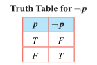

**(2) Truth table for AND [$\land$] (Conjunction)**

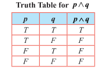

**(3) The truth tables for OR [$\lor$] (Disjunction)**

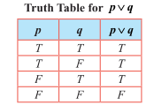

### Example 12.12

Write the statements in words corresponding to $\neg p$ , $p \land q$ , $p \lor q$ and $q \lor \neg p$ , where $p$ is 'It is cold' and $q$ is 'It is raining'.

**Solution**

1. $p \lor q$ : It is cold or raining.
2. $p \land q$ : It is cold and raining.
3. $q \lor \neg p$ : It is raining or it is not cold.

Observe that the statement formula $\neg p$ has only 1 variable $p$ and its truth table has $2 = 2^1$ rows. Each of the statement formulae $p \land q$ and $p \lor q$ has two variables $p$ and $q$ . The truth table corresponding to each of them has $4 = 2^2$ rows. In general, it follows that if a statement formula involves $n$ variables, then its truth table will contain $2^n$ rows.

**Example 12.13**

How many rows are needed for following statement formulae?

1. $p \lor \neg t \land (p \lor \neg s)$  
2. $(p \land q) \lor (\neg r \lor \neg s) \land (\neg t \land \neg v)$

**Solution**

1. $(p \lor \neg t) \land (p \lor \neg s)$ contains 3 variables $p, s, \neg t$ . Hence the corresponding truth table will contain $2^3 = 8$ rows.
2. $(p \land q) \lor (\neg r \lor \neg s) \land (\neg t \land \neg v)$ contains 6 variables $p, q, r, s, t, \neg v$ . Hence the corresponding truth table will contain $2^6 = 64$ rows.

### Conditional Statement

> **Definition 12.13**
>
> The conditional statement of any two statements $p$ and $q$ is the statement, "If $p$ , then $q$" and it is denoted by $p \to q$ . Here $p$ is called the **hypothesis** or **antecedent** and $q$ is called the **conclusion** or **consequence**. $p \to q$ is false only if $p$ is true and $q$ is false. Otherwise it is true.

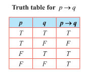

**Example 12.14**

Consider $p \to q$ : If today is Monday, then $4 + 4 = 8$ .

Here the component statements $p$ and $q$ are given by,  
$p$ : Today is Monday; $q$ : $4 + 4 = 8$ .  
The truth value of $p \to q$ is $T$ because the conclusion $q$ is $T$ .

An important point is that $p \to q$ should not be treated by actually considering the meanings of $p$ and $q$ in English. Also it is not necessary that $p$ should be related to $q$ at all.

**Consequences**

From the conditional statement $p \to q$ , three more conditional statements are derived. They are listed below.

1. **Converse statement** $q \to p$ .  
2. **Inverse statement** $\neg p \to \neg q$ .  
3. **Contrapositive statement** $\neg q \to \neg p$ .

**Example 12.15**

Write down the (i) conditional statement (ii) converse statement (iii) inverse statement, and (iv) contrapositive statement for the two statements $p$ and $q$ given below.

$p$ : The number of primes is infinite.  
$q$ : Ooty is in Kerala.

**Solution**

Then the four types of conditional statements corresponding to $p$ and $q$ are respectively listed below.

1. $p \to q$ : (conditional statement) "If the number of primes is infinite then Ooty is in Kerala".

2. $q \to p$ : (converse statement) "If Ooty is in Kerala then the number of primes is infinite".

3. $\neg p \to \neg q$ (inverse statement) "If the number of primes is not infinite then Ooty is not in Kerala".

4. $\neg q \to \neg p$ (contrapositive statement) "If Ooty is not in Kerala then the number of primes is not infinite".

### Bi-conditional Statement

> **Definition 12.14**
>
> The **bi-conditional statement** of any two statements $p$ and $q$ is the statement "$p$ if and only if $q$" and is denoted by $p \leftrightarrow q$ . Its truth value is $T$ , whenever both $p$ and $q$ have the same truth values, otherwise it is false.

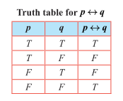

### Exclusive OR (EOR) $\overline{v}$

> **Definition 12.15**
>
> Let $p$ and $q$ be any two statements. Then $p \ \overline{EOR} \ q$ is such a compound statement that its truth value is decided by either $p$ or $q$ but not both. It is denoted by $p \ \overline{v} \ q$ . The truth value of $p \ \overline{v} \ q$ is $T$ whenever either $p$ or $q$ is $T$ , otherwise it is $F$ .

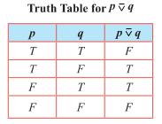

**Example 12.16**

Construct the truth table for $(p \lor q) \land (p \lor \neg q)$ .

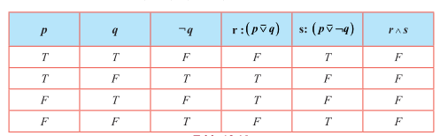

Also the above result can be proved without using truth tables. This proof will be provided after studying the logical equivalence.

### 12.3.3 Tautology, Contradiction, and Contingency

> **Definition 12.16**
>
> A statement is said to be a **tautology** if its truth value is always $T$ irrespective of the truth values of its component statements. It is denoted by $T$ .

> **Definition 12.17**
>
> A statement is said to be a **contradiction** if its truth value is always $F$ irrespective of the truth values of its component statements. It is denoted by $F$ .

> **Definition 12.18**
>
> A statement which is neither a tautology nor a contradiction is called **contingency**.

**Observations**

1. For a tautology, all the entries in the column corresponding to the statement formula will contain $T$ .
2. For a contradiction, all the entries in the column corresponding to the statement formula will contain $F$ .
3. The negation of a tautology is a contradiction and the negation of a contradiction is a tautology.
4. The disjunction of a statement with its negation is a tautology and the conjunction of a statement with its negation is a contradiction. That is, $p \lor \neg p$ is a **tautology** and $p \land \neg p$ is a **contradiction**. This can be easily seen by constructing their truth tables as given below.

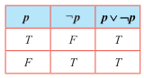

Since the last column of $p \lor \neg p$ contains only $T$ , $p \lor \neg p$ is a tautology.

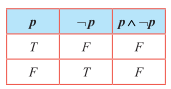

Since the last column contains only $F$ , $p \land \neg p$ is a contradiction.

### 12.3.4 Duality

> **Definition 12.19**
>
> The **dual** of a statement formula is obtained by replacing $\lor$ by $\land$ , $\land$ by $\lor$ , $T$ by $F$ and $F$ by $T$ . A dual is obtained by replacing $\top$ (tautology) by $\bot$ (contradiction), and, $\bot$ by $\top$ .

> **Remarks**
>
> 1. The symbol $\neg$ is not changed while finding the dual.
> 2. Dual of a dual is the statement itself.
> 3. The special statements $\top$ (tautology) and $\bot$ (contradiction) are duals of each other.
> 4. $T$ is changed to $F$ and vice-versa.

### Principle of Duality

If a compound statement $S_1$ contains only $\neg$ , $\land$ , and $\lor$ and statement $S_2$ arises from $S_1$ by replacing $\land$ by $\lor$ , and, $\lor$ by $\land$ then $S_1$ is a tautology if and only if $S_2$ is a contradiction.

**For Example**

(i) The dual of $(p \lor q) \land (r \land s) \lor \neg F$ is $(p \land q) \lor (r \lor s) \land \neg T$ .

(ii) The dual of $p \land [\neg q \lor (p \land q) \lor \neg r]$ is $p \lor [\neg q \land (p \lor q) \land \neg r]$ .

### 12.3.5 Logical Equivalence

> **Definition 12.20**
>
> Any two compound statements $A$ and $B$ are said to be **logically equivalent** or simply **equivalent** if the columns corresponding to $A$ and $B$ in the truth table have **identical truth values**. The logical equivalence of the statements $A$ and $B$ is denoted by $A \equiv B$ or $A \Leftrightarrow B$ .
>
> From the definition, it is clear that, if $A$ and $B$ are logically equivalent, then $A \Leftrightarrow B$ must be a **tautology**.

### Some Laws of Equivalence

**1. Idempotent Laws**

(i) $p \lor p \equiv p$  
(ii) $p \land p \equiv p$ .

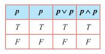

In the above truth table for both $p$ , $p \lor p$ and $p \land p$ have the same truth values. Hence $p \lor p \equiv p$ and $p \land p \equiv p$ .

**2. Commutative Laws**

(i) $p \lor q \equiv q \lor p$  
(ii) $p \land q \equiv q \land p$ .

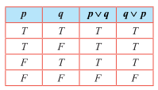

The columns corresponding to $p \lor q$ and $q \lor p$ are identical. Hence $p \lor q \equiv q \lor p$ .  
Similarly (ii) $p \land q \equiv q \land p$ can be proved.

**3. Associative Laws**

(i) $p \lor (q \lor r) \equiv (p \lor q) \lor r$  
(ii) $p \land (q \land r) \equiv (p \land q) \land r$ .

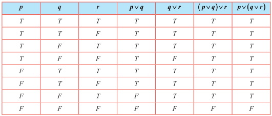

The columns corresponding to $(p \lor q) \lor r$ and $p \lor (q \lor r)$ are identical.  
Hence $p \lor (q \lor r) \equiv (p \lor q) \lor r$ .  
Similarly, (ii) $p \land (q \land r) \equiv (p \land q) \land r$ can be proved.

**4. Distributive Laws**

(i) $p \lor (q \land r) \equiv (p \lor q) \land (p \lor r)$  
(ii) $p \land (q \lor r) \equiv (p \land q) \lor (p \land r)$

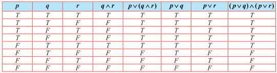

The columns corresponding to $p \lor (q \land r)$ and $(p \lor q) \land (p \lor r)$ are identical. Hence  
$p \lor (q \land r) \equiv (p \lor q) \land (p \lor r)$ .

Similarly (ii) $p \land (q \lor r) \equiv (p \land q) \lor (p \land r)$ can be proved.

**5. Identity Laws**

(i) $p \lor \top \equiv \top$ and $p \lor \bot \equiv p$  
(ii) $p \land \top \equiv p$ and $p \land \bot \equiv \bot$

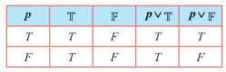

(i) The entries in the columns corresponding to $p \lor T$ and $T$ are identical and hence they are equivalent. The entries in the columns corresponding to $p \lor F$ and $p$ are identical and hence they are equivalent.

Dually

(ii) $p \land T \equiv p$ and $p \land F \equiv F$ can be proved.

**6. Complement Laws**

(i) $p \lor \neg p = T$ and $p \land \neg p = F$  
(ii) $\neg T \equiv F$ and $\neg F \equiv T$

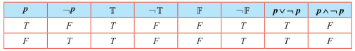

(i) The entries in the columns corresponding to $p \lor \neg p$ and $T$ are identical and hence they are equivalent. The entries in the columns corresponding to $p \land \neg p$ and $F$ are identical and hence they are equivalent.

(ii) The entries in the columns corresponding to $\neg T$ and $F$ are identical and hence they are equivalent. The entries in the columns corresponding to $\neg F$ and $T$ are identical and hence they are equivalent.

**7. Involution Law or Double Negation Law**

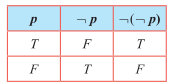

The entries in the columns corresponding to $\neg(\neg p)$ and $p$ are identical and hence they are equivalent.

**8. De Morgan's Laws**

(i) $\neg(p \land q) \equiv \neg p \lor \neg q$  
(ii) $\neg(p \lor q) \equiv \neg p \land \neg q$

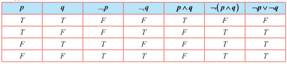

The entries in the columns corresponding to $\neg(p \land q)$ and $\neg p \lor \neg q$ are identical and hence they are equivalent. Therefore $\neg(p \land q) \equiv \neg p \lor \neg q$ . Dually (ii) $\neg(p \lor q) \equiv \neg p \land \neg q$ can be proved.

**9. Absorption Laws**

(i) $p \lor (p \land q) \equiv p$  
(ii) $p \land (p \lor q) \equiv p$

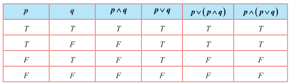

(i) The entries in the columns corresponding to $p \lor (p \land q)$ and $p$ are identical and hence they are equivalent.

(ii) The entries in the columns corresponding to $p \land (p \lor q)$ and $p$ are identical and hence they are equivalent.

**Example 12.17**

Establish the equivalence property: $p \to q \equiv \neg p \lor q$

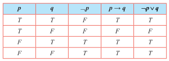

The entries in the columns corresponding to $p \to q$ and $\neg p \lor q$ are identical and hence they are equivalent.

**Example 12.18**

Establish the equivalence property connecting the bi-conditional with conditional:

$p \leftrightarrow q = (p \to q) \land (q \to p)$

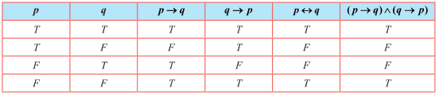

The entries in the columns corresponding to $p \leftrightarrow q$ and $(p \to q) \land (q \to p)$ are identical and hence they are equivalent.

**Example 12.19**

Using the equivalence property, show that $p \leftrightarrow q \equiv (p \land q) \lor (\neg p \land \neg q)$ .

**Solution**

It can be obtained by using Examples 12.17 and 12.18 that

$p \leftrightarrow q \equiv (\neg p \lor q) \land (\neg q \lor p)$ $\tag{1}$

$\equiv (\neg p \lor q) \land (p \lor \neg q)$ (by Commutative Law) $\tag{2}$

$\equiv (\neg p \land (p \lor \neg q)) \lor (q \land (p \lor \neg q))$ (by Distributive Law)

$\equiv (\neg p \land p) \lor (\neg p \land \neg q) \lor (q \land p) \lor (q \land \neg q)$ (by Distributive Law)

$\equiv \mathbb{F} \lor (\neg p \land \neg q) \lor (q \land p) \lor \mathbb{F}$ ; (by Complement Law)

$\equiv (\neg p \land \neg q) \lor (q \land p)$ ; (by Identity Law)

$\equiv (p \land q) \lor (\neg p \land \neg q)$ ; (by Commutative Law)

Finally (1) becomes $p \leftrightarrow q \equiv (p \land q) \lor (\neg p \land \neg q)$ .

**EXERCISE 12.2**

1. Let $p$ : Jupiter is a planet and $q$ : India is an island be any two simple statements. Give verbal sentence describing each of the following statements.

   (i) $\neg p$  
   (ii) $p \land \neg q$  
   (iii) $\neg p \lor q$  
   (iv) $p \to \neg q$  
   (v) $p \leftrightarrow q$

2. Write each of the following sentences in symbolic form using statement variables $p$ and $q$ .  
   (i) 19 is not a prime number and all the angles of a triangle are equal.  
   (ii) 19 is a prime number or all the angles of a triangle are not equal.  
   (iii) 19 is a prime number and all the angles of a triangle are equal.  
   (iv) 19 is not a prime number.

3. Determine the truth value of each of the following statements  
   (i) If $6 + 2 = 5$ , then the milk is white.  
   (ii) China is in Europe or $\sqrt{3}$ is an integer.  
   (iii) It is not true that $5 + 5 = 9$ or Earth is a planet.  
   (iv) 11 is a prime number and all the sides of a rectangle are equal.

4. Which one of the following sentences is a proposition?  
   (i) $4 + 7 = 12$  
   (ii) What are you doing?  
   (iii) $3^n \leq 81$ , $n \in \mathbb{N}$  
   (iv) Peacock is our national bird  
   (v) How tall this mountain is!

5. Write the converse, inverse, and contrapositive of each of the following implication.  
   (i) If $x$ and $y$ are numbers such that $x = y$ , then $x^2 = y^2$  
   (ii) If a quadrilateral is a square then it is a rectangle

6. Construct the truth table for the following statements.  
   (i) $\neg p \land \neg q$  
   (ii) $\neg (p \land \neg q)$  
   (iii) $(p \lor q) \lor \neg q$  
   (iv) $(\neg p \to r) \land (p \leftrightarrow q)$

7. Verify whether the following compound propositions are tautologies or contradictions or contingency  
   (i) $(p \land q) \land \neg (p \lor q)$  
   (ii) $((p \lor q) \land \neg p) \to q$  
   (iii) $(p \to q) \leftrightarrow (\neg p \to q)$  
   (iv) $((p \to q) \land (q \to r)) \to (p \to r)$

8. Show that (i) $\neg (p \land q) \equiv \neg p \lor \neg q$  
   (ii) $\neg (p \to q) \equiv p \land \neg q$

9. Prove that $q \to p \equiv \neg p \to \neg q$

10. Show that $p \to q$ and $q \to p$ are not equivalent

11. Show that $\neg (p \to q) \equiv p \leftrightarrow \neg q$

12. Check whether the statement $p \to (q \to p)$ is a tautology or a contradiction without using the truth table.

13. Using truth table check whether the statements $\neg (p \lor q) \lor (\neg p \land q)$ and $\neg p$ are logically equivalent.

14. Prove $p \to (q \to r) \equiv (p \land q) \to r$ without using truth table.

15. Prove that $p \to (\neg q \lor r) \equiv \neg p \lor (\neg q \lor r)$ using truth table.
