### 12.3 Mathematical Logic

George Boole was a self-taught English Mathematician, Philosopher and Logician. His results on **Boolean Algebra** involving the binary numbers play an important role in various fields, particularly more in computer applications. He introduced the idea of Symbolic Logic and contributed a lot of results to the fast development of Mathematical Logic.

The reputed Greek philosopher Aristotle (384-322 BC (BCE)) wrote the first book on logic. The famous German philosopher and mathematician Gottfried Leibnitz of 17th century framed the idea of using symbols in Logic. Later this idea was realized by George Boole and Augustus de Morgan in 19th century. George Boole established the fact that logic is very much related to mathematics by linking logic, symbols, and algebra together. Mathematical Logic was developed in the late 19th and early 20th centuries.

In 1930 the researchers noticed (Neumann's statement in his death bed: *0 and 1 are going to rule the world*) that the binary numbers 0 and 1 could be used to analyze electrical circuits and thus used to design electronic computers. Today digital computers and electronic circuits are designed to implement this binary arithmetic. We study Mathematical Logic as the language and deductive system of Mathematics and Computer Science.

Generally Logic is the study of valid reasoning. But mathematical logic allows us to represent knowledge in a precise mathematical way and it also allows us to make valid inferences using a set of precise rules. It is regarded as a powerful tool for computer science because it is mainly used to verify the correctness of programs.

### 12.3.1 Statement and its truth value

The simplest part of Mathematical Logic is the **Propositional Logic** and its building blocks are statements or propositions. Mostly communication needs the use of language through which we impart our ideas. They are in the form of sentences.

There are various types of sentences like  
1. Declarative (Assertive type)  
2. Imperative (A command or a request type)  
3. Exclamatory (Emotions, excitement type)  
4. Interrogative (Question type)

> **Definition 12.7**
>
> Any **declarative sentence** is called a **statement** or a **proposition** which is either **true** or **false** but not both.
>
> Any **imperative sentence** such as exclamatory, command and any **interrogative sentence** cannot be a proposition.
>
> The **truth value** of a statement refers to the truth or the falsity of that particular statement.  
> The truth value of a true statement is **true** and it is denoted by $T$ or 1. The truth value of a false statement is **false** and it is denoted by $F$ or 0.
>
> An **open sentence** is a sentence whose truth can vary according to some conditions, which are not stated in the sentence. For instance, (i) $x \times 7 = 35$ is an open sentence whose truth value depends on value of $x$ . That is, if $x = 5$ , it is true and if $x \neq 5$ , it is false. (ii) $He$ is a **bad person**. This is an open sentence. Opinion varies from individual to individual.

**Example 12.11**

Identify the valid statements from the following sentences.

1. (1) Mount Everest is the highest mountain of the world.  
2. (2) $3 + 4 = 8$ .  
3. (3) $7 + 5 > 10$ .  
4. (4) Give me that book.  
5. (5) $(10 - x) = 7$ .  
6. (6) How beautiful this flower is!  
7. (7) Where are you going?  
8. (8) Wish you all success.  
9. (9) This is the beginning of the end.

**Solution:**

The truth value of the sentences (1) and (3) are $T$ , while that of (2) is $F$ . Hence they are statements.  
The sentence (5) is true for $x = 3$ and false for $x \neq 3$ and hence it may be true or false but not both. So it is also a statement.  
The sentences (4), (6), (7), (8) are **not** statements, because (4) is a command, (6) is an exclamatory, (7) is a question while (8) is a sentence expressing one's wishes and (9) is a paradox.

### 12.3.2 Compound Statements, Logical Connectives, and Truth Tables

> **Definition 12.8: (Simple and Compound Statements)**
>
> Any sentence which cannot be split further into two or more statements is called an **atomic statement** or a **simple statement**. If a statement is the combination of two or more simple statements, then it is called a **compound statement** or a **molecular statement**. Hence it is clear that any statement can be either a simple statement or a compound statement.

**Example for simple statements**

The sentences (1), (2), (3) given in example 12.11 are simple statements.

**Example for Compound statements**

Consider the statement, "I is not a prime number and Ooty is in Kerala".

Note that the above statement is actually a combination of the following two simple statements:  
$p$ : I is not a prime number.  
$q$ : Ooty is in Kerala.

Hence the given statement is not a simple statement. It is a compound statement.

From the above discussions, it follows that any simple statement takes the value either $T$ or $F$ . So it can be treated as a variable and this variable is known as **statement variable** or **propositional variable**. The propositional variables are usually denoted by $p, q, r, \ldots$ .

> **Definition 12.9: (Logical Connectives)**
>
> To connect two or more simple sentences, we use the words or a group of words such as "and", "or", "if-then", "if and only if", and "not". These connecting words are known as **logical connectives**.
>
> In order to construct a compound statement from simple statements, some connectives are used. Some basic logical connectives are **negation (not)** , **conjunction (and)** and **disjunction (or)** .

> **Definition 12.10**
>
> A **statement formula** is an expression involving one or more statements connected by some logical connectives.

> **Definition 12.11: (Truth Table)**
>
> A table showing the relationship between truth values of simple statements and the truth values of compound statements formed by using these simple statements is called **truth table**.

> **Definition 12.12**
>
> 1. (i) Let $p$ be a simple statement. Then the **negation** of $p$ is a statement whose truth value is opposite to that of $p$ . It is denoted by $\neg p$ , read as **not $p$** . The truth value of $\neg p$ is $T$ , if $p$ is $F$ , otherwise it is $F$ .
>
> 2. (ii) Let $p$ and $q$ be any two simple statements. The **conjunction** of $p$ and $q$ is obtained by connecting $p$ and $q$ by the word **and**. It is denoted by $p \land q$ , read as '$p$ conjunction $q$' or '$p$ hat $q$' . The truth value of $p \land q$ is $T$ , whenever both $p$ and $q$ are $T$ and it is $F$ otherwise.
>
> 3. (iii) The **disjunction** of any two simple statements $p$ and $q$ is the compound statement obtained by connecting $p$ and $q$ by the word 'or'. It is denoted by $p \lor q$ , read as '$p$ disjunction $q$' or '$p$ cup $q$' . The truth value of $p \lor q$ is $F$ , whenever both $p$ and $q$ are $F$ and it is $T$ otherwise.

### Logical Connectives and their Truth Tables

**(1) Truth Table for NOT [$\neg$] (Negation)**

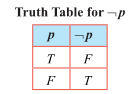

**(2) Truth table for AND [$\land$] (Conjunction)**

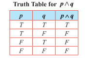

**(3) The truth tables for OR [$\lor$] (Disjunction)**

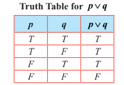

### Example 12.12

Write the statements in words corresponding to $\neg p$ , $p \land q$ , $p \lor q$ and $q \lor \neg p$ , where $p$ is 'It is cold' and $q$ is 'It is raining'.

**Solution**

1. $p \lor q$ : It is cold or raining.
2. $p \land q$ : It is cold and raining.
3. $q \lor \neg p$ : It is raining or it is not cold.

Observe that the statement formula $\neg p$ has only 1 variable $p$ and its truth table has $2 = 2^1$ rows. Each of the statement formulae $p \land q$ and $p \lor q$ has two variables $p$ and $q$ . The truth table corresponding to each of them has $4 = 2^2$ rows. In general, it follows that if a statement formula involves $n$ variables, then its truth table will contain $2^n$ rows.

**Example 12.13**

How many rows are needed for following statement formulae?

1. $p \lor \neg t \land (p \lor \neg s)$  
2. $(p \land q) \lor (\neg r \lor \neg s) \land (\neg t \land \neg v)$

**Solution**

1. $(p \lor \neg t) \land (p \lor \neg s)$ contains 3 variables $p, s, \neg t$ . Hence the corresponding truth table will contain $2^3 = 8$ rows.
2. $(p \land q) \lor (\neg r \lor \neg s) \land (\neg t \land \neg v)$ contains 6 variables $p, q, r, s, t, \neg v$ . Hence the corresponding truth table will contain $2^6 = 64$ rows.

### Conditional Statement

> **Definition 12.13**
>
> The conditional statement of any two statements $p$ and $q$ is the statement, "If $p$ , then $q$" and it is denoted by $p \to q$ . Here $p$ is called the **hypothesis** or **antecedent** and $q$ is called the **conclusion** or **consequence**. $p \to q$ is false only if $p$ is true and $q$ is false. Otherwise it is true.

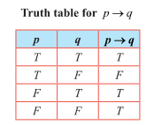

**Example 12.14**

Consider $p \to q$ : If today is Monday, then $4 + 4 = 8$ .

Here the component statements $p$ and $q$ are given by,  
$p$ : Today is Monday; $q$ : $4 + 4 = 8$ .  
The truth value of $p \to q$ is $T$ because the conclusion $q$ is $T$ .

An important point is that $p \to q$ should not be treated by actually considering the meanings of $p$ and $q$ in English. Also it is not necessary that $p$ should be related to $q$ at all.

**Consequences**

From the conditional statement $p \to q$ , three more conditional statements are derived. They are listed below.

1. **Converse statement** $q \to p$ .  
2. **Inverse statement** $\neg p \to \neg q$ .  
3. **Contrapositive statement** $\neg q \to \neg p$ .

**Example 12.15**

Write down the (i) conditional statement (ii) converse statement (iii) inverse statement, and (iv) contrapositive statement for the two statements $p$ and $q$ given below.

$p$ : The number of primes is infinite.  
$q$ : Ooty is in Kerala.

**Solution**

Then the four types of conditional statements corresponding to $p$ and $q$ are respectively listed below.

1. $p \to q$ : (conditional statement) "If the number of primes is infinite then Ooty is in Kerala".

2. $q \to p$ : (converse statement) "If Ooty is in Kerala then the number of primes is infinite".

3. $\neg p \to \neg q$ (inverse statement) "If the number of primes is not infinite then Ooty is not in Kerala".

4. $\neg q \to \neg p$ (contrapositive statement) "If Ooty is not in Kerala then the number of primes is not infinite".

### Bi-conditional Statement

> **Definition 12.14**
>
> The **bi-conditional statement** of any two statements $p$ and $q$ is the statement "$p$ if and only if $q$" and is denoted by $p \leftrightarrow q$ . Its truth value is $T$ , whenever both $p$ and $q$ have the same truth values, otherwise it is false.

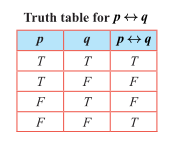

### Exclusive OR (EOR) $\overline{v}$

> **Definition 12.15**
>
> Let $p$ and $q$ be any two statements. Then $p \ \overline{EOR} \ q$ is such a compound statement that its truth value is decided by either $p$ or $q$ but not both. It is denoted by $p \ \overline{v} \ q$ . The truth value of $p \ \overline{v} \ q$ is $T$ whenever either $p$ or $q$ is $T$ , otherwise it is $F$ .

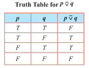

**Example 12.16**

Construct the truth table for $(p \lor q) \land (p \lor \neg q)$ .

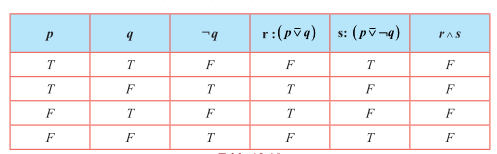

Also the above result can be proved without using truth tables. This proof will be provided after studying the logical equivalence.

### 12.3.3 Tautology, Contradiction, and Contingency

> **Definition 12.16**
>
> A statement is said to be a **tautology** if its truth value is always $T$ irrespective of the truth values of its component statements. It is denoted by $T$ .

> **Definition 12.17**
>
> A statement is said to be a **contradiction** if its truth value is always $F$ irrespective of the truth values of its component statements. It is denoted by $F$ .

> **Definition 12.18**
>
> A statement which is neither a tautology nor a contradiction is called **contingency**.

**Observations**

1. For a tautology, all the entries in the column corresponding to the statement formula will contain $T$ .
2. For a contradiction, all the entries in the column corresponding to the statement formula will contain $F$ .
3. The negation of a tautology is a contradiction and the negation of a contradiction is a tautology.
4. The disjunction of a statement with its negation is a tautology and the conjunction of a statement with its negation is a contradiction. That is, $p \lor \neg p$ is a **tautology** and $p \land \neg p$ is a **contradiction**. This can be easily seen by constructing their truth tables as given below.

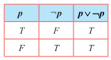

Since the last column of $p \lor \neg p$ contains only $T$ , $p \lor \neg p$ is a tautology.

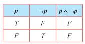

Since the last column contains only $F$ , $p \land \neg p$ is a contradiction.

### 12.3.4 Duality

> **Definition 12.19**
>
> The **dual** of a statement formula is obtained by replacing $\lor$ by $\land$ , $\land$ by $\lor$ , $T$ by $F$ and $F$ by $T$ . A dual is obtained by replacing $\top$ (tautology) by $\bot$ (contradiction), and, $\bot$ by $\top$ .

> **Remarks**
>
> 1. The symbol $\neg$ is not changed while finding the dual.
> 2. Dual of a dual is the statement itself.
> 3. The special statements $\top$ (tautology) and $\bot$ (contradiction) are duals of each other.
> 4. $T$ is changed to $F$ and vice-versa.

### Principle of Duality

If a compound statement $S_1$ contains only $\neg$ , $\land$ , and $\lor$ and statement $S_2$ arises from $S_1$ by replacing $\land$ by $\lor$ , and, $\lor$ by $\land$ then $S_1$ is a tautology if and only if $S_2$ is a contradiction.

**For Example**

(i) The dual of $(p \lor q) \land (r \land s) \lor \neg F$ is $(p \land q) \lor (r \lor s) \land \neg T$ .

(ii) The dual of $p \land [\neg q \lor (p \land q) \lor \neg r]$ is $p \lor [\neg q \land (p \lor q) \land \neg r]$ .

### 12.3.5 Logical Equivalence

> **Definition 12.20**
>
> Any two compound statements $A$ and $B$ are said to be **logically equivalent** or simply **equivalent** if the columns corresponding to $A$ and $B$ in the truth table have **identical truth values**. The logical equivalence of the statements $A$ and $B$ is denoted by $A \equiv B$ or $A \Leftrightarrow B$ .
>
> From the definition, it is clear that, if $A$ and $B$ are logically equivalent, then $A \Leftrightarrow B$ must be a **tautology**.

### Some Laws of Equivalence

**1. Idempotent Laws**

(i) $p \lor p \equiv p$  
(ii) $p \land p \equiv p$ .

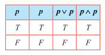

In the above truth table for both $p$ , $p \lor p$ and $p \land p$ have the same truth values. Hence $p \lor p \equiv p$ and $p \land p \equiv p$ .

**2. Commutative Laws**

(i) $p \lor q \equiv q \lor p$  
(ii) $p \land q \equiv q \land p$ .

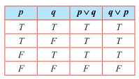

The columns corresponding to $p \lor q$ and $q \lor p$ are identical. Hence $p \lor q \equiv q \lor p$ .  
Similarly (ii) $p \land q \equiv q \land p$ can be proved.

**3. Associative Laws**

(i) $p \lor (q \lor r) \equiv (p \lor q) \lor r$  
(ii) $p \land (q \land r) \equiv (p \land q) \land r$ .

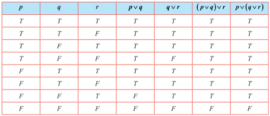

The columns corresponding to $(p \lor q) \lor r$ and $p \lor (q \lor r)$ are identical.  
Hence $p \lor (q \lor r) \equiv (p \lor q) \lor r$ .  
Similarly, (ii) $p \land (q \land r) \equiv (p \land q) \land r$ can be proved.

**4. Distributive Laws**

(i) $p \lor (q \land r) \equiv (p \lor q) \land (p \lor r)$  
(ii) $p \land (q \lor r) \equiv (p \land q) \lor (p \land r)$

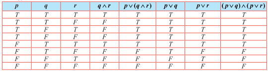

The columns corresponding to $p \lor (q \land r)$ and $(p \lor q) \land (p \lor r)$ are identical. Hence  
$p \lor (q \land r) \equiv (p \lor q) \land (p \lor r)$ .

Similarly (ii) $p \land (q \lor r) \equiv (p \land q) \lor (p \land r)$ can be proved.

**5. Identity Laws**

(i) $p \lor \top \equiv \top$ and $p \lor \bot \equiv p$  
(ii) $p \land \top \equiv p$ and $p \land \bot \equiv \bot$

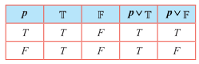

(i) The entries in the columns corresponding to $p \lor T$ and $T$ are identical and hence they are equivalent. The entries in the columns corresponding to $p \lor F$ and $p$ are identical and hence they are equivalent.

Dually

(ii) $p \land T \equiv p$ and $p \land F \equiv F$ can be proved.

**6. Complement Laws**

(i) $p \lor \neg p = T$ and $p \land \neg p = F$  
(ii) $\neg T \equiv F$ and $\neg F \equiv T$

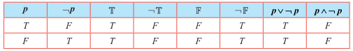

(i) The entries in the columns corresponding to $p \lor \neg p$ and $T$ are identical and hence they are equivalent. The entries in the columns corresponding to $p \land \neg p$ and $F$ are identical and hence they are equivalent.

(ii) The entries in the columns corresponding to $\neg T$ and $F$ are identical and hence they are equivalent. The entries in the columns corresponding to $\neg F$ and $T$ are identical and hence they are equivalent.

**7. Involution Law or Double Negation Law**

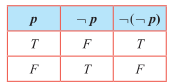

The entries in the columns corresponding to $\neg(\neg p)$ and $p$ are identical and hence they are equivalent.

**8. De Morgan's Laws**

(i) $\neg(p \land q) \equiv \neg p \lor \neg q$  
(ii) $\neg(p \lor q) \equiv \neg p \land \neg q$

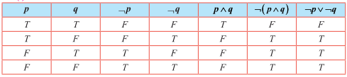

The entries in the columns corresponding to $\neg(p \land q)$ and $\neg p \lor \neg q$ are identical and hence they are equivalent. Therefore $\neg(p \land q) \equiv \neg p \lor \neg q$ . Dually (ii) $\neg(p \lor q) \equiv \neg p \land \neg q$ can be proved.

**9. Absorption Laws**

(i) $p \lor (p \land q) \equiv p$  
(ii) $p \land (p \lor q) \equiv p$

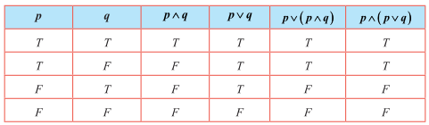

(i) The entries in the columns corresponding to $p \lor (p \land q)$ and $p$ are identical and hence they are equivalent.

(ii) The entries in the columns corresponding to $p \land (p \lor q)$ and $p$ are identical and hence they are equivalent.

**Example 12.17**

Establish the equivalence property: $p \to q \equiv \neg p \lor q$

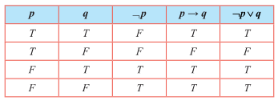

The entries in the columns corresponding to $p \to q$ and $\neg p \lor q$ are identical and hence they are equivalent.

**Example 12.18**

Establish the equivalence property connecting the bi-conditional with conditional:

$p \leftrightarrow q = (p \to q) \land (q \to p)$

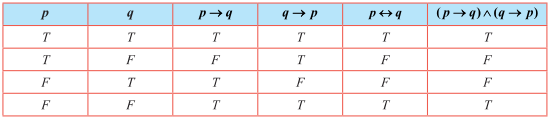

The entries in the columns corresponding to $p \leftrightarrow q$ and $(p \to q) \land (q \to p)$ are identical and hence they are equivalent.

**Example 12.19**

Using the equivalence property, show that $p \leftrightarrow q \equiv (p \land q) \lor (\neg p \land \neg q)$ .

**Solution**

It can be obtained by using Examples 12.17 and 12.18 that

$p \leftrightarrow q \equiv (\neg p \lor q) \land (\neg q \lor p)$ $\tag{1}$

$\equiv (\neg p \lor q) \land (p \lor \neg q)$ (by Commutative Law) $\tag{2}$

$\equiv (\neg p \land (p \lor \neg q)) \lor (q \land (p \lor \neg q))$ (by Distributive Law)

$\equiv (\neg p \land p) \lor (\neg p \land \neg q) \lor (q \land p) \lor (q \land \neg q)$ (by Distributive Law)

$\equiv \mathbb{F} \lor (\neg p \land \neg q) \lor (q \land p) \lor \mathbb{F}$ ; (by Complement Law)

$\equiv (\neg p \land \neg q) \lor (q \land p)$ ; (by Identity Law)

$\equiv (p \land q) \lor (\neg p \land \neg q)$ ; (by Commutative Law)

Finally (1) becomes $p \leftrightarrow q \equiv (p \land q) \lor (\neg p \land \neg q)$ .

**EXERCISE 12.2**

1. Let $p$ : Jupiter is a planet and $q$ : India is an island be any two simple statements. Give verbal sentence describing each of the following statements.

   (i) $\neg p$  
   (ii) $p \land \neg q$  
   (iii) $\neg p \lor q$  
   (iv) $p \to \neg q$  
   (v) $p \leftrightarrow q$

2. Write each of the following sentences in symbolic form using statement variables $p$ and $q$ .  
   (i) 19 is not a prime number and all the angles of a triangle are equal.  
   (ii) 19 is a prime number or all the angles of a triangle are not equal.  
   (iii) 19 is a prime number and all the angles of a triangle are equal.  
   (iv) 19 is not a prime number.

3. Determine the truth value of each of the following statements  
   (i) If $6 + 2 = 5$ , then the milk is white.  
   (ii) China is in Europe or $\sqrt{3}$ is an integer.  
   (iii) It is not true that $5 + 5 = 9$ or Earth is a planet.  
   (iv) 11 is a prime number and all the sides of a rectangle are equal.

4. Which one of the following sentences is a proposition?  
   (i) $4 + 7 = 12$  
   (ii) What are you doing?  
   (iii) $3^n \leq 81$ , $n \in \mathbb{N}$  
   (iv) Peacock is our national bird  
   (v) How tall this mountain is!

5. Write the converse, inverse, and contrapositive of each of the following implication.  
   (i) If $x$ and $y$ are numbers such that $x = y$ , then $x^2 = y^2$  
   (ii) If a quadrilateral is a square then it is a rectangle

6. Construct the truth table for the following statements.  
   (i) $\neg p \land \neg q$  
   (ii) $\neg (p \land \neg q)$  
   (iii) $(p \lor q) \lor \neg q$  
   (iv) $(\neg p \to r) \land (p \leftrightarrow q)$

7. Verify whether the following compound propositions are tautologies or contradictions or contingency  
   (i) $(p \land q) \land \neg (p \lor q)$  
   (ii) $((p \lor q) \land \neg p) \to q$  
   (iii) $(p \to q) \leftrightarrow (\neg p \to q)$  
   (iv) $((p \to q) \land (q \to r)) \to (p \to r)$

8. Show that (i) $\neg (p \land q) \equiv \neg p \lor \neg q$  
   (ii) $\neg (p \to q) \equiv p \land \neg q$

9. Prove that $q \to p \equiv \neg p \to \neg q$

10. Show that $p \to q$ and $q \to p$ are not equivalent

11. Show that $\neg (p \to q) \equiv p \leftrightarrow \neg q$

12. Check whether the statement $p \to (q \to p)$ is a tautology or a contradiction without using the truth table.

13. Using truth table check whether the statements $\neg (p \lor q) \lor (\neg p \land q)$ and $\neg p$ are logically equivalent.

14. Prove $p \to (q \to r) \equiv (p \land q) \to r$ without using truth table.

15. Prove that $p \to (\neg q \lor r) \equiv \neg p \lor (\neg q \lor r)$ using truth table.