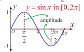
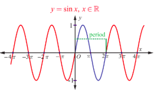
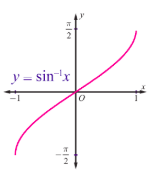
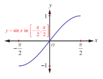
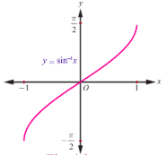
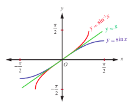

## 4.3 Sine Function and Inverse Sine Function

Let us recall that sine function is a function with $\mathbb{R}$ as its domain and $[-1,1]$ as its range. We write $y = \sin x$ and $y = \sin^{-1}x$ or $y = \arcsin(x)$ to represent the sine function and the inverse sine function, respectively. Here, the symbol $-1$ is not an exponent. It denotes the inverse and does not mean the reciprocal.

We know that $\sin(x + 2\pi) = \sin x$ is true for all real numbers $x$. Also, $\sin(x + p)$ need not be equal to $\sin x$ for $0 < p < 2\pi$ and for all $x$. Hence, the period of the sine function is $2\pi$.

#### 4.3.1 The graph of sine function

The graph of the sine function is the graph of $y = \sin x$, where $x$ is a real number. Since sine function is periodic with period $2\pi$, the graph of the sine function is repeating the same pattern in each of the intervals, $\dots, [-2\pi,0], [0,2\pi], [2\pi,4\pi], [4\pi,6\pi], \dots$. Therefore, it suffices to determine the portion of the graph for $x\in [0,2\pi]$. Let us construct the following table to identify some known coordinate pairs for the points $(x,y)$ on the graph of $y = \sin x$, $x\in [0,2\pi]$.

| $x$ (in radian) | $0$ | $\frac{\pi}{6}$ | $\frac{\pi}{4}$ | $\frac{\pi}{3}$ | $\frac{\pi}{2}$ | $\pi$ | $\frac{3\pi}{2}$ | $2\pi$ |
| :--- | :--- | :--- | :--- | :--- | :--- | :--- | :--- | :--- |
| $y = \sin x$ | $0$ | $\frac{1}{2}$ | $\frac{1}{\sqrt{2}}$ | $\frac{\sqrt{3}}{2}$ | $1$ | $0$ | $-1$ | $0$ |

It is clear that the graph of $y = \sin x$, $0 \leq x \leq 2\pi$, begins at the origin. As $x$ increases from $0$ to $\frac{\pi}{2}$, the value of $y = \sin x$ increases from $0$ to $1$. As $x$ increases from $\frac{\pi}{2}$ to $\pi$ and then to $\frac{3\pi}{2}$, the value of $y$ decreases from $1$ to $0$ and then to $-1$. As $x$ increases from $\frac{3\pi}{2}$ to $2\pi$, the value of $y$ increases from $-1$ to $0$. Plot the points listed in the table and connect them with a smooth curve. The portion of the graph is shown in Fig. 4.4.

The entire graph of $y = \sin x$, $x\in \mathbb{R}$ consists of repetitions of the above portion on either side of the interval $[0,2\pi]$ as $y = \sin x$ is periodic with period $2\pi$. The graph of sine function is shown in Fig. 4.5. The portion of the curve corresponding to $0$ to $2\pi$ is called a cycle. Its amplitude is $1$.

> **Note**
>
> Observe that $\sin x \geq 0$ for $0 \leq x \leq \pi$, which corresponds to the values of the sine function in quadrants I and II and $\sin x < 0$ for $\pi < x < 2\pi$, which corresponds to the values of the sine function in quadrants III and IV.

#### 4.3.2 Properties of the sine function

From the graph of $y = \sin x$, we observe the following properties of sine function:

(i) There is no break or discontinuities in the curve. The sine function is continuous.
(ii) The sine function is odd, since the graph is symmetric with respect to the origin.
(iii) The maximum value of sine function is $1$ and occurs at $x = \dots, -\frac{3\pi}{2}, \frac{\pi}{2}, \frac{5\pi}{2}, \dots$ and the minimum value is $-1$ and occurs at $x = \dots, -\frac{\pi}{2}, \frac{3\pi}{2}, \frac{7\pi}{2}, \dots$. In other words, $-1 \leq \sin x \leq 1$ for all $x \in \mathbb{R}$.

#### 4.3.3 The inverse sine function and its properties

The sine function is not one-to-one in the entire domain $\mathbb{R}$. This is visualized from the fact that every horizontal line $y = b, -1 \leq b \leq 1$, intersects the graph of $y = \sin x$ infinitely many times. In other words, the sine function does not pass the horizontal line test, which is a tool to decide the one-to-one status of a function. If the domain is restricted to $\left[-\frac{\pi}{2}, \frac{\pi}{2}\right]$, then the sine function becomes one to one and onto (bijection) with the range $[-1, 1]$. Now, let us define the inverse sine function with $[-1, 1]$ as its domain and with $\left[-\frac{\pi}{2}, \frac{\pi}{2}\right]$ as its range.

> **Definition 4.3**
>
> For $-1 \leq x \leq 1$, define $\sin^{-1} x$ as the unique number $y$ in $\left[-\frac{\pi}{2}, \frac{\pi}{2}\right]$ such that $\sin y = x$. In other words, the inverse sine function $\sin^{-1} : [-1, 1] \to \left[-\frac{\pi}{2}, \frac{\pi}{2}\right]$ is defined by $\sin^{-1}(x) = y$ if and only if $\sin y = x$ and $y \in \left[-\frac{\pi}{2}, \frac{\pi}{2}\right]$.

> **Note**
>
> (i) The sine function is one-to-one on the restricted domain $\left[-\frac{\pi}{2}, \frac{\pi}{2}\right]$, but not on any larger interval containing the origin.
>
> (ii) The cosine function is non-negative on the interval $\left[-\frac{\pi}{2}, \frac{\pi}{2}\right]$, the range of $\sin^{-1} x$. This observation is very important for some of the trigonometric substitutions in Integral Calculus.
>
> (iii) Whenever we talk about the inverse sine function, we have, $$\sin :\left[-\frac{\pi}{2},\frac{\pi}{2}\right]\to [-1,1]\quad \mathrm{and}\quad \sin^{-1}:[-1,1]\to \left[-\frac{\pi}{2},\frac{\pi}{2}\right].$$
>
> (iv) We can also restrict the domain of the sine function to any one of the intervals, $\dots \left[-\frac{5\pi}{2}, -\frac{3\pi}{2}\right], \left[-\frac{3\pi}{2}, -\frac{\pi}{2}\right], \left[\frac{\pi}{2},\frac{3\pi}{2}\right], \left[\frac{3\pi}{2},\frac{5\pi}{2}\right], \dots$ where it is one-to-one and its range is $[-1,1]$
>
> (v) The restricted domain $\left[-\frac{\pi}{2}, \frac{\pi}{2}\right]$ is called the principal domain of sine function and the values of $y = \sin^{-1}x, -1 \leq x \leq 1$, are known as principal values of the function $y = \sin^{-1}x$.

From the definition of $y = \sin^{-1}x$, we observe the following:

(i) $y = \sin^{-1}x$ if and only if $x = \sin y$ for $-1 \leq x \leq 1$ and $-\frac{\pi}{2} \leq y \leq \frac{\pi}{2}$.

(ii) $y = \sin^{-1}x$ if $|x| \leq 1$ and $x$ has no sense if $|x| > 1$.

(iii) $\sin^{-1}(\sin x) = x$ if $-\frac{\pi}{2} \leq x \leq \frac{\pi}{2}$.

(iv) $\sin^{-1}(\sin x) = \pi - x$ if $\frac{\pi}{2} \leq x \leq \frac{3\pi}{2}$.

(v) $y = \sin^{-1}x$ is an odd function.

> **Remark**
>
> Let us distinguish between the equations $\sin x = \frac{1}{2}$ and $x = \sin^{-1}\left(\frac{1}{2}\right)$. To solve the equation $\sin x = \frac{1}{2}$, one has to find all values of $x$ in the interval $(-\infty, \infty)$ such that $\sin x = \frac{1}{2}$. However, to find $x$ in $x = \sin^{-1}\left(\frac{1}{2}\right)$, one has to find the unique value $x$ in the interval $\left[-\frac{\pi}{2}, \frac{\pi}{2}\right]$ such that $\sin x = \frac{1}{2}$.

#### 4.3.4 Graph of the inverse sine function

The inverse sine function, $\sin^{-1}[-1,1]\to \left[-\frac{\pi}{2},\frac{\pi}{2}\right]$, receives a real number $x$ in the interval $[-1,1]$ as input and gives a real number $y$ in the interval $\left[-\frac{\pi}{2},\frac{\pi}{2}\right]$ as output. As usual, let us find some points $(x,y)$ using the equation $y = \sin^{-1}x$ and plot them in the $xy$-plane. Observe that the value of $y$ increases from $-\frac{\pi}{2}$ to $\frac{\pi}{2}$ as $x$ increases from $-1$ to $1$. By connecting these points by a smooth curve, we get the graph of $y = \sin^{-1}x$ as shown in Fig. 4.6.

> **Note**
>
> The graph of $y = \sin^{-1}x$
> (i) is also obtained by reflecting the portion of the entire graph of $y = \sin x$ in the interval $\left[-\frac{\pi}{2},\frac{\pi}{2}\right]$ about the line $y = x$ or by interchanging $x$ and $y$ axes from the graph of $y = \sin x$.
> (ii) passes through the origin.
> (iii) is symmetric with respect to the origin and hence, $y = \sin^{-1}x$ is an odd function.

Fig. 4.9 illustrates that the graph of $y = \sin^{-1}x$ is the mirror image of the graph of $y = \sin x$, $-\frac{\pi}{2} \leq x \leq \frac{\pi}{2}$, in the line $y = x$ and also shows that the sine function and the inverse sine function are symmetric with respect to the origin.

**Example 4.1**

Find the principal value of $\sin^{-1}\left(-\frac{1}{2}\right)$ (in radians and degrees).

**Solution**

Let $\sin^{-1}\left(-\frac{1}{2}\right) = y$. Then $\sin y = -\frac{1}{2}$.

The range of the principal value of $\sin^{-1}x$ is $\left[-\frac{\pi}{2},\frac{\pi}{2}\right]$ and hence, let us find $y \in \left[-\frac{\pi}{2},\frac{\pi}{2}\right]$ such that $\sin y = -\frac{1}{2}$. Clearly, $y = -\frac{\pi}{6}$.

Thus, the principal value of $\sin^{-1}\left(-\frac{1}{2}\right)$ is $-\frac{\pi}{6}$. This corresponds to $-30^{\circ}$.

**Example 4.2**

Find the principal value of $\sin^{-1}(2)$, if it exists.

**Solution**

Since the domain of $y = \sin^{-1}x$ is $[-1,1]$ and $2 \notin [-1,1]$, $\sin^{-1}(2)$ does not exist.

**Example 4.3**

Find the principal value of  
(i) $\sin^{-1}\left(\frac{1}{\sqrt{2}}\right)$  
(ii) $\sin^{-1}\left(\sin\left(-\frac{\pi}{3}\right)\right)$  
(iii) $\sin^{-1}\left(\sin\left(\frac{5\pi}{6}\right)\right)$

**Solution**

We know that $\sin^{-1}[-1, 1] \to \left[-\frac{\pi}{2}, \frac{\pi}{2}\right]$ is given by  
$\sin^{-1}x = y$ if and only if $x = \sin y$ for $-1 \leq x \leq 1$ and $-\frac{\pi}{2} \leq y \leq \frac{\pi}{2}$ . Thus,

(i) $\sin^{-1}\left(\frac{1}{\sqrt{2}}\right) = \frac{\pi}{4}$ , since $\frac{\pi}{4} \in \left[-\frac{\pi}{2}, \frac{\pi}{2}\right]$ and $\sin\frac{\pi}{4} = \frac{1}{\sqrt{2}}$ .

(ii) $\sin^{-1}\left(\sin\left(-\frac{\pi}{3}\right)\right) = -\frac{\pi}{3}$ , since $-\frac{\pi}{3} \in \left[-\frac{\pi}{2}, \frac{\pi}{2}\right]$ .

(iii) $\sin^{-1}\left(\sin\left(\frac{5\pi}{6}\right)\right) = \sin^{-1}\left(\sin\left(\pi - \frac{\pi}{6}\right)\right) = \sin^{-1}\left(\sin\frac{\pi}{6}\right) = \frac{\pi}{6}$ , since $\frac{\pi}{6} \in \left[-\frac{\pi}{2}, \frac{\pi}{2}\right]$ .

**Example 4.4**

Find the domain of $\sin^{-1}\left(2 - 3x^2\right)$

**Solution**

We know that the domain of $\sin^{-1}(x)$ is $[-1, 1]$.  
This leads to $-1 \leq 2 - 3x^2 \leq 1$ , which implies $-3 \leq -3x^2 \leq -1$ .

Now,  
$-3 \leq -3x^2$ , gives $x^2 \leq 1$  
and  
$-3x^2 \leq -1$ , gives $x^2 \geq \frac{1}{3}$ .

Combining the equations (1) and (2), we get $\frac{1}{3} \leq x^2 \leq 1$ . That is, $\frac{1}{\sqrt{3}} \leq |x| \leq 1$ , which gives  
$x \in \left[-1, -\frac{1}{\sqrt{3}}\right] \cup \left[\frac{1}{\sqrt{3}}, 1\right]$ , since $a \leq |x| \leq b$ implies $x \in [-b, -a] \cup [a, b]$ .

**EXERCISE 4.1**

1. Find all the values of $x$ such that

   (i) $-10\pi \leq x \leq 10\pi$ and $\sin x = 0$  
   (ii) $-3\pi \leq x \leq 3\pi$ and $\sin x = -1$ .

2. Find the period and amplitude of

   (i) $y = \sin 7x$  
   (ii) $y = -\sin \left(\frac{1}{3}x\right)$  
   (iii) $y = 4\sin(-2x)$ .

3. Sketch the graph of $y = \sin \left(\frac{1}{3}x\right)$ for $0 \leq x < 6\pi$ .

4. Find the value of

   (i) $\sin^{-1}\left(\sin\left(\frac{2\pi}{3}\right)\right)$  
   (ii) $\sin^{-1}\left(\sin\left(\frac{5\pi}{4}\right)\right)$ .

5. For what value of $x$ does $\sin x = \sin^{-1} x$ ?

6. Find the domain of the following

   (i) $f(x) = \sin^{-1}\left(\frac{x^2 + 1}{2x}\right)$  
   (ii) $g(x) = 2\sin^{-1}\left(2x - 1\right) - \frac{\pi}{4}$ .

7. Find the value of $\sin^{-1}\left(\sin \frac{5\pi}{9}\cos \frac{\pi}{9} + \cos \frac{5\pi}{9}\sin \frac{\pi}{9}\right)$ .