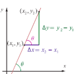
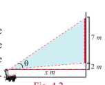
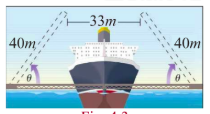

## 4.1 Introduction

In everyday life, indirect measurement is used to obtain solutions to problems that are impossible to solve using measurement tools. Trigonometry helps us to find measurements like heights of mountains and tall buildings without using measurement tools. Trigonometric functions and their inverse trigonometric functions are widely used in engineering and in other sciences including physics.

They are useful not only in solving triangles, given the length of two sides of a right triangle, but also they help us in evaluating a certain type of integrals, such as $\int \frac{1}{\sqrt{a^2 - x^2}} dx$ and $\int \frac{1}{x^2 + a^2} dx$. The symbol $\sin^{-1}x$ denoting the inverse trigonometric function $\arcsin(x)$ of sine function was introduced by the British mathematician John F.W. Herschel (1792-1871). For his work along with his father, he was presented with the Gold Medal of the Royal Astronomical Society in 1826.

An oscilloscope is an electronic device that converts electrical signals into graphs like that of sine function. By manipulating the controls, we can change the amplitude, the period and the phase shift of sine curves. The oscilloscope has many applications like measuring human heartbeats, where the trigonometric functions play a dominant role.

Let us consider some simple situations where inverse trigonometric functions are often used.

**Illustration-1 (Slope problem)**

Consider a straight line $y = mx + b$. Let us find the angle $\theta$ made by the line with $x$-axis in terms of slope $m$. The slope or gradient $m$ is defined as the rate of change of a function, usually calculated by $m = \frac{\Delta y}{\Delta x}$. From right triangle (Fig. 4.1), $\tan \theta = \frac{\Delta y}{\Delta x}$. Thus, $\tan \theta = m$. In order to solve for $\theta$, we need the inverse trigonometric function called "inverse tangent function".

***Illustration-2 (Movie Theatre Screens)***

Suppose that a movie theatre has a screen of 7 metres tall. When someone sits down, the bottom of the screen is 2 metres above the eye level. The angle formed by drawing a line from the eye to the bottom of the screen and a line from the eye to the top of the screen is called the viewing angle. In Fig. 4.2, $\theta$ is the viewing angle. Suppose that the person sits $x$ metres away from the screen. The viewing angle $\theta$ is given by the function $\theta(x) = \tan^{-1}\left(\frac{9}{x}\right) - \tan^{-1}\left(\frac{2}{x}\right)$. Observe that the viewing angle $\theta$ is a function of $x$.

**Illustration-3 (Drawbridge)**

Assume that there is a double-leaf drawbridge as shown in Fig.4.3. Each leaf of the bridge is 40 metres long. A ship of 33 metres wide needs to pass through the bridge. Inverse trigonometric function helps us to find the minimum angle $\theta$ so that each leaf of the bridge should be opened in order to ensure that the ship will pass through the bridge.

In class XI, we have discussed trigonometric functions of real numbers using unit circle, where the angles are in radian measure. In this chapter, we shall study the inverse trigonometric functions, their graphs and properties. In our discussion, as usual $\mathbb{R}$ and $\mathbb{Z}$ stand for the set of all real numbers and all integers, respectively. Let us recall the definition of periodicity, domain and range of six trigonometric functions.

>**Learning Objectives**
>
> Upon completion of this chapter, students will be able to
>
> - define inverse trigonometric functions
> - evaluate the principal values of inverse trigonometric functions
> - draw the graphs of trigonometric functions and their inverses
> - apply the properties of inverse trigonometric functions and evaluate some expressions
