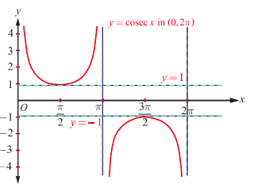
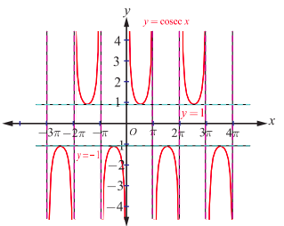
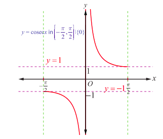
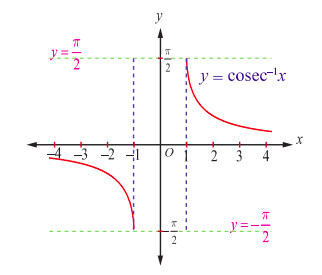

## 4.6 The Cosecant Function and the Inverse Cosecant Function

Like sine function, the cosecant function is an odd function and has period $2\pi$. The values of cosecant function $y = \csc x$ repeat after an interval of length $2\pi$. Observe that $y = \csc x = \frac{1}{\sin x}$ is not defined when $\sin x = 0$. So, the domain of cosecant function is $\mathbb{R} \setminus \{n\pi : n \in \mathbb{Z}\}$. Since $-1 \leq \sin x \leq 1$, $y = \csc x$ does not take any value in between $-1$ and $1$. Thus, the range of cosecant function is $(-\infty, -1] \cup [1, \infty)$.

#### 4.6.1 Graph of the cosecant function

In the interval $(0,2\pi)$, the cosecant function is continuous everywhere except at the point $x = \pi$. It has neither maximum nor minimum. Roughly speaking, the value of $y = \csc x$ falls from $\infty$ to $1$ for $x \in \left(0, \frac{\pi}{2}\right]$, it raises from $1$ to $\infty$ for $x \in \left[\frac{\pi}{2}, \pi\right)$. Again, it raises from $-\infty$ to $-1$ for $x \in \left(\pi, \frac{3\pi}{2}\right]$ and falls from $-1$ to $-\infty$ for $x \in \left[\frac{3\pi}{2}, 2\pi\right)$.

The graph of $y = \csc x$, $x \in (0,2\pi) \setminus \{\pi\}$ is shown in the Fig. 4.19. This portion of the graph is repeated for the intervals $\dots, (-4\pi, -2\pi) \setminus \{-3\pi\}, (-2\pi, 0) \setminus \{-\pi\}, (2\pi, 4\pi) \setminus \{3\pi\}, (4\pi, 6\pi) \setminus \{5\pi\}, \dots$.

The entire graph of $y = \csc x$ is shown in Fig. 4.20.

### 4.6.2 The inverse cosecant function

The cosecant function, $\csc: \left[-\frac{\pi}{2}, 0\right) \cup \left(0, \frac{\pi}{2}\right] \to (-\infty, -1] \cup [1, \infty)$ is bijective in the restricted domain $\left[-\frac{\pi}{2}, 0\right) \cup \left(0, \frac{\pi}{2}\right]$. So, the inverse cosecant function is defined with the domain $(-\infty, -1] \cup [1, \infty)$ and the range $\left[-\frac{\pi}{2}, 0\right) \cup \left(0, \frac{\pi}{2}\right]$.

**Definition 4.6**

The inverse cosecant function $\csc^{-1}: (-\infty, -1] \cup [1, \infty) \to \left[-\frac{\pi}{2}, 0\right) \cup \left(0, \frac{\pi}{2}\right]$ is defined by $\csc^{-1}(x) = y$ if and only if $\csc y = x$ and $y \in \left[-\frac{\pi}{2}, 0\right) \cup \left(0, \frac{\pi}{2}\right]$.

#### 4.6.3 Graph of the inverse cosecant function

The inverse cosecant function, $y = \csc^{-1}x$ is a function whose domain is $\mathbb{R} \setminus (-1, 1)$ and the range is $\left[-\frac{\pi}{2}, \frac{\pi}{2}\right] \setminus \{0\}$. That is, $\csc^{-1}: (-\infty, -1] \cup [1, \infty) \to \left[-\frac{\pi}{2}, 0\right) \cup \left(0, \frac{\pi}{2}\right]$.

Fig. 4.21 and Fig. 4.22 show the graphs of cosecant function in the principal domain and the inverse cosecant function in the corresponding domain respectively.

