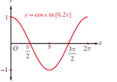
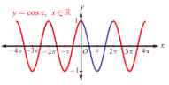
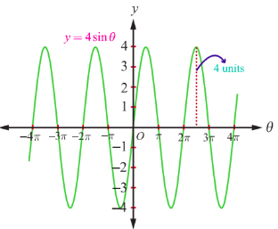
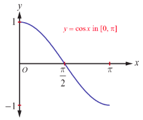
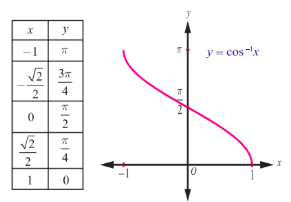

## 4.4 The Cosine Function and Inverse Cosine Function

The cosine function is a function with $\mathbb{R}$ as its domain and $[-1,1]$ as its range. We write $y = \cos x$ and $y = \cos^{-1}x$ or $y = \arccos(x)$ to represent the cosine function and the inverse cosine function, respectively. Since $\cos(x + 2\pi) = \cos x$ is true for all real numbers $x$ and $\cos(x + p)$ need not be equal to $\cos x$ for $0 < p < 2\pi$ and $x \in \mathbb{R}$, the period of $y = \cos x$ is $2\pi$.

#### 4.4.1 Graph of cosine function

The graph of cosine function is the graph of $y = \cos x$, where $x$ is a real number. Since cosine function is of period $2\pi$, the graph of cosine function is repeating the same pattern in each of the intervals $\dots, [-4\pi, -2\pi], [-2\pi, 0], [0, 2\pi], [2\pi, 4\pi], [4\pi, 6\pi], \dots$. Therefore, it suffices to determine the portion of the graph of cosine function for $x \in [0, 2\pi]$. We construct the following table to identify some known coordinate pairs $(x,y)$ for points on the graph of $y = \cos x$, $x \in [0, 2\pi]$.

| $x$ (in radian) | $0$ | $\frac{\pi}{6}$ | $\frac{\pi}{4}$ | $\frac{\pi}{3}$ | $\frac{\pi}{2}$ | $\pi$ | $\frac{3\pi}{2}$ | $2\pi$ |
| :--- | :--- | :--- | :--- | :--- | :--- | :--- | :--- | :--- |
| $y = \cos x$ | $1$ | $\frac{\sqrt{3}}{2}$ | $\frac{1}{\sqrt{2}}$ | $\frac{1}{2}$ | $0$ | $-1$ | $0$ | $1$ |

The table shows that the graph of $y = \cos x$, $0 \leq x \leq 2\pi$, begins at $(0,1)$. As $x$ increases from $0$ to $\pi$, the value of $y = \cos x$ decreases from $1$ to $-1$. As $x$ increases from $\pi$ to $2\pi$, the value of $y$ increases from $-1$ to $1$. Plot the points listed in the table and connect them with a smooth curve. The portion of the graph is shown in Fig. 4.10.

The graph of $y = \cos x$, $x \in \mathbb{R}$ consists of repetitions of the above portion on either side of the interval $[0, 2\pi]$ and is shown in Fig. 4.11. From the graph of cosine function, observe that $\cos x$ is positive in the first quadrant $\left(\text{for } 0 \leq x \leq \frac{\pi}{2}\right)$, negative in the second quadrant $\left(\text{for } \frac{\pi}{2} < x \leq \pi\right)$ and third quadrant $\left(\text{for } \pi < x < \frac{3\pi}{2}\right)$ and again it is positive in the fourth quadrant $\left(\text{for } \frac{3\pi}{2} < x < 2\pi\right)$.

> **Note**
>
> We see from the graph that $\cos(-x) = \cos x$ for all $x$, which asserts that $y = \cos x$ is an even function. 

#### 4.4.2 Properties of the cosine function

From the graph of $y = \cos x$, we observe the following properties of cosine function:

(i) There is no break or discontinuities in the curve. The cosine function is continuous.

(ii) The cosine function is even, since the graph is symmetric about $y$-axis.

(iii) The maximum value of cosine function is $1$ and occurs at $x = \dots, -2\pi, 0, 2\pi, \dots$ and the minimum value is $-1$ and occurs at $x = \dots, -\pi, \pi, 3\pi, 5\pi, \dots$. In other words, $-1 \leq \cos x \leq 1$ for all $x \in \mathbb{R}$.

> **Remark**
>
> (i) Shifting the graph of $y = \cos x$ to the right $\frac{\pi}{2}$ radians, gives the graph of $y = \cos \left(x - \frac{\pi}{2}\right)$ which is same as the graph of $y = \sin x$. Observe that $\cos \left(x - \frac{\pi}{2}\right) = \cos \left(\frac{\pi}{2} - x\right) = \sin x$.
>
> (ii) $y = A\sin \alpha x$ and $y = B\cos \beta x$ always satisfy the inequalities $-|A| \leq A\sin \alpha x \leq |A|$ and $-|B| \leq B\cos \beta x \leq |B|$. The amplitude and period of $y = A\sin \alpha x$ are $|A|$ and $\frac{2\pi}{|\alpha|}$, respectively and those of $y = B\cos \beta x$ are $|B|$ and $\frac{2\pi}{|\beta|}$, respectively.
> The functions $y = A\sin \alpha x$ and $y = B\cos \beta x$ are known as sinusoidal functions.
>
> (iii) Graphing of $y = A\sin \alpha x$ and $y = B\cos \beta x$ are obtained by extending the portion of the graphs on the intervals $\left[0, \frac{2\pi}{|\alpha|}\right]$ and $\left[0, \frac{2\pi}{|\beta|}\right]$, respectively.

**Applications**

Phenomena in nature like tides and yearly temperature that cycle repetitively through time are often modelled using sinusoids. For instance, to model tides using a general form of sinusoidal function $y = d + a\cos(bt - c)$, we give the following steps:

(i) The amplitude of a sinusoidal graph (function) is one-half of the absolute value of the difference of the maximum and minimum $y$-values of the graph. Thus, Amplitude, $a = \frac{1}{2} (\max - \min)$; Centre line is $y = d$, where $d = \frac{1}{2} (\max + \min)$

(ii) Period, $p = 2 \times$ (time from maximum to minimum); $b = \frac{2\pi}{p}$

(iii) $c = b \times$ time at which maximum occurs.

**Model-1**

The depth of water at the end of a dock varies with tides. The following table shows the depth (in metres) of water at various time.

| time, $t$ | 12 am | 2 am | 4 am | 6 am | 8 am | 10 am | 12 noon |
| :--- | :--- | :--- | :--- | :--- | :--- | :--- | :--- |
| depth | 3.5 | 4.2 | 3.5 | 2.1 | 1.4 | 2.1 | 3.5 |

Let us construct a sinusoidal function of the form $y = d + a\cos(bt - c)$ to find the depth of water at time $t$. Here, $a = 1.4$; $d = 2.8$; $p = 12$; $b = \frac{\pi}{6}$; $c = \frac{\pi}{3}$.

The required sinusoidal function is $y = 2.8 + 1.4\cos\left(\frac{\pi}{6}t - \frac{\pi}{3}\right)$.

> **Note**
>
> The transformations of sine and cosine functions are useful in numerous applications. A circular motion is always modelled using either the sine or cosine function.

**Model-2**

A point rotates around a circle with centre at origin and radius 4. We can obtain the $y$-coordinate of the point as a function of the angle of rotation.

For a point on a circle with centre at the origin and radius $a$, the $y$-coordinate of the point is $y = a\sin \theta$, where $\theta$ is the angle of rotation. In this case, we get the equation $y(\theta) = 4\sin \theta$, where $\theta$ is in radian, the amplitude is 4 and the period is $2\pi$. The amplitude 4 causes a vertical stretch of the $y$-values of the function $\sin \theta$ by a factor of 4.

#### 4.4.3 The inverse cosine function and its properties

The cosine function is not one-to-one in the entire domain $\mathbb{R}$. However, the cosine function is one-to-one on the restricted domain $[0, \pi]$ and still, on this restricted domain, the range is $[-1, 1]$. Now, let us define the inverse cosine function with $[-1, 1]$ as its domain and with $[0, \pi]$ as its range.

> **Definition 4.4**
>
> For $-1 \leq x \leq 1$, define $\cos^{-1} x$ as the unique number $y$ in $[0, \pi]$ such that $\cos y = x$. In other words, the inverse cosine function $\cos^{-1}: [-1, 1] \to [0, \pi]$ is defined by $\cos^{-1}(x) = y$ if and only if $\cos y = x$ and $y \in [0, \pi]$.

> **Note**
>
> (i) The sine function is non-negative on the interval $[0, \pi]$, the range of $\cos^{-1}x$. This observation is very important for some of the trigonometric substitutions in Integral Calculus.

> (ii) Whenever we talk about the inverse cosine function, we have $\cos x: [0, \pi] \to [-1, 1]$ and $\cos^{-1}x: [-1, 1] \to [0, \pi]$.

> (iii) We can also restrict the domain of the cosine function to any one of the intervals $\dots, [-\pi, 0], [\pi, 2\pi], \dots$, where it is one-to-one and its range is $[-1, 1]$.

> The restricted domain $[0, \pi]$ is called the principal domain of cosine function and the values of $y = \cos^{-1}x, -1 \leq x \leq 1$, are known as principal values of the function $y = \cos^{-1}x$.

From the definition of $y = \cos^{-1}x$, we observe the following:

(i) $y = \cos^{-1}x$ if and only if $x = \cos y$ for $-1 \leq x \leq 1$ and $0 \leq y \leq \pi$.

(ii) $\cos(\cos^{-1}x) = x$ if $|x| \leq 1$ and has no sense if $|x| > 1$.

(iii) $\cos^{-1}(\cos x) = x$ if $0 \leq x \leq \pi$, the range of $\cos^{-1}x$. Note that $\cos^{-1}(\cos 3\pi) = \pi$.

#### 4.4.4 Graph of the inverse cosine function

The inverse cosine function $\cos^{-1}: [-1,1] \to [0,\pi]$, receives a real number $x$ in the interval $[-1,1]$ as an input and gives a real number $y$ in the interval $[0,\pi]$ as an output (an angle in radian measure). Let us find some points $(x,y)$ using the equation $y = \cos^{-1}x$ and plot them in the $xy$-plane. Note that the values of $y$ decrease from $\pi$ to $0$ as $x$ increases from $-1$ to $1$. The inverse cosine function is decreasing and continuous in the domain. By connecting the points by a smooth curve, we get the graph of $y = \cos^{-1}x$ as shown in Fig. 4.14.

> **Note**
>
> (i) The graph of the function $y = \cos^{-1}x$ is also obtained from the graph $y = \cos x$ by interchanging $x$ and $y$ axes.

> (ii) For the function $y = \cos^{-1}x$, the $x$-intercept is $1$ and the $y$-intercept is $\frac{\pi}{2}$.

> (iii) The graph is not symmetric with respect to either origin or $y$-axis. So, $y = \cos^{-1}x$ is neither even nor odd function.

**Example 4.5**

Find the principal value of $\cos^{-1}\left(\frac{\sqrt{3}}{2}\right)$.

**Solution**

Let $\cos^{-1}\left(\frac{\sqrt{3}}{2}\right) = y$. Then, $\cos y = \frac{\sqrt{3}}{2}$.

The range of the principal values of $y = \cos^{-1}x$ is $[0,\pi]$.

So, let us find $y$ in $[0,\pi]$ such that $\cos y = \frac{\sqrt{3}}{2}$.

But, $\cos \frac{\pi}{6} = \frac{\sqrt{3}}{2}$ and $\frac{\pi}{6} \in [0,\pi]$. Therefore, $y = \frac{\pi}{6}$.

Thus, the principal value of $\cos^{-1}\left(\frac{\sqrt{3}}{2}\right)$ is $\frac{\pi}{6}$.

**Example 4.6**

Find (i) $\cos^{-1}\left(-\frac{1}{\sqrt{2}}\right)$ (ii) $\cos^{-1}\left(\cos \left(-\frac{\pi}{3}\right)\right)$ (iii) $\cos^{-1}\left(\cos \left(\frac{7\pi}{6}\right)\right)$

**Solution**

It is known that $\cos^{-1}x: [-1,1] \to [0,\pi]$ is given by
$\cos^{-1}x = y$ if and only if $x = \cos y$ for $-1 \leq x \leq 1$ and $0 \leq y \leq \pi$

Thus, we have

(i) $\cos^{-1}\left(-\frac{1}{\sqrt{2}}\right) = \frac{3\pi}{4}$, since $\frac{3\pi}{4} \in [0,\pi]$ and $\cos \frac{3\pi}{4} = \cos \left(\pi - \frac{\pi}{4}\right) = -\cos \frac{\pi}{4} = -\frac{1}{\sqrt{2}}$.

(ii) $\cos^{-1}\left(\cos \left(-\frac{\pi}{3}\right)\right) = \cos^{-1}\left(\cos \left(\frac{\pi}{3}\right)\right) = \frac{\pi}{3}$, since $-\frac{\pi}{3} \notin [0,\pi]$, but $\frac{\pi}{3} \in [0,\pi]$.

(iii) $\cos^{-1}\left(\cos \left(\frac{7\pi}{6}\right)\right) = \frac{5\pi}{6}$, since $\cos \left(\frac{7\pi}{6}\right) = \cos \left(\pi + \frac{\pi}{6}\right) = -\frac{\sqrt{3}}{2} = \cos \left(\frac{5\pi}{6}\right)$ and $\frac{5\pi}{6} \in [0,\pi]$.

**Example 4.7**

Find the domain of $\cos^{-1}\left(\frac{2 + \sin x}{3}\right)$.

**Solution**

By definition, the domain of $y = \cos^{-1}x$ is $-1 \leq x \leq 1$ or $|x| \leq 1$. This leads to
$$-1 \leq \frac{2 + \sin x}{3} \leq 1$$
which is same as $-3 \leq 2 + \sin x \leq 3$.

So, $-5 \leq \sin x \leq 1$ reduces to $-1 \leq \sin x \leq 1$, which gives
$$-\sin^{-1}(1) \leq x \leq \sin^{-1}(1) \quad \text{or} \quad -\frac{\pi}{2} \leq x \leq \frac{\pi}{2}.$$

Thus, the domain of $\cos^{-1}\left(\frac{2 + \sin x}{3}\right)$ is $\left[-\frac{\pi}{2}, \frac{\pi}{2}\right]$.

**EXERCISE 4.2**

1. Find all values of $x$ such that
   (i) $-6\pi \leq x \leq 6\pi$ and $\cos x = 0$
   (ii) $-5\pi \leq x \leq 5\pi$ and $\cos x = -1$.

2. State the reason for $\cos^{-1}\left[\cos \left(-\frac{\pi}{6}\right)\right] \neq -\frac{\pi}{6}$.

3. Is $\cos^{-1}(-x) = \pi - \cos^{-1}(x)$ true? Justify your answer.

4. Find the principal value of $\cos^{-1}\left(\frac{1}{2}\right)$.

5. Find the value of
   (i) $\cos^{-1}\left(\frac{1}{2}\right) + \sin^{-1}\left(\frac{1}{2}\right)$
   (ii) $\cos^{-1}\left(\frac{1}{2}\right) + \sin^{-1}(-1)$
   (iii) $\cos^{-1}\left(\cos \frac{\pi}{7} \cos \frac{\pi}{17} - \sin \frac{\pi}{7} \sin \frac{\pi}{17}\right)$.

6. Find the domain of
   (i) $f(x) = \sin^{-1}\left(\frac{|x| - 2}{3}\right) + \cos^{-1}\left(\frac{1 - |x|}{4}\right)$
   (ii) $g(x) = \sin^{-1}x + \cos^{-1}x$.

7. For what value of $x$, the inequality $\frac{\pi}{2} < \cos^{-1}(3x - 1) < \pi$ holds?

8. Find the value of
   (i) $\cos \left(\cos^{-1}\left(\frac{4}{5}\right) + \sin^{-1}\left(\frac{4}{5}\right)\right)$
   (ii) $\cos^{-1}\left(\cos \left(\frac{4\pi}{3}\right)\right) + \cos^{-1}\left(\cos \left(\frac{5\pi}{4}\right)\right)$.
