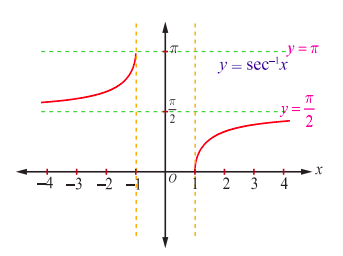
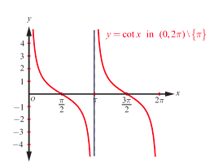
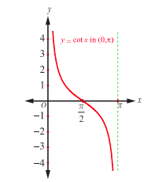
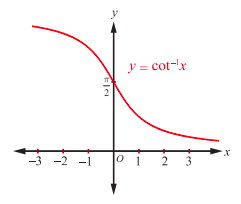

## 4.8 The Cotangent Function and the Inverse Cotangent Function

The cotangent function is given by $\cot x = \frac{1}{\tan x}$. It is defined for all real values of $x$, except when $\tan x = 0$ or $x = n\pi, n \in \mathbb{Z}$. Thus, the domain of cotangent function is $\mathbb{R} \setminus \{n\pi : n \in \mathbb{Z}\}$ and its range is $(-\infty, \infty)$. Like $\tan x$, the cotangent function is an odd function and periodic with period $\pi$.

#### 4.8.1 The graph of the cotangent function

The cotangent function is continuous on the set $(0,2\pi) \setminus \{\pi\}$. Let us first draw the graph of cotangent function in $(0,2\pi) \setminus \{\pi\}$. In the first and third quadrants, the cotangent function takes only positive values and in the second and fourth quadrants, it takes only negative values. The cotangent function has no maximum value and no minimum value. The cotangent function falls from $\infty$ to $0$ for $x \in \left(0, \frac{\pi}{2}\right)$; falls from $0$ to $-\infty$ for $x \in \left[\frac{\pi}{2}, \pi\right)$; falls from $\infty$ to $0$ for $x \in \left(\frac{\pi}{2}, \frac{3\pi}{2}\right]$ and falls from $0$ to $-\infty$ for $x \in \left[\frac{3\pi}{2}, 2\pi\right)$.

The graph of $y = \cot x$, $x \in (0,2\pi) \setminus \{\pi\}$ is shown in Fig 4.27. The same segment of the graph of cotangent for $(0,2\pi) \setminus \{\pi\}$ is repeated for $(2\pi, 4\pi) \setminus \{3\pi\}$, $(4\pi, 6\pi) \setminus \{5\pi\}$, $\dots$ and for $\dots$ $(-4\pi, -2\pi) \setminus \{-3\pi\}$, $(-2\pi, 0) \setminus \{-\pi\}$. The entire graph of cotangent function with domain $\mathbb{R} \setminus \{n\pi : n \in \mathbb{Z}\}$ is shown in Fig. 4.28.

#### 4.8.2 Inverse cotangent function

The cotangent function is not one-to-one in its entire domain $\mathbb{R} \setminus \{n\pi : n \in \mathbb{Z}\}$. However, $\cot: (0,\pi) \to (-\infty, \infty)$ is bijective with the restricted domain $(0,\pi)$. So, we can define the inverse cotangent function with $(-\infty, \infty)$ as its domain and $(0,\pi)$ as its range.

> **Definition 4.8**
>
> The inverse cotangent function $\cot^{-1}: (-\infty, \infty) \to (0,\pi)$ is defined by $\cot^{-1}(x) = y$ if and only if $\cot y = x$ and $y \in (0,\pi)$.

#### 4.8.3 Graph of the inverse cotangent function

The inverse cotangent function, $y = \cot^{-1}x$ is a function whose domain is $\mathbb{R}$ and the range is $(0,\pi)$. That is, $\cot^{-1}x: (-\infty, \infty) \to (0,\pi)$.

Fig. 4.29 and Fig. 4.30 show the cotangent function in the principal domain and the inverse cotangent function in the corresponding domain, respectively.

