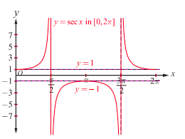
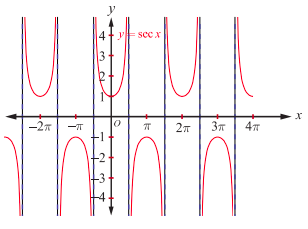
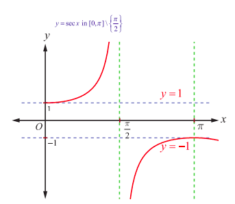

## 4.7 The Secant Function and Inverse Secant Function

The secant function is defined as the reciprocal of cosine function. So, $y = \sec x = \frac{1}{\cos x}$ is defined for all values of $x$ except when $\cos x = 0$. Thus, the domain of the function $y = \sec x$ is $\mathbb{R} \setminus \left\{(2n+1)\frac{\pi}{2} : n \in \mathbb{Z}\right\}$. As $-1 \leq \cos x \leq 1$, $y = \sec x$ does not take values in $(-1, 1)$. Thus, the range of the secant function is $(-\infty, -1] \cup [1, \infty)$. The secant function has neither maximum nor minimum. The function $y = \sec x$ is a periodic function with period $2\pi$ and it is also an even function.

#### 4.7.1 The graph of the secant function

The graph of secant function in $0 \leq x \leq 2\pi$, $x \neq \frac{\pi}{2}, \frac{3\pi}{2}$ is shown in Fig. 4.23. In the first and fourth quadrants or in the interval $-\frac{\pi}{2} < x < \frac{\pi}{2}$, $y = \sec x$ takes only positive values, whereas it takes only negative values in the second and third quadrants or in the interval $\frac{\pi}{2} < x < \frac{3\pi}{2}$.

For $0 \leq x \leq 2\pi$, $x \neq \frac{\pi}{2}, \frac{3\pi}{2}$, the secant function is continuous. The value of secant function raises from $1$ to $\infty$ for $x \in \left[0, \frac{\pi}{2}\right)$; it raises from $-\infty$ to $-1$ for $x \in \left(\frac{\pi}{2}, \pi\right]$. It falls from $-1$ to $-\infty$ for $x \in \left[\pi, \frac{3\pi}{2}\right)$ and falls from $\infty$ to $1$ for $x \in \left(\frac{3\pi}{2}, 2\pi\right]$.

As $y = \sec x$ is periodic with period $2\pi$, the same segment of the graph for $0 \leq x \leq 2\pi$, $x \neq \frac{\pi}{2}, \frac{3\pi}{2}$, is repeated in $[2\pi, 4\pi] \setminus \left\{\frac{5\pi}{2}, \frac{7\pi}{2}\right\}$, $[4\pi, 6\pi] \setminus \left\{\frac{9\pi}{2}, \frac{11\pi}{2}\right\}$, $\dots$ and in $\dots, [-4\pi, -2\pi] \setminus \left\{-\frac{7\pi}{2}, -\frac{5\pi}{2}\right\}$, $[-2\pi, 0] \setminus \left\{-\frac{3\pi}{2}, -\frac{\pi}{2}\right\}$.

Now, the entire graph of $y = \sec x$ is shown in Fig.4.24.

#### 4.7.2 Inverse secant function

The secant function, $\sec: [0,\pi] \setminus \left(\frac{\pi}{2}\right) \to \mathbb{R} \setminus (-1,1)$ is bijective in the restricted domain $[0,\pi] \setminus \left\{\frac{\pi}{2}\right\}$. So, the inverse secant function is defined with $\mathbb{R} \setminus (-1,1)$ as its domain and with $[0,\pi] \setminus \left\{\frac{\pi}{2}\right\}$ as its range.

**Definition 4.7**

The inverse secant function $\sec^{-1}: \mathbb{R} \setminus (-1,1) \to [0,\pi] \setminus \left\{\frac{\pi}{2}\right\}$ is defined by $\sec^{-1}(x) = y$ whenever $\sec y = x$ and $y \in [0,\pi] \setminus \left\{\frac{\pi}{2}\right\}$.

#### 4.7.3 Graph of the inverse secant function

The inverse secant function, $y = \sec^{-1}x$ is a function whose domain is $\mathbb{R} \setminus (-1,1)$ and the range is $[0,\pi] \setminus \left\{\frac{\pi}{2}\right\}$. That is, $\sec^{-1}: \mathbb{R} \setminus (-1,1) \to [0,\pi] \setminus \left\{\frac{\pi}{2}\right\}$.

Fig. 4.25 and Fig. 4.26 are the graphs of the secant function in the principal domain and the inverse secant function in the corresponding domain, respectively.

> **Remark**
>
> A nice way to draw the graph of $y = \sec x$ or $\csc x$:
>
> (i) Draw the graph of $y = \cos x$ or $\sin x$
>
> (ii) Draw the vertical asymptotes at the $x$-intercepts and take reciprocals of $y$ values.