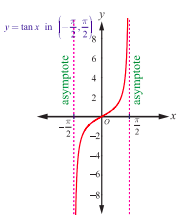
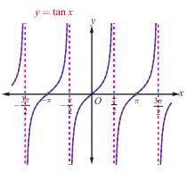
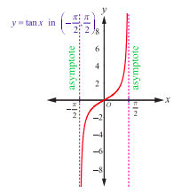
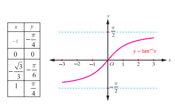

## 4.5 The Tangent Function and the Inverse Tangent Function

We know that the tangent function $y = \tan x$ is used to find heights or distances, such as the height of a building, mountain, or flagpole. The domain of $y = \tan x = \frac{\sin x}{\cos x}$ does not include values of $x$, which make the denominator zero. So, the tangent function is not defined at $x = \dots, -\frac{3\pi}{2}, -\frac{\pi}{2}, \frac{3\pi}{2}, \dots$. Thus, the domain of the tangent function $y = \tan x$ is $\left\{x: x \in \mathbb{R}, x \neq \frac{\pi}{2} + k\pi, k \in \mathbb{Z}\right\} = \bigcup_{k=-\infty}^{\infty} \left(\frac{2k+1}{2}\pi, \frac{2k+3}{2}\pi\right)$ and the range is $(-\infty, \infty)$. The tangent function $y = \tan x$ has period $\pi$.

#### 4.5.1 The graph of tangent function

Graph of the tangent function is useful to find the values of the function over the repeated period of intervals. The tangent function is odd and hence the graph of $y = \tan x$ is symmetric with respect to the origin. Since the period of tangent function is $\pi$, we need to determine the graph over some interval of length $\pi$. Let us consider the interval $\left(-\frac{\pi}{2}, \frac{\pi}{2}\right)$ and construct the following table to draw the graph of $y = \tan x$, $x \in \left(-\frac{\pi}{2}, \frac{\pi}{2}\right)$.

| $x$ (in radian) | $-\frac{\pi}{3}$ | $-\frac{\pi}{4}$ | $-\frac{\pi}{6}$ | $0$ | $\frac{\pi}{6}$ | $\frac{\pi}{4}$ | $\frac{\pi}{3}$ |
| :--- | :--- | :--- | :--- | :--- | :--- | :--- | :--- |
| $y = \tan x$ | $-\sqrt{3}$ | $-1$ | $-\frac{1}{\sqrt{3}}$ | $0$ | $\frac{1}{\sqrt{3}}$ | $1$ | $\sqrt{3}$ |

Now, plot the points and connect them with a smooth curve for a partial graph of $y = \tan x$, where $-\frac{\pi}{2} \leq x \leq \frac{\pi}{2}$. If $x$ is close to $\frac{\pi}{2}$ but remains less than $\frac{\pi}{2}$, the $\sin x$ will be close to $1$ and $\cos x$ will be positive and close to $0$. So, as $x$ approaches $\frac{\pi}{2}$, the ratio $\frac{\sin x}{\cos x}$ is positive and large and thus approaching $\infty$.

Therefore, the line $x = \frac{\pi}{2}$ is a vertical asymptote to the graph. Similarly, if $x$ is approaching $-\frac{\pi}{2}$, the ratio $\frac{\sin x}{\cos x}$ is negative and large in magnitude and thus, approaching $-\infty$. So, the line $x = -\frac{\pi}{2}$ is also a vertical asymptote to the graph. Hence, we get a branch of the graph of $y = \tan x$ for $-\frac{\pi}{2} < x < \frac{\pi}{2}$ as shown in the Fig 4.15. The interval $\left(-\frac{\pi}{2}, \frac{\pi}{2}\right)$ is called the principal domain of $y = \tan x$.

Since the tangent function is defined for all real numbers except at $x = (2n+1)\frac{\pi}{2}$, $n \in \mathbb{Z}$, and is increasing, we have vertical asymptotes $x = (2n+1)\frac{\pi}{2}$, $n \in \mathbb{Z}$. As branches of $y = \tan x$ are symmetric with respect to $x = n\pi$, $n \in \mathbb{Z}$, the entire graph of $y = \tan x$ is shown in Fig. 4.16.

> **Note**
>
> From the graph, it is seen that $y = \tan x$ is positive for $0 < x < \frac{\pi}{2}$ and $\pi < x < \frac{3\pi}{2}$; $y = \tan x$ is negative for $\frac{\pi}{2} < x < \pi$ and $\frac{3\pi}{2} < x < 2\pi$.

#### 4.5.2 Properties of the tangent function

From the graph of $y = \tan x$, we observe the following properties of tangent function.

(i) The graph is not continuous and has discontinuity points at $x = (2n+1)\frac{\pi}{2}$, $n \in \mathbb{Z}$.

(ii) The partial graph is symmetric about the origin for $-\frac{\pi}{2} < x < \frac{\pi}{2}$.

(iii) It has infinitely many vertical asymptotes $x = (2n+1)\frac{\pi}{2}$, $n \in \mathbb{Z}$.

(iv) The tangent function has neither maximum nor minimum.

> **Remark**
>
> (i) The graph of $y = a \tan bx$ goes through one complete cycle for
> $$-\frac{\pi}{2|b|} < x < \frac{\pi}{2|b|}$$
>
> (ii) For $y = a \tan bx$, the asymptotes are the lines $x = \frac{\pi}{2|b|} + \frac{\pi}{|b|}k$, $k \in \mathbb{Z}$.
>
> (iii) Since the tangent function has no maximum and no minimum value, the term amplitude for $\tan x$ cannot be defined.

#### 4.5.3 The inverse tangent function and its properties

The tangent function is not one-to-one in the entire domain $\mathbb{R} \setminus \left\{\frac{\pi}{2} + k\pi, k \in \mathbb{Z}\right\}$. However, $\tan x: \left(-\frac{\pi}{2}, \frac{\pi}{2}\right) \to \mathbb{R}$ is a bijective function. Now, we define the inverse tangent function with $\mathbb{R}$ as its domain and $\left(-\frac{\pi}{2}, \frac{\pi}{2}\right)$ as its range.

> **Definition 4.5**
>
> For any real number $x$, define $\tan^{-1}x$ as the unique number $y$ in $\left(-\frac{\pi}{2}, \frac{\pi}{2}\right)$ such that $\tan y = x$. In other words, the inverse tangent function $\tan^{-1}: (-\infty, \infty) \to \left(-\frac{\pi}{2}, \frac{\pi}{2}\right)$ is defined by $\tan^{-1}(x) = y$ if and only if $\tan y = x$ and $y \in \left(-\frac{\pi}{2}, \frac{\pi}{2}\right)$.

From the definition of $y = \tan^{-1}x$, we observe the following:

(i) $y = \tan^{-1}x$ if and only if $x = \tan y$ for $x \in \mathbb{R}$ and $-\frac{\pi}{2} < y < \frac{\pi}{2}$.

(ii) $\tan(\tan^{-1}x) = x$ for any real number $x$ and $y = \tan^{-1}x$ is an odd function.

(iii) $\tan^{-1}(\tan x) = x$ if and only if $-\frac{\pi}{2} < x < \frac{\pi}{2}$. Note that $\tan^{-1}(\tan \pi) = 0$ and not $\pi$.

> **Note**
>
> (i) Whenever we talk about inverse tangent function, we have,
> $$\tan : \left(-\frac{\pi}{2}, \frac{\pi}{2}\right) \to \mathbb{R} \quad \text{and} \quad \tan^{-1}: \mathbb{R} \to \left(-\frac{\pi}{2}, \frac{\pi}{2}\right).$$
>
> (ii) The restricted domain $\left(-\frac{\pi}{2}, \frac{\pi}{2}\right)$ is called the principal domain of tangent function and the values of $y = \tan^{-1}x$, $x \in \mathbb{R}$, are known as principal values of the function $y = \tan^{-1}x$.

#### 4.5.4 Graph of the inverse tangent function

$y = \tan^{-1}x$ is a function with the entire real line $(-\infty, \infty)$ as its domain and whose range is $\left(-\frac{\pi}{2}, \frac{\pi}{2}\right)$. Note that the tangent function is undefined at $-\frac{\pi}{2}$ and at $\frac{\pi}{2}$. So, the graph of $y = \tan^{-1}x$ lies strictly between the two lines $y = -\frac{\pi}{2}$ and $y = \frac{\pi}{2}$, and never touches these two lines. In other words, the two lines $y = -\frac{\pi}{2}$ and $y = \frac{\pi}{2}$ are horizontal asymptotes to $y = \tan^{-1}x$.

Fig. 4.17 and Fig. 4.18 show the graphs of $y = \tan x$ in the domain $\left(-\frac{\pi}{2}, \frac{\pi}{2}\right)$ and $y = \tan^{-1}x$ in the domain $(-\infty, \infty)$, respectively.

> **Note**
>
> (i) The inverse tangent function is strictly increasing and continuous on the domain $(-\infty, \infty)$.
>
> (ii) The graph of $y = \tan^{-1}x$ passes through the origin.
>
> (iii) The graph is symmetric with respect to origin and hence, $y = \tan^{-1}x$ is an odd function.

**Example 4.8**

Find the principal value of $\tan^{-1}(\sqrt{3})$.

**Solution**

Let $\tan^{-1}(\sqrt{3}) = y$. Then, $\tan y = \sqrt{3}$. Thus, $y = \frac{\pi}{3}$. Since $\frac{\pi}{3} \in \left(-\frac{\pi}{2}, \frac{\pi}{2}\right)$.

Thus, the principal value of $\tan^{-1}(\sqrt{3})$ is $\frac{\pi}{3}$.

**Example 4.9**

Find (i) $\tan^{-1}(-\sqrt{3})$ (ii) $\tan^{-1}\left(\tan \frac{3\pi}{5}\right)$ (iii) $\tan\left(\tan^{-1}(2019)\right)$

**Solution**

(i) $\tan^{-1}(-\sqrt{3}) = \tan^{-1}\left(\tan \left(-\frac{\pi}{3}\right)\right) = -\frac{\pi}{3}$, since $-\frac{\pi}{3} \in \left(-\frac{\pi}{2}, \frac{\pi}{2}\right)$.

(ii) $\tan^{-1}\left(\tan \frac{3\pi}{5}\right)$.

Let us find $\theta \in \left(-\frac{\pi}{2}, \frac{\pi}{2}\right)$ such that $\tan \theta = \tan \frac{3\pi}{5}$.

Since the tangent function has period $\pi$, $\tan \frac{3\pi}{5} = \tan \left(\frac{3\pi}{5} - \pi\right) = \tan \left(-\frac{2\pi}{5}\right)$.

Therefore, $\tan^{-1}\left(\tan \frac{3\pi}{5}\right) = \tan^{-1}\left(\tan \left(-\frac{2\pi}{5}\right)\right) = -\frac{2\pi}{5}$, since $-\frac{2\pi}{5} \in \left(-\frac{\pi}{2}, \frac{\pi}{2}\right)$.

(iii) Since $\tan(\tan^{-1}x) = x$, $x \in \mathbb{R}$, we have $\tan(\tan^{-1}(2019)) = 2019$.

**Example 4.10**

Find the value of $\tan^{-1}(-1) + \cos^{-1}\left(\frac{1}{2}\right) + \sin^{-1}\left(-\frac{1}{2}\right)$.

**Solution**

Let $\tan^{-1}(-1) = y$. Then, $\tan y = -1 = -\tan \frac{\pi}{4} = \tan \left(-\frac{\pi}{4}\right)$.

As $-\frac{\pi}{4} \in \left(-\frac{\pi}{2}, \frac{\pi}{2}\right)$, $\tan^{-1}(-1) = -\frac{\pi}{4}$.

$\cos^{-1}\left(\frac{1}{2}\right) = y$ implies $\cos y = \frac{1}{2} = \cos \frac{\pi}{3}$.

As $\frac{\pi}{3} \in [0, \pi]$, $\cos^{-1}\left(\frac{1}{2}\right) = \frac{\pi}{3}$.

Now, $\sin^{-1}\left(-\frac{1}{2}\right) = y$ implies $\sin y = -\frac{1}{2} = \sin \left(-\frac{\pi}{6}\right)$.

As $-\frac{\pi}{6} \in \left[-\frac{\pi}{2}, \frac{\pi}{2}\right]$, $\sin^{-1}\left(-\frac{1}{2}\right) = -\frac{\pi}{6}$.

Therefore, $\tan^{-1}(-1) + \cos^{-1}\left(\frac{1}{2}\right) + \sin^{-1}\left(-\frac{1}{2}\right) = -\frac{\pi}{4} + \frac{\pi}{3} - \frac{\pi}{6} = -\frac{\pi}{12}$.

**Example 4.11**

Prove that $\tan(\sin^{-1}x) = \frac{x}{\sqrt{1-x^2}}, -1 < x < 1$.

**Solution**

If $x = 0$, then both sides are equal to $0$.

Assume that $0 < x < 1$.

Let $\theta = \sin^{-1}x$. Then $0 < \theta < \frac{\pi}{2}$. Now, $\sin \theta = \frac{x}{1}$ gives $\tan \theta = \frac{x}{\sqrt{1-x^2}}$.

Hence, $\tan(\sin^{-1}x) = \frac{x}{\sqrt{1-x^2}}$. (1)

Assume that $-1 < x < 0$. Then, $\theta = \sin^{-1}x$ gives $-\frac{\pi}{2} < \theta < 0$. Now, $\sin \theta = \frac{x}{1}$ gives $\tan \theta = \frac{x}{\sqrt{1-x^2}}$.

In this case also, $\tan(\sin^{-1}x) = \frac{x}{\sqrt{1-x^2}}$. (2)

Equations (1), (2) and the case $x=0$ establish that $\tan(\sin^{-1}x) = \frac{x}{\sqrt{1-x^2}}, -1 < x < 1$.

**EXERCISE 4.3**

1. Find the domain of the following functions:
   (i) $\tan^{-1}\left(\sqrt{9-x^2}\right)$
   (ii) $\frac{1}{2}\tan^{-1}(1-x^2) - \frac{\pi}{4}$.

2. Find the value of
   (i) $\tan^{-1}\left(\tan \frac{5\pi}{4}\right)$
   (ii) $\tan^{-1}\left(\tan \left(-\frac{\pi}{6}\right)\right)$.

3. Find the value of
   (i) $\tan\left(\tan^{-1}\left(\frac{7\pi}{4}\right)\right)$
   (ii) $\tan\left(\tan^{-1}(1947)\right)$
   (iii) $\tan\left(\tan^{-1}(-0.2021)\right)$.

4. Find the value of
   (i) $\tan\left(\cos^{-1}\left(\frac{1}{2}\right) - \sin^{-1}\left(-\frac{1}{2}\right)\right)$
   (ii) $\sin\left(\tan^{-1}\left(\frac{1}{2}\right) - \cos^{-1}\left(\frac{4}{5}\right)\right)$.

5. Find the value of $\cos\left(\sin^{-1}\left(\frac{4}{5}\right) - \tan^{-1}\left(\frac{3}{4}\right)\right)$.
