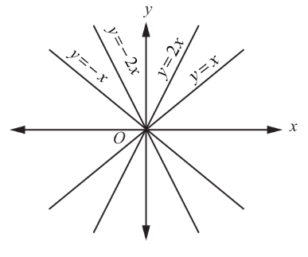

## 10.4 Formation of Differential Equations

### 10.4.1 Formation of Differential Equations from Physical Situations

Now, we provide some models to describe how the differential equations arise as models of real life problems.

**Model 1: (Newton's Law)**

According to Newton's second law of motion, the instantaneous acceleration $a$ of an object with constant mass $m$ is related to the force $F$ acting on the object by the equation $F = ma$. In the case of a free fall, an object is released from a height $h(t)$ above the ground level.

Then, the Newton's second law is described by the differential equation $m\frac{d^2h}{dt^2} = f\left(t, h(t), \frac{dh}{dt}\right)$, where $m$ is the mass of the object, $h$ is the height above the ground level. This is the second order differential equation of the unknown height as a function of time.

**Model 2: (Population Growth Model)**

The population will increase whenever the offspring increase. For instance, let us take rabbits as our population. More number of rabbits yield more number of baby rabbits. As time increases the population of rabbits increases. If the rate of growth of biomass $N(t)$ of the population at time $t$ is proportional to the biomass of the population, then the differential equation governing the population is given by $\frac{dN}{dt} = rN$, where $r > 0$ is the growth rate.

**Model 3: (Logistic Growth Model)**

The rate at which a disease is spread (i.e., the rate of increase of the number $N$ of people infected) in a fixed population $L$ is proportional to the product of the number of people infected and the number of people not yet infected:

$$
\frac{dN}{dL} = kN(L - N), \quad k > 0.
$$

**EXERCISE 10.2**

1. Express each of the following physical statements in the form of differential equation.

(i) Radium decays at a rate proportional to the amount $Q$ present.  
(ii) The population $P$ of a city increases at a rate proportional to the product of population and to the difference between 5,00,000 and the population.  
(iii) For a certain substance, the rate of change of vapor pressure $P$ with respect to temperature $T$ is proportional to the vapor pressure and inversely proportional to the square of the temperature.  
(iv) A saving amount pays $8\%$ interest per year, compounded continuously. In addition, the income from another investment is credited to the amount continuously at the rate of $Â¥400$ per year.

2. Assume that a spherical rain drop evaporates at a rate proportional to its surface area. Form a differential equation involving the rate of change of the radius of the rain drop.

### 10.4.2 Formation of Differential Equations from Geometrical Problems

Given a family of functions parameterized by some constants, a differential equation can be formed by eliminating those constants of this family. For instance, the elimination of constants $A$ and $B$ from $y = Ae^{x} + Be^{-x}$, yields a differential equation $\frac{d^{2}y}{dx^{2}} - y = 0$.

Consider an equation of a family of curves, which contains $n$ arbitrary constants. To form a differential equation not containing any of these constants, let us proceed as follows:

Differentiate the given equation successively $n$ times, getting $n$ differential equations. Then eliminate $n$ arbitrary constants from $(n + 1)$ equations made up of the given equation and $n$ newly obtained equations arising from $n$ successive differentiations. The result of elimination gives the required differential equation which must contain a derivative of the $n$th order.

**Example 10.2**

Find the differential equation for the family of all straight lines passing through the origin.

**Solution**

The family of straight lines passing through the origin is $y = mx$, where $m$ is an arbitrary constant. ... (1)

Differentiating both sides with respect to $x$, we get

$$
\frac{dy}{dx} = m. \quad (2)
$$

From (1) and (2), we get $y = x\frac{dy}{dx}$. This is the required differential equation.

Observe that the given equation $y = mx$ contains only one arbitrary constant and thus we get the differential equation of order one.

**Example 10.3**

Form the differential equation by eliminating the arbitrary constants A and B from $y = A\cos x + B\sin x$.

**Solution**

Given that $y = A\cos x + B\sin x$ ... (1)

Differentiating (1) twice successively, we get

$$
\frac{dy}{dx} = -A\sin x + B\cos x. \quad (2)
$$

$$
\frac{d^{2}y}{dx^{2}} = -A\cos x - B\sin x = -(A\cos x + B\sin x). \quad (3)
$$

Substituting (1) in (3), we get $\frac{d^{2}y}{dx^{2}} + y = 0$ as the required differential equation.

**Example 10.4**

Find the differential equation of the family of circles passing through the points $(a,0)$ and $(-a,0)$.

**Solution**

A circle passing through the points $(a,0)$ and $(-a,0)$ has its centre on $y$-axis.

Let $(0,b)$ be the centre of the circle. So, the radius of the circle is $\sqrt{a^{2} + b^{2}}$.

Therefore the equation of the family of circles passing through the points $(a,0)$ and $(-a,0)$ is $x^{2} + (y - b)^{2} = a^{2} + b^{2}$, $b$ is an arbitrary constant.

Differentiating both sides of (1) with respect to $x$, we get

$$
2x + 2(y - b)\frac{dy}{dx} = 0 \Rightarrow y - b = -\frac{x}{\frac{dy}{dx}} \Rightarrow b = \frac{x}{\frac{dy}{dx}} + y.
$$

Substituting the value of $b$ in equation (1), we get

$$
x^{2} + \frac{x^{2}}{\left(\frac{dy}{dx}\right)^{2}} = a^{2} + \left(\frac{x}{\frac{dy}{dx}} + y\right)^{2}
$$

$$
\Rightarrow x^{2}\left(\frac{dy}{dx}\right)^{2} + x^{2} = a^{2}\left(\frac{dy}{dx}\right)^{2} + \left[x + y\left(\frac{dy}{dx}\right)\right]^{2}
$$

$$
\Rightarrow \left(x^{2} - y^{2} - a^{2}\right)\frac{dy}{dx} - 2xy = 0, \text{ which is the required differential equation.}
$$

**Example 10.5**

Find the differential equation of the family of parabolas $y^{2} = 4ax$, where $a$ is an arbitrary constant.

**Solution**

The equation of the family of parabolas is given by $y^{2} = 4ax$, $a$ is an arbitrary constant. ... (1)

Differentiating both sides of (1) with respect to $x$, we get $2y\frac{dy}{dx} = 4a \Rightarrow a = \frac{y}{2}\frac{dy}{dx}$.

Substituting the value of $a$ in (1) and simplifying, we get $\frac{dy}{dx} = \frac{y}{2x}$ as the required differential equation.

**Example 10.6**

Find the differential equation of the family of all ellipses having foci on the $x$-axis and centre at the origin.

**Solution**

The equation of the family of all ellipses having foci on the $x$-axis and centre at the origin is given by $\frac{x^{2}}{a^{2}} + \frac{y^{2}}{b^{2}} = 1$, $a > b$ ... (1)

where $a$ and $b$ are arbitrary constants.

Differentiating equation (1) with respect to $x$ , we get

$\frac{2x}{a^2} + \frac{2y}{b^2} \frac{dy}{dx} = 0 \implies \frac{x}{a^2} + \frac{y}{b^2} \frac{dy}{dx} = 0$ $\dots$ (2)

Differentiating equation (2) with respect to $x$ , we get

$\frac{1}{a^2} + \frac{1}{b^2} \left[ y \frac{d^2 y}{dx^2} + \left( \frac{dy}{dx} \right)^2 \right] = 0 \implies \frac{1}{a^2} = -\frac{1}{b^2} \left[ y \frac{d^2 y}{dx^2} + \left( \frac{dy}{dx} \right)^2 \right]$

Substituting the value of $\frac{1}{a^2}$ in equation (2) and simplifying, we get

$-\frac{1}{b^2} \left[ y \frac{d^2 y}{dx^2} + \left( \frac{dy}{dx} \right)^2 \right] x + \frac{y}{b^2} \frac{dy}{dx} = 0$

$\implies xy \frac{d^2 y}{dx^2} + x \left( \frac{dy}{dx} \right)^2 - y \frac{dy}{dx} = 0$

which is the required differential equation.

> **Remark**
>
> The result of eliminating one arbitrary constant yields a first order differential equation and that of eliminating two arbitrary constants leads to a second order differential equation and so on.

**EXERCISE 10.3**

1. Find the differential equation of the family of (i) all non-vertical lines in a plane (ii) all non-horizontal lines in a plane.

2. Form the differential equation of all straight lines touching the circle $x^2 + y^2 = r^2$ .

3. Find the differential equation of the family of circles passing through the origin and having their centres on the $x$ -axis.

4. Find the differential equation of the family of all the parabolas with latus rectum $4a$ and whose axes are parallel to the $x$ -axis.

5. Find the differential equation of the family of parabolas with vertex at $(0, -1)$ and having axis along the $y$ -axis.

6. Find the differential equations of the family of all the ellipses having foci on the $y$ -axis and centre at the origin.

7. Find the differential equation corresponding to the family of curves represented by the equation $y = Ae^{8x} + Be^{-8x}$ , where $A$ and $B$ are arbitrary constants.

8. Find the differential equation of the curve represented by $xy = ae^x + be^{-x} + x^2$ .
