# Chapter 11: Probability Distributions

*Probability theory is nothing but common sense reduced to calculation - Laplace*

The history of random variables and how they evolved into mapping from sample space to real numbers was a subject of interest. The modern interpretation certainly occurred after the invention of sets and maps (1900), but as Eremenko says, random variables were used much earlier. Mathematicians felt the need to interpret random variables as maps. In 1812, Laplace published his book on *Théorie analytique des probabilités* in which he laid down many fundamental results in statistics. The first half of this treatise was concerned with probability methods and problems and the second half with statistical applications.

## Learning Objectives

Upon completion of this chapter, students will be able to

- define a random variable, discrete and continuous random variables
- define probability mass (density) function
- determine probability mass (density) function from cumulative distribution function
- obtain cumulative distribution function from probability mass (density) function
- calculate mean and variance for random variable
- identify and apply Bernoulli and binomial distributions.

## 11.1 Introduction

The concept of a sample space that completely describes the possible outcomes of a random experiment has been developed in volume 2 of I year higher secondary course.

In this chapter, we learn about a function, called random variable defined on the sample space of a random experiment and its probability distribution.

### 11.2 Random Variable

The outcome from a random experiment is not always a simple thing to represent in notion. In many random experiments that we have considered, the sample space $S$ has been a description of possible outcomes. That is the outcome of an experiment, or the points in the sample space $S$ , need not be numbers. For example in the random experiment of tossing a coin, the outcomes are $H$ (head) or $T$ (tail). It is necessary to deal with numerical values, in some situation, for outcomes of random experiment. Therefore, we assign a number to each outcome of the experiment say 1 to head and 0 to tail. Such an assignment of numerical values to the elements in $S$ is called a random variable. A random variable is a function. Thus, a random variable is:

> **Definition 11.1**
>
> A random variable $X$ is a function defined on a sample space $S$ into the real numbers $\mathbb{R}$ such that the inverse image of points or subset or interval of $\mathbb{R}$ is an event in $S$ , for which probability is assigned.

We use the capital letters of the alphabet, such as $X$ , $Y$ , and $Z$ to represent the random variables and the small letters, such as $x$ , $y$ , and $z$ to represent the possible values of the random variables.

Suppose $S = \{ \omega_1, \omega_2, \omega_3, \dots \}$ is the sample space of a random experiment and $\mathbb{R}$ denotes the real line. Then the random variable $X$ is a real valued function defined on $S$ and is denoted by $X : S \to \mathbb{R}$ . If $\omega$ is a sample point in $S$ , then $X(\omega)$ is a real number.

The range set is the collection of $X(\omega)$ such that $\omega \in S$ .

That is the range set denoted by $R_X = \{ X(\omega) \mid \omega \in S \}$ .

Fig 11.1 shows the mapping of some sample points $\omega_i$ or events of the *Sample space* $S$ on the *real line* $\mathbb{R}$ .

For instance, if $x$ is a possible value of $X$ for $\omega_{11}, \omega_{12}, \omega_{13}, \dots, \omega_{1k} \in S$ then $\{ \omega_{11}, \omega_{12}, \omega_{13}, \dots, \omega_{1k} \}$ is called inverse image of $x$ .

That is $X^{-1}(x) = \{ \omega_{11}, \omega_{12}, \omega_{13}, \dots, \omega_{1k} \}$ is an event in $S$ .

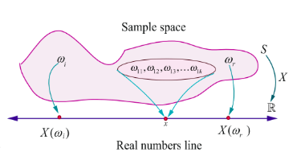

**Illustration 11.1**

Suppose a coin is tossed once. The sample space consists of two sample points $H$ (head) and $T$ (tail).

That is $S = \{ T, H \}$

Let $X : S \to \mathbb{R}$ be the number of heads

Then $X(T) = 0$ , and $X(H) = 1$ .

Thus $X$ is a random variable that takes on the values 0 and 1. If $X(\omega)$ denotes the number of heads, then

$X(\omega) = \begin{cases} 0 & \text{for } \omega = \text{Tail} \\ 1 & \text{for } \omega = \text{Head} \end{cases}$

**Example 11.1**

Suppose two coins are tossed once. If $X$ denotes the number of tails, (i) write down the sample space (ii) find the inverse image of 1 (iii) the values of the random variable and number of elements in its inverse images.

**Solution**

(i) The sample space $S = \{H, T\} \times \{H, T\}$

That is $S = \{TT, TH, HT, HH\}$

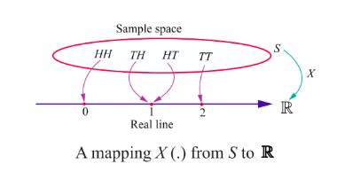

(ii) Let $X : S \to \mathbb{R}$ be the number of tails  
Then $X(TT) = 2$ (2 Tails)  
$X(TH) = 1$ (1 Tail)  
$X(HT) = 1$ (1 Tail)  
and $X(HH) = 0$ (0 Tails).

Then $X$ is a random variable that takes on the values 0, 1 and 2.  
Let $X(\omega)$ denote the number of tails, this gives

$X(\omega) = \begin{cases} 2 & \text{if } \omega = TT \\ 1 & \text{if } \omega = HT, TH \\ 0 & \text{if } \omega = HH \end{cases}$

The inverse images of 1 is $\{TH, HT\}$ . That is $X^{-1}(\{1\}) = \{TH, HT\}$ .

(iii) Number of elements in inverse images are shown in the table.

| Values of the Random Variable | 0 | 1 | 2 | Total |
| :--- | :--- | :--- | :--- | :--- |
| Number of elements in inverse image | 1 | 2 | 1 | 4 |

**Example 11.2**

Suppose a pair of unbiased dice is rolled once. If $X$ denotes the total score of two dice, write down  
(i) the sample space (ii) the values taken by the random variable $X$ , (iii) the inverse image of 10, and  
(iv) the number of elements in inverse image of $X$ .

**Solution**

(i) The sample space  
$S = \{1, 2, 3, 4, 5, 6\} \times \{1, 2, 3, 4, 5, 6\}$ ,  
consists of 36 ordered pairs $(\alpha, \beta)$ where $\alpha$ and $\beta$ can take any integer value between 1 and 6 as shown. $X$ is assigned to each point $(\alpha, \beta)$ the sum of the numbers on the dice.  
That is $X(\alpha, \beta) = \alpha + \beta$ .  

$S = \{(1,1), (1,2), (1,3), (1,4), (1,5), (1,6),$  
$\quad (2,1), (2,2), (2,3), (2,4), (2,5), (2,6),$  
$\quad (3,1), (3,2), (3,3), (3,4), (3,5), (3,6),$  
$\quad (4,1), (4,2), (4,3), (4,4), (4,5), (4,6),$  
$\quad (5,1), (5,2), (5,3), (5,4), (5,5), (5,6),$  
$\quad (6,1), (6,2), (6,3), (6,4), (6,5), (6,6)\}$

Therefore

$X(1,1) = 1 + 1 = 2$  
$X(1,2) = X(2,1) = 3$  
$X(1,3) = X(2,2) = X(3,1) = 4$  
$X(1,4) = X(2,3) = X(3,2) = X(4,1) = 5$  
$X(1,5) = X(2,4) = X(3,3) = X(4,2) = X(5,1) = 6$  
$X(1,6) = X(2,5) = X(3,4) = X(4,3) = X(5,2) = X(6,1) = 7$  
$X(2,6) = X(3,5) = X(4,4) = X(5,3) = X(6,2) = 8$  
$X(3,6) = X(4,5) = X(5,4) = X(6,3) = 9$  
$X(4,6) = X(5,5) = X(6,4) = 10$  
$X(5,6) = X(6,5) = 11$  
$X(6,6) = 12$ .

(ii) Then the random variable $X$ takes on the values 2, 3, 4, 5, 6, 7, 8, 9, 10, 11, 12.  
(iii) The inverse images of 10 is $\{ (4,6), (5,5), (6,4) \}$ .  
(iv) The number of inverse images are given below:

| Values of the random variable | 2 | 3 | 4 | 5 | 6 | 7 | 8 | 9 | 10 | 11 | 12 | Total |
| :--- | :--- | :--- | :--- | :--- | :--- | :--- | :--- | :--- | :--- | :--- | :--- | :--- |
| Number of elements in inverse image | 1 | 2 | 3 | 4 | 5 | 6 | 5 | 4 | 3 | 2 | 1 | 36 |

**Example 11.3**

An urn contains 2 white balls and 3 red balls. A sample of 3 balls are chosen at random from the urn. If $X$ denotes the number of red balls chosen, find the values taken by the random variable $X$ and its number of inverse images.

**Solution**

Let us denote white and red balls as $w_1, w_2, r_1, r_2,$ and $r_3$ .

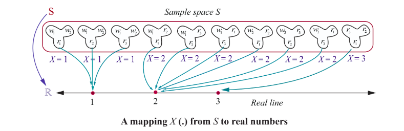

The sample space consists of ${}^5C_3 = 10$ different samples of size 3.

That is $S = \{ w_1w_2r_1, w_1w_2r_2, w_1w_2r_3, w_1r_1r_2, w_1r_1r_3, w_2r_1r_2, w_2r_1r_3, w_2r_2r_3, w_2r_3r_3 ,r_1r_2r_3\}$ .

The random variable $X$ takes on the values 1, 2, and 3.

| Values of the Random Variable $X$ | 1 | 2 | 3 | Total |
| :--- | :--- | :--- | :--- | :--- |
| Number of elements in inverse images | 3 | 6 | 1 | 10 |

> **Remark**
>
> If $X$ denotes the number of white balls, then $X$ takes on the values 0, 1, and 2 and the elements in inverse images are

| Values of the Random Variable $X$ | 0 | 1 | 2 | Total |
| :--- | :--- | :--- | :--- | :--- |
| Number of elements in inverse images | 1 | 6 | 3 | 10 |

**Illustration 11.2**

A batch of 150 students is taken in 4 buses to an excursion. There are 38 students in the first bus, 36 in second bus, 32 in the third bus, and the remaining students in the fourth bus. When the buses arrive at the destination, one of the 150 students is randomly chosen.

Suppose that $X$ denotes the number of students on the bus of that randomly chosen student. Then $X$ takes on the values 32, 36, 38, and 44.

**Example 11.4**

Two balls are chosen randomly from an urn containing 6 white and 4 black balls. Suppose that we win ₹ 30 for each black ball selected and we lose ₹ 20 for each white ball selected. If $X$ denotes the winning amount, find the values of $X$ and number of points in its inverse images.

**Solution**

The possible events of selection are (i) both balls may be black, or (ii) one white and one black or (iii) both are white. Therefore $X$ is a random variable that take the values,

$X$ (both are black balls) $= 2(30) = 60$

$X$ (one black and one white ball) $= 30 - 20 = 10$

$X$ (both are white balls) $= 2(-20) = -40$

Therefore $X$ takes on the values 60, 10, and -40.

> **Note**
>
> The inverse image of 60 is $\{b_1b_2, b_1b_3, b_1b_4, b_2b_3, b_2b_4, b_3b_4\}$ .

| Values of the Random Variable $X$ | 60 | 10 | -40 | Total |
| :--- | :--- | :--- | :--- | :--- |
| Number of elements in inverse images | 6 | 24 | 15 | 45 |

**Illustration 11.3**

A coin is tossed until head occurs.

The sample space is $S = \{H, TH, TTH, TTTH, \dots \}$ .

Suppose $X$ denotes the number of times the coin is tossed until head occurs.

Then the random variable $X$ takes on the values 1, 2, 3, $\dots$

**Illustration 11.4**

Suppose $N$ is the number of customers in the queue that arrive at a service desk during a time period, then the sample space should be the set of non-negative integers. That is $S = \{0, 1, 2, 3, \dots \}$ and $N$ is a random variable that takes on the values 0, 1, 2, 3, $\dots$

**Illustration 11.5**

If an experiment consists in observing the lifetime of an electrical bulb, then a sample space would be the life time of electrical bulb. Therefore the sample space is $S = [0, \infty)$ . Suppose $X$ denotes the lifetime of the bulb, then $X$ is a random variable that takes on the values in $[0, \infty)$ .

**Illustration 11.6**

Let $D$ be a disk of radius $r$ . Suppose a point is chosen at random in $D$ . Let $X$ denote the distance of the point from the centre. Then the sample space $S = D$ and $X$ is the random variable that takes on any number from 0 to $r$ . That is $X(\omega) \in [0, r]$ , for $\omega \in S$ .

**Exercise 11.1**

1. Suppose $X$ is the number of tails occurred when three fair coins are tossed once simultaneously. Find the values of the random variable $X$ and number of points in its inverse images.

2. An urn contains 5 mangoes and 4 apples. Three fruits are taken at random. If the number of apples taken is a random variable, then find the values of the random variable and number of points in its inverse images.

3. Two balls are chosen randomly from an urn containing 6 red and 8 black balls. Suppose that we win ₹15 for each red ball selected and we lose ₹10 for each black ball selected. If $X$ denotes the winning amount, find the values of $X$ and number of points in its inverse images.

4. A six sided die is marked '2' on one face, '3' on two of its faces, and '4' on remaining three faces. The die is thrown twice. If $X$ denotes the total score in two throws, find the values of the random variable and number of points in its inverse images.

## 11.3 Types of Random Variable

In this chapter we shall restrict our study to two types of random variables, one is a random variable assuming at most a countable number of values and another is a random variable assuming the values continuously. That is

(i) Discrete Random variable (for counting the quantity)
(ii) Continuous Random variable (for measuring the quantity)

### 11.3.1 Discrete random variables

In this section we discuss

(i) Discrete random variables
(ii) Probability mass function
(iii) Cumulative distribution function.
(iv) Obtaining cumulative distribution function from probability mass function.
(v) Obtaining probability mass function from cumulative distribution function.

If the range set of the random variables is discrete set of numbers then the inverse image of random variable is either finite or countably infinite. Such a random variable is called discrete random variable. A random variable defined on a discrete sample space is discrete.

> **Definition 11.2 (Discrete Random Variable)**
>
> A random variable $X$ is defined on a sample space $S$ into the real numbers $\mathbb{R}$ is called discrete random variable if the range of $X$ is countable, that is, it can assume only a finite or countably infinite number of values, where every value in the set $S$ has positive probability with total one.

> **Remark**
>
> It is also possible to define a discrete random variable on continuous sample space. For instance,
>
> (i) for a continuous sample space $S = [0,1]$, the random variable defined by $X(\omega) = 10$ for all $\omega \in S$ is a discrete random variable.
>
> (ii) for a continuous sample space $S = [0,20]$, the random variable defined by
>
> $$
> X(\omega) = \begin{cases} 1 & \text{if } 0 \le \omega \le 5 \\ 2 & \text{if } 5 < \omega \le 10 \\ 3 & \text{if } 10 < \omega \le 20 \end{cases}
> $$
>
> is also a discrete random variable.

### 11.3.2 Probability Mass Function

The probability that a discrete random variable $X$ takes on a particular value $x$, that is $P(X = x)$, is frequently denoted by $f(x)$ or $p(x)$. The function $f(x)$ is typically called the probability mass function, although some authors also refer to it as the probability function or the frequency function. In this chapter, when the random variable is discrete, the common terminology the probability mass function is used and its common abbreviation is pmf.

> **Definition 11.3 (Probability mass function)**
>
> If $X$ is a discrete random variable with discrete values $x_1, x_2, x_3, \ldots, x_n, \ldots$, then the function denoted by $f(\cdot)$ or $p(\cdot)$ and defined by
>
> $ f(x_k) = P(X = x_k), \qquad \text{for } k = 1,2,3,\ldots n,\ldots $
>
> is called the probability mass function of $X$.

> **Theorem 11.1 (Without proof)**
>
> The function $f(x)$ is a probability mass function if and only if it satisfies the following properties for the set of real values $x_1, x_2, x_3, \ldots x_n, \ldots$
>
> (i) $f(x_k) \geq 0$ for $k = 1,2,3,\ldots n,\ldots$ and
> (ii) $\sum_{k} f(x_k) = 1$

> **Note:**
>
> (i) The set of probabilities $\{f(x_k) = P(X = x_k), \quad k = 1,2,3,\ldots n,\ldots\}$ is also known as probability distribution of discrete random variable.
>
> (ii) Since the random variable is a function, it can be presented
>
> (a) in tabular form
> (b) in graphical form and
> (c) in an expression form

**Example 11.5**

Two fair coins are tossed simultaneously (equivalent to a fair coin is tossed twice). Find the probability mass function for number of heads occurred.

**Solution**

The sample space $S = \{H,T\} \times \{H,T\}$
That is $S = \{TT, TH, HT, HH\}$.

Let $X$ be the random variable denoting the number of heads.

Therefore

$$
X(TT) = 0, \quad X(TH) = 1, \quad X(HT) = 1, \quad \text{and} \quad X(HH) = 2.
$$

Then the random variable $X$ takes on the values 0, 1 and 2.

| Values of the Random Variable | 0 | 1 | 2 | Total |
| :--- | :---: | :---: | :---: | :---: |
| Number of elements in inverse images | 1 | 2 | 1 | 4 |

The probabilities are given by

$$
f(0) = P(X = 0) = \frac{1}{4},
$$

$$
f(1) = P(X = 1) = \frac{1}{2}
$$

and

$$
f(2) = P(X = 2) = \frac{1}{4}.
$$

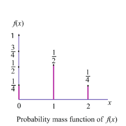

The function $f(x)$ satisfies the conditions

$$
f(x) \geq 0, \text{ for } x = 0,1,2
$$

$$
\sum_{x} f(x) = \sum_{x=0}^{2} f(x) = f(0) + f(1) + f(2) = \frac{1}{4} + \frac{1}{2} + \frac{1}{4} = 1
$$

Therefore $f(x)$ is a probability mass function.

The probability mass function is given by

| $x$ | 0 | 1 | 2 |
| :--- | :---: | :---: | :---: |
| $f(x)$ | $1/4$ | $1/2$ | $1/4$ |

(or)

$f(x) = \begin{cases} \frac{1}{4} & \text{for } x = 0 \\ \frac{1}{2} & \text{for } x = 1 \\ \frac{1}{4} & \text{for } x = 2 \end{cases}$

**Example 11.6**

A pair of fair dice is rolled once. Find the probability mass function to get the number of fours.

**Solution**

Let $X$ be a random variable whose values $x$ are the number of fours.
The sample space $S$ is given in the table.

It can also be written as

$$
S = \left\{ \begin{array}{ll} (1,1), (1,2), (1,3), (1,4), (1,5), (1,6) \\ (2,1), (2,2), (2,3), (2,4), (2,5), (2,6) \\ (3,1), (3,2), (3,3), (3,4), (3,5), (3,6) \\ (4,1), (4,2), (4,3), (4,4), (4,5), (4,6) \\ (5,1), (5,2), (5,3), (5,4), (5,5), (5,6) \\ (6,1), (6,2), (6,3), (6,4), (6,5), (6,6) \end{array} \right\}
$$

$S = \{(i,j)\}$, where $i = 1,2,3,\ldots,6$ and $j = 1,2,3,\ldots,6$.

Therefore $X$ takes on the values of 0, 1, and 2.

We observe that

(i) $X = 0$, if $(i,j)$ for $i \neq 4, j \neq 4$

(ii) $X = 1$, if $(1,4),(2,4),(3,4),(5,4),(6,4),(4,1),(4,2),(4,3),(4,5),(4,6)$

(iii) $X = 2$, if $(4,4)$

Therefore,

| Values of the Random Variable $X$ | 0 | 1 | 2 | Total |
| :--- | :---: | :---: | :---: | :---: |
| Number of elements in inverse images | 25 | 10 | 1 | 36 |

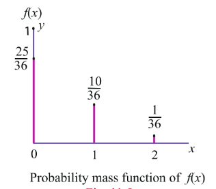

The probabilities are

$$
f(0) = P(X = 0) = \frac{25}{36},
$$

$$
f(1) = P(X = 1) = \frac{10}{36}
$$

and

$$
f(2) = P(X = 2) = \frac{1}{36}.
$$

Clearly the function $f(x)$ satisfies the conditions

(i) $f(x) \geq 0$, for $x = 0,1,2$ and

(ii) $\sum_{x} f(x) = \sum_{x=0}^{2} f(x) = f(0) + f(1) + f(2) = \frac{25}{36} + \frac{10}{36} + \frac{1}{36} = 1$.

The probability mass function is presented as

| $x$ | 0 | 1 | 2 |
| :--- | :---: | :---: | :---: |
| $f(x)$ | $25/36$ | $10/36$ | $1/36$ |

$$
f(x) = \begin{cases} \frac{25}{36} & \text{for } x = 0 \\ \frac{10}{36} & \text{for } x = 1 \\ \frac{1}{36} & \text{for } x = 2 \end{cases}
$$

#### 11.3.3 Cumulative Distribution Function or Distribution Function

There are many situations to compute the probability that the observed value of a random variable $X$ will be less than or equal to some real number $x$. Writing $F(x) = P(X \leq x)$ for every real number $x$, we call $F(x)$ the cumulative distribution function or distribution function of the random variable $X$ and its common abbreviation is cdf.

> **Definition 11.4 (Cumulative distribution function)**
>
> The cumulative distribution function $F(x)$ of a discrete random variable $X$, taking the values $x_1, x_2, x_3, \ldots$ such that $x_1 < x_2 < x_3 < \dots$ with probability mass function $f(x_i)$ is
>
> $ F(x) = P(X \leq x) = \sum_{x_i \leq x} f(x_i), \qquad x \in \mathbb{R} $

The distribution function of a discrete random variable is known as Discrete Distribution Function. Although, the probability mass function $f(x)$ is defined only for a set of discrete values $x_1, x_2, x_3, \ldots$ the cumulative distribution function $F(x)$ is defined for all real values of $x \in \mathbb{R}$.

We can compute the cumulative distribution function using the probability mass function

$$
F(x) = P(X \leq x) = \sum_{x_i \leq x} f(x_i) = \sum_{x_i \leq x} P(X = x_i)
$$

If $X$ takes only a finite number of values $x_1, x_2, x_3, \ldots, x_n$, where $x_1 < x_2 < x_3 < \ldots < x_n$, then the cumulative distribution function is given by

$$
F(x) = \begin{cases}
0 & \text{for } -\infty < x < x_1 \\
f(x_1) & \text{for } x_1 \le x < x_2 \\
f(x_1) + f(x_2) & \text{for } x_2 \le x < x_3 \\
\vdots & \vdots \\
f(x_1) + f(x_2) + \cdots + f(x_n) & \text{for } x_n \le x < \infty
\end{cases}
$$

For a discrete random variable $X$, the cumulative distribution function satisfies the following properties.

(i) $0 \leq F(x) \leq 1$, for all $x \in \mathbb{R}$.

(ii) $F(x)$ is real valued non-decreasing function (if $x < y$, then $F(x) \leq F(y)$).

(iii) $F(x)$ is right continuous function $\left(\lim_{x \to a^{+}} F(x) = F(a)\right)$.

(iv) $\lim_{x \to -\infty} F(x) = 0$.

(v) $\lim_{x \to +\infty} F(x) = 1$.

(vi) $P(x_1 < X \leq x_2) = F(x_2) - F(x_1)$.

(vii) $P(X > x) = 1 - P(X \leq x) = 1 - F(x)$.

(viii) $P(X = x_k) = F(x_k) - F(x_k^{-})$.

> **Note**
>
> Some authors use left continuity in the definition of a cumulative distribution function $F(x)$, instead of right continuity.

### 11.3.4 Cumulative Distribution Function from Probability Mass function

Both the probability mass function and the cumulative distribution function of a discrete random variable $X$ contain all the probabilistic information of $X$. The probability distribution of $X$ is determined by either of them. In fact, the distribution function $F$ of a discrete random variable $X$ can be expressed in terms of the probability mass function $f(x)$ of $X$ and vice versa.

**Example 11.7**

If the probability mass function $f(x)$ of a random variable $X$ is

| $x$ | 1 | 2 | 3 | 4 |
| :--- | :---: | :---: | :---: | :---: |
| $f(x)$ | $1/12$ | $5/12$ | $5/12$ | $1/12$ |

find (i) its cumulative distribution function, hence find (ii) $P(X \leq 3)$ and, (iii) $P(X \geq 2)$.

**Solution**

(i) By definition the cumulative distribution function for discrete random variable is $F(x) = P(X \leq x) = \sum_{x_i \leq x} P(X = x_i)$.

- For $x < 1$, $F(x) = 0$.
- For $1 \le x < 2$, $F(x) = P(X = 1) = \frac{1}{12}$.
- For $2 \le x < 3$, $F(x) = P(X = 1) + P(X = 2) = \frac{1}{12} + \frac{5}{12} = \frac{6}{12} = \frac{1}{2}$.
- For $3 \le x < 4$, $F(x) = P(X = 1) + P(X = 2) + P(X = 3) = \frac{1}{12} + \frac{5}{12} + \frac{5}{12} = \frac{11}{12}$.
- For $x \ge 4$, $F(x) = P(X = 1) + P(X = 2) + P(X = 3) + P(X = 4) = 1$.

Therefore the cumulative distribution function is

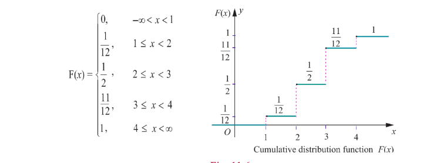

(ii) $P(X \leq 3) = F(3) = \frac{11}{12}$.
(iii) $P(X \geq 2) = 1 - P(X < 2) = 1 - P(X = 1) = 1 - \frac{1}{12} = \frac{11}{12}$.

**Example 11.8**

A six sided die is marked '1' on one face, '2' on two of its faces, and '3' on remaining three faces. The die is rolled twice. If $X$ denotes the total score in two throws.

(i) Find the probability mass function.  
(ii) Find the cumulative distribution function.  
(iii) Find $P(3 \leq X < 6)$ .  
(iv) Find $P(X \geq 4)$ .

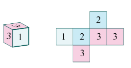

**Solution:**

Since $X$ denotes the total score in two throws, it takes on the values 2, 3, 4, 5, and 6.  
From the Sample space $S$ , we have

| Values of the Random Variable | 2 | 3 | 4 | 5 | 6 | Total |
| :--- | :--- | :--- | :--- | :--- | :--- | :--- |
| Number of elements in inverse images | 1 | 4 | 10 | 12 | 9 | 36 |

$P(X = 2) = \frac{1}{36}$ , $P(X = 3) = \frac{4}{36}$

$P(X = 4) = \frac{10}{36}$ , $P(X = 5) = \frac{12}{36}$ , and

$P(X = 6) = \frac{9}{36}$ .

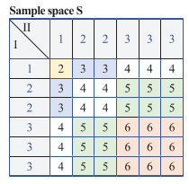

**(i) Probability mass function is**

| $x$ | 2 | 3 | 4 | 5 | 6 |
| :--- | :--- | :--- | :--- | :--- | :--- |
| $f(x)$ | $\frac{1}{36}$ | $\frac{4}{36}$ | $\frac{10}{36}$ | $\frac{12}{36}$ | $\frac{9}{36}$ |

**(ii) Cumulative distribution function**

By definition of the cumulative distribution function for discrete random variable we have

$F(x) = P(X \leq x) = \sum_{x_i \leq x} P(X = x_i)$ ,

$P(X < x) = 0$ for $-\infty < X < 2$ .

$F(2) = P(X \leq 2) = \sum_{-\infty}^{2} P(X = x) = P(X < 2) + P(X = 2) = 0 + \frac{1}{36} = \frac{1}{36}$ .

$F(3) = P(X \leq 3) = \sum_{-\infty}^{3} P(X = x) = P(X < 2) + P(X = 2) + P(X = 3) = 0 + \frac{1}{36} + \frac{4}{36} = \frac{5}{36}$ .

$F(4) = P(X \leq 4) = \sum_{-\infty}^{4} P(X = x) = P(X < 2) + P(X = 2) + P(X = 3) + P(X = 4)$

$= 0 + \frac{1}{36} + \frac{4}{36} + \frac{10}{36} = \frac{15}{36}$ .

$F(5) = P(X \leq 5) = \sum_{-\infty}^{5} P(X = x) = P(X < 2) + P(X = 2) + P(X = 3) + P(X = 4) + P(X = 5)$

$= 0 + \frac{1}{36} + \frac{4}{36} + \frac{10}{36} + \frac{12}{36} = \frac{27}{36}$ .

$F(6) = P(X \leq 6) = \sum_{x=0}^{6} P(X = x)$

$= P(X < 2) + P(X = 2) + P(X = 3) + P(X = 4) + P(X = 5) + P(X = 6)$

$= 0 + \frac{1}{36} + \frac{4}{36} + \frac{10}{36} + \frac{12}{36} + \frac{9}{36} = 1$ .

Therefore the cumulative distribution function is

$$
F(x) = \begin{cases}
0 & \text{for } -\infty < x < 2 \\
\frac{1}{36} & \text{for } 2 \leq x < 3 \\
\frac{5}{36} & \text{for } 3 \leq x < 4 \\
\frac{15}{36} & \text{for } 4 \leq x < 5 \\
\frac{27}{36} & \text{for } 5 \leq x < 6 \\
1 & \text{for } 6 \leq x < \infty
\end{cases}
$$

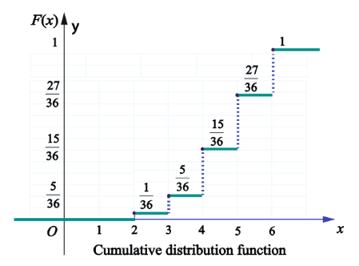

(iii) $P(3 \leq X < 6) = \sum_{x=3}^{5} P(X = x) = P(X = 3) + P(X = 4) + P(X = 5)$

$= \frac{4}{36} + \frac{10}{36} + \frac{12}{36} = \frac{26}{36}$ .

(iv) $P(X \geq 4) = \sum_{x=4}^{\infty} P(X = x)$

$= P(X = 4) + P(X = 5) + P(X = 6)$

$= \frac{10}{36} + \frac{12}{36} + \frac{9}{36} = \frac{31}{36}$ .

### 11.3.5 Probability Mass Function from Cumulative Distribution Function

For a discrete random variable $X$, the cumulative distribution function $F$ has jumps at each of the $x_i$, and is constant between successive $x_i$'s. The height of the jump at $x_i$ is $f(x_i)$; in this way the probability at $x_i$ can be retrieved from $F$.

Suppose $X$ is a discrete random variable taking the values $x_1, x_2, x_3, \ldots$ such that $x_1 < x_2 < x_3 \dots$ and $F(x_i)$ is the distribution function. Then the probability mass function $f(x_i)$ is given by

$$
f(x_i) = F(x_i) - F(x_{i-1}), \quad i = 1,2,3,\ldots
$$

> **Note**
>
> The jump of a function $F(x)$ at $x = a$ is $|F(a^{+}) - F(a^{-})|$. Since $F$ is non-decreasing and continuous to the right, the jump of a cumulative distribution function $F$ is $P(X = x) = F(x) - F(x^{-})$.
>
> Here the jump (because of discontinuity) acts as a probability. That is, the set of discontinuities of a cumulative distribution function is at most countable!

**Example 11.9**

Find the probability mass function $f(x)$ of the discrete random variable $X$ whose cumulative distribution function $F(x)$ is given by

$$
F(x) = \begin{cases}
0 & \text{for } x < -2 \\
0.25 & \text{for } -2 \le x < -1 \\
0.60 & \text{for } -1 \le x < 0 \\
0.90 & \text{for } 0 \le x < 1 \\
1 & \text{for } x \ge 1
\end{cases}
$$

Also find (i) $P(X < 0)$ and (ii) $P(X \geq -1)$.

**Solution**

Since $X$ is a discrete random variable, from the given data, $X$ takes on the values $-2, -1, 0$ and $1$.

For discrete random variable $X$, by definition, we have $f(x) = P(X = x)$.

Therefore left hand limit of $F(x)$ at $x = -2$ is $F(-2^{-})$.

$$
f(-2) = P(X = -2) = F(-2) - F(-2^{-}) = 0.25 - 0 = 0.25.
$$

Similarly for other jump points, we have

$$
f(-1) = P(X = -1) = F(-1) - F(-2) = 0.60 - 0.25 = 0.35.
$$

$$
f(0) = P(X = 0) = F(0) - F(-1) = 0.90 - 0.60 = 0.30,
$$

$$
f(1) = P(X = 1) = F(1) - F(0) = 1 - 0.90 = 0.10.
$$

Therefore the probability mass function is

| $x$ | -2 | -1 | 0 | 1 |
| :--- | :---: | :---: | :---: | :---: |
| $f(x)$ | 0.25 | 0.35 | 0.30 | 0.10 |

The distribution function $F(x)$ has jumps at $x = -2, -1, 0$ and $1$. The jumps are respectively 0.25, 0.35, 0.30, and 0.1 is shown in the figure given below.

These jumps determine the probability mass function.

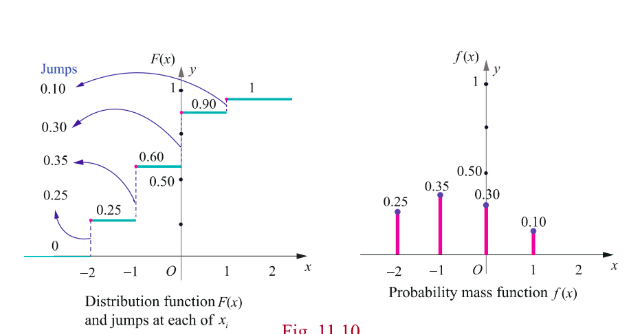

$$
P(X < 0) = \sum_{x=-2}^{-1} P(X = x) = P(X = -2) + P(X = -1) = 0.25 + 0.35 = 0.60.
$$

$$
P(X \geq -1) = \sum_{-1}^{1} P(X = x) = P(X = -1) + P(X = 0) + P(X = 1) = 0.35 + 0.30 + 0.10 = 0.75.
$$

**Example 11.10**

A random variable $X$ has the following probability mass function.

| $x$ | 1 | 2 | 3 | 4 | 5 | 6 |
| :--- | :---: | :---: | :---: | :---: | :---: | :---: |
| $f(x)$ | $k$ | $2k$ | $6k$ | $5k$ | $6k$ | $10k$ |

Find (i) $P(2 < X < 6)$ (ii) $P(2 \leq X < 5)$ (iii) $P(X \leq 4)$ (iv) $P(3 < X)$

**Solution**

Since the given function is a probability mass function, the total probability is one. That is $\sum_{x} f(x) = 1$.

From the given data $k + 2k + 6k + 5k + 6k + 10k = 1$.

$$
30k = 1 \Rightarrow k = \frac{1}{30}
$$

Therefore the probability mass function is

| $x$ | 1 | 2 | 3 | 4 | 5 | 6 |
| :--- | :---: | :---: | :---: | :---: | :---: | :---: |
| $f(x)$ | $1/30$ | $2/30$ | $6/30$ | $5/30$ | $6/30$ | $10/30$ |

$$
P(2 < X < 6) = f(3) + f(4) + f(5) = \frac{6}{30} + \frac{5}{30} + \frac{6}{30} = \frac{17}{30}.
$$

$$
P(2 \leq X < 5) = f(2) + f(3) + f(4) = \frac{2}{30} + \frac{6}{30} + \frac{5}{30} = \frac{13}{30}.
$$

$$
P(X \leq 4) = f(1) + f(2) + f(3) + f(4) = \frac{1}{30} + \frac{2}{30} + \frac{6}{30} + \frac{5}{30} = \frac{14}{30}.
$$

$$
P(3 < X) = f(4) + f(5) + f(6) = \frac{5}{30} + \frac{6}{30} + \frac{10}{30} = \frac{21}{30}.
$$

**Exercise 11.2**

1. Three fair coins are tossed simultaneously. Find the probability mass function for number of heads occurred.

2. A six sided die is marked '1' on one face, '3' on two of its faces, and '5' on remaining three faces. The die is thrown twice. If $X$ denotes the total score in two throws, find

(i) the probability mass function
(ii) the cumulative distribution function
(iii) $P(4 \leq X < 10)$
(iv) $P(X \geq 6)$

3. Find the probability mass function and cumulative distribution function of number of girl child in families with 4 children, assuming equal probabilities for boys and girls.

4. Suppose a discrete random variable can only take the values 0, 1, and 2. The probability mass function is defined by

\[
f(x) =
\begin{cases} 
\frac{x^2 + 1}{k}, & \text{for } x = 0, 1, 2 \\
0, & \text{otherwise}
\end{cases}
\]

Find (i) the value of $k$ (ii) cumulative distribution function (iii) $P(X \geq 1)$

5. The cumulative distribution function of a discrete random variable is given by

\[
F(x) =
\begin{cases} 
0 & -\infty < x < -1 \\
0.15 & -1 \leq x < 0 \\
0.35 & 0 \leq x < 1 \\
0.60 & 1 \leq x < 2 \\
0.85 & 2 \leq x < 3 \\
1 & 3 \leq x < \infty 
\end{cases}
\]

Find (i) the probability mass function (ii) $P(X < 1)$ and (iii) $P(X \geq 2)$

6. A random variable $X$ has the following probability mass function.

| $x$ | 1 | 2 | 3 | 4 | 5 |
| :--- | :---: | :---: | :---: | :---: | :---: |
| $f(x)$ | $k^2$ | $2k^2$ | $3k^2$ | $2k$ | $3k$ |

Find (i) the value of $k$ (ii) $P(2 \leq X < 5)$ (iii) $P(3 < X)$

7. The cumulative distribution function of a discrete random variable is given by

\[
F(x) =
\begin{cases} 
0 & \text{for } -\infty < x < 0 \\
\frac{1}{2} & \text{for } 0 \leq x < 1 \\
\frac{3}{5} & \text{for } 1 \leq x < 2 \\
\frac{4}{5} & \text{for } 2 \leq x < 3 \\
\frac{9}{10} & \text{for } 3 \leq x < 4 \\
1 & \text{for } 4 \leq x < \infty
\end{cases}
\]

Find (i) the probability mass function (ii) $P(X < 3)$ and (iii) $P(X \geq 2)$

## 11.4 Continuous Distributions

In this section we learn

(i) Continuous random variable
(ii) Probability density function
(iii) Distribution function (Cumulative distribution function).
(iv) To determine distribution function from probability density function.
(v) To determine probability density function from distribution function.

Sometimes a measurement such as current in a copper wire or length of lifetime of an electric bulb, can assume any value in an interval of real numbers. Then any precision in the measurement is possible. The random variable that represents this measurement is said to be a continuous random variable. The range of the random variable includes all values in an interval of real numbers; that is, the range can be thought of as a continuum of real numbers.

### 11.4.1 The definition of continuous random variable

> **Definition 11.5 (Continuous Random Variable)**
>
> Let $S$ be a sample space and let a random variable $X: S \to \mathbb{R}$ that takes on any value in a set $I$ of $\mathbb{R}$. Then $X$ is called a continuous random variable if $P(X = x) = 0$ for every $x$ in $I$.

### 11.4.2 Probability density function

> **Definition 11.6 (Probability density function)**
>
> A non-negative real valued function $f(x)$ is said to be a probability density function if, for each possible outcome $x \in [a,b]$ of a continuous random variable $X$ having the property
>
> $ P(a \leq X \leq b) = \int_{a}^{b} f(x) \, dx $
>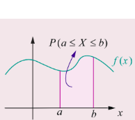

> **Theorem 11.2 (Without proof)**
>
> A function $f(\cdot)$ is a probability density function for some continuous random variable $X$ if and only if it satisfies the following properties.
>
> (i) $f(x) \geq 0$, for every $x$ and
>
> (ii) $\int_{-\infty}^{\infty} f(x) \, dx = 1$.

> **Note**
>
> It follows from the above definition, if $X$ is a continuous random variable,
>
> $$
> P(a \leq X \leq b) = \int_{a}^{b} f(x) \, dx,
> $$
>
> which means that $P(X = a) = \int_{a}^{a} f(x) \, dx = 0$.
>
> That is probability when $X$ takes on any one particular value is zero.

### 11.4.3 Distribution function (Cumulative distribution function)

> **Definition 11.7 (Cumulative Distribution Function)**
>
> The distribution function or cumulative distribution function $F(x)$ of a continuous random variable $X$ with probability density $f(x)$ is
> $ F(x) = P(X \leq x) = \int_{-\infty}^{x} f(u) \, du, \qquad -\infty < u < \infty. $

> **Remark**
>
> (1) In the discrete case, $f(a) = P(X = a)$ is the probability that $X$ takes the value $a$.
>
> In the continuous case, $f(x)$ at $x = a$ is not the probability that $X$ takes the value $a$; that is $f(a) \neq P(X = a)$. If $X$ is continuous type, $P(X = a) = 0$ for $a \in \mathbb{R}$.
>
> (2) When the random variable is continuous, the summation used in discrete is replaced by integration.
>
> (3) For continuous random variable
>
> $$
> P(a < X < b) = P(a \leq X < b) = P(a < X \leq b) = P(a \leq X \leq b)
> $$
>
> (4) The distribution function of a continuous random variable is known as Continuous Distribution Function.

#### 11.4.3.1 Properties of distribution function

For a continuous random variable $X$, the cumulative distribution function satisfies the following properties.

(i) $0 \leq F(x) \leq 1$, for all $x \in \mathbb{R}$.
(ii) $F(x)$ is a real valued non-decreasing. That is, if $x < y$, then $F(x) \leq F(y)$.
(iii) $F(x)$ is continuous everywhere.
(iv) $\lim_{x \to -\infty} F(x) = F(-\infty) = 0$ and $\lim_{x \to \infty} F(x) = F(+\infty) = 1$.
(v) $P(X > x) = 1 - P(X \leq x) = 1 - F(x)$.
(vi) $P(a < X < b) = F(b) - F(a)$.

**Example 11.11**

Find the constant $C$ such that the function

$$
f(x) = \begin{cases} Cx^2 & 1 < x < 4 \\ 0 & \text{Otherwise} \end{cases}
$$

is a density function, and compute
(i) $P(1.5 < X < 3.5)$
(ii) $P(X \leq 2)$
(iii) $P(3 < X)$

**Solution**

Since the given function is a probability density function,

$$
\int_{-\infty}^{\infty} f(x) \, dx = 1.
$$

That is

$$
\int_{-\infty}^{1} f(x) \, dx + \int_{1}^{4} f(x) \, dx + \int_{4}^{\infty} f(x) \, dx = 1.
$$

From the given information,

$$
\int_{1}^{4} Cx^2 \, dx = 1 \Rightarrow C \left[ \frac{x^3}{3} \right]_{1}^{4} = 1 \Rightarrow C \left( \frac{64}{3} - \frac{1}{3} \right) = 1 \Rightarrow C \left( \frac{63}{3} \right) = 1 \Rightarrow 21C = 1 \Rightarrow C = \frac{1}{21}.
$$

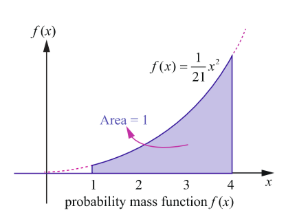

Therefore the probability density function is  
$f(x) = \begin{cases} \frac{1}{21}x^2 & 1 < x < 4 \\ 0 & \text{Otherwise} \end{cases}$

Since $f(x)$ is continuous, the probability that $X$ is equal to any particular value is zero. Therefore when the random variable is continuous, either or both of the signs $<$ by $\leq$ and $>$ by $\geq$ can be interchanged. Thus

(i) $P(1.5 < X < 3.5) = P(1.5 \leq X < 3.5) = P(1.5 < X \leq 3.5) = P(1.5 \leq X \leq 3.5)$

Therefore  
$P(1.5 < X < 3.5) = \int_{1.5}^{3.5} f(x) \, dx = \frac{1}{21} \int_{1.5}^{3.5} x^2 \, dx$  
$= \frac{1}{21} \left[ \frac{x^3}{3} \right]_{1.5}^{3.5} = \frac{1}{21} \left( \frac{(3.5)^3 - (1.5)^3}{3} \right)$  
$= \frac{79}{126}$ .

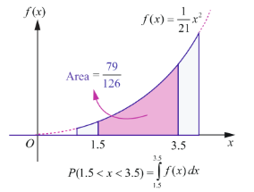

(ii) $P(X \leq 2) = \int_{-\infty}^{2} f(x) \, dx = \int_{-\infty}^{1} f(x) \, dx + \int_{1}^{2} f(x) \, dx$

Therefore  
$P(X \leq 2) = 0 + \frac{1}{21} \int_{1}^{2} x^2 \, dx = \frac{1}{21} \left( \frac{x^3}{3} \right)_{1}^{2}$  
$= \frac{1}{21} \left( \frac{2^3 - 1^3}{3} \right) = \frac{7}{63}$ .

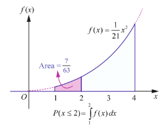

(iii) $P(3 < X) = \int_{3}^{4} f(x) \, dx$

$= \frac{1}{21} \int_{3}^{4} x^2 \, dx = \frac{1}{21} \left( \frac{x^3}{3} \right)_{3}^{4}$

$= \frac{1}{21} \left( \frac{4^3 - 3^3}{3} \right) = \frac{37}{63}$ .

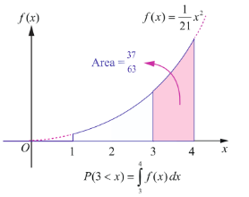

### 11.4.4 Distribution function from Probability density function

Both the probability density function and the cumulative distribution function (or distribution function) of a continuous random variable $X$ contain all the probabilistic information of $X$. The probability distribution of $X$ is determined by either of them. Let us learn the method to determine the distribution function $F$ of a continuous random variable $X$ from the probability density function $f(x)$ of $X$ and vice versa.

**Example 11.12**

If $X$ is the random variable with probability density function $f(x)$ given by,

$$
f(x) = \begin{cases}
x - 1 & \text{for } 1 \le x < 2 \\
3 - x & \text{for } 2 \le x < 3 \\
0 & \text{otherwise}
\end{cases}
$$

find (i) the distribution function $F(x)$
(ii) $P(1.5 \leq X \leq 2.5)$

**Solution**

(i) By definition $F(x) = P(X \leq x) = \int_{-\infty}^{x} f(u) \, du$.

When $x < 1$:

$$
F(x) = \int_{-\infty}^{x} 0 \, du = 0.
$$

When $1 \leq x < 2$:

$$
F(x) = \int_{-\infty}^{1} 0 \, du + \int_{1}^{x} (u - 1) \, du = 0 + \left[ \frac{(u - 1)^2}{2} \right]_{1}^{x} = \frac{(x - 1)^2}{2}.
$$

When $2 \leq x < 3$:

$$
F(x) = \int_{-\infty}^{1} 0 \, du + \int_{1}^{2} (u - 1) \, du + \int_{2}^{x} (3 - u) \, du
$$

$$
= 0 + \left[ \frac{(u - 1)^2}{2} \right]_{1}^{2} + \left[ -\frac{(3 - u)^2}{2} \right]_{2}^{x}
$$

$$
= \frac{(1)^2 - 0}{2} + \left[ -\frac{(3 - x)^2}{2} + \frac{(1)^2}{2} \right] = \frac{1}{2} + \frac{1}{2} - \frac{(3 - x)^2}{2} = 1 - \frac{(3 - x)^2}{2}.
$$

When $x \geq 3$:

$$
F(x) = \int_{-\infty}^{1} 0 \, du + \int_{1}^{2} (u - 1) \, du + \int_{2}^{3} (3 - u) \, du + \int_{3}^{x} 0 \, du
$$

$$
= 0 + \left[ \frac{(u - 1)^2}{2} \right]_{1}^{2} + \left[ -\frac{(3 - u)^2}{2} \right]_{2}^{3} + 0
$$

$$
= \frac{1}{2} + \left( 0 + \frac{1}{2} \right) = 1.
$$

These give

$$
F(x) = \begin{cases}
0, & -\infty < x < 1 \\
\frac{(x - 1)^2}{2}, & 1 \leq x < 2 \\
1 - \frac{(3 - x)^2}{2}, & 2 \leq x < 3 \\
1, & 3 \leq x < \infty
\end{cases}
$$

(ii) $P(1.5 \leq X \leq 2.5) = F(2.5) - F(1.5)$

$$
= \left[ 1 - \frac{(3 - 2.5)^2}{2} \right] - \left( \frac{(1.5 - 1)^2}{2} \right)
$$

$$
= \left[ 1 - \frac{(0.5)^2}{2} \right] - \left( \frac{(0.5)^2}{2} \right) = \left[ 1 - \frac{0.25}{2} \right] - \frac{0.25}{2}
$$

$$
= 1 - 0.125 - 0.125 = 0.75
$$

or

$$
P(1.5 \leq X \leq 2.5) = \int_{1.5}^{2.5} f(x) \, dx = \int_{1.5}^{2} (x - 1) \, dx + \int_{2}^{2.5} (-x + 3) \, dx = 0.75.
$$

Check:
(i) Whether $F(x)$ is continuous everywhere.
(ii) From the Fig. 11.16, triangle area $= \frac{1}{2} \times \text{base} \times \text{height} = \frac{1}{2} \times 2 \times 1 = 1$.

### 11.4.5 Probability density function from Probability distribution function

Let us learn the method to determine the probability density function $f(x)$ from the distribution function $F(x)$ of a continuous random variable $X$.

Suppose $F(x)$ is the distribution function of a continuous random variable $X$. Then the probability density function $f(x)$ is given by

$$
f(x) = \frac{dF(x)}{dx} = F'(x), \text{ wherever derivative exists.}
$$

**Example 11.13**

If $X$ is the random variable with distribution function $F(x)$ given by,

$$
F(x) = \begin{cases}
0 & \text{for } x < 0 \\
x & \text{for } 0 \le x < 1 \\
1 & \text{for } x \ge 1
\end{cases}
$$

then find (i) the probability density function $f(x)$ (ii) $P(0.2 \leq X \leq 0.7)$.

**Solution**

(i) Differentiating $F(x)$ with respect to $x$ at continuity points of $f(x)$, we get

$$
f(x) = \begin{cases}
0 & \text{for } x < 0 \\
1 & \text{for } 0 < x < 1 \\
0 & \text{for } x > 1
\end{cases}
$$

The pdf $f(x)$ is not continuous at $x = 0$, or at $x = 1$. We can define $f(0)$ and $f(1)$ in any manner. Choosing $f(0) = 1$, and $f(1) = 0$.

Therefore the probability density function $f(x)$ is

$$
f(x) = \begin{cases}
1 & \text{for } 0 \le x \le 1 \\
0 & \text{otherwise}
\end{cases}
$$

(ii) $P(0.2 \leq X \leq 0.7) = F(0.7) - F(0.2) = 0.7 - 0.2 = 0.5$

or

$$
P(0.2 \leq X \leq 0.7) = \int_{0.2}^{0.7} f(x) \, dx = \int_{0.2}^{0.7} 1 \, dx = 0.5.
$$

> **Remark**
>
> By definition, $P(X \leq x) = F(x) = \int_{-\infty}^{x} f(u) \, du$. Probability $P(a < X < b)$ can be obtained by using either $F(x)$ or $f(x)$.

> **Note**
>
> We may also define the above probability density function as
>
> $$
> f(x) = \begin{cases}
> 1 & \text{for } 0 < x < 1 \\
> 0 & \text{otherwise}
> \end{cases}
> $$

**Example 11.14**

The probability density function of random variable $X$ is given by

$$
f(x) = \begin{cases}
k & 1 \leq x \leq 5 \\
0 & \text{otherwise}
\end{cases}
$$

Find (i) Distribution function (ii) $P(X < 3)$ (iii) $P(2 < X < 4)$ (iv) $P(3 \leq X)$

**Solution**

Since $f(x)$ is a probability density function, $f(x) \geq 0$ and $\int_{-\infty}^{\infty} f(x) \, dx = 1$.

That is

$$
\int_{-\infty}^{1} 0 \, dx + \int_{1}^{5} k \, dx + \int_{5}^{\infty} 0 \, dx = 1.
$$

$$
0 + k[x]_{1}^{5} + 0 = 1 \Rightarrow k(5 - 1) = 1 \Rightarrow 4k = 1 \Rightarrow k = \frac{1}{4}.
$$

Therefore the probability density function is

$$
f(x) = \begin{cases}
\frac{1}{4} & \text{for } 1 \le x \le 5 \\
0 & \text{otherwise}
\end{cases}
$$

(i) Distribution function

The distribution function $F(x) = P(X \leq x) = \int_{-\infty}^{x} f(u) \, du$.

When $x < 1$:

$$
F(x) = \int_{-\infty}^{x} f(u) \, du = \int_{-\infty}^{x} 0 \, du = 0.
$$

When $1 \leq x < 5$:

$$
F(x) = \int_{-\infty}^{1} 0 \, du + \int_{1}^{x} \frac{1}{4} \, du = \frac{1}{4}(x - 1).
$$

When $x \geq 5$:

$$
F(x) = \int_{-\infty}^{1} 0 \, du + \int_{1}^{5} \frac{1}{4} \, du + \int_{5}^{x} 0 \, du = \frac{1}{4}(5 - 1) = 1.
$$

Thus

$$
F(x) = \begin{cases}
0 & \text{for } x < 1 \\
\frac{x - 1}{4} & \text{for } 1 \le x < 5 \\
1 & \text{for } x \ge 5
\end{cases}
$$

(ii) $P(X < 3) = P(X \leq 3) = F(3) = \frac{3 - 1}{4} = \frac{1}{2}$ (since $F(x)$ is continuous).

(iii) $P(2 < X < 4) = P(2 \leq X \leq 4) = F(4) - F(2) = \frac{3}{4} - \frac{1}{4} = \frac{1}{2}$.

(iv) $P(3 \leq X) = P(X \geq 3) = 1 - P(X < 3) = 1 - \frac{1}{2} = \frac{1}{2}$.

**Example 11.15**

Let $X$ be a random variable denoting the life time of an electrical equipment having probability density function

$$
f(x) = \begin{cases}
k e^{-2x} & \text{for } x > 0 \\
0 & \text{for } x \le 0
\end{cases}
$$

Find (i) the value of $k$ (ii) Distribution function (iii) $P(X < 2)$ (iv) calculate the probability that $X$ is at least for four unit of time (v) $P(X = 3)$

**Solution**

(i) Since $f(x)$ is a probability density function, $f(x) \geq 0$ and $\int_{-\infty}^{\infty} f(x) \, dx = 1$.

$$
\int_{-\infty}^{0} 0 \, dx + \int_{0}^{\infty} k e^{-2x} \, dx = 1.
$$

$$
0 + k \left[ \frac{e^{-2x}}{-2} \right]_{0}^{\infty} = 1 \Rightarrow k \left( 0 - \left( -\frac{1}{2} \right) \right) = 1 \Rightarrow \frac{k}{2} = 1 \Rightarrow k = 2.
$$

Therefore the probability density function is

$$
f(x) = \begin{cases}
2e^{-2x} & \text{for } x > 0 \\
0 & \text{for } x \le 0
\end{cases}
$$

(ii) Distribution function

By definition the distribution function $F(x) = P(X \leq x) = \int_{-\infty}^{x} f(u) \, du$.

For $x \leq 0$:

$$
F(x) = \int_{-\infty}^{x} 0 \, du = 0.
$$

For $x > 0$:

$$
F(x) = \int_{-\infty}^{0} 0 \, du + \int_{0}^{x} 2e^{-2u} \, du = 2 \left[ \frac{e^{-2u}}{-2} \right]_{0}^{x} = 1 - e^{-2x}.
$$

This gives

$$
F(x) = \begin{cases}
0, & \text{for } x \leq 0 \\
1 - e^{-2x}, & \text{for } x > 0
\end{cases}
$$

(iii) $P(X < 2) = P(X \leq 2) = F(2) = 1 - e^{-2 \times 2} = 1 - e^{-4}$ (since $F(x)$ is continuous).

(iv) The probability that $X$ is at least equal to four unit of time is

$$
P(X \geq 4) = 1 - P(X < 4) = 1 - F(4) = 1 - (1 - e^{-2 \times 4}) = e^{-8}.
$$

(v) In the continuous case, $f(x)$ at $x = a$ is not the probability that $X$ takes the value $a$, that is $f(x)$ at $x = a$ is not equal to $P(X = a)$. If $X$ is continuous type, $P(X = a) = 0$ for $a \in \mathbb{R}$. Therefore $P(X = 3) = 0$.

**Exercise 11.3**

1. The probability density function of $X$ is given by
   $$
   f(x) = \begin{cases}
   k x e^{-2x} & \text{for } x > 0 \\
   0 & \text{for } x \leq 0
   \end{cases}
   $$
   Find the value of $k$.

2. The probability density function of $X$ is
   $$
   f(x) = \begin{cases}
   x & 0 < x < 1 \\
   2 - x & 1 \leq x < 2 \\
   0 & \text{otherwise}
   \end{cases}
   $$
   Find (i) $P(0.2 \leq X < 0.6)$ (ii) $P(1.2 \leq X < 1.8)$ (iii) $P(0.5 \leq X < 1.5)$

3. Suppose the amount of milk sold daily at a milk booth is distributed with a minimum of 200 litres and a maximum of 600 litres with probability density function
   $$
   f(x) = \begin{cases}
   k & \text{for } 200 \le x \le 600 \\
   0 & \text{otherwise}
   \end{cases}
   $$
   Find (i) the value of $k$ (ii) the distribution function (iii) the probability that daily sales will fall between 300 litres and 500 litres?

4. The probability density function of $X$ is given by
   $$
   f(x) = \begin{cases}
   k e^{-\frac{x}{3}} & \text{for } x > 0 \\
   0 & \text{for } x \leq 0
   \end{cases}
   $$
   Find (i) the value of $k$ (ii) the distribution function (iii) $P(X < 3)$ (iv) $P(5 \leq X)$ (v) $P(X \leq 4)$.

5. If $X$ is the random variable with probability density function $f(x)$ given by,
   $$
   f(x) = \begin{cases}
   1 - \frac{|x|}{2} & \text{for } -2 \le x \le 2 \\
   0 & \text{otherwise}
   \end{cases}
   $$
   then find (i) the distribution function $F(x)$ (ii) $P(-0.5 \leq X \leq 0.5)$

6. If $X$ is the random variable with distribution function $F(x)$ given by,
\[
F(x) =
\begin{cases}  
0, & -\infty < x < 0 \\
\frac{1}{2}(x^2 + x), & 0 \leq x < 1 \\
1, & 1 \leq x < \infty
\end{cases}
\]
   then find (i) the probability density function $f(x)$ (ii) $P(0.3 \leq X \leq 0.6)$

## 11.5 Mathematical Expectation

One of the important characteristics of a random variable is its expectation. Synonyms for expectation are expected value, mean, and first moment.

The definition of mathematical expectation is driven by conventional idea of numerical average.

The numerical average of $n$ numbers, say $a_1, a_2, a_3, \ldots, a_n$ is

$$
\frac{a_1 + a_2 + a_3 + \ldots + a_n}{n}.
$$

The average is used to summarize or characterize the entire collection of $n$ numbers $a_1, a_2, a_3, \ldots, a_n$, with single value.

### Illustration 11.7

Consider ten numbers 6, 2, 5, 5, 2, 6, 2, -4, 1, 5.

The average is

$$
\frac{6 + 2 + 5 + 5 + 2 + 6 + 2 - 4 + 1 + 5}{10} = 3.
$$

If ten numbers 6, 2, 5, 5, 2, 6, 2, -4, 1, 5 are considered as the values of a random variable $X$ the probability mass function is given by

| $x$ | -4 | 1 | 2 | 5 | 6 |
| :--- | :---: | :---: | :---: | :---: | :---: |
| $P(X = x)$ | $1/10$ | $1/10$ | $3/10$ | $3/10$ | $2/10$ |

The above calculation for average can also be rewritten as

$$
-4 \times \frac{1}{10} + 1 \times \frac{1}{10} + 2 \times \frac{3}{10} + 5 \times \frac{3}{10} + 6 \times \frac{2}{10} = 3.
$$

This illustration suggests that the mean or expected value of any random variable may be obtained by the sum of the product of each value of the random variable by its corresponding probability.

So average $= \sum (\text{value of } x) \times (\text{probability})$

This is true if the random variable is discrete. In the case of continuous random variable, the mathematical expectation is essentially the same with summations being replaced by integrals.

Two quantities are often used to summarize a probability distribution of a random variable $X$. In terms of statistics one is central tendency and the other is dispersion or variability of the probability distribution. The mean is a measure of the centre tendency of the probability distribution, and the variance is a measure of the dispersion, or variability in the distribution. But these two measures do not uniquely identify a probability distribution. That is, two different distributions can have the same mean and variance. Still, these measures are simple, and useful in the study of the probability distribution of $X$.

### 11.5.1 Mean

> **Definition 11.8 (Mean)**
>
> Suppose $X$ is a random variable with probability mass (or) density function $f(x)$. The expected value or mean or mathematical expectation of $X$, denoted by $E(X)$ or $\mu$ is
>
>$$
E(X) = \mu = \begin{cases}
\sum_{x} x f(x) & \text{if } X \text{ is discrete} \\
\int_{-\infty}^{\infty} x f(x) \, dx & \text{if } X \text{ is continuous}
\end{cases} $$

The expected value is in general not a typical value that the random variable can take on. It is often helpful to interpret the expected value of a random variable as the long-run average value of the variable over many independent repetitions of an experiment.

> **Theorem 11.3 (Without proof)**
>
> Suppose $X$ is a random variable with probability mass (or) density function $f(x)$. The expected value of the function $g(X)$, a new random variable is
>
>$$
E(g(X)) = \begin{cases}
\sum_{x} g(x) f(x) & \text{if } X \text{ is discrete} \\
\int_{-\infty}^{\infty} g(x) f(x) \, dx & \text{if } X \text{ is continuous}
\end{cases} $$

If $g(X) = X^k$ the above theorem yield the expected value called the $k$-th moment about the origin of the random variable $X$.

Therefore the $k$-th moment about the origin of the random variable $X$ is

$$
\mu_k' = E(X^k) = \begin{cases}
\sum_{x} x^k f(x) & \text{if } X \text{ is discrete} \\
\int_{-\infty}^{\infty} x^k f(x) \, dx & \text{if } X \text{ is continuous}
\end{cases}
$$

> **Note**
>
> When $k = 0$, by definition,
>
> $$
> E(X^0) = E(1) = 1.
> $$

### 11.5.2 Variance

Variance is a statistical measure that tells us how measured data vary from the average value of the set of data. Mathematically, variance is the mean of the squares of the deviations from the arithmetic mean of a data set. The terms variability, spread, and dispersion are synonyms, and refer to how spread out a distribution is.

> **Definition 11.9 (Variance)**
>
> The variance of a random variable $X$ denoted by $\operatorname{Var}(X)$ or $V(X)$ or $\sigma^2$ (or $\sigma_x^2$) is
>
> $$
V(X) = E(X - E(X))^2 = E(X - \mu)^2 $$

Square root of variance is called standard deviation. That is standard deviation $\sigma = \sqrt{V(X)}$. The variance and standard deviation of a random variable are always non negative.

### 11.5.3 Properties of Mathematical expectation and variance

(i) $E(aX + b) = aE(X) + b$, where $a$ and $b$ are constants

**Proof**

Let $X$ be a discrete random variable

$$
E(aX + b) = \sum_{i=1}^{\infty} (a x_i + b) f(x_i)
$$

$$
= \sum_{i=1}^{\infty} (a x_i f(x_i) + b f(x_i))
$$

$$
= a \sum_{i=1}^{\infty} x_i f(x_i) + b \sum_{i=1}^{\infty} f(x_i)
$$

$$
= aE(X) + b(1) = aE(X) + b.
$$

Similarly, when $X$ is a continuous random variable, we can prove it, by replacing summation by integration.

| Corollary 1: $E(aX) = aE(X)$ (when $b = 0$) |
| Corollary 2: $E(b) = b$ (when $a = 0$) |

(ii) $V(X) = E(X^2) - (E(X))^2$

**Proof**

We know

$$
E(X) = \mu
$$

$$
Var(X) = E(X - \mu)^2 = E(X^2 - 2\mu X + \mu^2)
$$

$$
= E(X^2) - 2\mu E(X) + \mu^2 \quad (\text{Since } \mu \text{ is a constant})
$$

$$
= E(X^2) - 2\mu \cdot \mu + \mu^2 = E(X^2) - \mu^2
$$

$$
Var(X) = E(X^2) - (E(X))^2
$$

An alternative formula to compute variance of a random variable $X$ is

$$
\sigma^2 = \operatorname{Var}(X) = E(X^2) - (E(X))^2
$$

(iii) $\operatorname{Var}(aX + b) = a^2 \operatorname{Var}(X)$ where $a$ and $b$ are constants

**Proof**

$$
Var(aX + b) = E[(aX + b) - E(aX + b)]^2
$$

$$
= E[aX + b - aE(X) - b]^2
$$

$$
= E[aX - aE(X)]^2
$$

$$
= E[a(X - E(X))]^2
$$

$$
= a^2 E(X - E(X))^2 = a^2 Var(X)
$$

Hence $\operatorname{Var}(aX + b) = a^2 \operatorname{Var}(X)$

| Corollary 3: $V(aX) = a^2 V(X)$ (when $b = 0$) |
| Corollary 4: $V(b) = 0$ (when $a = 0$) |

Variance gives information about the deviation of the values of the random variable about the mean $\mu$. A smaller $\sigma^2$ implies that the random values are more clustered about the mean, similarly, a bigger $\sigma^2$ implies that the random values are more scattered from the mean.

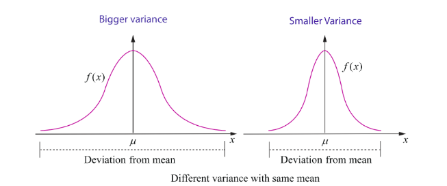

The above figure shows the pdfs of two continuous random variables whose curves are bell-shaped with same mean but different variances.

**Example 11.16**

Suppose that $f(x)$ given below represents a probability mass function,

| $x$ | 1 | 2 | 3 | 4 | 5 | 6 |
| :--- | :---: | :---: | :---: | :---: | :---: | :---: |
| $f(x)$ | $c^2$ | $2c^2$ | $3c^2$ | $4c^2$ | $c$ | $2c$ |

Find (i) the value of $c$ (ii) Mean and variance.

**Solution**

(i) Since $f(x)$ is a probability mass function, $f(x) \geq 0$ for all $x$, and $\sum_x f(x) = 1$.

Thus,

$$
\sum_x f(x) = 1
$$

$$
c^2 + 2c^2 + 3c^2 + 4c^2 + c + 2c = 1
$$

$$
10c^2 + 3c - 1 = 0 \Rightarrow 10c^2 + 5c - 2c - 1 = 0 \Rightarrow 5c(2c + 1) - 1(2c + 1) = 0 \Rightarrow (5c - 1)(2c + 1) = 0
$$

$$
c = \frac{1}{5} \text{ or } c = -\frac{1}{2}.
$$

Since $f(x) \geq 0$ for all $x$, the possible value of $c$ is $\frac{1}{5}$.

Hence, the probability mass function is

| $x$ | 1 | 2 | 3 | 4 | 5 | 6 |
| :--- | :---: | :---: | :---: | :---: | :---: | :---: |
| $f(x)$ | $1/25$ | $2/25$ | $3/25$ | $4/25$ | $1/5$ | $2/5$ |

(ii) To find mean and variance, let us use the following table

| $x$ | $f(x)$ | $x f(x)$ | $x^2 f(x)$ |
| :--- | :---: | :---: | :---: |
| 1 | $1/25$ | $1/25$ | $1/25$ |
| 2 | $2/25$ | $4/25$ | $8/25$ |
| 3 | $3/25$ | $9/25$ | $27/25$ |
| 4 | $4/25$ | $16/25$ | $64/25$ |
| 5 | $1/5 = 5/25$ | $25/25 = 1$ | $125/25 = 5$ |
| 6 | $2/5 = 10/25$ | $60/25$ | $360/25$ |
| | $\sum f(x) = 1$ | $\sum x f(x) = 115/25$ | $\sum x^2 f(x) = 585/25$ |

Mean:

$$
E(X) = \sum x f(x) = \frac{115}{25} = 4.6
$$

Variance:

$$
V(X) = E(X^2) - (E(X))^2 = \sum x^2 f(x) - \left( \sum x f(x) \right)^2
$$

$$
= \frac{585}{25} - \left( \frac{115}{25} \right)^2 = 23.40 - 21.16 = 2.24
$$

Therefore the mean and variance are 4.6 and 2.24 respectively.

**Example 11.17**

Two balls are chosen randomly from an urn containing 8 white and 4 black balls. Suppose that we win Rs 20 for each black ball selected and we lose Rs 10 for each white ball selected. Find the expected winning amount and variance.

**Solution**

Let $X$ denote the winning amount. The possible events of selection are (i) both balls are black, or (ii) one white and one black or (iii) both are white. Therefore $X$ is a random variable that can be defined as

$$
X(\text{both are black balls}) = 2(20) = 40
$$

$$
X(\text{one black and one white ball}) = 20 - 10 = 10
$$

$$
X(\text{both are white balls}) = -20
$$

Therefore $X$ takes on the values 40, 10 and $-20$.

Total number of balls $n = 12$

Total number of ways of selecting 2 balls $= \binom{12}{2} = \frac{12 \times 11}{1 \times 2} = 66$

Number of ways of selecting 2 black balls $= \binom{4}{2} = 6$

Number of ways of selecting one black ball and one white ball $= \binom{8}{1} \binom{4}{1} = 32$

Number of ways of selecting 2 white balls $= \binom{8}{2} = 28$

| Values of Random Variable $X$ | 40 | 10 | -20 | Total |
| :--- | :---: | :---: | :---: | :---: |
| Number of elements in inverse images | 6 | 32 | 28 | 66 |

Probability mass function is

| $X$ | 40 | 10 | -20 | Total |
| :--- | :---: | :---: | :---: | :---: |
| $f(x)$ | $6/66$ | $32/66$ | $28/66$ | 1 |

Now, the expected winning amount is

$$
E(X) = \sum x f(x) = 40 \times \frac{6}{66} + 10 \times \frac{32}{66} + (-20) \times \frac{28}{66}
$$

$$
= \frac{240}{66} + \frac{320}{66} - \frac{560}{66} = \frac{0}{66} = 0
$$

$$
E(X^2) = \sum x^2 f(x) = (40)^2 \times \frac{6}{66} + (10)^2 \times \frac{32}{66} + (-20)^2 \times \frac{28}{66}
$$

$$
= \frac{9600}{66} + \frac{3200}{66} + \frac{11200}{66} = \frac{24000}{66}
$$

Therefore variance is

$$
V(X) = E(X^2) - (E(X))^2 = \frac{24000}{66} - 0 = \frac{24000}{66} = \frac{4000}{11}
$$

**Example 11.18**

Find the mean and variance of a random variable $X$ , whose probability density function is  
$f(x) = \begin{cases} \lambda e^{-\lambda x} & \text{for } x \geq 0 \\ 0 & \text{otherwise} \end{cases}$

**Solution**

Observe that the given distribution is continuous.

**Mean:**

By definition  
$\mu = E(X) = \int_{-\infty}^{\infty} x f(x) dx$

$= \int_{-\infty}^{0} 0 (\lambda e^{-\lambda x}) dx + \int_{0}^{\infty} x (\lambda e^{-\lambda x}) dx$

$= 0 + \lambda \int_{0}^{\infty} x e^{-\lambda x} dx$

$= 0 + \lambda \left[ \frac{1}{\lambda^2} \right]$ (using Gamma integral for positive integer $n$ , $\int_{0}^{\infty} x^n e^{-\lambda x} dx = \frac{n!}{\lambda^{n+1}}$ )

$= \frac{1}{\lambda}$

**Variance:**

By definition,  
$E(X^2) = \int_{-\infty}^{\infty} x^2 f(x) dx$

$= \int_{-\infty}^{0} 0 (\lambda e^{-\lambda x}) dx + \int_{0}^{\infty} x^2 (\lambda e^{-\lambda x}) dx$

$= 0 + \lambda \int_{0}^{\infty} x^2 e^{-\lambda x} dx$

$= 0 + \lambda \left[ \frac{2}{\lambda^3} \right] = \frac{2}{\lambda^2}$ (using Gamma integral for positive integer $n$ )

(We can also use integration by parts or Bernoulli's formula)

Therefore $Var(X) = E(X^2) - (E(X))^2$

$= \frac{2}{\lambda^2} - \left( \frac{1}{\lambda} \right)^2 = \frac{1}{\lambda^2}$

Hence the mean and variance are respectively $\frac{1}{\lambda}$ and $\frac{1}{\lambda^2}$ .

**EXERCISE 11.4**

1. For the random variable $X$ with the given probability mass function or probability density function as below, find the mean and variance.

(i) $f(x) = \begin{cases} \frac{1}{10} & x = 2, 5 \\ \frac{1}{5} & x = 0, 1, 3, 4 \end{cases}$

(ii) $f(x) = \begin{cases} \frac{4 - x}{6} & x = 1, 2, 3 \\ 0 & \text{otherwise} \end{cases}$

(iii) $f(x) = \begin{cases} 2(x - 1) & 1 < x < 2 \\ 0 & \text{otherwise} \end{cases}$

(iv) $f(x) = \begin{cases} \frac{1}{2} e^{-\frac{x}{2}} & \text{for } x > 0 \\ 0 & \text{otherwise} \end{cases}$

2. Two balls are drawn in succession without replacement from an urn containing four red balls and three black balls. Let $X$ be the possible outcomes drawing red balls. Find the probability mass function and mean for $X$ .

3. If $\mu$ and $\sigma^2$ are the mean and variance of the discrete random variable $X$ , and $E(X + 3) = 10$ and $E(X + 3)^2 = 116$ , find $\mu$ and $\sigma^2$ .

4. Four fair coins are tossed once. Find the probability mass function, mean and variance for number of heads occurred.

5. A commuter train arrives punctually at a station every half hour. Each morning, a student leaves his house to the train station. Let $X$ denote the amount of time, in minutes, that the student waits for the train from the time he reaches the train station. It is known that the pdf of $X$ is

$f(x) = \begin{cases} \frac{1}{30} & 0 < x < 30 \\ 0 & \text{elsewhere} \end{cases}$

Obtain and interpret the expected value of the random variable $X$ .

6. The time to failure in thousands of hours of an electronic equipment used in a manufactured computer has the density function

$f(x) = \begin{cases} 3e^{-3x} & x > 0 \\ 0 & \text{elsewhere} \end{cases}$

Find the expected life of this electronic equipment.

7. The probability density function of the random variable $X$ is given by

$f(x) = \begin{cases} 16xe^{-4x} & \text{for } x > 0 \\ 0 & \text{for } x \leq 0 \end{cases}$

find the mean and variance of $X$ .

8.  A lottery with 600 tickets gives one prize of 200, four prizes of 100, and six prizes of 50.If the ticket costs is  2, find the expected profit amount of a ticket.  

### 11.6 Theoretical Distributions: Some Special Discrete Distributions

In the previous section we have dealt with various general probability distributions with mean and variance. We shall now learn some discrete probability distributions of special importance.

In this section we learn the following discrete distributions.

(i) The One point distribution  
(ii) The Two point distribution  
(iii) The Bernoulli distribution  
(iv) The Binomial distribution.

#### 11.6.1 The One point distribution

The random variable $X$ has a one point distribution if there exists a point $x_0$ such that, the probability mass function $f(x)$ is defined as  
$f(x) = P(X = x_0) = 1$ .

That is the probability mass is concentrated at one point.  
The cumulative distribution function is

$F(x) = \begin{cases} 0 & -\infty < x < x_0 \\ 1 & x_0 \leq x < \infty \end{cases}$

**Mean:**

$E(X) = \sum_x x f(x) = x_0 \times 1 = x_0$

**Variance:**

$V(X) = E(X^2) - (E(X))^2 = \sum_x x^2 f(x) - (x_0)^2 = x_0^2 - x_0^2 = 0$

Therefore the mean and the variance are respectively $x_0$ and 0.

#### 11.6.2 The Two point distribution

(a) **Unsymmetrical Case:** The random variable $X$ has a two point distribution if there exists two values $x_1$ and $x_2$ , such that

$f(x) = \begin{cases} p & \text{for } x = x_1 \\ 1 - p & \text{for } x = x_2 \end{cases}$ where $0 < p < 1$ .

The cumulative distribution function is

$F(x) = \begin{cases} 0 & \text{if } x < x_1 \\ p & \text{if } x_1 \leq x < x_2 \\ 1 & \text{if } x \geq x_2 \end{cases}$

**Mean:**

$E(X) = \sum_x x f(x) = x_1 \times p + x_2 \times (1 - p) = px_1 + qx_2$ where $q = 1 - p$ .

**Variance:**

$V(X) = E(X^2) - (E(X))^2 = \sum_x x^2 f(x) - (px_1 + qx_2)^2$

$= (x_1^2 p + x_2^2 q) - (px_1 + qx_2)^2 = pq(x_2 - x_1)^2$

The mean and the variance are respectively $px_1 + qx_2$ and $pq(x_2 - x_1)^2$ .

(b) **Symmetrical Case:**

When $p = q = \frac{1}{2}$ , the two point distribution becomes

$f(x) = \begin{cases} \frac{1}{2} & \text{for } x = x_1 \\ \frac{1}{2} & \text{for } x = x_2 \end{cases}$

and the cumulative distribution function is

$F(x) = \begin{cases} 0 & \text{if } x < x_1 \\ \frac{1}{2} & \text{if } x_1 \leq x < x_2 \\ 1 & \text{if } x \geq x_2 \end{cases}$

The mean and variance respectively are

$\frac{x_1 + x_2}{2}$ and $\frac{(x_2 - x_1)^2}{4}$ .

#### 11.6.3 The Bernoulli distribution

Independent trials having constant probability of success $p$ were first studied by the Swiss mathematician Jacques Bernoulli (1654–1705). In his book *The Art of Conjecturing*, published by his nephew Nicholas eight years after his death in 1713, Bernoulli showed that if the number of such trials were large, then the proportion of them that were successes would be close to $p$ .

In **probability theory**, the **Bernoulli distribution**, named after Swiss mathematician **Jacob Bernoulli** is the **discrete probability distribution** of a **random variable**. A Bernoulli experiment is a random experiment, where the outcomes is classified in one of two mutually exclusive and exhaustive ways, say success or failure (example: heads or tails, defective item or good item, life or death or many other possible pairs). A sequence of Bernoulli trials occurs when a Bernoulli experiment is performed several independent times so that the probability of success remains the same from trial to trial. Any nontrivial experiment can be dichotomized to yield Bernoulli model.

> **Definition 11.10: (Bernoulli's distribution)**
>
> Let $X$ be a random variable associated with a Bernoulli trial by defining it as  
> $X(\text{success}) = 1$ and $X(\text{failure}) = 0$ , such that
>
> $f(x) = \begin{cases} p & x = 1 \\ q = 1 - p & x = 0 \end{cases}$ where $0 < p < 1$ ,
>
> then $X$ is called a Bernoulli random variable and $f(x)$ is called the Bernoulli distribution.

Or equivalently  
If a random variable $X$ is following a Bernoulli's distribution, with probability $p$ of success can be denoted as $X \sim \text{Ber}(p)$ , where $p$ is called the parameter, then the probability mass function of $X$ is  
$f(x) = p^x (1 - p)^{1 - x}$ , $x = 0, 1$

The cumulative distribution of Bernoulli's distribution is

$F(x) = \begin{cases} 0 & \text{if } x < 0 \\ q = 1 - p & \text{if } 0 \leq x < 1 \\ 1 & \text{if } x \geq 1 \end{cases}$

**Mean:**

$E(X) = \sum_x x f(x) = 1 \times p + 0 \times (1 - p) = p$ ,

Note that, since $X$ takes only the values 0 and 1, its expected value $p$ is "never seen".

**Variance:**

$V(X) = E(X^2) - (E(X))^2 = \sum_x x^2 f(x) - p^2$

$= (1^2 p + 0^2 q) - p^2 = p(1 - p) = pq$ where $q = 1 - p$

If $X$ is a Bernoulli's random variable which follows Bernoulli distribution with parameter $p$ , the mean $\mu$ and variance $\sigma^2$ are

$\mu = p$ and $\sigma^2 = pq$

When $p = q = \frac{1}{2}$ , the Bernoulli's distribution become

$f(x) = \begin{cases} \frac{1}{2} & \text{for } x = 0 \\ \frac{1}{2} & \text{for } x = 1 \end{cases}$

and the cumulative distribution is

$F(x) = \begin{cases} 0 & \text{if } x < 0 \\ \frac{1}{2} & \text{if } 0 \leq x < 1 \\ 1 & \text{if } x \geq 1 \end{cases}$

The mean and variance are respectively are $\frac{1}{2}$ and $\frac{1}{4}$ .

#### 11.6.4 The Binomial Distribution

**The Binomial Distribution** is an important distribution which applies in some cases for repeated independent trials where there are only two possible outcomes: heads or tails, success or failure, defective item or good item, or many other such possible pairs. The probability of each outcome can be calculated using the multiplication rule, perhaps with a tree diagram.

Suppose a coin is tossed once. Let $X$ denote the number of heads. Then $X \sim \text{Ber}(p)$ , because we get either head ($X = 1$ ) or tail ($X = 0$ ) with probability $p$ or $1 - p$ .

Suppose a coin is tossed $n$ times. Let $X$ denote the number of heads. Then $X$ takes on the values 0, 1, 2, ..., $n$ . The probability for getting $x$ number of heads is given by

$P(X = x) = \binom{n}{x} p^x (1 - p)^{n-x}$ , $x = 0, 1, 2, ..., n$ .

$X = x$ , corresponds to the combination of $x$ heads in $n$ tosses, that is $\binom{n}{x}$ ways of heads and remaining $n - x$ tails. Hence, the probability for each of those outcomes is equal to $p^x (1 - p)^{n-x}$ . Binomial theorem is suitable to apply when $n$ is small number less than 30.

> **Definition 11.11: Binomial random variable**
>
> A discrete random variable $X$ is called binomial random variable, if $X$ is the number of successes in $n$ -repeated trials such that  
> (i) the $n$ -repeated trials are independent and $n$ is finite  
> (ii) each trial results only two possible outcomes, labelled as 'success' or 'failure'  
> (iii) the probability of a success in each trial, denoted as $p$ , remains constant.

> **Definition 11.12: Binomial distribution**
>
> The binomial random variable $X$ equals the number of successes with probability $p$ for a success and $q = 1 - p$ for a failure in $n$ -independent trials, has a **binomial distribution** denoted by $X \sim B(n, p)$ . The probability mass function of $X$ is
>
> $f(x) = \binom{n}{x} p^x (1 - p)^{n - x}$ , $x = 0, 1, 2, \dots, n$ .
>
> The name of the distribution is obtained from the **binomial expansion**. For constants $a$ and $b$ , the binomial expansion is
>
> $(a + b)^n = \sum_{x = 0}^n \binom{n}{x} a^x b^{n - x}$ .

Let $p$ denote the probability of success on a single trial. Then, by using the binomial expansion with $a = p$ and $b = 1 - p$ , we see that the sum of the probabilities for a binomial random variable is 1. Since each trial in the experiment is classified into two outcomes, {success, failure}, the distribution is called a "bi"-nomial.

If $X$ is a binomial random variable which follows binomial distribution with parameters $p$ and $n$ , the mean $\mu$ and variance $\sigma^2$ are  
$\mu = np$ and $\sigma^2 = np(1 - p)$

The expected value is in general not a typical value that the random variable can take on. It is often helpful to interpret the expected value of a random variable as the long-run average value of the variable over many independent repetitions of an experiment. The shape of a **binomial distribution** is **symmetrical** when $p = 0.5$ or when $n$ is large.

When $p = q = \frac{1}{2}$ , the binomial distribution becomes  
$f(x) = \binom{n}{x} \left( \frac{1}{2} \right)^x \left( \frac{1}{2} \right)^{n-x}$ , $x = 0, 1, 2, \ldots, n$ .

That is  
$f(x) = \binom{n}{x} \left( \frac{1}{2} \right)^n$ , $x = 0, 1, 2, \ldots, n$ .

The mean and variance are respectively are  
$\frac{n}{2}$ and $\frac{n}{4}$ .

**Example 11.19**

Find the binomial distribution for each of the following.  
(i) Five fair coins are tossed once and $X$ denotes the number of heads.  
(ii) A fair die is rolled 10 times and $X$ denotes the number of times 4 appeared.

**Solution**

(i) Given that five fair coins are tossed once. Since the coins are fair coins the probability of getting an head in a single coin is  
$p = \frac{1}{2}$ and $q = 1 - p = \frac{1}{2}$

Let $X$ denote the number of heads that appear in five coins. $X$ is a binomial random variable that takes on the values 0, 1, 2, 3, 4 and 5, with $n = 5$ and  
$p = \frac{1}{2}$ That is $X \sim B \left( 5, \frac{1}{2} \right)$ .

Therefore the binomial distribution is  
$f(x) = \binom{n}{x} p^x (1 - p)^{n - x}$ , $x = 0, 1, 2, \ldots, n$

becomes  
$f(x) = \binom{5}{x} \left( \frac{1}{2} \right)^x \left( \frac{1}{2} \right)^{5 - x}$ , $x = 0, 1, 2, \ldots, 5$ .

That is  
$f(x) = \binom{5}{x} \left( \frac{1}{2} \right)^5$ , $x = 0, 1, 2, \ldots, 5$ .

(ii) A fair die is rolled ten times and $X$ denotes the number of times 4 appeared. $X$ is binomial random variable that takes on the values 0, 1, 2, 3, \ldots, 10, with $n = 10$ and  
$p = \frac{1}{6}$ That is $X \sim B \left( 10, \frac{1}{6} \right)$ .

Probability of getting a four in a die is  
$p = \frac{1}{6}$ and $q = 1 - p = \frac{5}{6}$ .

Therefore the binomial distribution is  
$f(x) = \binom{10}{x} \left( \frac{1}{6} \right)^x \left( \frac{5}{6} \right)^{10 - x}$ , $x = 0, 1, 2, \ldots, 10$ .

**Example 11.20**

A multiple choice examination has ten questions, each question has four distractors with exactly one correct answer. Suppose a student answers by guessing and if $X$ denotes the number of correct answers, find (i) binomial distribution (ii) probability that the student will get seven correct answers (iii) the probability of getting at least one correct answer.

**Solution**

(i) Since $X$ denotes the number of success, $X$ can take the values $0, 1, 2, \ldots, 10$ .

The probability for success is $p = \frac{1}{4}$ and for failure $q = 1 - p = \frac{3}{4}$ , and $n = 10$ .

Therefore $X$ follows the binomial distribution $X \sim B \left( 10, \frac{1}{4} \right)$ .

This gives,  
$f(x) = \binom{10}{x} \left( \frac{1}{4} \right)^x \left( \frac{3}{4} \right)^{10-x}$ , $x = 0, 1, 2, \ldots, 10$

(ii) Probability for seven correct answers is  
$P(X = 7) = f(7) = \binom{10}{7} \left( \frac{1}{4} \right)^7 \left( \frac{3}{4} \right)^{10-7} = 120 \left( \frac{1}{4} \right)^7 \left( \frac{3}{4} \right)^3$

Probability that the student will get seven correct answers is  
$120 \left( \frac{1}{4} \right)^7 \left( \frac{3}{4} \right)^3$

(iii) Probability for at least one correct answer is  
$P(X \geq 1) = 1 - P(X < 1) = 1 - P(X = 0)$  
$= 1 - \binom{10}{0} \left( \frac{1}{4} \right)^0 \left( \frac{3}{4} \right)^{10} = 1 - \left( \frac{3}{4} \right)^{10}$

Probability that the student will get at least one correct answer is  
$1 - \left( \frac{3}{4} \right)^{10}$

**Example 11.21**

The mean and variance of a binomial variate $X$ are respectively 2 and 1.5. Find  
(i) $P(X = 0)$  
(ii) $P(X = 1)$  
(iii) $P(X \geq 1)$

**Solution**

To find the probabilities, the values of the parameters $n$ and $p$ must be known.  
Given that

Mean $= np = 2$ and variance $= npq = 1.5$

This gives

$\frac{npq}{np} = \frac{1.5}{2} = \frac{3}{4}$

$q = \frac{3}{4}$ and $p = 1 - q = 1 - \frac{3}{4} = \frac{1}{4}$

$np = 2$ , gives $n = \frac{2}{p} = 8$ .

Therefore

$X \sim B\left(8, \frac{1}{4}\right)$ .

Therefore the binomial distribution is

$P(X = x) = f(x) = \binom{8}{x} \left(\frac{1}{4}\right)^x \left(\frac{3}{4}\right)^{8-x}$ , $x = 0, 1, 2, \ldots, 8$

(i)

$P(X = 0) = f(0) = \binom{8}{0} \left(\frac{1}{4}\right)^0 \left(\frac{3}{4}\right)^{8-0} = \left(\frac{3}{4}\right)^8$

(ii)

$P(X = 1) = f(1) = \binom{8}{1} \left(\frac{1}{4}\right)^1 \left(\frac{3}{4}\right)^{8-1} = 8 \times \frac{1}{4} \left(\frac{3}{4}\right)^7 = 2 \left(\frac{3}{4}\right)^7$

(iii)

$P(X \geq 1) = 1 - P(X < 1) = 1 - P(X = 0) = 1 - \left(\frac{3}{4}\right)^8$

**Example 11.22**

On the average, 20% of the products manufactured by ABC Company are found to be defective. If we select 6 of these products at random and $X$ denotes the number of defective products found, then find the probability that (i) two products are defective (ii) at most one product is defective (iii) at least two products are defective.

**Solution**

Given that $n = 6$

Probability for selecting a defective product is $\frac{20}{100}$ , that is $p = \frac{1}{5}$ .

Since $X$ denotes the number defective products, $X$ can take on the values 0, 1, 2, ..., 6.

The probability for defective (success) is $p = \frac{1}{5}$ and for failure $q = 1 - p = \frac{4}{5}$ , and $n = 6$ .

Therefore $X$ follows the binomial distribution denoted by $X \sim B \left( 6, \frac{1}{5} \right)$ .

This gives

$f(x) = \binom{6}{x} \left( \frac{1}{5} \right)^x \left( \frac{4}{5} \right)^{6-x}$ , $x = 0, 1, 2, ..., 6$ .

(i) Probability for two defective products is

$P(X = 2) = f(2) = \binom{6}{2} \left( \frac{1}{5} \right)^2 \left( \frac{4}{5} \right)^{6-2} = 15 \left( \frac{1}{5} \right)^2 \left( \frac{4}{5} \right)^4$

(ii) Probability for at most one defective product is

$P(X \leq 1) = P(X = 0) + P(X = 1)$

$= \binom{6}{0} \left( \frac{1}{5} \right)^0 \left( \frac{4}{5} \right)^{6-0} + \binom{6}{1} \left( \frac{1}{5} \right)^1 \left( \frac{4}{5} \right)^{6-1}$

$= \left( \frac{4}{5} \right)^6 + 6 \left( \frac{1}{5} \right) \left( \frac{4}{5} \right)^5$

(iii) Probability for at least two defective products is

$P(X \geq 2) = 1 - P(X < 2) = 1 - P(X \leq 1)$

**EXERCISE 11.5**

1. Compute $P(X = k)$ for the binomial distribution, $B(n, p)$ where  
   (i) $n = 6$ , $p = \frac{1}{3}$ , $k = 3$  
   (ii) $n = 10$ , $p = \frac{1}{5}$ , $k = 4$  
   (iii) $n = 9$ , $p = \frac{1}{2}$ , $k = 7$

2. The probability that Mr. Q hits a target at any trial is $\frac{1}{4}$ . Suppose he tries at the target 10 times. Find the probability that he hits the target (i) exactly 4 times (ii) at least one time.

3. Using binomial distribution find the mean and variance of $X$ for the following experiments  
   (i) A fair coin is tossed 100 times, and $X$ denote the number of heads.  
   (ii) A fair die is tossed 240 times, and $X$ denote the number of times that four appeared.

4. The probability that a certain kind of component will survive a electrical test is $\frac{3}{4}$ . Find the probability that exactly 3 of the 5 components tested survive.

5. A retailer purchases a certain kind of electronic device from a manufacturer.  
   The manufacturer indicates that the defective rate of the device is 5%.  
   The inspector of the retailer randomly picks 10 items from a shipment. What is the probability that there will be (i) at least one defective item (ii) exactly two defective items?

6. If the probability that a fluorescent light has a useful life of at least 600 hours is 0.9, find the probabilities that among 12 such lights  
   (i) exactly 10 will have a useful life of at least 600 hours;  
   (ii) at least 11 will have a useful life of at least 600 hours;  
   (iii) at least 2 will not have a useful life of at least 600 hours.

7. The mean and standard deviation of a binomial variate $X$ are respectively 6 and 2.  
   Find (i) the probability mass function (ii) $P(X = 3)$ (iii) $P(X \geq 2)$ .

8. If $X \sim B(n, p)$ such that $4P(X = 4) = P(X = 2)$ and $n = 6$ . Find the distribution, mean and standard deviation of $X$ .

9. In a binomial distribution consisting of 5 independent trials, the probability of 1 and 2 successes are 0.4096 and 0.2048 respectively. Find the mean and variance of the random variable.
