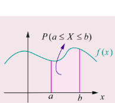
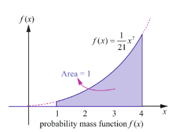
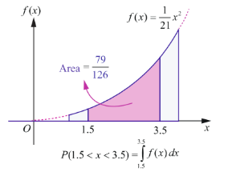
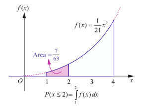
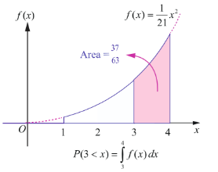

## 11.4 Continuous Distributions

In this section we learn

(i) Continuous random variable
(ii) Probability density function
(iii) Distribution function (Cumulative distribution function).
(iv) To determine distribution function from probability density function.
(v) To determine probability density function from distribution function.

Sometimes a measurement such as current in a copper wire or length of lifetime of an electric bulb, can assume any value in an interval of real numbers. Then any precision in the measurement is possible. The random variable that represents this measurement is said to be a continuous random variable. The range of the random variable includes all values in an interval of real numbers; that is, the range can be thought of as a continuum of real numbers.

### 11.4.1 The definition of continuous random variable

> **Definition 11.5 (Continuous Random Variable)**
>
> Let $S$ be a sample space and let a random variable $X: S \to \mathbb{R}$ that takes on any value in a set $I$ of $\mathbb{R}$. Then $X$ is called a continuous random variable if $P(X = x) = 0$ for every $x$ in $I$.

### 11.4.2 Probability density function

> **Definition 11.6 (Probability density function)**
>
> A non-negative real valued function $f(x)$ is said to be a probability density function if, for each possible outcome $x \in [a,b]$ of a continuous random variable $X$ having the property
>
> $ P(a \leq X \leq b) = \int_{a}^{b} f(x) \, dx $
>

> **Theorem 11.2 (Without proof)**
>
> A function $f(\cdot)$ is a probability density function for some continuous random variable $X$ if and only if it satisfies the following properties.
>
> (i) $f(x) \geq 0$, for every $x$ and
>
> (ii) $\int_{-\infty}^{\infty} f(x) \, dx = 1$.

> **Note**
>
> It follows from the above definition, if $X$ is a continuous random variable,
>
> $$
> P(a \leq X \leq b) = \int_{a}^{b} f(x) \, dx,
> $$
>
> which means that $P(X = a) = \int_{a}^{a} f(x) \, dx = 0$.
>
> That is probability when $X$ takes on any one particular value is zero.

### 11.4.3 Distribution function (Cumulative distribution function)

> **Definition 11.7 (Cumulative Distribution Function)**
>
> The distribution function or cumulative distribution function $F(x)$ of a continuous random variable $X$ with probability density $f(x)$ is
> $ F(x) = P(X \leq x) = \int_{-\infty}^{x} f(u) \, du, \qquad -\infty < u < \infty. $

> **Remark**
>
> (1) In the discrete case, $f(a) = P(X = a)$ is the probability that $X$ takes the value $a$.
>
> In the continuous case, $f(x)$ at $x = a$ is not the probability that $X$ takes the value $a$; that is $f(a) \neq P(X = a)$. If $X$ is continuous type, $P(X = a) = 0$ for $a \in \mathbb{R}$.
>
> (2) When the random variable is continuous, the summation used in discrete is replaced by integration.
>
> (3) For continuous random variable
>
> $$
> P(a < X < b) = P(a \leq X < b) = P(a < X \leq b) = P(a \leq X \leq b)
> $$
>
> (4) The distribution function of a continuous random variable is known as Continuous Distribution Function.

#### 11.4.3.1 Properties of distribution function

For a continuous random variable $X$, the cumulative distribution function satisfies the following properties.

(i) $0 \leq F(x) \leq 1$, for all $x \in \mathbb{R}$.
(ii) $F(x)$ is a real valued non-decreasing. That is, if $x < y$, then $F(x) \leq F(y)$.
(iii) $F(x)$ is continuous everywhere.
(iv) $\lim_{x \to -\infty} F(x) = F(-\infty) = 0$ and $\lim_{x \to \infty} F(x) = F(+\infty) = 1$.
(v) $P(X > x) = 1 - P(X \leq x) = 1 - F(x)$.
(vi) $P(a < X < b) = F(b) - F(a)$.

**Example 11.11**

Find the constant $C$ such that the function

$$
f(x) = \begin{cases} Cx^2 & 1 < x < 4 \\ 0 & \text{Otherwise} \end{cases}
$$

is a density function, and compute
(i) $P(1.5 < X < 3.5)$
(ii) $P(X \leq 2)$
(iii) $P(3 < X)$

**Solution**

Since the given function is a probability density function,

$$
\int_{-\infty}^{\infty} f(x) \, dx = 1.
$$

That is

$$
\int_{-\infty}^{1} f(x) \, dx + \int_{1}^{4} f(x) \, dx + \int_{4}^{\infty} f(x) \, dx = 1.
$$

From the given information,

$$
\int_{1}^{4} Cx^2 \, dx = 1 \Rightarrow C \left[ \frac{x^3}{3} \right]_{1}^{4} = 1 \Rightarrow C \left( \frac{64}{3} - \frac{1}{3} \right) = 1 \Rightarrow C \left( \frac{63}{3} \right) = 1 \Rightarrow 21C = 1 \Rightarrow C = \frac{1}{21}.
$$

Therefore the probability density function is  
$f(x) = \begin{cases} \frac{1}{21}x^2 & 1 < x < 4 \\ 0 & \text{Otherwise} \end{cases}$

Since $f(x)$ is continuous, the probability that $X$ is equal to any particular value is zero. Therefore when the random variable is continuous, either or both of the signs $<$ by $\leq$ and $>$ by $\geq$ can be interchanged. Thus

(i) $P(1.5 < X < 3.5) = P(1.5 \leq X < 3.5) = P(1.5 < X \leq 3.5) = P(1.5 \leq X \leq 3.5)$

Therefore  
$P(1.5 < X < 3.5) = \int_{1.5}^{3.5} f(x) \, dx = \frac{1}{21} \int_{1.5}^{3.5} x^2 \, dx$  
$= \frac{1}{21} \left[ \frac{x^3}{3} \right]_{1.5}^{3.5} = \frac{1}{21} \left( \frac{(3.5)^3 - (1.5)^3}{3} \right)$  
$= \frac{79}{126}$ .

(ii) $P(X \leq 2) = \int_{-\infty}^{2} f(x) \, dx = \int_{-\infty}^{1} f(x) \, dx + \int_{1}^{2} f(x) \, dx$

Therefore  
$P(X \leq 2) = 0 + \frac{1}{21} \int_{1}^{2} x^2 \, dx = \frac{1}{21} \left( \frac{x^3}{3} \right)_{1}^{2}$  
$= \frac{1}{21} \left( \frac{2^3 - 1^3}{3} \right) = \frac{7}{63}$ .

(iii) $P(3 < X) = \int_{3}^{4} f(x) \, dx$

$= \frac{1}{21} \int_{3}^{4} x^2 \, dx = \frac{1}{21} \left( \frac{x^3}{3} \right)_{3}^{4}$

$= \frac{1}{21} \left( \frac{4^3 - 3^3}{3} \right) = \frac{37}{63}$ .

### 11.4.4 Distribution function from Probability density function

Both the probability density function and the cumulative distribution function (or distribution function) of a continuous random variable $X$ contain all the probabilistic information of $X$. The probability distribution of $X$ is determined by either of them. Let us learn the method to determine the distribution function $F$ of a continuous random variable $X$ from the probability density function $f(x)$ of $X$ and vice versa.

**Example 11.12**

If $X$ is the random variable with probability density function $f(x)$ given by,

$$
f(x) = \begin{cases}
x - 1 & \text{for } 1 \le x < 2 \\
3 - x & \text{for } 2 \le x < 3 \\
0 & \text{otherwise}
\end{cases}
$$

find (i) the distribution function $F(x)$
(ii) $P(1.5 \leq X \leq 2.5)$

**Solution**

(i) By definition $F(x) = P(X \leq x) = \int_{-\infty}^{x} f(u) \, du$.

When $x < 1$:

$$
F(x) = \int_{-\infty}^{x} 0 \, du = 0.
$$

When $1 \leq x < 2$:

$$
F(x) = \int_{-\infty}^{1} 0 \, du + \int_{1}^{x} (u - 1) \, du = 0 + \left[ \frac{(u - 1)^2}{2} \right]_{1}^{x} = \frac{(x - 1)^2}{2}.
$$

When $2 \leq x < 3$:

$$
F(x) = \int_{-\infty}^{1} 0 \, du + \int_{1}^{2} (u - 1) \, du + \int_{2}^{x} (3 - u) \, du
$$

$$
= 0 + \left[ \frac{(u - 1)^2}{2} \right]_{1}^{2} + \left[ -\frac{(3 - u)^2}{2} \right]_{2}^{x}
$$

$$
= \frac{(1)^2 - 0}{2} + \left[ -\frac{(3 - x)^2}{2} + \frac{(1)^2}{2} \right] = \frac{1}{2} + \frac{1}{2} - \frac{(3 - x)^2}{2} = 1 - \frac{(3 - x)^2}{2}.
$$

When $x \geq 3$:

$$
F(x) = \int_{-\infty}^{1} 0 \, du + \int_{1}^{2} (u - 1) \, du + \int_{2}^{3} (3 - u) \, du + \int_{3}^{x} 0 \, du
$$

$$
= 0 + \left[ \frac{(u - 1)^2}{2} \right]_{1}^{2} + \left[ -\frac{(3 - u)^2}{2} \right]_{2}^{3} + 0
$$

$$
= \frac{1}{2} + \left( 0 + \frac{1}{2} \right) = 1.
$$

These give

$$
F(x) = \begin{cases}
0, & -\infty < x < 1 \\
\frac{(x - 1)^2}{2}, & 1 \leq x < 2 \\
1 - \frac{(3 - x)^2}{2}, & 2 \leq x < 3 \\
1, & 3 \leq x < \infty
\end{cases}
$$

(ii) $P(1.5 \leq X \leq 2.5) = F(2.5) - F(1.5)$

$$
= \left[ 1 - \frac{(3 - 2.5)^2}{2} \right] - \left( \frac{(1.5 - 1)^2}{2} \right)
$$

$$
= \left[ 1 - \frac{(0.5)^2}{2} \right] - \left( \frac{(0.5)^2}{2} \right) = \left[ 1 - \frac{0.25}{2} \right] - \frac{0.25}{2}
$$

$$
= 1 - 0.125 - 0.125 = 0.75
$$

or

$$
P(1.5 \leq X \leq 2.5) = \int_{1.5}^{2.5} f(x) \, dx = \int_{1.5}^{2} (x - 1) \, dx + \int_{2}^{2.5} (-x + 3) \, dx = 0.75.
$$

Check:
(i) Whether $F(x)$ is continuous everywhere.
(ii) From the Fig. 11.16, triangle area $= \frac{1}{2} \times \text{base} \times \text{height} = \frac{1}{2} \times 2 \times 1 = 1$.

### 11.4.5 Probability density function from Probability distribution function

Let us learn the method to determine the probability density function $f(x)$ from the distribution function $F(x)$ of a continuous random variable $X$.

Suppose $F(x)$ is the distribution function of a continuous random variable $X$. Then the probability density function $f(x)$ is given by

$$
f(x) = \frac{dF(x)}{dx} = F'(x), \text{ wherever derivative exists.}
$$

**Example 11.13**

If $X$ is the random variable with distribution function $F(x)$ given by,

$$
F(x) = \begin{cases}
0 & \text{for } x < 0 \\
x & \text{for } 0 \le x < 1 \\
1 & \text{for } x \ge 1
\end{cases}
$$

then find (i) the probability density function $f(x)$ (ii) $P(0.2 \leq X \leq 0.7)$.

**Solution**

(i) Differentiating $F(x)$ with respect to $x$ at continuity points of $f(x)$, we get

$$
f(x) = \begin{cases}
0 & \text{for } x < 0 \\
1 & \text{for } 0 < x < 1 \\
0 & \text{for } x > 1
\end{cases}
$$

The pdf $f(x)$ is not continuous at $x = 0$, or at $x = 1$. We can define $f(0)$ and $f(1)$ in any manner. Choosing $f(0) = 1$, and $f(1) = 0$.

Therefore the probability density function $f(x)$ is

$$
f(x) = \begin{cases}
1 & \text{for } 0 \le x \le 1 \\
0 & \text{otherwise}
\end{cases}
$$

(ii) $P(0.2 \leq X \leq 0.7) = F(0.7) - F(0.2) = 0.7 - 0.2 = 0.5$

or

$$
P(0.2 \leq X \leq 0.7) = \int_{0.2}^{0.7} f(x) \, dx = \int_{0.2}^{0.7} 1 \, dx = 0.5.
$$

> **Remark**
>
> By definition, $P(X \leq x) = F(x) = \int_{-\infty}^{x} f(u) \, du$. Probability $P(a < X < b)$ can be obtained by using either $F(x)$ or $f(x)$.

> **Note**
>
> We may also define the above probability density function as
>
> $$
> f(x) = \begin{cases}
> 1 & \text{for } 0 < x < 1 \\
> 0 & \text{otherwise}
> \end{cases}
> $$

**Example 11.14**

The probability density function of random variable $X$ is given by

$$
f(x) = \begin{cases}
k & 1 \leq x \leq 5 \\
0 & \text{otherwise}
\end{cases}
$$

Find (i) Distribution function (ii) $P(X < 3)$ (iii) $P(2 < X < 4)$ (iv) $P(3 \leq X)$

**Solution**

Since $f(x)$ is a probability density function, $f(x) \geq 0$ and $\int_{-\infty}^{\infty} f(x) \, dx = 1$.

That is

$$
\int_{-\infty}^{1} 0 \, dx + \int_{1}^{5} k \, dx + \int_{5}^{\infty} 0 \, dx = 1.
$$

$$
0 + k[x]_{1}^{5} + 0 = 1 \Rightarrow k(5 - 1) = 1 \Rightarrow 4k = 1 \Rightarrow k = \frac{1}{4}.
$$

Therefore the probability density function is

$$
f(x) = \begin{cases}
\frac{1}{4} & \text{for } 1 \le x \le 5 \\
0 & \text{otherwise}
\end{cases}
$$

(i) Distribution function

The distribution function $F(x) = P(X \leq x) = \int_{-\infty}^{x} f(u) \, du$.

When $x < 1$:

$$
F(x) = \int_{-\infty}^{x} f(u) \, du = \int_{-\infty}^{x} 0 \, du = 0.
$$

When $1 \leq x < 5$:

$$
F(x) = \int_{-\infty}^{1} 0 \, du + \int_{1}^{x} \frac{1}{4} \, du = \frac{1}{4}(x - 1).
$$

When $x \geq 5$:

$$
F(x) = \int_{-\infty}^{1} 0 \, du + \int_{1}^{5} \frac{1}{4} \, du + \int_{5}^{x} 0 \, du = \frac{1}{4}(5 - 1) = 1.
$$

Thus

$$
F(x) = \begin{cases}
0 & \text{for } x < 1 \\
\frac{x - 1}{4} & \text{for } 1 \le x < 5 \\
1 & \text{for } x \ge 5
\end{cases}
$$

(ii) $P(X < 3) = P(X \leq 3) = F(3) = \frac{3 - 1}{4} = \frac{1}{2}$ (since $F(x)$ is continuous).

(iii) $P(2 < X < 4) = P(2 \leq X \leq 4) = F(4) - F(2) = \frac{3}{4} - \frac{1}{4} = \frac{1}{2}$.

(iv) $P(3 \leq X) = P(X \geq 3) = 1 - P(X < 3) = 1 - \frac{1}{2} = \frac{1}{2}$.

**Example 11.15**

Let $X$ be a random variable denoting the life time of an electrical equipment having probability density function

$$
f(x) = \begin{cases}
k e^{-2x} & \text{for } x > 0 \\
0 & \text{for } x \le 0
\end{cases}
$$

Find (i) the value of $k$ (ii) Distribution function (iii) $P(X < 2)$ (iv) calculate the probability that $X$ is at least for four unit of time (v) $P(X = 3)$

**Solution**

(i) Since $f(x)$ is a probability density function, $f(x) \geq 0$ and $\int_{-\infty}^{\infty} f(x) \, dx = 1$.

$$
\int_{-\infty}^{0} 0 \, dx + \int_{0}^{\infty} k e^{-2x} \, dx = 1.
$$

$$
0 + k \left[ \frac{e^{-2x}}{-2} \right]_{0}^{\infty} = 1 \Rightarrow k \left( 0 - \left( -\frac{1}{2} \right) \right) = 1 \Rightarrow \frac{k}{2} = 1 \Rightarrow k = 2.
$$

Therefore the probability density function is

$$
f(x) = \begin{cases}
2e^{-2x} & \text{for } x > 0 \\
0 & \text{for } x \le 0
\end{cases}
$$

(ii) Distribution function

By definition the distribution function $F(x) = P(X \leq x) = \int_{-\infty}^{x} f(u) \, du$.

For $x \leq 0$:

$$
F(x) = \int_{-\infty}^{x} 0 \, du = 0.
$$

For $x > 0$:

$$
F(x) = \int_{-\infty}^{0} 0 \, du + \int_{0}^{x} 2e^{-2u} \, du = 2 \left[ \frac{e^{-2u}}{-2} \right]_{0}^{x} = 1 - e^{-2x}.
$$

This gives

$$
F(x) = \begin{cases}
0, & \text{for } x \leq 0 \\
1 - e^{-2x}, & \text{for } x > 0
\end{cases}
$$

(iii) $P(X < 2) = P(X \leq 2) = F(2) = 1 - e^{-2 \times 2} = 1 - e^{-4}$ (since $F(x)$ is continuous).

(iv) The probability that $X$ is at least equal to four unit of time is

$$
P(X \geq 4) = 1 - P(X < 4) = 1 - F(4) = 1 - (1 - e^{-2 \times 4}) = e^{-8}.
$$

(v) In the continuous case, $f(x)$ at $x = a$ is not the probability that $X$ takes the value $a$, that is $f(x)$ at $x = a$ is not equal to $P(X = a)$. If $X$ is continuous type, $P(X = a) = 0$ for $a \in \mathbb{R}$. Therefore $P(X = 3) = 0$.

**Exercise 11.3**

1. The probability density function of $X$ is given by
   $$
   f(x) = \begin{cases}
   k x e^{-2x} & \text{for } x > 0 \\
   0 & \text{for } x \leq 0
   \end{cases}
   $$
   Find the value of $k$.

2. The probability density function of $X$ is
   $$
   f(x) = \begin{cases}
   x & 0 < x < 1 \\
   2 - x & 1 \leq x < 2 \\
   0 & \text{otherwise}
   \end{cases}
   $$
   Find (i) $P(0.2 \leq X < 0.6)$ (ii) $P(1.2 \leq X < 1.8)$ (iii) $P(0.5 \leq X < 1.5)$

3. Suppose the amount of milk sold daily at a milk booth is distributed with a minimum of 200 litres and a maximum of 600 litres with probability density function
   $$
   f(x) = \begin{cases}
   k & \text{for } 200 \le x \le 600 \\
   0 & \text{otherwise}
   \end{cases}
   $$
   Find (i) the value of $k$ (ii) the distribution function (iii) the probability that daily sales will fall between 300 litres and 500 litres?

4. The probability density function of $X$ is given by
   $$
   f(x) = \begin{cases}
   k e^{-\frac{x}{3}} & \text{for } x > 0 \\
   0 & \text{for } x \leq 0
   \end{cases}
   $$
   Find (i) the value of $k$ (ii) the distribution function (iii) $P(X < 3)$ (iv) $P(5 \leq X)$ (v) $P(X \leq 4)$.

5. If $X$ is the random variable with probability density function $f(x)$ given by,
   $$
   f(x) = \begin{cases}
   1 - \frac{|x|}{2} & \text{for } -2 \le x \le 2 \\
   0 & \text{otherwise}
   \end{cases}
   $$
   then find (i) the distribution function $F(x)$ (ii) $P(-0.5 \leq X \leq 0.5)$

6. If $X$ is the random variable with distribution function $F(x)$ given by,
   $$
   F(x) = \begin{cases}
   0 & \text{for } x < 0 \\
   \frac{x}{2} & \text{for } 0 \le x < 1 \\
   \frac{2x - 1}{2} & \text{for } 1 \le x < 1.5 \\
   1 & \text{for } x \ge 1.5
   \end{cases}
   $$
   then find (i) the probability density function $f(x)$ (ii) $P(0.3 \leq X \leq 0.6)$
