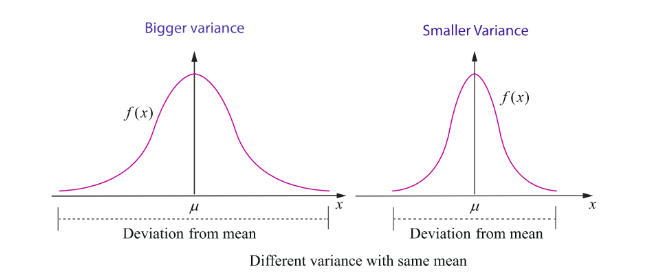

## 11.5 Mathematical Expectation

One of the important characteristics of a random variable is its expectation. Synonyms for expectation are expected value, mean, and first moment.

The definition of mathematical expectation is driven by conventional idea of numerical average.

The numerical average of $n$ numbers, say $a_1, a_2, a_3, \ldots, a_n$ is

$$
\frac{a_1 + a_2 + a_3 + \ldots + a_n}{n}.
$$

The average is used to summarize or characterize the entire collection of $n$ numbers $a_1, a_2, a_3, \ldots, a_n$, with single value.

### Illustration 11.7

Consider ten numbers 6, 2, 5, 5, 2, 6, 2, -4, 1, 5.

The average is

$$
\frac{6 + 2 + 5 + 5 + 2 + 6 + 2 - 4 + 1 + 5}{10} = 3.
$$

If ten numbers 6, 2, 5, 5, 2, 6, 2, -4, 1, 5 are considered as the values of a random variable $X$ the probability mass function is given by

| $x$ | -4 | 1 | 2 | 5 | 6 |
| :--- | :---: | :---: | :---: | :---: | :---: |
| $P(X = x)$ | $1/10$ | $1/10$ | $3/10$ | $3/10$ | $2/10$ |

The above calculation for average can also be rewritten as

$$
-4 \times \frac{1}{10} + 1 \times \frac{1}{10} + 2 \times \frac{3}{10} + 5 \times \frac{3}{10} + 6 \times \frac{2}{10} = 3.
$$

This illustration suggests that the mean or expected value of any random variable may be obtained by the sum of the product of each value of the random variable by its corresponding probability.

So average $= \sum (\text{value of } x) \times (\text{probability})$

This is true if the random variable is discrete. In the case of continuous random variable, the mathematical expectation is essentially the same with summations being replaced by integrals.

Two quantities are often used to summarize a probability distribution of a random variable $X$. In terms of statistics one is central tendency and the other is dispersion or variability of the probability distribution. The mean is a measure of the centre tendency of the probability distribution, and the variance is a measure of the dispersion, or variability in the distribution. But these two measures do not uniquely identify a probability distribution. That is, two different distributions can have the same mean and variance. Still, these measures are simple, and useful in the study of the probability distribution of $X$.

### 11.5.1 Mean

> **Definition 11.8 (Mean)**
>
> Suppose $X$ is a random variable with probability mass (or) density function $f(x)$. The expected value or mean or mathematical expectation of $X$, denoted by $E(X)$ or $\mu$ is
>
>$$
E(X) = \mu = \begin{cases}
\sum_{x} x f(x) & \text{if } X \text{ is discrete} \\
\int_{-\infty}^{\infty} x f(x) \, dx & \text{if } X \text{ is continuous}
\end{cases} $$

The expected value is in general not a typical value that the random variable can take on. It is often helpful to interpret the expected value of a random variable as the long-run average value of the variable over many independent repetitions of an experiment.

> **Theorem 11.3 (Without proof)**
>
> Suppose $X$ is a random variable with probability mass (or) density function $f(x)$. The expected value of the function $g(X)$, a new random variable is
>
>$$
E(g(X)) = \begin{cases}
\sum_{x} g(x) f(x) & \text{if } X \text{ is discrete} \\
\int_{-\infty}^{\infty} g(x) f(x) \, dx & \text{if } X \text{ is continuous}
\end{cases} $$

If $g(X) = X^k$ the above theorem yield the expected value called the $k$-th moment about the origin of the random variable $X$.

Therefore the $k$-th moment about the origin of the random variable $X$ is

$$
\mu_k' = E(X^k) = \begin{cases}
\sum_{x} x^k f(x) & \text{if } X \text{ is discrete} \\
\int_{-\infty}^{\infty} x^k f(x) \, dx & \text{if } X \text{ is continuous}
\end{cases}
$$

> **Note**
>
> When $k = 0$, by definition,
>
> $$
> E(X^0) = E(1) = 1.
> $$

### 11.5.2 Variance

Variance is a statistical measure that tells us how measured data vary from the average value of the set of data. Mathematically, variance is the mean of the squares of the deviations from the arithmetic mean of a data set. The terms variability, spread, and dispersion are synonyms, and refer to how spread out a distribution is.

> **Definition 11.9 (Variance)**
>
> The variance of a random variable $X$ denoted by $\operatorname{Var}(X)$ or $V(X)$ or $\sigma^2$ (or $\sigma_x^2$) is
>
> $$
V(X) = E(X - E(X))^2 = E(X - \mu)^2 $$

Square root of variance is called standard deviation. That is standard deviation $\sigma = \sqrt{V(X)}$. The variance and standard deviation of a random variable are always non negative.

### 11.5.3 Properties of Mathematical expectation and variance

(i) $E(aX + b) = aE(X) + b$, where $a$ and $b$ are constants

**Proof**

Let $X$ be a discrete random variable

$$
E(aX + b) = \sum_{i=1}^{\infty} (a x_i + b) f(x_i)
$$

$$
= \sum_{i=1}^{\infty} (a x_i f(x_i) + b f(x_i))
$$

$$
= a \sum_{i=1}^{\infty} x_i f(x_i) + b \sum_{i=1}^{\infty} f(x_i)
$$

$$
= aE(X) + b(1) = aE(X) + b.
$$

Similarly, when $X$ is a continuous random variable, we can prove it, by replacing summation by integration.

| Corollary 1: $E(aX) = aE(X)$ (when $b = 0$) |
| Corollary 2: $E(b) = b$ (when $a = 0$) |

(ii) $V(X) = E(X^2) - (E(X))^2$

**Proof**

We know

$$
E(X) = \mu
$$

$$
Var(X) = E(X - \mu)^2 = E(X^2 - 2\mu X + \mu^2)
$$

$$
= E(X^2) - 2\mu E(X) + \mu^2 \quad (\text{Since } \mu \text{ is a constant})
$$

$$
= E(X^2) - 2\mu \cdot \mu + \mu^2 = E(X^2) - \mu^2
$$

$$
Var(X) = E(X^2) - (E(X))^2
$$

An alternative formula to compute variance of a random variable $X$ is

$$
\sigma^2 = \operatorname{Var}(X) = E(X^2) - (E(X))^2
$$

(iii) $\operatorname{Var}(aX + b) = a^2 \operatorname{Var}(X)$ where $a$ and $b$ are constants

**Proof**

$$
Var(aX + b) = E[(aX + b) - E(aX + b)]^2
$$

$$
= E[aX + b - aE(X) - b]^2
$$

$$
= E[aX - aE(X)]^2
$$

$$
= E[a(X - E(X))]^2
$$

$$
= a^2 E(X - E(X))^2 = a^2 Var(X)
$$

Hence $\operatorname{Var}(aX + b) = a^2 \operatorname{Var}(X)$

| Corollary 3: $V(aX) = a^2 V(X)$ (when $b = 0$) |
| Corollary 4: $V(b) = 0$ (when $a = 0$) |

Variance gives information about the deviation of the values of the random variable about the mean $\mu$. A smaller $\sigma^2$ implies that the random values are more clustered about the mean, similarly, a bigger $\sigma^2$ implies that the random values are more scattered from the mean.

The above figure shows the pdfs of two continuous random variables whose curves are bell-shaped with same mean but different variances.

**Example 11.16**

Suppose that $f(x)$ given below represents a probability mass function,

| $x$ | 1 | 2 | 3 | 4 | 5 | 6 |
| :--- | :---: | :---: | :---: | :---: | :---: | :---: |
| $f(x)$ | $c^2$ | $2c^2$ | $3c^2$ | $4c^2$ | $c$ | $2c$ |

Find (i) the value of $c$ (ii) Mean and variance.

**Solution**

(i) Since $f(x)$ is a probability mass function, $f(x) \geq 0$ for all $x$, and $\sum_x f(x) = 1$.

Thus,

$$
\sum_x f(x) = 1
$$

$$
c^2 + 2c^2 + 3c^2 + 4c^2 + c + 2c = 1
$$

$$
10c^2 + 3c - 1 = 0 \Rightarrow 10c^2 + 5c - 2c - 1 = 0 \Rightarrow 5c(2c + 1) - 1(2c + 1) = 0 \Rightarrow (5c - 1)(2c + 1) = 0
$$

$$
c = \frac{1}{5} \text{ or } c = -\frac{1}{2}.
$$

Since $f(x) \geq 0$ for all $x$, the possible value of $c$ is $\frac{1}{5}$.

Hence, the probability mass function is

| $x$ | 1 | 2 | 3 | 4 | 5 | 6 |
| :--- | :---: | :---: | :---: | :---: | :---: | :---: |
| $f(x)$ | $1/25$ | $2/25$ | $3/25$ | $4/25$ | $1/5$ | $2/5$ |

(ii) To find mean and variance, let us use the following table

| $x$ | $f(x)$ | $x f(x)$ | $x^2 f(x)$ |
| :--- | :---: | :---: | :---: |
| 1 | $1/25$ | $1/25$ | $1/25$ |
| 2 | $2/25$ | $4/25$ | $8/25$ |
| 3 | $3/25$ | $9/25$ | $27/25$ |
| 4 | $4/25$ | $16/25$ | $64/25$ |
| 5 | $1/5 = 5/25$ | $25/25 = 1$ | $125/25 = 5$ |
| 6 | $2/5 = 10/25$ | $60/25$ | $360/25$ |
| | $\sum f(x) = 1$ | $\sum x f(x) = 115/25$ | $\sum x^2 f(x) = 585/25$ |

Mean:

$$
E(X) = \sum x f(x) = \frac{115}{25} = 4.6
$$

Variance:

$$
V(X) = E(X^2) - (E(X))^2 = \sum x^2 f(x) - \left( \sum x f(x) \right)^2
$$

$$
= \frac{585}{25} - \left( \frac{115}{25} \right)^2 = 23.40 - 21.16 = 2.24
$$

Therefore the mean and variance are 4.6 and 2.24 respectively.

**Example 11.17**

Two balls are chosen randomly from an urn containing 8 white and 4 black balls. Suppose that we win Rs 20 for each black ball selected and we lose Rs 10 for each white ball selected. Find the expected winning amount and variance.

**Solution**

Let $X$ denote the winning amount. The possible events of selection are (i) both balls are black, or (ii) one white and one black or (iii) both are white. Therefore $X$ is a random variable that can be defined as

$$
X(\text{both are black balls}) = 2(20) = 40
$$

$$
X(\text{one black and one white ball}) = 20 - 10 = 10
$$

$$
X(\text{both are white balls}) = -20
$$

Therefore $X$ takes on the values 40, 10 and $-20$.

Total number of balls $n = 12$

Total number of ways of selecting 2 balls $= \binom{12}{2} = \frac{12 \times 11}{1 \times 2} = 66$

Number of ways of selecting 2 black balls $= \binom{4}{2} = 6$

Number of ways of selecting one black ball and one white ball $= \binom{8}{1} \binom{4}{1} = 32$

Number of ways of selecting 2 white balls $= \binom{8}{2} = 28$

| Values of Random Variable $X$ | 40 | 10 | -20 | Total |
| :--- | :---: | :---: | :---: | :---: |
| Number of elements in inverse images | 6 | 32 | 28 | 66 |

Probability mass function is

| $X$ | 40 | 10 | -20 | Total |
| :--- | :---: | :---: | :---: | :---: |
| $f(x)$ | $6/66$ | $32/66$ | $28/66$ | 1 |

Now, the expected winning amount is

$$
E(X) = \sum x f(x) = 40 \times \frac{6}{66} + 10 \times \frac{32}{66} + (-20) \times \frac{28}{66}
$$

$$
= \frac{240}{66} + \frac{320}{66} - \frac{560}{66} = \frac{0}{66} = 0
$$

$$
E(X^2) = \sum x^2 f(x) = (40)^2 \times \frac{6}{66} + (10)^2 \times \frac{32}{66} + (-20)^2 \times \frac{28}{66}
$$

$$
= \frac{9600}{66} + \frac{3200}{66} + \frac{11200}{66} = \frac{24000}{66}
$$

Therefore variance is

$$
V(X) = E(X^2) - (E(X))^2 = \frac{24000}{66} - 0 = \frac{24000}{66} = \frac{4000}{11}
$$

**Example 11.18**

Find the mean and variance of a random variable $X$ , whose probability density function is  
$f(x) = \begin{cases} \lambda e^{-\lambda x} & \text{for } x \geq 0 \\ 0 & \text{otherwise} \end{cases}$

**Solution**

Observe that the given distribution is continuous.

**Mean:**

By definition  
$\mu = E(X) = \int_{-\infty}^{\infty} x f(x) dx$

$= \int_{-\infty}^{0} 0 (\lambda e^{-\lambda x}) dx + \int_{0}^{\infty} x (\lambda e^{-\lambda x}) dx$

$= 0 + \lambda \int_{0}^{\infty} x e^{-\lambda x} dx$

$= 0 + \lambda \left[ \frac{1}{\lambda^2} \right]$ (using Gamma integral for positive integer $n$ , $\int_{0}^{\infty} x^n e^{-\lambda x} dx = \frac{n!}{\lambda^{n+1}}$ )

$= \frac{1}{\lambda}$

**Variance:**

By definition,  
$E(X^2) = \int_{-\infty}^{\infty} x^2 f(x) dx$

$= \int_{-\infty}^{0} 0 (\lambda e^{-\lambda x}) dx + \int_{0}^{\infty} x^2 (\lambda e^{-\lambda x}) dx$

$= 0 + \lambda \int_{0}^{\infty} x^2 e^{-\lambda x} dx$

$= 0 + \lambda \left[ \frac{2}{\lambda^3} \right] = \frac{2}{\lambda^2}$ (using Gamma integral for positive integer $n$ )

(We can also use integration by parts or Bernoulli's formula)

Therefore $Var(X) = E(X^2) - (E(X))^2$

$= \frac{2}{\lambda^2} - \left( \frac{1}{\lambda} \right)^2 = \frac{1}{\lambda^2}$

Hence the mean and variance are respectively $\frac{1}{\lambda}$ and $\frac{1}{\lambda^2}$ .

**EXERCISE 11.4**

1. For the random variable $X$ with the given probability mass function or probability density function as below, find the mean and variance.

(i) $f(x) = \begin{cases} \frac{1}{10} & x = 2, 5 \\ \frac{1}{5} & x = 0, 1, 3, 4 \end{cases}$

(ii) $f(x) = \begin{cases} \frac{4 - x}{6} & x = 1, 2, 3 \\ 0 & \text{otherwise} \end{cases}$

(iii) $f(x) = \begin{cases} 2(x - 1) & 1 < x < 2 \\ 0 & \text{otherwise} \end{cases}$

(iv) $f(x) = \begin{cases} \frac{1}{2} e^{-\frac{x}{2}} & \text{for } x > 0 \\ 0 & \text{otherwise} \end{cases}$

2. Two balls are drawn in succession without replacement from an urn containing four red balls and three black balls. Let $X$ be the possible outcomes drawing red balls. Find the probability mass function and mean for $X$ .

3. If $\mu$ and $\sigma^2$ are the mean and variance of the discrete random variable $X$ , and $E(X + 3) = 10$ and $E(X + 3)^2 = 116$ , find $\mu$ and $\sigma^2$ .

4. Four fair coins are tossed once. Find the probability mass function, mean and variance for number of heads occurred.

5. A commuter train arrives punctually at a station every half hour. Each morning, a student leaves his house to the train station. Let $X$ denote the amount of time, in minutes, that the student waits for the train from the time he reaches the train station. It is known that the pdf of $X$ is

$f(x) = \begin{cases} \frac{1}{30} & 0 < x < 30 \\ 0 & \text{elsewhere} \end{cases}$

Obtain and interpret the expected value of the random variable $X$ .

6. The time to failure in thousands of hours of an electronic equipment used in a manufactured computer has the density function

$f(x) = \begin{cases} 3e^{-3x} & x > 0 \\ 0 & \text{elsewhere} \end{cases}$

Find the expected life of this electronic equipment.

7. The probability density function of the random variable $X$ is given by

$f(x) = \begin{cases} 16xe^{-4x} & \text{for } x > 0 \\ 0 & \text{for } x \leq 0 \end{cases}$

find the mean and variance of $X$ .
