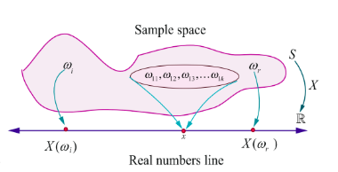
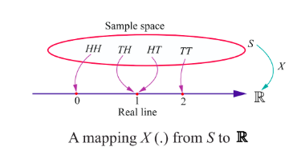
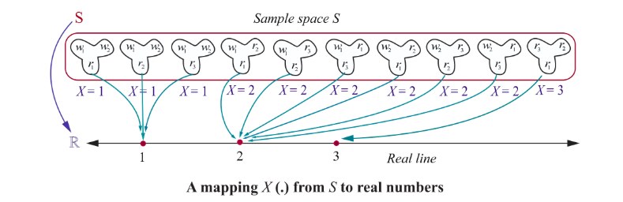

### 11.2 Random Variable

The outcome from a random experiment is not always a simple thing to represent in notion. In many random experiments that we have considered, the sample space $S$ has been a description of possible outcomes. That is the outcome of an experiment, or the points in the sample space $S$ , need not be numbers. For example in the random experiment of tossing a coin, the outcomes are $H$ (head) or $T$ (tail). It is necessary to deal with numerical values, in some situation, for outcomes of random experiment. Therefore, we assign a number to each outcome of the experiment say 1 to head and 0 to tail. Such an assignment of numerical values to the elements in $S$ is called a random variable. A random variable is a function. Thus, a random variable is:

> **Definition 11.1**
>
> A random variable $X$ is a function defined on a sample space $S$ into the real numbers $\mathbb{R}$ such that the inverse image of points or subset or interval of $\mathbb{R}$ is an event in $S$ , for which probability is assigned.

We use the capital letters of the alphabet, such as $X$ , $Y$ , and $Z$ to represent the random variables and the small letters, such as $x$ , $y$ , and $z$ to represent the possible values of the random variables.

Suppose $S = \{ \omega_1, \omega_2, \omega_3, \dots \}$ is the sample space of a random experiment and $\mathbb{R}$ denotes the real line. Then the random variable $X$ is a real valued function defined on $S$ and is denoted by $X : S \to \mathbb{R}$ . If $\omega$ is a sample point in $S$ , then $X(\omega)$ is a real number.

The range set is the collection of $X(\omega)$ such that $\omega \in S$ .

That is the range set denoted by $R_X = \{ X(\omega) \mid \omega \in S \}$ .

Fig 11.1 shows the mapping of some sample points $\omega_i$ or events of the *Sample space* $S$ on the *real line* $\mathbb{R}$ .

For instance, if $x$ is a possible value of $X$ for $\omega_{11}, \omega_{12}, \omega_{13}, \dots, \omega_{1k} \in S$ then $\{ \omega_{11}, \omega_{12}, \omega_{13}, \dots, \omega_{1k} \}$ is called inverse image of $x$ .

That is $X^{-1}(x) = \{ \omega_{11}, \omega_{12}, \omega_{13}, \dots, \omega_{1k} \}$ is an event in $S$ .

**Illustration 11.1**

Suppose a coin is tossed once. The sample space consists of two sample points $H$ (head) and $T$ (tail).

That is $S = \{ T, H \}$

Let $X : S \to \mathbb{R}$ be the number of heads

Then $X(T) = 0$ , and $X(H) = 1$ .

Thus $X$ is a random variable that takes on the values 0 and 1. If $X(\omega)$ denotes the number of heads, then

$X(\omega) = \begin{cases} 0 & \text{for } \omega = \text{Tail} \\ 1 & \text{for } \omega = \text{Head} \end{cases}$

**Example 11.1**

Suppose two coins are tossed once. If $X$ denotes the number of tails, (i) write down the sample space (ii) find the inverse image of 1 (iii) the values of the random variable and number of elements in its inverse images.

**Solution**

(i) The sample space $S = \{H, T\} \times \{H, T\}$

That is $S = \{TT, TH, HT, HH\}$

(ii) Let $X : S \to \mathbb{R}$ be the number of tails  
Then $X(TT) = 2$ (2 Tails)  
$X(TH) = 1$ (1 Tail)  
$X(HT) = 1$ (1 Tail)  
and $X(HH) = 0$ (0 Tails).

Then $X$ is a random variable that takes on the values 0, 1 and 2.  
Let $X(\omega)$ denote the number of tails, this gives

$X(\omega) = \begin{cases} 2 & \text{if } \omega = TT \\ 1 & \text{if } \omega = HT, TH \\ 0 & \text{if } \omega = HH \end{cases}$

The inverse images of 1 is $\{TH, HT\}$ . That is $X^{-1}(\{1\}) = \{TH, HT\}$ .

(iii) Number of elements in inverse images are shown in the table.

| Values of the Random Variable | 0 | 1 | 2 | Total |
| :--- | :--- | :--- | :--- | :--- |
| Number of elements in inverse image | 1 | 2 | 1 | 4 |

**Example 11.2**

Suppose a pair of unbiased dice is rolled once. If $X$ denotes the total score of two dice, write down  
(i) the sample space (ii) the values taken by the random variable $X$ , (iii) the inverse image of 10, and  
(iv) the number of elements in inverse image of $X$ .

**Solution**

(i) The sample space  
$S = \{1, 2, 3, 4, 5, 6\} \times \{1, 2, 3, 4, 5, 6\}$ ,  
consists of 36 ordered pairs $(\alpha, \beta)$ where $\alpha$ and $\beta$ can take any integer value between 1 and 6 as shown. $X$ is assigned to each point $(\alpha, \beta)$ the sum of the numbers on the dice.  
That is $X(\alpha, \beta) = \alpha + \beta$ .  

$S = \{(1,1), (1,2), (1,3), (1,4), (1,5), (1,6),$  
$\quad (2,1), (2,2), (2,3), (2,4), (2,5), (2,6),$  
$\quad (3,1), (3,2), (3,3), (3,4), (3,5), (3,6),$  
$\quad (4,1), (4,2), (4,3), (4,4), (4,5), (4,6),$  
$\quad (5,1), (5,2), (5,3), (5,4), (5,5), (5,6),$  
$\quad (6,1), (6,2), (6,3), (6,4), (6,5), (6,6)\}$

Therefore

$X(1,1) = 1 + 1 = 2$  
$X(1,2) = X(2,1) = 3$  
$X(1,3) = X(2,2) = X(3,1) = 4$  
$X(1,4) = X(2,3) = X(3,2) = X(4,1) = 5$  
$X(1,5) = X(2,4) = X(3,3) = X(4,2) = X(5,1) = 6$  
$X(1,6) = X(2,5) = X(3,4) = X(4,3) = X(5,2) = X(6,1) = 7$  
$X(2,6) = X(3,5) = X(4,4) = X(5,3) = X(6,2) = 8$  
$X(3,6) = X(4,5) = X(5,4) = X(6,3) = 9$  
$X(4,6) = X(5,5) = X(6,4) = 10$  
$X(5,6) = X(6,5) = 11$  
$X(6,6) = 12$ .

(ii) Then the random variable $X$ takes on the values 2, 3, 4, 5, 6, 7, 8, 9, 10, 11, 12.  
(iii) The inverse images of 10 is $\{ (4,6), (5,5), (6,4) \}$ .  
(iv) The number of inverse images are given below:

| Values of the random variable | 2 | 3 | 4 | 5 | 6 | 7 | 8 | 9 | 10 | 11 | 12 | Total |
| :--- | :--- | :--- | :--- | :--- | :--- | :--- | :--- | :--- | :--- | :--- | :--- | :--- |
| Number of elements in inverse image | 1 | 2 | 3 | 4 | 5 | 6 | 5 | 4 | 3 | 2 | 1 | 36 |

**Example 11.3**

An urn contains 2 white balls and 3 red balls. A sample of 3 balls are chosen at random from the urn. If $X$ denotes the number of red balls chosen, find the values taken by the random variable $X$ and its number of inverse images.

**Solution**

Let us denote white and red balls as $w_1, w_2, r_1, r_2,$ and $r_3$ .

The sample space consists of ${}^5C_3 = 10$ different samples of size 3.

That is $S = \{ w_1w_2r_1, w_1w_2r_2, w_1w_2r_3, w_1r_1r_2, w_1r_1r_3, w_2r_1r_2, w_2r_1r_3, w_2r_2r_3, w_2r_3r_3 \}$ .

The random variable $X$ takes on the values 1, 2, and 3.

| Values of the Random Variable $X$ | 1 | 2 | 3 | Total |
| :--- | :--- | :--- | :--- | :--- |
| Number of elements in inverse images | 3 | 6 | 1 | 10 |

> **Remark**
>
> If $X$ denotes the number of white balls, then $X$ takes on the values 0, 1, and 2 and the elements in inverse images are

| Values of the Random Variable $X$ | 0 | 1 | 2 | Total |
| :--- | :--- | :--- | :--- | :--- |
| Number of elements in inverse images | 1 | 6 | 3 | 10 |

**Illustration 11.2**

A batch of 150 students is taken in 4 buses to an excursion. There are 38 students in the first bus, 36 in second bus, 32 in the third bus, and the remaining students in the fourth bus. When the buses arrive at the destination, one of the 150 students is randomly chosen.

Suppose that $X$ denotes the number of students on the bus of that randomly chosen student. Then $X$ takes on the values 32, 36, 38, and 44.

**Example 11.4**

Two balls are chosen randomly from an urn containing 6 white and 4 black balls. Suppose that we win ₹ 30 for each black ball selected and we lose ₹ 20 for each white ball selected. If $X$ denotes the winning amount, find the values of $X$ and number of points in its inverse images.

**Solution**

The possible events of selection are (i) both balls may be black, or (ii) one white and one black or (iii) both are white. Therefore $X$ is a random variable that take the values,

$X$ (both are black balls) $= 2(30) = 60$

$X$ (one black and one white ball) $= 30 - 20 = 10$

$X$ (both are white balls) $= 2(-20) = -40$

Therefore $X$ takes on the values 60, 10, and -40.

> **Note**
>
> The inverse image of 60 is $\{b_1b_2, b_1b_3, b_1b_4, b_2b_3, b_2b_4, b_3b_4\}$ .

| Values of the Random Variable $X$ | 60 | 10 | -40 | Total |
| :--- | :--- | :--- | :--- | :--- |
| Number of elements in inverse images | 6 | 24 | 15 | 45 |

**Illustration 11.3**

A coin is tossed until head occurs.

The sample space is $S = \{H, TH, TTH, TTTH, \dots \}$ .

Suppose $X$ denotes the number of times the coin is tossed until head occurs.

Then the random variable $X$ takes on the values 1, 2, 3, $\dots$

**Illustration 11.4**

Suppose $N$ is the number of customers in the queue that arrive at a service desk during a time period, then the sample space should be the set of non-negative integers. That is $S = \{0, 1, 2, 3, \dots \}$ and $N$ is a random variable that takes on the values 0, 1, 2, 3, $\dots$

**Illustration 11.5**

If an experiment consists in observing the lifetime of an electrical bulb, then a sample space would be the life time of electrical bulb. Therefore the sample space is $S = [0, \infty)$ . Suppose $X$ denotes the lifetime of the bulb, then $X$ is a random variable that takes on the values in $[0, \infty)$ .

**Illustration 11.6**

Let $D$ be a disk of radius $r$ . Suppose a point is chosen at random in $D$ . Let $X$ denote the distance of the point from the centre. Then the sample space $S = D$ and $X$ is the random variable that takes on any number from 0 to $r$ . That is $X(\omega) \in [0, r]$ , for $\omega \in S$ .

**Exercise 11.1**

1. Suppose $X$ is the number of tails occurred when three fair coins are tossed once simultaneously. Find the values of the random variable $X$ and number of points in its inverse images.

2. An urn contains 5 mangoes and 4 apples. Three fruits are taken at random. If the number of apples taken is a random variable, then find the values of the random variable and number of points in its inverse images.

3. Two balls are chosen randomly from an urn containing 6 red and 8 black balls. Suppose that we win ₹15 for each red ball selected and we lose ₹10 for each black ball selected. If $X$ denotes the winning amount, find the values of $X$ and number of points in its inverse images.

4. A six sided die is marked '2' on one face, '3' on two of its faces, and '4' on remaining three faces. The die is thrown twice. If $X$ denotes the total score in two throws, find the values of the random variable and number of points in its inverse images.
