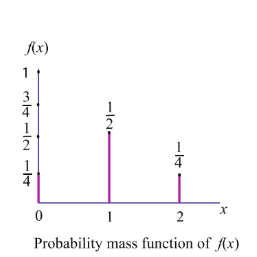
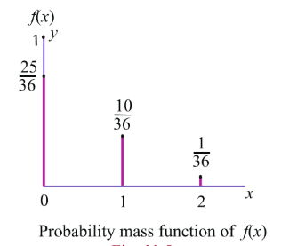
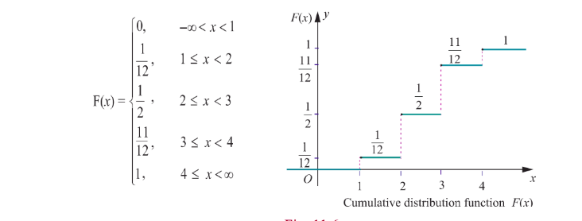
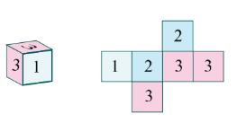
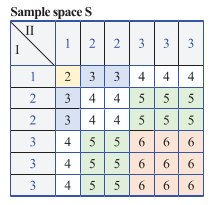
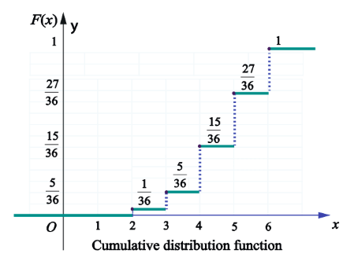
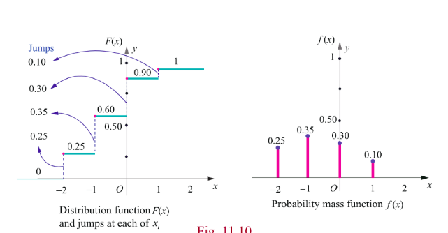

## 11.3 Types of Random Variable

In this chapter we shall restrict our study to two types of random variables, one is a random variable assuming at most a countable number of values and another is a random variable assuming the values continuously. That is

(i) Discrete Random variable (for counting the quantity)
(ii) Continuous Random variable (for measuring the quantity)

### 11.3.1 Discrete random variables

In this section we discuss

(i) Discrete random variables
(ii) Probability mass function
(iii) Cumulative distribution function.
(iv) Obtaining cumulative distribution function from probability mass function.
(v) Obtaining probability mass function from cumulative distribution function.

If the range set of the random variables is discrete set of numbers then the inverse image of random variable is either finite or countably infinite. Such a random variable is called discrete random variable. A random variable defined on a discrete sample space is discrete.

> **Definition 11.2 (Discrete Random Variable)**
>
> A random variable $X$ is defined on a sample space $S$ into the real numbers $\mathbb{R}$ is called discrete random variable if the range of $X$ is countable, that is, it can assume only a finite or countably infinite number of values, where every value in the set $S$ has positive probability with total one.

> **Remark**
>
> It is also possible to define a discrete random variable on continuous sample space. For instance,
>
> (i) for a continuous sample space $S = [0,1]$, the random variable defined by $X(\omega) = 10$ for all $\omega \in S$ is a discrete random variable.
>
> (ii) for a continuous sample space $S = [0,20]$, the random variable defined by
>
> $$
> X(\omega) = \begin{cases} 1 & \text{if } 0 \le \omega \le 5 \\ 2 & \text{if } 5 < \omega \le 10 \\ 3 & \text{if } 10 < \omega \le 20 \end{cases}
> $$
>
> is also a discrete random variable.

### 11.3.2 Probability Mass Function

The probability that a discrete random variable $X$ takes on a particular value $x$, that is $P(X = x)$, is frequently denoted by $f(x)$ or $p(x)$. The function $f(x)$ is typically called the probability mass function, although some authors also refer to it as the probability function or the frequency function. In this chapter, when the random variable is discrete, the common terminology the probability mass function is used and its common abbreviation is pmf.

> **Definition 11.3 (Probability mass function)**
>
> If $X$ is a discrete random variable with discrete values $x_1, x_2, x_3, \ldots, x_n, \ldots$, then the function denoted by $f(\cdot)$ or $p(\cdot)$ and defined by
>
> $ f(x_k) = P(X = x_k), \qquad \text{for } k = 1,2,3,\ldots n,\ldots $
>
> is called the probability mass function of $X$.

> **Theorem 11.1 (Without proof)**
>
> The function $f(x)$ is a probability mass function if and only if it satisfies the following properties for the set of real values $x_1, x_2, x_3, \ldots x_n, \ldots$
>
> (i) $f(x_k) \geq 0$ for $k = 1,2,3,\ldots n,\ldots$ and
> (ii) $\sum_{k} f(x_k) = 1$

> **Note:**
>
> (i) The set of probabilities $\{f(x_k) = P(X = x_k), \quad k = 1,2,3,\ldots n,\ldots\}$ is also known as probability distribution of discrete random variable.
>
> (ii) Since the random variable is a function, it can be presented
>
> (a) in tabular form
> (b) in graphical form and
> (c) in an expression form

**Example 11.5**

Two fair coins are tossed simultaneously (equivalent to a fair coin is tossed twice). Find the probability mass function for number of heads occurred.

**Solution**

The sample space $S = \{H,T\} \times \{H,T\}$
That is $S = \{TT, TH, HT, HH\}$.

Let $X$ be the random variable denoting the number of heads.

Therefore

$$
X(TT) = 0, \quad X(TH) = 1, \quad X(HT) = 1, \quad \text{and} \quad X(HH) = 2.
$$

Then the random variable $X$ takes on the values 0, 1 and 2.

| Values of the Random Variable | 0 | 1 | 2 | Total |
| :--- | :---: | :---: | :---: | :---: |
| Number of elements in inverse images | 1 | 2 | 1 | 4 |

The probabilities are given by

$$
f(0) = P(X = 0) = \frac{1}{4},
$$

$$
f(1) = P(X = 1) = \frac{1}{2}
$$

and

$$
f(2) = P(X = 2) = \frac{1}{4}.
$$

The function $f(x)$ satisfies the conditions

$$
f(x) \geq 0, \text{ for } x = 0,1,2
$$

$$
\sum_{x} f(x) = \sum_{x=0}^{2} f(x) = f(0) + f(1) + f(2) = \frac{1}{4} + \frac{1}{2} + \frac{1}{4} = 1
$$

Therefore $f(x)$ is a probability mass function.

The probability mass function is given by

| $x$ | 0 | 1 | 2 |
| :--- | :---: | :---: | :---: |
| $f(x)$ | $1/4$ | $1/2$ | $1/4$ |

(or)

$f(x) = \begin{cases} \frac{1}{4} & \text{for } x = 0 \\ \frac{1}{2} & \text{for } x = 1 \\ \frac{1}{4} & \text{for } x = 2 \end{cases}$

**Example 11.6**

A pair of fair dice is rolled once. Find the probability mass function to get the number of fours.

**Solution**

Let $X$ be a random variable whose values $x$ are the number of fours.
The sample space $S$ is given in the table.

It can also be written as

$$
S = \left\{ \begin{array}{ll} (1,1), (1,2), (1,3), (1,4), (1,5), (1,6) \\ (2,1), (2,2), (2,3), (2,4), (2,5), (2,6) \\ (3,1), (3,2), (3,3), (3,4), (3,5), (3,6) \\ (4,1), (4,2), (4,3), (4,4), (4,5), (4,6) \\ (5,1), (5,2), (5,3), (5,4), (5,5), (5,6) \\ (6,1), (6,2), (6,3), (6,4), (6,5), (6,6) \end{array} \right\}
$$

$S = \{(i,j)\}$, where $i = 1,2,3,\ldots,6$ and $j = 1,2,3,\ldots,6$.

Therefore $X$ takes on the values of 0, 1, and 2.

We observe that

(i) $X = 0$, if $(i,j)$ for $i \neq 4, j \neq 4$

(ii) $X = 1$, if $(1,4),(2,4),(3,4),(5,4),(6,4),(4,1),(4,2),(4,3),(4,5),(4,6)$

(iii) $X = 2$, if $(4,4)$

Therefore,

| Values of the Random Variable $X$ | 0 | 1 | 2 | Total |
| :--- | :---: | :---: | :---: | :---: |
| Number of elements in inverse images | 25 | 10 | 1 | 36 |

The probabilities are

$$
f(0) = P(X = 0) = \frac{25}{36},
$$

$$
f(1) = P(X = 1) = \frac{10}{36}
$$

and

$$
f(2) = P(X = 2) = \frac{1}{36}.
$$

Clearly the function $f(x)$ satisfies the conditions

(i) $f(x) \geq 0$, for $x = 0,1,2$ and

(ii) $\sum_{x} f(x) = \sum_{x=0}^{2} f(x) = f(0) + f(1) + f(2) = \frac{25}{36} + \frac{10}{36} + \frac{1}{36} = 1$.

The probability mass function is presented as

| $x$ | 0 | 1 | 2 |
| :--- | :---: | :---: | :---: |
| $f(x)$ | $25/36$ | $10/36$ | $1/36$ |

$$
f(x) = \begin{cases} \frac{25}{36} & \text{for } x = 0 \\ \frac{10}{36} & \text{for } x = 1 \\ \frac{1}{36} & \text{for } x = 2 \end{cases}
$$

#### 11.3.3 Cumulative Distribution Function or Distribution Function

There are many situations to compute the probability that the observed value of a random variable $X$ will be less than or equal to some real number $x$. Writing $F(x) = P(X \leq x)$ for every real number $x$, we call $F(x)$ the cumulative distribution function or distribution function of the random variable $X$ and its common abbreviation is cdf.

> **Definition 11.4 (Cumulative distribution function)**
>
> The cumulative distribution function $F(x)$ of a discrete random variable $X$, taking the values $x_1, x_2, x_3, \ldots$ such that $x_1 < x_2 < x_3 < \dots$ with probability mass function $f(x_i)$ is
>
> $ F(x) = P(X \leq x) = \sum_{x_i \leq x} f(x_i), \qquad x \in \mathbb{R} $

The distribution function of a discrete random variable is known as Discrete Distribution Function. Although, the probability mass function $f(x)$ is defined only for a set of discrete values $x_1, x_2, x_3, \ldots$ the cumulative distribution function $F(x)$ is defined for all real values of $x \in \mathbb{R}$.

We can compute the cumulative distribution function using the probability mass function

$$
F(x) = P(X \leq x) = \sum_{x_i \leq x} f(x_i) = \sum_{x_i \leq x} P(X = x_i)
$$

If $X$ takes only a finite number of values $x_1, x_2, x_3, \ldots, x_n$, where $x_1 < x_2 < x_3 < \ldots < x_n$, then the cumulative distribution function is given by

$$
F(x) = \begin{cases}
0 & \text{for } -\infty < x < x_1 \\
f(x_1) & \text{for } x_1 \le x < x_2 \\
f(x_1) + f(x_2) & \text{for } x_2 \le x < x_3 \\
\vdots & \vdots \\
f(x_1) + f(x_2) + \cdots + f(x_n) & \text{for } x_n \le x < \infty
\end{cases}
$$

For a discrete random variable $X$, the cumulative distribution function satisfies the following properties.

(i) $0 \leq F(x) \leq 1$, for all $x \in \mathbb{R}$.

(ii) $F(x)$ is real valued non-decreasing function (if $x < y$, then $F(x) \leq F(y)$).

(iii) $F(x)$ is right continuous function $\left(\lim_{x \to a^{+}} F(x) = F(a)\right)$.

(iv) $\lim_{x \to -\infty} F(x) = 0$.

(v) $\lim_{x \to +\infty} F(x) = 1$.

(vi) $P(x_1 < X \leq x_2) = F(x_2) - F(x_1)$.

(vii) $P(X > x) = 1 - P(X \leq x) = 1 - F(x)$.

(viii) $P(X = x_k) = F(x_k) - F(x_k^{-})$.

> **Note**
>
> Some authors use left continuity in the definition of a cumulative distribution function $F(x)$, instead of right continuity.

### 11.3.4 Cumulative Distribution Function from Probability Mass function

Both the probability mass function and the cumulative distribution function of a discrete random variable $X$ contain all the probabilistic information of $X$. The probability distribution of $X$ is determined by either of them. In fact, the distribution function $F$ of a discrete random variable $X$ can be expressed in terms of the probability mass function $f(x)$ of $X$ and vice versa.

**Example 11.7**

If the probability mass function $f(x)$ of a random variable $X$ is

| $x$ | 1 | 2 | 3 | 4 |
| :--- | :---: | :---: | :---: | :---: |
| $f(x)$ | $1/12$ | $5/12$ | $5/12$ | $1/12$ |

find (i) its cumulative distribution function, hence find (ii) $P(X \leq 3)$ and, (iii) $P(X \geq 2)$.

**Solution**

(i) By definition the cumulative distribution function for discrete random variable is $F(x) = P(X \leq x) = \sum_{x_i \leq x} P(X = x_i)$.

- For $x < 1$, $F(x) = 0$.
- For $1 \le x < 2$, $F(x) = P(X = 1) = \frac{1}{12}$.
- For $2 \le x < 3$, $F(x) = P(X = 1) + P(X = 2) = \frac{1}{12} + \frac{5}{12} = \frac{6}{12} = \frac{1}{2}$.
- For $3 \le x < 4$, $F(x) = P(X = 1) + P(X = 2) + P(X = 3) = \frac{1}{12} + \frac{5}{12} + \frac{5}{12} = \frac{11}{12}$.
- For $x \ge 4$, $F(x) = P(X = 1) + P(X = 2) + P(X = 3) + P(X = 4) = 1$.

Therefore the cumulative distribution function is

(ii) $P(X \leq 3) = F(3) = \frac{11}{12}$.
(iii) $P(X \geq 2) = 1 - P(X < 2) = 1 - P(X = 1) = 1 - \frac{1}{12} = \frac{11}{12}$.

**Example 11.8**

A six sided die is marked '1' on one face, '2' on two of its faces, and '3' on remaining three faces. The die is rolled twice. If $X$ denotes the total score in two throws.

(i) Find the probability mass function.  
(ii) Find the cumulative distribution function.  
(iii) Find $P(3 \leq X < 6)$ .  
(iv) Find $P(X \geq 4)$ .

**Solution:**

Since $X$ denotes the total score in two throws, it takes on the values 2, 3, 4, 5, and 6.  
From the Sample space $S$ , we have

| Values of the Random Variable | 2 | 3 | 4 | 5 | 6 | Total |
| :--- | :--- | :--- | :--- | :--- | :--- | :--- |
| Number of elements in inverse images | 1 | 4 | 10 | 12 | 9 | 36 |

$P(X = 2) = \frac{1}{36}$ , $P(X = 3) = \frac{4}{36}$

$P(X = 4) = \frac{10}{36}$ , $P(X = 5) = \frac{12}{36}$ , and

$P(X = 6) = \frac{9}{36}$ .

**(i) Probability mass function is**

| $x$ | 2 | 3 | 4 | 5 | 6 |
| :--- | :--- | :--- | :--- | :--- | :--- |
| $f(x)$ | $\frac{1}{36}$ | $\frac{4}{36}$ | $\frac{10}{36}$ | $\frac{12}{36}$ | $\frac{9}{36}$ |

**(ii) Cumulative distribution function**

By definition of the cumulative distribution function for discrete random variable we have

$F(x) = P(X \leq x) = \sum_{x_i \leq x} P(X = x_i)$ ,

$P(X < x) = 0$ for $-\infty < X < 2$ .

$F(2) = P(X \leq 2) = \sum_{-\infty}^{2} P(X = x) = P(X < 2) + P(X = 2) = 0 + \frac{1}{36} = \frac{1}{36}$ .

$F(3) = P(X \leq 3) = \sum_{-\infty}^{3} P(X = x) = P(X < 2) + P(X = 2) + P(X = 3) = 0 + \frac{1}{36} + \frac{4}{36} = \frac{5}{36}$ .

$F(4) = P(X \leq 4) = \sum_{-\infty}^{4} P(X = x) = P(X < 2) + P(X = 2) + P(X = 3) + P(X = 4)$

$= 0 + \frac{1}{36} + \frac{4}{36} + \frac{10}{36} = \frac{15}{36}$ .

$F(5) = P(X \leq 5) = \sum_{-\infty}^{5} P(X = x) = P(X < 2) + P(X = 2) + P(X = 3) + P(X = 4) + P(X = 5)$

$= 0 + \frac{1}{36} + \frac{4}{36} + \frac{10}{36} + \frac{12}{36} = \frac{27}{36}$ .

$F(6) = P(X \leq 6) = \sum_{x=0}^{6} P(X = x)$

$= P(X < 2) + P(X = 2) + P(X = 3) + P(X = 4) + P(X = 5) + P(X = 6)$

$= 0 + \frac{1}{36} + \frac{4}{36} + \frac{10}{36} + \frac{12}{36} + \frac{9}{36} = 1$ .

Therefore the cumulative distribution function is

$$
F(x) = \begin{cases}
0 & \text{for } -\infty < x < 2 \\
\frac{1}{36} & \text{for } 2 \leq x < 3 \\
\frac{5}{36} & \text{for } 3 \leq x < 4 \\
\frac{15}{36} & \text{for } 4 \leq x < 5 \\
\frac{27}{36} & \text{for } 5 \leq x < 6 \\
1 & \text{for } 6 \leq x < \infty
\end{cases}
$$

(iii) $P(3 \leq X < 6) = \sum_{x=3}^{5} P(X = x) = P(X = 3) + P(X = 4) + P(X = 5)$

$= \frac{4}{36} + \frac{10}{36} + \frac{12}{36} = \frac{26}{36}$ .

(iv) $P(X \geq 4) = \sum_{x=4}^{\infty} P(X = x)$

$= P(X = 4) + P(X = 5) + P(X = 6)$

$= \frac{10}{36} + \frac{12}{36} + \frac{9}{36} = \frac{31}{36}$ .

### 11.3.5 Probability Mass Function from Cumulative Distribution Function

For a discrete random variable $X$, the cumulative distribution function $F$ has jumps at each of the $x_i$, and is constant between successive $x_i$'s. The height of the jump at $x_i$ is $f(x_i)$; in this way the probability at $x_i$ can be retrieved from $F$.

Suppose $X$ is a discrete random variable taking the values $x_1, x_2, x_3, \ldots$ such that $x_1 < x_2 < x_3 \dots$ and $F(x_i)$ is the distribution function. Then the probability mass function $f(x_i)$ is given by

$$
f(x_i) = F(x_i) - F(x_{i-1}), \quad i = 1,2,3,\ldots
$$

> **Note**
>
> The jump of a function $F(x)$ at $x = a$ is $|F(a^{+}) - F(a^{-})|$. Since $F$ is non-decreasing and continuous to the right, the jump of a cumulative distribution function $F$ is $P(X = x) = F(x) - F(x^{-})$.
>
> Here the jump (because of discontinuity) acts as a probability. That is, the set of discontinuities of a cumulative distribution function is at most countable!

**Example 11.9**

Find the probability mass function $f(x)$ of the discrete random variable $X$ whose cumulative distribution function $F(x)$ is given by

$$
F(x) = \begin{cases}
0 & \text{for } x < -2 \\
0.25 & \text{for } -2 \le x < -1 \\
0.60 & \text{for } -1 \le x < 0 \\
0.90 & \text{for } 0 \le x < 1 \\
1 & \text{for } x \ge 1
\end{cases}
$$

Also find (i) $P(X < 0)$ and (ii) $P(X \geq -1)$.

**Solution**

Since $X$ is a discrete random variable, from the given data, $X$ takes on the values $-2, -1, 0$ and $1$.

For discrete random variable $X$, by definition, we have $f(x) = P(X = x)$.

Therefore left hand limit of $F(x)$ at $x = -2$ is $F(-2^{-})$.

$$
f(-2) = P(X = -2) = F(-2) - F(-2^{-}) = 0.25 - 0 = 0.25.
$$

Similarly for other jump points, we have

$$
f(-1) = P(X = -1) = F(-1) - F(-2) = 0.60 - 0.25 = 0.35.
$$

$$
f(0) = P(X = 0) = F(0) - F(-1) = 0.90 - 0.60 = 0.30,
$$

$$
f(1) = P(X = 1) = F(1) - F(0) = 1 - 0.90 = 0.10.
$$

Therefore the probability mass function is

| $x$ | -2 | -1 | 0 | 1 |
| :--- | :---: | :---: | :---: | :---: |
| $f(x)$ | 0.25 | 0.35 | 0.30 | 0.10 |

The distribution function $F(x)$ has jumps at $x = -2, -1, 0$ and $1$. The jumps are respectively 0.25, 0.35, 0.30, and 0.1 is shown in the figure given below.

These jumps determine the probability mass function.

$$
P(X < 0) = \sum_{x=-2}^{-1} P(X = x) = P(X = -2) + P(X = -1) = 0.25 + 0.35 = 0.60.
$$

$$
P(X \geq -1) = \sum_{-1}^{1} P(X = x) = P(X = -1) + P(X = 0) + P(X = 1) = 0.35 + 0.30 + 0.10 = 0.75.
$$

**Example 11.10**

A random variable $X$ has the following probability mass function.

| $x$ | 1 | 2 | 3 | 4 | 5 | 6 |
| :--- | :---: | :---: | :---: | :---: | :---: | :---: |
| $f(x)$ | $k$ | $2k$ | $6k$ | $5k$ | $6k$ | $10k$ |

Find (i) $P(2 < X < 6)$ (ii) $P(2 \leq X < 5)$ (iii) $P(X \leq 4)$ (iv) $P(3 < X)$

**Solution**

Since the given function is a probability mass function, the total probability is one. That is $\sum_{x} f(x) = 1$.

From the given data $k + 2k + 6k + 5k + 6k + 10k = 1$.

$$
30k = 1 \Rightarrow k = \frac{1}{30}
$$

Therefore the probability mass function is

| $x$ | 1 | 2 | 3 | 4 | 5 | 6 |
| :--- | :---: | :---: | :---: | :---: | :---: | :---: |
| $f(x)$ | $1/30$ | $2/30$ | $6/30$ | $5/30$ | $6/30$ | $10/30$ |

$$
P(2 < X < 6) = f(3) + f(4) + f(5) = \frac{6}{30} + \frac{5}{30} + \frac{6}{30} = \frac{17}{30}.
$$

$$
P(2 \leq X < 5) = f(2) + f(3) + f(4) = \frac{2}{30} + \frac{6}{30} + \frac{5}{30} = \frac{13}{30}.
$$

$$
P(X \leq 4) = f(1) + f(2) + f(3) + f(4) = \frac{1}{30} + \frac{2}{30} + \frac{6}{30} + \frac{5}{30} = \frac{14}{30}.
$$

$$
P(3 < X) = f(4) + f(5) + f(6) = \frac{5}{30} + \frac{6}{30} + \frac{10}{30} = \frac{21}{30}.
$$

**Exercise 11.2**

1. Three fair coins are tossed simultaneously. Find the probability mass function for number of heads occurred.

2. A six sided die is marked '1' on one face, '3' on two of its faces, and '5' on remaining three faces. The die is thrown twice. If $X$ denotes the total score in two throws, find

(i) the probability mass function
(ii) the cumulative distribution function
(iii) $P(4 \leq X < 10)$
(iv) $P(X \geq 6)$

3. Find the probability mass function and cumulative distribution function of number of girl child in families with 4 children, assuming equal probabilities for boys and girls.

4. Suppose a discrete random variable can only take the values 0, 1, and 2. The probability mass function is defined by

$$
f(x) = \begin{cases}
k & \text{for } x = 0 \\
2k & \text{for } x = 1 \\
3k & \text{for } x = 2
\end{cases}
$$

Find (i) the value of $k$ (ii) cumulative distribution function (iii) $P(X \geq 1)$

5. The cumulative distribution function of a discrete random variable is given by

$$
F(x) = \begin{cases}
0 & \text{for } x < 0 \\
0.2 & \text{for } 0 \le x < 1 \\
0.5 & \text{for } 1 \le x < 2 \\
0.9 & \text{for } 2 \le x < 3 \\
1 & \text{for } x \ge 3
\end{cases}
$$

Find (i) the probability mass function (ii) $P(X < 1)$ and (iii) $P(X \geq 2)$

6. A random variable $X$ has the following probability mass function.

| $x$ | 1 | 2 | 3 | 4 | 5 |
| :--- | :---: | :---: | :---: | :---: | :---: |
| $f(x)$ | $k^2$ | $2k^2$ | $3k^2$ | $2k$ | $3k$ |

Find (i) the value of $k$ (ii) $P(2 \leq X < 5)$ (iii) $P(3 < X)$

7. The cumulative distribution function of a discrete random variable is given by

$$
F(x) = \begin{cases}
0 & \text{for } x < 0 \\
\frac{1}{4} & \text{for } 0 \le x < 1 \\
\frac{1}{2} & \text{for } 1 \le x < 2 \\
\frac{3}{4} & \text{for } 2 \le x < 3 \\
1 & \text{for } x \ge 3
\end{cases}
$$

Find (i) the probability mass function (ii) $P(X < 3)$ and (iii) $P(X \geq 2)$
