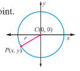
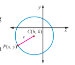
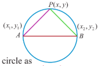
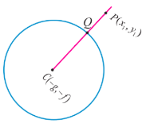
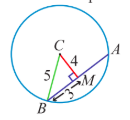
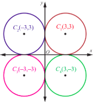
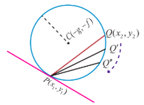
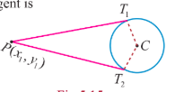

## 5.2 Circle

The word circle is of Greek origin and reference to circles is found as early as 1700 BC (BCE). In Nature circles would have been observed, such as the Moon, Sun, and ripples in water. The circle is the basis for the wheel, which, with related inventions such as gears, makes much of modern machinery possible. In mathematics, the study of the circle has helped to inspire the development of geometry, astronomy and calculus. In Bohr- Sommerfeld theory of the atom, electron orbit is modelled as circle.

> **Definition 5.1**
>
> A circle is the locus of a point in a plane which moves such that its distance from a fixed point in the plane is always a constant.
>
> The fixed point is called the centre and the constant distance is called radius of the circle.

### 5.2.1 Equation of a circle in standard form

(i) Equation of circle with centre $(0,0)$ and radius $r$

Let the centre be $C(0,0)$ and radius be $r$ and $P(x,y)$ be the moving point.

Note that the point $P$ having coordinates $(x,y)$ is represented as $P(x,y)$

$\mathrm{Then},CP = r\mathrm{~and~so~}CP^2 = r^2$

Therefore $(x - 0)^2 + (y - 0)^2 = r^2$

That is $x^2 + y^2 = r^2$

This is the equation of the circle with centre $(0,0)$ and radius $r$ .

(ii) Equation of circle with centre $(h,k)$ and radius $r$

Let the centre be $C(h,k)$ and $r$ be the radius and $P(x,y)$ be the moving point.

Then, $CP = r$ and so $CP^{2} = r^{2}$ .

That is, $(x - h)^{2} + (y - k)^{2} = r^{2}$ . This is the equation of the circle in $P(x,y)$ Standard form, which is also known as centre- radius form.

Expanding the equation, we get

$x^{2} + y^{2} - 2hx - 2ky + h^{2} + k^{2} - r^{2} = 0$.

Taking $2g = - 2h$, $2f = - 2k$, $c = h^{2} + k^{2} - r^{2}$ , the equation takes the form

$x^{2} + y^{2} + 2gx + 2fy + c = 0$ , called the general form of a circle.

The equation $x^{2} + y^{2} + 2gx + 2fy + c = 0$ is a second degree equation in $x$ and $y$ possessing the following characteristics:

(i) It is a second degree equation in $x$ and $y$

(ii) coefficient of $x^{2} =$ coefficient of $y^{2}\neq 0$

(iii) coefficient of $xy = 0$

Conversely, we prove that an equation possessing these three characteristics, always represents a circle. Let

$$
ax^{2} + ay^{2} + 2g^{\prime}x + 2f^{\prime}y + c = 0 \quad (1)
$$

be a second degree equation in $x$ and $y$ having characteristics (i), (ii) and (iii), $a\neq 0$ . Dividing (1) by $a$ , gives

$$
x^{2} + y^{2} + \frac{2g^{\prime}}{a} x + \frac{2f^{\prime}}{a} y + \frac{c^{\prime}}{a} = 0. \quad (2)
$$

Taking $\frac{g^{\prime}}{a} = g$, $\frac{f^{\prime}}{a} = f$ and $\frac{c^{\prime}}{a} = c$ , equation (2) becomes $x^{2} + y^{2} + 2gx + 2fy + c = 0$

Adding and subtracting $g^{2}$ and $f^{2}$ , we get $x^{2} + 2gx + g^{2} + y^{2} + 2fy + f^{2} - g^{2} - f^{2} + c = 0$

$$
\Rightarrow (x + g)^{2} + (y + f)^{2} = g^{2} + f^{2} - c
$$

$$
\Rightarrow (x - (-g))^{2} + (y - (-f))^{2} = \left(\sqrt{g^{2} + f^{2} - c}\right)^{2}
$$

This is in the standard form of a circle with centre $C(- g, - f)$ and radius $r = \sqrt{g^{2} + f^{2} - c}$ . Hence equation (1) represents a circle with centre $(- g, - f) = \left(\frac{- g^{\prime}}{a},\frac{- f^{\prime}}{a}\right)$ and radius $= \sqrt{g^{2} + f^{2} - c} = \frac{1}{a}\sqrt{g^{2} + f^{2} - c^{\prime}a}$ .

> **Note**
>
> The equation of the circle $x^{2} + y^{2} + 2gx + 2fy + c = 0$ with centre $(- g, - f)$ and radius $\sqrt{g^{2} + f^{2} - c}$ represents.
>
> (i) a real circle if $g^{2} + f^{2} - c > 0$ .
>
> (ii) a point circle if $g^{2} + f^{2} - c = 0$ .
>
> (iii) an imaginary circle if $g^{2} + f^{2} - c< 0$ with no locus.

**Example 5.1**

Find the general equation of a circle with centre $(- 3, - 4)$ and radius 3 units.

**Solution**

$$
\begin{aligned}
&\text{Equation of the circle in standard form is } (x - h)^{2} + (y - k)^{2} = r^{2} \\
&\Rightarrow (x - (-3))^{2} + (y - (-4))^{2} = 3^{2} \\
&\Rightarrow (x + 3)^{2} + (y + 4)^{2} = 3^{2} \\
&\Rightarrow x^{2} + y^{2} + 6x + 8y + 16 = 0.
\end{aligned}
$$

> **Theorem 5.1**
>
> The circle passing through the points of intersection (real or imaginary) of the line $lx + my + n = 0$ and the circle $x^{2} + y^{2} + 2gx + 2fy + c = 0$ is the circle of the form $x^{2} + y^{2} + 2gx + 2fy + c + \lambda (lx + my + n) = 0$, $\lambda \in \mathbb{R}$.

**Proof**

Let the circle be $S : x^{2} + y^{2} + 2gx + 2fy + c = 0$ (1) and the line be $L : lx + my + n = 0$ (2)

Consider $S + \lambda L = 0$ . That is $x^{2} + y^{2} + 2gx + 2fy + c + \lambda (lx + my + n) = 0$ (3)

Grouping the terms of $x,y$ and constants, we get

$x^{2} + y^{2} + x(2g + \lambda l) + y(2f + \lambda m) + c + \lambda n = 0$ which is a second degree equation in $x$ and $y$ with coefficients of $x^{2}$ and $y^{2}$ equal and there is no $xy$ term.

If $(\alpha ,\beta)$ is a point of intersection of $S$ and $L$ satisfying equation (1) and (2), then it satisfies equation (3).

Hence $S + \lambda L = 0$ represents the required circle.

**Example 5.2**

Find the equation of the circle described on the chord $3x + y + 5 = 0$ of the circle $x^{2} + y^{2} = 16$ as diameter.

**Solution**

Equation of the circle passing through the points of intersection of the chord and circle by Theorem 5.1 is $x^{2} + y^{2} - 16 + \lambda (3x + y + 5) = 0$ .

The chord $3x + y + 5 = 0$ is a diameter of this circle if the centre $\left(\frac{- 3\lambda}{2}, \frac{-\lambda}{2}\right)$ lies on the chord.

So, we have $3\left(\frac{-3\lambda}{2}\right) - \frac{\lambda}{2} + 5 = 0$ ,

$\Rightarrow \frac{-9\lambda}{2} - \frac{\lambda}{2} + 5 = 0$ ,

$\Rightarrow -5\lambda + 5 = 0$ ,

$\Rightarrow \lambda = 1$ .

Therefore, the equation of the required circle is $x^{2} + y^{2} + 3x + y - 11 = 0$ .

**Example 5.3**

Determine whether $x + y - 1 = 0$ is the equation of a diameter of the circle $x^{2} + y^{2} - 6x + 4y + c = 0$ for all possible values of $c$ .

**Solution**

Centre of the circle is $(3, - 2)$ which lies on $x + y - 1 = 0$ . So the line $x + y - 1 = 0$ passes through the centre and therefore the line $x + y - 1 = 0$ is a diameter of the circle for all possible values of $c$ .

> **Theorem 5.2**
>
> The equation of a circle with $(x_{1},y_{1})$ and $(x_{2},y_{2})$ as extremities of one of the diameters of the circle is $(x - x_{1})(x - x_{2}) + (y - y_{1})(y - y_{2}) = 0$ .

**Proof**

Let $A(x_{1},y_{1})$ and $B(x_{2},y_{2})$ be the two extremities of the diameter $AB$ , and $P(x,y)$ be any point on the circle. Then $\angle APB = \frac{\pi}{2}$ (angle in a semi- circle).

Therefore, the product of slopes of $AP$ and $PB$ is equal to $- 1$ .

That is, $\left(\frac{(y - y_{1})}{(x - x_{1})}\right)\left(\frac{(y - y_{2})}{(x - x_{2})}\right) = - 1$ yielding the equation of the required circle as

$$
(x - x_{1})(x - x_{2}) + (y - y_{1})(y - y_{2}) = 0.
$$

**Example 5.4**

Find the general equation of the circle whose diameter is the line segment joining the points $(- 4, - 2)$ and $(1,1)$ .

**Solution**

Equation of the circle with end points of the diameter as $(x_{1},y_{1})$ and $(x_{2},y_{2})$ given in theorem 5.2 is

$$
(x - x_{1})(x - x_{2}) + (y - y_{1})(y - y_{2}) = 0
$$

$$
\Rightarrow (x + 4)(x - 1) + (y + 2)(y - 1) = 0
$$

$\Rightarrow x^{2} + y^{2} + 3x + y - 6 = 0$ which is the required equation of the circle.

> **Theorem 5.3**
>
> The position of a point $P(x_{1},y_{1})$ with respect to a given circle $x^{2} + y^{2} + 2g x + 2f y + c = 0$ in the plane containing the circle is outside or on or inside the circle according as $x_{1}^{2} + y_{1}^{2} + 2g x_{1} + 2f y_{1} + c$ is $> 0$, $= 0$, or $< 0$.

**Proof**

Equation of the circle is $x^2 + y^2 + 2gx + 2fy + c = 0$ with centre $C(-g, -f)$ and radius $r = \sqrt{g^2 + f^2 - c}$ .

Let $P(x_1, y_1)$ be a point in the plane. Join $CP$ and let it meet the circle at $Q$ . Then the point $P$ is outside, on or within the circle according as

$|CP|$ is $\begin{cases} >|CQ| & \text{or,} \\ =|CQ| & \text{or,} \\ <|CQ| & \end{cases}$

$\Rightarrow \quad CP^2$ is $\begin{cases} > r^2 & \text{or,} \\ = r^2 & \text{or} \\ < r^2 . \end{cases}$ $\{ CQ = r \}$ ,

$\Rightarrow \quad (x_1 + g)^2 + (y_1 + f)^2$ is $\begin{cases} > g^2 + f^2 - c & \text{or,} \\ = g^2 + f^2 - c & \text{or,} \\ < g^2 + f^2 - c . \end{cases}$

$\Rightarrow \quad x_1^2 + y_1^2 + 2gx_1 + 2fy_1 + c$ is $\begin{cases} > 0 & \text{or,} \\ = 0 & \text{or,} \\ < 0 . \end{cases}$

**Example 5.5**

Examine the position of the point $(2, 3)$ with respect to the circle $x^2 + y^2 - 6x - 8y + 12 = 0$ .

**Solution**

Taking $(x_1, y_1)$ as $(2, 3)$ , we get

$x_1^2 + y_1^2 + 2gx_1 + 2fy_1 + c = 2^2 + 3^2 - 6 \times 2 - 8 \times 3 + 12$ ,

$= 4 + 9 - 12 - 24 + 12 = -11 < 0$ .

Therefore, the point $(2, 3)$ lies inside the circle, by theorem 5.3.

**Example 5.6**

The line $3x + 4y - 12 = 0$ meets the coordinate axes at $A$ and $B$ . Find the equation of the circle drawn on $AB$ as diameter.

**Solution**

Writing the line $3x + 4y = 12$ , in intercept form yields $\frac{x}{4} + \frac{y}{3} = 1$ . Hence the points $A$ and $B$ are $(4, 0)$ and $(0, 3)$ .

Equation of the circle in diameter form is

$(x - x_1)(x - x_2) + (y - y_1)(y - y_2) = 0$

$(x - 4)(x - 0) + (y - 0)(y - 3) = 0$

$x^2 + y^2 - 4x - 3y = 0$ .

**Example 5.7**

A line $3x + 4y + 10 = 0$ cuts a chord of length 6 units on a circle with centre of the circle $(2, 1)$ . Find the equation of the circle in general form.

**Solution**

$C(2, 1)$ is the centre and $3x + 4y + 10 = 0$ cuts a chord $AB$ on the circle. Let $M$ be the midpoint of $AB$ . Then we have $AM = BM = 3$ . Now $BMC$ is a right triangle.

So, we have $CM = \frac{|3(2) + 4(1) + 10|}{\sqrt{3^2 + 4^2}} = 4$ .

By Pythagoras theorem $BC^2 = BM^2 + MC^2 = 3^2 + 4^2 = 25$ .

$BC = 5 = \text{radius.}$

So, the equation of the required circle is $(x-2)^2 + (y-1)^2 = 5^2$

$x^2 + y^2 - 4x - 2y - 20 = 0$ .

**Example 5.8**

A circle of radius 3 units touches both the axes. Find the equations of all possible circles formed in the general form.

**Solution**

As the circle touches both the axes, the distance of the centre from both the axes is 3 units, centre can be $(\pm 3,\pm 3)$ and hence there are four circles with radius 3, and the required equations of the four circles are $x^{2} + y^{2}\pm 6x\pm 6y + 9 = 0$

**Example 5.9**

Find the centre and radius of the circle $3x^{2} + (a + 1)y^{2} + 6x - 9y + a + 4 = 0$

**Solution**

Coefficient of $x^{2} =$ Coefficient of $y^{2}$ (characteristic (ii) for a second degree equation to represent a circle).

That is, $3 = a + 1$ and $a = 2$

Therefore, the equation of the circle is

$$
3x^{2} + 3y^{2} + 6x - 9y + 6 = 0
$$

$$
x^{2} + y^{2} + 2x - 3y + 2 = 0
$$

So, centre is $\left(-1,\frac{3}{2}\right)$ and radius $r = \sqrt{1 + \frac{9}{4} - 2} = \frac{\sqrt{5}}{2}$.

**Example 5.10**

Find the equation of the circle passing through the points (1,1), (2, $- 1)$ , and (3,2).

**Solution**

Let the general equation of the circle be

$$
x^{2} + y^{2} + 2gx + 2fy + c = 0. \quad (1)
$$

It passes through points (1,1), (2, $- 1)$ and (3,2).

Therefore, $2g + 2f + c = - 2$ (2)

$4g - 2f + c = -5$, (3)

$6g + 4f + c = -13$. (4)

(2) - (3) gives $-2g + 4f = 3$ (5)

(4) - (3) gives $2g + 6f = -8$ (6)

(5) + (6) gives $f = -\frac{1}{2}$

Substituting $f = -\frac{1}{2}$ in (6), $g = -\frac{5}{2}$ .

Substituting $f = -\frac{1}{2}$ and $g = -\frac{5}{2}$ in (2), $c = 4$ .

Therefore, the required equation of the circle is

$x^2 + y^2 + 2\left(-\frac{5}{2}\right)x + 2\left(-\frac{1}{2}\right)y + 4 = 0$

$\Rightarrow x^2 + y^2 - 5x - y + 4 = 0$ .

> **Note**
>
> Three points on a circle determine the equation to the circle uniquely. Conversely three equidistant points from a centre point forms a circle.

### 5.2.2 Equations of tangent and normal at a point $P$ on a given circle

Tangent of a circle is a line which touches the circle at only one point and normal is a line perpendicular to the tangent and passing through the point of contact.

Let $P(x_1, y_1)$ and $Q(x_2, y_2)$ be two points on the circle $x^2 + y^2 + 2gx + 2fy + c = 0$ .

Therefore,

$x_1^2 + y_1^2 + 2gx_1 + 2fy_1 + c = 0$ $\dots$ (1)

and

$x_2^2 + y_2^2 + 2gx_2 + 2fy_2 + c = 0$ $\dots$ (2)

(2) – (1) gives

$x_2^2 - x_1^2 + y_2^2 - y_1^2 + 2g(x_2 - x_1) + 2f(y_2 - y_1) = 0$

$(x_2 - x_1)(x_2 + x_1 + 2g) + (y_2 - y_1)(y_2 + y_1 + 2f) = 0$

$\frac{x_2 + x_1 + 2g}{y_2 + y_1 + 2f} = -\frac{(y_2 - y_1)}{(x_2 - x_1)}$

Therefore, slope of $PQ = -\frac{(x_1 + x_2 + 2g)}{(y_1 + y_2 + 2f)}$ .

When $Q \to P$ , the chord $PQ$ becomes tangent at $P$

Slope of tangent is $-\frac{(2x_1 + 2g)}{(2y_1 + 2f)} = -\frac{(x_1 + g)}{(y_1 + f)}$ .

Hence, the equation of tangent is $y - y_1 = -\frac{(x_1 + g)}{(y_1 + f)}(x - x_1)$ . Simplifying,

$yy_1 + fy - y_1^2 - fy_1 + xx_1 - x_1^2 + gx - gx_1 = 0$

$xx_1 + yy_1 + gx + fy - (x_1^2 + y_1^2 + gx_1 + fy_1) = 0$ $\dots$ (1)

Since $(x_1, y_1)$ is a point on the circle, we have $x_1^2 + y_1^2 + 2gx_1 + 2fy_1 + c = 0$

Therefore, $-(x_1^2 + y_1^2 + gx_1 + fy_1) = gx_1 + fy_1 + c$ $\dots$ (2)

Hence, substituting (2) in (1), we get the equation of tangent at $(x_1, y_1)$ as

$xx_1 + yy_1 + g(x + x_1) + f(y + y_1) + c = 0$ .

Hence, the equation of normal is

$$
\begin{aligned}
&(y - y_{1}) = \frac{(y_{1} + f)}{(x_{1} + g)}(x - x_{1}) \\
&\Rightarrow (y - y_{1})(x_{1} + g) = (y_{1} + f)(x - x_{1}) \\
&\Rightarrow x_{1}(y - y_{1}) + g(y - y_{1}) = y_{1}(x - x_{1}) + f(x - x_{1}) \\
&\Rightarrow y x_{1} - x y_{1} + g(y - y_{1}) - f(x - x_{1}) = 0.
\end{aligned}
$$

> **Remark**
>
> (1) The equation of tangent at $(x_{1},y_{1})$ to the circle $x^{2} + y^{2} = a^{2}$ is $x x_{1} + y y_{1} = a^{2}$ .
>
> (2) The equation of normal at $(x_{1},y_{1})$ to the circle $x^{2} + y^{2} = a^{2}$ is $x y_{1} - y x_{1} = 0$ .
>
> (3) The normal passes through the centre of the circle.

### 5.2.3 Condition for the line $y = mx + c$ to be a tangent to the circle $x^{2} + y^{2} = a^{2}$ and finding the point of contact

Let the line $y = mx + c$ touch the circle $x^{2} + y^{2} = a^{2}$ . The centre and radius of the circle $x^{2} + y^{2} = a^{2}$ are $(0,0)$ and $a$ respectively.

(i) Condition for a line to be tangent

Then the perpendicular distance of the line $y - mx - c = 0$ from $(0,0)$ is

$$
\left|\frac{0 - m.0 - c}{\sqrt{1 + m^{2}}}\right| = \frac{|c|}{\sqrt{1 + m^{2}}}.
$$

This must be equal to radius. Therefore $\frac{|c|}{\sqrt{1 + m^{2}}} = a$ or $c^{2} = a^{2}(1 + m^{2})$

Thus the condition for the line $y = mx + c$ to be a tangent to the circle $x^{2} + y^{2} = a^{2}$ is $c^{2} = a^{2}(1 + m^{2})$ .

(ii) Point of contact

Let $(x_{1},y_{1})$ be the point of contact of $y = mx + c$ with the circle $x^{2} + y^{2} = a^{2}$

Then $y_{1} = mx_{1} + c$. $\qquad \dots (1)$

Equation of tangent at $(x_{1},y_{1})$ is $x x_{1} + y y_{1} = a^{2}$

$y y_{1} = -x x_{1} + a^{2}$ $\qquad \dots (2)$

Equations (1) and (2) represent the same line and hence the coefficients are proportional.

So, $\frac{y_{1}}{1} = \frac{-x_{1}}{m} = \frac{a^{2}}{c}$

$y_{1} = \frac{a^{2}}{c}$, $x_{1} = \frac{-a^{2}m}{c}$, $c = \pm a\sqrt{1 + m^{2}}$.

Then the points of contact is either $\left(\frac{-a m}{\sqrt{1 + m^{2}}},\frac{a}{\sqrt{1 + m^{2}}}\right)$ or $\left(\frac{a m}{\sqrt{1 + m^{2}}},\frac{-a}{\sqrt{1 + m^{2}}}\right)$.

> **Note**
>
> The equation of tangent at $P$ to a circle is $y = mx \pm a\sqrt{1 + m^{2}}$

> **Theorem 5.4**
>
> From any point outside the circle $x^{2} + y^{2} = a^{2}$ two tangents can be drawn.

**Proof**

Let $P(x_{1},y_{1})$ be a point outside the circle. The equation of the tangent is $y = mx \pm a\sqrt{1 + m^{2}}$ . It passes through $(x_{1},y_{1})$ . Therefore

$$
y_{1} = m x_{1} \pm a\sqrt{1 + m^{2}}
$$

$$
y_{1} - m x_{1} = a\sqrt{1 + m^{2}}
$$

$$
(y_{1} - m x_{1})^{2} = a^{2}(1 + m^{2})
$$

$$
y_{1}^{2} + m^{2}x_{1}^{2} - 2m x_{1}y_{1} - a^{2} - a^{2}m^{2} = 0
$$

$$
m^{2}(x_{1}^{2} - a^{2}) - 2m x_{1}y_{1} + (y_{1}^{2} - a^{2}) = 0.
$$

This quadratic equation in $m$ gives two values for $m$ .

These values give two tangents to the circle $x^{2} + y^{2} = a^{2}$ .

> **Note**
>
> (1) If $(x_{1},y_{1})$ is a point outside the circle, then both the tangents are real.
>
> (2) If $(x_{1},y_{1})$ is a point inside the circle, then both the tangents are imaginary.
>
> (3) If $(x_{1},y_{1})$ is a point on the circle, then both the tangents coincide.

**Example 5.11**

Find the equations of the tangent and normal to the circle $x^{2} + y^{2} = 25$ at $P(- 3,4)$ .

**Solution**

Equation of tangent to the circle at $P(x_{1},y_{1})$ is $x x_{1} + y y_{1} = a^{2}$ .

That is, $x(- 3) + y(4) = 25$

$-3x + 4y = 25$

Equation of normal is $x y_{1} - y x_{1} = 0$

That is, $4x + 3y = 0$ .

**Example 5.12**

If $y = 4x + c$ is a tangent to the circle $x^{2} + y^{2} = 9$ , find $c$ .

**Solution**

The condition for the line $y = mx + c$ to be a tangent to the circle $x^{2} + y^{2} = a^{2}$ is $c^{2} = a^{2}(1 + m^{2})$ .

Then,

$$
c = \pm \sqrt{9(1 + 16)}
$$
$$
c = \pm 3\sqrt{17}.
$$

**Example 5.13**

A road bridge over an irrigation canal have two semi circular vents each with a span of $20m$ and the supporting pillars of width $2m$ . Use Fig.5.16 to write the equations that represent the semi- vertical vents.

**Solution**

Let $O_{1}O_{2}$ be the centres of the two semi circular vents.

1. First vent with centre $O_{1}(12,0)$ and radius $r = 10$ yields equation to first semicircle as

$$
(x - 12)^2 + (y - 0)^2 = 10^2
$$
$$
\Rightarrow x^2 + y^2 -24x + 44 = 0, y > 0.
$$

Second vent with centre $O_{2}(34,0)$ and radius $r = 10$ yields equation to second vent as

$$
(x - 34)^2 + y^2 = 10^2
$$
$$
\Rightarrow x^2 + y^2 -68x + 1056 = 0, y > 0.
$$

**EXERCISE 5.1**

1. Obtain the equation of the circles with radius $5\mathrm{cm}$ and touching $x$ -axis at the origin in general form.

2. Find the equation of the circle with centre $(2, - 1)$ and passing through the point (3,6) in standard form.

3. Find the equation of circles that touch both the axes and pass through $(-4, -2)$ in general form.

4. Find the equation of the circle with centre $(2,3)$ and passing through the intersection of the lines $3x - 2y - 1 = 0$ and $4x + y - 27 = 0$

5. Obtain the equation of the circle for which $(3,4)$ and $(2, - 7)$ are the ends of a diameter.

6. Find the equation of the circle through the points $(1,0)$ , $(-1,0)$ , and $(0,1)$ .

7. A circle of area $9\pi$ square units has two of its diameters along the lines $x + y = 5$ and $x - y = 1$ . Find the equation of the circle.

8. If $y = 2\sqrt{2} x + c$ is a tangent to the circle $x^{2} + y^{2} = 16$ , find the value of $c$ .

9. Find the equation of the tangent and normal to the circle $x^{2} + y^{2} - 6x + 6y - 8 = 0$ at $(2,2)$ .

10. Determine whether the points $(-2,1)$ , $(0,0)$ and $(-4, -3)$ lie outside, on or inside the circle $x^{2} + y^{2} - 5x + 2y - 5 = 0$ .

11. Find centre and radius of the following circles.

    (i) $x^{2} + (y + 2)^{2} = 0$ $\qquad$ (ii) $x^{2} + y^{2} + 6x - 4y + 4 = 0$

    (iii) $x^{2} + y^{2} - x + 2y - 3 = 0$ $\qquad$ (iv) $2x^{2} + 2y^{2} - 6x + 4y + 2 = 0$

12. If the equation $3x^{2} + (3 - p)x y + qy^{2} - 2px = 8pq$ represents a circle, find $p$ and $q$ . Also determine the centre and radius of the circle.
